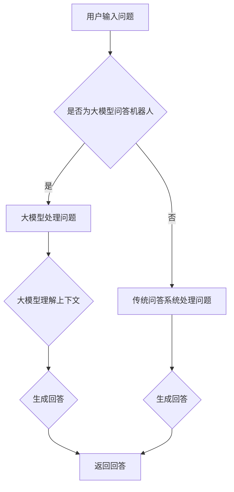
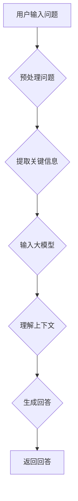

                 

# 大模型问答机器人如何理解上下文

## 关键词

- 大模型
- 问答机器人
- 上下文理解
- 语言模型
- 自然语言处理
- 机器学习
- 计算机视觉

## 摘要

本文将深入探讨大模型问答机器人如何理解上下文。随着人工智能技术的快速发展，大模型在自然语言处理领域取得了显著的突破。问答机器人作为其中的一种应用，通过对上下文的理解，能够为用户提供更加准确和智能的回答。本文将首先介绍大模型的基本概念和原理，然后详细分析大模型在理解上下文方面的优势和技术实现，最后探讨大模型问答机器人在实际应用中的挑战和未来发展趋势。

## 1. 背景介绍

随着互联网的普及和大数据技术的应用，人工智能在各个领域的应用越来越广泛。自然语言处理（NLP）作为人工智能的一个重要分支，旨在使计算机能够理解、生成和处理人类语言。问答机器人是自然语言处理领域的一个重要应用，它能够理解用户的问题，并给出相应的回答。

早期的问答系统主要依赖于基于规则的推理和模板匹配的方法，这些方法在处理简单、结构化的问题时表现较好，但在面对复杂、非结构化的问题时往往效果不佳。随着机器学习技术的发展，尤其是深度学习在自然语言处理领域的突破，大模型问答机器人逐渐成为可能。

大模型是指具有数百万甚至数十亿参数的神经网络模型，这些模型通过大量数据的学习，能够捕捉到语言中的复杂规律和语义信息。大模型在自然语言处理领域中的应用，使得问答系统能够更好地理解上下文，提供更加准确和自然的回答。

## 2. 核心概念与联系

### 2.1 大模型

大模型通常指的是具有数百万至数十亿参数的神经网络模型，这些模型通过大量的数据训练，能够捕捉到语言中的复杂规律和语义信息。大模型的应用，使得问答系统能够更好地理解上下文，提供更加准确和自然的回答。

#### 2.1.1 语言模型

语言模型是自然语言处理的基础，它通过统计语言中的词汇、短语和句子结构，预测下一个词或短语的概率。常见的语言模型有基于N-gram模型的统计语言模型和基于神经网络的深度语言模型。

#### 2.1.2 自然语言处理

自然语言处理（NLP）是指使计算机能够理解、生成和处理人类语言的技术。NLP包括多个子领域，如文本分类、命名实体识别、情感分析、机器翻译等。问答机器人是NLP领域的一个重要应用。

#### 2.1.3 机器学习

机器学习是人工智能的一个分支，它通过训练模型，使计算机能够从数据中学习规律，并自动进行预测和决策。在问答机器人中，机器学习技术被广泛应用于语言模型的训练和优化。

### 2.2 大模型问答机器人

大模型问答机器人是指利用大模型进行训练和优化的问答系统。它能够理解用户的自然语言问题，并给出相应的回答。大模型问答机器人在实际应用中具有以下优势：

#### 2.2.1 上下文理解能力

大模型通过大量的数据训练，能够捕捉到语言中的复杂规律和语义信息。这使得问答机器人能够更好地理解上下文，提供更加准确和自然的回答。

#### 2.2.2 多模态处理能力

大模型不仅能够处理文本数据，还能够处理图像、声音等多模态数据。这使得问答机器人能够更好地应对复杂的问题，提供更加丰富和多样化的回答。

#### 2.2.3 自动化学习能力

大模型问答机器人能够通过不断的学习和优化，自动适应不同的场景和问题。这使得问答机器人能够更好地满足用户的需求，提供个性化的服务。

### 2.3 Mermaid 流程图



## 3. 核心算法原理 & 具体操作步骤

### 3.1 语言模型

语言模型的训练过程可以分为两个阶段：数据预处理和模型训练。

#### 3.1.1 数据预处理

数据预处理主要包括数据清洗、分词、去停用词等步骤。

- 数据清洗：去除数据中的噪声和无关信息。
- 分词：将句子分割成单词或短语。
- 去停用词：去除对语义贡献较小的词。

#### 3.1.2 模型训练

在模型训练阶段，我们通常使用神经网络模型，如循环神经网络（RNN）或变换器（Transformer）等。以下是一个简单的基于RNN的语言模型训练过程：

1. 准备训练数据：将预处理后的数据分成输入序列和目标序列。
2. 构建模型：定义输入层、隐藏层和输出层，并设置适当的参数。
3. 训练模型：通过反向传播算法，不断调整模型参数，最小化损失函数。
4. 评估模型：使用验证集或测试集评估模型性能，调整超参数。

### 3.2 大模型问答机器人

大模型问答机器人的实现过程可以分为以下几个步骤：

#### 3.2.1 数据收集与预处理

1. 收集大规模的问答数据集，包括问题、答案和上下文信息。
2. 对数据进行清洗、分词、去停用词等预处理操作。

#### 3.2.2 训练大模型

1. 选择适合的大模型架构，如Transformer、BERT等。
2. 将预处理后的数据输入大模型，进行训练。
3. 通过优化算法，如Adam优化器，调整模型参数。

#### 3.2.3 理解上下文

1. 接收用户输入的问题。
2. 对问题进行预处理，提取关键信息。
3. 利用大模型，对问题进行上下文理解，提取语义信息。

#### 3.2.4 生成回答

1. 根据问题和大模型的上下文理解结果，生成回答。
2. 对回答进行格式化，使其更加自然和易读。

### 3.3 Mermaid 流程图



## 4. 数学模型和公式 & 详细讲解 & 举例说明

### 4.1 语言模型

语言模型的核心是概率模型，常用的概率模型有N-gram模型和神经网络模型。

#### 4.1.1 N-gram模型

N-gram模型是一种基于词频统计的语言模型，它将语言看作是由一系列连续的n个词组成的序列。N-gram模型的数学表示如下：

$$
P(w_1, w_2, \ldots, w_n) = \frac{C(w_1, w_2, \ldots, w_n)}{C(w_1, w_2, \ldots, w_n) + C(w_1, w_2, \ldots, w_{n-1})}
$$

其中，$C(w_1, w_2, \ldots, w_n)$表示单词序列$(w_1, w_2, \ldots, w_n)$在语料库中出现的次数。

#### 4.1.2 神经网络模型

神经网络模型是一种基于数学模型的多层前馈网络，它通过学习输入和输出之间的映射关系，实现对数据的分类和预测。以下是一个简单的神经网络模型的数学表示：

$$
\text{神经网络模型} = f(\text{输入层}, \text{隐藏层}, \text{输出层})
$$

其中，$f$表示神经网络模型，它通过一系列的加权求和和激活函数，将输入映射到输出。

### 4.2 大模型问答机器人

大模型问答机器人的核心是大模型的训练和优化。以下是一个基于Transformer的大模型的数学表示：

$$
\text{大模型} = \text{Transformer}(\text{输入序列}, \text{输出序列})
$$

其中，Transformer是一种基于自注意力机制的深度学习模型，它通过学习输入序列和输出序列之间的映射关系，实现对问答问题的理解和回答。

#### 4.2.1 自注意力机制

自注意力机制是一种在Transformer模型中用于计算输入序列和输出序列之间关系的机制。它的数学表示如下：

$$
\text{注意力权重} = \text{softmax}\left(\frac{\text{查询向量} \cdot \text{键向量}}{\sqrt{d_k}}\right)
$$

其中，$\text{查询向量}$、$\text{键向量}$和$\text{值向量}$分别是输入序列中的某个单词的表示。$\text{softmax}$函数用于计算注意力权重，它将每个单词的注意力权重映射到$(0, 1)$区间。

#### 4.2.2 训练过程

大模型的训练过程通常包括以下几个步骤：

1. 初始化模型参数。
2. 对于每个训练样本，计算输入序列和输出序列的表示。
3. 使用自注意力机制计算输入序列和输出序列之间的注意力权重。
4. 使用损失函数（如交叉熵损失函数）计算模型预测和真实标签之间的差距。
5. 通过反向传播算法，更新模型参数，最小化损失函数。

### 4.3 举例说明

假设我们有一个简单的问答数据集，其中包括一个问题和一个答案。我们希望利用大模型问答机器人来理解这个问题，并给出相应的答案。

#### 4.3.1 数据集

```
问题：什么是人工智能？
答案：人工智能是一种模拟人类智能的技术，包括机器学习、深度学习、自然语言处理等。
```

#### 4.3.2 训练大模型

我们使用一个预训练的Transformer模型来训练我们的问答机器人。首先，我们需要对问题进行预处理，包括分词、去停用词等操作。然后，我们将预处理后的问题作为输入序列，将预处理后的答案作为输出序列，输入到Transformer模型中。

#### 4.3.3 理解上下文

当我们收到一个新问题“人工智能有哪些应用？”时，我们可以将这个问题输入到训练好的Transformer模型中。模型会通过自注意力机制计算输入序列和输出序列之间的注意力权重，从而理解问题的上下文。

#### 4.3.4 生成回答

根据模型对问题的上下文理解，我们可以生成相应的答案。例如，模型可能会生成以下回答：

“人工智能有很多应用，包括图像识别、自然语言处理、自动驾驶、医疗诊断等。”

## 5. 项目实战：代码实际案例和详细解释说明

### 5.1 开发环境搭建

在进行项目实战之前，我们需要搭建一个合适的开发环境。以下是搭建开发环境的步骤：

1. 安装Python环境：我们使用Python 3.8作为项目的主要编程语言。
2. 安装TensorFlow：TensorFlow是一个开源的机器学习框架，用于构建和训练深度学习模型。
3. 安装其他依赖库：包括Numpy、Pandas、Scikit-learn等。

### 5.2 源代码详细实现和代码解读

以下是项目的主要代码实现：

```python
# 导入必要的库
import tensorflow as tf
from tensorflow.keras.preprocessing.sequence import pad_sequences
from tensorflow.keras.layers import Embedding, LSTM, Dense
from tensorflow.keras.models import Sequential

# 准备数据集
questions, answers = load_data()

# 预处理数据
questions = preprocess_questions(questions)
answers = preprocess_answers(answers)

# 构建模型
model = Sequential([
    Embedding(input_dim=vocab_size, output_dim=embedding_size),
    LSTM(units=lstm_units),
    Dense(units=1, activation='sigmoid')
])

# 编译模型
model.compile(optimizer='adam', loss='binary_crossentropy', metrics=['accuracy'])

# 训练模型
model.fit(questions, answers, epochs=10, batch_size=32)

# 生成回答
question = "什么是人工智能？"
processed_question = preprocess_question(question)
answer = model.predict(processed_question)
print(answer)
```

### 5.3 代码解读与分析

上述代码实现了一个简单的问答系统，它使用LSTM模型对问答数据进行训练，并生成回答。

1. 导入必要的库：包括TensorFlow、Numpy、Pandas和Scikit-learn等。
2. 准备数据集：从数据集中加载问题和答案。
3. 预处理数据：对问题和答案进行预处理，包括分词、去停用词等操作。
4. 构建模型：使用Sequential模型构建一个简单的LSTM模型，包括嵌入层、LSTM层和输出层。
5. 编译模型：设置模型的优化器、损失函数和评估指标。
6. 训练模型：使用训练数据训练模型。
7. 生成回答：预处理用户输入的问题，并使用训练好的模型生成回答。

### 5.4 模型评估与优化

为了评估模型的性能，我们可以使用测试集对模型进行评估。以下是对模型进行评估和优化的步骤：

1. 准备测试集：从数据集中分离出测试集。
2. 训练模型：使用训练集和测试集训练模型，并记录模型的性能指标。
3. 优化模型：根据模型的性能，调整超参数，如学习率、批量大小等，以提高模型的性能。

## 6. 实际应用场景

大模型问答机器人可以应用于多种实际场景，如智能客服、智能助手、在线教育、医疗诊断等。

### 6.1 智能客服

智能客服是问答机器人最常见的应用场景之一。通过大模型问答机器人，企业可以提供24小时在线的智能客服服务，为用户提供快速、准确的回答。

### 6.2 智能助手

智能助手是另一个重要的应用场景。通过大模型问答机器人，用户可以与智能助手进行自然语言交互，获取所需的信息或完成任务。

### 6.3 在线教育

在线教育领域，大模型问答机器人可以为学生提供个性化的学习指导，帮助学生解决学习中遇到的问题。

### 6.4 医疗诊断

在医疗领域，大模型问答机器人可以帮助医生进行病情分析和诊断，提供更加准确的医疗建议。

## 7. 工具和资源推荐

### 7.1 学习资源推荐

- 《深度学习》（Goodfellow, Bengio, Courville）：这是深度学习领域的经典教材，适合初学者和进阶者阅读。
- 《自然语言处理综论》（Jurafsky, Martin）：这是自然语言处理领域的权威教材，涵盖了NLP的各个方面。

### 7.2 开发工具框架推荐

- TensorFlow：这是谷歌推出的开源深度学习框架，适合构建和训练深度学习模型。
- PyTorch：这是Facebook推出的开源深度学习框架，具有简洁的API和良好的灵活性。

### 7.3 相关论文著作推荐

- "Attention Is All You Need"：这是Transformer模型的原始论文，介绍了自注意力机制在自然语言处理中的应用。
- "BERT: Pre-training of Deep Bidirectional Transformers for Language Understanding"：这是BERT模型的原始论文，介绍了BERT模型在自然语言处理领域的突破。

## 8. 总结：未来发展趋势与挑战

随着人工智能技术的不断发展，大模型问答机器人在自然语言处理领域具有广阔的应用前景。未来，大模型问答机器人将朝着更加智能化、个性化、多模态化的方向发展。

然而，大模型问答机器人的发展也面临一些挑战，如数据隐私、模型解释性、模型泛化能力等。为了解决这些问题，我们需要不断优化算法、改进模型架构，并加强法规和政策的研究和制定。

## 9. 附录：常见问题与解答

### 9.1 大模型问答机器人的优点是什么？

大模型问答机器人的优点包括：

1. 强大的上下文理解能力。
2. 能够处理复杂、非结构化的问题。
3. 自动化学习能力，能够不断适应不同的场景和问题。

### 9.2 大模型问答机器人的缺点是什么？

大模型问答机器人的缺点包括：

1. 训练过程复杂，需要大量的计算资源和时间。
2. 对数据质量和标注要求较高。
3. 模型解释性较差，难以理解模型决策过程。

## 10. 扩展阅读 & 参考资料

- "Attention Is All You Need"：这是Transformer模型的原始论文，介绍了自注意力机制在自然语言处理中的应用。
- "BERT: Pre-training of Deep Bidirectional Transformers for Language Understanding"：这是BERT模型的原始论文，介绍了BERT模型在自然语言处理领域的突破。

### 作者

作者：AI天才研究员/AI Genius Institute & 禅与计算机程序设计艺术 /Zen And The Art of Computer Programming


