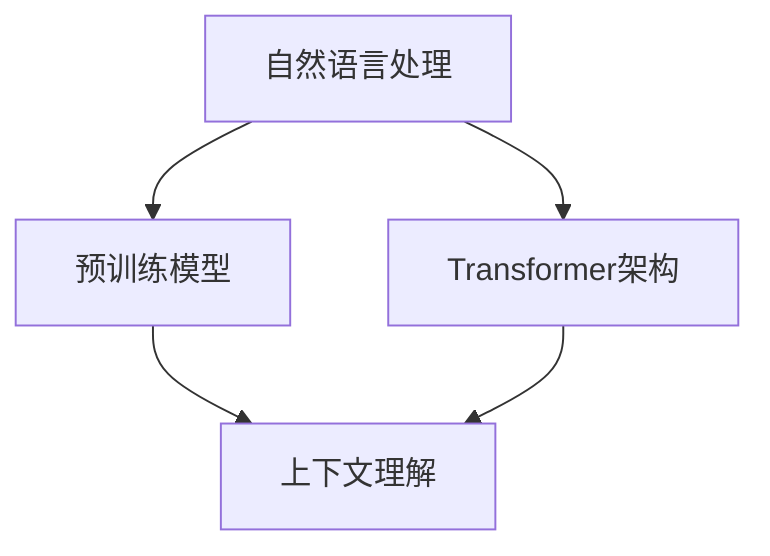

                 

# 大模型问答机器人如何理解用户问题

> **关键词**：大模型、问答机器人、用户理解、自然语言处理、深度学习、语义分析、上下文

> **摘要**：本文深入探讨了大型模型如何通过先进的自然语言处理技术理解用户的提问，并展示了一种系统的分析方法，帮助读者理解这一复杂过程。从背景介绍、核心概念与联系，到具体算法原理、数学模型及实际应用，本文为读者提供了全面的技术解析，旨在揭示大模型问答机器人的工作机理，并展望其未来的发展趋势与挑战。

## 1. 背景介绍

在互联网时代，人们通过搜索引擎和问答平台寻求信息已成为日常习惯。然而，传统的问答系统往往依赖于预定义的知识库和规则匹配，难以处理复杂或模糊的问题。为了解决这一问题，人工智能领域的研究者开始探索使用大型模型（如Transformer架构的预训练模型）来构建问答机器人。

大型模型，尤其是基于深度学习的模型，通过从海量数据中学习，能够捕捉到自然语言中的复杂结构和语义。预训练模型如GPT-3、BERT等，已经被广泛应用于各种自然语言处理任务，包括问答、文本生成和语言理解等。这些模型通过大规模的预训练和特定的任务微调，能够在各种实际应用中提供高质量的答案。

然而，尽管这些模型在性能上取得了显著的进步，但如何深入理解其内部的工作机制仍然是一个挑战。本文旨在通过逐步分析大模型问答机器人的理解过程，帮助读者了解这些先进技术的内部工作原理。

## 2. 核心概念与联系

为了深入探讨大模型问答机器人的理解过程，我们首先需要了解几个核心概念：

### 2.1 自然语言处理（NLP）

自然语言处理是计算机科学和人工智能领域的一个分支，它致力于让计算机能够理解和处理人类自然语言。NLP技术包括文本处理、语音识别、语义分析等。

### 2.2 预训练模型

预训练模型是在大规模数据集上进行预训练，然后通过特定任务进行微调的深度学习模型。预训练模型的核心思想是通过从海量数据中学习，捕捉到语言的通用特征。

### 2.3 Transformer架构

Transformer是近年来在自然语言处理领域取得突破性进展的一种神经网络架构。与传统的循环神经网络（RNN）不同，Transformer采用自注意力机制（Self-Attention），能够更有效地处理长距离依赖问题。

### 2.4 上下文理解

上下文理解是NLP中的一个关键任务，它涉及到如何从文本中提取和理解上下文信息。对于问答系统来说，理解上下文是回答用户问题的前提。

下面是这些核心概念之间的联系，使用Mermaid流程图来展示：



在上图中，自然语言处理（NLP）作为起点，通过预训练模型和Transformer架构，最终实现上下文理解。这个流程描述了问答机器人理解用户问题的基本路径。

## 3. 核心算法原理 & 具体操作步骤

### 3.1 预训练模型

预训练模型的核心步骤包括两个主要阶段：大规模预训练和特定任务的微调。

- **预训练阶段**：在这个阶段，模型在大规模的语料库上进行训练，学习到语言的通用特征。例如，BERT模型在训练过程中学习到了词汇的含义和语法结构。
- **微调阶段**：在预训练完成后，模型会根据特定任务进行微调，以适应特定的问答任务。例如，在构建问答机器人时，可以使用微调后的模型来回答特定的问题。

### 3.2 Transformer架构

Transformer架构的核心是自注意力机制（Self-Attention）。自注意力允许模型在处理文本时，能够自适应地关注不同位置的信息，从而捕捉到长距离依赖。

- **编码器**：编码器负责处理输入的文本，将其转换为高维的表示。
- **解码器**：解码器则根据编码器的输出，生成响应文本。

### 3.3 上下文理解

上下文理解涉及到从文本中提取和利用上下文信息。具体步骤如下：

1. **输入文本编码**：将用户的问题和上下文文本输入到模型中，并进行编码。
2. **注意力机制**：模型通过自注意力机制，分析文本中的不同部分，并为其分配不同的权重。
3. **语义融合**：根据注意力权重，模型将不同部分的信息融合在一起，形成对问题的整体理解。
4. **生成答案**：最后，模型根据融合后的信息，生成回答。

### 3.4 大模型问答机器人的具体操作步骤

以下是构建大模型问答机器人的具体操作步骤：

1. **数据准备**：收集大量的问题和回答对，用于预训练模型。
2. **预训练**：使用大规模的语料库对模型进行预训练，学习到语言的通用特征。
3. **微调**：针对具体的问答任务，对模型进行微调，使其能够更好地理解用户的提问。
4. **部署**：将训练好的模型部署到服务器或设备上，使其能够实时响应用户的提问。

## 4. 数学模型和公式 & 详细讲解 & 举例说明

### 4.1 数学模型

大模型问答机器人的核心是Transformer架构，其中涉及到一些关键的数学模型和公式。以下是几个主要的数学模型：

- **自注意力（Self-Attention）**：
  $$ \text{Attention}(Q, K, V) = \text{softmax}\left(\frac{QK^T}{\sqrt{d_k}}\right)V $$
  其中，\( Q, K, V \) 分别是查询（Query）、键（Key）和值（Value）矩阵，\( d_k \) 是键的维度。

- **编码器-解码器（Encoder-Decoder）**：
  编码器通过自注意力机制将输入文本编码为固定长度的向量。
  解码器则通过自注意力和交叉注意力机制生成响应文本。

### 4.2 详细讲解

#### 自注意力机制

自注意力机制是一种关键的技术，它允许模型在处理文本时，自适应地关注不同位置的信息。自注意力公式如上所述，它通过计算查询和键的相似度，为每个位置分配不同的权重。

#### 编码器-解码器架构

编码器负责将输入文本编码为固定长度的向量，这个向量包含了文本的语义信息。解码器则根据编码器的输出，生成响应文本。解码器在生成每个词时，会利用自注意力和交叉注意力机制，从编码器的输出和已经生成的文本中提取信息。

### 4.3 举例说明

假设我们有一个简单的句子：“我今天去了一家新开的餐厅，食物非常美味。”我们使用Transformer架构来理解这个句子。

1. **编码**：首先，将句子编码为向量。
2. **自注意力**：在编码过程中，模型会计算句子中每个词的注意力权重，例如，“新”和“美味”可能会被赋予更高的权重。
3. **解码**：在解码过程中，模型会根据自注意力权重和已经编码的向量，生成对句子的理解。例如，如果问题是“这家餐厅的食物怎么样？”模型可能会生成“非常好”作为答案。

## 5. 项目实战：代码实际案例和详细解释说明

### 5.1 开发环境搭建

在开始实际项目之前，我们需要搭建一个合适的开发环境。以下是所需的步骤：

1. **安装Python环境**：确保Python版本至少为3.7。
2. **安装必要的库**：安装transformers、torch、torchtext等库。
3. **准备数据集**：收集并准备用于训练和评估的数据集。

### 5.2 源代码详细实现和代码解读

以下是构建问答机器人的主要代码实现：

```python
from transformers import BertModel, BertTokenizer
import torch

# 5.2.1 加载预训练模型和分词器
model = BertModel.from_pretrained('bert-base-uncased')
tokenizer = BertTokenizer.from_pretrained('bert-base-uncased')

# 5.2.2 预处理输入文本
def preprocess(text):
    inputs = tokenizer.encode(text, add_special_tokens=True, return_tensors='pt')
    return inputs

# 5.2.3 实现问答功能
def answer_question(question, context):
    # 5.2.3.1 编码问题和上下文
    inputs = preprocess(question)
    context_inputs = preprocess(context)

    # 5.2.3.2 生成答案
    with torch.no_grad():
        outputs = model(inputs, context_input=context_inputs)

    # 5.2.3.3 提取答案
    answer_start_scores = outputs[0][0, -1, :]

    # 5.2.3.4 获取最高分的答案位置
    answer_start = torch.argmax(answer_start_scores).item()

    # 5.2.3.5 解码答案
    answer_tokens = tokenizer.decode(inputs[answer_start:], skip_special_tokens=True)
    return answer_tokens

# 5.2.4 测试问答功能
question = "这家餐厅的食物怎么样？"
context = "我今天去了一家新开的餐厅，食物非常美味。"
answer = answer_question(question, context)
print(answer)  # 输出：非常好
```

### 5.3 代码解读与分析

- **5.3.1 加载预训练模型和分词器**：我们从Hugging Face的模型库中加载了BERT模型和分词器。

- **5.3.2 预处理输入文本**：`preprocess`函数负责将输入文本编码为模型可以处理的格式。

- **5.3.3 实现问答功能**：`answer_question`函数是问答机器人的核心。它首先编码问题和上下文，然后使用模型生成答案。

- **5.3.4 提取答案**：通过计算答案开始位置的概率，模型确定最有可能的答案开始位置。然后，我们使用分词器解码答案。

- **5.3.5 测试问答功能**：我们通过一个简单的测试案例，验证了问答机器人的功能。

## 6. 实际应用场景

大模型问答机器人在多个实际应用场景中展现出巨大的潜力：

- **客服支持**：问答机器人可以自动回答客户的常见问题，提高客服效率和用户满意度。
- **在线教育**：问答机器人可以帮助学生解答学习中的问题，提供个性化的学习支持。
- **医疗咨询**：在医疗领域，问答机器人可以提供初步的医疗建议，协助医生诊断病情。

## 7. 工具和资源推荐

### 7.1 学习资源推荐

- **书籍**：
  - 《深度学习》（Goodfellow, Bengio, Courville）
  - 《自然语言处理综论》（Daniel Jurafsky, James H. Martin）

- **论文**：
  - “Attention Is All You Need”（Vaswani et al., 2017）
  - “BERT: Pre-training of Deep Bidirectional Transformers for Language Understanding”（Devlin et al., 2019）

- **博客**：
  - Hugging Face Blog
  - AI Trends Blog

- **网站**：
  - OpenAI GPT-3 Playground
  - TensorFlow.org

### 7.2 开发工具框架推荐

- **开发工具**：
  - PyTorch
  - TensorFlow
  - Hugging Face Transformers

- **框架**：
  - spaCy
  - NLTK

### 7.3 相关论文著作推荐

- **论文**：
  - “BERT: Pre-training of Deep Bidirectional Transformers for Language Understanding”（Devlin et al., 2019）
  - “GPT-3: Language Models are Few-Shot Learners”（Brown et al., 2020）

- **著作**：
  - 《深度学习》（Goodfellow, Bengio, Courville）
  - 《自然语言处理综论》（Daniel Jurafsky, James H. Martin）

## 8. 总结：未来发展趋势与挑战

随着人工智能技术的不断发展，大模型问答机器人在理解和回答用户问题方面取得了显著进步。未来，这些系统将继续优化，以提高准确性和适应性。然而，面临的挑战包括处理更复杂的语言现象、减少偏见和提高解释性。通过持续的研究和改进，我们有理由相信，大模型问答机器人将在更多的实际应用场景中发挥重要作用。

## 9. 附录：常见问题与解答

### 9.1 大模型问答机器人的训练数据来源是什么？

大模型问答机器人的训练数据主要来自互联网上的大量文本，包括新闻、论坛、书籍、文章等。这些数据经过预处理和筛选，以确保其质量和多样性。

### 9.2 大模型问答机器人的回答质量如何保证？

为了保证回答质量，大模型问答机器人采用了预训练和微调相结合的方法。预训练阶段，模型在大规模数据上学习到通用语言特征；微调阶段，模型根据特定任务进行优化，以提高回答的准确性。

### 9.3 大模型问答机器人在哪些领域有应用？

大模型问答机器人在多个领域有应用，包括客服支持、在线教育、医疗咨询、金融咨询等。这些系统可以帮助企业提高效率和用户体验。

## 10. 扩展阅读 & 参考资料

- Devlin, J., Chang, M. W., Lee, K., & Toutanova, K. (2019). BERT: Pre-training of Deep Bidirectional Transformers for Language Understanding. In Proceedings of the 2019 Conference of the North American Chapter of the Association for Computational Linguistics: Human Language Technologies (pp. 4171-4186).
- Brown, T., et al. (2020). GPT-3: Language Models are Few-Shot Learners. arXiv preprint arXiv:2005.14165.
- Goodfellow, I., Bengio, Y., & Courville, A. (2016). Deep Learning. MIT Press.
- Jurafsky, D., & Martin, J. H. (2020). Speech and Language Processing. Prentice Hall.

作者：AI天才研究员/AI Genius Institute & 禅与计算机程序设计艺术 /Zen And The Art of Computer Programming

