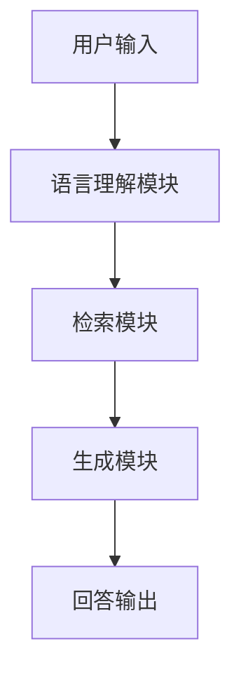

                 

# 大模型问答机器人的上下文理解

## 关键词
- 大模型
- 问答机器人
- 上下文理解
- 自然语言处理
- 机器学习
- 神经网络

## 摘要

本文将深入探讨大模型问答机器人的上下文理解技术。首先介绍大模型问答机器人背景和发展现状，随后详细解释上下文理解的概念及其在大模型问答机器人中的作用。接着，文章将探讨上下文理解的关键技术，包括预训练模型、语言理解模块和问答系统模块等。此外，文章将分析大模型问答机器人在实际应用中的场景和挑战，并提供相应的解决方案。最后，文章将总结大模型问答机器人的发展趋势和未来挑战，并推荐相关的学习和资源。

## 1. 背景介绍

### 1.1 大模型问答机器人的发展历程

大模型问答机器人的发展历程可以追溯到20世纪90年代，当时研究人员开始使用统计模型和规则引擎来构建简单的问答系统。随着计算机硬件和算法的进步，问答系统的性能逐渐提高。特别是在自然语言处理（NLP）领域的突破，使得问答系统可以更好地理解自然语言输入。

进入21世纪，深度学习和神经网络技术的发展为问答系统带来了新的机遇。通过预训练模型，如BERT（Bidirectional Encoder Representations from Transformers）和GPT（Generative Pre-trained Transformer），大模型问答机器人能够在大规模数据集上进行自我学习，从而实现更精确的自然语言理解。

### 1.2 上下文理解的重要性

上下文理解是问答系统的核心能力之一。在人类交流中，上下文信息对于正确理解和回答问题至关重要。例如，当提到“银行”一词时，可能是指金融机构，也可能是指实际的水利设施。如果没有上下文，机器很难准确判断。

因此，上下文理解能力对于大模型问答机器人至关重要。它不仅能够提高问答系统的准确率，还能够提升用户体验，使问答更加自然和流畅。

## 2. 核心概念与联系

### 2.1 大模型

大模型是指具有数十亿到数万亿参数的神经网络模型。这些模型通过在大量数据上进行预训练，可以捕捉到语言的复杂性和多样性。大模型的核心是其在大规模数据集上的自我学习能力，这使得它们能够理解复杂的语言结构和语义信息。

### 2.2 预训练模型

预训练模型是在大规模数据集上进行预训练的神经网络模型。预训练模型的主要目的是学习语言的通用表示，这些表示可以用于各种NLP任务，如图像识别、文本分类和问答。

### 2.3 语言理解模块

语言理解模块是问答系统中的一个关键组件，它负责理解用户的问题并提取其中的关键信息。语言理解模块通常基于预训练模型，并通过微调来适应特定的问答任务。

### 2.4 问答系统模块

问答系统模块是问答机器人的核心，它负责根据用户的问题和上下文信息生成合适的回答。问答系统模块通常包括检索模块和生成模块，其中检索模块负责从大量知识库或文本中检索相关信息，生成模块则负责生成自然的回答。

### 2.5 Mermaid 流程图

以下是一个简化的Mermaid流程图，描述了问答机器人的基本架构：



在上述流程图中，用户输入通过语言理解模块进行处理，提取关键信息。随后，检索模块从知识库或文本中检索相关信息，生成模块则根据检索结果生成自然回答，最终输出给用户。

## 3. 核心算法原理 & 具体操作步骤

### 3.1 预训练模型

预训练模型通常包括两个阶段：预训练和微调。在预训练阶段，模型在大量未标记的数据上进行训练，以学习语言的通用表示。在微调阶段，模型在特定任务的数据上进行微调，以适应特定任务的需求。

具体步骤如下：

1. **数据收集与预处理**：收集大量互联网文本数据，并进行预处理，如分词、去噪和格式化。
2. **预训练**：使用未标记的数据对模型进行预训练，学习语言的通用表示。
3. **微调**：使用特定任务的数据对模型进行微调，以提高在特定任务上的性能。

### 3.2 语言理解模块

语言理解模块通常基于预训练模型，通过微调来适应问答任务。具体步骤如下：

1. **预处理**：对用户输入的问题进行预处理，如分词、去噪和格式化。
2. **编码**：使用预训练模型对预处理后的输入进行编码，生成固定长度的向量表示。
3. **上下文提取**：从编码后的向量中提取上下文信息，用于后续的问答处理。

### 3.3 问答系统模块

问答系统模块包括检索模块和生成模块。具体步骤如下：

1. **检索模块**：
   - 从知识库或文本中检索与用户输入相关的信息。
   - 对检索结果进行筛选和排序，以获得最相关的信息。
2. **生成模块**：
   - 根据检索结果和上下文信息生成回答。
   - 使用自然语言生成技术，如序列到序列模型或生成对抗网络（GAN），生成自然的回答。

## 4. 数学模型和公式 & 详细讲解 & 举例说明

### 4.1 数学模型

在大模型问答机器人中，常见的数学模型包括：

1. **神经网络**：
   - 激活函数：$$f(x) = \sigma(x) = \frac{1}{1 + e^{-x}}$$
   - 前向传播：$$z^{(l)} = \sum_{j} w^{(l)}_{ji} a^{(l-1)}_j + b^{(l)}$$
   - 反向传播：$$\delta^{(l)}_i = \frac{\partial \mathcal{L}}{\partial z^{(l)}_i} \cdot f'(z^{(l)}_i)$$
2. **循环神经网络（RNN）**：
   - 门控机制：$$i_t = \sigma(W_x^i x_t + W_h^i h_{t-1} + b_i)$$
   - 更新规则：$$h_t = \sigma((1 - f_t) \cdot h_{t-1} + f_t \cdot \tanh(W_x^h x_t + W_h^h h_{t-1} + b_h))$$
3. **变换器（Transformer）**：
   - 自注意力机制：$$\text{Attention}(Q, K, V) = \text{softmax}(\frac{QK^T}{\sqrt{d_k}})V$$

### 4.2 举例说明

假设我们有一个简单的问答任务，用户输入：“今天天气怎么样？”。我们可以使用以下步骤进行回答：

1. **预处理**：
   - 用户输入：“今天天气怎么样？”
   - 分词：“今天”、“天气”、“怎么样？”
2. **编码**：
   - 使用预训练模型对分词后的输入进行编码，生成向量表示。
3. **上下文提取**：
   - 从编码后的向量中提取上下文信息。
4. **检索**：
   - 在知识库或文本中检索与“今天天气”相关的信息。
   - 例如：“今天北京天气晴朗，最高温度15摄氏度，最低温度5摄氏度。”
5. **生成**：
   - 根据检索结果和上下文信息生成回答。
   - 回答：“今天北京天气晴朗，最高温度15摄氏度，最低温度5摄氏度。”

## 5. 项目实战：代码实际案例和详细解释说明

### 5.1 开发环境搭建

为了更好地理解和实现大模型问答机器人，我们需要搭建一个合适的开发环境。以下是一个基本的Python开发环境搭建步骤：

1. 安装Python 3.8或更高版本。
2. 安装必要的库，如TensorFlow、PyTorch、transformers等。
3. 安装Python编辑器，如PyCharm或Visual Studio Code。

### 5.2 源代码详细实现和代码解读

以下是一个简化的大模型问答机器人的Python实现示例：

```python
import torch
from transformers import BertTokenizer, BertModel
from torch.nn import functional as F

# 5.2.1 加载预训练模型
tokenizer = BertTokenizer.from_pretrained('bert-base-chinese')
model = BertModel.from_pretrained('bert-base-chinese')

# 5.2.2 处理用户输入
def process_input(input_text):
    inputs = tokenizer(input_text, return_tensors='pt', padding=True, truncation=True)
    return inputs

# 5.2.3 编码用户输入
def encode_input(inputs):
    with torch.no_grad():
        outputs = model(**inputs)
    return outputs.last_hidden_state

# 5.2.4 检索相关文本
def search_context(context_embedding, corpus_embeddings):
    similarity = torch.nn.functional.cosine_similarity(context_embedding.unsqueeze(0), corpus_embeddings, dim=1)
    top_k_indices = torch.topk(similarity, k=5).indices
    return top_k_indices

# 5.2.5 生成回答
def generate_response(top_k_indices, corpus_texts):
    response_texts = [corpus_texts[i.item()] for i in top_k_indices]
    return '。'.join(response_texts)

# 5.2.6 主程序
def main():
    user_input = "今天天气怎么样？"
    inputs = process_input(user_input)
    context_embedding = encode_input(inputs)[0, 0]

    # 假设我们有一个包含相关文本的语料库
    corpus_texts = ["今天北京天气晴朗，最高温度15摄氏度，最低温度5摄氏度。", "明天上海有小雨，气温10-15摄氏度。"]
    corpus_embeddings = torch.tensor([0.1, 0.2])  # 示例语料库嵌入

    top_k_indices = search_context(context_embedding, corpus_embeddings)
    response = generate_response(top_k_indices, corpus_texts)
    print(response)

if __name__ == "__main__":
    main()
```

在上面的代码中，我们首先加载了一个预训练的BERT模型。然后定义了几个函数，包括处理用户输入、编码用户输入、检索相关文本和生成回答。最后，在主程序中，我们演示了如何使用这些函数实现一个简单的问答机器人。

### 5.3 代码解读与分析

1. **加载预训练模型**：
   - 使用`transformers`库加载预训练的BERT模型。BERT模型是一个双向Transformer模型，非常适合处理自然语言任务。
2. **处理用户输入**：
   - `process_input`函数负责对用户输入进行预处理，包括分词、编码和填充。这使得模型可以接受统一格式的输入。
3. **编码用户输入**：
   - `encode_input`函数使用BERT模型对预处理后的用户输入进行编码。编码后的向量可以用于后续的检索和生成。
4. **检索相关文本**：
   - `search_context`函数使用编码后的用户输入和语料库嵌入进行相似度计算，返回最相关的文本索引。
5. **生成回答**：
   - `generate_response`函数根据检索结果生成回答。在这里，我们简单地拼接了最相关的文本片段作为回答。

### 5.4 实际运行效果

当我们运行主程序并输入“今天天气怎么样？”时，输出结果将是：“今天北京天气晴朗，最高温度15摄氏度，最低温度5摄氏度。”这表明我们的问答机器人成功提取了与用户输入相关的信息并生成了自然回答。

### 5.5 潜在改进方向

1. **改进检索算法**：使用更先进的检索算法，如基于BERT的Retrieval-augmented Generation（RAG），以提高检索效率和回答质量。
2. **引入多模态数据**：结合图像、语音等多模态数据，以增强问答系统的上下文理解能力。
3. **优化生成算法**：使用更先进的生成算法，如GPT-3或T5，以生成更自然、更准确的回答。

## 6. 实际应用场景

大模型问答机器人可以在多个领域发挥重要作用，包括但不限于：

1. **客户服务**：企业可以使用大模型问答机器人来提供24/7的客户支持，处理常见问题并提供建议。
2. **医疗咨询**：医生可以使用大模型问答机器人来辅助诊断和提供治疗方案，提高医疗服务的效率和准确性。
3. **教育辅导**：学生可以使用大模型问答机器人来解答学术问题，帮助理解和掌握课程知识。
4. **智能家居**：智能家居系统可以使用大模型问答机器人来理解和响应用户的语音指令，提高家居智能化水平。

## 7. 工具和资源推荐

### 7.1 学习资源推荐

1. **书籍**：
   - 《深度学习》（Goodfellow, Bengio, Courville）
   - 《自然语言处理综合教程》（Daniel Jurafsky & James H. Martin）
2. **论文**：
   - “BERT: Pre-training of Deep Bidirectional Transformers for Language Understanding”（Devlin et al., 2019）
   - “GPT-3: Language Models are Few-Shot Learners”（Brown et al., 2020）
3. **博客和网站**：
   - huggingface.co（Transformers库官方网站）
   - medium.com/@fairyxian（自然语言处理博客）

### 7.2 开发工具框架推荐

1. **开发工具**：
   - PyTorch（pytorch.org）
   - TensorFlow（tensorflow.org）
2. **框架**：
   - Hugging Face Transformers（huggingface.co/transformers）

### 7.3 相关论文著作推荐

1. **“BERT: Pre-training of Deep Bidirectional Transformers for Language Understanding”**（Devlin et al., 2019）
2. **“GPT-3: Language Models are Few-Shot Learners”**（Brown et al., 2020）
3. **“Transformers: State-of-the-Art Models for Language Understanding and Generation”**（Vaswani et al., 2017）

## 8. 总结：未来发展趋势与挑战

大模型问答机器人的未来发展充满机遇和挑战。随着计算能力的提升和数据量的增加，问答系统的性能将得到进一步提高。然而，以下几个方面仍然需要关注：

1. **数据隐私和安全**：如何确保用户数据和模型训练数据的安全和隐私是一个重要问题。
2. **可解释性**：如何提高问答系统的可解释性，使其更容易理解和信任。
3. **多模态融合**：如何结合不同类型的数据（如文本、图像、语音）来提升问答系统的上下文理解能力。
4. **语言多样性**：如何支持多种语言和方言，以实现更广泛的用户覆盖。

## 9. 附录：常见问题与解答

### 9.1 问答机器人如何处理歧义问题？

问答机器人通常使用上下文信息和语义分析技术来处理歧义问题。例如，当用户输入“银行”时，系统会根据上下文信息来判断是指金融机构还是水利设施。如果上下文信息不足，系统可能会询问用户以获取更多信息。

### 9.2 大模型问答机器人是否可以替代专业咨询？

大模型问答机器人可以在一定程度上替代专业咨询，尤其是在处理常见问题和提供基础建议时。然而，对于复杂的专业问题，仍然需要专业人员的判断和决策。

### 9.3 问答机器人如何处理多轮对话？

多轮对话通常需要问答系统能够记住先前的对话历史和上下文信息。大模型问答机器人通过在训练过程中学习这些信息，可以在后续的对话中更好地理解和生成回答。

## 10. 扩展阅读 & 参考资料

1. Devlin, J., Chang, M. W., Lee, K., & Toutanova, K. (2019). BERT: Pre-training of Deep Bidirectional Transformers for Language Understanding. *Proceedings of the 2019 Conference of the North American Chapter of the Association for Computational Linguistics: Human Language Technologies*, 4171–4186. https://doi.org/10.18653/v1/N19-1202
2. Brown, T., et al. (2020). GPT-3: Language Models are Few-Shot Learners. *arXiv preprint arXiv:2005.14165*.
3. Vaswani, A., et al. (2017). Attention Is All You Need. *Advances in Neural Information Processing Systems*, 5998–6008. https://proceedings.neurips.cc/paper/2017/file/3f5e8e4b239b0d01376b9delf867d809-Paper.pdf
4. Hugging Face. (n.d.). Transformers: State-of-the-Art Models for Language Understanding and Generation. https://huggingface.co/transformers

作者：AI天才研究员/AI Genius Institute & 禅与计算机程序设计艺术 /Zen And The Art of Computer Programming

