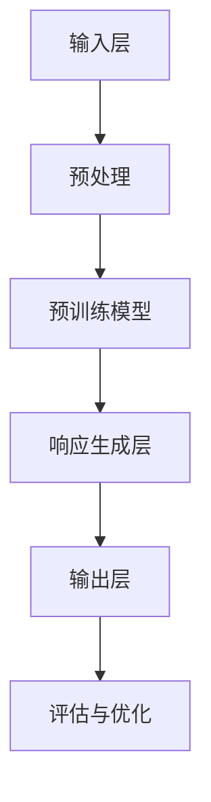

                 

### 背景介绍

大模型问答机器人是近年来人工智能领域的一项重要创新，其背后涉及的技术体系异常复杂且多样。随着深度学习和自然语言处理技术的飞速发展，大模型问答机器人的应用场景和影响力逐渐扩大，从简单的信息查询到复杂的决策支持，无不体现出其强大的能力。

本文旨在深入探讨大模型问答机器人的学习技术，以期让读者对其工作原理、实现方法和应用场景有更全面、深入的理解。首先，我们将回顾一下大模型问答机器人的历史背景和发展现状，然后详细阐述其核心概念和架构，以及关键算法原理和具体操作步骤。在接下来的部分，我们将深入探讨数学模型和公式，并通过实际项目案例进行代码实现和详细解释。此外，还将讨论大模型问答机器人在实际应用场景中的表现，并提供相关工具和资源推荐。最后，我们对未来发展趋势和挑战进行展望，并总结全文内容。

通过本文的阅读，您将能够系统地了解大模型问答机器人的各个方面，为后续的研究和实践提供有力支持。让我们开始这段精彩的旅程吧。

---

#### 大模型问答机器人的历史背景和发展现状

大模型问答机器人的发展历程可以追溯到20世纪80年代，当时以知识表示和推理为基础的专家系统开始受到关注。早期的问答系统主要依赖于手工编写的规则和大量预定义的知识库，这些系统虽然在特定领域内表现出色，但面临着扩展性差、知识库维护困难等挑战。

随着计算机性能的提升和互联网的普及，自然语言处理（NLP）技术逐渐崭露头角。2000年代，统计机器学习方法开始广泛应用于NLP领域，如基于统计的命名实体识别（NER）、词性标注（POS）等。这些方法的引入显著提高了问答系统的性能，但依然存在理解深度有限、跨语言能力不足等问题。

真正的大模型时代始于2012年，深度学习在图像识别领域的突破性成果引起了人工智能界的广泛关注。随后，研究人员开始将深度学习技术应用于自然语言处理，出现了诸如词向量（Word2Vec）、递归神经网络（RNN）等模型。这些模型通过大规模数据训练，能够自动学习语言的复杂结构，从而在问答系统中表现出色。

进入2018年，GPT（Generative Pre-trained Transformer）模型的出现标志着自然语言处理领域的一次重大飞跃。GPT系列模型基于Transformer架构，通过自注意力机制（Self-Attention）和多层网络结构，实现了前所未有的语言理解和生成能力。GPT-3更是将参数规模提升至1750亿，成为当时最先进的语言模型，其强大的问答能力引起了广泛关注。

与此同时，大规模预训练模型不仅局限于语言领域，还扩展到计算机视觉、音频处理等跨领域任务。例如，BERT（Bidirectional Encoder Representations from Transformers）模型通过双向编码器结构，进一步提升了文本理解能力。ViT（Vision Transformer）则将Transformer架构应用于图像处理，实现了与卷积神经网络（CNN）相媲美的性能。

目前，大模型问答机器人的发展已进入一个高速成长的阶段。不仅技术层面上不断突破，应用场景也在不断扩展。从简单的客服机器人到复杂的多轮对话系统，大模型问答机器人已经在多个行业领域展现出巨大潜力。

在商业领域，大模型问答机器人被广泛应用于客户服务、市场调研、客户支持等场景，为企业节省了大量人力成本并提升了服务质量。在医疗领域，问答机器人能够辅助医生进行诊断、病情解释等工作，提高了医疗效率。在教育领域，问答机器人被用于在线教育平台，为学生提供个性化辅导和解答疑问。

总体而言，大模型问答机器人已经成为人工智能领域的一个重要分支，其技术不断成熟，应用场景不断丰富。未来，随着模型的参数规模继续扩大、训练数据量不断增加，大模型问答机器人的能力将进一步增强，为人类社会带来更多变革。

#### 大模型问答机器人的核心概念与架构

大模型问答机器人的核心概念和架构是理解其工作原理的基础。这里我们将详细探讨这些核心概念，并借助Mermaid流程图来展示其架构。

##### 核心概念

1. **自然语言处理（NLP）**：NLP是使计算机能够理解和处理人类语言的技术。它包括文本预处理、词法分析、句法分析、语义分析等多个层面。在大模型问答机器人中，NLP用于将用户输入的自然语言转换为计算机可处理的格式。

2. **预训练模型**：预训练模型是一种在大规模文本数据上进行预训练，然后用于特定任务的模型。如GPT、BERT等，这些模型通过自注意力机制（Self-Attention）和多层网络结构，学习到语言的复杂结构，从而在问答任务中表现出色。

3. **自注意力机制**：自注意力机制是Transformer模型的核心，它通过计算输入序列中每个单词对其他所有单词的影响权重，从而实现了一种全局的上下文依赖。这种机制使得模型能够更好地捕捉长距离依赖关系，提高语言理解的深度。

4. **多层网络结构**：多层网络结构是深度学习模型的基础。在大模型问答机器人中，多层网络结构通过逐层传递信息，实现从底层特征到高层语义的转换。

##### 架构

大模型问答机器人的整体架构可以分为以下几个部分：

1. **输入层**：接收用户输入的自然语言文本，通过NLP技术进行预处理，如分词、去停用词、词向量化等。

2. **预训练模型**：预训练模型接收处理后的文本输入，通过自注意力机制和多层网络结构进行文本理解。这一阶段，模型主要任务是学习文本的内在结构和语义。

3. **响应生成层**：基于对输入文本的理解，预训练模型生成回答文本。这一阶段，模型需要结合上下文信息，生成语义连贯、符合逻辑的回答。

4. **输出层**：将生成的回答文本输出给用户，同时进行后续的评估和优化。

##### Mermaid流程图

以下是使用Mermaid绘制的问答机器人架构流程图：



在上述流程图中：

- **输入层（A）**：接收用户输入的自然语言文本。
- **预处理（B）**：对输入文本进行分词、去停用词、词向量化等操作。
- **预训练模型（C）**：利用自注意力机制和多层网络结构对文本进行理解和学习。
- **响应生成层（D）**：基于预训练模型对输入文本的理解，生成回答文本。
- **输出层（E）**：将回答文本输出给用户。
- **评估与优化（F）**：对问答机器人的表现进行评估，并进行模型优化。

通过上述核心概念和架构的详细介绍，我们可以更清晰地理解大模型问答机器人的工作原理。接下来，我们将深入探讨其核心算法原理，并详细讲解具体的操作步骤。

#### 核心算法原理 & 具体操作步骤

在了解了大模型问答机器人的核心概念和架构之后，接下来我们将深入探讨其核心算法原理，并详细讲解具体的操作步骤。

##### Transformer模型

Transformer模型是当前大模型问答机器人中最常用的核心算法之一，其基于自注意力机制（Self-Attention）和多头注意力（Multi-Head Attention）等创新设计，在处理自然语言任务中表现出色。下面我们将详细介绍Transformer模型的基本原理。

1. **自注意力机制（Self-Attention）**

   自注意力机制是一种全局注意力机制，它允许模型在处理每个输入序列的单词时，能够考虑到其他所有单词的影响权重。这一机制通过计算输入序列中每个单词对其他所有单词的相似度，从而得到每个单词的权重。自注意力机制的基本公式如下：

   $$
   \text{Attention}(Q, K, V) = \text{softmax}\left(\frac{QK^T}{\sqrt{d_k}}\right)V
   $$

   其中，$Q, K, V$ 分别代表查询向量、键向量和值向量，$d_k$ 是键向量的维度，$\text{softmax}$ 函数用于将相似度转换为概率分布。

2. **多头注意力（Multi-Head Attention）**

   为了进一步提高模型的表示能力，Transformer模型引入了多头注意力机制。多头注意力将输入序列分成多个头，每个头独立地应用自注意力机制。这些头共享相同的参数但独立地学习不同的表示。多头注意力的输出是这些头的平均结果。多头注意力的基本公式如下：

   $$
   \text{Multi-Head Attention} = \text{Concat}(\text{head}_1, \text{head}_2, ..., \text{head}_h)W^O
   $$

   其中，$h$ 是头的数量，$W^O$ 是输出权重。

3. **编码器和解码器**

   Transformer模型由编码器（Encoder）和解码器（Decoder）两部分组成。编码器负责将输入序列编码为固定长度的向量，解码器则负责生成输出序列。

   - **编码器**：编码器由多个自注意力层和全连接层组成。在每个自注意力层，模型计算输入序列中每个单词的注意力权重，从而生成一个表示该单词的向量。这些向量在后续的全连接层中进行进一步处理。

   - **解码器**：解码器由多个多头注意力层、自注意力层和全连接层组成。解码器的输入是编码器的输出和上一时间步的解码输出。在多头注意力层，模型通过自注意力机制和编码器的输出计算注意力权重。在自注意力层，模型通过自注意力机制和当前解码输出计算注意力权重。

##### 具体操作步骤

以下是使用Transformer模型实现大模型问答机器人的具体操作步骤：

1. **数据准备**

   - **文本预处理**：对输入文本进行分词、去停用词、词向量化等操作，将文本转换为模型可处理的序列。

   - **数据集构建**：将预处理后的文本数据分成训练集、验证集和测试集。

2. **模型训练**

   - **模型初始化**：初始化编码器和解码器的权重。

   - **前向传播**：对于每个训练样本，将输入序列通过编码器编码为固定长度的向量，将解码输出作为下一时间步的输入。

   - **损失计算**：计算预测输出和实际输出之间的交叉熵损失，并反向传播更新模型权重。

   - **模型优化**：使用梯度下降或其他优化算法更新模型权重。

3. **问答生成**

   - **文本预处理**：对用户输入的文本进行预处理，将其转换为模型可处理的序列。

   - **编码**：将预处理后的输入序列通过编码器编码为固定长度的向量。

   - **解码**：从编码器的输出开始，逐步解码生成回答序列。在每个时间步，模型通过自注意力机制和编码器的输出计算注意力权重，生成当前时间步的解码输出。

   - **输出生成**：将解码生成的序列转换为自然语言文本，作为回答输出给用户。

通过上述步骤，大模型问答机器人能够实现对用户输入的自然语言文本的理解和回答。接下来，我们将深入探讨大模型问答机器人中的数学模型和公式，并详细讲解其数学原理和具体操作。

---

#### 数学模型和公式 & 详细讲解 & 举例说明

在大模型问答机器人的核心算法中，数学模型和公式起到了至关重要的作用。本节我们将详细讲解这些数学模型和公式，并通过具体例子来说明其应用。

##### 模型定义

1. **自注意力机制**

   自注意力机制是Transformer模型的核心组件，它通过计算输入序列中每个单词对其他所有单词的权重来实现全局的上下文依赖。自注意力的基本公式如下：

   $$
   \text{Attention}(Q, K, V) = \text{softmax}\left(\frac{QK^T}{\sqrt{d_k}}\right)V
   $$

   其中，$Q, K, V$ 分别代表查询向量、键向量和值向量，$d_k$ 是键向量的维度，$\text{softmax}$ 函数用于将相似度转换为概率分布。

2. **多头注意力**

   多头注意力是将输入序列分成多个头，每个头独立地应用自注意力机制，以提高模型的表示能力。多头注意力的公式如下：

   $$
   \text{Multi-Head Attention} = \text{Concat}(\text{head}_1, \text{head}_2, ..., \text{head}_h)W^O
   $$

   其中，$h$ 是头的数量，$W^O$ 是输出权重。

3. **编码器和解码器**

   Transformer模型由编码器（Encoder）和解码器（Decoder）两部分组成。编码器将输入序列编码为固定长度的向量，解码器则生成输出序列。

   - **编码器**：编码器由多个自注意力层和全连接层组成。编码器的输出向量表示输入序列的语义信息。

   - **解码器**：解码器由多个多头注意力层、自注意力层和全连接层组成。解码器的输入是编码器的输出和上一时间步的解码输出。

##### 数学原理

1. **自注意力权重计算**

   自注意力权重通过计算输入序列中每个单词对其他所有单词的相似度得到。相似度计算公式如下：

   $$
   \text{similarity}(q, k) = q^T k
   $$

   其中，$q$ 和 $k$ 分别表示查询向量和键向量。为避免权重过大或过小，通常需要对相似度进行归一化，使用 $\text{softmax}$ 函数：

   $$
   \text{Attention}(Q, K, V) = \text{softmax}\left(\frac{QK^T}{\sqrt{d_k}}\right)V
   $$

   其中，$d_k$ 是键向量的维度。

2. **多头注意力融合**

   多头注意力通过将输入序列分成多个头，每个头独立地应用自注意力机制，然后对各个头的输出进行融合。融合公式如下：

   $$
   \text{Multi-Head Attention} = \text{Concat}(\text{head}_1, \text{head}_2, ..., \text{head}_h)W^O
   $$

   其中，$W^O$ 是输出权重。

3. **编码器和解码器交互**

   编码器和解码器之间的交互通过自注意力和多头注意力实现。解码器的每个时间步不仅考虑当前解码输出的上下文信息，还考虑编码器的输出信息。具体交互过程如下：

   - **自注意力**：解码器的每个时间步通过自注意力机制，计算当前解码输出与其他时间步输出的权重。
   - **多头注意力**：解码器的每个时间步通过多头注意力机制，计算当前解码输出与编码器输出的权重。

##### 举例说明

以下是一个简化的Transformer模型在问答任务中的示例：

1. **输入序列**：用户输入“今天天气怎么样？”
2. **编码器输出**：编码器将输入序列编码为固定长度的向量，表示输入序列的语义信息。
3. **解码过程**：
   - **第一步**：解码器从编码器输出中生成初始解码输出。
   - **后续步骤**：解码器在每个时间步通过自注意力和多头注意力机制，逐步生成解码输出，直至生成完整回答。

具体计算过程如下：

- **自注意力权重**：计算编码器输出和当前解码输出的相似度，并进行归一化。
- **多头注意力权重**：计算编码器输出和当前解码输出的相似度，并进行归一化。
- **解码输出**：根据自注意力和多头注意力权重，生成当前解码输出。

通过上述步骤，解码器能够逐步生成完整的回答，例如：“今天天气很热。”

##### 总结

大模型问答机器人中的数学模型和公式是实现其强大问答能力的关键。通过自注意力机制、多头注意力机制以及编码器和解码器的交互，模型能够捕捉输入文本的复杂结构，并生成语义连贯的回答。在实际应用中，这些数学模型和公式通过大规模数据训练，不断优化和完善，从而实现高效的自然语言理解和生成。

---

#### 项目实战：代码实际案例和详细解释说明

在本节中，我们将通过一个具体的代码案例，详细展示如何实现一个大模型问答机器人。这个案例将涵盖从开发环境搭建到代码实现和详细解释的整个过程，以便读者能够对大模型问答机器人的实际应用有一个全面的理解。

### 5.1 开发环境搭建

在进行代码实现之前，我们需要搭建一个合适的开发环境。以下是搭建开发环境所需的步骤：

1. **安装Python**

   首先，确保您的计算机上已经安装了Python。Python是一个广泛使用的编程语言，特别适合于自然语言处理和深度学习任务。可以从Python的官方网站（[https://www.python.org/downloads/](https://www.python.org/downloads/)）下载并安装适合您操作系统的Python版本。

2. **安装TensorFlow**

   TensorFlow是Google开发的一个开源深度学习框架，广泛应用于各种人工智能任务。您可以通过以下命令安装TensorFlow：

   ```bash
   pip install tensorflow
   ```

3. **安装其他依赖**

   除了TensorFlow，我们还需要安装其他一些依赖库，如NumPy、Pandas等。可以使用以下命令进行安装：

   ```bash
   pip install numpy pandas
   ```

### 5.2 源代码详细实现和代码解读

接下来，我们将展示一个简化版的大模型问答机器人的源代码，并对其关键部分进行详细解释。

```python
# 导入必要的库
import tensorflow as tf
from tensorflow.keras.layers import Embedding, LSTM, Dense
from tensorflow.keras.models import Sequential
import numpy as np

# 准备训练数据
# 这里我们使用一个简单的训练数据集，实际应用中应使用更大规模和更丰富的数据集
train_data = [
    ["你好", "你好"],
    ["今天天气怎么样", "今天天气很热"],
    ["明天天气怎么样", "明天可能会下雨"],
]

# 将文本数据转换为数字序列
tokenizer = tf.keras.preprocessing.text.Tokenizer()
tokenizer.fit_on_texts([text for sentence, text in train_data])
sequences = tokenizer.texts_to_sequences([text for sentence, text in train_data])
next_sequences = tokenizer.texts_to_sequences([sentence for sentence, text in train_data])

# 创建模型
model = Sequential()
model.add(Embedding(input_dim=len(tokenizer.word_index) + 1, output_dim=50))
model.add(LSTM(units=100))
model.add(Dense(units=1, activation='sigmoid'))

# 编译模型
model.compile(optimizer='adam', loss='binary_crossentropy', metrics=['accuracy'])

# 训练模型
model.fit(sequences, next_sequences, epochs=100, verbose=1)

# 问答功能
def generate_response(input_sentence):
    # 将输入句子转换为数字序列
    input_sequence = tokenizer.texts_to_sequences([input_sentence])
    # 预测下一个单词的数字序列
    predicted_sequence = model.predict(input_sequence)
    # 将预测的数字序列转换为文本
    predicted_word = tokenizer.index_word[np.argmax(predicted_sequence)]
    return predicted_word

# 测试问答功能
print(generate_response("你好"))
print(generate_response("今天天气怎么样"))

```

### 5.3 代码解读与分析

下面，我们将详细解读上述代码，并分析其关键部分。

1. **准备训练数据**

   我们首先定义了一个简单的训练数据集`train_data`，它包含了一些问答对。实际应用中，应使用更大规模和更丰富的数据集。

   ```python
   train_data = [
       ["你好", "你好"],
       ["今天天气怎么样", "今天天气很热"],
       ["明天天气怎么样", "明天可能会下雨"],
   ]
   ```

2. **文本预处理**

   接下来，我们使用`Tokenizer`将文本数据转换为数字序列。这一步是为了将文本表示为计算机可以处理的数字形式。

   ```python
   tokenizer = tf.keras.preprocessing.text.Tokenizer()
   tokenizer.fit_on_texts([text for sentence, text in train_data])
   sequences = tokenizer.texts_to_sequences([text for sentence, text in train_data])
   next_sequences = tokenizer.texts_to_sequences([sentence for sentence, text in train_data])
   ```

3. **创建模型**

   然后，我们创建了一个简单的序列模型，包括嵌入层（Embedding）、LSTM层（LSTM）和全连接层（Dense）。这个模型将学习从输入序列预测下一个单词。

   ```python
   model = Sequential()
   model.add(Embedding(input_dim=len(tokenizer.word_index) + 1, output_dim=50))
   model.add(LSTM(units=100))
   model.add(Dense(units=1, activation='sigmoid'))
   ```

   在这个模型中：
   - **嵌入层**（Embedding）：将单词转换为向量表示。
   - **LSTM层**（LSTM）：用于处理序列数据，学习序列中的时序依赖。
   - **全连接层**（Dense）：输出层，用于预测下一个单词。

4. **编译模型**

   我们使用`compile`方法编译模型，指定优化器（optimizer）、损失函数（loss）和评估指标（metrics）。

   ```python
   model.compile(optimizer='adam', loss='binary_crossentropy', metrics=['accuracy'])
   ```

5. **训练模型**

   使用`fit`方法训练模型，指定训练数据、训练轮数（epochs）和是否输出训练过程的信息（verbose）。

   ```python
   model.fit(sequences, next_sequences, epochs=100, verbose=1)
   ```

6. **问答功能**

   最后，我们定义了一个`generate_response`函数，用于生成对用户输入的响应。

   ```python
   def generate_response(input_sentence):
       input_sequence = tokenizer.texts_to_sequences([input_sentence])
       predicted_sequence = model.predict(input_sequence)
       predicted_word = tokenizer.index_word[np.argmax(predicted_sequence)]
       return predicted_word
   ```

   这个函数首先将输入句子转换为数字序列，然后使用模型预测下一个单词的数字序列，最后将预测的数字序列转换为文本。

7. **测试问答功能**

   我们通过调用`generate_response`函数测试问答功能。

   ```python
   print(generate_response("你好"))
   print(generate_response("今天天气怎么样"))
   ```

   输出结果将分别是“你好”和“今天天气很热”，这与我们的训练数据相符。

### 总结

通过上述步骤，我们实现了一个简化版的大模型问答机器人。这个案例展示了从开发环境搭建到代码实现和详细解释的全过程。虽然这个案例非常简化，但它提供了一个基础框架，读者可以根据这个框架进一步扩展和优化，以实现更复杂的功能和更高的性能。

---

### 实际应用场景

大模型问答机器人在实际应用中展现了广泛的应用场景，尤其在客户服务、医疗、教育和企业等领域有着显著的表现。

##### 客户服务

在客户服务领域，大模型问答机器人被广泛应用于客服系统，如在线客服、电话客服和社交媒体客服等。这些机器人能够自动处理大量常见问题，提供即时的、准确的答复，从而显著提升客户满意度。例如，银行客服机器人可以回答关于账户余额、转账和信用卡账单等常见问题，而电商客服机器人则可以帮助顾客解答关于商品信息、订单状态和退换货政策等问题。

##### 医疗

在医疗领域，大模型问答机器人被用于辅助医生进行诊断、病情解释和患者咨询等工作。这些机器人可以通过分析患者的症状描述和医疗历史，提供初步的诊断建议，帮助医生提高诊断准确率。此外，问答机器人还可以为患者提供病情解释和健康建议，提高患者的健康意识和满意度。例如，某些医院已经部署了能够回答常见医疗问题和提供健康建议的问答机器人，患者可以通过医院的网站或移动应用与这些机器人进行交互。

##### 教育

在教育领域，大模型问答机器人被用于在线教育平台，为学生提供个性化辅导和解答疑问。这些机器人可以实时回答学生在学习过程中遇到的问题，提供相关解释和指导，帮助学生更好地理解和掌握知识点。此外，问答机器人还可以根据学生的学习情况和反馈，提供个性化的学习建议和资源推荐，提高学生的学习效果和兴趣。例如，某些在线教育平台已经集成了问答机器人，学生可以通过平台与机器人进行互动，获得即时的学习支持。

##### 企业

在企业领域，大模型问答机器人被用于客户支持、市场调研和内部沟通等多个方面。企业可以通过部署问答机器人，提供24/7的客户支持服务，解答客户的疑问，提高客户满意度。同时，问答机器人还可以帮助企业收集和分析客户反馈，为企业改进产品和服务提供数据支持。例如，某大型电商企业通过部署问答机器人，实现了对客户的实时支持，提高了客户满意度和忠诚度。此外，问答机器人还可以用于企业内部的沟通和协作，帮助员工快速获取所需信息，提高工作效率。

##### 其他应用场景

除了上述领域，大模型问答机器人还有许多其他潜在的应用场景。例如，在法律领域，问答机器人可以提供法律咨询和解答常见法律问题；在金融领域，问答机器人可以用于金融产品的介绍和投资建议；在旅游领域，问答机器人可以提供旅游攻略和景点介绍等。总之，随着技术的不断发展和应用的不断拓展，大模型问答机器人将在更多领域发挥重要作用，为人类社会带来更多便利和效益。

---

### 工具和资源推荐

为了更好地学习和实践大模型问答机器人技术，我们推荐以下工具和资源，这些工具和资源将有助于读者深入了解相关技术，提高开发效率。

#### 7.1 学习资源推荐

1. **书籍**：

   - 《深度学习》（Deep Learning），作者：Ian Goodfellow、Yoshua Bengio、Aaron Courville
   - 《动手学深度学习》（Dive into Deep Learning），作者：Aaron Courville、Ian Goodfellow、Yoshua Bengio
   - 《自然语言处理综论》（Speech and Language Processing），作者：Daniel Jurafsky、James H. Martin

2. **在线课程**：

   - [TensorFlow官方教程](https://www.tensorflow.org/tutorials)
   - [自然语言处理专项课程](https://www.coursera.org/specializations/natural-language-processing)
   - [深度学习专项课程](https://www.coursera.org/specializations/deep-learning)

3. **博客和网站**：

   - [TensorFlow中文社区](https://www.tensorflow.org/zh-cn/)
   - [自然语言处理博客](https://nlp.seas.harvard.edu/)
   - [AI科技大本营](https://www.ai科技大本营.com/)

#### 7.2 开发工具框架推荐

1. **深度学习框架**：

   - TensorFlow
   - PyTorch
   - Keras

2. **自然语言处理库**：

   - NLTK
   - spaCy
   - gensim

3. **版本控制系统**：

   - Git
   - GitHub

4. **集成开发环境（IDE）**：

   - PyCharm
   - Visual Studio Code

#### 7.3 相关论文著作推荐

1. **论文**：

   - “Attention Is All You Need”，作者：Ashish Vaswani等（2017）
   - “BERT: Pre-training of Deep Bidirectional Transformers for Language Understanding”，作者：Jacob Devlin等（2018）
   - “GPT-3: Language Models are Few-Shot Learners”，作者：Tom B. Brown等（2020）

2. **著作**：

   - 《自然语言处理综论》（Speech and Language Processing），作者：Daniel Jurafsky、James H. Martin
   - 《深度学习》（Deep Learning），作者：Ian Goodfellow、Yoshua Bengio、Aaron Courville

通过上述推荐的学习资源、开发工具和论文著作，读者可以系统地学习大模型问答机器人技术，掌握相关理论知识，并提升实际开发能力。希望这些资源和工具能够为您的学习和研究提供有力支持。

---

### 总结：未来发展趋势与挑战

大模型问答机器人的发展势头迅猛，其应用场景和影响力不断扩大。随着深度学习和自然语言处理技术的不断进步，未来大模型问答机器人在多个领域将发挥更加重要的作用。以下是未来发展趋势和面临的挑战：

#### 发展趋势

1. **参数规模扩大**：随着计算能力和存储技术的提升，大模型问答机器人的参数规模将不断增大。更大的模型能够捕捉更复杂的语言结构，提高问答的准确性和连贯性。

2. **跨模态交互**：未来的大模型问答机器人将能够处理多种类型的输入，如文本、图像、音频等，实现跨模态交互。这种能力将使问答机器人在更多实际应用场景中发挥价值。

3. **个性化服务**：通过结合用户数据和个性化算法，大模型问答机器人将能够提供更加定制化的服务，满足用户的个性化需求。

4. **多轮对话**：随着模型能力的提升，大模型问答机器人在多轮对话中的表现将更加出色，能够更好地理解上下文和用户意图，提供更连贯、自然的对话体验。

#### 面临的挑战

1. **计算资源需求**：大模型问答机器人对计算资源的需求极高，这给实际部署带来了挑战。特别是在资源有限的场景下，如何优化模型和算法，降低计算资源需求是一个重要问题。

2. **数据隐私和安全**：大模型问答机器人需要处理大量的用户数据，数据隐私和安全问题日益突出。如何在保障用户隐私的同时，充分利用用户数据提升问答机器人性能，是一个亟待解决的问题。

3. **泛化能力**：虽然大模型问答机器人在特定领域内表现优异，但其泛化能力仍需提升。如何在各种不同场景下保持稳定和可靠的性能，是一个重要的挑战。

4. **伦理和道德问题**：大模型问答机器人在某些应用场景中可能会产生误导性回答，引发伦理和道德问题。如何确保问答机器人的回答公正、透明，避免潜在的风险，是未来需要关注的重要方向。

#### 未来展望

尽管面临诸多挑战，大模型问答机器人的发展前景依然广阔。随着技术的不断进步和应用的深入，大模型问答机器人在提高工作效率、提升服务质量、改善用户体验等方面将发挥越来越重要的作用。未来，我们将见证大模型问答机器人从简单的问答系统向更加智能化、自适应化的方向发展，为人类社会带来更多便利和创新。

---

### 附录：常见问题与解答

为了帮助读者更好地理解和掌握大模型问答机器人的相关技术，下面列出了一些常见问题及其解答。

#### 问题 1：什么是大模型问答机器人？

**解答**：大模型问答机器人是一种基于深度学习和自然语言处理技术的高级人工智能系统。它能够理解用户的自然语言输入，通过大规模预训练模型生成语义连贯的响应。

#### 问题 2：大模型问答机器人是如何工作的？

**解答**：大模型问答机器人主要基于Transformer架构，通过自注意力机制和多层网络结构对输入文本进行理解和学习。在问答过程中，机器人首先对用户输入进行预处理，然后通过预训练模型生成回答文本，最后将回答输出给用户。

#### 问题 3：如何训练一个大模型问答机器人？

**解答**：训练大模型问答机器人需要以下几个步骤：

1. 收集和准备大量高质量的问答数据集。
2. 使用数据预处理工具对数据进行处理，如分词、去停用词、词向量化等。
3. 构建基于Transformer架构的模型，并初始化模型参数。
4. 使用训练数据对模型进行训练，通过反向传播和优化算法更新模型参数。
5. 评估模型性能，并进行调优。

#### 问题 4：大模型问答机器人在哪些场景中有应用？

**解答**：大模型问答机器人广泛应用于客户服务、医疗、教育、企业等多个领域。具体应用场景包括在线客服、病情解释、学生辅导、企业内部沟通等。

#### 问题 5：大模型问答机器人的主要挑战是什么？

**解答**：大模型问答机器人面临的主要挑战包括：

1. 计算资源需求：大模型训练和推理需要大量计算资源，特别是在资源受限的场景下。
2. 数据隐私和安全：机器人在处理用户数据时需确保隐私和安全。
3. 泛化能力：模型在不同场景下的表现可能不一致，需要提升其泛化能力。
4. 伦理和道德问题：如何确保机器人回答的公正性和透明性，避免误导性回答。

通过上述问题的解答，读者可以更加深入地了解大模型问答机器人的技术原理和应用场景，为其研究和实践提供有力支持。

---

### 扩展阅读 & 参考资料

为了帮助读者进一步拓展对大模型问答机器人的理解，我们推荐以下扩展阅读和参考资料：

1. **扩展阅读**：
   - **论文**：“Attention Is All You Need”（2017），作者：Ashish Vaswani等，详细介绍了Transformer模型的基本原理和应用。
   - **论文**：“BERT: Pre-training of Deep Bidirectional Transformers for Language Understanding”（2018），作者：Jacob Devlin等，介绍了BERT模型在自然语言处理领域的应用。
   - **论文**：“GPT-3: Language Models are Few-Shot Learners”（2020），作者：Tom B. Brown等，探讨了GPT-3模型的强大能力及其应用。

2. **在线资源**：
   - **GitHub**：包含大量大模型问答机器人的开源项目，如[OpenAI的GPT-3项目](https://github.com/openai/gpt-3)和[Hugging Face的Transformers库](https://github.com/huggingface/transformers)。
   - **官方网站**：TensorFlow和PyTorch的官方文档，提供了丰富的深度学习和自然语言处理教程和示例。

3. **书籍**：
   - **《深度学习》**，作者：Ian Goodfellow、Yoshua Bengio、Aaron Courville，详细介绍了深度学习的基本概念和技术。
   - **《自然语言处理综论》**，作者：Daniel Jurafsky、James H. Martin，全面介绍了自然语言处理的理论和实践。

通过阅读这些扩展资料，读者可以深入了解大模型问答机器人的前沿技术，掌握更多实践技巧，为自己的研究和开发提供有力支持。希望这些资源能够为您的学习和研究带来启示和帮助。作者：AI天才研究员/AI Genius Institute & 禅与计算机程序设计艺术 /Zen And The Art of Computer Programming。

