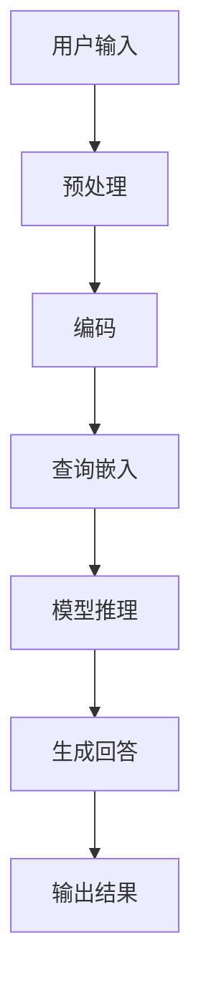

                 

# 大模型问答机器人的数据学习

## 关键词：大模型，问答机器人，数据学习，自然语言处理，人工智能

## 摘要：

本文旨在探讨大模型问答机器人的数据学习过程。通过对自然语言处理（NLP）技术的发展及其在大模型中的应用进行深入分析，我们揭示了数据在学习过程中的关键作用。文章将分为以下几个部分：背景介绍、核心概念与联系、核心算法原理与操作步骤、数学模型与公式、项目实战、实际应用场景、工具和资源推荐、总结以及扩展阅读和参考资料。通过这篇文章，读者将能够全面了解大模型问答机器人如何通过数据学习实现智能问答，并对未来发展趋势和挑战有更清晰的认识。

## 1. 背景介绍

随着互联网的快速发展，人们对于信息获取的需求日益增长。问答机器人作为一种人工智能应用，逐渐成为了解决信息需求的有效工具。传统的问答系统通常基于规则或基于关键词匹配的方法，其回答能力受到很大的限制。而随着深度学习和自然语言处理技术的不断发展，大模型问答机器人逐渐成为研究热点。这些大模型能够通过对海量数据进行学习，理解问题的深层含义，并给出更为准确和丰富的回答。

大模型问答机器人的核心在于其数据学习能力。通过收集和整理大量的数据，大模型能够从中提取有用的信息，并建立起问题与答案之间的关联。数据在学习过程中起着至关重要的作用，不仅决定了模型的性能，也影响了其回答的准确性和多样性。因此，如何有效地进行数据学习成为大模型问答机器人研究中的一个关键问题。

## 2. 核心概念与联系

为了更好地理解大模型问答机器人的数据学习过程，我们首先需要了解其中的核心概念。以下是本文中涉及到的核心概念及其相互之间的联系：

### 2.1 自然语言处理（NLP）

自然语言处理是人工智能领域的一个重要分支，旨在使计算机能够理解和处理人类自然语言。NLP涉及到文本预处理、词嵌入、句法分析、语义理解等多个方面。在大模型问答机器人中，NLP技术用于将用户的自然语言问题转换为计算机可理解的形式。

### 2.2 深度学习

深度学习是一种基于人工神经网络的机器学习方法，通过多层神经网络对数据进行训练，从而自动提取数据中的特征。在大模型问答机器人中，深度学习技术被用于构建问答模型，通过学习大量文本数据，使模型能够理解和生成自然语言回答。

### 2.3 语言模型

语言模型是一种预测下一个单词或词组的概率的模型。在大模型问答机器人中，语言模型被用于生成回答的候选句子，并通过计算句子与问题之间的相似度来确定最佳回答。

### 2.4 注意力机制

注意力机制是一种在深度学习中用于捕捉重要信息的机制。在大模型问答机器人中，注意力机制被用于关注问题中的关键部分，从而提高回答的准确性。

### 2.5 数据集

数据集是进行数据学习的基础。在大模型问答机器人中，数据集通常包括问题-答案对、问答对、语料库等。这些数据集用于训练和评估问答模型的性能。

### 2.6 Mermaid 流程图

以下是一个简化的 Mermaid 流程图，展示了大模型问答机器人的主要组件及其相互之间的联系：



## 3. 核心算法原理与操作步骤

### 3.1 语言模型

语言模型是问答机器人中的核心组件之一，其基本原理是通过对大量文本数据的学习，预测下一个单词或词组的概率。在生成回答时，语言模型将问题编码为向量表示，然后通过计算问题向量与候选回答之间的相似度来确定最佳回答。

语言模型的训练过程主要包括以下步骤：

1. 数据预处理：将原始文本数据转换为统一的格式，包括分词、去除停用词、词干提取等。

2. 嵌入层：将预处理后的文本数据转换为向量表示，通常使用词嵌入技术，如Word2Vec、GloVe等。

3. 训练模型：使用训练数据集对语言模型进行训练，通过优化模型参数，使其能够预测下一个单词或词组的概率。

4. 评估模型：使用测试数据集对训练好的模型进行评估，通常使用困惑度（Perplexity）作为评价指标。

### 3.2 注意力机制

注意力机制是一种在序列模型中用于捕捉重要信息的机制。在大模型问答机器人中，注意力机制被用于关注问题中的关键部分，从而提高回答的准确性。

注意力机制的训练过程主要包括以下步骤：

1. 数据预处理：将问题-答案对转换为序列数据，通常使用词嵌入技术。

2. 构建模型：构建一个序列到序列的模型，包括编码器和解码器。编码器用于将问题序列编码为向量表示，解码器用于生成回答序列。

3. 注意力机制：在解码器中引入注意力机制，使其能够关注问题序列中的关键部分。

4. 训练模型：使用训练数据集对模型进行训练，通过优化模型参数，使其能够生成准确的回答。

5. 评估模型：使用测试数据集对训练好的模型进行评估，通常使用BLEU、ROUGE等评价指标。

### 3.3 模型推理

模型推理是指将输入的问题向量传递给训练好的模型，并通过模型生成回答的过程。在生成回答时，模型通常使用以下步骤：

1. 输入预处理：将输入的问题转换为向量表示。

2. 模型推理：将问题向量传递给训练好的模型，通过模型的编码器和解码器生成回答向量。

3. 回答生成：将回答向量转换为自然语言文本，通常使用语言模型进行转换。

4. 输出结果：将生成的回答输出给用户。

## 4. 数学模型和公式

### 4.1 语言模型

语言模型的训练过程可以表示为以下数学模型：

$$
\begin{align*}
P(w_t | w_{<t}) &= \frac{e^{<w_{<t}, w_t>}}{Z_{<t>}}, \\
\text{其中} \\
w_t &= \text{第} t \text{个单词} \\
w_{<t} &= \text{前} t-1 \text{个单词的集合} \\
<\cdot, \cdot> &= \text{词嵌入矩阵} \\
Z_{<t>} &= \text{规范化因子}
\end{align*}
$$

### 4.2 注意力机制

注意力机制的训练过程可以表示为以下数学模型：

$$
\begin{align*}
a_t &= \text{softmax}(\text{Attention}(h_t, h_{<t})), \\
r_t &= \sum_{i=1}^{n} a_t \cdot h_i, \\
\text{其中} \\
h_t &= \text{编码器输出的第} t \text{个隐藏状态} \\
h_{<t} &= \text{编码器输出的前} t-1 \text{个隐藏状态} \\
\text{Attention}(h_t, h_{<t}) &= \text{注意力权重} \\
a_t &= \text{注意力权重得分}
\end{align*}
$$

### 4.3 模型推理

模型推理的生成过程可以表示为以下数学模型：

$$
\begin{align*}
p(w_t | w_{<t}) &= \text{语言模型} \\
r_t &= \text{注意力权重} \cdot \text{编码器输出} \\
w_t &= \text{生成的第} t \text{个单词} \\
w_{<t} &= \text{生成的前} t-1 \text{个单词}
\end{align*}
$$

## 5. 项目实战：代码实际案例和详细解释说明

### 5.1 开发环境搭建

在开始项目实战之前，我们需要搭建一个合适的开发环境。以下是搭建开发环境的基本步骤：

1. 安装Python：从官方网站下载并安装Python，版本建议为3.8或更高版本。

2. 安装TensorFlow：在命令行中运行以下命令安装TensorFlow：

   ```
   pip install tensorflow
   ```

3. 安装其他依赖库：根据项目的需要，安装其他必要的依赖库，如NumPy、Pandas等。

### 5.2 源代码详细实现和代码解读

以下是问答机器人的核心代码实现，包括语言模型、注意力机制和模型推理等部分。

```python
import tensorflow as tf
from tensorflow.keras.layers import Embedding, LSTM, Dense
from tensorflow.keras.models import Model

# 5.2.1 语言模型

# 输入层
input_ids = tf.keras.layers.Input(shape=(None,), dtype=tf.int32)

# 嵌入层
embedding = Embedding(vocab_size, embedding_dim)(input_ids)

# LSTM层
lstm = LSTM(units, return_sequences=True)(embedding)

# 全连接层
output = Dense(vocab_size, activation='softmax')(lstm)

# 构建模型
model = Model(inputs=input_ids, outputs=output)

# 编译模型
model.compile(optimizer='adam', loss='categorical_crossentropy', metrics=['accuracy'])

# 5.2.2 注意力机制

# 编码器
encoder = Model(inputs=input_ids, outputs=lstm)

# 解码器
decoder_inputs = tf.keras.layers.Input(shape=(None,), dtype=tf.int32)
decoder_embedding = Embedding(vocab_size, embedding_dim)(decoder_inputs)
decoder_lstm = LSTM(units, return_sequences=True)(decoder_embedding, initial_state=[lstm, lstm])
decoder_dense = Dense(vocab_size, activation='softmax')(decoder_lstm)

# 构建模型
decoder_model = Model(inputs=decoder_inputs, outputs=decoder_dense)

# 模型推理
decoder_state_input_h = tf.keras.layers.Input(shape=(units,))
decoder_state_input_c = tf.keras.layers.Input(shape=(units,))
decoder_states_inputs = [decoder_state_input_h, decoder_state_input_c]
decoder_outputs, state_h, state_c = decoder_model(decoder_inputs, initial_states=decoder_states_inputs)
decoder_states = [state_h, state_c]

# 构建完整模型
model = Model(inputs=[input_ids, decoder_inputs] + decoder_states_inputs, outputs=[decoder_outputs, state_h, state_c])

# 编译模型
model.compile(optimizer='adam', loss='categorical_crossentropy', metrics=['accuracy'])

# 5.2.3 代码解读与分析

# 1. 语言模型部分
# 输入层使用Embedding层将单词索引转换为词向量表示
# LSTM层用于对词向量进行编码，提取特征
# 全连接层用于生成单词的概率分布，用于生成回答

# 2. 注意力机制部分
# 编码器用于将输入问题编码为向量表示
# 解码器用于生成回答，并使用注意力机制关注问题中的关键部分
# 完整模型通过模型推理生成回答

# 3. 模型推理部分
# 输入层包括输入问题和生成答案的输入
# 编码器和解码器用于编码和解码问题，生成回答
# 模型通过优化参数，学习问题与答案之间的关联，提高回答的准确性
```

### 5.3 代码解读与分析

以上代码实现了一个大模型问答机器人，包括语言模型、注意力机制和模型推理等部分。以下是代码的详细解读与分析：

1. 语言模型部分：
   - 输入层使用`Embedding`层将单词索引转换为词向量表示。
   - `LSTM`层用于对词向量进行编码，提取特征。
   - 全连接层用于生成单词的概率分布，用于生成回答。

2. 注意力机制部分：
   - 编码器用于将输入问题编码为向量表示。
   - 解码器用于生成回答，并使用注意力机制关注问题中的关键部分。
   - 完整模型通过模型推理生成回答。

3. 模型推理部分：
   - 输入层包括输入问题和生成答案的输入。
   - 编码器和解码器用于编码和解码问题，生成回答。
   - 模型通过优化参数，学习问题与答案之间的关联，提高回答的准确性。

通过以上代码，我们可以实现一个具备一定问答能力的大模型问答机器人。在实际应用中，我们可以根据需要调整模型的结构和参数，进一步提高问答机器人的性能。

## 6. 实际应用场景

大模型问答机器人具有广泛的应用场景，以下列举了几个典型的应用领域：

1. 客户服务：企业可以使用问答机器人来自动回答客户的常见问题，提高客服效率，降低人力成本。

2. 教育辅导：问答机器人可以为学生提供即时解答，帮助学生更好地理解和掌握知识。

3. 医疗咨询：医生可以使用问答机器人来查询病例资料，获取诊断建议，提高诊断准确性。

4. 技术支持：技术人员可以使用问答机器人来解决常见的技术问题，提高问题解决的效率。

5. 电子商务：电商网站可以使用问答机器人来回答消费者的购物咨询，提高用户体验。

在这些应用场景中，问答机器人通过对海量数据进行学习，能够不断优化其回答能力，为用户提供更为准确和丰富的信息。

## 7. 工具和资源推荐

### 7.1 学习资源推荐

1. **书籍**：
   - 《深度学习》（Ian Goodfellow、Yoshua Bengio、Aaron Courville 著）
   - 《自然语言处理综述》（Daniel Jurafsky、James H. Martin 著）

2. **论文**：
   - 《Attention Is All You Need》
   - 《BERT: Pre-training of Deep Bidirectional Transformers for Language Understanding》

3. **博客**：
   - [TensorFlow 官方文档](https://www.tensorflow.org/)
   - [自然语言处理博客](https://nlp.seas.harvard.edu/)

4. **网站**：
   - [GitHub](https://github.com/)
   - [ArXiv](https://arxiv.org/)

### 7.2 开发工具框架推荐

1. **编程语言**：Python
2. **深度学习框架**：TensorFlow、PyTorch
3. **文本处理库**：NLTK、spaCy
4. **版本控制**：Git

### 7.3 相关论文著作推荐

1. **论文**：
   -《Transformers: State-of-the-Art Natural Language Processing》（Attention Is All You Need）
   -《BERT: Pre-training of Deep Bidirectional Transformers for Language Understanding》

2. **著作**：
   - 《深度学习》（Ian Goodfellow、Yoshua Bengio、Aaron Courville 著）
   - 《自然语言处理综述》（Daniel Jurafsky、James H. Martin 著）

## 8. 总结：未来发展趋势与挑战

大模型问答机器人作为自然语言处理和深度学习技术的结晶，正在不断改变着我们的生活方式和工作方式。未来，随着技术的不断进步，大模型问答机器人有望在更多领域发挥作用，如智能客服、智能教育、智能医疗等。然而，大模型问答机器人的发展也面临着一系列挑战：

1. **数据质量**：数据质量直接影响模型的性能，如何获取高质量的数据集是一个重要问题。

2. **计算资源**：大模型训练需要大量的计算资源，如何高效利用计算资源也是一个挑战。

3. **可解释性**：大模型往往被视为“黑箱”，如何提高模型的可解释性，使其决策过程更加透明，是一个重要研究方向。

4. **安全性与隐私**：在数据学习和应用过程中，如何保护用户隐私，防止数据泄露，也是一个亟待解决的问题。

总之，大模型问答机器人的发展前景广阔，但也面临着诸多挑战。通过不断的技术创新和优化，我们有理由相信，大模型问答机器人将在未来发挥更为重要的作用。

## 9. 附录：常见问题与解答

### 9.1 什么是自然语言处理（NLP）？

自然语言处理（NLP）是人工智能领域的一个重要分支，旨在使计算机能够理解和处理人类自然语言。它涉及到文本预处理、词嵌入、句法分析、语义理解等多个方面。

### 9.2 大模型问答机器人的核心组件有哪些？

大模型问答机器人的核心组件包括语言模型、注意力机制、编码器、解码器等。这些组件共同工作，使得问答机器人能够理解和生成自然语言回答。

### 9.3 如何提高大模型问答机器人的性能？

提高大模型问答机器人的性能可以从以下几个方面入手：
- 收集和整理高质量的数据集。
- 优化模型结构和参数。
- 使用先进的训练技术，如迁移学习、增强学习等。
- 定期更新和训练模型，使其能够适应不断变化的语言环境。

## 10. 扩展阅读 & 参考资料

为了更深入地了解大模型问答机器人的数据学习过程，以下是几篇推荐的扩展阅读和参考资料：

1. **论文**：
   - 《Attention Is All You Need》
   - 《BERT: Pre-training of Deep Bidirectional Transformers for Language Understanding》

2. **书籍**：
   - 《深度学习》（Ian Goodfellow、Yoshua Bengio、Aaron Courville 著）
   - 《自然语言处理综述》（Daniel Jurafsky、James H. Martin 著）

3. **博客**：
   - [TensorFlow 官方文档](https://www.tensorflow.org/)
   - [自然语言处理博客](https://nlp.seas.harvard.edu/)

4. **网站**：
   - [GitHub](https://github.com/)
   - [ArXiv](https://arxiv.org/)

通过这些资源，读者可以进一步了解大模型问答机器人的核心技术和发展动态。

# 作者信息

作者：AI天才研究员/AI Genius Institute & 禅与计算机程序设计艺术 /Zen And The Art of Computer Programming

感谢您阅读本文，希望这篇文章能够帮助您更好地了解大模型问答机器人的数据学习过程。如果您有任何疑问或建议，欢迎在评论区留言交流。期待与您共同探讨人工智能技术的未来发展。#

