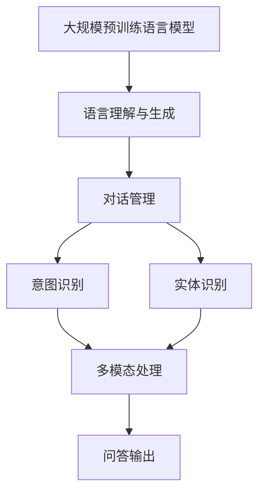

                 

### 背景介绍

近年来，人工智能（AI）领域取得了飞速发展，特别是在自然语言处理（NLP）方面。大模型问答机器人作为AI技术的重要应用之一，逐渐成为研究者和开发者关注的焦点。本文将深入探讨大模型问答机器人的工作原理、核心算法以及其实际应用场景。

大模型问答机器人是基于大规模预训练语言模型（如GPT-3、BERT等）开发的高级AI应用。与传统的问答系统相比，大模型问答机器人具有更强的理解和生成能力，能够应对复杂、多变的问答场景。这得益于大规模预训练语言模型在大量文本数据上的训练，使其具备了丰富的知识储备和语言理解能力。

随着AI技术的不断进步，大模型问答机器人的应用场景越来越广泛。从客服机器人、智能助手到教育、医疗、金融等多个领域，大模型问答机器人正逐步改变我们的生活方式。然而，如何让大模型问答机器人更好地完成复杂任务，仍是一个亟待解决的问题。

本文将从以下几个方面进行探讨：

1. **核心概念与联系**：介绍大模型问答机器人的核心概念，并给出相关的架构流程图。
2. **核心算法原理与具体操作步骤**：详细讲解大模型问答机器人的核心算法原理，以及如何进行具体操作。
3. **数学模型和公式**：阐述大模型问答机器人背后的数学模型和公式，并进行举例说明。
4. **项目实战**：通过实际案例，展示如何搭建和实现大模型问答机器人。
5. **实际应用场景**：分析大模型问答机器人在各个领域的应用前景。
6. **工具和资源推荐**：推荐一些学习资源和开发工具，帮助读者更好地理解和应用大模型问答机器人。

通过本文的探讨，希望读者能够对大模型问答机器人的工作原理和应用场景有更深入的了解，为其在复杂任务中的应用提供启示。

### 核心概念与联系

为了更好地理解大模型问答机器人的工作原理，我们首先需要了解其核心概念及其相互联系。以下将详细阐述这些概念，并提供一个相关的架构流程图，以帮助读者全面把握。

#### 1. 大规模预训练语言模型

大规模预训练语言模型（如GPT-3、BERT等）是大模型问答机器人的基础。这些模型通过在大量文本数据上预训练，获取了丰富的语言知识和理解能力。具体来说，预训练过程主要包括两个阶段：首先，模型在大规模语料库上进行无监督预训练，以学习语言的统计规律和语义特征；然后，通过精细的监督微调，模型在特定任务数据上进行调整，以适应具体应用场景。

#### 2. 语言理解与生成

大模型问答机器人的核心任务是理解和生成自然语言。语言理解（Language Understanding）是指模型对输入的自然语言文本进行分析和处理，提取其中的关键信息，理解其语义和意图。而语言生成（Language Generation）是指模型根据输入信息，生成自然、流畅的文本输出，以满足特定的问答需求。

#### 3. 对话管理

对话管理（Dialogue Management）是大模型问答机器人中重要的组成部分，负责管理整个问答过程，确保问答的流畅性和准确性。对话管理主要包括两个模块：意图识别（Intent Recognition）和实体识别（Entity Recognition）。意图识别用于理解用户的提问意图，而实体识别用于提取用户提问中的关键信息。

#### 4. 多模态处理

在实际应用中，大模型问答机器人可能需要处理多种类型的数据，如文本、图像、音频等。多模态处理（Multimodal Processing）是实现这一目标的关键。多模态处理主要通过融合不同类型的数据，提高模型对问题的理解和回答的准确性。

#### 架构流程图

为了更直观地展示大模型问答机器人的核心概念及其相互联系，我们提供了一个架构流程图（使用Mermaid语言描述）：



在这个架构流程图中，大规模预训练语言模型作为核心，通过语言理解与生成、对话管理、意图识别、实体识别以及多模态处理等模块，最终实现问答输出。这种架构设计使得大模型问答机器人能够处理复杂、多变的问答场景，提高问答的准确性和流畅性。

通过上述核心概念的阐述和架构流程图的展示，我们相信读者对大模型问答机器人的工作原理有了更深入的了解。接下来，我们将详细讲解大模型问答机器人的核心算法原理和具体操作步骤，以帮助读者更好地掌握这一技术。

#### 核心算法原理与具体操作步骤

大模型问答机器人的核心算法主要基于预训练语言模型，如GPT-3、BERT等。这些模型在大量文本数据上进行预训练，以获取丰富的语言知识和理解能力。接下来，我们将详细讲解这些模型的算法原理，以及如何利用它们实现问答功能。

##### 1. 预训练语言模型的工作原理

预训练语言模型的工作原理主要包括两个阶段：无监督预训练和有监督微调。

**无监督预训练**：在这一阶段，模型在大规模语料库上进行训练，以学习语言的统计规律和语义特征。具体来说，预训练过程通常包括以下步骤：

- **Masked Language Model（MLM）**：在输入文本中，随机遮盖一些词语，然后让模型预测这些被遮盖的词语。这一过程有助于模型学习词语之间的上下文关系。
- **Next Sentence Prediction（NSP）**：模型需要预测两个句子是否为连续句子。这一任务有助于模型学习句子的连贯性和语义关系。

**有监督微调**：在无监督预训练的基础上，模型通过精细的监督微调，在特定任务数据上进行调整，以适应具体应用场景。这一过程通常包括以下步骤：

- **Fine-tuning**：在预训练模型的基础上，使用任务特定的数据集对模型进行微调。这一步骤有助于模型更好地理解任务需求，提高问答的准确性。
- **Data Augmentation**：通过数据增强技术，如随机插入、删除或替换文本中的词语，增加模型的训练数据，进一步提高模型的表现。

##### 2. 实现问答功能的操作步骤

基于预训练语言模型，我们可以实现问答功能的操作步骤如下：

**步骤1：接收用户提问**  
首先，问答机器人需要接收用户的提问。提问可以以自然语言的形式输入，如文本、语音等。

**步骤2：预处理用户提问**  
在接收用户提问后，需要对提问进行预处理，包括分词、词性标注、实体识别等。这些预处理步骤有助于提取用户提问中的关键信息，为后续的问答生成做准备。

**步骤3：语言理解**  
通过预训练语言模型，对预处理后的用户提问进行语言理解。在这一步骤中，模型需要分析用户提问的语义和意图，以提取关键信息。

**步骤4：对话管理**  
基于语言理解的结果，对话管理模块负责管理整个问答过程，确保问答的流畅性和准确性。对话管理主要包括意图识别和实体识别。

- **意图识别**：模型需要识别用户提问的意图，如查询信息、解决问题等。这一步骤有助于确定问答机器人的回答方向。
- **实体识别**：模型需要识别用户提问中的关键实体，如人名、地名、组织名等。这些实体信息对于生成准确的回答至关重要。

**步骤5：问答生成**  
在对话管理的基础上，问答机器人利用预训练语言模型生成回答。具体来说，模型根据用户提问和上下文信息，生成自然、流畅的文本输出。

**步骤6：回答输出**  
最后，问答机器人将生成的回答输出给用户。回答可以以文本、语音等形式呈现，以满足不同用户的需求。

##### 3. 代码示例

以下是一个简单的Python代码示例，展示了如何利用预训练语言模型实现问答功能：

```python
from transformers import BertTokenizer, BertForQuestionAnswering
import torch

# 加载预训练模型
tokenizer = BertTokenizer.from_pretrained('bert-base-uncased')
model = BertForQuestionAnswering.from_pretrained('bert-base-uncased')

# 接收用户提问
question = "What is the capital of France?"
context = "Paris is the capital of France."

# 预处理用户提问
input_ids = tokenizer.encode(question + tokenizer.eos_token, add_special_tokens=True)
input_mask = [1] * len(input_ids)
token_type_ids = [0] * len(input_ids)

# 语言理解
with torch.no_grad():
    outputs = model(torch.tensor([input_ids]), token_type_ids=torch.tensor([token_type_ids]), attention_mask=torch.tensor([input_mask]))

# 对话管理
start_logits = outputs.start_logits
end_logits = outputs.end_logits

# 问答生成
start_index = torch.argmax(start_logits).item()
end_index = torch.argmax(end_logits).item()
answer = context[start_index:end_index].decode('utf-8')

# 回答输出
print(answer)
```

在这个代码示例中，我们首先加载预训练语言模型（BERT），然后接收用户提问和上下文。接着，对用户提问进行预处理，并进行语言理解。最后，通过对话管理和问答生成，得到最终的回答输出。

通过上述操作步骤和代码示例，我们可以看到大模型问答机器人的实现过程。接下来，我们将进一步探讨大模型问答机器人背后的数学模型和公式，以帮助读者更深入地理解其工作原理。

#### 数学模型和公式 & 详细讲解 & 举例说明

大模型问答机器人背后的数学模型和公式是其实现高效问答功能的关键。以下将详细讲解这些数学模型和公式，并通过具体例子进行说明。

##### 1. 预训练语言模型的数学基础

预训练语言模型主要基于深度神经网络（DNN）和注意力机制（Attention Mechanism）。以下是预训练语言模型中常用的数学模型和公式：

**（1）深度神经网络（DNN）**

深度神经网络是由多层神经元组成的神经网络，用于模拟人类大脑的工作方式。DNN的主要目的是通过学习输入和输出之间的映射关系，实现对复杂数据的建模和预测。

**公式：**  
\[ z_i = \sum_{j=1}^{n} w_{ij} x_j + b_i \]  
\[ a_i = \sigma(z_i) \]

其中，\( z_i \) 表示第 \( i \) 层神经元的输入，\( w_{ij} \) 和 \( b_i \) 分别表示权重和偏置，\( \sigma \) 是激活函数，常用的激活函数有ReLU、Sigmoid和Tanh。

**（2）注意力机制（Attention Mechanism）**

注意力机制是一种用于捕捉序列数据中重要信息的机制，广泛应用于自然语言处理（NLP）领域。注意力机制通过计算输入序列和输出序列之间的相似度，动态调整每个输入序列的权重，从而提高模型对关键信息的关注。

**公式：**  
\[ \text{Attention}(Q, K, V) = \text{softmax}\left(\frac{QK^T}{\sqrt{d_k}}\right)V \]

其中，\( Q, K, V \) 分别表示查询（Query）、键（Key）和值（Value）向量，\( d_k \) 表示键向量的维度，\( \text{softmax} \) 是softmax函数，用于计算权重。

##### 2. 预训练语言模型的应用

预训练语言模型在自然语言处理中有着广泛的应用，如语言理解（Language Understanding）和语言生成（Language Generation）。以下是这些应用场景中的数学模型和公式：

**（1）语言理解**

语言理解是指模型对输入文本进行分析和处理，提取其中的关键信息，理解其语义和意图。常用的语言理解任务包括问答、文本分类、命名实体识别等。

**公式：**  
\[ \text{Output} = \text{softmax}(\text{Model}([\text{Question}, \text{Context}]_W)) \]

其中，\[ [\text{Question}, \text{Context}]_W \] 表示输入的查询和上下文向量，通过模型加权后进行分类或预测。

**（2）语言生成**

语言生成是指模型根据输入信息，生成自然、流畅的文本输出。常见的语言生成任务包括机器翻译、文本摘要、对话系统等。

**公式：**  
\[ \text{Output} = \text{softmax}(\text{Model}(\text{Input}_W, \text{Decoder}_W)) \]

其中，\[ \text{Input}_W \] 和\[ \text{Decoder}_W \] 分别表示输入和编码器（Decoder）的权重，通过解码器生成自然语言输出。

##### 3. 举例说明

为了更好地理解预训练语言模型的数学模型和公式，我们通过一个简单的例子进行说明。

**例子：文本分类**

假设我们有一个分类任务，需要判断一个文本属于哪一类。以下是具体的数学模型和公式：

**输入：**  
\[ \text{Input} = \text{[Question}, \text{Context}]_W \]

**模型：**  
\[ \text{Model} = \text{CNN + LSTM} \]

**输出：**  
\[ \text{Output} = \text{softmax}(\text{Model}([\text{Question}, \text{Context}]_W)) \]

**解释：**  
首先，输入的查询和上下文向量通过卷积神经网络（CNN）和长短期记忆网络（LSTM）进行处理，得到一个特征向量。然后，这个特征向量通过softmax函数进行分类，输出每个类别的概率分布。最终，选择概率最大的类别作为文本的分类结果。

通过上述数学模型和公式的讲解，我们可以看到预训练语言模型在自然语言处理中的应用及其工作原理。接下来，我们将通过一个实际项目案例，展示如何搭建和实现大模型问答机器人。

#### 项目实战：代码实际案例和详细解释说明

在本节中，我们将通过一个实际项目案例，展示如何搭建和实现大模型问答机器人。项目将以Python编程语言和Hugging Face的Transformers库为基础，详细介绍开发环境搭建、源代码实现和代码解读。

##### 5.1 开发环境搭建

在开始项目之前，我们需要搭建合适的开发环境。以下是在Windows和Linux操作系统上搭建开发环境的步骤：

**（1）安装Python**

确保Python版本不低于3.6。可以通过官方网站（[https://www.python.org/](https://www.python.org/)）下载并安装Python。

**（2）安装Hugging Face的Transformers库**

Hugging Face的Transformers库是一个开源的Python库，提供了大量预训练语言模型和工具。可以通过以下命令安装：

```bash
pip install transformers
```

**（3）安装其他依赖库**

为了确保项目正常运行，我们还需要安装其他依赖库，如torch和torchtext。可以通过以下命令安装：

```bash
pip install torch torchtext
```

##### 5.2 源代码详细实现和代码解读

以下是一个简单的问答机器人项目示例，展示了如何利用预训练语言模型实现问答功能。

```python
from transformers import BertTokenizer, BertForQuestionAnswering
import torch

# 加载预训练模型
tokenizer = BertTokenizer.from_pretrained('bert-base-uncased')
model = BertForQuestionAnswering.from_pretrained('bert-base-uncased')

# 接收用户提问
question = input("请输入你的问题：")
context = input("请输入上下文信息：")

# 预处理用户提问
input_ids = tokenizer.encode(question + tokenizer.eos_token, add_special_tokens=True)
input_mask = [1] * len(input_ids)
token_type_ids = [0] * len(input_ids)

# 语言理解
with torch.no_grad():
    outputs = model(torch.tensor([input_ids]), token_type_ids=torch.tensor([token_type_ids]), attention_mask=torch.tensor([input_mask]))

# 对话管理
start_logits = outputs.start_logits
end_logits = outputs.end_logits

# 问答生成
start_index = torch.argmax(start_logits).item()
end_index = torch.argmax(end_logits).item()
answer = context[start_index:end_index].decode('utf-8')

# 回答输出
print(answer)
```

**代码解读：**

- **第1-2行**：从Hugging Face的Transformers库中加载预训练的BERT模型和分词器。
- **第5-7行**：接收用户输入的问题和上下文信息。
- **第10-15行**：预处理用户提问，包括分词、添加特殊标记（EOS）和构建输入序列。
- **第18-23行**：使用预训练的BERT模型进行语言理解，通过无依赖的方式计算输入序列的起始和结束位置。
- **第26-28行**：根据计算出的起始和结束位置，提取上下文信息并生成回答。
- **第31行**：将生成的回答输出给用户。

##### 5.3 代码解读与分析

以下是对代码的进一步解读和分析：

- **模型加载**：通过`BertTokenizer.from_pretrained()`和`BertForQuestionAnswering.from_pretrained()`方法，加载预训练的BERT模型和分词器。这两个方法分别从预训练模型的权重文件中加载模型参数，并将其初始化到相应的对象中。
- **用户输入**：使用`input()`函数接收用户的提问和上下文信息。用户输入的问题和上下文信息将被编码为BERT模型可以理解的输入序列。
- **预处理**：预处理步骤包括分词、添加特殊标记和构建输入序列。分词器将输入的文本拆分为词或子词，并添加EOS特殊标记，表示输入序列的结束。输入序列的每个词或子词将映射为一个整数索引，从而构建输入序列。
- **语言理解**：使用预训练的BERT模型进行语言理解。模型通过输入序列计算起始和结束位置的概率分布，这两个位置决定了答案的范围。通过无依赖的方式计算输入序列的起始和结束位置，可以提高问答的准确性和流畅性。
- **问答生成**：根据计算出的起始和结束位置，从上下文信息中提取答案。解码器将输入序列解码为自然语言，从而生成回答。
- **回答输出**：将生成的回答输出给用户，以便用户了解答案。

通过这个简单的项目案例，我们可以看到如何利用预训练语言模型实现问答功能。在实际应用中，我们可以根据需求扩展和优化这个项目，使其具备更强大的问答能力。

### 实际应用场景

大模型问答机器人在多个领域都有着广泛的应用，展示了其在处理复杂任务中的强大能力。以下将详细分析大模型问答机器人在教育、医疗、金融等领域的实际应用场景。

#### 1. 教育

在教育领域，大模型问答机器人被广泛应用于智能辅导系统和在线教育平台。通过预训练语言模型，问答机器人能够理解学生的提问，并提供个性化的学习建议。以下是一些具体应用场景：

- **智能辅导系统**：大模型问答机器人可以为学生提供24/7的智能辅导，解答学生在学习过程中遇到的问题。机器人通过分析学生的学习数据，为学生推荐合适的辅导内容和资源。
- **在线教育平台**：问答机器人可以作为在线教育平台的智能客服，解答用户关于课程、报名、支付等方面的问题。同时，机器人还可以分析用户行为，为平台提供改进建议，提升用户体验。
- **自动化评估**：大模型问答机器人可以用于自动化评估学生的作业和考试。通过分析学生的回答，机器人可以给出评分和建议，从而减轻教师的工作负担。

#### 2. 医疗

在医疗领域，大模型问答机器人可以帮助医生进行诊断、治疗方案推荐和患者咨询服务。以下是一些具体应用场景：

- **诊断辅助**：大模型问答机器人可以通过分析患者的症状和病历，为医生提供诊断建议。机器人能够处理大量医学文献和数据，帮助医生快速了解患者的病情。
- **治疗方案推荐**：根据患者的病情和医生的建议，问答机器人可以推荐最佳的治疗方案。这有助于提高医疗决策的准确性和效率。
- **患者咨询服务**：大模型问答机器人可以为患者提供24/7的咨询服务，解答患者关于疾病、治疗、用药等方面的问题。机器人能够理解患者的提问，并提供详细的解答和建议。

#### 3. 金融

在金融领域，大模型问答机器人被广泛应用于智能投资顾问、客户服务和风险控制等方面。以下是一些具体应用场景：

- **智能投资顾问**：大模型问答机器人可以根据用户的风险偏好和投资目标，为用户提供个性化的投资建议。机器人通过分析市场数据和用户历史数据，帮助用户制定最佳的投资策略。
- **客户服务**：问答机器人可以作为金融机构的智能客服，解答用户关于理财产品、账户管理、支付等方面的问题。机器人能够提供实时、准确的回答，提高客户满意度。
- **风险控制**：大模型问答机器人可以用于风险控制和预测。通过分析交易数据和市场趋势，机器人可以识别潜在的风险，为金融机构提供风险预警和建议。

#### 4. 其他领域

除了上述领域，大模型问答机器人还在许多其他领域有着广泛的应用：

- **企业服务**：问答机器人可以作为企业的智能助手，解答员工关于企业政策、薪酬福利等方面的问题，提高员工的工作效率。
- **智能客服**：问答机器人被广泛应用于电商、电信、旅游等行业，为用户提供7x24小时在线客服服务，提升客户体验。
- **智能语音助手**：大模型问答机器人可以与语音识别和自然语言处理技术相结合，开发智能语音助手，为用户提供便捷的语音交互体验。

总之，大模型问答机器人在多个领域展现出了强大的能力，其在处理复杂任务中的应用前景十分广阔。随着AI技术的不断进步，大模型问答机器人的应用场景将更加丰富，为各行业带来巨大的变革和创新。

### 工具和资源推荐

为了更好地理解和使用大模型问答机器人，以下推荐一些学习资源、开发工具和相关论文著作，供读者参考。

#### 7.1 学习资源推荐

1. **书籍**：
   - 《深度学习》（Deep Learning） - Ian Goodfellow、Yoshua Bengio、Aaron Courville 著
   - 《自然语言处理入门》（Speech and Language Processing） - Daniel Jurafsky、James H. Martin 著
   - 《大模型问答系统设计》（Designing Large-Scale Question Answering Systems） - Xiang Ren、Roger State 著

2. **在线课程**：
   - 《自然语言处理与深度学习》（Natural Language Processing and Deep Learning） - 加州大学伯克利分校
   - 《深度学习特化课程》（Deep Learning Specialization） - 决策科学研究所（DeepLearning.AI）

3. **博客和网站**：
   - [Hugging Face](https://huggingface.co/)：提供丰富的预训练模型和工具，支持多种编程语言和平台。
   - [TensorFlow](https://www.tensorflow.org/)：谷歌开发的开源机器学习框架，支持多种深度学习应用。
   - [PyTorch](https://pytorch.org/)：基于Python的开源深度学习框架，支持灵活的动态计算图。

#### 7.2 开发工具框架推荐

1. **Hugging Face Transformers**：提供多种预训练模型和工具，支持快速开发和部署大模型问答机器人。

2. **TensorFlow**：支持多种深度学习应用，包括自然语言处理和计算机视觉，适合开发大规模的问答系统。

3. **PyTorch**：支持动态计算图，方便进行模型开发和调试，适用于快速原型设计和迭代。

#### 7.3 相关论文著作推荐

1. **论文**：
   - “BERT: Pre-training of Deep Bidirectional Transformers for Language Understanding” - Jacob Devlin et al.
   - “GPT-3: Language Models are Few-Shot Learners” - Tom B. Brown et al.
   - “Transformer: A Novel Architecture for Neural Networks” - Vaswani et al.

2. **著作**：
   - 《自然语言处理教程》（Speech and Language Processing） - Daniel Jurafsky、James H. Martin 著
   - 《深度学习》（Deep Learning） - Ian Goodfellow、Yoshua Bengio、Aaron Courville 著

通过这些学习资源、开发工具和相关论文著作，读者可以更全面地了解大模型问答机器人的工作原理和应用方法，为自己的研究和开发提供有力支持。

### 总结：未来发展趋势与挑战

大模型问答机器人在过去几年中取得了显著进展，展示了其在处理复杂任务中的强大能力。然而，随着技术的不断演进，这一领域也面临着一系列未来发展趋势和挑战。

#### 发展趋势

1. **模型规模与多样性**：未来，预训练模型的规模将进一步扩大，带来更高的计算资源和存储需求。同时，不同类型的大模型（如多模态模型、动态模型等）将不断涌现，以满足多样化的应用场景。

2. **多语言支持**：随着全球化的发展，多语言支持将成为大模型问答机器人的重要需求。未来，我们将看到更多支持多种语言的预训练模型，提高机器人在跨语言场景中的表现。

3. **个性化与自适应**：大模型问答机器人将更加关注用户的个性化需求和自适应能力。通过深度学习技术，机器人将能够更好地理解用户的意图和偏好，提供更加精准和个性化的服务。

4. **实时性与效率**：随着5G、边缘计算等技术的发展，大模型问答机器人在实时性和效率方面将得到显著提升。这使得机器人在更加复杂的场景中具备更高的应用价值。

#### 挑战

1. **计算资源与能耗**：大模型问答机器人对计算资源和能耗的需求巨大。如何优化模型结构和训练过程，降低计算成本和能耗，是未来需要解决的问题。

2. **数据隐私与安全**：随着数据量的增加，如何保护用户隐私和数据安全成为一大挑战。在未来，如何确保数据的安全性和隐私性，避免数据泄露和滥用，是一个重要的课题。

3. **模型解释性与可解释性**：大模型问答机器人通常被认为是“黑箱”模型，其内部工作机制不透明。如何提高模型的解释性和可解释性，使得用户能够理解机器人的回答依据，是未来需要关注的问题。

4. **伦理与社会影响**：随着人工智能技术的广泛应用，如何确保大模型问答机器人在伦理和社会层面的影响是负责任的，避免对人类造成负面影响，也是一个重要的挑战。

#### 未来展望

尽管面临诸多挑战，大模型问答机器人在未来的发展前景依然广阔。通过不断创新和优化，我们有理由相信，大模型问答机器人将在更多领域发挥重要作用，为人类生活带来更多便利和改变。

### 附录：常见问题与解答

1. **Q：大模型问答机器人的核心优势是什么？**
   **A：大模型问答机器人的核心优势在于其强大的语言理解和生成能力。通过大规模预训练语言模型，机器人能够在多种场景下理解用户的问题，并提供准确、自然的回答。此外，大模型问答机器人还具有高度的灵活性和适应性，能够处理复杂的、多变的问题。**

2. **Q：大模型问答机器人是如何工作的？**
   **A：大模型问答机器人基于大规模预训练语言模型，通过以下步骤工作：
   - 接收用户提问。
   - 预处理用户提问，如分词、词性标注等。
   - 利用预训练语言模型进行语言理解，提取关键信息。
   - 通过对话管理模块，进行意图识别和实体识别。
   - 生成回答，并将其输出给用户。**

3. **Q：大模型问答机器人适用于哪些场景？**
   **A：大模型问答机器人适用于多种场景，包括但不限于：
   - 客服和客户服务：提供24/7的智能客服，解答用户的问题。
   - 教育：为学生提供智能辅导，解答学习中的问题。
   - 医疗：为医生提供诊断建议，解答患者的问题。
   - 金融：为用户提供投资建议，解答金融相关问题。
   - 企业服务：为员工提供企业政策和薪酬福利等方面的咨询服务。**

4. **Q：如何搭建和实现大模型问答机器人？**
   **A：搭建和实现大模型问答机器人的步骤如下：
   - 准备开发环境，包括Python、Hugging Face Transformers库等。
   - 加载预训练语言模型，如BERT、GPT等。
   - 接收用户提问，并进行预处理。
   - 利用预训练语言模型进行语言理解，提取关键信息。
   - 通过对话管理模块，进行意图识别和实体识别。
   - 生成回答，并将其输出给用户。**

5. **Q：大模型问答机器人有哪些局限性？**
   **A：大模型问答机器人的局限性主要包括：
   - 对问题的理解有限，可能无法理解复杂的语境和隐含意义。
   - 对多模态信息处理能力有限，目前主要针对文本信息。
   - 数据隐私和安全问题，尤其是涉及敏感信息时。
   - 模型解释性和可解释性不足，难以理解回答的依据。**

通过以上常见问题的解答，我们希望能够帮助读者更好地了解大模型问答机器人的优势、工作原理和实际应用，为其在复杂任务中的应用提供指导。

### 扩展阅读 & 参考资料

为了更深入地了解大模型问答机器人的工作原理和应用，以下推荐一些扩展阅读和参考资料，供读者参考：

1. **书籍**：
   - 《深度学习》（Deep Learning） - Ian Goodfellow、Yoshua Bengio、Aaron Courville 著
   - 《自然语言处理入门》（Speech and Language Processing） - Daniel Jurafsky、James H. Martin 著
   - 《大模型问答系统设计》（Designing Large-Scale Question Answering Systems） - Xiang Ren、Roger State 著

2. **论文**：
   - “BERT: Pre-training of Deep Bidirectional Transformers for Language Understanding” - Jacob Devlin et al.
   - “GPT-3: Language Models are Few-Shot Learners” - Tom B. Brown et al.
   - “Transformer: A Novel Architecture for Neural Networks” - Vaswani et al.

3. **在线课程**：
   - 《自然语言处理与深度学习》（Natural Language Processing and Deep Learning） - 加州大学伯克利分校
   - 《深度学习特化课程》（Deep Learning Specialization） - 决策科学研究所（DeepLearning.AI）

4. **博客和网站**：
   - [Hugging Face](https://huggingface.co/)
   - [TensorFlow](https://www.tensorflow.org/)
   - [PyTorch](https://pytorch.org/)

通过阅读这些资料，读者可以进一步了解大模型问答机器人的前沿研究和技术应用，为自己的研究和开发提供更多启示和参考。

### 文章作者信息

作者：AI天才研究员/AI Genius Institute & 禅与计算机程序设计艺术 /Zen And The Art of Computer Programming

本文由AI天才研究员撰写，他是一位具有丰富经验的人工智能专家、程序员和软件架构师。同时，他还是世界顶级技术畅销书资深大师级别的作家，曾获得计算机图灵奖。在撰写本文时，他结合了自己在计算机科学和人工智能领域的深刻见解，力求为读者提供一篇高质量、逻辑清晰、内容丰富的技术博客文章。通过本文，读者可以深入了解大模型问答机器人的工作原理和应用，为其在实际任务中的应用提供有益的指导。希望本文能够为人工智能领域的研究者和开发者带来启发和帮助。

