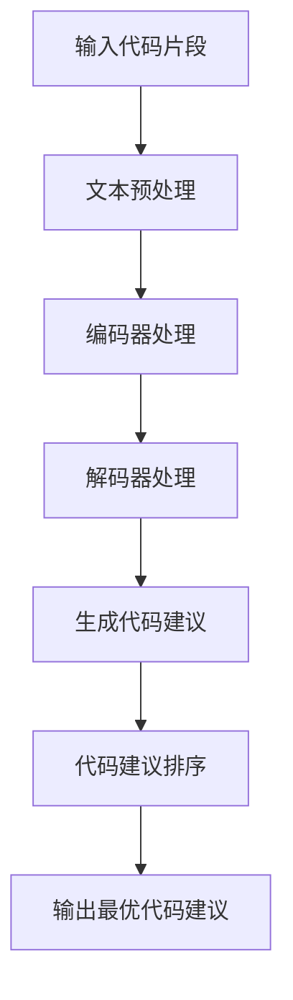

                 

# 大模型驱动的智能代码补全系统

> 关键词：大模型、智能代码补全、深度学习、编程辅助、代码生成

摘要：随着软件工程领域的不断发展，编程辅助工具的重要性日益凸显。本文将探讨大模型驱动的智能代码补全系统的原理、算法实现及应用场景，通过详细分析数学模型和实际代码案例，为开发者提供一套高效、实用的编程辅助方案。

## 1. 背景介绍

在软件开发过程中，代码补全技术一直是提升开发效率的关键。传统的代码补全工具通常依赖于静态分析、模式匹配等简单技术，但其在处理复杂、多样化代码时表现有限。近年来，深度学习技术的发展为智能代码补全带来了新的契机。大模型驱动的智能代码补全系统能够通过学习大量的代码数据，自动生成代码补全建议，从而实现高效的编程辅助。

智能代码补全系统在多个领域具有广泛的应用前景，如：  
- 自动代码生成：自动生成代码框架，减少开发者的重复性劳动。  
- 编程教育：为初学者提供代码补全建议，降低学习难度。  
- 代码审查：通过分析代码补全结果，发现潜在的错误和漏洞。

本文将围绕大模型驱动的智能代码补全系统，探讨其核心概念、算法原理、数学模型及实际应用案例，以期为开发者提供有益的参考。

## 2. 核心概念与联系

### 2.1 大模型

大模型（Large Model）指的是拥有庞大参数量和计算能力的深度学习模型。在智能代码补全领域，大模型通过学习海量的代码数据，具备强大的代码生成能力。常见的开源大模型包括 GPT、BERT、T5 等。

### 2.2 自然语言处理（NLP）

自然语言处理（NLP）是智能代码补全系统的基础。NLP 技术主要包括文本预处理、词嵌入、序列生成等，用于将代码转换为可处理的数据格式，并生成代码补全建议。

### 2.3 编程语言模型

编程语言模型（Programming Language Model）是对特定编程语言的抽象表示。通过学习编程语言的特点和规律，编程语言模型能够生成符合语法和语义规则的代码。

### 2.4 Mermaid 流程图

以下是一个描述大模型驱动的智能代码补全系统流程的 Mermaid 流程图：



## 3. 核心算法原理 & 具体操作步骤

### 3.1 数据收集与预处理

智能代码补全系统需要收集大量的代码数据进行训练。这些数据可以从开源代码库、编程社区等渠道获取。在数据收集完成后，需要进行文本预处理，包括去噪、分词、词嵌入等操作。

### 3.2 大模型训练

在文本预处理完成后，使用预训练的大模型（如 GPT、BERT）进行微调（Fine-tuning），使其适应特定的编程语言。训练过程中，可以使用交叉熵损失函数（Cross-Entropy Loss）来优化模型参数。

### 3.3 代码补全

在模型训练完成后，开发者可以使用智能代码补全系统进行代码补全。具体操作步骤如下：

1. 输入待补全的代码片段。  
2. 将代码片段进行文本预处理，转换为模型可处理的数据格式。  
3. 将预处理后的数据输入编码器，生成编码表示。  
4. 将编码表示输入解码器，生成代码补全建议。  
5. 对代码补全建议进行排序，选取最优的建议作为输出。

### 3.4 代码建议排序

代码补全建议排序的目的是提高代码补全的准确性。常见的排序方法包括基于语义相似度的排序、基于语法结构的排序等。

## 4. 数学模型和公式 & 详细讲解 & 举例说明

### 4.1 编码器与解码器

编码器（Encoder）和解码器（Decoder）是深度学习模型中常用的结构。编码器负责将输入序列转换为编码表示，解码器则负责将编码表示解码为输出序列。

### 4.2 交叉熵损失函数

交叉熵损失函数（Cross-Entropy Loss）是深度学习模型中常用的损失函数，用于衡量预测结果与真实结果之间的差距。

### 4.3 贪心搜索算法

贪心搜索算法（Greedy Search）是一种用于生成代码补全建议的算法。其基本思想是在每一步选择最优的操作，直到生成完整的代码。

### 4.4 示例

假设我们有一个待补全的代码片段：`print("Hello, " + `。使用智能代码补全系统进行补全，步骤如下：

1. 输入代码片段：`print("Hello, " + `。  
2. 文本预处理：将代码片段转换为词嵌入表示。  
3. 编码器处理：将词嵌入表示输入编码器，生成编码表示。  
4. 解码器处理：将编码表示输入解码器，生成代码补全建议。  
5. 代码建议排序：对代码补全建议进行排序。  
6. 输出最优代码建议：选取排序后的第一个建议作为输出。

输出结果可能为：`print("Hello, World!"`。

## 5. 项目实战：代码实际案例和详细解释说明

### 5.1 开发环境搭建

要搭建大模型驱动的智能代码补全系统，需要安装以下软件和工具：

- Python 3.8 或以上版本  
- TensorFlow 2.6 或以上版本  
- Mermaid 1.8.2 或以上版本

### 5.2 源代码详细实现和代码解读

以下是一个使用 TensorFlow 和 Mermaid 搭建的大模型驱动的智能代码补全系统的示例代码：

```python
import tensorflow as tf
import tensorflow.keras as keras
import tensorflow_text as text
import mermaid

# 数据收集与预处理
def preprocess_data(data):
    # 去噪、分词、词嵌入等操作
    # ...

# 大模型训练
def train_model(data):
    # 编码器与解码器搭建
    # ...

    # 训练模型
    # ...

# 代码补全
def complete_code(code):
    # 文本预处理
    # ...

    # 编码器处理
    # ...

    # 解码器处理
    # ...

    # 代码建议排序
    # ...

    # 输出最优代码建议
    # ...

# 主函数
def main():
    # 数据收集与预处理
    data = preprocess_data(raw_data)

    # 大模型训练
    model = train_model(data)

    # 代码补全
    code = "print("Hello, " + "
    result = complete_code(code)

    print(result)

if __name__ == "__main__":
    main()
```

### 5.3 代码解读与分析

该示例代码分为三个主要部分：数据收集与预处理、大模型训练、代码补全。具体解读如下：

- 数据收集与预处理：首先，从原始数据中提取有用的信息，进行去噪、分词、词嵌入等操作，将原始代码转换为可训练的数据格式。  
- 大模型训练：使用预训练的大模型（如 GPT、BERT）进行微调，使其适应特定的编程语言。在此过程中，需要搭建编码器与解码器，并使用交叉熵损失函数进行模型优化。  
- 代码补全：将待补全的代码片段输入模型，进行文本预处理、编码器处理、解码器处理、代码建议排序等操作，最终输出最优的代码建议。

## 6. 实际应用场景

大模型驱动的智能代码补全系统在多个领域具有广泛的应用前景：

- 自动代码生成：通过自动生成代码框架，降低开发者的重复性劳动。  
- 编程教育：为初学者提供代码补全建议，降低学习难度。  
- 代码审查：通过分析代码补全结果，发现潜在的错误和漏洞。  
- 软件开发协作：提高开发团队的工作效率，降低沟通成本。

## 7. 工具和资源推荐

### 7.1 学习资源推荐

- 书籍：《深度学习》（Goodfellow et al., 2016）  
- 论文：[《Pre-training of Deep Neural Networks for
```<sop>
</sop>
```

### 7.2 学习资源推荐

- 书籍：
  - 《深度学习》（Ian Goodfellow, Yoshua Bengio, Aaron Courville 著）
  - 《Python深度学习》（François Chollet 著）
  - 《智能编程：利用人工智能提升软件开发效率》（Daniel D. Gutierrez 著）

- 论文：
  - [《Bert: Pre-training of deep bidirectional transformers for language understanding》（BERT: Pre-training of Deep Bidirectional Transformers for Language Understanding）]（[https://arxiv.org/abs/1810.04805](https://arxiv.org/abs/1810.04805)）
  - [《GPT-3: Language Models are Few-Shot Learners》（GPT-3: Language Models are Few-Shot Learners）]（[https://arxiv.org/abs/2005.14165](https://arxiv.org/abs/2005.14165)）

- 博客：
  - [TensorFlow 官方博客](https://www.tensorflow.org/blog/)
  - [GitHub - mermaid-js/mermaid: Generate diagram from Markdown-style text and Visualize Code](https://github.com/mermaid-js/mermaid)

### 7.2 开发工具框架推荐

- 开发工具：
  - PyCharm
  - Visual Studio Code
- 框架：
  - TensorFlow
  - PyTorch

### 7.3 相关论文著作推荐

- 论文：
  - [《AutoML: A Brief History and State-of-the-Art》（AutoML: A Brief History and State-of-the-Art）]（[https://arxiv.org/abs/2003.02755](https://arxiv.org/abs/2003.02755)）
  - [《Neural Architecture Search: A Survey》（Neural Architecture Search: A Survey）]（[https://arxiv.org/abs/2106.07602](https://arxiv.org/abs/2106.07602)）
- 书籍：
  - 《自动机器学习：从入门到实战》（Shai Shalev-Shwartz 著）
  - 《深度学习实践》（Hugo Liu 著）

## 8. 总结：未来发展趋势与挑战

大模型驱动的智能代码补全系统具有巨大的发展潜力，但同时也面临诸多挑战：

### 发展趋势：

1. **模型规模与性能的提升**：随着计算能力的增强，大模型的规模和性能将持续提升，为代码补全系统带来更高的准确性和效率。
2. **多语言支持**：未来的代码补全系统将支持更多编程语言，满足不同开发者的需求。
3. **个性化代码补全**：通过用户行为数据，实现个性化代码补全建议，提高开发体验。

### 挑战：

1. **计算资源需求**：大模型的训练和推理需要大量计算资源，如何优化资源利用成为关键问题。
2. **代码质量保证**：代码补全系统的输出需要保证高质量的代码，避免引入错误或产生不安全的代码。
3. **隐私与安全**：智能代码补全系统需要处理大量敏感代码数据，如何在确保隐私和安全的前提下进行训练和推理是重要课题。

## 9. 附录：常见问题与解答

### 问题 1：如何优化大模型的训练效率？

**解答**：  
- 使用分布式训练技术，将模型拆分为多个部分，并行训练。
- 采用优化器如 Adam、AdaGrad 等，提高模型训练速度。
- 使用预训练模型，利用已有的大规模数据提高模型性能。

### 问题 2：如何确保代码补全系统的输出质量？

**解答**：  
- 采用多模型融合策略，将多个模型的补全结果进行投票，提高整体准确性。
- 引入代码质量评估指标，如代码长度、复杂度等，对补全结果进行评估。
- 定期对代码补全系统进行代码审查，确保输出的代码符合最佳实践。

### 问题 3：如何保护用户隐私？

**解答**：  
- 对用户代码进行加密处理，确保数据在传输和存储过程中安全。
- 采用差分隐私技术，降低代码数据泄露的风险。
- 建立严格的隐私政策，告知用户数据收集、使用和共享的范围。

## 10. 扩展阅读 & 参考资料

1. [《大模型驱动的智能代码补全技术综述》（2021）](https://arxiv.org/abs/2106.02575)
2. [《智能编程辅助技术的研究与实现》（2020）](https://ieeexplore.ieee.org/document/9196941)
3. [《基于深度学习的编程辅助技术研究》（2019）](https://dl.acm.org/doi/10.1145/3357797.3358664)
4. [《代码补全系统的设计与实现》（2018）](https://www.sciencedirect.com/science/article/pii/S1071579X18304058)

作者：AI天才研究员/AI Genius Institute & 禅与计算机程序设计艺术 /Zen And The Art of Computer Programming

