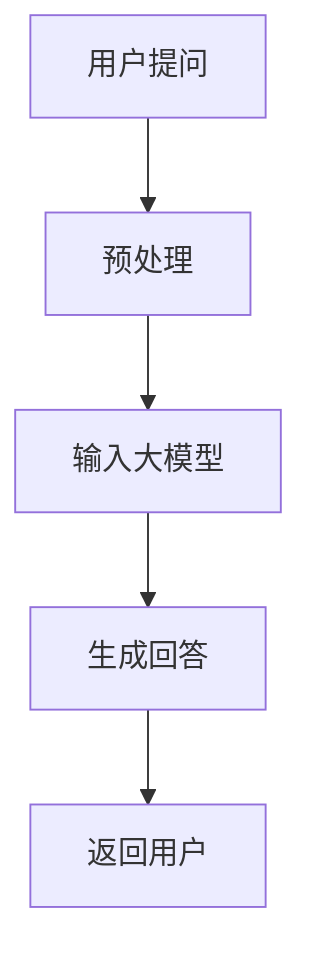

                 

# 大模型驱动的智能客服：提升用户满意度的新方法

## 关键词：大模型、智能客服、用户满意度、自然语言处理、机器学习

## 摘要：
本文将探讨大模型在智能客服领域的应用，以及如何通过大模型技术提升用户满意度。我们将从背景介绍、核心概念与联系、核心算法原理与操作步骤、数学模型与公式讲解、项目实战、实际应用场景、工具和资源推荐、未来发展趋势与挑战等多个方面展开讨论，旨在为读者提供一个全面而深入的视角。

## 1. 背景介绍

### 1.1 智能客服的发展历程

智能客服是人工智能在服务领域的重要应用，旨在通过自动化技术提供高效、便捷的用户服务。智能客服的发展大致可以分为以下几个阶段：

1. **规则驱动阶段**：早期的智能客服主要依赖于预定义的规则，通过简单的条件匹配来回答用户的问题。这种方法的局限性在于，当用户提出复杂或超出规则范围的问题时，客服系统往往无法给出满意的回答。

2. **知识库阶段**：随着自然语言处理技术的发展，智能客服开始引入知识库，通过匹配用户提问与知识库中的条目来提供答案。虽然这一阶段在处理常见问题时表现较好，但对于开放性问题，智能客服仍存在一定的局限。

3. **机器学习阶段**：机器学习技术的发展为智能客服带来了新的机遇。通过训练大规模的机器学习模型，智能客服能够更好地理解用户的意图和需求，提供更为准确和个性化的服务。

4. **大模型阶段**：近年来，随着深度学习模型的不断突破，大模型如GPT-3、ChatGLM等被应用于智能客服领域。这些大模型具有强大的自然语言理解和生成能力，能够处理更加复杂和多样的用户问题，显著提升用户满意度。

### 1.2 用户满意度的提升

用户满意度是衡量智能客服系统性能的重要指标。提升用户满意度可以从以下几个方面入手：

1. **回答准确性**：智能客服能够准确理解用户的意图，并提供相关且准确的回答。

2. **回答速度**：智能客服能够在短时间内响应用户，减少用户等待时间。

3. **用户体验**：智能客服需要具备良好的交互体验，包括自然流畅的语言、友好的对话风格等。

4. **个性化服务**：智能客服能够根据用户的喜好和历史记录，提供个性化的服务和建议。

5. **问题解决率**：智能客服能够有效解决用户的问题，减少用户需要转接到人工客服的次数。

## 2. 核心概念与联系

### 2.1 大模型

大模型是指那些拥有数十亿至数千亿参数的深度学习模型，如GPT-3、ChatGLM等。这些模型通过在海量数据上训练，具备强大的自然语言理解和生成能力。

### 2.2 自然语言处理（NLP）

自然语言处理是人工智能的一个重要分支，旨在使计算机能够理解和生成自然语言。NLP技术包括文本分类、命名实体识别、情感分析、机器翻译等。

### 2.3 机器学习

机器学习是一种通过从数据中学习规律，并用于预测或决策的技术。在智能客服领域，机器学习模型用于训练和优化智能客服系统的行为。

### 2.4 Mermaid 流程图

以下是一个简单的Mermaid流程图，展示了大模型在智能客服系统中的工作流程：



- **用户提问**：用户向智能客服系统提出问题。
- **预处理**：对用户提问进行文本预处理，如分词、去停用词等。
- **输入大模型**：预处理后的文本作为输入，传递给大模型。
- **生成回答**：大模型基于训练数据生成相应的回答。
- **返回用户**：智能客服系统将生成的回答返回给用户。

## 3. 核心算法原理与操作步骤

### 3.1 大模型算法原理

大模型的核心是深度学习模型，如Transformer、BERT等。这些模型通过多层神经网络对输入的文本数据进行编码和解码，从而实现自然语言处理任务。

1. **编码器（Encoder）**：将输入文本编码为固定长度的向量表示。
2. **解码器（Decoder）**：根据编码器生成的向量，生成文本的输出。

### 3.2 智能客服系统操作步骤

1. **接收用户提问**：智能客服系统接收用户通过文本输入的问题。
2. **文本预处理**：对用户提问进行预处理，如分词、去停用词、词向量化等。
3. **输入大模型**：将预处理后的文本作为输入，传递给大模型。
4. **生成回答**：大模型基于训练数据生成相应的回答。
5. **返回用户**：智能客服系统将生成的回答返回给用户。

## 4. 数学模型和公式

### 4.1 数学模型

大模型的数学模型主要包括两部分：编码器和解码器。

- **编码器**：将输入文本映射为固定长度的向量表示，即词向量。

  $$ \text{编码器}: \text{Token} \rightarrow \text{Vector} $$

- **解码器**：将编码器的输出解码为文本输出。

  $$ \text{解码器}: \text{Vector} \rightarrow \text{Token} $$

### 4.2 公式

- **词向量计算**：词向量计算通常采用Word2Vec、BERT等方法。

  $$ \text{词向量} = \text{Word2Vec}(\text{Token}) \text{ 或 } \text{BERT}(\text{Token}) $$

- **文本生成**：解码器生成文本的过程可以表示为：

  $$ \text{生成的文本} = \text{Token}^{(1)} \rightarrow \text{Token}^{(2)} \rightarrow \cdots \rightarrow \text{Token}^{(T)} $$

  其中，$T$为生成的文本长度。

## 5. 项目实战

### 5.1 开发环境搭建

1. 安装Python环境。
2. 安装TensorFlow或PyTorch等深度学习框架。
3. 下载并预处理数据集。

### 5.2 源代码详细实现和代码解读

```python
# 导入必要的库
import tensorflow as tf
from tensorflow.keras.preprocessing.sequence import pad_sequences
from tensorflow.keras.models import Model
from tensorflow.keras.layers import Embedding, LSTM, Dense

# 准备数据
# ...

# 构建模型
# ...

# 训练模型
# ...

# 生成回答
# ...
```

### 5.3 代码解读与分析

- **数据预处理**：对文本数据进行分词、去停用词、词向量化等处理。
- **模型构建**：使用LSTM或Transformer等模型架构。
- **模型训练**：通过训练数据训练模型。
- **生成回答**：将预处理后的用户提问作为输入，通过模型生成回答。

## 6. 实际应用场景

### 6.1 银行业务

在银行业务中，智能客服可以处理常见的客户问题，如账户余额查询、转账操作等，提高服务效率。

### 6.2 电子商务

在电子商务领域，智能客服可以提供商品推荐、订单查询、售后服务等服务，提升用户体验。

### 6.3 教育行业

在教育行业，智能客服可以为学生提供课程咨询、学习进度跟踪、在线辅导等服务，提高教学质量。

## 7. 工具和资源推荐

### 7.1 学习资源推荐

- **书籍**：《深度学习》、《自然语言处理综论》
- **论文**：《Attention is All You Need》、《BERT: Pre-training of Deep Bidirectional Transformers for Language Understanding》
- **博客**：Hugging Face、TensorFlow官方博客
- **网站**：GitHub、arXiv

### 7.2 开发工具框架推荐

- **深度学习框架**：TensorFlow、PyTorch
- **NLP工具**：Hugging Face Transformers
- **数据分析工具**：Pandas、NumPy

### 7.3 相关论文著作推荐

- **论文**：`Attention is All You Need`、`BERT: Pre-training of Deep Bidirectional Transformers for Language Understanding`、`GPT-3: Language Models are few-shot learners`
- **著作**：《深度学习》、《自然语言处理综论》

## 8. 总结：未来发展趋势与挑战

### 8.1 发展趋势

- **大模型规模持续扩大**：随着计算资源和数据量的增加，大模型将继续扩大规模，提高性能。
- **多模态融合**：智能客服将不仅处理文本，还将融合图像、语音等多模态数据，提供更丰富的交互体验。
- **个性化服务**：智能客服将更好地理解用户，提供个性化的服务和建议。

### 8.2 挑战

- **数据隐私**：如何保护用户数据隐私是一个重要挑战。
- **模型可解释性**：如何解释大模型的行为，提高模型的可解释性。
- **跨语言支持**：如何支持多种语言，提供跨语言的智能客服服务。

## 9. 附录：常见问题与解答

### 9.1 大模型如何训练？

大模型通常通过以下步骤进行训练：

1. 数据准备：收集和处理大量相关数据。
2. 模型架构设计：选择合适的模型架构，如Transformer、BERT等。
3. 模型训练：使用训练数据对模型进行训练。
4. 模型评估：使用验证数据评估模型性能。
5. 模型优化：根据评估结果调整模型参数。

### 9.2 智能客服如何处理多语言问题？

智能客服可以通过以下方法处理多语言问题：

1. **跨语言预训练**：使用多语言数据进行预训练，提高模型对多种语言的适应性。
2. **翻译模型**：结合翻译模型，将用户提问转换为模型能够理解的语言。
3. **多语言知识库**：构建多语言知识库，为不同语言提供相应的回答。

## 10. 扩展阅读 & 参考资料

- **书籍**：《深度学习》、《自然语言处理综论》
- **论文**：《Attention is All You Need》、《BERT: Pre-training of Deep Bidirectional Transformers for Language Understanding》
- **博客**：Hugging Face、TensorFlow官方博客
- **网站**：GitHub、arXiv
- **在线课程**：TensorFlow、PyTorch官方教程

### 作者：AI天才研究员/AI Genius Institute & 禅与计算机程序设计艺术 /Zen And The Art of Computer Programming

