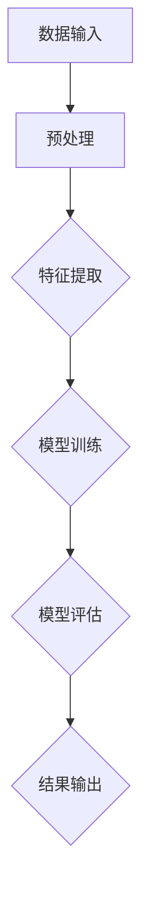

                 

# 大模型：从实验室到商业应用的落地

## 关键词：大模型，AI，深度学习，商业应用，技术落地，应用场景

## 摘要

本文将深入探讨大模型从实验室到商业应用的全过程。首先，我们将回顾大模型的发展背景，探讨其在人工智能领域的核心作用。接着，文章将详细介绍大模型的核心概念和架构，通过流程图和算法原理分析，使读者对大模型有一个全面的理解。随后，我们将探讨大模型的数学模型和具体操作步骤，并通过实际项目案例展示大模型的应用。文章还将分析大模型在实际应用场景中的挑战和解决方案，推荐相关的学习资源和开发工具，最后总结大模型的未来发展趋势与挑战，为读者提供全面的视角。

## 1. 背景介绍

大模型（Large Models），通常指具有数十亿甚至数万亿参数的深度学习模型。它们在人工智能领域引起了广泛关注，特别是在自然语言处理、计算机视觉和语音识别等应用中取得了显著成果。大模型的出现并非偶然，而是人工智能领域数十年来技术积累和突破的成果。

### 1.1 大模型的发展历程

大模型的发展历程可以追溯到20世纪80年代。当时，神经网络研究刚刚起步，研究人员开始探索如何通过增加网络中的参数数量来提高模型的性能。随着计算能力的提升和数据量的增加，研究人员逐渐尝试更大规模的模型，这些模型能够处理更复杂的问题。

20世纪90年代，深度学习技术的崛起为大规模模型的研发提供了新的契机。卷积神经网络（CNN）和循环神经网络（RNN）等结构的出现，使得模型能够处理更复杂的任务。特别是2006年，Hinton等人的研究成功训练了第一个深度信念网络（DBN），为深度学习的发展奠定了基础。

进入21世纪，随着GPU等高性能计算设备的普及，以及大规模数据的获取，研究人员开始尝试训练具有数十亿参数的模型。这一时期，谷歌的Transformer模型在2017年的提出，标志着大模型时代的到来。Transformer模型在自然语言处理领域取得了突破性成果，激发了更多研究者和企业投入到大模型的研究和应用中。

### 1.2 大模型的核心作用

大模型在人工智能领域扮演着至关重要的角色。首先，大模型能够处理更复杂的任务，特别是在自然语言处理和计算机视觉领域。通过引入更多参数和更深的网络结构，大模型能够捕捉到更多的特征和规律，从而提高模型的性能。

其次，大模型的出现推动了人工智能技术的商业化。许多企业开始利用大模型提供智能化服务，如搜索引擎、智能助手和自动驾驶等。大模型的应用不仅提升了用户体验，还为企业带来了巨大的商业价值。

最后，大模型促进了人工智能研究的发展。通过不断优化和改进大模型，研究人员能够探索更深层次的理论问题，如模型的可解释性、鲁棒性和安全性等。这些研究将推动人工智能技术的进步，为未来带来更多可能性。

## 2. 核心概念与联系

### 2.1 大模型的核心概念

大模型的核心概念包括参数数量、网络结构和训练数据。参数数量是衡量模型规模的重要指标，通常以亿或万亿计。网络结构决定了模型的学习能力和性能，常见的结构包括卷积神经网络（CNN）、循环神经网络（RNN）和变换器模型（Transformer）等。训练数据则提供了模型学习的基础，通过大量数据的训练，模型能够学习到更复杂的特征和规律。

### 2.2 大模型的工作原理

大模型的工作原理主要基于深度学习的思想。深度学习是一种通过多层神经网络对数据进行分析和建模的方法。在训练过程中，模型通过反向传播算法不断调整网络中的参数，以优化模型的性能。大模型通过增加网络层数和参数数量，使得模型能够处理更复杂的任务。

#### 2.2.1 神经网络

神经网络是深度学习的基础，它由大量的神经元组成，每个神经元通过权重连接到其他神经元。神经元的输出经过激活函数处理后，传递给下一层神经元。通过多层网络的结构，神经网络能够学习到更复杂的特征和规律。

#### 2.2.2 反向传播

反向传播是一种用于训练神经网络的算法。在训练过程中，模型通过输入数据生成预测结果，并将预测结果与实际结果进行比较，计算出误差。然后，模型通过反向传播算法，将误差传播回网络中的各个层次，并调整网络中的参数，以减小误差。

#### 2.2.3 激活函数

激活函数是神经网络中的一个关键组件，它用于对神经元的输出进行非线性变换。常见的激活函数包括Sigmoid函数、ReLU函数和Tanh函数等。激活函数的选择对模型的性能有重要影响。

### 2.3 大模型的应用场景

大模型的应用场景非常广泛，主要包括自然语言处理、计算机视觉和语音识别等。

#### 2.3.1 自然语言处理

自然语言处理是人工智能领域的一个重要分支，大模型在自然语言处理中发挥着重要作用。例如，在文本分类、机器翻译和情感分析等领域，大模型通过学习大量文本数据，能够生成高质量的文本摘要和翻译结果。

#### 2.3.2 计算机视觉

计算机视觉是另一个大模型的重要应用领域。通过学习大量的图像数据，大模型能够识别图像中的对象、场景和动作等。例如，在人脸识别、图像分割和目标检测等领域，大模型的应用取得了显著成果。

#### 2.3.3 语音识别

语音识别是人工智能领域的另一个重要应用，大模型在语音识别中发挥着关键作用。通过学习大量的语音数据，大模型能够准确识别语音中的单词和句子，为智能助手、语音搜索等应用提供了技术支持。

### 2.4 大模型的挑战与解决方案

尽管大模型在人工智能领域取得了显著成果，但其在实际应用中也面临一些挑战。

#### 2.4.1 计算资源消耗

大模型需要大量的计算资源进行训练和推理，这给模型的部署和应用带来了挑战。为了解决这个问题，研究人员提出了分布式训练和模型压缩等技术，以提高模型的计算效率和可扩展性。

#### 2.4.2 数据隐私和安全

大模型在训练过程中需要大量的数据，这引发了数据隐私和安全问题。为了解决这个问题，研究人员提出了联邦学习、差分隐私等技术，以保护用户数据和模型的安全。

#### 2.4.3 模型可解释性和透明度

大模型通常被视为“黑箱”，其内部决策过程难以解释和理解。为了解决这个问题，研究人员提出了模型可解释性技术，如模型压缩、可视化等，以提高模型的可解释性和透明度。

### 2.5 Mermaid流程图

下面是一个大模型的基本架构的Mermaid流程图：



在这个流程图中，数据输入首先经过预处理，然后通过特征提取转化为适合模型训练的形式。接下来，模型进行训练，并通过模型评估来评估模型的性能。最后，模型输出结果。

## 3. 核心算法原理 & 具体操作步骤

### 3.1 深度学习基本算法原理

深度学习是构建大模型的基础，其核心算法包括前向传播和反向传播。

#### 3.1.1 前向传播

前向传播是指模型从输入层开始，逐层计算得到输出的过程。具体步骤如下：

1. **输入层**：输入数据经过预处理后，输入到模型的输入层。
2. **隐藏层**：输入层的数据通过权重和激活函数传递到隐藏层，隐藏层通过多层神经网络结构逐层传递。
3. **输出层**：隐藏层的数据最终传递到输出层，输出层的输出即为模型的预测结果。

#### 3.1.2 反向传播

反向传播是指模型通过计算误差，调整网络中的参数，以提高模型性能的过程。具体步骤如下：

1. **计算损失**：模型输出预测结果后，将预测结果与实际结果进行比较，计算损失值。
2. **误差反向传播**：将损失值反向传播回网络中的各个层次，计算出每个层次的误差。
3. **参数更新**：根据误差，通过优化算法（如梯度下降）调整网络中的参数，以减小误差。

### 3.2 大模型的具体操作步骤

大模型的具体操作步骤通常包括数据预处理、模型训练、模型评估和模型部署等。

#### 3.2.1 数据预处理

数据预处理是模型训练的第一步，主要包括数据清洗、数据转换和数据归一化等操作。

1. **数据清洗**：去除数据中的噪声和异常值。
2. **数据转换**：将数据转化为适合模型训练的形式，如将图像数据转换为像素值矩阵，将文本数据转换为词向量等。
3. **数据归一化**：对数据进行归一化处理，使其具有相似的尺度，以提高模型的训练效果。

#### 3.2.2 模型训练

模型训练是指通过大量数据对模型进行训练，以优化模型的性能。具体步骤如下：

1. **初始化参数**：初始化模型的参数。
2. **前向传播**：输入数据经过模型处理后，得到预测结果。
3. **计算损失**：将预测结果与实际结果进行比较，计算损失值。
4. **反向传播**：根据损失值，通过反向传播算法调整模型参数。
5. **迭代训练**：重复前向传播和反向传播过程，直到模型达到预定的性能指标。

#### 3.2.3 模型评估

模型评估是指通过测试数据对模型进行评估，以确定模型的性能。具体步骤如下：

1. **测试集划分**：将数据集划分为训练集和测试集。
2. **模型测试**：使用测试集对模型进行测试，计算模型的性能指标，如准确率、召回率等。
3. **性能评估**：根据测试结果，评估模型的性能，并根据需要对模型进行调整和优化。

#### 3.2.4 模型部署

模型部署是指将训练好的模型部署到生产环境中，以提供实际应用。具体步骤如下：

1. **模型导出**：将训练好的模型导出为可部署的格式，如TensorFlow Lite、PyTorch Mobile等。
2. **部署环境**：在部署环境中搭建模型运行所需的环境，如安装依赖库、配置硬件资源等。
3. **模型运行**：运行模型，接收输入数据，输出预测结果。
4. **性能监控**：监控模型运行过程中的性能指标，如响应时间、准确率等，并根据需要调整模型。

## 4. 数学模型和公式 & 详细讲解 & 举例说明

### 4.1 数学模型概述

大模型的数学模型主要包括神经网络模型、优化算法和损失函数等。

#### 4.1.1 神经网络模型

神经网络模型是深度学习的基础，其数学模型可以表示为：

$$
y = \sigma(W \cdot x + b)
$$

其中，$y$ 为输出值，$\sigma$ 为激活函数，$W$ 为权重矩阵，$x$ 为输入值，$b$ 为偏置项。

#### 4.1.2 优化算法

优化算法用于调整模型参数，以最小化损失函数。常用的优化算法包括梯度下降、Adam优化器等。

梯度下降算法的公式如下：

$$
W_{\text{new}} = W_{\text{old}} - \alpha \cdot \nabla W
$$

其中，$W_{\text{old}}$ 为旧参数，$W_{\text{new}}$ 为新参数，$\alpha$ 为学习率，$\nabla W$ 为参数梯度。

#### 4.1.3 损失函数

损失函数用于衡量模型预测值与实际值之间的差异，常用的损失函数包括均方误差（MSE）、交叉熵等。

均方误差（MSE）的公式如下：

$$
L = \frac{1}{n} \sum_{i=1}^{n} (y_i - \hat{y}_i)^2
$$

其中，$L$ 为损失值，$y_i$ 为实际值，$\hat{y}_i$ 为预测值，$n$ 为样本数量。

### 4.2 举例说明

下面通过一个简单的例子来说明大模型的数学模型。

#### 4.2.1 示例数据

假设我们有一个二元分类问题，输入数据为一个二维向量 $x = [1, 2]$，实际标签为 $y = 1$。

#### 4.2.2 模型参数

初始化模型参数 $W = [1, 2], b = 0$。

#### 4.2.3 前向传播

前向传播过程如下：

$$
y = \sigma(W \cdot x + b) = \sigma(1 \cdot 1 + 2 \cdot 2 + 0) = \sigma(5) = 1
$$

#### 4.2.4 损失计算

使用均方误差（MSE）计算损失：

$$
L = \frac{1}{2} \cdot (y - \hat{y})^2 = \frac{1}{2} \cdot (1 - 1)^2 = 0
$$

#### 4.2.5 反向传播

反向传播过程如下：

$$
\nabla L = \frac{\partial L}{\partial y} = -2 \cdot (y - \hat{y}) = -2 \cdot (1 - 1) = 0
$$

$$
\nabla W = \frac{\partial L}{\partial W} = \frac{\partial L}{\partial y} \cdot \frac{\partial y}{\partial W} = 0 \cdot \sigma'(5) = 0
$$

#### 4.2.6 参数更新

使用梯度下降算法更新参数：

$$
W_{\text{new}} = W_{\text{old}} - \alpha \cdot \nabla W = [1, 2] - 0.1 \cdot [0] = [1, 2]
$$

## 5. 项目实战：代码实际案例和详细解释说明

### 5.1 开发环境搭建

在进行大模型的项目实战之前，我们需要搭建一个合适的开发环境。以下是一个简单的开发环境搭建步骤：

1. **安装Python**：确保Python版本为3.8或更高版本。
2. **安装TensorFlow**：使用pip安装TensorFlow，命令如下：

   ```shell
   pip install tensorflow
   ```

3. **安装PyTorch**：使用pip安装PyTorch，命令如下：

   ```shell
   pip install torch torchvision
   ```

4. **安装Jupyter Notebook**：使用pip安装Jupyter Notebook，命令如下：

   ```shell
   pip install notebook
   ```

5. **启动Jupyter Notebook**：在终端输入以下命令启动Jupyter Notebook：

   ```shell
   jupyter notebook
   ```

### 5.2 源代码详细实现和代码解读

下面是一个使用TensorFlow实现的大模型项目案例，我们将使用一个简单的全连接神经网络（Fully Connected Neural Network, FCNN）进行分类任务。

#### 5.2.1 数据准备

```python
import tensorflow as tf
import numpy as np

# 创建数据集
x_train = np.random.rand(100, 10)
y_train = np.random.randint(0, 2, 100)

# 数据标准化
x_train = (x_train - np.mean(x_train, axis=0)) / np.std(x_train, axis=0)
```

在这段代码中，我们首先导入了TensorFlow和NumPy库。然后，我们创建了一个包含100个样本的随机数据集，每个样本有10个特征。标签数据集包含了100个二元分类标签。

#### 5.2.2 模型定义

```python
# 定义模型
model = tf.keras.Sequential([
    tf.keras.layers.Dense(64, activation='relu', input_shape=(10,)),
    tf.keras.layers.Dense(1, activation='sigmoid')
])

# 编译模型
model.compile(optimizer='adam', loss='binary_crossentropy', metrics=['accuracy'])
```

在这段代码中，我们定义了一个简单的全连接神经网络模型。模型由一个输入层、一个隐藏层和一个输出层组成。输入层有10个神经元，隐藏层有64个神经元，输出层有1个神经元。我们使用ReLU函数作为隐藏层的激活函数，使用Sigmoid函数作为输出层的激活函数。模型使用Adam优化器进行训练，并使用二元交叉熵（binary_crossentropy）作为损失函数。

#### 5.2.3 模型训练

```python
# 训练模型
model.fit(x_train, y_train, epochs=10, batch_size=10)
```

在这段代码中，我们使用训练数据对模型进行训练。我们设置了10个训练周期（epochs），每个周期使用10个样本进行批量训练（batch_size）。

#### 5.2.4 模型评估

```python
# 评估模型
loss, accuracy = model.evaluate(x_train, y_train)
print(f"Test loss: {loss}, Test accuracy: {accuracy}")
```

在这段代码中，我们使用训练数据对模型进行评估。我们计算了模型的损失值和准确率，并打印出来。

### 5.3 代码解读与分析

在这段代码中，我们首先导入了TensorFlow和NumPy库。然后，我们创建了一个包含100个样本的随机数据集，每个样本有10个特征。标签数据集包含了100个二元分类标签。

接下来，我们定义了一个简单的全连接神经网络模型。模型由一个输入层、一个隐藏层和一个输出层组成。输入层有10个神经元，隐藏层有64个神经元，输出层有1个神经元。我们使用ReLU函数作为隐藏层的激活函数，使用Sigmoid函数作为输出层的激活函数。模型使用Adam优化器进行训练，并使用二元交叉熵（binary_crossentropy）作为损失函数。

然后，我们使用训练数据对模型进行训练。我们设置了10个训练周期（epochs），每个周期使用10个样本进行批量训练（batch_size）。

最后，我们使用训练数据对模型进行评估。我们计算了模型的损失值和准确率，并打印出来。

这段代码展示了如何使用TensorFlow构建和训练一个简单的大模型。在实际项目中，我们可以根据具体需求对代码进行调整和优化。

## 6. 实际应用场景

大模型在各个领域都有着广泛的应用，下面列举几个典型的实际应用场景：

### 6.1 自然语言处理

自然语言处理（NLP）是大模型的重要应用领域之一。通过大模型，我们可以实现诸如机器翻译、文本分类、情感分析等任务。例如，谷歌的BERT模型在机器翻译任务上取得了显著成果，使翻译质量得到了显著提升。同时，BERT也在文本分类和情感分析等领域表现出色，为企业和研究者提供了强大的工具。

### 6.2 计算机视觉

计算机视觉（CV）是大模型的另一个重要应用领域。大模型在图像分类、目标检测、图像分割等方面取得了显著成果。例如，谷歌的Inception模型在图像分类任务上取得了当时的最优成绩。同时，大模型在目标检测和图像分割等领域也发挥着重要作用，为自动驾驶、安防监控等应用提供了技术支持。

### 6.3 语音识别

语音识别是大模型的又一个重要应用领域。通过大模型，我们可以实现高精度的语音识别，为智能助手、语音搜索等应用提供技术支持。例如，谷歌的WaveNet模型在语音合成任务上取得了显著成果，使语音合成质量得到了显著提升。同时，大模型在语音识别领域也发挥着重要作用，为各种语音应用提供了技术支持。

### 6.4 无人驾驶

无人驾驶是大模型在工业界的典型应用场景。通过大模型，我们可以实现车辆的环境感知、路径规划和决策等任务。例如，特斯拉的自动驾驶系统使用了大量的深度学习技术，包括图像识别、物体检测和路径规划等。大模型的应用使得无人驾驶技术取得了显著进展，为未来出行带来了更多可能性。

### 6.5 医疗诊断

大模型在医疗诊断领域也有着广泛的应用。通过大模型，我们可以实现疾病预测、医学图像分析等任务。例如，谷歌的DeepMind在医学图像分析方面取得了显著成果，使疾病预测的准确率得到了显著提升。同时，大模型在药物研发和个性化医疗等领域也发挥着重要作用，为医疗行业带来了更多创新。

### 6.6 金融风控

大模型在金融风控领域也有着广泛的应用。通过大模型，我们可以实现欺诈检测、信用评估等任务。例如，支付宝和腾讯的金融风控系统使用了大量的深度学习技术，有效降低了欺诈风险。同时，大模型在投资组合优化、量化交易等领域也发挥着重要作用，为金融行业带来了更多价值。

## 7. 工具和资源推荐

### 7.1 学习资源推荐

要深入了解大模型，以下是一些推荐的学习资源：

1. **书籍**：
   - 《深度学习》（Ian Goodfellow、Yoshua Bengio、Aaron Courville 著）：这是一本经典的深度学习入门书籍，涵盖了深度学习的基础知识和最新进展。
   - 《动手学深度学习》（阿斯顿·张 著）：这本书通过大量的代码示例，介绍了深度学习的实现方法，适合初学者和有经验的开发者。

2. **论文**：
   - 《A Neural Algorithm of Artistic Style》（GANs的先驱性论文）：这篇论文介绍了GANs的工作原理和应用，对大模型的研究具有重要意义。
   - 《Attention Is All You Need》（Transformer模型的奠基性论文）：这篇论文提出了Transformer模型，为自然语言处理领域带来了革命性变化。

3. **博客**：
   - [Medium上的机器学习和深度学习博客](https://medium.com/towards-data-science)：这个博客汇集了许多优秀的机器学习和深度学习文章，适合读者学习和交流。
   - [Fast.ai博客](https://fast.ai/)：这个博客提供了大量关于深度学习的教程和实践，适合初学者入门。

4. **在线课程**：
   - [吴恩达的深度学习课程](https://www.coursera.org/learn/deep-learning)：这是一门广受欢迎的深度学习入门课程，由吴恩达教授主讲。
   - [Udacity的深度学习纳米学位](https://www.udacity.com/course/deep-learning-nanodegree--nd893)：这是一门涵盖深度学习各个方面的纳米学位课程，适合有一定基础的学习者。

### 7.2 开发工具框架推荐

以下是一些常用的深度学习开发工具和框架：

1. **TensorFlow**：这是谷歌开源的深度学习框架，拥有广泛的社区支持和丰富的文档资源。
2. **PyTorch**：这是由Facebook开源的深度学习框架，以其灵活的动态计算图和简洁的API受到开发者喜爱。
3. **Keras**：这是一个高层次的深度学习框架，兼容TensorFlow和PyTorch，适合快速原型设计和实验。
4. **MXNet**：这是由Apache开源的深度学习框架，支持多种编程语言，适合工业界应用。
5. **PaddlePaddle**：这是百度开源的深度学习框架，具有高性能和良好的社区支持，适合中国地区的开发者。

### 7.3 相关论文著作推荐

以下是一些关于大模型的重要论文和著作：

1. **《Deep Learning》（Ian Goodfellow、Yoshua Bengio、Aaron Courville 著）**：这是一本经典的深度学习教材，详细介绍了大模型的理论和实践。
2. **《Artificial Intelligence: A Modern Approach》（Stuart Russell、Peter Norvig 著）**：这是一本涵盖人工智能各个领域的教材，包括深度学习和大模型的理论。
3. **《Large-Scale Machine Learning》（Chapelle, Scholkopf, Smola 著）**：这本书介绍了大模型在大规模数据集上的训练和应用方法。
4. **《Unsupervised Learning of Visual Representations by Solving Jigsaw Puzzles》（Google AI论文）**：这篇论文介绍了通过解决拼图任务来训练大模型的方法，展示了大模型在视觉表示学习方面的潜力。

## 8. 总结：未来发展趋势与挑战

大模型在人工智能领域的应用正日益广泛，其发展前景也十分广阔。然而，随着模型规模的不断扩大，大模型在实际应用中也面临一些挑战。

### 8.1 发展趋势

1. **模型压缩与高效推理**：为了降低大模型的计算成本和部署难度，模型压缩和高效推理技术将成为研究热点。研究人员将致力于开发更加高效的模型结构和推理算法，以提高大模型在实际应用中的性能。
2. **多模态学习**：大模型的多模态学习能力将得到进一步提升，能够处理多种类型的数据，如文本、图像、语音等。这将有助于实现更智能的交互系统和人机协同工作。
3. **联邦学习与隐私保护**：随着数据隐私问题的日益凸显，联邦学习和隐私保护技术将得到更多关注。通过分布式训练和差分隐私等技术，大模型将能够在保护用户隐私的同时实现个性化服务。
4. **可解释性与透明度**：大模型的可解释性和透明度问题将得到更多关注。研究人员将致力于开发可解释性技术，提高大模型的决策过程透明度，增强其在实际应用中的可信度。

### 8.2 挑战

1. **计算资源消耗**：大模型的训练和推理需要大量的计算资源，这对硬件设备提出了更高的要求。随着模型规模的扩大，如何高效利用计算资源将成为一个重要挑战。
2. **数据隐私和安全**：大模型在训练过程中需要大量数据，如何保护用户隐私和安全是一个重要问题。研究人员将需要开发更加安全和可靠的隐私保护技术。
3. **模型可解释性和透明度**：大模型通常被视为“黑箱”，其内部决策过程难以解释和理解。如何提高大模型的可解释性和透明度，使其更易于被用户理解和接受，是一个重要挑战。
4. **伦理和道德问题**：随着大模型在各个领域的应用，如何处理伦理和道德问题也将成为一个重要议题。研究人员和开发者需要关注大模型在实际应用中可能带来的负面影响，并制定相应的规范和准则。

总之，大模型的发展前景十分广阔，但也面临一些挑战。随着技术的不断进步和研究的深入，我们有理由相信，大模型将在人工智能领域发挥越来越重要的作用。

## 9. 附录：常见问题与解答

### 9.1 大模型与深度学习的关系是什么？

大模型是深度学习的一种应用，其核心思想是使用大量参数和深层次的网络结构来学习复杂的数据特征。深度学习是一种通过多层神经网络对数据进行建模和分析的方法。大模型通过增加参数数量和网络的深度，使得模型能够处理更加复杂和多样化的任务。

### 9.2 大模型的计算资源需求如何？

大模型的计算资源需求非常高，尤其是在训练过程中。大模型的参数数量通常以亿或万亿计，训练过程需要大量的计算资源和存储空间。因此，大模型通常需要高性能的GPU或其他加速器来进行训练，同时还需要大量的计算资源和存储资源来存储和处理数据。

### 9.3 大模型的训练时间有多长？

大模型的训练时间取决于多个因素，包括模型规模、数据集大小、硬件性能等。对于一些简单任务，大模型的训练时间可能在数小时到数天之间；而对于一些复杂任务，如自然语言处理和计算机视觉，大模型的训练时间可能需要数天到数周甚至更长时间。

### 9.4 大模型的应用领域有哪些？

大模型在多个领域都有广泛应用，主要包括自然语言处理、计算机视觉、语音识别、无人驾驶、医疗诊断、金融风控等。通过大模型，我们可以实现更智能的交互系统、更精确的图像识别、更高效的语音处理等，为各个领域带来更多创新和变革。

### 9.5 大模型是否会取代传统的机器学习模型？

大模型并不会完全取代传统的机器学习模型，而是与之共存。大模型在某些复杂任务上具有明显的优势，能够取得更好的性能。但在一些简单任务上，传统的机器学习模型仍然具有优势，因为其计算成本和资源需求相对较低。因此，大模型和传统机器学习模型将根据不同的应用场景和需求进行选择和应用。

## 10. 扩展阅读 & 参考资料

### 10.1 学术论文

1. **“A Neural Algorithm of Artistic Style”**：这篇文章提出了GANs的概念，对大模型的发展产生了深远影响。
2. **“Attention Is All You Need”**：这篇文章提出了Transformer模型，为自然语言处理领域带来了革命性变化。
3. **“Large-Scale Machine Learning”**：这本书详细介绍了大模型在大规模数据集上的训练和应用方法。

### 10.2 技术博客

1. **“Deep Learning on Medium”**：这个博客汇集了许多关于深度学习和大模型的文章，适合读者学习和交流。
2. **“Fast.ai Blog”**：这个博客提供了大量关于深度学习的教程和实践，适合初学者入门。

### 10.3 开源框架

1. **TensorFlow**：谷歌开源的深度学习框架，拥有广泛的社区支持和丰富的文档资源。
2. **PyTorch**：Facebook开源的深度学习框架，以其灵活的动态计算图和简洁的API受到开发者喜爱。
3. **Keras**：这是一个高层次的深度学习框架，兼容TensorFlow和PyTorch，适合快速原型设计和实验。

### 10.4 书籍

1. **“Deep Learning”**：Ian Goodfellow、Yoshua Bengio、Aaron Courville 著，这是一本经典的深度学习入门书籍。
2. **“Artificial Intelligence: A Modern Approach”**：Stuart Russell、Peter Norvig 著，这是一本涵盖人工智能各个领域的教材。

