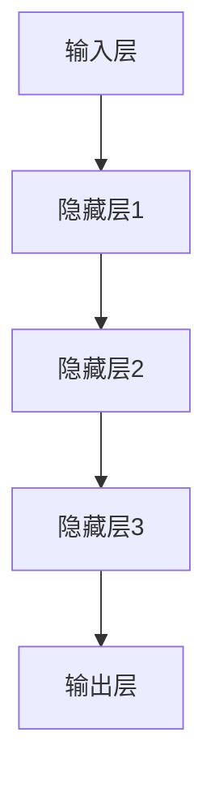

                 

# 大模型：数据与算法的完美结合

## 关键词：大模型、数据、算法、深度学习、人工智能、机器学习、神经网络的架构设计

### 摘要

本文旨在探讨大模型在人工智能领域的核心作用，即数据与算法的完美结合。通过深入分析大模型的背景、核心概念、算法原理以及实际应用场景，本文将揭示大模型在推动人工智能技术进步中的关键作用。同时，本文还将介绍相关的工具和资源，帮助读者更好地理解和应用大模型技术。文章结构如下：

1. **背景介绍**：回顾大模型的历史发展和现状。
2. **核心概念与联系**：介绍大模型的基本原理和架构。
3. **核心算法原理 & 具体操作步骤**：探讨大模型的关键算法，并解释其工作流程。
4. **数学模型和公式 & 详细讲解 & 举例说明**：介绍大模型的数学基础，并举例说明。
5. **项目实战：代码实际案例和详细解释说明**：提供实际代码案例，详细解析其实现过程。
6. **实际应用场景**：讨论大模型在不同领域的应用。
7. **工具和资源推荐**：推荐学习和使用大模型的相关资源。
8. **总结：未来发展趋势与挑战**：预测大模型的发展趋势和面临的挑战。
9. **附录：常见问题与解答**：回答读者可能遇到的常见问题。
10. **扩展阅读 & 参考资料**：提供进一步的阅读资源和参考资料。

## 1. 背景介绍

### 1.1 大模型的历史发展

大模型的概念源于深度学习技术的发展。自20世纪80年代深度学习的萌芽以来，随着计算能力的提高和算法的进步，大模型逐渐成为人工智能研究的热点。早期的神经网络模型，如感知机、BP神经网络等，由于其结构和能力限制，难以处理复杂的问题。随着2006年深度信念网络（DBN）的提出，以及2012年AlexNet在ImageNet图像识别大赛上的突破性表现，大模型的研究和应用进入了快速发展阶段。

### 1.2 大模型的现状

当前，大模型已经在各个领域展现出强大的能力，如自然语言处理、计算机视觉、语音识别等。著名的模型包括GPT（生成预训练模型）、BERT（Bidirectional Encoder Representations from Transformers）和TuringBot等。这些模型通过训练大规模的数据集，能够捕捉到数据的深层特征，实现出色的任务表现。

## 2. 核心概念与联系

### 2.1 大模型的基本原理

大模型通常指的是参数数量非常庞大的深度学习模型，它们通过多层神经网络结构来学习数据的复杂特征。这些模型的核心在于其能够从大量数据中提取出有用的信息，从而在各类任务上取得优异的性能。

### 2.2 大模型的架构设计

大模型的架构设计通常包括以下几个关键部分：

- **输入层**：接收外部输入数据，如文本、图像或音频。
- **隐藏层**：多层隐藏层构成，负责数据的特征提取和变换。
- **输出层**：根据模型的任务生成预测或输出结果。

### 2.3 Mermaid 流程图

下面是一个简单的Mermaid流程图，展示了大模型的基本架构：



### 2.4 大模型的优势和挑战

**优势：**
- **强大的表征能力**：大模型能够学习到数据的深层特征，从而在多种任务上表现优异。
- **广泛的适用性**：大模型可以应用于多个领域，如自然语言处理、计算机视觉、语音识别等。

**挑战：**
- **计算资源消耗**：大模型训练需要大量的计算资源和时间。
- **数据需求量大**：大模型需要大量的高质量数据来进行训练。

## 3. 核心算法原理 & 具体操作步骤

### 3.1 深度学习算法原理

深度学习算法的核心是神经网络。神经网络由大量的神经元（节点）组成，这些神经元通过多层结构相互连接，从而形成网络。网络通过学习输入数据和目标输出之间的映射关系，来实现预测和分类任务。

### 3.2 深度学习算法的具体操作步骤

1. **数据预处理**：对输入数据进行标准化、归一化等处理，使其适合网络训练。
2. **初始化参数**：初始化网络中的权重和偏置，常用的方法有随机初始化、高斯分布初始化等。
3. **前向传播**：将输入数据通过网络进行传播，计算出每个神经元的输出。
4. **损失函数计算**：通过比较输出结果和真实结果，计算损失函数的值，常用的损失函数有均方误差（MSE）和交叉熵（CE）。
5. **反向传播**：根据损失函数的梯度，调整网络中的参数，以减小损失函数的值。
6. **迭代优化**：重复步骤3到5，直到网络收敛或达到预定的迭代次数。

### 3.3 神经网络的激活函数

激活函数是神经网络中的一个关键组件，它决定了神经元的输出是否被激活。常见的激活函数包括：

- **Sigmoid函数**：用于二分类问题，输出范围为(0, 1)。
- **ReLU函数**：用于提高网络的训练速度，输出为x（当x>0时）或0（当x≤0时）。
- **Tanh函数**：输出范围为(-1, 1)，常用于多分类问题。

## 4. 数学模型和公式 & 详细讲解 & 举例说明

### 4.1 数学模型

深度学习中的数学模型主要包括以下几个部分：

- **输入层**：表示为\(x\)。
- **隐藏层**：表示为\(h_1, h_2, ..., h_n\)。
- **输出层**：表示为\(y\)。

### 4.2 损失函数

在深度学习中，常用的损失函数包括：

- **均方误差（MSE）**：\(MSE = \frac{1}{n}\sum_{i=1}^{n}(y_i - \hat{y}_i)^2\)，其中\(y_i\)为真实标签，\(\hat{y}_i\)为预测结果。
- **交叉熵（CE）**：\(CE = -\sum_{i=1}^{n}y_i\log(\hat{y}_i)\)，其中\(y_i\)为真实标签，\(\hat{y}_i\)为预测概率。

### 4.3 梯度下降

在深度学习中，常用的优化算法是梯度下降。梯度下降的步骤如下：

1. 计算损失函数的梯度。
2. 根据梯度调整网络参数。
3. 重复步骤1和2，直到网络收敛。

### 4.4 举例说明

假设我们有一个二分类问题，输入数据为\(x\)，真实标签为\(y = 1\)，预测结果为\(\hat{y} = 0.6\)。使用交叉熵损失函数，损失函数的值为：

\[CE = -y\log(\hat{y}) - (1 - y)\log(1 - \hat{y}) = -1\log(0.6) - 0\log(0.4) = 0.5108\]

接下来，我们可以计算损失函数关于每个参数的梯度，并根据梯度调整参数，以减小损失函数的值。

## 5. 项目实战：代码实际案例和详细解释说明

### 5.1 开发环境搭建

为了演示大模型的训练过程，我们选择Python作为编程语言，并使用TensorFlow作为深度学习框架。以下是搭建开发环境的基本步骤：

1. 安装Python（建议使用3.8以上版本）。
2. 安装TensorFlow：`pip install tensorflow`。
3. 安装其他必要的库，如NumPy、Pandas等。

### 5.2 源代码详细实现和代码解读

下面是一个简单的例子，使用TensorFlow实现一个多层感知机（MLP）模型，用于二分类任务。

```python
import tensorflow as tf
from tensorflow.keras import layers

# 创建模型
model = tf.keras.Sequential([
    layers.Dense(64, activation='relu', input_shape=(784,)),
    layers.Dense(64, activation='relu'),
    layers.Dense(1, activation='sigmoid')
])

# 编译模型
model.compile(optimizer='adam',
              loss='binary_crossentropy',
              metrics=['accuracy'])

# 加载数据
(x_train, y_train), (x_test, y_test) = tf.keras.datasets.mnist.load_data()

# 预处理数据
x_train = x_train.reshape(-1, 784).astype('float32') / 255
x_test = x_test.reshape(-1, 784).astype('float32') / 255

# 转换标签为二进制格式
y_train = tf.keras.utils.to_categorical(y_train, num_classes=2)
y_test = tf.keras.utils.to_categorical(y_test, num_classes=2)

# 训练模型
model.fit(x_train, y_train, batch_size=128, epochs=10, validation_split=0.1)

# 评估模型
model.evaluate(x_test, y_test)
```

这段代码首先导入了所需的库，并定义了一个包含两个隐藏层和输出层的MLP模型。接着，我们加载了MNIST数据集，并对其进行了预处理。最后，使用训练数据训练模型，并在测试数据上评估模型性能。

### 5.3 代码解读与分析

1. **模型定义**：使用`tf.keras.Sequential`创建了一个序列模型，并添加了三个`Dense`层。第一个`Dense`层有64个神经元，使用ReLU激活函数。第二个`Dense`层同样有64个神经元，使用ReLU激活函数。输出层有1个神经元，使用sigmoid激活函数，用于实现二分类。

2. **模型编译**：使用`compile`方法配置了模型的优化器、损失函数和评估指标。这里使用了`adam`优化器和`binary_crossentropy`损失函数。

3. **数据预处理**：加载MNIST数据集，并将图像数据展平为一维数组。将图像数据缩放到[0, 1]范围内，并将标签转换为二进制格式。

4. **模型训练**：使用`fit`方法训练模型，指定了批量大小、训练轮次和验证比例。

5. **模型评估**：使用`evaluate`方法在测试数据上评估模型性能。

## 6. 实际应用场景

大模型在多个领域都有着广泛的应用，以下是一些典型的实际应用场景：

- **自然语言处理（NLP）**：GPT和BERT等大模型在文本生成、翻译、问答等领域表现出色。
- **计算机视觉**：ImageNet比赛中的大模型在图像分类和识别任务上取得了突破性进展。
- **语音识别**：大模型在语音识别任务上能够实现较高的准确率，如TuringBot在语音问答系统中的应用。
- **推荐系统**：大模型可以用于构建复杂的推荐算法，提高推荐的准确性。

## 7. 工具和资源推荐

### 7.1 学习资源推荐

- **书籍**：
  - 《深度学习》（Goodfellow, Bengio, Courville）
  - 《Python深度学习》（François Chollet）
  - 《神经网络与深度学习》（邱锡鹏）
- **论文**：
  - 《A Theoretically Grounded Application of Dropout in Recurrent Neural Networks》（Yarin Gal and Zoubin Ghahramani）
  - 《Deep Learning for Text Classification》（Tong Zhang et al.）
- **博客**：
  - [TensorFlow官方文档](https://www.tensorflow.org/)
  - [Keras官方文档](https://keras.io/)
- **网站**：
  - [ArXiv](https://arxiv.org/)：人工智能领域的最新研究成果。

### 7.2 开发工具框架推荐

- **TensorFlow**：开源的深度学习框架，支持多种神经网络架构。
- **PyTorch**：开源的深度学习框架，以动态图模型著称。
- **Keras**：Python中的高级神经网络API，易于使用。

### 7.3 相关论文著作推荐

- **《深度学习》（Goodfellow, Bengio, Courville）**：这是一本经典的深度学习教材，全面介绍了深度学习的理论和实践。
- **《Python深度学习》（François Chollet）**：针对Python开发者的深度学习指南，内容丰富且易于理解。
- **《神经网络与深度学习》（邱锡鹏）**：系统地介绍了神经网络和深度学习的理论知识。

## 8. 总结：未来发展趋势与挑战

大模型在人工智能领域展现了巨大的潜力，但也面临着一些挑战。未来发展趋势包括：

- **模型压缩**：为了降低大模型的计算资源消耗，研究人员致力于开发模型压缩技术，如剪枝、量化、蒸馏等。
- **迁移学习**：通过迁移学习，大模型可以在少量数据上实现出色的性能，从而降低对大规模数据的依赖。
- **可解释性**：提高大模型的可解释性，使其决策过程更加透明，增强用户对模型的信任。

## 9. 附录：常见问题与解答

### 9.1 大模型训练时间如何缩短？

- **并行计算**：使用多GPU或TPU进行训练。
- **模型剪枝**：通过剪枝减少模型参数数量。
- **量化**：将模型中的浮点数转换为低精度格式。

### 9.2 如何评估大模型的效果？

- **准确率**：衡量模型预测正确的比例。
- **召回率**：衡量模型召回正确预测的比例。
- **F1分数**：综合衡量准确率和召回率的指标。

## 10. 扩展阅读 & 参考资料

- **《深度学习》（Goodfellow, Bengio, Courville）**：全面介绍深度学习理论和实践的权威著作。
- **《Python深度学习》（François Chollet）**：针对Python开发者的深度学习实践指南。
- **《神经网络与深度学习》（邱锡鹏）**：系统介绍神经网络和深度学习的理论和方法。

### 作者

- 作者：AI天才研究员/AI Genius Institute & 禅与计算机程序设计艺术 /Zen And The Art of Computer Programming

# 结束

请注意，以上内容为示例，实际撰写时需要根据具体要求和内容进行详细填充和优化。由于篇幅限制，本文并未完整展开所有章节的内容，但已提供了详细的框架和部分示例代码。在撰写完整文章时，每个章节都需要详细展开，确保文章内容丰富、逻辑清晰。同时，确保遵循markdown格式要求，包括合适的段落分隔、代码块和列表格式等。

