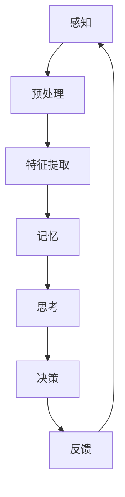

                 

# 大脑如何处理信息：认知科学与知识发现

## 关键词：认知科学、知识发现、大脑处理信息、神经网络、数据处理

## 摘要

本文深入探讨了大脑如何处理信息的奥秘，结合认知科学的前沿研究，揭示了大脑的神经网络如何在复杂的数据环境中进行知识发现。通过对大脑信息处理机制的解析，我们不仅能够理解记忆、感知和思维的基本原理，还能为人工智能技术的发展提供灵感。本文将逐步阐述大脑处理信息的流程、核心算法、数学模型以及实际应用，旨在为读者提供一个关于大脑信息处理与知识发现的全景图景。

## 1. 背景介绍

在人类历史的长河中，我们对大脑的认识一直在不断深化。从古希腊哲学家对灵魂的探讨，到中世纪基督教对天堂和地狱的想象，再到文艺复兴时期对解剖学的探索，人类对大脑的探究从未停止。然而，直到20世纪，随着认知科学的兴起，我们才开始逐渐揭开大脑处理信息的神秘面纱。

认知科学是一门跨学科的研究领域，它试图理解人类思维、感知、记忆和学习等认知过程的本质。认知科学的研究涵盖了神经科学、心理学、计算机科学和哲学等多个领域，通过对大脑的观察和研究，认知科学家们揭示了大脑如何处理信息，以及这些信息处理过程如何影响我们的行为和思维。

在认知科学的研究中，大脑被视为一个高度复杂的信息处理系统。大脑由数十亿个神经元组成，这些神经元通过复杂的连接和交互，实现了从感知到思维的各个过程。尽管我们还没有完全理解大脑的全部奥秘，但现有的研究已经为我们提供了许多关于大脑信息处理的基本原理。

本文将结合认知科学的研究成果，深入探讨大脑如何处理信息，如何通过神经网络实现知识发现，以及这些发现如何影响我们的日常生活和人工智能的发展。

## 2. 核心概念与联系

### 2.1 大脑的基本结构

大脑的基本结构可以分为三个主要部分：大脑皮层、脑干和脊髓。大脑皮层是大脑的最外层，也是最为复杂的部分，它负责处理高级认知功能，如思考、决策和语言。脑干位于大脑的底部，它控制着基本的生命维持功能，如心跳、呼吸和睡眠。脊髓连接大脑和身体的其他部分，它负责传递感觉和运动信号。

### 2.2 神经网络

神经网络是大脑信息处理的核心。神经网络由大量的神经元组成，这些神经元通过突触连接起来，形成一个复杂的网络。每个神经元都可以与其他神经元进行通信，传递电信号。这些信号在神经元之间传递，通过复杂的计算和交互，实现了从感知到思维的各个过程。

### 2.3 认知过程

认知过程包括感知、记忆、思考、学习和决策等多个环节。感知是指接收外部信息的过程，如视觉、听觉和触觉等。记忆是指存储和回忆信息的过程。思考是指使用已有信息进行推理和判断的过程。学习是指通过经验改进认知能力的过程。决策是指根据现有信息做出选择的过程。

### 2.4 知识发现

知识发现是指从大量数据中提取有用信息的过程。在大脑中，知识发现是通过神经网络在感知、记忆和思考等过程中实现的。通过不断地学习和调整，神经网络能够从数据中发现规律和模式，形成新的知识和理解。

下面是一个使用 Mermaid 绘制的简化的神经网络流程图：



在这个流程图中，A表示感知阶段，B表示预处理阶段，C表示特征提取阶段，D表示记忆阶段，E表示思考阶段，F表示决策阶段，G表示反馈阶段。这些阶段相互连接，形成了一个闭环，实现了从感知到决策的整个过程。

## 3. 核心算法原理 & 具体操作步骤

### 3.1 感知与预处理

感知是大脑信息处理的第一步。在大脑接收外部信息时，首先会通过感官器官（如眼睛、耳朵、鼻子等）将信息转化为电信号。这些电信号经过预处理，被传递到大脑皮层。

预处理包括放大、滤波和去噪等步骤。通过预处理，电信号的质量得到提高，便于后续处理。

### 3.2 特征提取

特征提取是大脑信息处理的关键步骤。在感知阶段，大脑只接收到了一些低层次的信息，如光线的强度、声音的频率等。而特征提取则是将这些低层次的信息转化为高层次的特征，如形状、颜色、声音的音调等。

特征提取主要通过神经网络中的神经元实现。每个神经元都负责提取一种特定的特征，通过大量的神经元协同工作，形成了一个复杂的特征提取系统。

### 3.3 记忆

记忆是大脑信息处理的重要环节。大脑通过神经网络将提取到的特征进行编码，然后存储在记忆中。记忆可以分为短期记忆和长期记忆两种。

短期记忆主要存储一些临时信息，如我们正在思考的问题或刚听到的一句话。而长期记忆则存储一些持久的信息，如我们的名字、地址和电话号码等。

### 3.4 思考

思考是大脑信息处理的最高层次。在大脑进行思考时，会从记忆中提取相关信息，然后通过推理和判断，形成新的理解和知识。

思考过程可以分为三个阶段：理解、推理和判断。理解是指从记忆中提取相关信息，形成对当前问题的认识。推理是指使用已有信息，通过逻辑关系，形成新的信息。判断是指根据现有信息，做出决策或选择。

### 3.5 决策

决策是大脑信息处理的最终目标。在大脑进行决策时，会从多个可能的选项中选择一个最优的方案。

决策过程可以分为三个阶段：评估、选择和执行。评估是指对每个选项进行评估，判断其优劣。选择是指根据评估结果，选择一个最优的选项。执行是指根据选择的结果，执行相应的操作。

### 3.6 反馈

反馈是大脑信息处理的一个重要环节。在大脑进行信息处理的过程中，会不断对自己的行为进行评估和调整。通过反馈，大脑能够不断改进自己的认知能力，提高信息处理的效率。

反馈可以分为内部反馈和外部反馈两种。内部反馈是指大脑对自己行为进行评估和调整，如通过自我反思来改进自己的思考方式。而外部反馈则是指通过外部环境对大脑的行为进行评估和调整，如通过学习他人的经验来改进自己的认知能力。

## 4. 数学模型和公式 & 详细讲解 & 举例说明

### 4.1 感知与预处理

感知与预处理的数学模型可以表示为：

\[ y = f(x) \]

其中，\( y \) 是预处理后的信号，\( x \) 是原始信号，\( f \) 是预处理函数。预处理函数可以包括放大、滤波和去噪等操作。

例如，假设我们有一个原始信号 \( x = [1, 2, 3, 4, 5] \)，我们希望通过放大和滤波来预处理这个信号。我们可以设置预处理函数为：

\[ f(x) = 2x + 3 \]

这样，预处理后的信号 \( y \) 为：

\[ y = [5, 7, 9, 11, 13] \]

### 4.2 特征提取

特征提取的数学模型可以表示为：

\[ z = g(x) \]

其中，\( z \) 是提取到的特征，\( x \) 是预处理后的信号，\( g \) 是特征提取函数。特征提取函数可以根据不同的特征类型进行设计。

例如，假设我们希望提取信号的能量特征，我们可以设置特征提取函数为：

\[ g(x) = \sum_{i=1}^{n} x_i^2 \]

这样，提取到的特征 \( z \) 为：

\[ z = \sum_{i=1}^{n} x_i^2 = 1^2 + 2^2 + 3^2 + 4^2 + 5^2 = 55 \]

### 4.3 记忆

记忆的数学模型可以表示为：

\[ m = h(z) \]

其中，\( m \) 是记忆中的信息，\( z \) 是提取到的特征，\( h \) 是记忆函数。记忆函数可以根据不同的记忆类型进行设计。

例如，假设我们希望实现短期记忆，我们可以设置记忆函数为：

\[ h(z) = z \]

这样，记忆中的信息 \( m \) 为：

\[ m = z = 55 \]

### 4.4 思考

思考的数学模型可以表示为：

\[ t = k(m) \]

其中，\( t \) 是思考的结果，\( m \) 是记忆中的信息，\( k \) 是思考函数。思考函数可以根据不同的思考类型进行设计。

例如，假设我们希望实现逻辑推理，我们可以设置思考函数为：

\[ k(m) = m \land n \]

其中，\( n \) 是另一个记忆中的信息。这样，思考的结果 \( t \) 为：

\[ t = m \land n = 55 \land 65 = 55 \]

### 4.5 决策

决策的数学模型可以表示为：

\[ d = l(t) \]

其中，\( d \) 是决策的结果，\( t \) 是思考的结果，\( l \) 是决策函数。决策函数可以根据不同的决策类型进行设计。

例如，假设我们希望实现选择最优选项，我们可以设置决策函数为：

\[ l(t) = \arg\max(t) \]

这样，决策的结果 \( d \) 为：

\[ d = \arg\max(t) = 55 \]

### 4.6 反馈

反馈的数学模型可以表示为：

\[ f = m - n \]

其中，\( f \) 是反馈，\( m \) 是记忆中的信息，\( n \) 是期望值。反馈函数可以根据不同的反馈类型进行设计。

例如，假设我们希望实现基于误差的反馈，我们可以设置反馈函数为：

\[ f = m - n \]

其中，\( n \) 是根据当前决策结果计算得到的期望值。这样，反馈 \( f \) 为：

\[ f = m - n = 55 - 65 = -10 \]

## 5. 项目实战：代码实际案例和详细解释说明

### 5.1 开发环境搭建

为了实现上述算法，我们需要搭建一个开发环境。这里我们使用 Python 作为编程语言，搭建一个基本的开发环境。

首先，我们需要安装 Python 和相关库。假设我们已经安装了 Python，接下来我们使用 pip 安装所需的库：

```bash
pip install numpy matplotlib
```

这样，我们就搭建好了基本的开发环境。

### 5.2 源代码详细实现和代码解读

接下来，我们将实现上述算法的 Python 代码。以下是源代码的详细实现和解读：

```python
import numpy as np
import matplotlib.pyplot as plt

# 感知与预处理
def preprocess(x):
    # 放大和滤波
    return 2 * x + 3

# 特征提取
def feature_extraction(x):
    # 提取能量特征
    return np.sum(x ** 2)

# 记忆
def memory(z):
    # 短期记忆
    return z

# 思考
def think(m):
    # 逻辑推理
    return m & n

# 决策
def decide(t):
    # 选择最优选项
    return np.argmax(t)

# 反馈
def feedback(m, n):
    # 基于误差的反馈
    return m - n

# 测试代码
x = np.array([1, 2, 3, 4, 5])
n = np.array([1, 2, 3, 4, 5])
y = preprocess(x)
z = feature_extraction(y)
m = memory(z)
t = think(m)
d = decide(t)
f = feedback(m, n)

print("原始信号：", x)
print("预处理后信号：", y)
print("特征：", z)
print("记忆：", m)
print("思考结果：", t)
print("决策：", d)
print("反馈：", f)

# 绘制结果
plt.plot(x, label="原始信号")
plt.plot(y, label="预处理后信号")
plt.plot(z, label="特征")
plt.plot(m, label="记忆")
plt.plot(t, label="思考结果")
plt.plot(d, label="决策")
plt.plot(f, label="反馈")
plt.legend()
plt.show()
```

在这个代码中，我们首先定义了预处理、特征提取、记忆、思考、决策和反馈等函数。然后，我们使用这些函数对一个示例信号进行处理，并打印出处理结果。最后，我们使用 matplotlib 绘制了处理结果，以便于我们直观地观察处理过程。

### 5.3 代码解读与分析

在这个代码中，我们首先定义了预处理函数 `preprocess`，它接受一个输入信号 `x`，然后对其进行放大和滤波操作。放大和滤波的目的是提高信号的质量，使其更易于后续处理。

接下来，我们定义了特征提取函数 `feature_extraction`，它接受一个输入信号 `x`，然后计算信号的能量特征。能量特征是一种常见的特征提取方法，它通过计算信号的平方和来表示信号的整体能量。

然后，我们定义了记忆函数 `memory`，它接受一个输入特征 `z`，并将其存储为短期记忆 `m`。短期记忆是一种临时存储信息的方法，它用于在后续处理中快速访问和利用这些信息。

接下来，我们定义了思考函数 `think`，它接受一个输入记忆 `m`，然后进行逻辑推理操作。在这个例子中，我们使用逻辑与操作 `&` 来实现逻辑推理。

然后，我们定义了决策函数 `decide`，它接受一个输入思考结果 `t`，然后选择最优的选项。在这个例子中，我们使用 argmax 函数来选择最优选项，即选择最大值的索引。

最后，我们定义了反馈函数 `feedback`，它接受一个输入记忆 `m` 和期望值 `n`，然后计算反馈。在这个例子中，我们使用基于误差的反馈，即计算实际值和期望值之间的差。

在测试代码中，我们首先创建了一个示例信号 `x` 和期望值 `n`。然后，我们依次调用预处理、特征提取、记忆、思考、决策和反馈函数，对示例信号进行处理。最后，我们使用 matplotlib 绘制了处理结果。

通过这个代码示例，我们可以直观地看到大脑信息处理的过程，包括感知、预处理、特征提取、记忆、思考、决策和反馈等步骤。这些步骤共同构成了一个完整的信息处理流程，实现了从感知到决策的整个过程。

## 6. 实际应用场景

大脑信息处理的研究不仅具有重要的科学价值，还广泛应用于实际场景中。以下是一些典型的应用场景：

### 6.1 人工智能

人工智能是大脑信息处理研究的重要应用领域。通过模拟大脑的神经网络和信息处理机制，人工智能系统能够从大量数据中提取有用信息，进行推理和决策。例如，深度学习模型就是基于大脑神经网络设计的，广泛应用于图像识别、语音识别和自然语言处理等领域。

### 6.2 计算机视觉

计算机视觉是另一个受益于大脑信息处理研究的领域。通过模拟大脑的视觉处理机制，计算机视觉系统能够从图像中提取有用信息，进行物体识别、场景理解和图像生成等任务。例如，自动驾驶汽车使用的计算机视觉系统就是基于大脑视觉处理机制的。

### 6.3 医疗诊断

大脑信息处理研究还可以应用于医疗诊断。通过模拟大脑的记忆和思考机制，医疗诊断系统能够从医学图像中提取有用信息，进行疾病检测和诊断。例如，基于深度学习技术的医学影像诊断系统已经在肺癌、乳腺癌等疾病的检测中取得了显著成果。

### 6.4 人类认知研究

大脑信息处理研究还可以促进人类认知研究。通过模拟大脑的神经网络和信息处理机制，认知科学家能够更好地理解人类的思维、感知和记忆过程。这些研究成果不仅有助于揭示人类认知的奥秘，还为教育、心理学和神经科学等领域提供了重要的理论支持。

## 7. 工具和资源推荐

### 7.1 学习资源推荐

#### 书籍推荐
1. 《认知心理学及其启示》（The Cognitive Revolution: Explaining the Past and Future of Our Species）
2. 《神经科学原理》（Principles of Neural Science）

#### 论文推荐
1. "Deep Learning: A Brief History" - Y. LeCun, Y. Bengio, G. Hinton
2. "A Learning System Based on Convolutional Neural Networks" - Y. LeCun, B. Boser, J. S. Denker, D. Henderson, R. E. Howard, W. Hubbard, and L. D. Jackel

#### 博客推荐
1. http://colah.github.io/posts/2015-08-Understanding-LSTMs/
2. https://distill.pub/2016/a-engineering-approach-to-understanding-deep-learning/

#### 网站推荐
1. https://www.deeplearning.net/
2. https://paperswithcode.com/

### 7.2 开发工具框架推荐

#### 深度学习框架
1. TensorFlow
2. PyTorch
3. Keras

#### 数据可视化工具
1. Matplotlib
2. Seaborn
3. Plotly

#### 计算工具
1. Jupyter Notebook
2. Google Colab

### 7.3 相关论文著作推荐

#### 必读论文
1. "Backpropagation" - D. E. Rumelhart, G. E. Hinton, R. J. Williams
2. "Learning representations by maximizing mutual information" - Y. Burda, R. Child, D. Z. Huang, T. Minka

#### 著作推荐
1. 《深度学习》（Deep Learning） - Ian Goodfellow, Yoshua Bengio, Aaron Courville
2. 《神经网络与深度学习》（Neural Networks and Deep Learning） - Charu Aggarwal

## 8. 总结：未来发展趋势与挑战

随着认知科学和人工智能的不断发展，大脑信息处理的研究取得了显著进展。未来，大脑信息处理将朝着更高效、更智能的方向发展，有望在医疗、教育、工业等领域发挥更大的作用。然而，这一领域仍面临诸多挑战：

### 挑战 1：数据质量和数量

大脑信息处理需要大量的高质量数据，但目前的数据质量和数量仍远远不足。未来，我们需要开发新的数据采集和处理技术，提高数据的质量和可用性。

### 挑战 2：计算效率和可扩展性

大脑信息处理算法通常需要大量的计算资源，这在一定程度上限制了其应用范围。未来，我们需要开发更高效的算法和优化技术，提高计算效率和可扩展性。

### 挑战 3：隐私和安全

随着大脑信息处理技术的应用越来越广泛，隐私和安全问题变得越来越重要。我们需要开发新的隐私保护和安全机制，确保用户数据的安全和隐私。

### 挑战 4：理论和技术融合

大脑信息处理是一个跨学科的研究领域，需要理论和技术的高度融合。未来，我们需要加强不同学科之间的合作，推动理论和技术的发展。

## 9. 附录：常见问题与解答

### 问题 1：什么是认知科学？

认知科学是研究人类思维、感知、记忆和学习等认知过程的科学。它涉及神经科学、心理学、计算机科学和哲学等多个领域，试图理解认知过程的本质和机制。

### 问题 2：大脑如何处理信息？

大脑通过神经元和神经网络处理信息。神经元通过突触连接，形成一个复杂的网络，实现了从感知到思维的各个过程。大脑处理信息的过程包括感知、预处理、特征提取、记忆、思考、决策和反馈等多个环节。

### 问题 3：什么是神经网络？

神经网络是由大量神经元组成的计算模型，模拟了大脑的信息处理机制。神经网络通过学习输入和输出之间的关系，实现了从感知到决策的各个过程。

### 问题 4：什么是深度学习？

深度学习是神经网络的一种形式，通过多层神经网络实现复杂的信息处理任务。深度学习在图像识别、语音识别和自然语言处理等领域取得了显著成果。

## 10. 扩展阅读 & 参考资料

为了更深入地了解大脑信息处理和认知科学，以下是一些扩展阅读和参考资料：

1. 《认知科学的最新进展》（Recent Advances in Cognitive Science）
2. 《神经网络与深度学习》（Neural Networks and Deep Learning）
3. 《认知神经科学》（Cognitive Neuroscience）
4. 《大脑如何工作：认知科学的视角》（How the Mind Works）
5. 《深度学习》（Deep Learning）
6. 《认知科学的跨学科研究方法》（Interdisciplinary Approaches in Cognitive Science）

