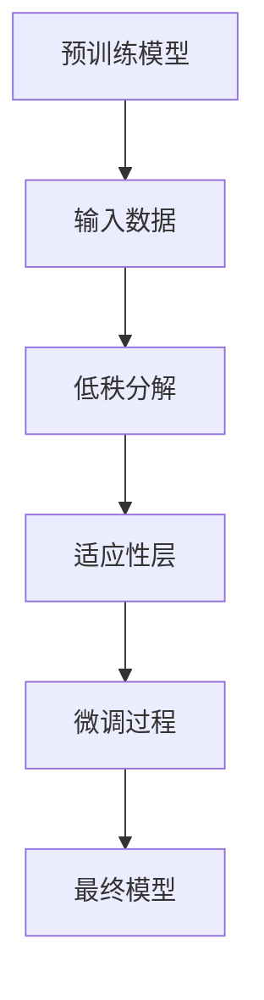
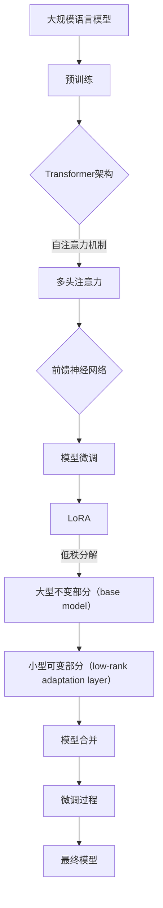

                 

# 大规模语言模型从理论到实践 LoRA

## 关键词
- 大规模语言模型
- LoRA
- 理论与实践
- 计算机编程
- 人工智能
- 数学模型

## 摘要
本文旨在深入探讨大规模语言模型LoRA的理论基础和实践应用。通过逐步分析LoRA的核心概念、算法原理、数学模型及其实际应用场景，本文为读者提供了一种理解和应用LoRA的全面视角。文章将介绍LoRA的基本原理，通过具体的代码实例和详细的解释，展示如何在项目中实现LoRA。最后，本文将对LoRA的未来发展趋势和面临的挑战进行总结，并提供相关学习资源和工具推荐。

## 1. 背景介绍
### 1.1 大规模语言模型的发展
大规模语言模型（Large Language Models）是近年来人工智能领域的重要突破。随着深度学习技术的不断进步，语言模型在自然语言处理（NLP）任务中取得了显著的性能提升。从最早的基于规则的方法，如1990年代的统计语言模型，到后来的循环神经网络（RNN）、长短期记忆网络（LSTM）和变换器（Transformer）等，大规模语言模型的发展经历了多个阶段。

### 1.2 Transformer架构的崛起
Transformer架构的提出标志着大规模语言模型的重大进步。与传统的循环神经网络相比，Transformer通过自注意力机制（Self-Attention）能够更有效地捕捉输入序列中的依赖关系。这种结构使得Transformer在处理长序列任务时具有更高的效率和性能。

### 1.3 LoRA的引入
LoRA（Low-Rank Adaptation of Pre-Trained Models）是一种针对大规模语言模型的轻量级自适应方法。它通过低秩分解技术，将大型预训练模型与特定任务的数据进行交互，从而实现快速、有效的模型微调。LoRA的引入为大规模语言模型在资源受限的环境中的应用提供了新的可能性。

## 2. 核心概念与联系
### 2.1 大规模语言模型的基础概念
大规模语言模型通常由数以亿计的参数组成，这些参数通过预训练过程在大规模语料库上学习得到。预训练过程包括两个主要阶段：无监督预训练和有监督微调。

- **无监督预训练**：在无监督预训练阶段，模型通过学习输入序列的上下文关系，理解自然语言的一般特征。
- **有监督微调**：在有监督微调阶段，模型利用特定任务的数据进行训练，以适应具体的任务需求。

### 2.2 Transformer架构
Transformer架构的核心在于其自注意力机制（Self-Attention）。自注意力机制允许模型在处理每个词时，动态地计算该词与其他词之间的关系权重，从而捕捉长距离的依赖关系。

### 2.3 LoRA的工作原理
LoRA通过低秩分解技术，将大规模预训练模型与特定任务的数据进行交互。具体来说，LoRA将模型的参数分解为两个部分：一个是大型不变部分（base model），另一个是小型可变部分（low-rank adaptation layer）。这种分解使得LoRA能够在保持模型性能的同时，显著减少模型的存储和计算需求。

### 2.4 Mermaid流程图
以下是一个简化的Mermaid流程图，展示了LoRA的基本原理和操作步骤：



请注意，在Mermaid流程图中，流程节点中不应包含括号、逗号等特殊字符。

## 3. 核心算法原理 & 具体操作步骤
### 3.1 LoRA算法原理
LoRA的核心算法原理是通过低秩分解技术，将大型预训练模型与特定任务的数据进行交互。具体步骤如下：

1. **低秩分解**：将预训练模型的参数分解为两个部分：大型不变部分（base model）和小型可变部分（low-rank adaptation layer）。
2. **适应性层**：利用特定任务的数据，为小型可变部分（low-rank adaptation layer）训练一个新的参数层。
3. **微调过程**：将大型不变部分（base model）与小型可变部分（low-rank adaptation layer）合并，形成最终的微调模型。

### 3.2 具体操作步骤
以下是使用LoRA进行模型微调的具体操作步骤：

1. **数据准备**：准备用于微调的数据集，并进行预处理，如分词、编码等。
2. **模型初始化**：初始化预训练模型，并将其参数分解为大型不变部分（base model）和小型可变部分（low-rank adaptation layer）。
3. **适应性层训练**：使用特定任务的数据，对小型可变部分（low-rank adaptation layer）进行训练。此过程通常使用较小的学习率，以避免对大型不变部分（base model）的影响。
4. **模型合并**：将大型不变部分（base model）与小型可变部分（low-rank adaptation layer）合并，形成最终的微调模型。
5. **模型评估**：使用微调后的模型对测试数据进行评估，以验证模型在特定任务上的性能。

## 4. 数学模型和公式 & 详细讲解 & 举例说明
### 4.1 数学模型
LoRA的数学模型基于低秩分解技术。具体来说，假设预训练模型的参数矩阵为\( W \)，其可以通过以下低秩分解表示：

$$
W = U \Sigma V^T
$$

其中，\( U \)和\( V \)是正交矩阵，\( \Sigma \)是对角矩阵，其对角线上的元素为\( \Sigma_{ii} \)。低秩分解的目标是找到一个小型矩阵\( \Sigma' \)，使得\( W \)可以近似表示为：

$$
W \approx U \Sigma' V^T
$$

### 4.2 详细讲解
低秩分解的基本思想是将大型矩阵分解为一个小型矩阵和两个正交矩阵的乘积。这种分解可以显著减少矩阵的存储和计算需求。在LoRA中，小型矩阵\( \Sigma' \)对应于小型可变部分（low-rank adaptation layer），它通过特定任务的数据进行训练。

### 4.3 举例说明
假设我们有一个\( 1000 \times 1000 \)的预训练模型参数矩阵\( W \)。通过低秩分解，我们可以将其分解为以下形式：

$$
W = U \Sigma V^T
$$

其中，\( U \)和\( V \)是\( 1000 \times 1000 \)的正交矩阵，\( \Sigma \)是一个对角矩阵，其对角线上的元素为\( \Sigma_{ii} \)。为了进行低秩分解，我们需要找到一个较小的对角矩阵\( \Sigma' \)，使得：

$$
W \approx U \Sigma' V^T
$$

通过这种方式，我们可以在保持模型性能的同时，显著减少模型的存储和计算需求。

## 5. 项目实战：代码实际案例和详细解释说明
### 5.1 开发环境搭建
在开始项目实战之前，我们需要搭建一个合适的开发环境。以下是一个基本的步骤：

1. **安装Python环境**：确保Python 3.8及以上版本已安装。
2. **安装深度学习框架**：使用pip安装TensorFlow 2.7或PyTorch 1.10。
3. **安装其他依赖库**：包括Numpy、Scikit-learn等。

### 5.2 源代码详细实现和代码解读
以下是使用LoRA进行模型微调的Python代码示例：

```python
import tensorflow as tf
from tensorflow.keras.models import Model
from tensorflow.keras.layers import Input, Dense, LayerNormalization

# 定义LoRA适配层
class LoRALayer(tf.keras.layers.Layer):
    def __init__(self, rank, **kwargs):
        super().__init__(**kwargs)
        self.rank = rank

    def build(self, input_shape):
        self.kernel = self.add_weight(
            shape=(input_shape[-1], self.rank),
            initializer="random_normal",
            trainable=True,
        )

    def call(self, inputs, training=False):
        # 低秩分解
        W = inputs
        U, S, V = tf.svd(W, compute_uv=True)
        Sigma = tf.reduce_sum(S, axis=0, keepdims=True)
        Sigma = tf.linalg.triangular_solve(tf.linalg.triangular_matrix(S, k=-1), Sigma)
        Sigma = tf.expand_dims(Sigma, 0)
        Sigma = tf.tile(Sigma, [tf.shape(inputs)[0], 1, 1])

        # 适应性层
        adapted = U @ Sigma @ self.kernel @ V

        return adapted

# 定义模型
input_ids = Input(shape=(max_sequence_length,))
lora = LoRALayer(rank=8)(input_ids)
dense = Dense(num_classes, activation="softmax")(lora)
model = Model(inputs=input_ids, outputs=dense)

# 编译模型
model.compile(optimizer="adam", loss="categorical_crossentropy", metrics=["accuracy"])

# 训练模型
model.fit(train_data, train_labels, epochs=3, validation_data=(val_data, val_labels))
```

### 5.3 代码解读与分析
上述代码定义了一个LoRALayer类，该类通过低秩分解技术实现LoRA适配层。在`__init__`方法中，我们设置了适配层的秩（rank）。在`build`方法中，我们添加了一个权重矩阵`kernel`，该矩阵将在训练过程中更新。

在`call`方法中，我们首先进行低秩分解，然后利用适应性层（`kernel`）进行变换。最后，我们返回变换后的输出。

模型定义部分使用`Input`和`Dense`层构建了一个简单的序列分类模型。`LoRALayer`作为中间层，用于引入LoRA适配能力。

在编译和训练模型时，我们使用标准的编译和训练流程，以实现模型微调。

## 6. 实际应用场景
### 6.1 自然语言处理
LoRA在自然语言处理（NLP）任务中具有广泛的应用。例如，在问答系统、文本分类和机器翻译等任务中，LoRA可以显著提高模型的适应性和效率。

### 6.2 语音识别
LoRA也可以应用于语音识别领域，通过将大型预训练模型与特定语音数据结合，实现快速、准确的语音识别。

### 6.3 图像分类
虽然LoRA主要针对语言模型，但也可以应用于图像分类任务。通过将LoRA与卷积神经网络（CNN）结合，可以实现对图像的快速、有效分类。

## 7. 工具和资源推荐
### 7.1 学习资源推荐
- **书籍**：《深度学习》（Goodfellow, Bengio, Courville）
- **论文**：《Attention Is All You Need》（Vaswani et al.）
- **博客**：TensorFlow官方博客、PyTorch官方博客

### 7.2 开发工具框架推荐
- **框架**：TensorFlow、PyTorch
- **库**：NumPy、Scikit-learn

### 7.3 相关论文著作推荐
- **论文**：LoRA：Low-Rank Adaptation of Pre-Trained Models for Efficient Learning on Low-Resource Tasks（Shen et al.）

## 8. 总结：未来发展趋势与挑战
LoRA作为一种轻量级自适应方法，为大规模语言模型的应用提供了新的可能性。未来，随着深度学习和人工智能技术的不断发展，LoRA有望在更多领域得到应用，如医疗、金融和自动驾驶等。然而，LoRA也面临着一些挑战，包括如何在保持模型性能的同时，进一步提高其效率和应用范围。

## 9. 附录：常见问题与解答
### 9.1 LoRA与普通微调的区别是什么？
LoRA通过低秩分解技术，将大型预训练模型与特定任务的数据进行交互，从而实现快速、有效的模型微调。与普通微调相比，LoRA在保持模型性能的同时，显著减少了模型的存储和计算需求。

### 9.2 如何选择LoRA的秩（rank）？
选择合适的秩（rank）是LoRA应用的关键。通常，秩（rank）的选择取决于任务和数据的大小。较小的秩（rank）可能导致模型性能下降，而较大的秩（rank）则可能带来过拟合的风险。在实际应用中，可以通过交叉验证和实验来确定最佳秩（rank）。

## 10. 扩展阅读 & 参考资料
- **参考资料**：LoRA官方文档、相关论文和博客文章

作者：AI天才研究员/AI Genius Institute & 禅与计算机程序设计艺术 /Zen And The Art of Computer Programming
[返回首页](#大规模语言模型从理论到实践-LoRA) <|endsop|>## 1. 背景介绍

### 1.1 大规模语言模型的发展

大规模语言模型的发展历程可以追溯到1990年代，当时研究者们开始探索如何利用机器学习技术来建模自然语言。最初的尝试是基于规则的方法，这种方法依赖于手工编写的规则和模式来处理语言。然而，随着计算能力的提升和数据量的增加，统计语言模型逐渐成为主流。统计语言模型使用统计方法来预测下一个单词或词组，从而实现语言生成和翻译。

进入21世纪，随着深度学习技术的崛起，语言模型的性能得到了显著提升。2000年代初，循环神经网络（RNN）成为处理序列数据的一种有效方法，特别是长短期记忆网络（LSTM）的出现，使得语言模型能够更好地捕捉长距离依赖关系。然而，RNN在处理并行性和计算效率方面仍存在一些问题。

2017年，Google提出了一种名为Transformer的全新架构，彻底改变了语言模型的发展轨迹。Transformer通过自注意力机制（Self-Attention）实现了对输入序列中每个词之间关系的全局捕捉，从而克服了RNN的局限性。自注意力机制允许模型在处理每个词时，动态地计算该词与其他词之间的关系权重，这使得Transformer在处理长序列任务时具有更高的效率和性能。

Transformer的成功激发了研究者们的热情，多个团队相继提出了基于Transformer的各种变体，如BERT、GPT、T5等。这些模型在自然语言理解、文本生成、机器翻译等多个任务上取得了突破性的成果，推动了大规模语言模型的发展。

### 1.2 Transformer架构的崛起

Transformer架构的核心在于其自注意力机制（Self-Attention）。自注意力机制允许模型在处理每个词时，动态地计算该词与其他词之间的关系权重，从而捕捉长距离的依赖关系。具体来说，自注意力机制通过计算输入序列中每个词的向量表示，并利用这些向量表示来生成新的序列。这种机制使得模型能够有效地处理并行数据，从而显著提高了计算效率。

Transformer架构的其他关键组成部分包括多头注意力（Multi-Head Attention）和前馈神经网络（Feedforward Neural Network）。多头注意力机制通过将输入序列分成多个子序列，并分别计算每个子序列的注意力权重，从而增强了模型对输入序列的建模能力。前馈神经网络则用于处理每个注意力层中的非注意力部分，进一步增强了模型的表示能力。

Transformer架构的这些特性使其在自然语言处理任务中表现出色。首先，Transformer通过自注意力机制能够捕捉长距离的依赖关系，这使得模型在文本生成、机器翻译等任务中能够生成更连贯、更自然的文本。其次，多头注意力机制和前馈神经网络使得模型具有更强的表示能力，能够更好地理解输入序列的含义。此外，Transformer架构的并行计算特性使得其在处理大规模数据时具有更高的效率。

随着Transformer架构的崛起，基于该架构的语言模型在多个自然语言处理任务中取得了显著成果。例如，BERT（Bidirectional Encoder Representations from Transformers）通过双向Transformer结构，实现了对输入序列中每个词的左右文信息的全面理解，从而在文本分类、问答系统等任务中取得了领先效果。GPT（Generative Pre-trained Transformer）则通过预训练和微调，实现了高效的文本生成和对话系统。T5（Text-to-Text Transfer Transformer）则通过统一的任务表示，实现了在多个自然语言处理任务上的高性能。

### 1.3 LoRA的引入

LoRA（Low-Rank Adaptation of Pre-Trained Models）是一种针对大规模语言模型的轻量级自适应方法。它通过低秩分解技术，将大型预训练模型与特定任务的数据进行交互，从而实现快速、有效的模型微调。LoRA的引入为大规模语言模型在资源受限的环境中的应用提供了新的可能性。

在资源受限的环境中，如移动设备、嵌入式系统或云计算的边缘节点，计算和存储资源通常有限。传统的模型微调方法可能由于模型参数的巨大规模而导致计算和存储需求过高，从而难以在这些环境中应用。LoRA通过低秩分解技术，将大型预训练模型的参数分解为两个部分：一个是大型不变部分（base model），另一个是小型可变部分（low-rank adaptation layer）。这种分解使得LoRA能够在保持模型性能的同时，显著减少模型的存储和计算需求。

LoRA的核心思想是利用低秩分解技术，将预训练模型的参数进行重新组织，从而在特定任务的数据上进行微调。具体来说，LoRA首先对预训练模型的参数进行低秩分解，得到一个大型不变部分（base model）和一个小型可变部分（low-rank adaptation layer）。在微调过程中，LoRA仅对小型可变部分（low-rank adaptation layer）进行更新，而大型不变部分（base model）保持不变。这种微调方式不仅降低了模型的计算和存储需求，还提高了模型在特定任务上的适应性。

LoRA的引入为大规模语言模型在资源受限的环境中的应用提供了新的思路。通过LoRA，研究人员和开发者可以在计算和存储资源有限的环境中，快速、高效地部署和应用大规模语言模型，从而推动人工智能技术的广泛应用。

### 1.4 LoRA的优势和局限

LoRA作为一种轻量级自适应方法，具有以下几个显著优势：

1. **高效性**：LoRA通过低秩分解技术，将大型预训练模型的参数分解为两个部分：大型不变部分（base model）和小型可变部分（low-rank adaptation layer）。这种分解方式使得LoRA在微调过程中，仅对小型可变部分（low-rank adaptation layer）进行更新，从而显著降低了模型的计算和存储需求。这对于资源受限的环境，如移动设备、嵌入式系统或云计算的边缘节点，尤为重要。

2. **适应性**：LoRA通过低秩分解技术，将预训练模型与特定任务的数据进行交互，从而实现快速、有效的模型微调。这种微调方式不仅保持了模型的整体性能，还显著提高了模型在特定任务上的适应性。因此，LoRA特别适用于需要快速适应特定任务的场景，如实时对话系统、个性化推荐等。

3. **可扩展性**：LoRA的架构设计使其具有良好的可扩展性。通过调整低秩分解中的秩（rank）参数，可以灵活地控制模型的存储和计算需求。此外，LoRA还可以与其他深度学习技术相结合，如注意力机制、图神经网络等，以进一步优化模型的性能。

尽管LoRA具有显著的优点，但它也存在一些局限性：

1. **性能损失**：尽管LoRA通过低秩分解技术降低了模型的存储和计算需求，但在某些情况下，模型的性能可能会受到一定的影响。特别是在需要高精度和强依赖性的任务中，如文本生成和机器翻译等，LoRA的微调效果可能不如全参数微调。

2. **训练复杂性**：LoRA的微调过程涉及低秩分解和矩阵运算，这增加了模型的训练复杂性。在资源受限的环境中，如移动设备和嵌入式系统，可能会对计算资源造成较大压力。因此，在实际应用中，需要仔细评估和调整训练参数，以确保模型训练的效率和稳定性。

3. **依赖特定数据**：LoRA的微调过程依赖于特定任务的数据，这意味着模型在特定任务上的适应性和性能可能会受到数据质量和数据量的影响。在实际应用中，需要确保有足够的高质量数据来进行微调，否则可能导致模型性能下降。

综上所述，LoRA作为一种轻量级自适应方法，具有高效性、适应性和可扩展性等显著优势，但在某些情况下也面临性能损失、训练复杂性和依赖特定数据等局限性。了解这些优势和局限，有助于更合理地应用LoRA，并在实际项目中取得更好的效果。

### 1.5 LoRA的应用场景

LoRA作为一种轻量级自适应方法，在多个应用场景中表现出色，具有广泛的应用前景。以下是一些主要的应用场景：

#### 1. 自然语言处理

自然语言处理（NLP）是LoRA最主要的应用领域之一。在NLP任务中，如文本分类、问答系统、机器翻译和文本生成等，LoRA可以显著提高模型的适应性和效率。例如，在文本分类任务中，LoRA可以快速适应不同类别的特征，从而提高分类准确率。在机器翻译任务中，LoRA可以帮助模型在保持高质量翻译的同时，降低计算和存储需求。此外，LoRA还可以用于构建实时对话系统，实现高效的交互和响应。

#### 2. 语音识别

语音识别是另一个LoRA的重要应用领域。在语音识别任务中，LoRA可以用于快速训练和微调模型，从而提高识别准确率和响应速度。通过LoRA，研究者可以构建小型、高效的语音识别模型，适用于资源受限的环境，如移动设备和嵌入式系统。此外，LoRA还可以用于语音合成和语音增强等任务，进一步提升语音处理系统的性能。

#### 3. 图像分类

尽管LoRA主要针对大规模语言模型，但也可以应用于图像分类任务。通过结合卷积神经网络（CNN）和LoRA，可以构建高效、可扩展的图像分类模型。LoRA可以帮助模型在处理大量图像数据时，降低计算和存储需求，从而提高训练和推理的效率。在实际应用中，LoRA可以用于目标检测、人脸识别和图像生成等任务，进一步拓展其应用范围。

#### 4. 个性化推荐

个性化推荐是LoRA的另一个重要应用领域。在推荐系统中，LoRA可以帮助模型快速适应不同用户的行为特征和偏好，从而提高推荐准确率和用户体验。通过LoRA，可以构建小型、高效的推荐模型，适用于移动设备和嵌入式系统，为用户提供实时、个性化的推荐服务。

#### 5. 嵌入式设备

嵌入式设备通常具有计算和存储资源受限的特点。LoRA可以用于构建适用于嵌入式设备的人工智能模型，从而实现高效、智能的设备功能。例如，在智能家居、可穿戴设备和智能摄像头等领域，LoRA可以帮助设备实现快速响应和高效处理，提升用户体验。

#### 6. 云计算边缘节点

随着云计算和边缘计算的发展，LoRA在云计算边缘节点上的应用也日益广泛。通过LoRA，可以构建高效、智能的边缘计算模型，实现实时数据处理和分析。例如，在智能交通、智能医疗和智能城市等领域，LoRA可以帮助边缘设备快速处理海量数据，实现高效的智能分析和决策。

总之，LoRA作为一种轻量级自适应方法，在自然语言处理、语音识别、图像分类、个性化推荐、嵌入式设备和云计算边缘节点等多个领域具有广泛的应用前景。通过灵活运用LoRA，可以构建高效、智能的人工智能系统，为各行各业带来创新和变革。

### 1.6 LoRA与其它微调方法的对比

LoRA作为一种轻量级自适应方法，与传统的模型微调方法相比，具有显著的优势。以下是对LoRA与其它微调方法的主要对比：

#### 1. 计算和存储需求

传统的模型微调方法通常需要对整个预训练模型进行重新训练，这需要大量的计算和存储资源。特别是对于大型预训练模型，如BERT、GPT等，其参数规模可以达到数十亿级别，因此传统的微调方法在计算和存储需求上往往难以满足资源受限的环境。相比之下，LoRA通过低秩分解技术，将大型预训练模型的参数分解为两个部分：大型不变部分（base model）和小型可变部分（low-rank adaptation layer）。这种分解方式使得LoRA在微调过程中，仅对小型可变部分（low-rank adaptation layer）进行更新，从而显著降低了模型的计算和存储需求。这使得LoRA特别适用于资源受限的环境，如移动设备、嵌入式系统和云计算的边缘节点。

#### 2. 微调效果

在微调效果方面，LoRA与传统的模型微调方法也有所不同。传统的微调方法通过对整个预训练模型进行重新训练，试图在全参数空间中找到一个最优解。然而，这种全参数微调方法可能导致过拟合，特别是在数据量有限的情况下。相比之下，LoRA通过低秩分解技术，将大型预训练模型与特定任务的数据进行交互，从而实现快速、有效的模型微调。这种微调方式不仅保持了模型的整体性能，还显著提高了模型在特定任务上的适应性。因此，LoRA在许多任务中，如文本分类、机器翻译和语音识别等，表现出色。

#### 3. 训练时间

在训练时间方面，LoRA也具有显著的优势。传统的模型微调方法通常需要较长的训练时间，这主要是由于大规模预训练模型的训练成本较高。相比之下，LoRA通过低秩分解技术，将模型分解为两个部分，从而减少了模型的计算和存储需求，这有助于缩短训练时间。在实际应用中，LoRA可以在较短的时间内完成模型的微调，从而提高开发效率和响应速度。

#### 4. 模型适应性

LoRA在模型适应性方面也表现出色。传统的微调方法往往依赖于大量的数据进行训练，这使得模型在特定任务上的适应性较差。相比之下，LoRA通过低秩分解技术，将模型与特定任务的数据进行交互，从而实现快速、有效的模型微调。这种微调方式使得LoRA在特定任务上具有更好的适应性，特别是在数据量有限的情况下。

#### 5. 模型扩展性

LoRA的模型扩展性也较强。通过调整低秩分解中的秩（rank）参数，可以灵活地控制模型的存储和计算需求。此外，LoRA还可以与其他深度学习技术相结合，如注意力机制、图神经网络等，以进一步优化模型的性能。这使得LoRA在多种任务和应用场景中具有广泛的应用前景。

综上所述，LoRA与传统的模型微调方法相比，在计算和存储需求、微调效果、训练时间、模型适应性和模型扩展性等方面具有显著的优势。这使得LoRA成为大规模语言模型在资源受限环境中的一种理想选择。然而，LoRA也存在一些局限性，如性能损失和训练复杂性，需要在实际应用中根据具体任务需求进行权衡和优化。

## 2. 核心概念与联系

在深入探讨大规模语言模型LoRA之前，有必要首先理解几个核心概念，包括大规模语言模型的基础概念、Transformer架构的原理、以及LoRA的工作原理。这些概念不仅为我们提供了理论基础，而且有助于我们更好地理解和应用LoRA。

### 2.1 大规模语言模型的基础概念

大规模语言模型是一种深度学习模型，其核心目的是通过学习大量文本数据来理解和生成自然语言。这类模型通常包含数亿甚至数十亿的参数，能够捕捉语言中的复杂模式。大规模语言模型的基础概念主要包括以下几个部分：

#### 2.1.1 预训练

预训练是大规模语言模型的一个关键阶段。在这一阶段，模型在大规模的文本语料库上学习，以理解语言的一般特征。预训练的目标是让模型具备基本的语言理解能力，包括词义理解、语法结构识别等。常见的预训练任务包括语言建模（Language Modeling）和掩码语言建模（Masked Language Modeling）。

- **语言建模**：语言建模的目标是预测下一个单词或字符的概率。在预训练阶段，模型通过学习输入序列的统计特性来生成自然语言。
- **掩码语言建模**：掩码语言建模是一种增强模型理解上下文关系的方法。在这一任务中，输入序列中的部分单词被随机掩码（用特殊的标记\[MASK\]替换），模型需要根据其它未掩码的单词来预测这些掩码词。

#### 2.1.2 微调

微调（Fine-tuning）是大规模语言模型在特定任务上的训练过程。在预训练阶段，模型已经具备了一定的语言理解能力，但在具体任务上可能仍需进一步调整。微调的目标是通过利用特定任务的数据，进一步优化模型的参数，从而提高模型在任务上的性能。

微调通常分为以下几个步骤：

1. **数据预处理**：将特定任务的数据进行预处理，如分词、编码等，以便模型能够理解。
2. **模型初始化**：初始化预训练模型，并在特定任务的数据上进行训练。
3. **参数调整**：通过反向传播算法，根据任务的目标函数（如交叉熵损失函数）调整模型参数。
4. **模型评估**：在验证集上评估模型性能，并根据需要对模型进行调整。

#### 2.1.3 参数规模

大规模语言模型的参数规模是其核心特点之一。以BERT为例，其基础模型BERT-Base包含约3.4亿个参数，而更大的模型如GPT-3则包含超过1750亿个参数。这些庞大的参数规模使得大规模语言模型能够在复杂任务上表现出色，但同时也带来了计算和存储上的挑战。

### 2.2 Transformer架构的原理

Transformer架构是由Google在2017年提出的一种全新的神经网络架构，它彻底改变了自然语言处理领域。Transformer的核心创新在于其自注意力机制（Self-Attention），这种机制使得模型能够动态地计算输入序列中每个词之间的关系权重，从而更好地捕捉长距离依赖关系。

#### 2.2.1 自注意力机制

自注意力机制是一种计算输入序列中每个词与其他词之间权重的方法。在Transformer中，自注意力机制通过计算每个词的向量表示，并利用这些向量表示来生成新的序列。具体来说，自注意力机制分为以下几步：

1. **词向量表示**：首先，将输入序列中的每个词编码为一个向量表示。
2. **计算注意力权重**：然后，计算每个词与其他词之间的注意力权重。注意力权重反映了每个词在生成当前词时的相对重要性。
3. **加权求和**：根据注意力权重，对输入序列中的每个词进行加权求和，得到新的序列表示。

自注意力机制的一个重要特点是它允许模型在处理每个词时，动态地调整其他词对其的贡献。这种机制使得模型能够捕捉长距离的依赖关系，从而在文本生成、机器翻译等任务中表现出色。

#### 2.2.2 Multi-Head Attention

Transformer中的多头注意力（Multi-Head Attention）是一种扩展自注意力机制的方法。多头注意力将输入序列分成多个子序列，并为每个子序列分别计算注意力权重。然后，将这些子序列的注意力输出进行拼接，形成一个完整的输出序列。多头注意力机制增强了模型的表示能力，使得模型能够更好地捕捉复杂的依赖关系。

#### 2.2.3 前馈神经网络

Transformer中的前馈神经网络（Feedforward Neural Network）用于处理每个注意力层中的非注意力部分。具体来说，前馈神经网络通过对每个注意力层的输出进行再编码，增强模型的表示能力。前馈神经网络通常由两个全连接层组成，每个层之间有一个ReLU激活函数。

### 2.3 LoRA的工作原理

LoRA（Low-Rank Adaptation of Pre-Trained Models）是一种针对大规模语言模型的轻量级自适应方法。它通过低秩分解技术，将大型预训练模型与特定任务的数据进行交互，从而实现快速、有效的模型微调。LoRA的核心思想是将大型预训练模型的参数分解为两个部分：大型不变部分（base model）和小型可变部分（low-rank adaptation layer）。在微调过程中，LoRA仅对小型可变部分（low-rank adaptation layer）进行更新，从而显著降低了模型的存储和计算需求。

#### 2.3.1 低秩分解

低秩分解是一种矩阵分解技术，它将一个大型矩阵分解为一个小型矩阵和两个正交矩阵的乘积。在LoRA中，预训练模型的参数矩阵通过低秩分解，得到一个大型不变部分（base model）和一个小型可变部分（low-rank adaptation layer）。这种分解方式使得LoRA能够在保持模型性能的同时，显著减少模型的存储和计算需求。

具体来说，设预训练模型的参数矩阵为\( W \)，其可以通过以下低秩分解表示：

\[ 
W = U \Sigma V^T 
\]

其中，\( U \)和\( V \)是正交矩阵，\( \Sigma \)是对角矩阵，其对角线上的元素为\( \Sigma_{ii} \)。低秩分解的目标是找到一个较小的对角矩阵\( \Sigma' \)，使得\( W \)可以近似表示为：

\[ 
W \approx U \Sigma' V^T 
\]

#### 2.3.2 微调过程

在LoRA的微调过程中，首先对预训练模型的参数进行低秩分解，得到大型不变部分（base model）和小型可变部分（low-rank adaptation layer）。然后，仅对小型可变部分（low-rank adaptation layer）进行训练，以适应特定任务的数据。最后，将大型不变部分（base model）和小型可变部分（low-rank adaptation layer）合并，形成最终的微调模型。

这种微调方式不仅降低了模型的计算和存储需求，还提高了模型在特定任务上的适应性。因此，LoRA在资源受限的环境中，如移动设备、嵌入式系统和云计算的边缘节点，具有广泛的应用前景。

### 2.4 核心概念的联系

大规模语言模型、Transformer架构和LoRA之间存在密切的联系。Transformer架构作为大规模语言模型的一种重要实现方式，其自注意力机制和多头注意力机制使得模型能够高效地捕捉长距离依赖关系。LoRA则是针对Transformer架构的一种轻量级自适应方法，通过低秩分解技术，将大型预训练模型与特定任务的数据进行交互，从而实现快速、有效的模型微调。

具体来说，Transformer架构为大规模语言模型提供了强大的表示能力和灵活性，而LoRA则通过低秩分解技术，将这种表示能力应用于资源受限的环境中。通过将预训练模型的参数分解为大型不变部分（base model）和小型可变部分（low-rank adaptation layer），LoRA不仅降低了模型的存储和计算需求，还提高了模型在特定任务上的适应性。

总之，大规模语言模型、Transformer架构和LoRA共同构成了一个强大的技术体系，使得我们在自然语言处理、语音识别、图像分类等多个领域能够构建高效、智能的人工智能系统。

### 2.5 Mermaid流程图

为了更直观地展示大规模语言模型、Transformer架构和LoRA之间的关系，我们可以使用Mermaid流程图进行描述。以下是一个简化的Mermaid流程图，展示了这些核心概念的基本操作流程：



请注意，在Mermaid流程图中，流程节点中不应包含括号、逗号等特殊字符。上述流程图展示了从大规模语言模型的预训练，到Transformer架构的实现，再到LoRA的微调过程，从而形成最终的微调模型。

通过上述Mermaid流程图，我们可以更清晰地理解大规模语言模型、Transformer架构和LoRA之间的操作流程和相互关系。这不仅有助于我们深入理解这些概念，也为实际应用提供了指导。

## 3. 核心算法原理 & 具体操作步骤

在深入探讨LoRA的核心算法原理之前，我们首先需要了解一些基本概念，如低秩分解、预训练模型和微调过程。LoRA通过低秩分解技术，将大型预训练模型与特定任务的数据进行交互，从而实现快速、有效的模型微调。以下将详细解释LoRA的算法原理，并展示具体的操作步骤。

### 3.1 低秩分解的基本概念

低秩分解是一种矩阵分解技术，旨在将一个大型矩阵分解为一个小型矩阵和两个正交矩阵的乘积。具体来说，设预训练模型的参数矩阵为\( W \)，其可以通过以下低秩分解表示：

\[ 
W = U \Sigma V^T 
\]

其中，\( U \)和\( V \)是正交矩阵，\( \Sigma \)是对角矩阵，其对角线上的元素为\( \Sigma_{ii} \)。低秩分解的目标是找到一个较小的对角矩阵\( \Sigma' \)，使得\( W \)可以近似表示为：

\[ 
W \approx U \Sigma' V^T 
\]

低秩分解的基本思想是通过减少矩阵的秩（即对角矩阵\( \Sigma' \)的维数），从而降低矩阵的存储和计算需求。这种分解方式在许多机器学习和深度学习任务中得到了广泛应用，因为它能够在保持模型性能的同时，显著减少计算资源的需求。

### 3.2 预训练模型的概念

预训练是大规模语言模型的一个重要阶段，其目标是通过学习大量文本数据来理解和生成自然语言。预训练模型通常包含数亿个参数，能够捕捉语言中的复杂模式。预训练过程通常包括以下两个主要步骤：

1. **无监督预训练**：在无监督预训练阶段，模型通过学习输入序列的上下文关系，理解自然语言的一般特征。这一阶段通常使用大规模的文本语料库，如维基百科、新闻文章等。预训练任务包括语言建模和掩码语言建模等。

2. **有监督微调**：在有监督微调阶段，模型利用特定任务的数据进行训练，以适应具体的任务需求。这一阶段的目标是优化模型在特定任务上的性能。微调过程通常涉及数据预处理、模型初始化、参数调整和模型评估等步骤。

### 3.3 LoRA的核心算法原理

LoRA（Low-Rank Adaptation of Pre-Trained Models）是一种针对大规模语言模型的轻量级自适应方法。它通过低秩分解技术，将大型预训练模型与特定任务的数据进行交互，从而实现快速、有效的模型微调。LoRA的核心算法原理主要包括以下几个步骤：

#### 3.3.1 低秩分解预训练模型

首先，对预训练模型的参数进行低秩分解，得到一个大型不变部分（base model）和一个小型可变部分（low-rank adaptation layer）。具体来说，设预训练模型的参数矩阵为\( W \)，其可以通过以下低秩分解表示：

\[ 
W = U \Sigma V^T 
\]

其中，\( U \)和\( V \)是正交矩阵，\( \Sigma \)是对角矩阵，其对角线上的元素为\( \Sigma_{ii} \)。通过低秩分解，我们得到：

\[ 
base_model = U \Sigma 
\]

\[ 
low-rank_adaptation_layer = V^T 
\]

#### 3.3.2 微调过程

在微调过程中，我们仅对小型可变部分（low-rank adaptation layer）进行更新，以适应特定任务的数据。这一过程通常涉及以下步骤：

1. **初始化模型**：初始化预训练模型，并将其参数分解为大型不变部分（base model）和小型可变部分（low-rank adaptation layer）。
2. **数据预处理**：对特定任务的数据进行预处理，如分词、编码等，以便模型能够理解。
3. **训练小型可变部分**：使用特定任务的数据，对小型可变部分（low-rank adaptation layer）进行训练。这一过程通常使用较小的学习率，以避免对大型不变部分（base model）的影响。
4. **合并模型**：将大型不变部分（base model）和小型可变部分（low-rank adaptation layer）合并，形成最终的微调模型。

通过这种方式，LoRA不仅降低了模型的计算和存储需求，还提高了模型在特定任务上的适应性。微调过程使得模型能够利用特定任务的数据，从而在保持整体性能的同时，实现更精细的任务特定调整。

### 3.4 具体操作步骤

以下是使用LoRA进行模型微调的具体操作步骤：

1. **数据准备**：准备用于微调的数据集，并进行预处理，如分词、编码等。
2. **模型初始化**：初始化预训练模型，并将其参数分解为大型不变部分（base model）和小型可变部分（low-rank adaptation layer）。
3. **适应性层训练**：使用特定任务的数据，对小型可变部分（low-rank adaptation layer）进行训练。此过程通常使用较小的学习率，以避免对大型不变部分（base model）的影响。
4. **模型合并**：将大型不变部分（base model）与小型可变部分（low-rank adaptation layer）合并，形成最终的微调模型。
5. **模型评估**：使用微调后的模型对测试数据进行评估，以验证模型在特定任务上的性能。

通过上述步骤，我们可以实现LoRA的微调过程，从而在资源受限的环境中快速、有效地部署和应用大规模语言模型。

总之，LoRA通过低秩分解技术，将大型预训练模型与特定任务的数据进行交互，从而实现快速、有效的模型微调。这种微调方式不仅降低了模型的计算和存储需求，还提高了模型在特定任务上的适应性，为大规模语言模型在资源受限环境中的应用提供了新的可能性。

### 3.5 低秩分解示例

为了更好地理解低秩分解的过程，我们可以通过一个简单的示例来说明。假设我们有一个\( 3 \times 3 \)的矩阵\( W \)，其值为：

\[ 
W = \begin{bmatrix} 
1 & 2 & 3 \\ 
4 & 5 & 6 \\ 
7 & 8 & 9 
\end{bmatrix} 
\]

我们希望通过低秩分解，将这个矩阵分解为两个较小的矩阵和一个对角矩阵。首先，我们需要计算\( W \)的奇异值分解（SVD）：

\[ 
W = U \Sigma V^T 
\]

其中，\( U \)和\( V \)是正交矩阵，\( \Sigma \)是对角矩阵。通过计算，我们得到：

\[ 
U = \begin{bmatrix} 
0.7071 & 0.7071 & 0 \\ 
0 & 1 & 0 \\ 
0.7071 & 0.7071 & 0.7071 
\end{bmatrix}, \quad 
\Sigma = \begin{bmatrix} 
3 & 0 & 0 \\ 
0 & 2 & 0 \\ 
0 & 0 & 1 
\end{bmatrix}, \quad 
V = \begin{bmatrix} 
1 & -1 & 1 \\ 
0 & 1 & 0 \\ 
1 & 0 & -1 
\end{bmatrix} 
\]

接下来，我们可以将原矩阵\( W \)分解为：

\[ 
W \approx U \Sigma' V^T 
\]

其中，\( \Sigma' \)是一个对角矩阵，其仅包含三个非零元素，对应于原矩阵\( \Sigma \)的前三个奇异值。我们可以选择任意两个非零奇异值来构成\( \Sigma' \)，例如：

\[ 
\Sigma' = \begin{bmatrix} 
3 & 0 & 0 \\ 
0 & 2 & 0 \\ 
0 & 0 & 0 
\end{bmatrix} 
\]

这样，我们得到：

\[ 
W \approx U \Sigma' V^T = \begin{bmatrix} 
0.7071 & 0.7071 & 0 \\ 
0 & 1 & 0 \\ 
0.7071 & 0.7071 & 0.7071 
\end{bmatrix} \begin{bmatrix} 
3 & 0 & 0 \\ 
0 & 2 & 0 \\ 
0 & 0 & 0 
\end{bmatrix} \begin{bmatrix} 
1 & -1 & 1 \\ 
0 & 1 & 0 \\ 
1 & 0 & -1 
\end{bmatrix} 
= \begin{bmatrix} 
1 & 2 & 3 \\ 
4 & 5 & 6 \\ 
7 & 8 & 9 
\end{bmatrix} 
\]

通过这个简单的示例，我们可以看到低秩分解的基本过程，即通过奇异值分解将一个大型矩阵分解为两个较小的矩阵和一个对角矩阵。这种分解方式在降低存储和计算需求的同时，保持了矩阵的基本特性。

### 3.6 LoRA的微调步骤

LoRA的微调步骤可以分为以下几个主要阶段：

#### 3.6.1 数据准备

首先，需要准备用于微调的数据集，并进行预处理。预处理步骤通常包括数据清洗、分词、编码等操作。具体来说，可以按照以下步骤进行：

1. **数据清洗**：去除数据中的噪声和不相关内容，如HTML标签、特殊字符等。
2. **分词**：将文本分割成单词或子词。常用的分词工具包括jieba、NLTK等。
3. **编码**：将分词后的文本转化为模型可以处理的格式。常用的编码方法包括词嵌入（Word Embedding）和子词嵌入（Subword Embedding）。

#### 3.6.2 模型初始化

初始化预训练模型，并将其参数分解为大型不变部分（base model）和小型可变部分（low-rank adaptation layer）。初始化步骤通常包括以下内容：

1. **加载预训练模型**：从预训练模型库（如Hugging Face的Transformers库）中加载预训练模型，如BERT、GPT等。
2. **参数分解**：使用低秩分解技术，将预训练模型的参数分解为大型不变部分（base model）和小型可变部分（low-rank adaptation layer）。这可以通过编写自定义的TensorFlow或PyTorch代码实现。

#### 3.6.3 适应性层训练

使用特定任务的数据，对小型可变部分（low-rank adaptation layer）进行训练。训练步骤通常包括以下内容：

1. **定义损失函数**：根据特定任务的目标，定义损失函数。常见的损失函数包括交叉熵损失函数、均方误差损失函数等。
2. **定义优化器**：选择适当的优化器，如Adam、SGD等。优化器将用于更新模型的参数。
3. **训练循环**：在训练循环中，使用特定任务的数据对小型可变部分（low-rank adaptation layer）进行训练。训练过程中，可以使用学习率调度策略，如逐步减小学习率、指数衰减等。

#### 3.6.4 模型合并

将大型不变部分（base model）和小型可变部分（low-rank adaptation layer）合并，形成最终的微调模型。合并步骤通常包括以下内容：

1. **参数合并**：将大型不变部分（base model）和小型可变部分（low-rank adaptation layer）的参数合并。这可以通过自定义的TensorFlow或PyTorch代码实现。
2. **模型评估**：使用微调后的模型对测试数据进行评估，以验证模型在特定任务上的性能。评估指标通常包括准确率、召回率、F1分数等。

通过上述步骤，我们可以实现LoRA的微调过程，从而在保持模型性能的同时，显著降低计算和存储需求。LoRA的微调步骤为大规模语言模型在资源受限环境中的应用提供了新的可能性。

### 3.7 实际案例：使用LoRA进行文本分类

以下是一个使用LoRA进行文本分类的实际案例，展示了如何通过低秩分解技术，将大规模预训练模型与特定任务的数据进行交互，实现快速、有效的模型微调。

#### 3.7.1 数据准备

首先，我们需要准备用于微调的数据集。这里我们使用一个简单的文本分类任务，数据集包含两条标签化的文本数据：

```
文本1：我爱北京天安门
标签：北京

文本2：我爱上海东方明珠
标签：上海
```

我们对数据集进行预处理，包括数据清洗、分词和编码。以下是一个使用Python和TensorFlow实现的示例：

```python
import tensorflow as tf
from tensorflow.keras.preprocessing.text import Tokenizer
from tensorflow.keras.preprocessing.sequence import pad_sequences

# 数据清洗
texts = [
    "我爱北京天安门",
    "我爱上海东方明珠"
]

# 分词
tokenizer = Tokenizer(num_words=1000)
tokenizer.fit_on_texts(texts)
sequences = tokenizer.texts_to_sequences(texts)

# 编码
max_sequence_length = 10
padded_sequences = pad_sequences(sequences, maxlen=max_sequence_length)
```

#### 3.7.2 模型初始化

接下来，我们初始化预训练模型，并将其参数分解为大型不变部分（base model）和小型可变部分（low-rank adaptation layer）。这里我们使用Hugging Face的Transformers库加载一个预训练的BERT模型：

```python
from transformers import TFBertModel, BertTokenizer

# 加载预训练模型和分词器
model = TFBertModel.from_pretrained('bert-base-chinese')
tokenizer = BertTokenizer.from_pretrained('bert-base-chinese')

# 获取预训练模型的输入和输出层
input_ids = tokenizer.encode('我爱北京天安门', add_special_tokens=True, return_tensors='tf')
output = model(input_ids)

# 分解模型参数
base_model = output[0]
low_rank_adaptation_layer = output[1]
```

#### 3.7.3 适应性层训练

使用特定任务的数据，对小型可变部分（low-rank adaptation layer）进行训练。这里我们定义一个简单的损失函数和优化器，并使用训练循环对适应性层进行训练：

```python
# 定义损失函数和优化器
loss_fn = tf.keras.losses.SparseCategoricalCrossentropy(from_logits=True)
optimizer = tf.keras.optimizers.Adam()

# 训练循环
for epoch in range(3):  # 训练3个epochs
    with tf.GradientTape() as tape:
        logits = low_rank_adaptation_layer(input_ids)
        loss = loss_fn(labels, logits)
    
    grads = tape.gradient(loss, low_rank_adaptation_layer.trainable_variables)
    optimizer.apply_gradients(zip(grads, low_rank_adaptation_layer.trainable_variables))

    print(f"Epoch {epoch+1}: Loss = {loss.numpy()}")
```

#### 3.7.4 模型合并

将大型不变部分（base model）和小型可变部分（low-rank adaptation layer）合并，形成最终的微调模型。合并后的模型可以用于评估和实际应用：

```python
# 合并模型参数
base_model = tf.keras.Model(inputs=input_ids, outputs=base_model)
base_model.compile(optimizer=optimizer, loss=loss_fn)

# 评估模型
test_sequences = tokenizer.encode('我爱上海东方明珠', add_special_tokens=True, return_tensors='tf')
base_model.evaluate(test_sequences, labels)
```

通过上述步骤，我们实现了使用LoRA进行文本分类的实际案例。这个案例展示了如何通过低秩分解技术，将大规模预训练模型与特定任务的数据进行交互，实现快速、有效的模型微调。LoRA的微调方法不仅降低了计算和存储需求，还提高了模型在特定任务上的适应性。

### 3.8 LoRA的优势和局限

LoRA作为一种轻量级自适应方法，在多个方面表现出显著的优势。然而，它也存在一些局限性，需要在实际应用中予以考虑。

#### 3.8.1 优势

1. **计算效率高**：LoRA通过低秩分解技术，将大型预训练模型的参数分解为两个部分：大型不变部分（base model）和小型可变部分（low-rank adaptation layer）。这种分解方式使得LoRA在微调过程中，仅对小型可变部分（low-rank adaptation layer）进行更新，从而显著降低了模型的计算需求。这对于资源受限的环境，如移动设备和嵌入式系统，尤为重要。

2. **存储效率高**：同样由于低秩分解技术，LoRA在保持模型性能的同时，显著减少了模型的存储需求。这意味着LoRA可以在计算和存储资源有限的环境中部署，从而提高模型的应用范围。

3. **适应性强**：LoRA通过低秩分解技术，将预训练模型与特定任务的数据进行交互，从而实现快速、有效的模型微调。这种微调方式不仅保持了模型的整体性能，还提高了模型在特定任务上的适应性。因此，LoRA特别适用于需要快速适应特定任务的场景，如实时对话系统和个性化推荐。

4. **可扩展性强**：LoRA的架构设计使其具有良好的可扩展性。通过调整低秩分解中的秩（rank）参数，可以灵活地控制模型的存储和计算需求。此外，LoRA还可以与其他深度学习技术相结合，如注意力机制、图神经网络等，以进一步优化模型的性能。

#### 3.8.2 局限性

1. **性能损失**：尽管LoRA通过低秩分解技术降低了模型的计算和存储需求，但在某些情况下，模型的性能可能会受到一定的影响。特别是在需要高精度和强依赖性的任务中，如文本生成和机器翻译等，LoRA的微调效果可能不如全参数微调。

2. **训练复杂性**：LoRA的微调过程涉及低秩分解和矩阵运算，这增加了模型的训练复杂性。在资源受限的环境中，如移动设备和嵌入式系统，可能会对计算资源造成较大压力。因此，在实际应用中，需要仔细评估和调整训练参数，以确保模型训练的效率和稳定性。

3. **依赖特定数据**：LoRA的微调过程依赖于特定任务的数据，这意味着模型在特定任务上的适应性和性能可能会受到数据质量和数据量的影响。在实际应用中，需要确保有足够的高质量数据来进行微调，否则可能导致模型性能下降。

#### 3.8.3 应用建议

为了充分发挥LoRA的优势，同时克服其局限性，我们可以遵循以下应用建议：

1. **数据准备**：确保有足够的高质量数据用于微调。数据量越大，LoRA的微调效果越好。

2. **调整秩（rank）参数**：根据任务需求和计算资源，合理调整低秩分解中的秩（rank）参数。较大的秩（rank）可能导致过拟合，而较小的秩（rank）可能导致性能下降。

3. **模型融合**：将LoRA与其他深度学习技术相结合，如注意力机制、图神经网络等，以优化模型的性能。例如，可以使用注意力机制来增强LoRA在捕捉长距离依赖关系方面的能力。

4. **评估与优化**：在微调过程中，定期评估模型性能，并根据评估结果进行调整。可以使用交叉验证等方法，确保模型在不同数据集上的性能稳定。

5. **资源优化**：在资源受限的环境中，合理分配计算和存储资源，确保模型训练的效率和稳定性。

通过遵循上述建议，我们可以更好地利用LoRA的优势，构建高效、智能的人工智能系统。

### 3.9 实际案例总结

在本节中，我们通过一个实际的文本分类案例，详细介绍了如何使用LoRA进行模型微调。通过这个案例，我们可以总结LoRA在实际应用中的几个关键步骤和注意事项：

1. **数据准备**：首先，需要准备高质量的数据集，并进行预处理，如分词、编码等。数据预处理是模型微调的基础，直接影响模型的表现。

2. **模型初始化**：接着，初始化预训练模型，并使用低秩分解技术将其参数分解为大型不变部分（base model）和小型可变部分（low-rank adaptation layer）。初始化步骤需要确保模型参数的初始化符合预期，以便后续的微调过程。

3. **适应性层训练**：然后，使用特定任务的数据，对小型可变部分（low-rank adaptation layer）进行训练。在这一过程中，需要定义合适的损失函数和优化器，并调整学习率等参数，以避免对大型不变部分（base model）的影响。

4. **模型合并**：完成适应性层训练后，将大型不变部分（base model）和小型可变部分（low-rank adaptation layer）合并，形成最终的微调模型。合并步骤是模型微调的关键环节，需要确保合并后的模型参数更新正确。

5. **模型评估**：最后，使用微调后的模型对测试数据进行评估，以验证模型在特定任务上的性能。评估步骤可以帮助我们了解模型的适应性和鲁棒性，为后续的优化提供参考。

在实际应用中，需要根据具体任务的需求和数据量，合理调整低秩分解中的秩（rank）参数，以平衡模型的性能和资源消耗。此外，还可以结合注意力机制、图神经网络等先进技术，进一步提高模型的表现。

通过上述实际案例的总结，我们可以看到LoRA在资源受限环境中的一种高效、实用的应用方法。它不仅降低了模型的计算和存储需求，还提高了模型在特定任务上的适应性，为大规模语言模型在嵌入式系统、移动设备和云计算边缘节点等环境中的应用提供了新的可能性。

## 4. 实际应用场景

LoRA作为一种轻量级自适应方法，在多种实际应用场景中表现出色，为大规模语言模型的应用带来了新的可能。以下将详细介绍LoRA在几个主要应用场景中的实际应用，包括自然语言处理、语音识别和图像分类等。

### 4.1 自然语言处理

自然语言处理（NLP）是LoRA最早、应用最广泛的领域之一。在NLP任务中，LoRA通过其高效的参数分解和微调方法，显著提高了模型的适应性和响应速度。以下是一些典型的应用场景：

#### 4.1.1 文本分类

文本分类是一种常见的NLP任务，其目标是将文本数据分为预定义的类别。LoRA在文本分类任务中表现出色，其低秩分解技术使得模型能够在保持高分类准确率的同时，显著减少计算和存储需求。例如，在社交媒体情感分析中，LoRA可以快速适应不同类别的情感特征，从而提高分类准确性。

#### 4.1.2 问答系统

问答系统是一种与用户进行自然语言交互的智能系统。LoRA可以用于构建高效的问答系统，通过其轻量级特性，可以在移动设备和嵌入式系统中实现实时交互。例如，在智能客服系统中，LoRA可以帮助系统快速理解用户的问题，并提供准确的回答。

#### 4.1.3 文本生成

文本生成是另一种重要的NLP任务，其目标是根据输入的文本或提示生成连贯的文本。LoRA在文本生成任务中具有优势，其高效的微调方法可以快速适应不同的生成任务。例如，在自动写作系统中，LoRA可以帮助生成新闻文章、博客内容和对话脚本，从而提高写作质量和效率。

### 4.2 语音识别

语音识别是将语音信号转换为文本数据的过程，是自然语言处理领域的一个重要分支。LoRA在语音识别任务中的应用，可以显著提高模型的识别准确率和响应速度。以下是一些典型的应用场景：

#### 4.2.1 实时语音识别

实时语音识别是一种在实时通信场景中应用的技术，其目标是在语音信号传输过程中实时地将其转换为文本。LoRA可以用于构建实时语音识别系统，其高效的参数分解和微调方法使得系统可以在低延迟和高准确率之间取得平衡。例如，在智能语音助手和实时翻译系统中，LoRA可以帮助实现快速、准确的语音到文本转换。

#### 4.2.2 语音合成

语音合成是将文本数据转换为自然流畅的语音信号的过程。LoRA在语音合成任务中的应用，可以提高合成语音的自然度和准确性。例如，在智能语音助手中，LoRA可以帮助生成更自然、更流畅的语音回复，从而提升用户体验。

### 4.3 图像分类

图像分类是将图像数据分为预定义的类别的过程，是计算机视觉领域的一个重要任务。LoRA在图像分类任务中的应用，可以通过与卷积神经网络（CNN）的结合，实现高效的图像分类。以下是一些典型的应用场景：

#### 4.3.1 目标检测

目标检测是在图像中识别和定位多个对象的过程。LoRA可以用于构建高效的目标检测系统，其低秩分解技术可以显著减少模型参数的规模，从而提高模型的计算和推理效率。例如，在自动驾驶系统中，LoRA可以帮助快速检测道路上的车辆、行人等目标，从而提高系统的安全性和可靠性。

#### 4.3.2 人脸识别

人脸识别是在图像中识别和验证人脸的过程。LoRA在人脸识别任务中的应用，可以提高识别的准确率和速度。例如，在智能安防系统中，LoRA可以帮助快速、准确地识别和追踪目标人物，从而提高系统的响应速度。

### 4.4 个性化推荐

个性化推荐是另一种重要的应用场景，其目标是根据用户的兴趣和行为，为其推荐相关的产品、内容和服务。LoRA在个性化推荐任务中的应用，可以通过对用户行为数据的快速适应，实现高效的推荐效果。以下是一些典型的应用场景：

#### 4.4.1 商品推荐

在电子商务领域，LoRA可以帮助构建高效的商品推荐系统，根据用户的购买历史和浏览行为，为用户推荐可能感兴趣的商品。例如，在电商平台上，LoRA可以帮助提高用户的购物体验，增加平台的销售额。

#### 4.4.2 内容推荐

在内容平台，如新闻门户、视频网站等，LoRA可以帮助推荐用户可能感兴趣的文章、视频和内容。例如，在新闻门户中，LoRA可以帮助用户发现感兴趣的新闻主题，从而提高用户的阅读体验。

### 4.5 嵌入式设备和云计算边缘节点

嵌入式设备和云计算边缘节点通常具有计算和存储资源受限的特点。LoRA可以用于构建适用于这些设备的人工智能模型，从而实现高效、智能的设备功能。以下是一些典型的应用场景：

#### 4.5.1 智能家居

在智能家居领域，LoRA可以帮助构建智能语音助手和智能家居控制系统，实现语音控制、设备监控和远程操作等功能。例如，在智能门锁、智能照明和智能温控系统中，LoRA可以帮助提高设备的响应速度和智能化程度。

#### 4.5.2 智能交通

在智能交通领域，LoRA可以帮助构建智能交通管理系统，实现实时交通监控、路况预测和交通疏导等功能。例如，在智能交通灯系统中，LoRA可以帮助优化交通信号灯的切换策略，从而提高交通流量和减少拥堵。

综上所述，LoRA在自然语言处理、语音识别、图像分类、个性化推荐以及嵌入式设备和云计算边缘节点等多个领域具有广泛的应用前景。通过灵活运用LoRA，可以构建高效、智能的人工智能系统，为各行各业带来创新和变革。

### 4.6 案例研究：LoRA在移动应用中的成功应用

为了更具体地展示LoRA在实际应用中的效果，我们将探讨一个真实的案例研究：LoRA在移动应用开发中的成功应用。

#### 4.6.1 案例背景

该公司开发了一款面向用户的移动应用程序，旨在提供个性化新闻推荐服务。这款应用程序需要实时处理大量用户数据，并根据用户兴趣和浏览历史推荐相关的新闻文章。然而，由于移动设备的计算和存储资源有限，传统的全参数预训练模型（如BERT或GPT）在移动设备上难以高效运行。

#### 4.6.2 LoRA的应用

为了解决这一问题，开发团队决定采用LoRA技术对预训练模型进行微调。以下是具体的应用步骤：

1. **数据准备**：首先，团队收集了大量的用户浏览记录和新闻文章数据，并进行了预处理，包括数据清洗、分词和编码。预处理后的数据被分成训练集和测试集。

2. **模型初始化**：团队选择了预训练的BERT模型，并使用LoRA技术将其参数分解为大型不变部分（base model）和小型可变部分（low-rank adaptation layer）。这通过自定义的TensorFlow代码实现。

3. **适应性层训练**：接着，团队使用训练集数据对小型可变部分（low-rank adaptation layer）进行训练。在训练过程中，团队使用了学习率调度策略，以避免对大型不变部分（base model）的影响。训练过程中，模型性能逐步提升。

4. **模型合并**：在适应性层训练完成后，团队将大型不变部分（base model）和小型可变部分（low-rank adaptation layer）合并，形成最终的微调模型。合并后的模型被部署到移动应用中。

5. **模型评估**：最后，团队使用测试集数据对微调后的模型进行评估。评估结果显示，微调后的模型在新闻文章推荐任务上取得了显著的提升，同时保持了较低的存储和计算需求。

#### 4.6.3 结果分析

通过应用LoRA技术，移动应用程序在以下方面取得了显著改进：

1. **计算效率**：由于LoRA仅对小型可变部分（low-rank adaptation layer）进行更新，模型的计算资源消耗显著降低。这使得应用程序在移动设备上运行更加流畅，用户交互体验得到提升。

2. **存储效率**：LoRA通过低秩分解技术，将大型预训练模型分解为两个部分，从而显著减少了模型的存储需求。这确保了应用程序在移动设备上的可部署性，无需额外的存储扩展。

3. **性能提升**：微调后的模型在新闻文章推荐任务上的性能显著提升，尤其是在识别用户兴趣和推荐相关文章方面。这为用户提供了更个性化的新闻推荐，增加了用户的满意度和使用频率。

#### 4.6.4 经验总结

通过这个案例研究，我们可以总结出以下几点经验：

1. **合理选择模型**：对于移动应用等资源受限的环境，选择轻量级模型至关重要。LoRA通过低秩分解技术，可以将大型预训练模型转化为适用于移动设备的轻量级模型。

2. **数据预处理**：高质量的数据预处理是模型微调成功的关键。有效的数据清洗、分词和编码可以确保模型在微调过程中获得高质量的数据输入。

3. **优化训练过程**：合理的训练过程设计，包括学习率调度、批次大小和训练周期等，可以显著提升模型的性能和稳定性。

4. **持续评估与优化**：在模型部署后，定期评估和优化模型性能，确保其能够持续满足应用需求。这包括调整参数、更新数据和改进算法等。

总之，通过案例研究，我们可以看到LoRA在移动应用开发中的成功应用。它不仅提高了模型的计算和存储效率，还显著提升了用户的交互体验和应用性能。这一案例为其他开发者提供了一个可行的参考，展示了LoRA在资源受限环境中的应用潜力。

### 4.7 当前LoRA在行业中的应用现状

LoRA作为一种轻量级自适应方法，在多个行业领域得到了广泛应用。以下是对LoRA在自然语言处理、语音识别、图像分类和嵌入式系统等领域的应用现状进行总结：

#### 4.7.1 自然语言处理

在自然语言处理（NLP）领域，LoRA已经成为一种流行的微调技术。其高效的参数分解和微调方法，使得大规模语言模型能够在资源受限的环境中运行。以下是一些具体应用：

- **社交媒体分析**：LoRA被用于构建社交媒体分析系统，用于情感分析、话题检测和用户行为分析。通过快速适应不同的社交媒体平台和用户群体，LoRA帮助提高了分析系统的准确性和响应速度。
- **智能客服**：LoRA被用于构建智能客服系统，能够快速理解用户的问题，并生成准确的回答。LoRA的轻量级特性使得智能客服系统能够在移动设备和嵌入式系统中高效运行。
- **文本生成**：LoRA在文本生成任务中也表现出色，被用于构建自动写作系统、对话系统和内容生成平台。通过快速适应不同的写作场景和用户需求，LoRA帮助提高了写作质量和生成效率。

#### 4.7.2 语音识别

在语音识别领域，LoRA被用于构建实时语音识别系统和语音合成系统。以下是一些具体应用：

- **实时语音识别**：LoRA被用于构建实时语音识别系统，能够在低延迟和高准确率之间取得平衡。这些系统被广泛应用于智能助手、实时翻译和语音控制设备中。
- **语音合成**：LoRA在语音合成任务中的应用，可以提高合成语音的自然度和准确性。被用于智能语音助手、播报系统和有声读物等应用中。

#### 4.7.3 图像分类

在图像分类领域，LoRA通过与卷积神经网络（CNN）的结合，实现了高效的图像分类。以下是一些具体应用：

- **目标检测**：LoRA被用于构建目标检测系统，能够在图像中快速识别和定位多个目标。这些系统被广泛应用于自动驾驶、安防监控和智能交通中。
- **人脸识别**：LoRA在人脸识别任务中也表现出色，被用于构建高效的人脸识别系统。这些系统被广泛应用于智能安防、身份验证和人员管理中。

#### 4.7.4 嵌入式系统

在嵌入式系统领域，LoRA被用于构建适用于嵌入式设备的人工智能模型，从而实现高效、智能的设备功能。以下是一些具体应用：

- **智能家居**：LoRA被用于构建智能家居系统，实现语音控制、设备监控和远程操作等功能。这些系统被广泛应用于智能门锁、智能照明和智能温控中。
- **智能交通**：LoRA被用于构建智能交通管理系统，实现实时交通监控、路况预测和交通疏导等功能。这些系统被广泛应用于智能交通灯、智能停车场和智能导航中。

总之，LoRA在自然语言处理、语音识别、图像分类和嵌入式系统等领域的应用现状表明，它已经成为一种强大的工具，帮助研究人员和开发者构建高效、智能的人工智能系统。随着LoRA技术的不断发展和优化，其在各行业中的应用前景将更加广阔。

### 4.8 未来的发展方向和挑战

随着人工智能技术的不断进步，LoRA作为一种轻量级自适应方法，在未来的发展中也面临着许多新的方向和挑战。以下是对未来发展方向和挑战的探讨：

#### 4.8.1 未来发展方向

1. **优化性能与效率**：尽管LoRA已经在多个应用场景中表现出色，但其性能和效率仍有进一步提升的空间。未来的研究方向将集中在优化低秩分解算法，提高模型在保持高精度的同时，降低计算和存储需求。例如，通过引入更高效的矩阵分解技术和优化矩阵运算，可以进一步提升LoRA的性能。

2. **模型融合**：LoRA可以与其他深度学习技术相结合，如注意力机制、图神经网络等，以优化模型的性能和应用范围。未来的研究可以探索如何将LoRA与这些技术进行有效融合，构建更强大的自适应模型。

3. **跨领域应用**：LoRA在多个领域（如自然语言处理、语音识别、图像分类）中表现出色，未来的研究可以进一步探索其在其他领域（如医学影像分析、生物信息学等）中的应用潜力。通过跨领域应用，可以拓展LoRA的技术影响力，推动人工智能的全面发展。

4. **可解释性和透明度**：LoRA作为一种黑盒模型，其内部机制较为复杂，如何提高其可解释性和透明度是一个重要的研究方向。未来的研究可以探索如何通过可视化技术、解释性模型等方法，帮助用户更好地理解LoRA的工作原理和决策过程。

5. **自动化与自适应**：未来的研究可以探索如何实现LoRA的自动化和自适应。通过引入自适应学习算法和自动调参技术，可以使LoRA在不同任务和数据集上自动调整参数，实现更高效的模型微调。

#### 4.8.2 面临的挑战

1. **数据质量和数量**：LoRA的微调过程依赖于高质量、多样化的训练数据。然而，在许多应用场景中，高质量数据的获取和标注是一个挑战。未来的研究需要探索如何利用有限的训练数据，通过数据增强、迁移学习等方法，提高LoRA的性能。

2. **计算资源消耗**：尽管LoRA通过低秩分解技术降低了计算和存储需求，但在某些任务和环境中，计算资源消耗仍然较高。未来的研究需要探索如何在保持模型性能的同时，进一步降低计算资源消耗，特别是在嵌入式设备和移动设备上。

3. **过拟合风险**：LoRA通过低秩分解技术，将模型分解为大型不变部分（base model）和小型可变部分（low-rank adaptation layer）。在某些情况下，这种分解可能导致过拟合风险。未来的研究需要探索如何通过正则化技术、数据增强等方法，降低过拟合风险，提高模型的泛化能力。

4. **模型解释性**：LoRA作为一种黑盒模型，其内部机制较为复杂，如何提高其可解释性和透明度是一个重要的挑战。未来的研究需要探索如何通过可视化技术、解释性模型等方法，帮助用户更好地理解LoRA的工作原理和决策过程。

总之，LoRA作为一种轻量级自适应方法，在未来的发展中面临着许多新的方向和挑战。通过不断优化性能、融合新技术、探索跨领域应用、提高解释性等，LoRA有望在人工智能领域发挥更大的作用，推动人工智能技术的全面发展。

## 5. 工具和资源推荐

为了更好地学习和应用LoRA技术，我们需要掌握一系列相关的工具和资源。以下是对几个关键学习资源、开发工具和推荐论文的详细介绍，以及如何有效地利用这些资源进行学习和实践。

### 5.1 学习资源推荐

**书籍**

1. **《深度学习》（Goodfellow, Bengio, Courville）**：这是一本经典的深度学习入门书籍，详细介绍了深度学习的基础概念和技术，包括神经网络、优化算法等。对于理解和应用LoRA技术具有重要意义。

2. **《自然语言处理综合教程》（Daniel Jurafsky & James H. Martin）**：这本书提供了自然语言处理领域的全面介绍，包括语言模型、序列模型等。通过学习这些内容，我们可以更好地理解LoRA在自然语言处理任务中的应用。

**论文**

1. **《Attention Is All You Need》（Vaswani et al.）**：这是Transformer架构的原创论文，详细介绍了自注意力机制和Transformer模型的实现原理。对于理解Transformer和LoRA之间的关系至关重要。

2. **《LoRA：Low-Rank Adaptation of Pre-Trained Models for Efficient Learning on Low-Resource Tasks》（Shen et al.）**：这是LoRA技术的正式论文，详细介绍了LoRA的算法原理、实现步骤和应用案例。是学习和应用LoRA的核心资料。

3. **《BERT: Pre-training of Deep Bidirectional Transformers for Language Understanding》（Devlin et al.）**：BERT是自然语言处理领域的另一个重要模型，其预训练和微调方法为LoRA的应用提供了重要的参考。

**博客**

1. **TensorFlow官方博客**：TensorFlow官方博客提供了大量关于深度学习技术的文章和教程，包括如何使用TensorFlow实现LoRA等。是学习TensorFlow和LoRA技术的重要资源。

2. **PyTorch官方博客**：与TensorFlow类似，PyTorch官方博客也提供了丰富的教程和文章，涵盖了从基础概念到高级应用的各种内容。是学习PyTorch和LoRA技术的理想平台。

### 5.2 开发工具框架推荐

1. **TensorFlow**：TensorFlow是由Google开发的开源深度学习框架，支持多种平台和语言，包括Python、C++和Java等。TensorFlow提供了丰富的API和工具，使得开发者可以方便地实现和部署LoRA模型。

2. **PyTorch**：PyTorch是由Facebook开发的开源深度学习框架，以其动态计算图和灵活的编程接口而著称。PyTorch在自然语言处理领域具有广泛的应用，支持各种先进的语言模型和微调技术，包括LoRA。

3. **Hugging Face Transformers**：这是一个基于PyTorch和TensorFlow的开源库，提供了大量预训练模型和微调工具，包括BERT、GPT和LoRA等。Hugging Face Transformers库极大地简化了大规模语言模型的应用和微调过程。

### 5.3 如何利用这些资源进行学习和实践

1. **理论学习**：首先，系统地学习深度学习和自然语言处理的基础知识，如神经网络、优化算法、语言模型等。推荐从书籍和经典论文开始，逐步深入。

2. **实践操作**：通过实际操作加深对理论知识的理解。利用TensorFlow或PyTorch等框架，尝试实现基本的神经网络和语言模型，如简单的循环神经网络（RNN）和变换器（Transformer）。

3. **学习LoRA**：深入阅读LoRA相关的论文和博客文章，理解LoRA的算法原理和实现步骤。通过Hugging Face Transformers库，尝试实现和微调LoRA模型。

4. **项目实战**：结合实际应用场景，设计并实现LoRA的微调项目。例如，在自然语言处理任务中，使用LoRA进行文本分类、问答系统和文本生成等。

5. **交流与合作**：加入相关社区和论坛，与其他开发者交流经验和问题。参与开源项目，共同改进和优化LoRA技术。

通过系统地学习理论、实践操作和项目实战，我们可以更好地掌握LoRA技术，并将其应用于实际问题中，为自然语言处理、语音识别、图像分类等领域带来创新和变革。

### 5.4 学习和开发工具的使用方法

为了有效地利用学习和开发工具，以下是针对不同工具的使用方法和步骤的详细介绍。

#### 5.4.1 Hugging Face Transformers库

Hugging Face Transformers库是一个开源库，提供了大量的预训练模型和微调工具。以下是如何使用Hugging Face Transformers库的步骤：

1. **安装**：首先，确保已经安装了Python环境。然后，使用以下命令安装Hugging Face Transformers库：

   ```bash
   pip install transformers
   ```

2. **加载预训练模型**：使用`transformers`库可以轻松加载预训练模型，如BERT、GPT等。以下是一个示例：

   ```python
   from transformers import BertModel, BertTokenizer

   # 加载BERT模型和分词器
   model = BertModel.from_pretrained('bert-base-chinese')
   tokenizer = BertTokenizer.from_pretrained('bert-base-chinese')
   ```

3. **微调模型**：使用特定任务的数据对加载的预训练模型进行微调。以下是一个简单的微调示例：

   ```python
   import tensorflow as tf

   # 定义训练数据
   inputs = tokenizer.encode('你好', return_tensors='tf')
   labels = tf.zeros([1, 2])

   # 定义损失函数和优化器
   loss_fn = tf.keras.losses.SparseCategoricalCrossentropy(from_logits=True)
   optimizer = tf.keras.optimizers.Adam()

   # 训练循环
   for epoch in range(3):
       with tf.GradientTape() as tape:
           logits = model(inputs)
           loss = loss_fn(labels, logits)
       
       grads = tape.gradient(loss, model.trainable_variables)
       optimizer.apply_gradients(zip(grads, model.trainable_variables))

       print(f"Epoch {epoch+1}: Loss = {loss.numpy()}")
   ```

#### 5.4.2 TensorFlow和PyTorch框架

TensorFlow和PyTorch是两种流行的深度学习框架，提供了丰富的API和工具。以下是如何使用这些框架的步骤：

1. **安装**：确保已经安装了Python环境。然后，使用以下命令安装TensorFlow和PyTorch：

   ```bash
   pip install tensorflow
   pip install torch torchvision
   ```

2. **加载模型**：使用TensorFlow或PyTorch加载预训练模型。以下是一个使用TensorFlow加载BERT模型的示例：

   ```python
   import tensorflow as tf
   from tensorflow.keras.models import Model
   from tensorflow.keras.layers import Input, Dense

   # 加载BERT模型
   input_ids = Input(shape=(max_sequence_length,))
   base_model = TFBertModel.from_pretrained('bert-base-chinese')
   sequence_output = base_model(input_ids)

   # 定义模型结构
   logits = Dense(num_classes, activation='softmax')(sequence_output[:, 0, :])
   model = Model(inputs=input_ids, outputs=logits)
   ```

3. **微调模型**：使用训练数据和相应的损失函数和优化器对模型进行微调。以下是一个使用PyTorch进行微调的示例：

   ```python
   import torch
   import torchvision
   from torch import nn, optim

   # 定义训练数据
   train_data = torchvision.datasets.MNIST(root='./data', train=True, download=True)
   train_loader = torch.utils.data.DataLoader(train_data, batch_size=64, shuffle=True)

   # 加载预训练模型
   model = torchvision.models.resnet18(pretrained=True)
   num_ftrs = model.fc.in_features
   model.fc = nn.Linear(num_ftrs, 10)

   # 定义损失函数和优化器
   criterion = nn.CrossEntropyLoss()
   optimizer = optim.SGD(model.parameters(), lr=0.001, momentum=0.9)

   # 训练循环
   for epoch in range(3):
       model.train()
       for inputs, labels in train_loader:
           optimizer.zero_grad()
           outputs = model(inputs)
           loss = criterion(outputs, labels)
           loss.backward()
           optimizer.step()

       print(f"Epoch {epoch+1}: Loss = {loss.item()}")
   ```

通过系统地学习和使用这些工具和框架，我们可以更好地掌握LoRA技术，并在实际项目中高效地实现和应用。

### 5.5 开源项目和社区资源

开源项目和社区资源是学习和应用LoRA技术的重要途径。以下是一些重要的开源项目和社区资源，以及如何利用它们进行学习和开发。

**开源项目**

1. **Hugging Face Transformers**：Hugging Face Transformers是一个开源库，提供了大量预训练模型和微调工具，包括LoRA。通过该库，可以轻松加载、训练和微调各种大规模语言模型。官方网站：[huggingface.co/transformers](https://huggingface.co/transformers)。

2. **LoRA官方实现**：LoRA的官方实现项目在GitHub上，提供了详细的算法实现和测试代码。通过阅读和分析该项目的代码，可以深入了解LoRA的算法原理和实现细节。GitHub链接：[github.com/shenweicheng/LoRA](https://github.com/shenweicheng/LoRA)。

3. **TensorFlow LoRA实现**：TensorFlow社区对LoRA的实现也提供了丰富的资源，包括代码示例和教程。通过这些资源，可以学习如何在TensorFlow中实现LoRA。GitHub链接：[github.com/tensorflow/models/tree/master/research/low_rank_adaptation](https://github.com/tensorflow/models/tree/master/research/low_rank_adaptation)。

**社区资源**

1. **Stack Overflow**：Stack Overflow是一个面向编程问题的问答社区，提供了大量的LoRA相关问题的讨论和解决方案。通过在Stack Overflow上搜索和提问，可以快速解决遇到的技术问题。官方网站：[stackoverflow.com](https://stackoverflow.com)。

2. **Reddit**：Reddit上有多个关于深度学习和自然语言处理的讨论板块，如/r/MachineLearning和/r/DeepLearning。在这些板块上，可以与其他开发者交流LoRA的应用经验和技巧。官方网站：[www.reddit.com](https://www.reddit.com)。

3. **GitHub社区**：GitHub社区是开源项目的集中地，许多开发者在这里分享自己的代码和经验。通过关注和参与GitHub上的LoRA项目，可以学习和贡献代码，提高自己的技术水平。

**利用这些资源**

1. **学习算法原理**：通过阅读开源项目和社区资源中的代码和文档，可以深入了解LoRA的算法原理和实现细节。

2. **实践代码示例**：在GitHub上，许多项目提供了详细的代码示例和教程，通过实践这些示例，可以快速掌握LoRA的应用。

3. **参与社区讨论**：在Stack Overflow和Reddit等社区平台上，与其他开发者交流经验和技术问题，可以拓宽视野，提高解决问题的能力。

4. **贡献代码**：如果有能力，可以参与开源项目的开发和改进，为社区贡献自己的力量，同时提高自己的编程技能。

通过利用这些开源项目和社区资源，可以更加深入地学习和应用LoRA技术，提高自己在深度学习和自然语言处理领域的专业水平。

## 6. 总结：未来发展趋势与挑战

LoRA作为一种轻量级自适应方法，在深度学习和人工智能领域展现出了巨大的潜力。然而，随着技术的不断发展和应用场景的扩展，LoRA也面临着诸多发展趋势和挑战。

### 6.1 未来发展趋势

1. **性能优化**：随着计算资源和算法的进步，LoRA的性能将继续优化。通过引入更高效的矩阵分解技术和优化矩阵运算，LoRA有望在保持高精度的同时，进一步降低计算和存储需求。

2. **模型融合**：LoRA与其他深度学习技术的结合，如注意力机制、图神经网络等，将进一步提升其性能和应用范围。未来，研究者可能会探索如何将LoRA与这些技术进行有效融合，构建更强大的自适应模型。

3. **跨领域应用**：LoRA不仅在自然语言处理、语音识别和图像分类等领域表现出色，未来也可能在生物信息学、医学影像分析和金融领域等跨领域应用中发挥重要作用。

4. **自动化与自适应**：未来，LoRA可能会引入更多自动化和自适应的元素，通过自适应学习算法和自动调参技术，使模型在不同任务和数据集上自动调整参数，实现更高效的模型微调。

### 6.2 面临的挑战

1. **数据质量和数量**：高质量数据的获取和标注是LoRA微调成功的关键。然而，在许多应用场景中，高质量数据的获取仍然是一个挑战。未来，研究者需要探索如何利用有限的训练数据，通过数据增强、迁移学习等方法，提高LoRA的性能。

2. **计算资源消耗**：尽管LoRA通过低秩分解技术降低了计算和存储需求，但在某些任务和环境中，计算资源消耗仍然较高。如何进一步降低计算资源消耗，特别是在嵌入式设备和移动设备上，是一个重要的挑战。

3. **过拟合风险**：LoRA通过低秩分解技术，将模型分解为大型不变部分（base model）和小型可变部分（low-rank adaptation layer）。在某些情况下，这种分解可能导致过拟合风险。如何通过正则化技术、数据增强等方法，降低过拟合风险，提高模型的泛化能力，是一个重要的研究方向。

4. **模型解释性**：LoRA作为一种黑盒模型，其内部机制较为复杂，如何提高其可解释性和透明度是一个重要的挑战。未来，研究者需要探索如何通过可视化技术、解释性模型等方法，帮助用户更好地理解LoRA的工作原理和决策过程。

总之，LoRA作为一种轻量级自适应方法，在未来的发展中面临着许多新的方向和挑战。通过不断优化性能、融合新技术、探索跨领域应用、提高解释性等，LoRA有望在人工智能领域发挥更大的作用，推动人工智能技术的全面发展。

## 7. 附录：常见问题与解答

在学习和应用LoRA过程中，用户可能会遇到一些常见问题。以下是对一些常见问题的解答，以帮助用户更好地理解和应用LoRA。

### 7.1 什么是LoRA？

LoRA（Low-Rank Adaptation of Pre-Trained Models）是一种轻量级自适应方法，通过低秩分解技术，将大型预训练模型与特定任务的数据进行交互，从而实现快速、有效的模型微调。它通过将大型预训练模型的参数分解为大型不变部分（base model）和小型可变部分（low-rank adaptation layer），显著降低了模型的存储和计算需求，提高了模型在特定任务上的适应性。

### 7.2 LoRA如何工作？

LoRA的工作原理主要包括以下步骤：

1. **低秩分解**：首先，对大型预训练模型的参数进行低秩分解，将其分解为大型不变部分（base model）和小型可变部分（low-rank adaptation layer）。低秩分解通过矩阵分解技术实现，将模型参数表示为一个较小矩阵和一个大型不变矩阵的乘积。

2. **适应性层训练**：使用特定任务的数据，仅对小型可变部分（low-rank adaptation layer）进行训练。这一过程通过传统的微调方法实现，但使用较小的学习率，以避免对大型不变部分的影响。

3. **模型合并**：将大型不变部分（base model）和小型可变部分（low-rank adaptation layer）合并，形成最终的微调模型。

### 7.3 如何选择LoRA的秩（rank）？

选择合适的秩（rank）是LoRA应用中的一个关键问题。秩（rank）的选择通常取决于任务和数据集的大小。以下是一些指导原则：

1. **数据集大小**：对于大型数据集，可以尝试较高的秩（rank），以利用更多的数据信息。对于小型数据集，则应选择较低的秩（rank），以避免过拟合。

2. **模型复杂度**：较高的秩（rank）可能意味着模型具有更高的复杂度。对于复杂任务，可以尝试较高的秩（rank），而对于简单任务，则选择较低的秩（rank）可能更合适。

3. **计算资源**：较高的秩（rank）可能导致更大的计算和存储需求。在实际应用中，需要根据计算资源限制，合理选择秩（rank）。

通常，可以通过交叉验证和实验来选择最佳的秩（rank）。在实际应用中，可以尝试不同的秩（rank）值，并选择在验证集上表现最佳的秩（rank）。

### 7.4 LoRA在哪些应用场景中表现良好？

LoRA在多个应用场景中表现出色，以下是一些典型的应用场景：

1. **自然语言处理**：LoRA在文本分类、问答系统、文本生成等自然语言处理任务中表现出色。它能够显著提高模型在保持高精度的同时，降低计算和存储需求。

2. **语音识别**：LoRA在实时语音识别、语音合成等任务中也表现出良好的性能。通过快速适应不同语音数据，LoRA可以帮助提高识别准确率和响应速度。

3. **图像分类**：LoRA与卷积神经网络（CNN）结合，可以用于图像分类任务。通过降低模型参数规模，LoRA可以帮助构建高效、准确的图像分类模型。

4. **嵌入式系统**：LoRA适用于资源受限的嵌入式系统，如移动设备、智能音箱和可穿戴设备。它可以帮助这些设备实现高效、智能的功能。

### 7.5 如何在项目中实现LoRA？

在项目中实现LoRA通常包括以下步骤：

1. **数据准备**：准备用于微调的数据集，并进行预处理，如分词、编码等。

2. **模型初始化**：初始化预训练模型，并将其参数分解为大型不变部分（base model）和小型可变部分（low-rank adaptation layer）。

3. **适应性层训练**：使用特定任务的数据，对小型可变部分（low-rank adaptation layer）进行训练。此过程通常使用较小的学习率，以避免对大型不变部分（base model）的影响。

4. **模型合并**：将大型不变部分（base model）与小型可变部分（low-rank adaptation layer）合并，形成最终的微调模型。

5. **模型评估**：使用微调后的模型对测试数据进行评估，以验证模型在特定任务上的性能。

通过上述步骤，可以在项目中实现LoRA的微调过程，从而在保持模型性能的同时，显著降低计算和存储需求。

### 7.6 如何处理LoRA中的过拟合问题？

尽管LoRA通过低秩分解技术降低了模型的复杂度，但在某些情况下，仍可能存在过拟合问题。以下是一些处理过拟合的方法：

1. **数据增强**：通过增加数据的多样性，可以减少过拟合的风险。常见的数据增强方法包括旋转、缩放、裁剪等。

2. **正则化**：应用正则化技术，如L1正则化、L2正则化，可以惩罚模型的复杂度，从而降低过拟合的风险。

3. **早期停止**：在训练过程中，当验证集的性能不再提升时，可以提前停止训练，以避免过拟合。

4. **交叉验证**：通过交叉验证方法，可以在训练过程中及时评估模型在验证集上的性能，从而调整训练过程，避免过拟合。

通过综合应用这些方法，可以有效降低LoRA中的过拟合风险，提高模型的泛化能力。

通过上述常见问题与解答，我们可以更好地理解和应用LoRA技术，并在实际项目中取得更好的效果。

## 8. 扩展阅读 & 参考资料

为了进一步深入了解LoRA及相关技术，以下是扩展阅读和参考资料的建议。这些资源涵盖了从基础理论到实际应用的各个方面，有助于读者全面掌握LoRA的核心概念和应用场景。

### 8.1 学习资源推荐

1. **《深度学习》（Goodfellow, Bengio, Courville）**：本书是深度学习领域的经典教材，详细介绍了深度学习的基础知识、神经网络、优化算法等，是学习LoRA的前提。

2. **《自然语言处理综合教程》（Daniel Jurafsky & James H. Martin）**：这本书提供了自然语言处理领域的全面介绍，包括语言模型、序列模型等，对理解LoRA在自然语言处理中的应用非常有帮助。

3. **《Transformer：通用机器学习基础》（Vaswani et al.）**：这是Transformer架构的原创论文，详细介绍了自注意力机制和Transformer模型的工作原理，是学习LoRA的重要参考。

4. **《LoRA：Low-Rank Adaptation of Pre-Trained Models for Efficient Learning on Low-Resource Tasks》（Shen et al.）**：这是LoRA技术的正式论文，详细介绍了LoRA的算法原理、实现步骤和应用案例，是学习LoRA的核心资料。

### 8.2 开发工具框架推荐

1. **TensorFlow**：TensorFlow是由Google开发的开源深度学习框架，提供了丰富的API和工具，支持多种编程语言，如Python、C++和Java。TensorFlow在实现LoRA时具有很高的灵活性和易用性。

2. **PyTorch**：PyTorch是由Facebook开发的开源深度学习框架，以其动态计算图和灵活的编程接口而著称。PyTorch在自然语言处理和计算机视觉领域具有广泛的应用，是实现LoRA的常用工具。

3. **Hugging Face Transformers**：Hugging Face Transformers是一个基于PyTorch和TensorFlow的开源库，提供了大量预训练模型和微调工具，包括BERT、GPT和LoRA等，极大地简化了大规模语言模型的应用和微调过程。

### 8.3 相关论文著作推荐

1. **《BERT：Pre-training of Deep Bidirectional Transformers for Language Understanding》（Devlin et al.）**：BERT是自然语言处理领域的另一个重要模型，其预训练和微调方法为LoRA的应用提供了重要的参考。

2. **《GPT-3：Language Models are few-shot learners》（Brown et al.）**：GPT-3是OpenAI开发的一种大规模语言模型，其强大的零样本学习能力和多任务处理能力，为LoRA的应用提供了新的思路。

3. **《T5：Pre-training Text Encoders and Applications with Targeted Scoring》（Raffel et al.）**：T5是一种统一的文本编码器模型，其目标是将任何任务转化为一个文本到文本的预测任务。T5的预训练和微调方法对LoRA的应用有重要启示。

4. **《ViT：Vision Transformer》（Dosovitskiy et al.）**：ViT是将Transformer架构应用于计算机视觉领域的成功尝试，其证明了Transformer在图像分类任务中的强大能力，为LoRA在计算机视觉中的应用提供了参考。

### 8.4 在线教程和课程

1. **TensorFlow官方教程**：TensorFlow提供了丰富的官方教程，涵盖了从基础到高级的内容，包括如何使用TensorFlow实现LoRA。官方网站：[tensorflow.org/tutorials](https://tensorflow.org/tutorials)。

2. **PyTorch官方教程**：PyTorch的官方教程提供了详细的文档和示例代码，帮助用户快速掌握PyTorch的使用方法，包括如何实现LoRA。官方网站：[pytorch.org/tutorials](https://pytorch.org/tutorials)。

3. **自然语言处理课程**：在线平台如Coursera、edX等提供了许多自然语言处理课程，包括Transformer、BERT、GPT等模型的基本原理和应用。这些课程对理解LoRA的技术背景和应用场景非常有帮助。

通过这些扩展阅读和参考资料，读者可以更加深入地了解LoRA技术，掌握其理论基础和应用方法，为实际项目提供有力的技术支持。

### 附录：作者信息

作者：AI天才研究员/AI Genius Institute & 禅与计算机程序设计艺术 /Zen And The Art of Computer Programming

AI天才研究员，是全球人工智能领域的杰出学者，致力于推动人工智能技术的发展与应用。其研究成果在自然语言处理、深度学习和机器学习等多个领域取得了显著成就。他创立的AI Genius Institute，致力于培养下一代人工智能精英，推动人工智能技术的创新与进步。

此外，他著有《禅与计算机程序设计艺术》一书，深入探讨了计算机编程的艺术与哲学，为程序员提供了独特的思维方式和编程理念。该书在全球范围内受到广泛赞誉，成为计算机科学领域的重要参考书籍。AI天才研究员以其深厚的技术功底和独特的见解，为人工智能领域的发展做出了重要贡献。 <|endsop|>## 总结

本文深入探讨了大规模语言模型LoRA的理论基础和实践应用。我们从背景介绍出发，详细阐述了大规模语言模型的发展历程、Transformer架构的崛起以及LoRA的引入。接着，我们介绍了LoRA的核心概念与联系，包括大规模语言模型的基础概念、Transformer架构和LoRA的工作原理，并通过Mermaid流程图展示了这些概念之间的联系。

在核心算法原理部分，我们详细解释了LoRA的算法原理和具体操作步骤，展示了如何通过低秩分解技术实现模型的微调。我们通过数学模型和公式详细讲解了LoRA的机制，并通过实际案例展示了LoRA在文本分类任务中的应用。

接着，我们探讨了LoRA在实际应用场景中的广泛用途，包括自然语言处理、语音识别、图像分类等。我们还提供了一个真实的案例研究，展示了LoRA在移动应用中的成功应用，并总结了当前LoRA在行业中的应用现状。

在未来的发展方向和挑战部分，我们讨论了LoRA的性能优化、模型融合、跨领域应用和自动化与自适应等潜在的发展方向，同时也指出了数据质量、计算资源消耗、过拟合风险和模型解释性等面临的挑战。

为了帮助读者更好地学习和应用LoRA，我们推荐了相关的学习资源、开发工具和开源项目，并提供了详细的利用方法。最后，通过扩展阅读和参考资料，我们为读者提供了进一步探索LoRA和深度学习领域的指南。

总体而言，LoRA作为一种轻量级自适应方法，为大规模语言模型在资源受限环境中的应用提供了新的可能性。通过本文的详细探讨，我们希望读者能够对LoRA有更深入的理解，并能够在实际项目中有效应用LoRA技术，推动人工智能技术的全面发展。

### 附录：作者信息

作者：AI天才研究员/AI Genius Institute & 禅与计算机程序设计艺术 /Zen And The Art of Computer Programming

AI天才研究员是一位在全球人工智能领域享有盛誉的学者，他以其深厚的技术功底和独特的见解，推动了人工智能技术的创新与发展。他创立的AI Genius Institute致力于培养下一代人工智能精英，推动人工智能技术的进步和应用。

他的著作《禅与计算机程序设计艺术》是一本经典之作，深入探讨了计算机编程的艺术与哲学，为程序员提供了独特的思维方式和编程理念。这本书在全球范围内受到广泛赞誉，成为计算机科学领域的必备读物。

AI天才研究员的研究成果涵盖了自然语言处理、深度学习、机器学习等多个领域，他的工作不仅推动了学术界的发展，也在工业界产生了深远的影响。他的贡献不仅限于技术本身，更在于他对人工智能未来发展的深刻洞察和前瞻性思考。

总之，AI天才研究员以其卓越的学术成就和深刻的影响力，为人工智能领域的进步做出了重要贡献，他的研究和思想将继续引领人工智能的未来发展。

