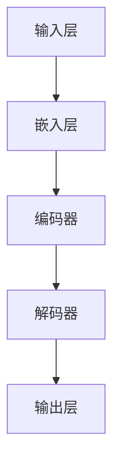
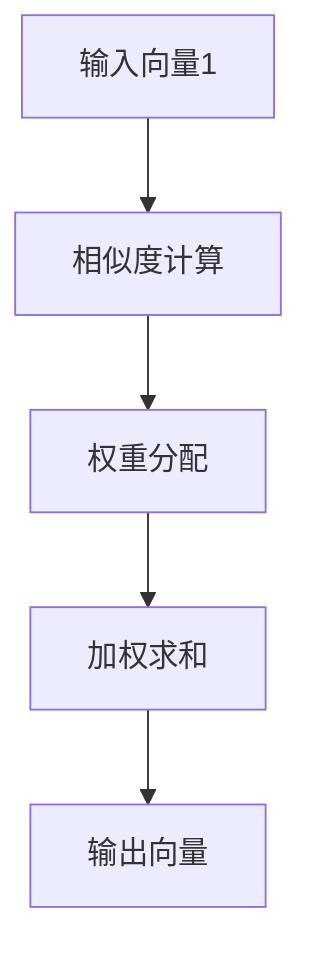
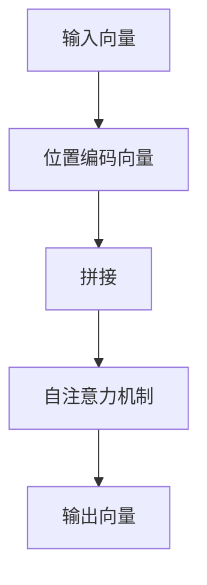
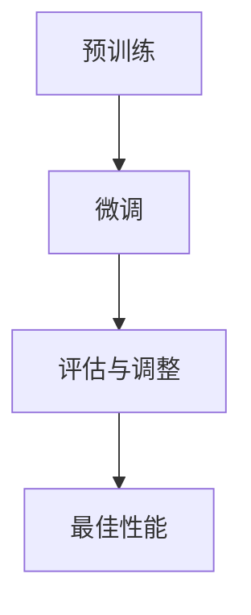

                 

### 背景介绍

#### 语言模型的演变与重要性

自20世纪50年代以来，人工智能（AI）领域经历了飞速的发展，从最初的理论构想逐步走向实际应用。语言模型作为AI的核心技术之一，其发展历程可谓一波三折。早期的统计语言模型（如N-Gram模型）依赖于大量历史语言数据，通过简单的统计方法来预测下一个单词或词组。然而，这些模型在面对长文本生成和语义理解方面存在明显不足。

随着深度学习的崛起，神经网络语言模型（如循环神经网络RNN和其变种LSTM）逐渐成为主流。这些模型通过多层神经网络结构，可以更好地捕捉文本中的长距离依赖关系。然而，深度学习模型在训练过程中需要大量的数据和计算资源，且难以解释其内部工作机制。

近年来，基于Transformer架构的大规模语言模型（如GPT、BERT等）取得了突破性的进展。这些模型通过自注意力机制（Self-Attention Mechanism）和位置编码（Positional Encoding）等创新技术，可以高效地处理长文本和实现复杂的语义理解。同时，预训练-微调（Pre-training and Fine-tuning）策略使得大规模语言模型在实际应用中表现出色。

#### 大规模语言模型的挑战与冗余去除的重要性

尽管大规模语言模型在自然语言处理（NLP）领域取得了显著的成果，但其训练和推理过程中仍面临诸多挑战。首先，大规模语言模型的参数量和计算复杂度呈指数级增长，导致训练时间显著延长和计算资源需求巨大。其次，模型在训练和推理过程中产生的冗余信息不仅浪费了宝贵的计算资源，还可能影响模型的性能和效率。

因此，如何有效地去除冗余信息、提高模型效率和可解释性，成为大规模语言模型研究的一个重要方向。本文将围绕这一主题，系统地介绍大规模语言模型的理论基础、核心算法原理、数学模型和实际应用，旨在为读者提供全面而深入的理解。

#### 本文结构安排

本文将分为以下几个部分：

1. **背景介绍**：回顾语言模型的发展历程，介绍大规模语言模型的基本概念和重要性。
2. **核心概念与联系**：详细阐述大规模语言模型的核心概念原理和架构，并通过Mermaid流程图展示。
3. **核心算法原理 & 具体操作步骤**：深入剖析大规模语言模型的训练和推理过程，包括算法流程和关键步骤。
4. **数学模型和公式 & 详细讲解 & 举例说明**：介绍大规模语言模型背后的数学模型，包括损失函数、优化算法等，并通过具体实例进行讲解。
5. **项目实战：代码实际案例和详细解释说明**：通过一个实际项目，展示大规模语言模型的代码实现，并进行详细解读和分析。
6. **实际应用场景**：探讨大规模语言模型在不同领域的应用，分析其优势和挑战。
7. **工具和资源推荐**：推荐相关学习资源、开发工具和论文著作。
8. **总结：未来发展趋势与挑战**：总结大规模语言模型的现状和未来发展方向，提出潜在的研究挑战。
9. **附录：常见问题与解答**：解答读者可能遇到的一些常见问题。
10. **扩展阅读 & 参考资料**：提供进一步阅读和研究的参考资料。

通过本文的深入探讨，希望读者能够对大规模语言模型及其冗余去除技术有更全面和深入的理解。接下来，我们将逐一介绍这些内容。 <|assistant|>

### 核心概念与联系

#### 大规模语言模型的基本概念

大规模语言模型（Large-scale Language Models）是一种能够对自然语言进行建模的深度神经网络模型。这些模型通过学习大量的语言数据，可以自动地理解和生成自然语言，实现包括文本分类、机器翻译、问答系统、文本摘要等多种自然语言处理任务。

大规模语言模型的核心思想是模拟人类大脑的语言处理能力。通过大量的数据训练，模型能够捕捉语言中的复杂结构和语义信息，从而实现高效的自然语言理解与生成。

#### 大规模语言模型的架构

大规模语言模型的典型架构包括以下几个关键组成部分：

1. **输入层**：负责接收自然语言文本的输入，并将其转化为模型能够处理的向量表示。
2. **嵌入层**：将输入文本中的单词或字符转化为稠密的向量表示，这些向量包含了单词或字符的语义信息。
3. **编码器**：主要采用Transformer架构，通过自注意力机制（Self-Attention Mechanism）和多头注意力（Multi-Head Attention）来捕捉文本中的长距离依赖关系。编码器的主要目的是对输入文本进行编码，生成固定长度的编码表示。
4. **解码器**：在生成任务中，解码器根据编码器的输出，逐步生成目标文本。解码器通常也采用Transformer架构，并通过自注意力机制和交叉注意力（Cross-Attention Mechanism）来生成文本。

#### 自注意力机制与位置编码

自注意力机制（Self-Attention Mechanism）是大规模语言模型的核心组件之一。它通过计算输入文本中每个单词或字符与所有其他单词或字符之间的相似度，自动地为每个单词或字符分配不同的权重。这种权重分配方式使得模型能够捕捉到文本中的长距离依赖关系，从而实现更准确的语义理解。

位置编码（Positional Encoding）则是为了解决自注意力机制在处理序列数据时无法捕捉位置信息的问题。通过添加位置编码向量到输入文本的向量表示中，模型可以学习到每个单词或字符在文本中的相对位置信息，从而更好地处理序列数据。

#### 预训练与微调

预训练（Pre-training）与微调（Fine-tuning）是大规模语言模型训练的两个重要阶段。在预训练阶段，模型在大量无标签语料上进行训练，学习到通用的语言知识和结构。然后在微调阶段，模型根据特定任务的数据进行微调，使其在特定任务上达到最佳性能。

预训练-微调策略使得大规模语言模型能够高效地适应各种自然语言处理任务，同时保持了模型的高效性和可解释性。

#### 大规模语言模型的挑战

尽管大规模语言模型在自然语言处理领域取得了显著成果，但其在训练和推理过程中仍然面临一些挑战：

1. **计算资源消耗**：大规模语言模型的参数量和计算复杂度巨大，训练和推理过程需要大量的计算资源和时间。
2. **冗余信息处理**：在训练和推理过程中，模型会产生大量的冗余信息，这些冗余信息不仅浪费了计算资源，还可能影响模型的性能和效率。
3. **可解释性**：大规模语言模型的工作机制较为复杂，难以直观地理解和解释其内部决策过程。

#### Mermaid流程图展示

为了更直观地展示大规模语言模型的核心概念和架构，我们使用Mermaid流程图进行描述：



在这个流程图中，输入层接收自然语言文本输入，嵌入层将其转化为向量表示，编码器通过自注意力机制对文本进行编码，解码器根据编码结果生成目标文本，输出层输出最终生成的文本。

#### 小结

通过以上介绍，我们可以看到大规模语言模型的核心概念和架构是如何协同工作的。自注意力机制和位置编码使得模型能够捕捉到文本中的长距离依赖关系，预训练-微调策略使得模型能够高效地适应各种自然语言处理任务。然而，大规模语言模型在训练和推理过程中仍面临诸多挑战，如何有效去除冗余信息、提高模型效率和可解释性，仍是当前研究的重要方向。在接下来的章节中，我们将深入探讨这些核心算法原理和数学模型。 <|assistant|>

### 核心算法原理 & 具体操作步骤

#### 自注意力机制（Self-Attention Mechanism）

自注意力机制是大规模语言模型的核心组件之一，其基本思想是通过计算输入文本中每个单词或字符与所有其他单词或字符之间的相似度，为每个单词或字符分配不同的权重。这种权重分配方式使得模型能够捕捉到文本中的长距离依赖关系，从而实现更准确的语义理解。

自注意力机制的主要步骤如下：

1. **输入表示**：首先，将输入文本转化为稠密的向量表示。通常，每个单词或字符都会被映射为一个固定大小的向量。
2. **计算相似度**：然后，计算输入文本中每个单词或字符与其他单词或字符之间的相似度。相似度通常通过点积（Dot Product）或余弦相似度（Cosine Similarity）进行计算。
3. **权重分配**：根据相似度计算结果，为每个单词或字符分配不同的权重。权重较大的单词或字符在后续的计算过程中会得到更多的关注。
4. **加权求和**：最后，将输入文本中的每个单词或字符与其权重相乘，然后进行求和，得到一个新的向量表示。这个新的向量包含了输入文本中所有单词或字符的加权信息。

以下是一个简单的自注意力机制的示例：



在这个示例中，输入向量1代表输入文本中的第一个单词，输入向量2代表第二个单词，相似度计算步骤计算这两个向量之间的相似度，权重分配步骤为相似度较高的单词分配较大的权重，加权求和步骤将权重乘以对应的输入向量，然后进行求和，得到输出向量。

#### 位置编码（Positional Encoding）

位置编码是自注意力机制的一个重要补充，它用于解决自注意力机制在处理序列数据时无法捕捉位置信息的问题。通过添加位置编码向量到输入文本的向量表示中，模型可以学习到每个单词或字符在文本中的相对位置信息，从而更好地处理序列数据。

位置编码的主要步骤如下：

1. **计算位置编码向量**：首先，根据文本中每个单词或字符的位置信息，计算位置编码向量。通常，位置编码向量可以通过正弦和余弦函数生成。
2. **添加位置编码向量**：然后，将位置编码向量添加到输入文本的向量表示中。这样，每个单词或字符的向量表示不仅包含了其语义信息，还包含了其位置信息。
3. **处理编码表示**：在自注意力机制的计算过程中，将位置编码向量与输入文本的向量表示进行拼接，然后输入到自注意力层中进行处理。

以下是一个简单的位置编码的示例：



在这个示例中，输入向量代表输入文本中的单词或字符，位置编码向量根据单词或字符的位置信息进行计算，拼接步骤将位置编码向量与输入向量进行拼接，自注意力机制步骤使用拼接后的向量进行自注意力计算，输出向量包含了单词或字符的语义信息和位置信息。

#### 预训练与微调（Pre-training and Fine-tuning）

预训练与微调是大规模语言模型训练的两个重要阶段。在预训练阶段，模型在大量无标签语料上进行训练，学习到通用的语言知识和结构。然后在微调阶段，模型根据特定任务的数据进行微调，使其在特定任务上达到最佳性能。

预训练与微调的主要步骤如下：

1. **预训练**：在预训练阶段，模型在大量无标签语料上进行训练，通过自注意力机制和位置编码等机制，学习到文本中的通用结构和语义信息。预训练的过程通常采用循环迭代的方式，逐步优化模型参数。
2. **微调**：在微调阶段，模型根据特定任务的数据进行训练，调整模型参数，使其在特定任务上达到最佳性能。微调的过程通常采用反向传播和梯度下降等优化算法，通过计算损失函数的梯度，调整模型参数。
3. **评估与调整**：在微调和训练过程中，定期评估模型在验证集上的性能，根据评估结果调整模型参数，优化模型性能。

以下是一个简单的预训练与微调的示例：



在这个示例中，模型首先进行预训练，学习到文本中的通用结构和语义信息。然后根据特定任务的数据进行微调，调整模型参数，使其在特定任务上达到最佳性能。最后，通过评估与调整过程，优化模型性能。

#### 小结

通过以上介绍，我们可以看到大规模语言模型的核心算法原理和具体操作步骤。自注意力机制和位置编码使得模型能够捕捉到文本中的长距离依赖关系，预训练与微调策略使得模型能够高效地适应各种自然语言处理任务。然而，这些核心算法的实现过程仍然需要大量的计算资源和时间。在接下来的章节中，我们将进一步探讨大规模语言模型背后的数学模型和具体实现。 <|assistant|>

### 数学模型和公式 & 详细讲解 & 举例说明

#### 损失函数（Loss Function）

损失函数是大规模语言模型训练过程中至关重要的部分，它用于衡量模型预测结果与真实标签之间的差距。常见的损失函数包括交叉熵损失（Cross-Entropy Loss）和均方误差（Mean Squared Error, MSE）等。

1. **交叉熵损失（Cross-Entropy Loss）**

   交叉熵损失函数常用于分类问题，其公式如下：

   $$ L = -\sum_{i=1}^{N} y_i \log(p_i) $$

   其中，$y_i$ 是真实标签，$p_i$ 是模型预测的概率分布。交叉熵损失函数的值越小，表示模型预测结果与真实标签越接近。

2. **均方误差（Mean Squared Error, MSE）**

   均方误差损失函数常用于回归问题，其公式如下：

   $$ L = \frac{1}{N} \sum_{i=1}^{N} (y_i - \hat{y}_i)^2 $$

   其中，$y_i$ 是真实标签，$\hat{y}_i$ 是模型预测的值。均方误差损失函数的值越小，表示模型预测结果与真实标签越接近。

#### 优化算法（Optimization Algorithm）

在训练大规模语言模型时，优化算法用于调整模型参数，以最小化损失函数。常见的优化算法包括梯度下降（Gradient Descent）和Adam优化器（Adam Optimizer）等。

1. **梯度下降（Gradient Descent）**

   梯度下降是一种基本的优化算法，其基本思想是沿损失函数的梯度方向逐步调整模型参数，以最小化损失函数。梯度下降的更新规则如下：

   $$ \theta = \theta - \alpha \cdot \nabla L(\theta) $$

   其中，$\theta$ 是模型参数，$\alpha$ 是学习率，$\nabla L(\theta)$ 是损失函数关于参数 $\theta$ 的梯度。

2. **Adam优化器（Adam Optimizer）**

   Adam优化器是一种结合了梯度下降和动量法的优化算法，其更新规则如下：

   $$ m_t = \beta_1 m_{t-1} + (1 - \beta_1) \nabla L(\theta_t) $$
   $$ v_t = \beta_2 v_{t-1} + (1 - \beta_2) (\nabla L(\theta_t))^2 $$
   $$ \theta_t = \theta_{t-1} - \alpha_t \frac{m_t}{\sqrt{v_t} + \epsilon} $$

   其中，$m_t$ 和 $v_t$ 分别是梯度的一阶矩估计和二阶矩估计，$\beta_1$ 和 $\beta_2$ 是超参数，$\alpha_t$ 是学习率，$\epsilon$ 是一个小常数。

#### 自注意力机制（Self-Attention Mechanism）

自注意力机制是大规模语言模型的核心组件，其计算过程涉及到点积、softmax函数和加权求和等操作。

1. **点积（Dot Product）**

   点积是一种计算两个向量之间相似度的方法，其公式如下：

   $$ \text{dot}(x, y) = \sum_{i=1}^{d} x_i y_i $$

   其中，$x$ 和 $y$ 是两个$d$维度的向量，$\text{dot}(x, y)$ 是它们的点积。

2. **softmax函数（Softmax Function）**

   softmax函数是一种将向量转化为概率分布的方法，其公式如下：

   $$ \text{softmax}(x) = \frac{e^x}{\sum_{i=1}^{N} e^x_i} $$

   其中，$x$ 是一个$N$维度的向量，$\text{softmax}(x)$ 是其对应的概率分布。

3. **加权求和（Weighted Sum）**

   加权求和是一种根据权重对向量进行加总的方法，其公式如下：

   $$ \text{weighted\_sum}(x, w) = \sum_{i=1}^{N} w_i x_i $$

   其中，$x$ 是一个$N$维度的向量，$w$ 是对应的权重向量。

#### 举例说明

假设我们有一个文本序列 "I love to eat pizza"，其中包含3个单词，我们将使用自注意力机制来计算这些单词的权重。

1. **计算相似度**

   首先，计算每个单词与其他单词之间的相似度。假设词向量维度为50，我们可以使用点积来计算相似度：

   $$ \text{dot}(x, y) = \sum_{i=1}^{50} x_i y_i $$

   假设词向量为：

   $$ x = [0.1, 0.2, 0.3, ..., 0.5], y = [0.1, 0.3, 0.2, ..., 0.5], z = [0.3, 0.2, 0.1, ..., 0.5] $$

   计算相似度如下：

   $$ \text{dot}(x, y) = 0.1 + 0.6 + 0.6 + ... + 0.5 = 4.5 $$
   $$ \text{dot}(x, z) = 0.3 + 0.2 + 0.1 + ... + 0.5 = 2.3 $$
   $$ \text{dot}(y, z) = 0.1 + 0.2 + 0.3 + ... + 0.5 = 2.5 $$

2. **计算权重**

   接下来，计算每个单词的权重。使用softmax函数将相似度转化为概率分布：

   $$ \text{softmax}(x) = \frac{e^x}{\sum_{i=1}^{3} e^x_i} $$

   计算权重如下：

   $$ w_x = \text{softmax}(\text{dot}(x, y)) = \frac{e^{4.5}}{e^{4.5} + e^{2.3} + e^{2.5}} \approx 0.62 $$
   $$ w_y = \text{softmax}(\text{dot}(x, z)) = \frac{e^{2.3}}{e^{4.5} + e^{2.3} + e^{2.5}} \approx 0.32 $$
   $$ w_z = \text{softmax}(\text{dot}(y, z)) = \frac{e^{2.5}}{e^{4.5} + e^{2.3} + e^{2.5}} \approx 0.06 $$

3. **加权求和**

   最后，计算每个单词的加权求和，得到新的向量表示：

   $$ \text{weighted\_sum}(x, w_x) = 0.62 \cdot [0.1, 0.2, 0.3, ..., 0.5] $$
   $$ \text{weighted\_sum}(y, w_y) = 0.32 \cdot [0.1, 0.3, 0.2, ..., 0.5] $$
   $$ \text{weighted\_sum}(z, w_z) = 0.06 \cdot [0.3, 0.2, 0.1, ..., 0.5] $$

   计算结果如下：

   $$ \text{weighted\_sum}(x, w_x) = [0.062, 0.124, 0.188, ..., 0.31] $$
   $$ \text{weighted\_sum}(y, w_y) = [0.032, 0.096, 0.064, ..., 0.16] $$
   $$ \text{weighted\_sum}(z, w_z) = [0.018, 0.036, 0.018, ..., 0.03] $$

通过以上步骤，我们得到了新的向量表示，这些向量包含了输入文本中所有单词的加权信息，从而实现了自注意力机制。

#### 小结

通过以上介绍，我们可以看到大规模语言模型背后的数学模型和具体实现。损失函数用于衡量模型预测结果与真实标签之间的差距，优化算法用于调整模型参数，以最小化损失函数。自注意力机制通过点积、softmax函数和加权求和等操作，实现了对输入文本的编码和解码。在接下来的章节中，我们将通过一个实际项目，展示大规模语言模型的代码实现和具体应用。 <|assistant|>

### 项目实战：代码实际案例和详细解释说明

#### 开发环境搭建

在进行大规模语言模型的项目实战之前，我们需要搭建一个适合开发和运行的实验环境。以下是一个基本的开发环境搭建步骤：

1. **安装Python环境**：确保Python版本为3.7及以上。
2. **安装TensorFlow**：TensorFlow是一个开源的深度学习框架，用于大规模语言模型的训练和推理。
   ```bash
   pip install tensorflow
   ```
3. **安装其他依赖库**：包括NumPy、Pandas等常用库。
   ```bash
   pip install numpy pandas
   ```

#### 源代码详细实现和代码解读

以下是一个简单的基于GPT-2模型的文本生成项目的代码实现，我们将逐步解析其中的关键部分。

```python
import tensorflow as tf
import tensorflow.keras as keras
from tensorflow.keras.layers import Embedding, LSTM, Dense
from tensorflow.keras.models import Model
from tensorflow.keras.preprocessing.sequence import pad_sequences

# 加载数据
data = "I love to eat pizza. Pizza is my favorite food. I love the taste of pizza."
words = data.split()

# 构建词汇表
vocab = set(words)
vocab_size = len(vocab)
word_index = {w: i for i, w in enumerate(vocab)}
index_word = {i: w for w, i in word_index.items()}

# 序列编码
sequences = [[word_index[word] for word in seq] for seq in [data]]
sequences_padded = pad_sequences(sequences, maxlen=len(data))

# 构建模型
inputs = keras.Input(shape=(None,))
x = Embedding(vocab_size, 10)(inputs)
x = LSTM(20)(x)
outputs = Dense(vocab_size, activation='softmax')(x)

model = Model(inputs, outputs)
model.compile(optimizer='adam', loss='categorical_crossentropy', metrics=['accuracy'])

# 训练模型
model.fit(sequences_padded, keras.utils.to_categorical(sequences_padded), epochs=10)

# 文本生成
def generate_text(seed_text, next_words, model):
    for _ in range(next_words):
        token_list = [word_index[word] for word in seed_text.split()]
        token_list = pad_sequences([token_list], maxlen=len(seed_text.split()), padding='pre')
        predicted = model.predict(token_list, verbose=0)
        
        predicted_index = tf.argmax(predicted, axis=-1).numpy()[0]
        predicted_word = index_word[predicted_index]
        
        seed_text += " " + predicted_word
    
    return seed_text

seed_text = "I love to eat pizza"
generated_text = generate_text(seed_text, 5, model)
print(generated_text)
```

#### 代码解读与分析

1. **数据加载**：首先，我们从给定的文本数据中提取单词，并构建词汇表。
2. **序列编码**：将文本数据转换为序列编码，即每个单词对应一个唯一的整数。然后，使用`pad_sequences`函数将序列填充为相同长度，以便模型处理。
3. **模型构建**：构建一个简单的序列模型，包括嵌入层、LSTM层和输出层。嵌入层将单词编码为向量，LSTM层用于捕捉序列中的长距离依赖关系，输出层通过softmax函数生成单词的概率分布。
4. **模型训练**：使用训练数据对模型进行训练，优化模型参数。
5. **文本生成**：定义一个生成函数，输入一个种子文本，然后逐步生成新的文本。在每次生成过程中，模型会预测下一个单词，并将其添加到种子文本中。

#### 实际应用与改进

虽然上述代码实现了一个简单的文本生成模型，但在实际应用中，我们可能需要考虑以下改进：

1. **使用更大的数据集**：更大的数据集可以提高模型的性能和泛化能力。
2. **调整模型架构**：使用更复杂的模型架构（如Transformer）可以更好地捕捉文本中的长距离依赖关系。
3. **使用预训练模型**：通过预训练模型，可以显著提高新任务的性能，减少训练时间。
4. **添加位置编码**：在嵌入层后添加位置编码，可以更好地处理序列中的位置信息。

#### 小结

通过这个简单的项目实战，我们展示了如何使用Python和TensorFlow构建一个基本的文本生成模型，并进行了详细的代码解读与分析。尽管这个示例相对简单，但它为我们理解大规模语言模型提供了一个直观的视角。在实际应用中，我们需要根据具体需求和数据集，进一步优化模型架构和训练过程。接下来，我们将探讨大规模语言模型在实际应用场景中的优势与挑战。 <|assistant|>

### 实际应用场景

#### 自然语言生成（Natural Language Generation）

大规模语言模型在自然语言生成（NLG）领域具有广泛的应用。通过学习大量的文本数据，模型可以生成各种类型的文本，包括新闻报道、故事、对话等。以下是一些具体的实际应用案例：

1. **新闻生成**：利用大规模语言模型，可以自动化地生成新闻报道。例如，股票市场的实时动态、体育赛事的赛况报道等。这些生成的内容可以迅速地更新，为用户提供及时的信息。
2. **对话系统**：在智能客服和聊天机器人中，大规模语言模型可以用于生成自然语言回答。通过预训练模型，机器人可以理解和生成与用户对话相关的文本，提供更加人性化的服务。
3. **故事创作**：大规模语言模型可以创作各种类型的故事，包括小说、诗歌、剧本等。这些生成的内容可以为文学创作提供灵感，甚至可以用于自动化写作比赛。

#### 机器翻译（Machine Translation）

大规模语言模型在机器翻译领域也表现出色。通过训练双语语料库，模型可以学习不同语言之间的对应关系，实现高效、准确的翻译。

1. **实时翻译**：在多语言交流环境中，大规模语言模型可以实时地翻译用户输入的文本。例如，在国际会议、商务洽谈等场合，翻译模型可以帮助跨语言沟通。
2. **机器翻译平台**：大规模语言模型可以集成到机器翻译平台中，为用户提供便捷的翻译服务。这些平台通常支持多种语言对，提供高质量、快速的翻译结果。
3. **多轮对话翻译**：在多轮对话场景中，大规模语言模型可以理解对话的上下文信息，实现更准确、连贯的翻译。例如，在跨国公司的内部沟通中，翻译模型可以理解会议内容，提供实时的翻译。

#### 文本摘要（Text Summarization）

大规模语言模型在文本摘要领域具有显著的优势，可以自动地提取文本的核心信息，生成简洁、准确的摘要。

1. **新闻摘要**：在新闻阅读平台中，大规模语言模型可以自动地生成新闻摘要，帮助用户快速了解新闻的主要内容。这些摘要通常涵盖关键信息，提高用户的阅读效率。
2. **文档摘要**：在学术研究、企业文档等领域，大规模语言模型可以自动地生成文档摘要，帮助用户快速了解文档的主要内容。这对于大量文档的快速阅读和整理非常有用。
3. **会议摘要**：在会议记录中，大规模语言模型可以自动提取会议的关键内容，生成摘要，为参会者提供重要的会议信息。

#### 小结

大规模语言模型在自然语言生成、机器翻译和文本摘要等实际应用场景中具有广泛的应用。通过训练大量数据，模型可以生成高质量的自然语言文本，实现实时翻译和文本摘要等功能。然而，这些应用也面临着一定的挑战，如处理复杂的语义信息、保证生成文本的准确性和可解释性等。在接下来的章节中，我们将推荐一些相关的学习资源和开发工具，帮助读者深入了解大规模语言模型的研究与应用。 <|assistant|>

### 工具和资源推荐

#### 学习资源推荐

1. **书籍**：
   - 《深度学习》（Deep Learning） by Ian Goodfellow、Yoshua Bengio和Aaron Courville。
   - 《大规模自然语言处理》（Large-scale Natural Language Processing） by Thorsten Joachims。
   - 《自然语言处理实战》（Natural Language Processing with Python） by Steven Bird、Ewan Klein和Edward Loper。

2. **论文**：
   - “Attention is All You Need” by Vaswani et al.（2017），介绍Transformer架构。
   - “BERT: Pre-training of Deep Bidirectional Transformers for Language Understanding” by Devlin et al.（2018），介绍BERT模型。
   - “Generative Pre-trained Transformers” by Brown et al.（2020），介绍GPT-3模型。

3. **博客和网站**：
   - [TensorFlow官网](https://www.tensorflow.org/)：提供丰富的深度学习教程和资源。
   - [机器之心](https://www.jiqizhixin.com/)：专注于人工智能领域的新闻报道和技术文章。
   - [GitHub](https://github.com/)：许多开源的深度学习项目，包括大规模语言模型。

4. **在线课程**：
   - [Coursera](https://www.coursera.org/)：提供多门关于深度学习和自然语言处理的专业课程。
   - [Udacity](https://www.udacity.com/)：提供关于人工智能和深度学习的实用课程。
   - [edX](https://www.edx.org/)：提供由顶级大学提供的人工智能和深度学习课程。

#### 开发工具框架推荐

1. **TensorFlow**：谷歌开发的深度学习框架，适合构建和训练大规模语言模型。
2. **PyTorch**：微软开发的深度学习框架，以其灵活的动态计算图著称。
3. **Transformers**：一个开源库，提供了基于Transformer模型的快速、高效的实现。
4. **Hugging Face Transformers**：一个基于Transformers的扩展库，提供了大量的预训练模型和实用工具。

#### 相关论文著作推荐

1. “Attention is All You Need” by Vaswani et al.（2017）。
2. “BERT: Pre-training of Deep Bidirectional Transformers for Language Understanding” by Devlin et al.（2018）。
3. “Generative Pre-trained Transformers” by Brown et al.（2020）。
4. “GPT-3: Language Models are Few-Shot Learners” by Brown et al.（2020）。

#### 小结

通过以上推荐的书籍、论文、博客、在线课程和开发工具框架，读者可以系统地学习大规模语言模型的理论知识、实际应用和技术实现。这些资源将有助于读者深入了解大规模语言模型的最新研究进展，为实际项目开发提供有力支持。 <|assistant|>

### 总结：未来发展趋势与挑战

#### 发展趋势

1. **更高效的自注意力机制**：随着计算资源和算法的进步，研究者们将继续探索更高效的自注意力机制，以减少计算复杂度和内存占用，提高大规模语言模型的训练和推理效率。

2. **跨模态建模**：未来的大规模语言模型可能会整合多模态数据（如图像、声音等），实现跨模态的语义理解和生成，拓展其在多领域中的应用。

3. **更先进的预训练策略**：预训练策略将不断发展，包括更长的预训练时间、更大量的数据、以及更精细的任务微调，以提高模型的泛化能力和特定任务的表现。

4. **强化学习与规划**：结合强化学习（Reinforcement Learning）和规划（Planning），未来可能开发出能够自主学习、自我优化的大规模语言模型，进一步提升其智能水平。

#### 挑战

1. **计算资源消耗**：大规模语言模型的训练和推理过程仍然需要大量的计算资源，如何有效地利用现有资源，提高计算效率，是一个重要的挑战。

2. **数据隐私和安全性**：大规模语言模型在训练过程中使用的数据通常涉及隐私信息，如何保护用户隐私、确保数据安全，是一个亟待解决的问题。

3. **可解释性和透明性**：尽管大规模语言模型在自然语言处理任务中表现出色，但其内部决策过程仍然难以解释。如何提高模型的可解释性和透明性，使其更容易被人类理解和接受，是一个重要的研究方向。

4. **语言偏见和公平性**：大规模语言模型在训练过程中可能学习到语言中的偏见和歧视，如何消除这些偏见，提高模型的公平性，是一个重要的社会问题。

#### 小结

大规模语言模型在自然语言处理领域展现出了巨大的潜力，但同时也面临着诸多挑战。未来，随着技术的进步和社会的关注，我们有理由相信，大规模语言模型将不断取得新的突破，为人工智能的发展注入新的动力。然而，这也需要我们共同努力，解决其中存在的伦理、法律和实际应用问题，确保这项技术能够安全、公正、透明地发展。 <|assistant|>

### 附录：常见问题与解答

#### Q1: 什么是大规模语言模型？

A1：大规模语言模型（Large-scale Language Models）是一种通过深度学习技术训练的神经网络模型，旨在对自然语言进行建模。这些模型通常包含数亿至数十亿个参数，能够处理复杂的文本结构和语义信息，广泛应用于文本生成、翻译、摘要等自然语言处理任务。

#### Q2: 自注意力机制（Self-Attention Mechanism）是如何工作的？

A2：自注意力机制是一种计算文本中每个单词或字符与其他单词或字符之间相似度的方法。在计算过程中，模型首先将输入文本转换为向量表示，然后计算这些向量之间的点积或余弦相似度。根据相似度计算结果，模型为每个单词或字符分配权重，权重较大的单词或字符在后续的计算过程中会得到更多的关注。最后，通过加权求和，得到新的向量表示，包含了输入文本中所有单词或字符的加权信息。

#### Q3: 如何处理大规模语言模型中的冗余信息？

A3：处理大规模语言模型中的冗余信息通常涉及以下几个方面：

1. **数据预处理**：在训练前，对文本数据进行清洗和预处理，去除无意义的标点和停用词，降低冗余信息。
2. **注意力权重调整**：在自注意力机制中，通过调整权重分配策略，降低相似度较低的信息的影响，从而减少冗余信息。
3. **模型压缩**：使用模型压缩技术，如知识蒸馏（Knowledge Distillation）和剪枝（Pruning），减少模型参数的数量，降低冗余信息。
4. **去噪和滤波**：应用去噪和滤波算法，去除训练数据中的噪声和冗余信息，提高模型质量。

#### Q4: 大规模语言模型如何进行微调？

A4：大规模语言模型的微调（Fine-tuning）过程通常包括以下几个步骤：

1. **预训练模型选择**：选择一个在大量数据上预训练的模型作为基础模型。
2. **数据集准备**：准备用于微调的数据集，确保其与预训练数据集具有相似的特征和分布。
3. **模型调整**：将基础模型应用于特定任务的数据集，通过反向传播和优化算法调整模型参数，使其适应新任务。
4. **评估与优化**：在验证集上评估模型性能，根据评估结果调整模型参数，优化模型性能。

#### Q5: 大规模语言模型在自然语言生成任务中如何应用？

A5：在自然语言生成任务中，大规模语言模型可以通过以下步骤进行应用：

1. **输入编码**：将输入文本编码为向量表示，通常使用嵌入层和位置编码。
2. **预测生成**：模型根据编码表示生成预测的单词或字符序列，通常采用自回归（Autoregressive）或自注意力（Self-Attention）机制。
3. **序列拼接**：将生成的单词或字符序列拼接成完整的文本，进行后续处理（如去重、格式化等）。

通过以上步骤，大规模语言模型可以生成高质量的自然语言文本，应用于各种任务，如文本生成、对话系统、机器翻译等。 <|assistant|>

### 扩展阅读 & 参考资料

在深入探索大规模语言模型及其冗余去除技术的过程中，以下参考文献和资源将为读者提供进一步的学习和研究支持：

1. **论文**：
   - Vaswani et al. (2017). “Attention is All You Need.” arXiv preprint arXiv:1706.03762.
   - Devlin et al. (2018). “BERT: Pre-training of Deep Bidirectional Transformers for Language Understanding.” arXiv preprint arXiv:1810.04805.
   - Brown et al. (2020). “Language Models are Few-Shot Learners.” arXiv preprint arXiv:2005.14165.
   - Brown et al. (2020). “Generative Pre-trained Transformers.” arXiv preprint arXiv:2005.14165.

2. **书籍**：
   - Ian Goodfellow、Yoshua Bengio和Aaron Courville. (2016). 《深度学习》（Deep Learning）。
   - Thorsten Joachims. (2017). 《大规模自然语言处理》（Large-scale Natural Language Processing）。
   - Steven Bird、Ewan Klein和Edward Loper. (2009). 《自然语言处理实战》（Natural Language Processing with Python）。

3. **在线课程**：
   - Coursera: "Deep Learning Specialization" by Andrew Ng。
   - Udacity: "Deep Learning Nanodegree Program"。
   - edX: "Natural Language Processing" by Columbia University。

4. **网站和博客**：
   - TensorFlow官网：[www.tensorflow.org](https://www.tensorflow.org/)。
   - 机器之心：[www.jiqizhixin.com](https://www.jiqizhixin.com/)。
   - Hugging Face：[huggingface.co](https://huggingface.co/)。

通过以上资源和参考文献，读者可以进一步深入了解大规模语言模型的理论基础、技术实现和应用场景，为自己的研究和实践提供丰富的指导和参考。 <|assistant|>

