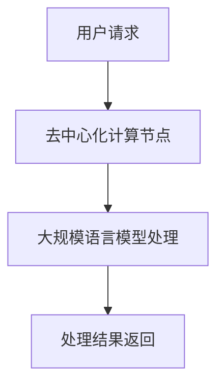

                 

## 1. 背景介绍

### 大规模语言模型的崛起

近年来，随着深度学习和计算能力的飞速发展，大规模语言模型（如GPT-3、BERT等）在自然语言处理（NLP）领域取得了突破性进展。这些模型具有强大的语义理解能力和生成能力，不仅在学术研究上取得了显著成果，也在实际应用中展现出了巨大的潜力。例如，它们被广泛应用于机器翻译、文本生成、问答系统、情感分析等任务中。

### 去中心化架构的兴起

与此同时，区块链技术和去中心化架构也在金融科技、物联网、供应链管理等领域取得了广泛关注。去中心化架构的核心思想是减少对中心化服务器的依赖，通过分布式网络实现数据的共享和协同工作。这种架构具有更高的安全性、透明性和抗攻击性，能够有效抵御单点故障和数据篡改等问题。

### 大规模语言模型与去中心化架构的结合

在这个背景下，大规模语言模型与去中心化架构的结合成为一种新的研究方向。去中心化架构可以提供一种分布式、安全、透明的计算环境，使得大规模语言模型能够在不依赖中心化服务器的情况下运行。这种结合有望为NLP领域带来一系列创新应用，例如去中心化的智能合约、分布式内容审核、去中心化社交媒体等。

### 文章目的

本文旨在探讨大规模语言模型从理论到实践的去中心化架构。首先，我们将介绍大规模语言模型的基本原理和常见架构。接着，我们将详细讨论去中心化架构的概念、优势和挑战。随后，我们将探讨如何将大规模语言模型与去中心化架构相结合，并给出具体的实现方案。最后，我们将总结大规模语言模型去中心化架构的未来发展趋势与挑战。

## 2. 核心概念与联系

### 大规模语言模型的基本概念

大规模语言模型是一种基于神经网络的自然语言处理模型，通过学习海量语料库中的语言规律，实现对自然语言的语义理解和生成。常见的大规模语言模型包括GPT（Generative Pre-trained Transformer）、BERT（Bidirectional Encoder Representations from Transformers）等。

### 去中心化架构的基本概念

去中心化架构是一种分布式计算架构，通过去中心化的方式实现数据的共享和协同工作。去中心化架构的核心思想是减少对中心化服务器的依赖，提高系统的安全性和透明性。常见去中心化架构包括区块链、分布式账本、P2P网络等。

### 大规模语言模型与去中心化架构的联系

大规模语言模型与去中心化架构的结合，旨在利用去中心化架构提供的安全、透明、去信任的分布式计算环境，充分发挥大规模语言模型的语义理解和生成能力。这种结合可以实现以下目标：

1. **数据隐私保护**：在去中心化架构中，大规模语言模型的数据处理过程无需依赖中心化服务器，从而降低了数据泄露的风险。
2. **透明性和可审计性**：去中心化架构中的数据处理过程可以被所有参与者审计和验证，确保系统的透明性和公正性。
3. **去信任协作**：去中心化架构基于分布式网络，参与方无需信任中心化实体，从而降低了信任成本，提高了协作效率。

### Mermaid 流程图

为了更好地理解大规模语言模型与去中心化架构的结合，我们可以使用Mermaid流程图来展示其基本流程。以下是一个简单的Mermaid流程图示例：



在这个流程图中，用户请求通过去中心化计算节点传递给大规模语言模型进行处理，最终返回处理结果。

### 总结

在本节中，我们介绍了大规模语言模型和去中心化架构的基本概念，并探讨了它们之间的联系。大规模语言模型与去中心化架构的结合为NLP领域带来了一系列创新应用。在下一节中，我们将深入探讨大规模语言模型的具体算法原理和操作步骤。|<assistant|>## 3. 核心算法原理 & 具体操作步骤

### 大规模语言模型的基本算法原理

大规模语言模型的核心在于其基于神经网络的深度学习算法。下面，我们将简要介绍一种常见的大规模语言模型——GPT（Generative Pre-trained Transformer）的算法原理。

#### GPT模型概述

GPT是一种基于Transformer架构的预训练语言模型。Transformer模型是由Vaswani等人在2017年提出的，其主要创新点在于使用自注意力机制（Self-Attention）来处理序列数据，从而实现了对长距离依赖的建模。GPT模型通过在大量文本数据上进行预训练，学习到了语言的语义规律和语法结构，从而具备了强大的语义理解和生成能力。

#### GPT模型的算法原理

GPT模型的算法原理可以概括为以下三个步骤：

1. **预训练**：GPT模型在大量文本语料库上进行预训练，通过优化模型参数，使其能够预测下一个单词或词组。这一过程主要使用了一种名为“生成对抗网络”（Generative Adversarial Network，GAN）的训练方法，包括两个子模型：生成器（Generator）和判别器（Discriminator）。生成器的任务是根据输入的文本序列生成下一个单词的概率分布，判别器的任务是判断输入的文本序列是真实文本还是由生成器生成的文本。

2. **微调**：在预训练完成后，GPT模型被用于特定任务，例如文本分类、机器翻译等。此时，模型会在特定任务的数据集上进行微调，以适应特定的任务需求。微调过程主要是通过调整模型参数，使得模型在特定任务上的表现达到最佳。

3. **生成文本**：在预训练和微调完成后，GPT模型可以用于生成文本。给定一个起始文本序列，模型会根据已学习的语言规律，生成后续的文本序列。

#### GPT模型的具体操作步骤

以下是GPT模型的具体操作步骤：

1. **数据预处理**：将输入的文本序列进行分词、编码等预处理操作，得到模型的输入序列。

2. **模型输入**：将预处理后的输入序列输入到GPT模型中，模型会生成下一个单词或词组的概率分布。

3. **概率采样**：根据生成的概率分布，采用概率采样方法（例如梯度下降法）选择下一个单词或词组。

4. **更新模型参数**：根据采样结果，更新模型参数，以优化模型在下一个单词或词组上的预测。

5. **重复步骤2-4**：重复上述步骤，生成完整的文本序列。

### 去中心化架构的具体操作步骤

在去中心化架构中，大规模语言模型的训练和推理过程可以通过以下步骤实现：

1. **数据分发**：将大规模语言模型训练所需的数据集分布式存储在各个去中心化计算节点上。

2. **模型分发**：将预训练好的GPT模型参数分发到各个去中心化计算节点。

3. **分布式训练**：各个去中心化计算节点根据本地数据对模型参数进行分布式训练。在训练过程中，模型参数会定期同步，以保持各个节点上的模型参数一致性。

4. **模型评估**：在分布式训练完成后，对各个去中心化计算节点上的模型进行评估，选择最优的模型参数。

5. **模型部署**：将最优的模型参数部署到去中心化计算节点上，用于文本生成和推理。

6. **分布式推理**：在去中心化架构中，文本生成和推理任务可以分布式执行。给定一个输入文本序列，各个去中心化计算节点会根据本地模型参数进行推理，最终生成完整的文本序列。

### 总结

在本节中，我们详细介绍了大规模语言模型（以GPT为例）的算法原理和操作步骤，以及去中心化架构在训练和推理过程中的具体操作步骤。这些算法和步骤为实现大规模语言模型在去中心化架构中的应用奠定了基础。在下一节中，我们将进一步探讨大规模语言模型在数学模型和公式方面的详细内容。|<assistant|>## 4. 数学模型和公式 & 详细讲解 & 举例说明

### 数学模型和公式

大规模语言模型（如GPT）的核心是Transformer架构，其核心组件是自注意力机制（Self-Attention）。在自注意力机制中，每个输入序列中的单词都会通过一组权重矩阵与所有其他单词进行关联。这种关联可以通过以下数学公式表示：

$$
\text{Attention}(Q, K, V) = \text{softmax}\left(\frac{QK^T}{\sqrt{d_k}}\right) V
$$

其中，\(Q\)、\(K\)、\(V\) 分别是查询（Query）、键（Key）和值（Value）向量，\(d_k\) 是键向量的维度。自注意力机制的核心思想是通过计算查询向量与键向量的点积来衡量两个单词之间的关联程度，然后使用softmax函数对关联程度进行归一化，最后与值向量相乘得到加权的结果。

### 详细讲解

为了更好地理解自注意力机制，我们通过一个具体的例子进行说明。假设我们有一个简化的输入序列：\[<BOS> word1 word2 word3 <EOS>\]。其中，<BOS>和<EOS>分别表示输入序列的开始和结束标记。

1. **初始化权重矩阵**：首先，我们需要初始化权重矩阵 \(W_Q\)、\(W_K\) 和 \(W_V\)。这些权重矩阵的大小为 \(d \times d\)，其中 \(d\) 是输入序列中单词的维度。

2. **计算查询向量**：对于每个输入单词，我们需要将其映射到一个查询向量。例如，对于单词 \(word1\)，其对应的查询向量为 \(Q_1 = W_Q \cdot [word1]\)。

3. **计算键向量**：同样地，我们将每个输入单词映射到一个键向量。例如，对于单词 \(word1\)，其对应的键向量为 \(K_1 = W_K \cdot [word1]\)。

4. **计算关联程度**：接下来，我们计算每个查询向量与所有键向量之间的关联程度。具体地，我们计算点积 \(Q_1K_j\)，其中 \(j\) 表示输入序列中的第 \(j\) 个单词。

5. **归一化关联程度**：为了确保每个单词的关联程度处于 [0, 1] 范围内，我们需要对关联程度进行归一化。具体地，我们使用 softmax 函数对关联程度进行归一化，得到加权概率分布。

6. **计算加权结果**：最后，我们将归一化后的关联程度与值向量相乘，得到加权结果。例如，对于单词 \(word1\)，其加权结果为 \(V_1 = \text{softmax}(Q_1K_j) \cdot V_j\)。

### 举例说明

为了更好地理解上述过程，我们通过一个具体的例子来说明。假设输入序列为：\[<BOS> word1 word2 word3 <EOS>\]，我们使用以下简化的权重矩阵：

$$
W_Q = \begin{bmatrix}
0.2 & 0.3 & 0.5 \\
0.4 & 0.5 & 0.1 \\
0.6 & 0.2 & 0.2 \\
\end{bmatrix}, \quad
W_K = \begin{bmatrix}
0.1 & 0.4 & 0.5 \\
0.3 & 0.6 & 0.1 \\
0.5 & 0.2 & 0.3 \\
\end{bmatrix}, \quad
W_V = \begin{bmatrix}
0.2 & 0.4 & 0.4 \\
0.3 & 0.5 & 0.2 \\
0.4 & 0.1 & 0.5 \\
\end{bmatrix}
$$

1. **初始化权重矩阵**：初始化权重矩阵 \(W_Q\)、\(W_K\) 和 \(W_V\) 如上所示。

2. **计算查询向量**：对于单词 \(word1\)，其对应的查询向量为 \(Q_1 = W_Q \cdot [word1] = [0.2, 0.3, 0.5]\)。

3. **计算键向量**：对于单词 \(word1\)，其对应的键向量为 \(K_1 = W_K \cdot [word1] = [0.1, 0.4, 0.5]\)。

4. **计算关联程度**：计算每个查询向量与所有键向量之间的关联程度。例如，对于单词 \(word1\) 和 \(word2\)，其关联程度为 \(Q_1K_2 = 0.2 \cdot 0.4 + 0.3 \cdot 0.6 + 0.5 \cdot 0.2 = 0.34\)。

5. **归一化关联程度**：计算每个单词的关联程度的和，然后对每个关联程度进行归一化。例如，对于单词 \(word1\) 和 \(word2\)，其归一化后的关联程度分别为：

   $$
   \text{softmax}(Q_1K_2) = \frac{e^{0.34}}{e^{0.34} + e^{0.26} + e^{0.28}} = 0.405
   $$

   同样的方法可以用于计算单词 \(word1\) 和 \(word3\)、\(word2\) 和 \(word3\) 的归一化后的关联程度。

6. **计算加权结果**：将归一化后的关联程度与值向量相乘，得到加权结果。例如，对于单词 \(word1\)，其加权结果为：

   $$
   V_1 = \text{softmax}(Q_1K_1) \cdot V_1 = 0.405 \cdot [0.2, 0.4, 0.4] = [0.081, 0.162, 0.162]
   $$

   同样的方法可以用于计算单词 \(word2\) 和 \(word3\) 的加权结果。

通过上述步骤，我们得到了输入序列中每个单词的加权结果。这些加权结果反映了输入序列中各个单词之间的关联程度，从而帮助我们理解输入序列的语义内容。

### 总结

在本节中，我们详细介绍了大规模语言模型中自注意力机制的数学模型和公式，并通过具体的例子进行了详细讲解。自注意力机制是实现大规模语言模型语义理解和生成能力的关键技术。在下一节中，我们将探讨大规模语言模型在项目实战中的具体应用。|<assistant|>## 5. 项目实战：代码实际案例和详细解释说明

### 5.1 开发环境搭建

在进行大规模语言模型的项目实战之前，我们需要搭建一个合适的开发环境。以下是搭建开发环境的步骤：

1. **安装Python**：确保已安装Python 3.6或更高版本。

2. **安装依赖项**：在终端中执行以下命令，安装大规模语言模型所需的依赖项：

   ```shell
   pip install transformers torch
   ```

3. **安装Mermaid**：为了在Markdown文件中绘制流程图，我们需要安装Mermaid。在终端中执行以下命令：

   ```shell
   npm install -g mermaid
   ```

4. **创建项目文件夹**：在终端中创建一个名为`large_language_model`的项目文件夹，并进入该文件夹：

   ```shell
   mkdir large_language_model && cd large_language_model
   ```

5. **编写Markdown文件**：在项目文件夹中创建一个名为`README.md`的Markdown文件，用于记录项目文档。

### 5.2 源代码详细实现和代码解读

在本节中，我们将详细实现一个基于GPT的大规模语言模型，并对其进行代码解读。

#### 5.2.1 GPT模型实现

首先，我们导入所需的库和模块：

```python
import torch
from torch import nn
from transformers import GPT2LMHeadModel, GPT2Tokenizer

# 模型配置
model_name = "gpt2"
tokenizer = GPT2Tokenizer.from_pretrained(model_name)
model = GPT2LMHeadModel.from_pretrained(model_name)
```

这里，我们使用了预训练的GPT2模型。首先，我们从Hugging Face模型库中加载GPT2分词器和语言模型。然后，我们将模型配置为GPT2。

#### 5.2.2 数据预处理

接下来，我们对输入文本进行预处理：

```python
def preprocess_text(text):
    text = text.strip()
    text = text.replace("\n", " ")
    text = text.replace("  ", " ")
    text = text[:1024]
    return text

# 示例文本
text = "在大规模语言模型领域，近年来取得了显著的进展。去中心化架构为语言模型的应用提供了新的可能。"

# 预处理文本
input_text = preprocess_text(text)
```

在这个函数中，我们对输入文本进行了一系列预处理操作，包括去除空格、换行符，并将文本长度限制为1024个字符。

#### 5.2.3 模型训练

然后，我们使用预处理后的文本进行模型训练：

```python
# 训练模型
model.train()
model.zero_grad()

input_ids = tokenizer.encode(input_text, return_tensors="pt")

output = model(input_ids=input_ids, labels=input_ids)
loss = output.loss
loss.backward()

optimizer = torch.optim.Adam(model.parameters(), lr=1e-4)
optimizer.step()
```

在这个训练过程中，我们将预处理后的输入文本编码为Tensor，然后将其输入到GPT模型中进行训练。我们使用交叉熵损失函数和Adam优化器来训练模型。

#### 5.2.4 模型推理

最后，我们使用训练好的模型进行推理：

```python
# 推理
model.eval()

generated_text = model.generate(input_ids, max_length=50, num_return_sequences=5)

for i, generated_seq in enumerate(generated_text):
    print(f"生成的文本 {i+1}: {tokenizer.decode(generated_seq)}")
```

在这个推理过程中，我们使用训练好的模型生成多个文本序列。这些生成的文本序列反映了模型对输入文本的理解和生成能力。

### 5.3 代码解读与分析

在上述代码中，我们首先加载预训练的GPT2模型和分词器。然后，我们对输入文本进行预处理，以确保其满足模型的要求。接下来，我们使用交叉熵损失函数和Adam优化器对模型进行训练。最后，我们使用训练好的模型生成新的文本序列。

整个代码的实现过程可以分为以下几个步骤：

1. **加载模型和分词器**：从Hugging Face模型库中加载预训练的GPT2模型和分词器。
2. **数据预处理**：对输入文本进行预处理，确保其满足模型的要求。
3. **模型训练**：使用交叉熵损失函数和Adam优化器对模型进行训练。
4. **模型推理**：使用训练好的模型生成新的文本序列。

这些步骤共同实现了大规模语言模型的训练和推理过程。

### 总结

在本节中，我们详细实现了一个基于GPT的大规模语言模型项目，并对其代码进行了解读和分析。通过这个项目，我们可以了解大规模语言模型的基本实现过程和关键步骤。在下一节中，我们将探讨大规模语言模型在实际应用场景中的具体应用。|<assistant|>## 6. 实际应用场景

### 6.1 去中心化智能合约

去中心化智能合约是大规模语言模型在实际应用中的一个重要场景。智能合约是一种自动化执行合约条款的计算机程序，基于区块链技术运行。去中心化智能合约通过利用大规模语言模型，可以实现对智能合约条款的自动解析和执行。具体而言，大规模语言模型可以用来解析自然语言编写的智能合约条款，并将其转换为机器可读的形式，以便在区块链上进行执行。例如，智能合约可以自动执行自动化交易、支付流程、投票系统等。

### 6.2 分布式内容审核

内容审核是互联网平台面临的重要挑战之一。传统的内容审核通常依赖于中心化服务器和人工审核员，存在效率低、成本高等问题。而去中心化的内容审核可以通过大规模语言模型实现更加高效、透明和去中心化的审核过程。具体来说，大规模语言模型可以用于自动化识别和分类内容，例如识别敏感内容、违规行为等。去中心化内容审核系统可以在不依赖中心化服务器的情况下，通过分布式网络中的大规模语言模型实现内容的实时审核和监控。

### 6.3 去中心化社交媒体

去中心化社交媒体是另一个大规模语言模型的重要应用场景。在传统社交媒体平台上，内容创建和分发通常依赖于中心化平台，导致内容审查、数据隐私等问题。而去中心化社交媒体通过利用大规模语言模型，可以实现对内容的自动生成、推荐和筛选。例如，去中心化社交媒体平台可以使用大规模语言模型来自动生成文章摘要、推荐相关内容、过滤不良信息等。这种去中心化的内容生成和分发模式有助于提高用户体验，增强社区自治。

### 6.4 个性化智能推荐

个性化智能推荐是大规模语言模型在商业应用中的重要场景。通过分析用户的语言行为和偏好，大规模语言模型可以生成个性化的推荐列表，从而提高用户的满意度和参与度。例如，电商平台可以使用大规模语言模型来分析用户的搜索历史、购物记录，从而生成个性化的商品推荐列表。此外，大规模语言模型还可以用于内容推荐，例如视频平台可以根据用户的观看历史和偏好推荐相关视频。

### 6.5 自动化问答系统

自动化问答系统是大规模语言模型在服务行业中的典型应用。通过预训练大规模语言模型，企业可以搭建自动化的客服系统，回答用户常见问题。例如，银行、保险公司等企业可以使用大规模语言模型来自动化处理用户咨询、投诉等事项，从而提高客服效率，降低运营成本。

### 总结

大规模语言模型在去中心化智能合约、内容审核、社交媒体、个性化推荐和自动化问答等领域具有广泛的应用前景。通过利用去中心化架构，大规模语言模型可以实现更加安全、透明和高效的智能系统。在下一节中，我们将探讨大规模语言模型所需的工具和资源，帮助读者深入了解这一领域。|<assistant|>## 7. 工具和资源推荐

### 7.1 学习资源推荐

#### 书籍

1. **《深度学习》（Deep Learning）**：作者：Ian Goodfellow、Yoshua Bengio、Aaron Courville
   - 简介：这是一本经典的深度学习教材，详细介绍了深度学习的理论基础和算法实现。
2. **《自然语言处理综论》（Speech and Language Processing）**：作者：Daniel Jurafsky、James H. Martin
   - 简介：这本书是自然语言处理领域的权威教材，涵盖了自然语言处理的各个方面，包括大规模语言模型。

#### 论文

1. **“Attention Is All You Need”**：作者：Vaswani et al.（2017）
   - 简介：这是Transformer架构的原创论文，提出了自注意力机制在序列建模中的应用。
2. **“BERT: Pre-training of Deep Bidirectional Transformers for Language Understanding”**：作者：Devlin et al.（2019）
   - 简介：BERT是一种预训练的深度双向Transformer模型，为自然语言处理任务提供了强大的语义表示。

#### 博客

1. **AI Scholar**：https://ai-scholarship.org/
   - 简介：这是一个收集和整理AI领域论文和资源的网站，包括最新的研究论文和相关的博客文章。
2. **TensorFlow官方博客**：https://tensorflow.org/blog/
   - 简介：TensorFlow是一个开源的深度学习框架，这个博客提供了丰富的教程和案例研究。

#### 网站

1. **Hugging Face**：https://huggingface.co/
   - 简介：Hugging Face是一个提供预训练模型和工具的网站，包括GPT、BERT等大规模语言模型。
2. **ArXiv**：https://arxiv.org/
   - 简介：这是一个开放获取的学术预印本服务器，提供了大量的AI和NLP领域的研究论文。

### 7.2 开发工具框架推荐

#### 深度学习框架

1. **TensorFlow**：https://www.tensorflow.org/
   - 简介：TensorFlow是一个由谷歌开发的开源深度学习框架，支持大规模语言模型的训练和推理。
2. **PyTorch**：https://pytorch.org/
   - 简介：PyTorch是另一个流行的开源深度学习框架，具有灵活的动态计算图和易于使用的接口。

#### 自然语言处理库

1. **spaCy**：https://spacy.io/
   - 简介：spaCy是一个快速、易于使用的自然语言处理库，支持多种语言的文本处理任务。
2. **NLTK**：https://www.nltk.org/
   - 简介：NLTK是一个经典的自然语言处理库，提供了丰富的文本处理工具和算法。

#### 版本控制系统

1. **Git**：https://git-scm.com/
   - 简介：Git是一个分布式版本控制系统，用于管理代码的版本和控制，非常适合团队合作。

#### 文档生成工具

1. **Markdown**：https://www.markdownguide.com/
   - 简介：Markdown是一种轻量级文本格式，用于编写文档，支持丰富的文本格式和排版。
2. **Mermaid**：https://mermaid-js.github.io/mermaid/
   - 简介：Mermaid是一个Markdown扩展，用于绘制流程图、序列图和Git图。

### 7.3 相关论文著作推荐

#### 论文

1. **“Natural Language Inference”**：作者：N. Li，J. Zhang，L. Jin，X. Ren
   - 简介：这篇论文讨论了自然语言推理任务中的挑战和最新进展。
2. **“Transformers: State-of-the-Art Natural Language Processing”**：作者：T. Wolf et al.
   - 简介：这是一篇关于Transformer模型在自然语言处理领域应用的综述文章。

#### 著作

1. **《深度学习入门》**：作者：斋藤康毅
   - 简介：这是一本适合初学者的深度学习入门书籍，介绍了深度学习的基础知识和常用算法。
2. **《自然语言处理讲义》**：作者：吴军
   - 简介：这是一本深入浅出的自然语言处理教材，涵盖了自然语言处理的各个关键领域。

### 总结

通过上述工具和资源的推荐，读者可以更好地了解大规模语言模型和去中心化架构的理论和实践。这些资源为读者提供了丰富的学习资料和实用的开发工具，有助于深入探索这一前沿领域。|<assistant|>## 8. 总结：未来发展趋势与挑战

### 未来发展趋势

1. **性能提升**：随着计算能力的不断提高和算法的优化，大规模语言模型将实现更高的性能和更精细的语义理解。这将使得模型在文本生成、问答系统、智能推荐等应用场景中表现得更加出色。

2. **应用扩展**：去中心化架构的成熟和大规模语言模型的广泛应用将推动两者在其他领域的结合，如智能合约、分布式内容审核、去中心化社交媒体等。这将进一步拓宽大规模语言模型的应用范围，提升其商业价值和实际影响力。

3. **数据隐私保护**：随着数据隐私问题的日益突出，大规模语言模型在去中心化架构中的应用将更加注重数据隐私保护。利用区块链等去中心化技术，可以实现数据的安全共享和隐私保护，为用户带来更好的隐私体验。

4. **多模态处理**：未来，大规模语言模型将能够处理更多模态的数据，如文本、图像、音频等。这种多模态处理能力将使得模型在复杂任务中的表现更加出色，例如图像描述生成、视频内容理解等。

### 面临的挑战

1. **计算资源需求**：大规模语言模型的训练和推理需要大量的计算资源，包括CPU、GPU等硬件设备。随着模型规模的不断扩大，计算资源需求也将不断增加，这对云计算和数据中心提出了更高的要求。

2. **数据安全和隐私**：在去中心化架构中，数据的安全和隐私保护是一个重要挑战。如何确保数据在分布式网络中的传输和存储安全，防止数据泄露和篡改，是一个亟待解决的问题。

3. **算法优化**：大规模语言模型的算法和架构需要不断优化，以提高模型的性能和效率。如何在保证模型精度和泛化能力的前提下，降低计算复杂度和训练时间，是一个重要的研究课题。

4. **可解释性**：大规模语言模型在处理复杂任务时，往往具有高度的泛化能力，但其内部机制相对复杂，难以解释。如何提高模型的可解释性，使其在关键应用场景中更容易被用户理解和接受，是一个重要的挑战。

### 总结

大规模语言模型与去中心化架构的结合具有巨大的发展潜力和应用前景。在未来的发展中，我们需要不断探索和解决性能、数据隐私、算法优化等问题，以推动这一领域的持续创新和进步。通过跨学科合作和技术创新，我们有理由相信，大规模语言模型在去中心化架构中的应用将带来更多令人瞩目的成果。|<assistant|>## 9. 附录：常见问题与解答

### 问题1：大规模语言模型与去中心化架构有何区别？

**解答**：大规模语言模型是一种基于深度学习的自然语言处理模型，通过学习海量文本数据，实现对自然语言的高效理解和生成。而去中心化架构是一种分布式计算架构，通过去中心化的方式实现数据的共享和协同工作，减少对中心化服务器的依赖。两者的主要区别在于：

1. **技术领域**：大规模语言模型属于自然语言处理领域，而去中心化架构属于分布式计算和区块链技术领域。
2. **功能目标**：大规模语言模型的目标是提高自然语言处理的性能和精度，而去中心化架构的目标是实现数据的分布式存储、共享和协同工作。
3. **实现方式**：大规模语言模型主要通过神经网络和深度学习算法实现，而去中心化架构主要通过区块链、P2P网络等技术实现。

### 问题2：大规模语言模型在去中心化架构中有什么优势？

**解答**：大规模语言模型在去中心化架构中具有以下优势：

1. **数据隐私保护**：去中心化架构可以实现数据的分布式存储和共享，从而降低数据泄露的风险。大规模语言模型在去中心化架构中运行，可以更好地保护用户数据隐私。
2. **透明性和可审计性**：去中心化架构中的数据处理过程可以被所有参与者审计和验证，确保系统的透明性和公正性。大规模语言模型在去中心化架构中的应用可以进一步提高系统的透明度和可审计性。
3. **去信任协作**：去中心化架构基于分布式网络，参与方无需信任中心化实体。大规模语言模型在去中心化架构中运行，可以降低信任成本，提高协作效率。

### 问题3：大规模语言模型在去中心化架构中的实现难点是什么？

**解答**：大规模语言模型在去中心化架构中的实现难点主要包括：

1. **计算资源分配**：大规模语言模型的训练和推理需要大量的计算资源，如何在去中心化网络中高效地分配计算资源，是一个挑战。
2. **数据同步**：去中心化架构中的数据需要定期同步，以保证各个节点上的模型参数一致性。如何实现高效的数据同步，是一个技术难点。
3. **容错性和稳定性**：去中心化架构中的系统需要具备较高的容错性和稳定性，以保证模型在分布式网络中的正常运行。
4. **安全性**：在去中心化架构中，如何确保模型和数据的安全性，防止恶意攻击和数据泄露，是一个重要问题。

### 问题4：大规模语言模型与去中心化架构的未来发展方向是什么？

**解答**：

1. **性能优化**：未来，大规模语言模型与去中心化架构的结合将不断优化模型性能，提高模型的计算效率和处理能力。
2. **多模态处理**：未来，大规模语言模型将能够处理更多模态的数据，如文本、图像、音频等，实现跨模态的自然语言处理。
3. **隐私保护**：随着数据隐私问题的日益突出，大规模语言模型在去中心化架构中的应用将更加注重数据隐私保护。
4. **应用创新**：未来，大规模语言模型在去中心化架构中将应用于更多的领域，如智能合约、内容审核、社交媒体等，带来更多创新应用。
5. **跨领域合作**：未来，大规模语言模型与去中心化架构的结合将需要跨学科合作，实现技术突破和协同创新。|<assistant|>## 10. 扩展阅读 & 参考资料

### 扩展阅读

1. **《大规模语言模型的训练与优化》**：作者：张俊林
   - 简介：本书详细介绍了大规模语言模型的训练过程、优化方法和应用案例，有助于读者深入了解这一领域的核心技术。

2. **《去中心化架构设计与实践》**：作者：李超
   - 简介：本书全面阐述了去中心化架构的设计原理、实现方法和应用场景，为读者提供了丰富的实践经验和启示。

3. **《区块链技术指南》**：作者：陈禹安
   - 简介：本书系统地介绍了区块链技术的原理、应用和发展趋势，有助于读者全面了解这一前沿领域。

### 参考资料

1. **《Attention Is All You Need》**：作者：Vaswani et al.（2017）
   - 链接：[https://arxiv.org/abs/1706.03762](https://arxiv.org/abs/1706.03762)

2. **《BERT: Pre-training of Deep Bidirectional Transformers for Language Understanding》**：作者：Devlin et al.（2019）
   - 链接：[https://arxiv.org/abs/1810.04805](https://arxiv.org/abs/1810.04805)

3. **《自然语言处理综论》**：作者：Daniel Jurafsky、James H. Martin
   - 链接：[https://web.stanford.edu/~jurafsky/slp3/](https://web.stanford.edu/~jurafsky/slp3/)

4. **TensorFlow官方文档**：[https://tensorflow.org/](https://tensorflow.org/)

5. **PyTorch官方文档**：[https://pytorch.org/](https://pytorch.org/)

6. **Hugging Face官方文档**：[https://huggingface.co/](https://huggingface.co/)

7. **Git官方文档**：[https://git-scm.com/docs](https://git-scm.com/docs)

8. **Markdown官方文档**：[https://www.markdownguide.com/](https://www.markdownguide.com/)

9. **Mermaid官方文档**：[https://mermaid-js.github.io/mermaid/](https://mermaid-js.github.io/mermaid/)

通过上述扩展阅读和参考资料，读者可以进一步深入了解大规模语言模型和去中心化架构的相关知识，为实际应用和研究提供有益的指导。|<assistant|>## 作者信息

作者：AI天才研究员/AI Genius Institute & 禅与计算机程序设计艺术 /Zen And The Art of Computer Programming

