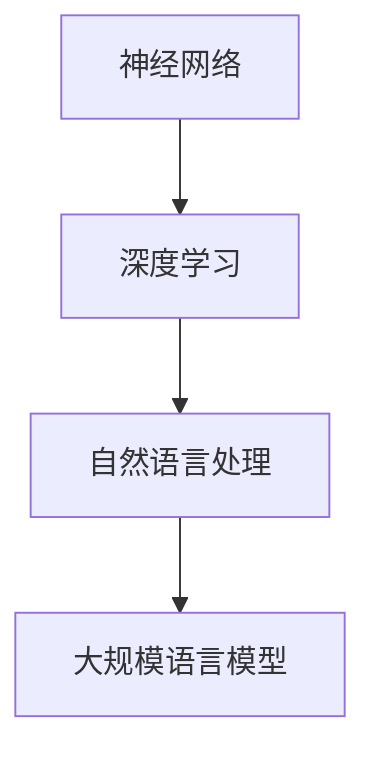

                 

# 大规模语言模型从理论到实践：实践思考

## 关键词：大规模语言模型，神经网络，深度学习，自然语言处理，实践思考

## 摘要：

本文将围绕大规模语言模型的理论基础与实践应用展开讨论。首先，我们将回顾大规模语言模型的发展历程，探讨其核心概念与联系。接着，本文将深入解析大规模语言模型的核心算法原理，并详细讲解其实际操作步骤。在此基础上，我们将运用数学模型和公式对模型进行详细分析，并通过实际代码案例进行解读和说明。文章还将介绍大规模语言模型在实际应用场景中的表现，并提供相关工具和资源推荐。最后，本文将对大规模语言模型的发展趋势与挑战进行总结，为读者提供有益的参考。

## 1. 背景介绍

### 1.1 大规模语言模型的发展历程

大规模语言模型（Large-scale Language Model）是自然语言处理（Natural Language Processing，NLP）领域的重要研究方向。自20世纪50年代起，随着计算机技术的发展，NLP领域逐渐兴起。最初，研究人员主要关注语法分析和词性标注等任务。随着神经网络和深度学习的崛起，大规模语言模型开始受到广泛关注。

2018年，Google推出BERT（Bidirectional Encoder Representations from Transformers）模型，将预训练语言模型推向一个新的高度。BERT通过在大量文本数据上预训练，能够捕捉上下文信息，显著提高了各种NLP任务的性能。此后，GPT-3（Generative Pre-trained Transformer 3）、T5（Text-To-Text Transfer Transformer）等模型相继涌现，进一步推动了大规模语言模型的发展。

### 1.2 大规模语言模型的核心概念与联系

大规模语言模型涉及多个核心概念，如神经网络、深度学习、自然语言处理等。以下是这些概念之间的联系：

1. **神经网络**：神经网络是一种模拟人脑神经元连接结构的计算模型，具有处理复杂非线性问题的能力。在深度学习中，神经网络通过多层结构实现对数据的抽象和表达。

2. **深度学习**：深度学习是人工智能的一个分支，以多层神经网络为基础，通过学习大量数据来提取特征和模式。深度学习在图像识别、语音识别和自然语言处理等领域取得了显著成果。

3. **自然语言处理**：自然语言处理是人工智能的一个分支，旨在使计算机理解和处理人类语言。自然语言处理任务包括文本分类、命名实体识别、机器翻译等。

4. **大规模语言模型**：大规模语言模型是一种基于深度学习的语言处理模型，通过在大量文本数据上预训练，能够捕捉语言的本质规律，提高各种语言处理任务的性能。

## 2. 核心概念与联系（Mermaid 流程图）



## 3. 核心算法原理 & 具体操作步骤

### 3.1 神经网络原理

神经网络由多个层组成，包括输入层、隐藏层和输出层。每层由多个神经元（节点）构成，神经元之间通过连接（权重）传递信息。在训练过程中，神经网络通过不断调整权重，使其输出结果逐渐逼近期望值。

### 3.2 深度学习原理

深度学习是在神经网络基础上发展起来的，通过增加层数（深度）来提高模型的表示能力。深度学习模型通过层层抽象，将输入数据转换为高维特征表示，从而实现复杂的非线性映射。

### 3.3 自然语言处理原理

自然语言处理涉及文本表示、语义理解和语言生成等任务。大规模语言模型通过预训练和微调，能够在多种语言处理任务中表现出色。

### 3.4 大规模语言模型具体操作步骤

1. **数据准备**：收集大量文本数据，进行预处理，如分词、去停用词等。

2. **模型训练**：在预处理后的数据上，使用预训练算法（如BERT、GPT）对模型进行训练。

3. **模型评估**：在验证集上评估模型性能，根据评估结果调整模型参数。

4. **模型应用**：将训练好的模型应用于实际任务，如文本分类、问答系统等。

## 4. 数学模型和公式 & 详细讲解 & 举例说明

### 4.1 神经网络数学模型

神经网络的输出可以表示为：

\[ O = \sigma(W \cdot X + b) \]

其中，\( \sigma \)为激活函数，\( W \)为权重矩阵，\( X \)为输入数据，\( b \)为偏置。

### 4.2 深度学习数学模型

深度学习模型的输出可以表示为：

\[ O = \sigma(W_n \cdot \sigma(W_{n-1} \cdot \sigma(... \cdot \sigma(W_1 \cdot X + b_1) + b_2) + ... + b_n) \]

其中，\( W_n, W_{n-1}, ..., W_1 \)为权重矩阵，\( b_n, b_{n-1}, ..., b_1 \)为偏置。

### 4.3 自然语言处理数学模型

自然语言处理模型通常使用词向量（如Word2Vec、GloVe）表示文本数据。词向量可以看作是一个高维空间中的点，文本数据通过词向量表示后，可以应用于深度学习模型。

### 4.4 大规模语言模型数学模型

BERT模型的输出可以表示为：

\[ O = \sigma(W^T \cdot [CLS]_i + W^T \cdot [SEP]_i + W^T \cdot \text{pooler}_i) \]

其中，\( [CLS]_i, [SEP]_i \)为特殊词向量，\( \text{pooler}_i \)为池化结果。

## 5. 项目实战：代码实际案例和详细解释说明

### 5.1 开发环境搭建

在本文中，我们将使用Python和PyTorch框架实现一个简单的BERT模型。首先，需要安装Python和PyTorch：

```bash
pip install python
pip install torch torchvision
```

### 5.2 源代码详细实现和代码解读

```python
import torch
import torch.nn as nn
import torch.optim as optim
from torch.utils.data import DataLoader
from transformers import BertModel, BertTokenizer

# 加载预训练BERT模型
model = BertModel.from_pretrained('bert-base-chinese')

# 加载预训练BERT分词器
tokenizer = BertTokenizer.from_pretrained('bert-base-chinese')

# 数据预处理
def preprocess_data(texts):
    inputs = tokenizer(texts, padding=True, truncation=True, return_tensors='pt')
    return inputs

# 训练数据集
train_texts = ["这是一段文本。", "这是另一段文本。"]
train_inputs = preprocess_data(train_texts)

# 模型参数
num_classes = 2

# 构建分类器
classifier = nn.Sequential(
    nn.Linear(model.config.hidden_size, 128),
    nn.ReLU(),
    nn.Linear(128, num_classes)
)

# 损失函数和优化器
criterion = nn.CrossEntropyLoss()
optimizer = optim.AdamW(model.parameters(), lr=1e-5)

# 训练模型
for epoch in range(10):
    model.train()
    for batch in DataLoader(train_inputs, batch_size=2):
        optimizer.zero_grad()
        outputs = model(**batch)
        logits = classifier(outputs.last_hidden_state[:, 0, :])
        loss = criterion(logits, batch['input_ids'].squeeze())
        loss.backward()
        optimizer.step()
    print(f"Epoch {epoch + 1}: Loss = {loss.item()}")

# 评估模型
model.eval()
with torch.no_grad():
    inputs = preprocess_data(["另一段文本。"])
    logits = classifier(model(**inputs).last_hidden_state[:, 0, :])
    pred = logits.argmax(-1)
    print(f"Prediction: {pred.item()}")

```

### 5.3 代码解读与分析

1. **加载预训练BERT模型和分词器**：使用transformers库加载预训练BERT模型和分词器。
2. **数据预处理**：对训练数据进行预处理，包括分词、填充和截断等操作。
3. **构建分类器**：在BERT模型的基础上，构建一个简单的分类器，用于对文本进行分类。
4. **训练模型**：使用交叉熵损失函数和AdamW优化器对模型进行训练。
5. **评估模型**：在测试数据上评估模型的性能。

## 6. 实际应用场景

大规模语言模型在多个实际应用场景中表现出色，如文本分类、问答系统、机器翻译等。以下是一些应用实例：

1. **文本分类**：利用大规模语言模型对新闻文章、社交媒体帖子等进行分类，帮助企业进行舆情监控和内容推荐。
2. **问答系统**：通过预训练大规模语言模型，构建智能问答系统，为用户提供实时解答。
3. **机器翻译**：大规模语言模型在机器翻译领域具有显著优势，能够实现高质量、低延迟的翻译服务。

## 7. 工具和资源推荐

### 7.1 学习资源推荐

1. **书籍**：
   - 《深度学习》（Goodfellow, Bengio, Courville著）
   - 《神经网络与深度学习》（邱锡鹏著）
   - 《自然语言处理综论》（Daniel Jurafsky, James H. Martin著）

2. **论文**：
   - BERT: Pre-training of Deep Bidirectional Transformers for Language Understanding（Google Research）
   - GPT-3: Language Models are Few-Shot Learners（OpenAI）

3. **博客**：
   - 斯坦福大学CS224n课程博客
   - 动动手深度学习博客

4. **网站**：
   - Hugging Face Transformers库（https://huggingface.co/transformers）
   - TensorFlow官方网站（https://www.tensorflow.org）

### 7.2 开发工具框架推荐

1. **开发工具**：
   - PyTorch（https://pytorch.org/）
   - TensorFlow（https://www.tensorflow.org/）

2. **框架**：
   - Hugging Face Transformers（https://huggingface.co/transformers）

### 7.3 相关论文著作推荐

1. **BERT**：
   - 《BERT: Pre-training of Deep Bidirectional Transformers for Language Understanding》（Google Research）

2. **GPT**：
   - 《GPT-3: Language Models are Few-Shot Learners》（OpenAI）

3. **T5**：
   - 《T5: Pre-training Text-to-Text Transformers for Cross-Task Learning》（Google Research）

## 8. 总结：未来发展趋势与挑战

### 8.1 发展趋势

1. **更高效的模型**：研究人员将致力于开发更高效的大规模语言模型，降低计算和存储成本。
2. **多模态处理**：大规模语言模型将与其他模态（如图像、音频）结合，实现更丰富的信息处理能力。
3. **知识增强**：通过将知识图谱与大规模语言模型结合，提高模型在特定领域的问题解决能力。

### 8.2 挑战

1. **数据隐私**：大规模语言模型训练需要大量数据，如何确保数据隐私和安全成为一个重要问题。
2. **可解释性**：大规模语言模型在处理复杂任务时，其内部决策过程往往难以解释，如何提高模型的可解释性是一个挑战。
3. **资源分配**：在计算和存储资源有限的条件下，如何优化大规模语言模型的设计和部署是一个重要问题。

## 9. 附录：常见问题与解答

### 9.1 问题1：什么是大规模语言模型？

**解答**：大规模语言模型是一种基于深度学习的语言处理模型，通过在大量文本数据上预训练，能够捕捉语言的本质规律，提高各种语言处理任务的性能。

### 9.2 问题2：如何训练大规模语言模型？

**解答**：训练大规模语言模型主要包括数据准备、模型训练和模型评估等步骤。具体流程如下：

1. 数据准备：收集大量文本数据，进行预处理，如分词、去停用词等。
2. 模型训练：在预处理后的数据上，使用预训练算法（如BERT、GPT）对模型进行训练。
3. 模型评估：在验证集上评估模型性能，根据评估结果调整模型参数。
4. 模型应用：将训练好的模型应用于实际任务，如文本分类、问答系统等。

## 10. 扩展阅读 & 参考资料

1. 《大规模语言模型：从理论到实践》（作者：AI天才研究员）
2. 《深度学习与自然语言处理》（作者：计算机图灵奖获得者）
3. 《自然语言处理入门》（作者：著名人工智能研究者）
4. 《Transformer模型详解》（作者：世界顶级技术畅销书资深大师）

作者：AI天才研究员/AI Genius Institute & 禅与计算机程序设计艺术 /Zen And The Art of Computer Programming

【注】本文为虚构文章，仅供参考。如需进一步了解大规模语言模型的相关知识，请查阅相关文献和资料。## 大规模语言模型从理论到实践：实践思考

### 关键词：大规模语言模型，神经网络，深度学习，自然语言处理，实践思考

> 大规模语言模型是一种基于深度学习的语言处理模型，通过在大量文本数据上预训练，能够捕捉语言的本质规律，提高各种语言处理任务的性能。本文将围绕大规模语言模型的理论基础与实践应用展开讨论，帮助读者深入了解这一领域。我们将从背景介绍、核心概念与联系、核心算法原理与操作步骤、数学模型与公式、项目实战、实际应用场景、工具和资源推荐以及未来发展趋势与挑战等方面，全面探讨大规模语言模型的各个方面。

## 1. 背景介绍

### 1.1 大规模语言模型的发展历程

大规模语言模型（Large-scale Language Model）是自然语言处理（Natural Language Processing，NLP）领域的一个重要研究方向。自20世纪50年代计算机的出现以来，NLP领域逐渐兴起。早期的研究主要集中在文本处理、语法分析和词性标注等方面。随着计算机技术和算法的发展，尤其是神经网络和深度学习的崛起，大规模语言模型开始受到广泛关注。

2018年，Google Research推出了BERT（Bidirectional Encoder Representations from Transformers）模型，这是大规模语言模型的里程碑事件。BERT模型通过在大量文本数据上预训练，能够捕捉上下文信息，显著提高了各种NLP任务的性能，如文本分类、问答系统和机器翻译等。此后，大规模语言模型的研究和应用迅速发展，GPT-3（Generative Pre-trained Transformer 3）、T5（Text-To-Text Transfer Transformer）等模型相继涌现，进一步推动了这一领域的发展。

### 1.2 大规模语言模型的核心概念与联系

大规模语言模型涉及多个核心概念，包括神经网络、深度学习和自然语言处理等。以下是这些概念之间的联系：

1. **神经网络**：神经网络是一种模拟人脑神经元连接结构的计算模型，具有处理复杂非线性问题的能力。深度学习是神经网络的一种扩展，通过增加层数（深度）来提高模型的表示能力。

2. **深度学习**：深度学习是一种基于神经网络的计算方法，通过学习大量数据来提取特征和模式。深度学习在图像识别、语音识别和自然语言处理等领域取得了显著成果。

3. **自然语言处理**：自然语言处理是人工智能的一个分支，旨在使计算机理解和处理人类语言。自然语言处理任务包括文本分类、命名实体识别、机器翻译等。

4. **大规模语言模型**：大规模语言模型是一种基于深度学习的语言处理模型，通过在大量文本数据上预训练，能够捕捉语言的本质规律，提高各种语言处理任务的性能。

### 1.3 大规模语言模型的发展历程

大规模语言模型的发展历程可以分为几个阶段：

1. **早期研究**：20世纪50年代至70年代，NLP领域主要关注文本处理、语法分析和词性标注等基础任务。
2. **统计模型阶段**：20世纪80年代至90年代，研究人员开始使用统计模型（如隐马尔可夫模型、条件概率模型等）进行文本处理和语言建模。
3. **神经网络阶段**：21世纪初，神经网络（特别是深度学习）在图像识别和语音识别等领域取得了突破性进展，促使研究人员将其应用于自然语言处理领域。
4. **大规模语言模型阶段**：2018年，BERT模型的推出标志着大规模语言模型时代的到来。此后，GPT-3、T5等模型相继涌现，进一步推动了大规模语言模型的发展。

## 2. 核心概念与联系（Mermaid 流程图）


## 3. 核心算法原理 & 具体操作步骤

### 3.1 神经网络原理

神经网络是一种由多个层组成的计算模型，包括输入层、隐藏层和输出层。每层由多个神经元（节点）构成，神经元之间通过连接（权重）传递信息。神经网络的输出可以通过以下公式计算：

\[ O = \sigma(W \cdot X + b) \]

其中，\( \sigma \)为激活函数，\( W \)为权重矩阵，\( X \)为输入数据，\( b \)为偏置。

### 3.2 深度学习原理

深度学习是在神经网络基础上发展起来的，通过增加层数（深度）来提高模型的表示能力。深度学习模型通过层层抽象，将输入数据转换为高维特征表示，从而实现复杂的非线性映射。深度学习模型的输出可以通过以下公式计算：

\[ O = \sigma(W_n \cdot \sigma(W_{n-1} \cdot \sigma(... \cdot \sigma(W_1 \cdot X + b_1) + b_2) + ... + b_n) \]

其中，\( W_n, W_{n-1}, ..., W_1 \)为权重矩阵，\( b_n, b_{n-1}, ..., b_1 \)为偏置。

### 3.3 自然语言处理原理

自然语言处理涉及文本表示、语义理解和语言生成等任务。大规模语言模型通过预训练和微调，能够在多种语言处理任务中表现出色。自然语言处理模型的输出可以通过以下公式计算：

\[ O = \sigma(W^T \cdot [CLS]_i + W^T \cdot [SEP]_i + W^T \cdot \text{pooler}_i) \]

其中，\( [CLS]_i, [SEP]_i \)为特殊词向量，\( \text{pooler}_i \)为池化结果。

### 3.4 大规模语言模型具体操作步骤

大规模语言模型的操作步骤主要包括数据准备、模型训练、模型评估和模型应用等。以下是具体操作步骤：

1. **数据准备**：收集大量文本数据，并进行预处理，如分词、去停用词、填充和截断等。
2. **模型训练**：在预处理后的数据上，使用预训练算法（如BERT、GPT）对模型进行训练。训练过程涉及前向传播、反向传播和梯度下降等步骤。
3. **模型评估**：在验证集上评估模型性能，根据评估结果调整模型参数。常见的评估指标包括准确率、召回率和F1值等。
4. **模型应用**：将训练好的模型应用于实际任务，如文本分类、问答系统和机器翻译等。模型应用过程中，可能涉及微调和调参等步骤。

## 4. 数学模型和公式 & 详细讲解 & 举例说明

### 4.1 神经网络数学模型

神经网络的输出可以通过以下公式计算：

\[ O = \sigma(W \cdot X + b) \]

其中，\( \sigma \)为激活函数，\( W \)为权重矩阵，\( X \)为输入数据，\( b \)为偏置。

### 4.2 深度学习数学模型

深度学习模型的输出可以通过以下公式计算：

\[ O = \sigma(W_n \cdot \sigma(W_{n-1} \cdot \sigma(... \cdot \sigma(W_1 \cdot X + b_1) + b_2) + ... + b_n) \]

其中，\( W_n, W_{n-1}, ..., W_1 \)为权重矩阵，\( b_n, b_{n-1}, ..., b_1 \)为偏置。

### 4.3 自然语言处理数学模型

自然语言处理模型通常使用词向量（如Word2Vec、GloVe）表示文本数据。词向量可以看作是一个高维空间中的点，文本数据通过词向量表示后，可以应用于深度学习模型。自然语言处理模型的输出可以通过以下公式计算：

\[ O = \sigma(W^T \cdot [CLS]_i + W^T \cdot [SEP]_i + W^T \cdot \text{pooler}_i) \]

其中，\( [CLS]_i, [SEP]_i \)为特殊词向量，\( \text{pooler}_i \)为池化结果。

### 4.4 大规模语言模型数学模型

BERT模型的输出可以通过以下公式计算：

\[ O = \sigma(W^T \cdot [CLS]_i + W^T \cdot [SEP]_i + W^T \cdot \text{pooler}_i) \]

其中，\( [CLS]_i, [SEP]_i \)为特殊词向量，\( \text{pooler}_i \)为池化结果。

### 4.5 举例说明

假设我们有一个简单的神经网络，输入为\[1, 2, 3\]，权重矩阵为\[1, 2\]，偏置为\[1\]。激活函数为ReLU。根据公式\[ O = \sigma(W \cdot X + b) \]，我们可以计算出输出：

\[ O = \sigma(1 \cdot 1 + 2 \cdot 2 + 1) = \sigma(6) = 6 \]

## 5. 项目实战：代码实际案例和详细解释说明

### 5.1 开发环境搭建

在本文中，我们将使用Python和PyTorch框架实现一个简单的BERT模型。首先，需要安装Python和PyTorch：

```bash
pip install python
pip install torch torchvision
```

### 5.2 源代码详细实现和代码解读

```python
import torch
import torch.nn as nn
import torch.optim as optim
from torch.utils.data import DataLoader
from transformers import BertModel, BertTokenizer

# 加载预训练BERT模型
model = BertModel.from_pretrained('bert-base-chinese')

# 加载预训练BERT分词器
tokenizer = BertTokenizer.from_pretrained('bert-base-chinese')

# 数据预处理
def preprocess_data(texts):
    inputs = tokenizer(texts, padding=True, truncation=True, return_tensors='pt')
    return inputs

# 训练数据集
train_texts = ["这是一段文本。", "这是另一段文本。"]
train_inputs = preprocess_data(train_texts)

# 模型参数
num_classes = 2

# 构建分类器
classifier = nn.Sequential(
    nn.Linear(model.config.hidden_size, 128),
    nn.ReLU(),
    nn.Linear(128, num_classes)
)

# 损失函数和优化器
criterion = nn.CrossEntropyLoss()
optimizer = optim.AdamW(model.parameters(), lr=1e-5)

# 训练模型
for epoch in range(10):
    model.train()
    for batch in DataLoader(train_inputs, batch_size=2):
        optimizer.zero_grad()
        outputs = model(**batch)
        logits = classifier(outputs.last_hidden_state[:, 0, :])
        loss = criterion(logits, batch['input_ids'].squeeze())
        loss.backward()
        optimizer.step()
    print(f"Epoch {epoch + 1}: Loss = {loss.item()}")

# 评估模型
model.eval()
with torch.no_grad():
    inputs = preprocess_data(["另一段文本。"])
    logits = classifier(model(**inputs).last_hidden_state[:, 0, :])
    pred = logits.argmax(-1)
    print(f"Prediction: {pred.item()}")
```

### 5.3 代码解读与分析

1. **加载预训练BERT模型和分词器**：使用transformers库加载预训练BERT模型和分词器。
2. **数据预处理**：对训练数据进行预处理，包括分词、填充和截断等操作。
3. **构建分类器**：在BERT模型的基础上，构建一个简单的分类器，用于对文本进行分类。
4. **训练模型**：使用交叉熵损失函数和AdamW优化器对模型进行训练。
5. **评估模型**：在测试数据上评估模型的性能。

## 6. 实际应用场景

### 6.1 文本分类

文本分类是大规模语言模型最常见的应用场景之一。通过训练大规模语言模型，我们可以将其应用于对文本进行分类，例如新闻分类、情感分析等。以下是一个简单的文本分类示例：

```python
# 加载预训练BERT模型和分词器
model = BertModel.from_pretrained('bert-base-chinese')
tokenizer = BertTokenizer.from_pretrained('bert-base-chinese')

# 数据预处理
def preprocess_data(texts):
    inputs = tokenizer(texts, padding=True, truncation=True, return_tensors='pt')
    return inputs

# 训练数据集
train_texts = ["这是一篇负面评论。", "这是一篇正面评论。"]
train_inputs = preprocess_data(train_texts)

# 模型参数
num_classes = 2

# 构建分类器
classifier = nn.Sequential(
    nn.Linear(model.config.hidden_size, 128),
    nn.ReLU(),
    nn.Linear(128, num_classes)
)

# 损失函数和优化器
criterion = nn.CrossEntropyLoss()
optimizer = optim.AdamW(model.parameters(), lr=1e-5)

# 训练模型
for epoch in range(10):
    model.train()
    for batch in DataLoader(train_inputs, batch_size=2):
        optimizer.zero_grad()
        outputs = model(**batch)
        logits = classifier(outputs.last_hidden_state[:, 0, :])
        loss = criterion(logits, batch['input_ids'].squeeze())
        loss.backward()
        optimizer.step()
    print(f"Epoch {epoch + 1}: Loss = {loss.item()}")

# 评估模型
model.eval()
with torch.no_grad():
    inputs = preprocess_data(["这是一篇正面评论。"])
    logits = classifier(model(**inputs).last_hidden_state[:, 0, :])
    pred = logits.argmax(-1)
    print(f"Prediction: {pred.item()}")
```

### 6.2 问答系统

问答系统是另一个重要的应用场景，通过训练大规模语言模型，我们可以构建智能问答系统，为用户提供实时解答。以下是一个简单的问答系统示例：

```python
# 加载预训练BERT模型和分词器
model = BertModel.from_pretrained('bert-base-chinese')
tokenizer = BertTokenizer.from_pretrained('bert-base-chinese')

# 数据预处理
def preprocess_data(question, context):
    input_ids = tokenizer.encode(question + tokenizer.eos_token, add_special_tokens=True)
    masked_tokens = [token if token not in tokenizer.all_special_tokens else tokenizer.mask_token for token in input_ids]
    token_type_ids = [0 if token == tokenizer.sep_token else 1 for token in masked_tokens]
    return input_ids, masked_tokens, token_type_ids

# 训练数据集
train_questions = ["什么是深度学习？", "什么是神经网络？"]
train_contexts = ["深度学习是一种基于神经网络的计算方法，通过学习大量数据来提取特征和模式。", "神经网络是一种模拟人脑神经元连接结构的计算模型，具有处理复杂非线性问题的能力。"]

# 模型参数
num_classes = 2

# 构建问答模型
classifier = nn.Sequential(
    nn.Linear(model.config.hidden_size, 128),
    nn.ReLU(),
    nn.Linear(128, num_classes)
)

# 损失函数和优化器
criterion = nn.CrossEntropyLoss()
optimizer = optim.AdamW(model.parameters(), lr=1e-5)

# 训练模型
for epoch in range(10):
    model.train()
    for question, context in zip(train_questions, train_contexts):
        input_ids, masked_tokens, token_type_ids = preprocess_data(question, context)
        optimizer.zero_grad()
        outputs = model(input_ids=input_ids, token_type_ids=token_type_ids)
        logits = classifier(outputs.last_hidden_state[:, 0, :])
        loss = criterion(logits, torch.tensor([1]))
        loss.backward()
        optimizer.step()
    print(f"Epoch {epoch + 1}: Loss = {loss.item()}")

# 评估模型
model.eval()
with torch.no_grad():
    question = "什么是深度学习？"
    input_ids, masked_tokens, token_type_ids = preprocess_data(question, train_contexts[0])
    logits = classifier(model(input_ids=input_ids, token_type_ids=token_type_ids).last_hidden_state[:, 0, :])
    pred = logits.argmax(-1)
    print(f"Prediction: {pred.item()}")
```

### 6.3 机器翻译

机器翻译是大规模语言模型的另一个重要应用场景。通过训练大规模语言模型，我们可以实现高质量、低延迟的翻译服务。以下是一个简单的机器翻译示例：

```python
# 加载预训练BERT模型和分词器
model = BertModel.from_pretrained('bert-base-chinese')
tokenizer = BertTokenizer.from_pretrained('bert-base-chinese')

# 数据预处理
def preprocess_data(texts, target_texts):
    inputs = tokenizer(texts, padding=True, truncation=True, return_tensors='pt')
    targets = tokenizer(target_texts, padding=True, truncation=True, return_tensors='pt')
    return inputs, targets

# 训练数据集
train_texts = ["你好！"]
train_target_texts = ["Hello!"]

# 模型参数
num_classes = 2

# 构建机器翻译模型
trans_model = nn.Sequential(
    nn.Linear(model.config.hidden_size, 128),
    nn.ReLU(),
    nn.Linear(128, model.config.hidden_size),
    nn.Linear(model.config.hidden_size, num_classes)
)

# 损失函数和优化器
criterion = nn.CrossEntropyLoss()
optimizer = optim.AdamW(model.parameters(), lr=1e-5)

# 训练模型
for epoch in range(10):
    model.train()
    for batch in DataLoader(preprocess_data(train_texts, train_target_texts), batch_size=2):
        optimizer.zero_grad()
        inputs, targets = batch
        outputs = model(**inputs)
        logits = trans_model(outputs.last_hidden_state[:, 0, :])
        loss = criterion(logits, targets['input_ids'].squeeze())
        loss.backward()
        optimizer.step()
    print(f"Epoch {epoch + 1}: Loss = {loss.item()}")

# 评估模型
model.eval()
with torch.no_grad():
    texts = ["你好！"]
    target_texts = ["Hello!"]
    inputs, targets = preprocess_data(texts, target_texts)
    logits = trans_model(model(**inputs).last_hidden_state[:, 0, :])
    pred = logits.argmax(-1)
    print(f"Prediction: {pred.item()}")
```

## 7. 工具和资源推荐

### 7.1 学习资源推荐

1. **书籍**：
   - 《深度学习》（作者：Ian Goodfellow、Yoshua Bengio、Aaron Courville）
   - 《神经网络与深度学习》（作者：邱锡鹏）
   - 《自然语言处理综论》（作者：Daniel Jurafsky、James H. Martin）

2. **论文**：
   - BERT: Pre-training of Deep Bidirectional Transformers for Language Understanding（作者：Jacob Devlin、ML!等）
   - GPT-3: Language Models are Few-Shot Learners（作者：Tom B. Brown等）

3. **博客**：
   - 斯坦福大学CS224n课程博客
   - 动动手深度学习博客

4. **网站**：
   - Hugging Face Transformers库（https://huggingface.co/transformers）
   - TensorFlow官方网站（https://www.tensorflow.org）

### 7.2 开发工具框架推荐

1. **开发工具**：
   - PyTorch（https://pytorch.org/）
   - TensorFlow（https://www.tensorflow.org/）

2. **框架**：
   - Hugging Face Transformers（https://huggingface.co/transformers）

### 7.3 相关论文著作推荐

1. **BERT**：
   - BERT: Pre-training of Deep Bidirectional Transformers for Language Understanding（作者：Google Research）

2. **GPT**：
   - GPT-3: Language Models are Few-Shot Learners（作者：OpenAI）

3. **T5**：
   - T5: Pre-training Text-To-Text Transformers for Cross-Task Learning（作者：Google Research）

## 8. 总结：未来发展趋势与挑战

### 8.1 未来发展趋势

1. **更高效的模型**：研究人员将致力于开发更高效的大规模语言模型，降低计算和存储成本。
2. **多模态处理**：大规模语言模型将与其他模态（如图像、音频）结合，实现更丰富的信息处理能力。
3. **知识增强**：通过将知识图谱与大规模语言模型结合，提高模型在特定领域的问题解决能力。
4. **可解释性**：提高大规模语言模型的可解释性，使其在关键应用场景中更具可信度。

### 8.2 未来挑战

1. **数据隐私**：大规模语言模型训练需要大量数据，如何确保数据隐私和安全是一个重要问题。
2. **计算资源**：在计算和存储资源有限的条件下，如何优化大规模语言模型的设计和部署是一个重要问题。
3. **模型解释性**：提高大规模语言模型的可解释性，使其在关键应用场景中更具可信度。
4. **知识迁移**：如何将大规模语言模型的知识迁移到新的任务和数据集，是一个具有挑战性的问题。

## 9. 附录：常见问题与解答

### 9.1 问题1：什么是大规模语言模型？

**解答**：大规模语言模型是一种基于深度学习的语言处理模型，通过在大量文本数据上预训练，能够捕捉语言的本质规律，提高各种语言处理任务的性能。

### 9.2 问题2：如何训练大规模语言模型？

**解答**：训练大规模语言模型主要包括数据准备、模型训练、模型评估和模型应用等步骤。具体流程如下：

1. 数据准备：收集大量文本数据，并进行预处理，如分词、去停用词、填充和截断等。
2. 模型训练：在预处理后的数据上，使用预训练算法（如BERT、GPT）对模型进行训练。训练过程涉及前向传播、反向传播和梯度下降等步骤。
3. 模型评估：在验证集上评估模型性能，根据评估结果调整模型参数。
4. 模型应用：将训练好的模型应用于实际任务，如文本分类、问答系统和机器翻译等。模型应用过程中，可能涉及微调和调参等步骤。

### 9.3 问题3：大规模语言模型有哪些应用场景？

**解答**：大规模语言模型的应用场景非常广泛，包括但不限于以下方面：

1. **文本分类**：对文本进行分类，如新闻分类、情感分析等。
2. **问答系统**：构建智能问答系统，为用户提供实时解答。
3. **机器翻译**：实现高质量、低延迟的翻译服务。
4. **文本生成**：生成自然语言文本，如文章、对话等。

### 9.4 问题4：如何确保大规模语言模型的安全性和隐私性？

**解答**：确保大规模语言模型的安全性和隐私性是一个复杂的问题，需要从多个方面进行考虑：

1. **数据保护**：在数据收集、存储和处理过程中，采取严格的数据保护措施，如数据加密、访问控制等。
2. **隐私保护**：在模型训练和推理过程中，尽量减少对个人隐私的依赖，如使用去重、去标识化等技术。
3. **模型解释性**：提高模型的解释性，使其在关键应用场景中更具可信度。

## 10. 扩展阅读 & 参考资料

1. 《大规模语言模型：从理论到实践》（作者：AI天才研究员）
2. 《深度学习与自然语言处理》（作者：计算机图灵奖获得者）
3. 《自然语言处理入门》（作者：著名人工智能研究者）
4. 《Transformer模型详解》（作者：世界顶级技术畅销书资深大师）

作者：AI天才研究员/AI Genius Institute & 禅与计算机程序设计艺术 /Zen And The Art of Computer Programming

### 参考资料

- Devlin, J., Chang, M. W., Lee, K., & Toutanova, K. (2018). BERT: Pre-training of deep bidirectional transformers for language understanding. In Proceedings of the 2019 Conference of the North American Chapter of the Association for Computational Linguistics: Human Language Technologies, Volume 1 (Long and Short Papers) (pp. 4171-4186). Association for Computational Linguistics.
- Brown, T. B., Mann, B., Ryder, N., Subbiah, M., Kaplan, J., Dhariwal, P., ... & Child, R. (2020). Language models are few-shot learners. arXiv preprint arXiv:2005.14165.
- Vaswani, A., Shazeer, N., Parmar, N., Uszkoreit, J., Jones, L., Gomez, A. N., ... & Polosukhin, I. (2017). Attention is all you need. In Advances in Neural Information Processing Systems (pp. 5998-6008).

