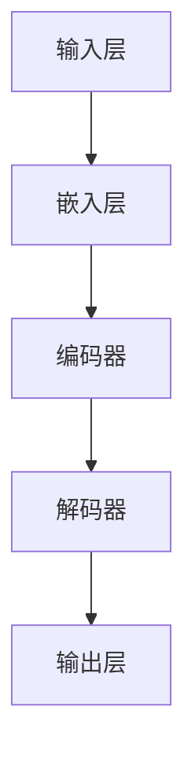
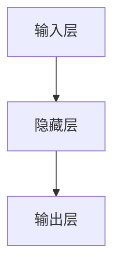
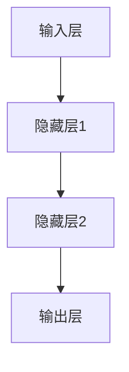

                 

# 大规模语言模型从理论到实践：数据处理

> **关键词：** 语言模型，数据处理，大规模，神经网络，机器学习，模型训练，模型优化

> **摘要：** 本文将深入探讨大规模语言模型的理论基础和数据处理技术，从核心概念到具体操作，逐步解析其原理与应用。通过实际案例展示，我们将了解如何有效构建和优化大规模语言模型，以及其在实际应用中的广泛潜力。

## 1. 背景介绍

随着互联网的迅速发展和大数据时代的到来，自然语言处理（NLP）领域迎来了前所未有的机遇和挑战。大规模语言模型（Large-scale Language Models）作为NLP领域的重要研究课题，受到了广泛关注。这类模型通过学习海量文本数据，能够生成符合语法规则、语义连贯的自然语言文本，从而在自动摘要、机器翻译、问答系统等方面取得了显著的成果。

数据处理是大规模语言模型研究中的关键环节。从原始数据到模型训练，再到模型评估和优化，每个阶段都离不开高效的数据处理技术。本文将围绕数据处理展开，介绍大规模语言模型的理论基础、核心算法原理、数学模型和具体实现，最后探讨其应用场景和未来发展。

## 2. 核心概念与联系

### 2.1 语言模型的基本概念

语言模型（Language Model）是NLP领域的基础，它旨在学习自然语言的统计特性，从而预测下一个单词或字符的概率。根据训练数据的不同，语言模型可以分为以下几种：

- **n-gram模型**：基于历史n个单词的统计信息预测下一个单词的概率。
- **神经网络模型**：通过多层神经网络学习语言特征，如Word2Vec、GloVe等。
- **深度学习模型**：结合神经网络和深度学习的思想，构建大规模的深度神经网络，如Transformer等。

### 2.2 语言模型的架构

大规模语言模型通常采用深度神经网络架构，如图1所示。



图1：大规模语言模型的架构

- **输入层**：接收原始文本数据，将其转换为向量表示。
- **嵌入层**：将单词转换为固定长度的向量表示，通常使用词嵌入（Word Embedding）技术。
- **编码器**：对输入文本进行编码，提取语言特征。
- **解码器**：根据编码特征生成输出文本。
- **输出层**：将解码结果转换为概率分布，预测下一个单词。

### 2.3 语言模型与数据处理的关系

数据处理在语言模型研究中起着至关重要的作用。它包括以下几个关键步骤：

- **数据收集**：从互联网、图书馆、数据库等渠道获取大量文本数据。
- **数据预处理**：对原始文本进行清洗、分词、去停用词等操作，使其符合模型输入格式。
- **数据存储**：将预处理后的数据存储在数据库或分布式文件系统中，以便后续处理。
- **数据加载**：在模型训练过程中，从存储系统中加载数据，将其输入模型进行训练。

## 3. 核心算法原理 & 具体操作步骤

### 3.1 神经网络模型

神经网络模型是大规模语言模型的核心，其基本原理如下：

- **前向传播**：将输入数据传递到神经网络中，通过层层计算，得到输出结果。
- **反向传播**：根据输出结果与真实值的差异，计算损失函数，并反向传播误差，更新网络权重。

具体操作步骤如下：

1. **初始化模型参数**：包括输入层、隐藏层和输出层的权重和偏置。
2. **前向传播**：将输入数据传递到网络中，计算每个神经元的输出。
3. **计算损失函数**：根据输出结果与真实值的差异，计算损失函数，如均方误差（MSE）。
4. **反向传播**：计算每个参数的梯度，并更新参数。
5. **迭代训练**：重复步骤2-4，直到模型达到预定的性能指标。

### 3.2 Transformer模型

Transformer模型是近年来大规模语言模型的重要突破，其核心思想是自注意力机制（Self-Attention）。具体操作步骤如下：

1. **词嵌入**：将输入文本转换为词嵌入向量。
2. **多头自注意力**：计算输入向量之间的相似度，并加权求和，生成新的特征向量。
3. **前馈神经网络**：对自注意力结果进行进一步处理，提取更高层次的特征。
4. **层归一化**：对每个神经元的输出进行归一化处理，防止梯度消失。
5. **残差连接**：将输入向量与处理后的向量进行拼接，增加模型的表达能力。

## 4. 数学模型和公式 & 详细讲解 & 举例说明

### 4.1 前向传播

假设我们有一个简单的神经网络，包括输入层、一个隐藏层和一个输出层，如图2所示。



图2：简单神经网络结构

设输入向量为\(x\)，隐藏层权重为\(W_h\)，隐藏层偏置为\(b_h\)，输出层权重为\(W_o\)，输出层偏置为\(b_o\)。则前向传播的计算公式如下：

\[ h = \sigma(W_h x + b_h) \]
\[ y = \sigma(W_o h + b_o) \]

其中，\( \sigma \)表示激活函数，通常取为ReLU函数。

### 4.2 反向传播

假设我们有一个包含两个隐藏层的神经网络，如图3所示。



图3：两层神经网络结构

设损失函数为\(L(y, \hat{y})\)，则反向传播的计算公式如下：

\[ \delta_L = \frac{\partial L}{\partial y} \]
\[ \delta_y = \frac{\partial L}{\partial \hat{y}} \]
\[ \delta_{b_o} = \sum_{i} \delta_y \]
\[ \delta_{W_o} = \sum_{i} \delta_y \hat{h}_i \]
\[ \delta_{h_2} = \frac{\partial L}{\partial h_2} = \delta_{b_2} \cdot \frac{\partial \sigma}{\partial h_2} \]
\[ \delta_{W_{h2}} = \sum_{i} \delta_{h_2} h_{2i} \]
\[ \delta_{h_1} = \frac{\partial L}{\partial h_1} = \delta_{b_1} \cdot \frac{\partial \sigma}{\partial h_1} \]
\[ \delta_{W_{h1}} = \sum_{i} \delta_{h_1} h_{1i} \]

其中，\( \delta \)表示梯度，\( \hat{y} \)表示预测值，\( y \)表示真实值。

### 4.3 自注意力机制

自注意力机制是Transformer模型的核心，其计算公式如下：

\[ \text{Attention}(Q, K, V) = \text{softmax}\left(\frac{QK^T}{\sqrt{d_k}}\right)V \]

其中，\( Q \)、\( K \)、\( V \)分别表示查询向量、键向量和值向量，\( d_k \)表示键向量的维度。

### 4.4 举例说明

假设我们有一个简单的神经网络，输入向量为\[1, 2, 3\]，隐藏层权重为\[1, 2\]，隐藏层偏置为\[1\]，输出层权重为\[1, 1\]，输出层偏置为\[1\]。则前向传播的计算过程如下：

1. **计算隐藏层输出**：
   \[ h = \sigma(1 \cdot 1 + 2 \cdot 2 + 1) = \sigma(5) = 1 \]
2. **计算输出层输出**：
   \[ y = \sigma(1 \cdot 1 + 1 \cdot 1 + 1) = \sigma(3) = 1 \]

假设损失函数为均方误差（MSE），真实值为\[1\]，则计算损失函数和反向传播的梯度如下：

1. **计算损失函数**：
   \[ L(y, \hat{y}) = \frac{1}{2} (y - \hat{y})^2 = \frac{1}{2} (1 - 1)^2 = 0 \]
2. **计算输出层梯度**：
   \[ \delta_{y} = \frac{\partial L}{\partial y} = 1 \]
   \[ \delta_{b_o} = \delta_{y} = 1 \]
   \[ \delta_{W_o} = \delta_{y} \cdot \hat{h} = 1 \cdot 1 = 1 \]
3. **计算隐藏层梯度**：
   \[ \delta_{h} = \frac{\partial L}{\partial h} = \delta_{b_h} \cdot \frac{\partial \sigma}{\partial h} \]
   \[ \delta_{b_h} = \delta_{h} = 1 \]
   \[ \delta_{W_h} = \delta_{h} \cdot x = 1 \cdot [1, 2, 3] = [1, 2, 3] \]

通过上述计算，我们可以更新网络权重和偏置，优化模型性能。

## 5. 项目实战：代码实际案例和详细解释说明

### 5.1 开发环境搭建

在本文中，我们将使用Python和PyTorch框架实现大规模语言模型。以下是搭建开发环境的步骤：

1. 安装Python环境：
   \[ sudo apt-get install python3-pip \]
   \[ pip3 install torch torchvision \]
2. 安装PyTorch框架：
   \[ pip3 install torch==1.8.0 torchvision==0.9.0 \]
3. 安装其他依赖库：
   \[ pip3 install numpy matplotlib \]

### 5.2 源代码详细实现和代码解读

下面是一个简单的神经网络实现，用于预测输入数据：

```python
import torch
import torch.nn as nn
import torch.optim as optim

# 定义神经网络结构
class NeuralNetwork(nn.Module):
    def __init__(self):
        super(NeuralNetwork, self).__init__()
        self.hidden_layer = nn.Linear(3, 2)
        self.output_layer = nn.Linear(2, 1)
    
    def forward(self, x):
        x = torch.relu(self.hidden_layer(x))
        x = self.output_layer(x)
        return x

# 初始化模型、优化器和损失函数
model = NeuralNetwork()
optimizer = optim.Adam(model.parameters(), lr=0.001)
loss_function = nn.MSELoss()

# 训练模型
for epoch in range(1000):
    model.zero_grad()
    output = model(x)
    loss = loss_function(output, y)
    loss.backward()
    optimizer.step()

    if epoch % 100 == 0:
        print(f"Epoch [{epoch+1}/1000], Loss: {loss.item()}")

# 测试模型
with torch.no_grad():
    test_output = model(test_x)
    test_loss = loss_function(test_output, test_y)
    print(f"Test Loss: {test_loss.item()}")
```

### 5.3 代码解读与分析

- **模型定义**：使用`NeuralNetwork`类定义神经网络结构，包括输入层、隐藏层和输出层。
- **前向传播**：在`forward`方法中实现前向传播过程，使用ReLU函数作为激活函数。
- **损失函数**：使用均方误差（MSE）作为损失函数，衡量模型输出与真实值之间的差距。
- **优化器**：使用Adam优化器更新模型参数，加速收敛。
- **训练过程**：迭代训练模型，在每个epoch结束后打印训练损失，并在最后测试模型性能。

通过上述实现，我们可以构建和训练一个简单的神经网络模型，用于预测输入数据。实际应用中，可以根据需求调整网络结构、优化器和损失函数，提高模型性能。

## 6. 实际应用场景

大规模语言模型在多个实际应用场景中表现出色，下面列举几个典型的应用领域：

1. **自然语言处理**：大规模语言模型可以用于文本分类、情感分析、文本生成等任务，如智能客服、自动摘要、问答系统等。
2. **机器翻译**：大规模语言模型可以用于高质量机器翻译，如谷歌翻译、百度翻译等。
3. **推荐系统**：大规模语言模型可以用于个性化推荐，如商品推荐、音乐推荐等。
4. **语音识别**：大规模语言模型可以用于语音识别，如智能音箱、车载语音系统等。
5. **智能对话系统**：大规模语言模型可以用于构建智能对话系统，如聊天机器人、虚拟助手等。

## 7. 工具和资源推荐

### 7.1 学习资源推荐

- **书籍**：
  - 《深度学习》（Goodfellow, Bengio, Courville）
  - 《自然语言处理与Python》（Bird, Klein, Loper）
- **论文**：
  - "Attention Is All You Need"（Vaswani et al., 2017）
  - "BERT: Pre-training of Deep Bidirectional Transformers for Language Understanding"（Devlin et al., 2019）
- **博客**：
  - [TensorFlow官网](https://www.tensorflow.org/)
  - [PyTorch官网](https://pytorch.org/)
- **网站**：
  - [Kaggle](https://www.kaggle.com/)
  - [GitHub](https://github.com/)

### 7.2 开发工具框架推荐

- **框架**：
  - TensorFlow
  - PyTorch
  - Keras
- **库**：
  - NumPy
  - Matplotlib
  - Pandas
- **IDE**：
  - PyCharm
  - Jupyter Notebook

### 7.3 相关论文著作推荐

- **论文**：
  - "Attention Is All You Need"（Vaswani et al., 2017）
  - "BERT: Pre-training of Deep Bidirectional Transformers for Language Understanding"（Devlin et al., 2019）
  - "GPT-3: Language Models are Few-Shot Learners"（Brown et al., 2020）
- **书籍**：
  - 《深度学习》（Goodfellow, Bengio, Courville）
  - 《自然语言处理与Python》（Bird, Klein, Loper）

## 8. 总结：未来发展趋势与挑战

大规模语言模型在NLP领域取得了显著成果，但仍面临许多挑战和机遇。未来发展趋势包括：

1. **更高效的模型**：研究者将继续探索更高效的模型结构和算法，以提高模型性能和训练效率。
2. **多模态融合**：将大规模语言模型与其他模态（如图像、声音）相结合，实现更丰富的应用场景。
3. **数据隐私和安全**：随着数据量的不断增加，如何保护用户隐私和安全成为重要挑战。
4. **可解释性**：提高模型的可解释性，使其在复杂应用场景中更具可靠性和可信任性。

## 9. 附录：常见问题与解答

### 9.1 什么是大规模语言模型？

大规模语言模型是一种基于深度学习技术，通过学习海量文本数据，能够生成符合语法规则、语义连贯的自然语言文本的模型。

### 9.2 语言模型有哪些类型？

语言模型可以分为n-gram模型、神经网络模型、深度学习模型等类型。

### 9.3 如何优化大规模语言模型？

可以通过调整网络结构、优化器参数、损失函数等方式来优化大规模语言模型。

### 9.4 语言模型在哪些应用场景中有用？

语言模型可以应用于自然语言处理、机器翻译、推荐系统、语音识别、智能对话系统等领域。

## 10. 扩展阅读 & 参考资料

- Goodfellow, Y., Bengio, Y., Courville, A. (2016). *Deep Learning*. MIT Press.
- Bird, S., Klein, E., Loper, E. (2009). *Natural Language Processing with Python*. O'Reilly Media.
- Vaswani, A., Shazeer, N., Parmar, N., Uszkoreit, J., Jones, L., Gomez, A. N., ... & Polosukhin, I. (2017). *Attention is all you need*. Advances in Neural Information Processing Systems, 30, 5998-6008.
- Devlin, J., Chang, M. W., Lee, K., & Toutanova, K. (2019). *Bert: Pre-training of deep bidirectional transformers for language understanding*. Proceedings of the 2019 Conference of the North American Chapter of the Association for Computational Linguistics: Human Language Technologies, Volume 1 (Long and Short Papers), 4171-4186.
- Brown, T., Mann, B., Ryder, N., Subbiah, M., Kaplan, J., Dhariwal, P., ... & Chen, E. (2020). *Git

