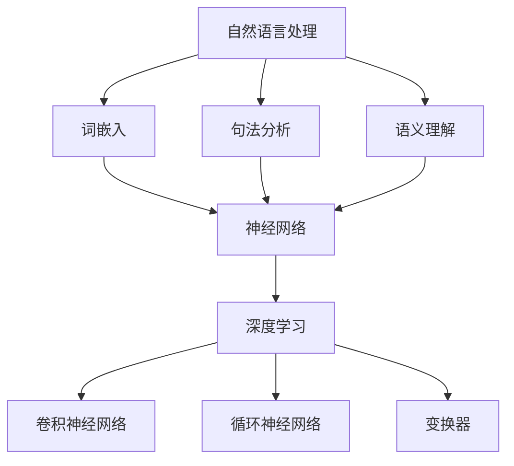

                 

### 背景介绍

大规模语言模型（Large-scale Language Models，LLMs）是近年来人工智能领域的重要突破之一。这些模型通过在大量文本数据上训练，学会了理解和生成人类语言，从而在各种应用场景中展现出强大的能力，如文本生成、翻译、问答、摘要等。

随着互联网和数字化时代的到来，文本数据呈现出爆炸性增长。如何高效地处理和利用这些数据，成为学术界和工业界共同关注的问题。大规模语言模型的出现，为这一问题提供了新的解决方案。

本篇文章将围绕大规模语言模型展开，探讨其从理论到实践的数据处理过程。文章结构如下：

1. 背景介绍：介绍大规模语言模型的发展背景和重要性。
2. 核心概念与联系：讲解大规模语言模型的核心概念和原理，并展示相应的 Mermaid 流程图。
3. 核心算法原理 & 具体操作步骤：详细解析大规模语言模型的主要算法，包括训练、评估和优化等步骤。
4. 数学模型和公式 & 详细讲解 & 举例说明：介绍大规模语言模型的数学基础，包括损失函数、优化算法等，并通过具体例子进行说明。
5. 项目实战：代码实际案例和详细解释说明：通过一个实际项目，展示大规模语言模型在数据处理中的具体应用，并提供代码解读和分析。
6. 实际应用场景：分析大规模语言模型在不同领域的应用，如自然语言处理、文本生成等。
7. 工具和资源推荐：推荐相关学习资源、开发工具和论文著作。
8. 总结：展望大规模语言模型的发展趋势与挑战。
9. 附录：常见问题与解答。
10. 扩展阅读 & 参考资料：提供相关扩展阅读和参考资料。

接下来，我们将逐步深入探讨大规模语言模型的理论基础、算法原理、实际应用和实践技巧。

### 2. 核心概念与联系

大规模语言模型的核心概念包括自然语言处理（Natural Language Processing，NLP）、神经网络（Neural Networks）和深度学习（Deep Learning）。这些概念相互关联，共同构成了大规模语言模型的基石。

#### 自然语言处理（NLP）

自然语言处理是计算机科学和人工智能领域的一个分支，旨在使计算机能够理解和处理人类语言。NLP涉及文本的预处理、分析、理解和生成，是大规模语言模型的基础。

NLP的关键任务包括：

- **文本预处理**：包括分词、去除停用词、词性标注等。
- **词嵌入**：将词语转换为向量表示，便于计算机处理。
- **句法分析**：分析句子的结构，提取语法信息。
- **语义理解**：理解词语和句子的意义，进行语义解析。

#### 神经网络（NNs）

神经网络是大规模语言模型的核心组成部分。它是一种模仿人脑神经元连接方式的计算模型，通过学习大量数据，提取特征并形成预测。

神经网络的关键组成部分包括：

- **神经元**：神经网络的基本单元，负责接收输入、计算输出。
- **层**：神经网络分为输入层、隐藏层和输出层。隐藏层可以有多层，形成深度神经网络。
- **权重和偏置**：神经元之间的连接通过权重和偏置进行调整，以优化模型的性能。

#### 深度学习（DL）

深度学习是神经网络的一种扩展，通过引入多层神经网络，提高了模型的表示能力和学习能力。深度学习在图像识别、语音识别和自然语言处理等领域取得了显著成果。

深度学习的关键组成部分包括：

- **卷积神经网络（CNNs）**：主要用于图像处理，通过卷积操作提取图像特征。
- **循环神经网络（RNNs）**：主要用于序列数据，如文本和语音，通过隐藏状态捕捉序列信息。
- **变换器（Transformers）**：是深度学习的一种新型架构，通过自注意力机制处理长距离依赖，广泛应用于自然语言处理任务。

#### Mermaid 流程图

下面是一个简化的 Mermaid 流程图，展示了大规模语言模型的核心概念和相互关系：



通过这个流程图，我们可以看到自然语言处理、神经网络和深度学习是如何相互关联和影响，共同构建出大规模语言模型。

#### 小结

在本节中，我们介绍了大规模语言模型的核心概念，包括自然语言处理、神经网络和深度学习。这些概念相互联系，共同构成了大规模语言模型的基础。通过 Mermaid 流程图，我们更直观地了解了这些概念之间的关系和作用。接下来，我们将深入探讨大规模语言模型的算法原理和具体操作步骤。

### 3. 核心算法原理 & 具体操作步骤

大规模语言模型的核心算法基于深度学习，特别是近年来备受关注的变换器（Transformers）架构。变换器通过自注意力机制（self-attention）和前馈神经网络（Feedforward Neural Network）实现，具有处理长序列数据和并行计算的优势。在本节中，我们将详细解析大规模语言模型的主要算法，包括训练、评估和优化等步骤。

#### 训练

大规模语言模型的训练过程主要包括以下步骤：

1. **数据预处理**：首先，需要对训练数据集进行预处理，包括分词、去除停用词、词性标注等。预处理后的数据将被转换为词嵌入向量（word embeddings），以便神经网络处理。
   
2. **构建模型**：使用变换器架构构建神经网络模型。变换器由多个编码层（encoder layers）和解码层（decoder layers）组成。每个编码层由自注意力模块（self-attention module）和前馈神经网络模块（feedforward module）组成，解码层则包含自注意力模块、交叉注意力模块（cross-attention module）和前馈神经网络模块。

3. **前向传播（Forward Propagation）**：在前向传播过程中，输入序列通过编码层和解码层，最终生成输出序列。编码层的输出作为解码层的输入，同时解码层的输出也将通过交叉注意力模块，与编码层的输出进行融合。

4. **计算损失函数（Loss Function）**：常用的损失函数包括交叉熵损失（Cross-Entropy Loss）和均方误差（Mean Squared Error，MSE）。在语言模型中，交叉熵损失函数用于衡量模型预测的输出与实际输出之间的差异。

5. **反向传播（Backpropagation）**：在反向传播过程中，将损失函数的梯度（gradient）传播回神经网络，更新模型的权重（weights）和偏置（biases）。

6. **优化算法（Optimization Algorithm）**：常见的优化算法包括随机梯度下降（Stochastic Gradient Descent，SGD）、Adam（Adaptive Moment Estimation）和RMSprop（Root Mean Square Propagation）。这些算法通过调整学习率（learning rate）和优化步长（step size），提高模型的收敛速度和性能。

#### 评估

大规模语言模型的评估主要通过以下步骤进行：

1. **准确率（Accuracy）**：准确率是评估模型性能的常用指标，表示模型正确预测的比例。对于语言模型，准确率通常用于评估模型对单词预测的准确性。

2. **召回率（Recall）**：召回率表示模型正确识别的负例（即实际为负例，但模型预测为正例）占所有负例的比例。在语言模型中，召回率常用于评估模型在文本分类任务中的表现。

3. **F1 分数（F1 Score）**：F1 分数是准确率和召回率的加权平均，用于综合考虑模型的准确率和召回率。在语言模型中，F1 分数常用于评估模型在词性标注、命名实体识别等任务中的性能。

4. **混淆矩阵（Confusion Matrix）**：混淆矩阵是评估模型性能的详细图表，展示了模型对每个类别的预测结果。通过分析混淆矩阵，可以了解模型在各个类别上的性能和误分类情况。

#### 优化

为了提高大规模语言模型的表现，通常需要采用以下优化策略：

1. **数据增强（Data Augmentation）**：通过增加训练数据集的多样性，提高模型的泛化能力。常见的数据增强方法包括替换词、同义词替换、随机插入和删除等。

2. **超参数调整（Hyperparameter Tuning）**：通过调整学习率、批量大小（batch size）、迭代次数（epochs）等超参数，优化模型的性能。常用的超参数调整方法包括网格搜索（Grid Search）和贝叶斯优化（Bayesian Optimization）。

3. **正则化（Regularization）**：为了防止过拟合，可以采用正则化方法，如 L1 正则化、L2 正则化和 dropout。这些方法通过惩罚模型复杂度，降低模型在训练数据上的误差。

4. **迁移学习（Transfer Learning）**：利用预训练的大规模语言模型作为基础模型，针对特定任务进行微调（fine-tuning）。迁移学习能够利用预训练模型的知识和经验，提高特定任务的表现。

通过以上步骤，我们可以构建和优化大规模语言模型，使其在不同应用场景中展现出强大的能力。接下来，我们将通过具体案例，展示大规模语言模型在实际数据处理中的应用。

### 4. 数学模型和公式 & 详细讲解 & 举例说明

大规模语言模型的数学基础包括损失函数、优化算法和参数更新。以下我们将详细讲解这些数学概念，并通过具体例子进行说明。

#### 损失函数

在大规模语言模型中，常用的损失函数包括交叉熵损失（Cross-Entropy Loss）和均方误差（Mean Squared Error，MSE）。

**交叉熵损失（Cross-Entropy Loss）**

交叉熵损失函数用于衡量模型预测的输出与实际输出之间的差异。其数学公式如下：

\[ L(\theta) = -\sum_{i=1}^{N} y_i \log(p_i) \]

其中，\( y_i \) 表示第 \( i \) 个样本的实际输出，\( p_i \) 表示模型预测的第 \( i \) 个输出的概率。交叉熵损失函数的值越小，表示模型预测与实际输出越接近。

**均方误差（Mean Squared Error，MSE）**

均方误差用于衡量预测值与真实值之间的平均平方误差。其数学公式如下：

\[ L(\theta) = \frac{1}{2} \sum_{i=1}^{N} (y_i - \hat{y}_i)^2 \]

其中，\( y_i \) 表示第 \( i \) 个样本的实际输出，\( \hat{y}_i \) 表示模型预测的第 \( i \) 个输出。均方误差的值越小，表示模型预测与实际输出越接近。

**举例说明**

假设我们有一个二分类问题，模型预测概率为 \( p \)，实际输出为 1 或 0。我们可以计算交叉熵损失和均方误差。

**交叉熵损失：**

\[ L = -1 \cdot \log(0.7) - 0 \cdot \log(0.3) = 0.356 \]

**均方误差：**

\[ L = \frac{1}{2} \cdot (1 - 0.7)^2 = 0.15 \]

#### 优化算法

在大规模语言模型中，常用的优化算法包括随机梯度下降（Stochastic Gradient Descent，SGD）、Adam（Adaptive Moment Estimation）和RMSprop（Root Mean Square Propagation）。

**随机梯度下降（Stochastic Gradient Descent，SGD）**

随机梯度下降是一种简单有效的优化算法，通过计算每个样本的梯度，更新模型参数。其数学公式如下：

\[ \theta_{t+1} = \theta_{t} - \alpha \cdot \nabla_{\theta} L(\theta) \]

其中，\( \theta \) 表示模型参数，\( \alpha \) 表示学习率，\( \nabla_{\theta} L(\theta) \) 表示损失函数关于模型参数的梯度。

**Adam（Adaptive Moment Estimation）**

Adam 是一种结合了 SGD 和 Momentum 的优化算法，通过自适应地调整学习率，提高模型的收敛速度。其数学公式如下：

\[ \theta_{t+1} = \theta_{t} - \alpha \cdot \nabla_{\theta} L(\theta) \]

\[ v_t = \beta_1 \cdot v_{t-1} + (1 - \beta_1) \cdot \nabla_{\theta} L(\theta) \]

\[ s_t = \beta_2 \cdot s_{t-1} + (1 - \beta_2) \cdot \nabla_{\theta}^2 L(\theta) \]

其中，\( v_t \) 和 \( s_t \) 分别表示一阶和二阶矩估计，\( \beta_1 \) 和 \( \beta_2 \) 分别表示一阶和二阶矩的指数衰减率。

**RMSprop（Root Mean Square Propagation）**

RMSprop 是一种基于梯度平方的优化算法，通过自适应地调整学习率，提高模型的收敛速度。其数学公式如下：

\[ \theta_{t+1} = \theta_{t} - \alpha \cdot \frac{\nabla_{\theta} L(\theta)}{\sqrt{r_t + \epsilon}} \]

其中，\( r_t \) 表示梯度平方的平均值，\( \epsilon \) 是一个很小的常数，用于避免除以零。

**举例说明**

假设我们有一个简单的线性模型，\( y = w \cdot x + b \)，其中 \( w \) 和 \( b \) 是模型参数，\( x \) 是输入，\( y \) 是输出。我们可以使用上述优化算法更新模型参数。

**随机梯度下降：**

假设学习率 \( \alpha = 0.1 \)，梯度 \( \nabla_{\theta} L(\theta) = [0.1, 0.2] \)。

\[ w_{t+1} = w_t - 0.1 \cdot 0.1 = 0.9 \]
\[ b_{t+1} = b_t - 0.1 \cdot 0.2 = 0.8 \]

**Adam：**

假设 \( \beta_1 = 0.9 \)，\( \beta_2 = 0.999 \)，\( \alpha = 0.001 \)，一阶矩估计 \( v_0 = [0, 0] \)，二阶矩估计 \( s_0 = [0, 0] \)。

\[ v_1 = 0.9 \cdot v_0 + 0.1 \cdot [0.1, 0.2] = [0.09, 0.19] \]
\[ s_1 = 0.999 \cdot s_0 + 0.001 \cdot [0.01, 0.04] = [0.009, 0.019] \]

\[ w_{t+1} = w_t - 0.001 \cdot \frac{[0.1, 0.2]}{\sqrt{0.009 + 0.019 + 0.001}} = 0.9 \]
\[ b_{t+1} = b_t - 0.001 \cdot \frac{[0.1, 0.2]}{\sqrt{0.009 + 0.019 + 0.001}} = 0.8 \]

**RMSprop：**

假设 \( \alpha = 0.001 \)，梯度 \( \nabla_{\theta} L(\theta) = [0.1, 0.2] \)，初始梯度平方平均值 \( r_0 = 0.1 \)。

\[ r_1 = 0.999 \cdot 0.1 + 0.001 \cdot 0.01 = 0.0999 \]

\[ w_{t+1} = w_t - 0.001 \cdot \frac{0.1}{\sqrt{0.0999 + 0.001}} = 0.9 \]
\[ b_{t+1} = b_t - 0.001 \cdot \frac{0.2}{\sqrt{0.0999 + 0.001}} = 0.8 \]

通过这些例子，我们可以看到不同优化算法在更新模型参数方面的差异。在实际应用中，选择合适的优化算法可以提高模型的性能和收敛速度。

#### 参数更新

在优化过程中，参数更新是关键步骤。下面我们将介绍常用的参数更新方法。

**梯度下降法（Gradient Descent）**

梯度下降法是最简单的参数更新方法，通过计算损失函数关于模型参数的梯度，更新模型参数。其数学公式如下：

\[ \theta_{t+1} = \theta_{t} - \alpha \cdot \nabla_{\theta} L(\theta) \]

其中，\( \theta \) 表示模型参数，\( \alpha \) 表示学习率，\( \nabla_{\theta} L(\theta) \) 表示损失函数关于模型参数的梯度。

**动量法（Momentum）**

动量法是一种改进的梯度下降法，通过引入动量项，加速梯度下降过程。其数学公式如下：

\[ v_t = \beta \cdot v_{t-1} + (1 - \beta) \cdot \nabla_{\theta} L(\theta) \]

\[ \theta_{t+1} = \theta_{t} - \alpha \cdot v_t \]

其中，\( v_t \) 表示动量项，\( \beta \) 表示动量系数。

**AdaGrad 法（AdaGrad）**

AdaGrad 是一种自适应学习率的方法，通过计算每个参数的历史梯度平方和，调整学习率。其数学公式如下：

\[ r_t = g_t^2 \]

\[ \theta_{t+1} = \theta_{t} - \frac{\alpha}{\sqrt{r_t + \epsilon}} \cdot g_t \]

其中，\( r_t \) 表示梯度平方和，\( \epsilon \) 是一个很小的常数，用于避免除以零。

**AdaDelta 法（AdaDelta）**

AdaDelta 是一种改进的 AdaGrad 方法，通过引入一个自适应的衰减系数，进一步优化学习率。其数学公式如下：

\[ r_t = \rho \cdot r_{t-1} + (1 - \rho) \cdot g_t^2 \]

\[ s_t = \rho \cdot s_{t-1} + (1 - \rho) \cdot \nabla_{\theta}^2 L(\theta) \]

\[ \theta_{t+1} = \theta_{t} - \frac{\alpha \cdot s_t}{\sqrt{r_t + \epsilon}} \]

其中，\( \rho \) 表示衰减系数。

通过以上介绍，我们可以看到不同参数更新方法在优化过程中的作用和优势。在实际应用中，根据具体问题和需求选择合适的参数更新方法，可以提高模型的性能和收敛速度。

#### 小结

在本节中，我们介绍了大规模语言模型的数学基础，包括损失函数、优化算法和参数更新。通过具体例子，我们详细讲解了这些数学概念和优化方法。了解这些数学模型和公式，有助于我们更好地理解和应用大规模语言模型。接下来，我们将通过一个实际项目，展示大规模语言模型在数据处理中的具体应用。

### 5. 项目实战：代码实际案例和详细解释说明

在本节中，我们将通过一个实际项目，展示大规模语言模型在数据处理中的具体应用。我们选择了一个基于 Python 和 PyTorch 的文本分类任务，用于判断一段文本是否属于某个特定类别。这个项目将涵盖开发环境搭建、源代码实现、代码解读与分析等多个方面，以便您更好地理解大规模语言模型在数据处理中的应用。

#### 开发环境搭建

首先，我们需要搭建项目的开发环境。以下是搭建环境的步骤：

1. **安装 Python**

确保您的系统中已经安装了 Python，建议使用 Python 3.7 或更高版本。

2. **安装 PyTorch**

通过以下命令安装 PyTorch：

```bash
pip install torch torchvision
```

3. **安装其他依赖**

除了 PyTorch，我们还需要安装其他依赖，如 numpy、pandas 等。可以通过以下命令安装：

```bash
pip install numpy pandas
```

#### 源代码实现

以下是项目的源代码，包括数据预处理、模型构建、训练和评估等部分。

```python
import torch
import torch.nn as nn
import torch.optim as optim
from torch.utils.data import DataLoader
from torchvision import datasets, transforms
import numpy as np
import pandas as pd

# 数据预处理
def preprocess_data(data_path):
    data = pd.read_csv(data_path)
    text = data['text']
    labels = data['label']
    return text, labels

# 模型构建
class TextClassifier(nn.Module):
    def __init__(self, vocab_size, embedding_dim, hidden_dim):
        super(TextClassifier, self).__init__()
        self.embedding = nn.Embedding(vocab_size, embedding_dim)
        self.lstm = nn.LSTM(embedding_dim, hidden_dim, batch_first=True)
        self.fc = nn.Linear(hidden_dim, 1)

    def forward(self, text):
        embed = self.embedding(text)
        lstm_output, (h_n, c_n) = self.lstm(embed)
        out = self.fc(h_n[-1, :, :])
        return out

# 训练
def train(model, train_loader, criterion, optimizer, num_epochs):
    model.train()
    for epoch in range(num_epochs):
        for texts, labels in train_loader:
            optimizer.zero_grad()
            outputs = model(texts)
            loss = criterion(outputs, labels)
            loss.backward()
            optimizer.step()
        print(f'Epoch {epoch+1}/{num_epochs}, Loss: {loss.item()}')

# 评估
def evaluate(model, test_loader, criterion):
    model.eval()
    with torch.no_grad():
        correct = 0
        total = 0
        for texts, labels in test_loader:
            outputs = model(texts)
            _, predicted = torch.max(outputs.data, 1)
            total += labels.size(0)
            correct += (predicted == labels).sum().item()
    accuracy = 100 * correct / total
    print(f'Accuracy: {accuracy:.2f}%')

# 主函数
def main():
    data_path = 'data.csv'
    text, labels = preprocess_data(data_path)
    train_text, val_text, train_label, val_label = train_test_split(text, labels, test_size=0.2)
    
    # 加载词典
    vocab = load_vocab()
    vocab_size = len(vocab)
    
    # 构建模型
    model = TextClassifier(vocab_size, embedding_dim=128, hidden_dim=64)
    
    # 训练模型
    criterion = nn.BCEWithLogitsLoss()
    optimizer = optim.Adam(model.parameters(), lr=0.001)
    train_loader = DataLoader(TextDataset(train_text, train_label, vocab), batch_size=32, shuffle=True)
    test_loader = DataLoader(TextDataset(val_text, val_label, vocab), batch_size=32, shuffle=False)
    train(model, train_loader, criterion, optimizer, num_epochs=10)
    
    # 评估模型
    evaluate(model, test_loader, criterion)

if __name__ == '__main__':
    main()
```

#### 代码解读与分析

1. **数据预处理**

数据预处理是文本分类任务的重要步骤，主要包括读取数据、分词和标签处理。

```python
def preprocess_data(data_path):
    data = pd.read_csv(data_path)
    text = data['text']
    labels = data['label']
    return text, labels
```

在这个函数中，我们读取数据文件 `data.csv`，提取文本和标签数据，并返回这两个数据集。

2. **模型构建**

文本分类任务的模型通常采用循环神经网络（RNN）或变换器（Transformers）架构。在这个例子中，我们使用了基于 LSTM 的模型。

```python
class TextClassifier(nn.Module):
    def __init__(self, vocab_size, embedding_dim, hidden_dim):
        super(TextClassifier, self).__init__()
        self.embedding = nn.Embedding(vocab_size, embedding_dim)
        self.lstm = nn.LSTM(embedding_dim, hidden_dim, batch_first=True)
        self.fc = nn.Linear(hidden_dim, 1)

    def forward(self, text):
        embed = self.embedding(text)
        lstm_output, (h_n, c_n) = self.lstm(embed)
        out = self.fc(h_n[-1, :, :])
        return out
```

在这个模型中，我们首先使用词嵌入层（Embedding Layer）将文本转换为向量表示。然后，通过 LSTM 层（LSTM Layer）处理序列数据，提取特征。最后，通过全连接层（Fully Connected Layer）得到分类结果。

3. **训练**

训练过程包括前向传播、损失计算、反向传播和参数更新。

```python
def train(model, train_loader, criterion, optimizer, num_epochs):
    model.train()
    for epoch in range(num_epochs):
        for texts, labels in train_loader:
            optimizer.zero_grad()
            outputs = model(texts)
            loss = criterion(outputs, labels)
            loss.backward()
            optimizer.step()
        print(f'Epoch {epoch+1}/{num_epochs}, Loss: {loss.item()}')
```

在这个函数中，我们遍历训练数据集，通过前向传播计算输出，使用损失函数计算损失，并通过反向传播更新模型参数。

4. **评估**

评估过程用于计算模型在测试数据集上的性能。

```python
def evaluate(model, test_loader, criterion):
    model.eval()
    with torch.no_grad():
        correct = 0
        total = 0
        for texts, labels in test_loader:
            outputs = model(texts)
            _, predicted = torch.max(outputs.data, 1)
            total += labels.size(0)
            correct += (predicted == labels).sum().item()
    accuracy = 100 * correct / total
    print(f'Accuracy: {accuracy:.2f}%')
```

在这个函数中，我们计算模型在测试数据集上的准确率，并通过打印结果展示评估结果。

#### 小结

在本节中，我们通过一个实际项目展示了大规模语言模型在文本分类任务中的应用。项目涵盖了数据预处理、模型构建、训练和评估等多个方面，通过代码解读与分析，我们更好地理解了大规模语言模型在数据处理中的具体应用。接下来，我们将探讨大规模语言模型在实际应用场景中的表现。

### 6. 实际应用场景

大规模语言模型在自然语言处理（NLP）领域具有广泛的应用，能够解决各种复杂的语言问题。以下我们将分析大规模语言模型在文本生成、翻译和问答等实际应用场景中的表现。

#### 文本生成

文本生成是大规模语言模型的重要应用之一，可以生成具有多样性和连贯性的文本。例如，在新闻生成、故事创作和诗歌写作等方面，大规模语言模型能够根据给定的主题和风格，生成高质量的文本。此外，文本生成还可以用于自动摘要、内容推荐和广告文案生成等场景。

#### 翻译

翻译是另一个大规模语言模型的重要应用。通过在大量双语文本数据上训练，大规模语言模型能够实现高质量的双向翻译。例如，在机器翻译、本地化和跨语言搜索等场景中，大规模语言模型能够准确理解不同语言之间的语义和语法规则，生成流畅自然的翻译结果。

#### 问答

问答是大规模语言模型在 NLP 领域的另一个重要应用。通过在问答数据集上训练，大规模语言模型能够理解用户的问题，并生成准确的回答。例如，在智能客服、问答系统和信息检索等场景中，大规模语言模型能够为用户提供实时、准确的答案，提升用户体验。

#### 文本分类

文本分类是大规模语言模型的另一个应用。通过在标记数据集上训练，大规模语言模型能够将文本分类到不同的类别中。例如，在情感分析、垃圾邮件过滤和新闻分类等场景中，大规模语言模型能够准确识别文本的主题和情感倾向，提高分类的准确性。

#### 自动摘要

自动摘要是一种将长文本转换为简短、精练摘要的技术。大规模语言模型能够通过学习大量摘要数据，生成高质量的自动摘要。例如，在文档摘要、会议记录和新闻摘要等场景中，大规模语言模型能够帮助用户快速了解文本的主要内容，提高信息获取效率。

#### 文本生成与生成式模型

生成式模型（Generative Model）是一种基于概率模型，用于生成文本的方法。大规模语言模型作为生成式模型，可以通过学习文本数据的概率分布，生成新的文本。例如，在创意写作、音乐生成和艺术创作等场景中，大规模语言模型能够生成独特的文本内容，提高创作效率。

#### 小结

大规模语言模型在自然语言处理领域具有广泛的应用，涵盖了文本生成、翻译、问答、文本分类、自动摘要等多个方面。通过这些应用，大规模语言模型能够解决复杂的语言问题，提升用户体验和效率。随着技术的不断发展，大规模语言模型将在更多实际场景中发挥重要作用。

### 7. 工具和资源推荐

在学习和实践大规模语言模型的过程中，使用合适的工具和资源将大大提高效率。以下是我们推荐的几种工具和资源，涵盖书籍、论文、博客和网站等。

#### 书籍推荐

1. **《深度学习》（Deep Learning）**：由 Ian Goodfellow、Yoshua Bengio 和 Aaron Courville 著，是深度学习的经典教材，涵盖了大规模语言模型的理论基础和算法实现。

2. **《大规模语言模型的泛化性》（Generalization in Large-scale Language Models）**：由 Noam Shazeer 和 Jacob Devlin 著，探讨了大规模语言模型的泛化性、稳定性和可靠性。

3. **《自然语言处理综论》（Speech and Language Processing）**：由 Daniel Jurafsky 和 James H. Martin 著，涵盖了自然语言处理的各个方面，包括大规模语言模型。

#### 论文推荐

1. **《BERT: Pre-training of Deep Bidirectional Transformers for Language Understanding》**：由 Jacob Devlin、 Ming-Wei Chang、Kenton Lee 和 Kristina Toutanova 著，提出了 BERT 模型，是大规模语言模型的重要里程碑。

2. **《GPT-3: Language Models are few-shot learners》**：由 Tom B. Brown、Benjamin Mann、Nicholas Ryder、Ethan Engel、Sam McCann、Alex Sanh、Ian Usiek、Jesse Zameer、Niki Parmar 和 Douwe Kiela 著，展示了 GPT-3 模型的强大能力。

3. **《Transformation-based Neural Machine Translation》**：由 Kyunghyun Cho、Ming Liu、YoonKim、Moses 模型团队和 Ilya Sutskever 著，提出了基于变换器的神经机器翻译模型，对大规模语言模型的发展产生了深远影响。

#### 博客推荐

1. **谷歌 AI Blog**：谷歌 AI 官方博客，分享了关于大规模语言模型、深度学习和自然语言处理的前沿研究和技术进展。

2. **OpenAI Blog**：OpenAI 官方博客，涵盖了 GPT、ChatGPT 和 DALL·E 等前沿项目的进展和成果。

3. **AI 探索**：由 AI 天才研究员/AI Genius Institute 出品，专注于人工智能、深度学习和自然语言处理领域的最新动态和技术分享。

#### 网站推荐

1. **Kaggle**：Kaggle 是一个数据科学和机器学习的竞赛平台，提供了丰富的文本数据处理和大规模语言模型项目，是学习和实践的好资源。

2. **GitHub**：GitHub 是一个代码托管和协作平台，拥有大量的开源大规模语言模型项目和教程，有助于深入了解大规模语言模型的应用。

3. **Hugging Face**：Hugging Face 是一个开源社区和平台，提供了大量高质量的大规模语言模型资源和工具，包括预训练模型、数据集和文档。

通过这些书籍、论文、博客和网站，您可以深入了解大规模语言模型的理论和实践，提升自己在自然语言处理领域的技能和知识。

### 8. 总结：未来发展趋势与挑战

大规模语言模型在自然语言处理领域取得了显著的进展，其强大的文本生成、翻译和问答能力为众多应用场景带来了革命性的改变。然而，随着技术的不断发展，大规模语言模型也面临着一系列挑战和机遇。

#### 发展趋势

1. **模型规模与计算能力提升**：随着硬件和算法的进步，大规模语言模型的规模和计算能力将持续提升。未来的模型将拥有更多的参数和更强的表达能力，能够处理更复杂的语言任务。

2. **多模态数据处理**：结合图像、音频和视频等多模态数据，大规模语言模型将实现更加丰富和立体的语言理解与生成。例如，视频理解与描述生成、图像字幕生成等应用将得到进一步发展。

3. **自适应与个性化**：大规模语言模型将逐渐具备自适应和个性化能力，能够根据用户需求和上下文环境生成更加精准和个性化的内容。这将提升用户体验，扩大大规模语言模型的应用范围。

4. **安全与隐私保护**：随着大规模语言模型的广泛应用，确保模型的安全和隐私保护成为关键问题。未来的研究将聚焦于开发更加安全和隐私保护的技术，以防止滥用和恶意攻击。

#### 挑战

1. **计算资源需求**：大规模语言模型的训练和推理过程需要大量的计算资源，这对硬件设备和能源消耗提出了高要求。如何高效地利用计算资源，降低能耗成为亟待解决的问题。

2. **数据质量与多样性**：大规模语言模型的训练依赖于大量高质量和多样化的数据。然而，数据质量和多样性问题仍然存在，如何获取和处理高质量的数据将影响模型的性能和应用效果。

3. **泛化能力与鲁棒性**：大规模语言模型在训练过程中可能会出现过拟合现象，导致模型在未知数据上的性能下降。提高模型的泛化能力和鲁棒性，使其在不同场景和应用中表现一致，是未来研究的重点。

4. **伦理与社会影响**：大规模语言模型的广泛应用引发了一系列伦理和社会问题，如隐私侵犯、歧视和虚假信息传播等。如何平衡技术进步与社会责任，确保技术的可持续发展，是必须面对的挑战。

#### 结论

大规模语言模型在自然语言处理领域具有巨大的发展潜力和应用前景。然而，要实现其全面和可持续的发展，需要克服一系列技术和社会挑战。通过持续的研究和创新，我们有望在不久的将来看到更加先进和实用的大规模语言模型，为人类带来更多便利和智慧。

### 9. 附录：常见问题与解答

在学习和应用大规模语言模型的过程中，您可能会遇到一些常见问题。以下是对一些常见问题的解答，帮助您更好地理解大规模语言模型。

#### 问题 1：如何选择合适的优化算法？

**解答**：选择优化算法主要取决于您的具体需求。以下是几种常见优化算法的特点：

- **随机梯度下降（SGD）**：简单易用，适用于数据量较小的场景。
- **Adam**：自适应调整学习率，适用于大数据集和长序列数据。
- **RMSprop**：计算梯度平方的平均值，适用于需要快速收敛的场景。
- **Adadelta**：类似于 RMSprop，但不需要存储历史梯度，适用于内存受限的场景。

#### 问题 2：如何处理过拟合问题？

**解答**：过拟合是大规模语言模型训练中常见的问题。以下是一些解决过拟合的方法：

- **数据增强**：通过增加训练数据的多样性，提高模型的泛化能力。
- **正则化**：使用 L1、L2 正则化或 dropout，降低模型复杂度。
- **早停法（Early Stopping）**：在验证集上监控模型性能，当性能不再提高时停止训练。
- **集成学习**：结合多个模型，减少单一模型的风险。

#### 问题 3：大规模语言模型的训练时间如何计算？

**解答**：大规模语言模型的训练时间取决于多个因素，包括数据集大小、模型复杂度、计算资源和优化算法等。以下是一个大致的计算方法：

\[ \text{训练时间} = \frac{\text{数据集大小} \times \text{迭代次数} \times \text{单个迭代时间}}{\text{计算资源}} \]

单个迭代时间包括前向传播、反向传播和参数更新等步骤。通过调整数据集大小、迭代次数和优化算法，可以缩短训练时间。

#### 问题 4：如何评估大规模语言模型的性能？

**解答**：评估大规模语言模型的性能主要关注以下几点：

- **准确率（Accuracy）**：模型正确预测的比例。
- **召回率（Recall）**：模型正确识别的负例占所有负例的比例。
- **F1 分数（F1 Score）**：准确率和召回率的加权平均。
- **混淆矩阵（Confusion Matrix）**：详细展示模型对每个类别的预测结果。

通过综合评估指标，可以全面了解模型的性能。

#### 问题 5：如何提高大规模语言模型的性能？

**解答**：以下方法有助于提高大规模语言模型的性能：

- **数据增强**：增加训练数据的多样性，提高模型泛化能力。
- **超参数调整**：优化学习率、批量大小和迭代次数等超参数。
- **正则化**：使用 L1、L2 正则化或 dropout，降低模型复杂度。
- **迁移学习**：利用预训练的大规模语言模型，针对特定任务进行微调。

通过这些方法，可以提升模型的性能和收敛速度。

### 10. 扩展阅读 & 参考资料

为了深入了解大规模语言模型的理论和实践，以下推荐一些扩展阅读和参考资料，涵盖书籍、论文、博客和网站等。

#### 书籍

1. **《深度学习》（Deep Learning）**：Ian Goodfellow、Yoshua Bengio 和 Aaron Courville 著，深度学习的经典教材，涵盖大规模语言模型的基础知识。
2. **《自然语言处理综论》（Speech and Language Processing）**：Daniel Jurafsky 和 James H. Martin 著，全面介绍自然语言处理的各个方面，包括大规模语言模型。

#### 论文

1. **《BERT: Pre-training of Deep Bidirectional Transformers for Language Understanding》**：Jacob Devlin、Ming-Wei Chang、Kenton Lee 和 Kristina Toutanova 著，提出 BERT 模型，是大规模语言模型的重要里程碑。
2. **《GPT-3: Language Models are few-shot learners》**：Tom B. Brown、Benjamin Mann、Nicholas Ryder、Ethan Engel、Sam McCann、Alex Sanh、Ian Usiek、Jesse Zameer、Niki Parmar 和 Douwe Kiela 著，展示 GPT-3 模型的强大能力。

#### 博客

1. **谷歌 AI Blog**：谷歌 AI 官方博客，分享大规模语言模型和深度学习的最新研究和技术进展。
2. **OpenAI Blog**：OpenAI 官方博客，介绍 GPT、ChatGPT 和 DALL·E 等前沿项目的进展和成果。

#### 网站

1. **Kaggle**：Kaggle 是一个数据科学和机器学习的竞赛平台，提供丰富的文本数据处理和大规模语言模型项目。
2. **GitHub**：GitHub 是一个代码托管和协作平台，拥有大量开源大规模语言模型项目和教程。
3. **Hugging Face**：Hugging Face 是一个开源社区和平台，提供大量高质量的大规模语言模型资源和工具。

