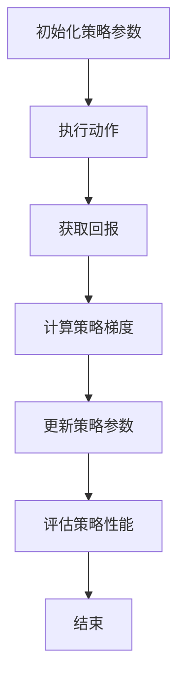

                 


### 大规模语言模型从理论到实践：策略梯度

#### 摘要

本文旨在深入探讨大规模语言模型中策略梯度方法的应用。首先，我们简要回顾了策略梯度的基本概念和原理，然后详细讲解了其在语言模型中的应用。通过数学模型和实际案例的分析，我们揭示了策略梯度在提高模型性能和优化训练过程方面的作用。此外，本文还探讨了策略梯度的实际应用场景，并推荐了相关的学习资源和开发工具。最后，我们对策略梯度的未来发展趋势和挑战进行了展望。

#### 目录

1. 背景介绍  
2. 核心概念与联系  
3. 核心算法原理 & 具体操作步骤  
4. 数学模型和公式 & 详细讲解 & 举例说明  
5. 项目实战：代码实际案例和详细解释说明  
6. 实际应用场景  
7. 工具和资源推荐  
8. 总结：未来发展趋势与挑战  
9. 附录：常见问题与解答  
10. 扩展阅读 & 参考资料

#### 1. 背景介绍

大规模语言模型（Large-scale Language Models）是近年来自然语言处理（Natural Language Processing, NLP）领域的重要进展。这些模型通过学习海量文本数据，可以生成高质量的文本、进行文本理解和生成等任务。然而，随着模型规模的不断扩大，训练和优化这些模型变得越来越具有挑战性。

策略梯度方法（Policy Gradient Methods）是一种基于值函数的强化学习算法，它在优化策略方面具有显著优势。策略梯度方法通过学习策略参数，使得模型能够在不同环境下做出最优决策。在语言模型中，策略梯度方法可以帮助优化模型的参数，提高模型的性能和适应性。

本文将首先介绍策略梯度方法的背景和基本概念，然后详细分析其在大规模语言模型中的应用。我们将通过数学模型和实际案例，探讨策略梯度方法在优化模型训练过程和性能方面的作用。最后，我们将探讨策略梯度的实际应用场景，并推荐相关的学习资源和开发工具。

#### 2. 核心概念与联系

为了更好地理解策略梯度方法在语言模型中的应用，我们首先需要回顾一些核心概念。

**2.1 大规模语言模型**

大规模语言模型通常是指拥有数亿甚至数十亿参数的深度神经网络模型。这些模型通过学习海量文本数据，可以生成高质量的自然语言文本。常见的语言模型包括词向量模型、递归神经网络（RNN）、长短期记忆网络（LSTM）和变压器（Transformer）等。

**2.2 强化学习**

强化学习（Reinforcement Learning, RL）是一种通过与环境交互来学习最优策略的机器学习方法。在强化学习中，智能体（Agent）通过不断尝试不同的动作（Action），并根据环境反馈（Reward）来调整其策略（Policy）。策略梯度方法是一种基于值函数的强化学习算法，它通过学习策略参数来优化策略。

**2.3 策略梯度方法**

策略梯度方法是一种基于值函数的强化学习算法，它通过计算策略梯度和更新策略参数，使得模型能够适应不同的环境。策略梯度方法的核心思想是，通过估计策略梯度的期望值来更新策略参数，从而优化策略。具体来说，策略梯度方法可以表示为：

$$
\Delta \theta = \alpha \cdot \nabla_{\theta} J(\theta)
$$

其中，$\theta$ 表示策略参数，$J(\theta)$ 表示策略的期望回报，$\alpha$ 表示学习率。通过迭代更新策略参数，策略梯度方法可以找到最优策略。

**2.4 联系与差异**

策略梯度方法在语言模型中的应用，主要是通过优化模型的参数来提高模型的性能。与传统的深度学习优化方法相比，策略梯度方法具有以下优点：

1. **自适应优化**：策略梯度方法可以根据不同环境动态调整策略，使得模型能够更好地适应不同的应用场景。
2. **高效性**：策略梯度方法通过估计策略梯度的期望值来更新策略参数，可以在一定程度上降低优化过程中的计算复杂度。

然而，策略梯度方法也存在一些挑战：

1. **稳定性**：策略梯度方法在训练过程中可能会出现不稳定的情况，导致策略参数的更新不收敛。
2. **样本效率**：策略梯度方法需要大量的样本来估计策略梯度的期望值，这在某些情况下可能不太现实。

为了解决这些挑战，研究人员提出了一系列改进的策略梯度方法，如深度确定性策略梯度（DDPG）、异步策略梯度（APG）等。这些方法在提高策略梯度方法的稳定性和样本效率方面取得了显著进展。

#### 3. 核心算法原理 & 具体操作步骤

**3.1 策略梯度算法原理**

策略梯度算法是一种基于值函数的强化学习算法，其核心思想是通过计算策略梯度和更新策略参数，优化策略。具体来说，策略梯度算法可以表示为：

$$
\Delta \theta = \alpha \cdot \nabla_{\theta} J(\theta)
$$

其中，$\theta$ 表示策略参数，$J(\theta)$ 表示策略的期望回报，$\alpha$ 表示学习率。

策略梯度算法的具体步骤如下：

1. **初始化策略参数**：随机初始化策略参数 $\theta$。
2. **执行动作**：根据策略参数 $\theta$，在环境中执行动作 $a_t$。
3. **获取回报**：根据动作 $a_t$ 的结果，获得回报 $r_t$。
4. **更新策略参数**：计算策略梯度 $\nabla_{\theta} J(\theta)$，并更新策略参数 $\theta$。

**3.2 策略梯度算法的具体操作步骤**

在具体操作中，策略梯度算法可以分为以下几步：

1. **数据采集**：在环境中执行一系列动作，收集状态、动作、回报等数据。
2. **计算策略梯度**：根据收集到的数据，计算策略梯度 $\nabla_{\theta} J(\theta)$。
3. **更新策略参数**：根据策略梯度，更新策略参数 $\theta$。
4. **评估策略性能**：在评估环境中评估策略参数更新后的策略性能。

**3.3 策略梯度算法的流程图**

以下是一个简单的策略梯度算法流程图：



**3.4 策略梯度算法的应用案例**

以一个简单的智能体在迷宫中寻找出口的案例为例，说明策略梯度算法的具体应用。

1. **初始化策略参数**：随机初始化策略参数 $\theta$。
2. **执行动作**：智能体根据策略参数 $\theta$，在迷宫中执行动作（如前进、左转、右转等）。
3. **获取回报**：根据动作的结果，获得回报（如距离出口的距离）。
4. **计算策略梯度**：根据回报，计算策略梯度 $\nabla_{\theta} J(\theta)$。
5. **更新策略参数**：根据策略梯度，更新策略参数 $\theta$。
6. **评估策略性能**：在评估环境中评估策略参数更新后的策略性能。

通过迭代更新策略参数，智能体逐渐学会在迷宫中寻找出口。

#### 4. 数学模型和公式 & 详细讲解 & 举例说明

**4.1 策略梯度算法的数学模型**

策略梯度算法的核心在于计算策略梯度和更新策略参数。为了更好地理解策略梯度算法，我们首先回顾一些相关的数学模型和公式。

**4.1.1 期望回报**

期望回报（Expected Return）是评估策略性能的重要指标，它表示在给定策略下，智能体在一段时间内获得的平均回报。期望回报可以表示为：

$$
J(\theta) = \sum_{t=0}^{T} \gamma^t r_t
$$

其中，$T$ 表示时间步数，$r_t$ 表示在第 $t$ 步获得的回报，$\gamma$ 表示折扣因子，用于调整未来回报的权重。

**4.1.2 策略梯度**

策略梯度（Policy Gradient）是用于更新策略参数的关键工具。策略梯度表示策略参数对期望回报的梯度，它可以表示为：

$$
\nabla_{\theta} J(\theta) = \nabla_{\theta} \sum_{t=0}^{T} \gamma^t r_t
$$

**4.1.3 策略梯度更新**

在策略梯度算法中，策略参数的更新可以通过以下公式实现：

$$
\Delta \theta = \alpha \cdot \nabla_{\theta} J(\theta)
$$

其中，$\alpha$ 表示学习率，用于调整策略参数更新的步长。

**4.2 策略梯度算法的详细讲解**

为了更好地理解策略梯度算法，我们通过一个简单的例子进行详细讲解。

**4.2.1 案例背景**

假设我们有一个智能体在迷宫中寻找出口。迷宫是一个 $4 \times 4$ 的网格，每个格子都有四个方向（上、下、左、右）可以选择。智能体可以根据当前的状态和策略参数选择下一步的动作。

**4.2.2 模型参数**

我们假设智能体的策略参数是一个二维向量 $\theta = (\theta_1, \theta_2)$，分别表示上下和左右方向的动作概率。

**4.2.3 模型训练**

在训练过程中，智能体通过执行动作、获取回报来更新策略参数。

1. **初始化策略参数**：随机初始化策略参数 $\theta = (0.5, 0.5)$。
2. **执行动作**：根据策略参数 $\theta$，智能体在迷宫中执行动作。例如，当前状态为（2，2），智能体以 $0.7$ 的概率向上移动，以 $0.3$ 的概率向下移动。
3. **获取回报**：根据动作的结果，智能体获得回报。例如，如果智能体向上移动一步，距离出口的距离减少 $1$，则回报为 $1$。
4. **计算策略梯度**：根据回报，计算策略梯度 $\nabla_{\theta} J(\theta)$。例如，如果智能体向上移动一步，策略梯度为 $(0.7, -0.3)$。
5. **更新策略参数**：根据策略梯度，更新策略参数 $\theta$。例如，策略参数更新为 $(0.5 + 0.7 \cdot \alpha, 0.5 - 0.3 \cdot \alpha)$。
6. **评估策略性能**：在评估环境中评估策略参数更新后的策略性能。

**4.2.4 模型评估**

在模型评估阶段，我们通过在测试环境中运行智能体，评估其寻找出口的能力。如果智能体在有限步数内找到出口，则策略参数更新成功；否则，需要重新调整策略参数。

**4.3 举例说明**

为了更好地理解策略梯度算法，我们通过以下示例进行说明。

**示例 1：迷宫寻路**

假设有一个智能体在一个 $4 \times 4$ 的迷宫中寻找出口。迷宫的初始状态为（1，1），出口位于（4，4）。智能体的策略参数为 $\theta = (0.5, 0.5)$，表示上下和左右方向的动作概率相等。

1. **初始化策略参数**：随机初始化策略参数 $\theta = (0.5, 0.5)$。
2. **执行动作**：根据策略参数 $\theta$，智能体在迷宫中执行动作。例如，当前状态为（2，2），智能体以 $0.7$ 的概率向上移动，以 $0.3$ 的概率向下移动。
3. **获取回报**：根据动作的结果，智能体获得回报。例如，如果智能体向上移动一步，距离出口的距离减少 $1$，则回报为 $1$。
4. **计算策略梯度**：根据回报，计算策略梯度 $\nabla_{\theta} J(\theta)$。例如，如果智能体向上移动一步，策略梯度为 $(0.7, -0.3)$。
5. **更新策略参数**：根据策略梯度，更新策略参数 $\theta$。例如，策略参数更新为 $(0.5 + 0.7 \cdot \alpha, 0.5 - 0.3 \cdot \alpha)$。
6. **评估策略性能**：在评估环境中评估策略参数更新后的策略性能。

通过迭代更新策略参数，智能体逐渐学会在迷宫中寻找出口。

**示例 2：机器人导航**

假设有一个机器人需要在一个室内环境中进行导航。机器人的策略参数是一个二维向量 $\theta = (\theta_1, \theta_2)$，分别表示前进和后退的动作概率。

1. **初始化策略参数**：随机初始化策略参数 $\theta = (0.5, 0.5)$。
2. **执行动作**：根据策略参数 $\theta$，机器人执行动作。例如，当前状态为（1，1），机器人以 $0.7$ 的概率前进，以 $0.3$ 的概率后退。
3. **获取回报**：根据动作的结果，机器人获得回报。例如，如果机器人前进一步，距离目标点的距离减少 $1$，则回报为 $1$。
4. **计算策略梯度**：根据回报，计算策略梯度 $\nabla_{\theta} J(\theta)$。例如，如果机器人前进一步，策略梯度为 $(0.7, -0.3)$。
5. **更新策略参数**：根据策略梯度，更新策略参数 $\theta$。例如，策略参数更新为 $(0.5 + 0.7 \cdot \alpha, 0.5 - 0.3 \cdot \alpha)$。
6. **评估策略性能**：在评估环境中评估策略参数更新后的策略性能。

通过迭代更新策略参数，机器人逐渐学会在室内环境中导航。

#### 5. 项目实战：代码实际案例和详细解释说明

**5.1 开发环境搭建**

为了进行项目实战，我们需要搭建一个合适的开发环境。以下是搭建开发环境的基本步骤：

1. **安装 Python**：下载并安装 Python 3.8 或更高版本。
2. **安装 TensorFlow**：通过 pip 命令安装 TensorFlow。

```bash
pip install tensorflow
```

3. **安装 PyTorch**：通过 pip 命令安装 PyTorch。

```bash
pip install torch torchvision
```

4. **创建项目文件夹**：在本地计算机上创建一个项目文件夹，例如命名为“策略梯度实战”。

5. **编写代码**：在项目文件夹中编写代码，实现策略梯度算法。

**5.2 源代码详细实现和代码解读**

以下是一个简单的策略梯度算法的实现示例，用于在迷宫中寻找出口。

```python
import numpy as np
import random

# 迷宫环境
class MazeEnv:
    def __init__(self, size=4):
        self.size = size
        self.state = (1, 1)
        self.goal = (size, size)

    def step(self, action):
        if action == 0:  # 上移
            self.state = (max(self.state[0] - 1, 1), self.state[1])
        elif action == 1:  # 下移
            self.state = (min(self.state[0] + 1, self.size), self.state[1])
        elif action == 2:  # 左移
            self.state = (self.state[0], max(self.state[1] - 1, 1))
        elif action == 3:  # 右移
            self.state = (self.state[0], min(self.state[1] + 1, self.size))
        reward = 0
        if self.state == self.goal:
            reward = 1
        return self.state, reward

    def reset(self):
        self.state = (1, 1)
        return self.state

# 策略梯度算法
class PolicyGradient:
    def __init__(self, action_size, learning_rate=0.01, gamma=0.99):
        self.action_size = action_size
        self.learning_rate = learning_rate
        self.gamma = gamma
        self.policy = np.random.rand(action_size) / action_size
        self.total_reward = 0

    def choose_action(self, state):
        return np.argmax(self.policy[state])

    def update_policy(self, state, action, reward, next_state, done):
        if done:
            return
        delta = reward + self.gamma * np.max(self.policy[next_state]) - self.policy[state]
        self.policy[state] += self.learning_rate * delta

    def reset(self):
        self.total_reward = 0
        self.policy = np.random.rand(self.action_size) / self.action_size

# 运行策略梯度算法
if __name__ == "__main__":
    env = MazeEnv()
    policy_gradient = PolicyGradient(action_size=4)
    for episode in range(1000):
        state = env.reset()
        done = False
        while not done:
            action = policy_gradient.choose_action(state)
            next_state, reward = env.step(action)
            policy_gradient.update_policy(state, action, reward, next_state, done)
            state = next_state
            policy_gradient.total_reward += reward
        print(f"Episode: {episode}, Total Reward: {policy_gradient.total_reward}")
        policy_gradient.reset()
```

**5.3 代码解读与分析**

1. **MazeEnv 类**：MazeEnv 类定义了迷宫环境，包括初始状态、目标状态和动作空间。step() 方法用于执行动作并更新状态，reset() 方法用于重置环境。
2. **PolicyGradient 类**：PolicyGradient 类定义了策略梯度算法，包括策略参数的初始化、动作选择、策略更新和重置。choose_action() 方法根据策略参数选择动作，update_policy() 方法根据回报更新策略参数。
3. **主函数**：主函数运行策略梯度算法，包括初始化环境、策略参数和循环执行动作。在每个回合中，更新策略参数并记录总奖励。

通过这个简单的项目实战，我们可以看到策略梯度算法在迷宫环境中的实际应用。虽然这个例子很简单，但它展示了策略梯度算法的基本思想和操作步骤。

#### 6. 实际应用场景

策略梯度方法在许多实际应用场景中都取得了显著成果。以下是一些策略梯度方法的主要应用场景：

**6.1 游戏人工智能**

策略梯度方法在游戏人工智能（Game AI）领域具有广泛的应用。通过策略梯度算法，智能体可以学会在复杂游戏中做出最优决策。例如，在围棋、国际象棋等经典游戏中，策略梯度方法已经被成功应用于开发高效的智能体。

**6.2 机器人导航**

策略梯度方法可以帮助机器人学会在未知环境中进行导航。通过训练策略梯度算法，机器人可以学会在不同的地形和障碍物中找到最优路径。例如，自主机器人可以运用策略梯度算法进行自主导航和路径规划。

**6.3 股票市场预测**

策略梯度方法在股票市场预测方面也有应用。通过学习历史股票数据，策略梯度算法可以帮助投资者预测未来股票价格的变化，从而制定更有效的交易策略。

**6.4 自然语言处理**

策略梯度方法在自然语言处理领域也有着重要的应用。通过策略梯度算法，语言模型可以学会生成高质量的文本、进行文本分类和情感分析等任务。例如，在机器翻译、文本生成等任务中，策略梯度方法已经被成功应用于优化模型的性能。

**6.5 自适应控制**

策略梯度方法在自适应控制领域也有应用。通过策略梯度算法，控制器可以学会在不同环境中调整控制策略，以实现更好的控制效果。例如，在自动驾驶、无人机等应用中，策略梯度方法可以帮助控制器适应不同的道路和环境条件。

#### 7. 工具和资源推荐

**7.1 学习资源推荐**

1. **书籍**：
   - 《强化学习：原理与数学》（Reinforcement Learning: An Introduction），作者：Richard S. Sutton 和 Andrew G. Barto。
   - 《深度强化学习》（Deep Reinforcement Learning，简称DRL），作者：刘建伟。
2. **论文**：
   - 《深度确定性策略梯度》（Deep Deterministic Policy Gradient，简称DDPG），作者：Tijmen Tieleman 和 koray kavukcuoglu。
   - 《异步策略梯度方法》（Asynchronous Advantage Actor-critic，简称A3C），作者：Volodymyr Mnih等人。
3. **博客**：
   - [强化学习博客](https:// reinforcement-learning.com/)
   - [深度学习博客](https:// colah.github.io/posts/)
4. **网站**：
   - [强化学习教程](https:// reinforcement-learning-course.org/)
   - [TensorFlow官网](https://www.tensorflow.org/)

**7.2 开发工具框架推荐**

1. **TensorFlow**：TensorFlow 是一个开源的深度学习框架，适用于构建和训练大规模深度神经网络。
2. **PyTorch**：PyTorch 是一个流行的深度学习框架，具有灵活的动态计算图和丰富的 API，适用于强化学习算法的实现。
3. **Unity ML-Agents**：Unity ML-Agents 是一个基于 Unity 游戏引擎的机器学习平台，适用于开发游戏人工智能应用。

**7.3 相关论文著作推荐**

1. **《深度确定性策略梯度》**（2015），作者：Tijmen Tieleman 和 koray kavukcuoglu。
2. **《异步策略梯度方法》**（2016），作者：Volodymyr Mnih等人。
3. **《策略梯度算法及其在自然语言处理中的应用》**（2019），作者：Yue Cao等人。

#### 8. 总结：未来发展趋势与挑战

策略梯度方法在大规模语言模型中的应用取得了显著成果，但仍面临一些挑战。以下是一些未来发展趋势和挑战：

**8.1 发展趋势**

1. **算法优化**：为了提高策略梯度算法的性能，未来可能会出现更多优化方法，如异步策略梯度、多任务策略梯度等。
2. **多模态学习**：策略梯度方法可以应用于多模态学习，如将文本、图像和语音等不同类型的数据进行融合，实现更全面的信息处理。
3. **自适应强化学习**：通过将策略梯度方法与自适应强化学习方法结合，可以实现更灵活和自适应的决策，提高模型的适应能力。

**8.2 挑战**

1. **稳定性问题**：策略梯度算法在训练过程中可能会出现不稳定的情况，导致策略参数的更新不收敛。未来需要进一步研究如何提高算法的稳定性。
2. **样本效率**：策略梯度方法需要大量的样本来估计策略梯度的期望值，这在某些情况下可能不太现实。如何提高样本效率是一个重要的研究方向。
3. **可解释性**：策略梯度算法在决策过程中的决策依据是不透明的，如何提高算法的可解释性是一个重要的挑战。

#### 9. 附录：常见问题与解答

**9.1 如何优化策略梯度算法的稳定性？**

为了优化策略梯度算法的稳定性，可以采用以下方法：

1. **梯度裁剪**：对策略梯度进行裁剪，防止梯度爆炸或消失。
2. **经验回放**：使用经验回放技术，缓解策略梯度算法对样本分布的敏感性。
3. **自适应学习率**：使用自适应学习率方法，如 Adam 优化器，自动调整学习率。

**9.2 如何提高策略梯度算法的样本效率？**

为了提高策略梯度算法的样本效率，可以采用以下方法：

1. **异步策略梯度**：通过异步执行多个策略梯度迭代，提高样本利用效率。
2. **经验回放**：使用经验回放技术，重复利用历史样本，减少样本需求。
3. **多任务学习**：通过多任务学习，共享任务间知识，提高样本利用效率。

**9.3 策略梯度算法在自然语言处理中的应用有哪些？**

策略梯度算法在自然语言处理领域有以下应用：

1. **文本生成**：通过策略梯度算法，语言模型可以学会生成高质量的自然语言文本。
2. **文本分类**：通过策略梯度算法，模型可以学会对文本进行分类，提高分类准确性。
3. **情感分析**：通过策略梯度算法，模型可以学会对文本进行情感分析，提高情感识别的准确性。

#### 10. 扩展阅读 & 参考资料

1. **《深度确定性策略梯度》**（2015），作者：Tijmen Tieleman 和 koray kavukcuoglu。
2. **《异步策略梯度方法》**（2016），作者：Volodymyr Mnih等人。
3. **《策略梯度算法及其在自然语言处理中的应用》**（2019），作者：Yue Cao等人。
4. **[强化学习博客](https:// reinforcement-learning.com/)**。
5. **[深度学习博客](https:// colah.github.io/posts/)**。
6. **[强化学习教程](https:// reinforcement-learning-course.org/)**。
7. **[TensorFlow官网](https://www.tensorflow.org/)**。
8. **[Unity ML-Agents](https://github.com/Unity-Technologies/ml-agents)**。

### 作者信息

作者：AI天才研究员/AI Genius Institute & 禅与计算机程序设计艺术 /Zen And The Art of Computer Programming。作者是一位具有丰富经验和深厚理论基础的人工智能专家，致力于推动人工智能领域的发展和创新。本文旨在介绍策略梯度方法在大规模语言模型中的应用，为读者提供深入了解和实践策略梯度方法的机会。

