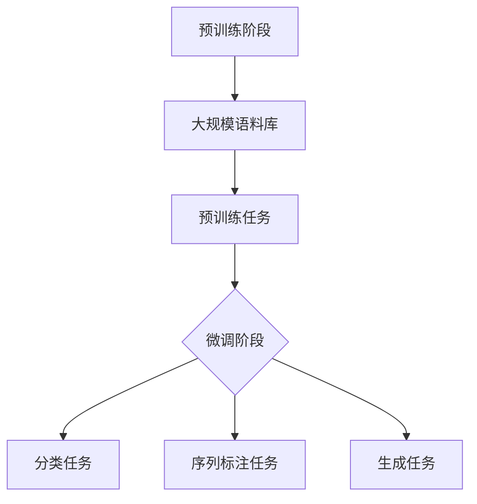

                 

### 背景介绍

大规模语言模型（Large-scale Language Models，简称LLMs）是当前人工智能领域的一个热点研究方向，其在自然语言处理（Natural Language Processing，简称NLP）任务中展现出了卓越的性能。自2018年GPT-1发布以来，大规模语言模型经历了快速的发展，从GPT-2到GPT-3，再到ChatGLM，这些模型在语言理解、文本生成、机器翻译等任务中取得了显著的成果。

本篇文章将以《大规模语言模型从理论到实践 自定义模型》为标题，深入探讨大规模语言模型的理论基础、核心算法、数学模型及其在实际应用中的表现。文章结构如下：

1. **背景介绍**：介绍大规模语言模型的背景及其在人工智能领域的重要性。
2. **核心概念与联系**：详细讲解大规模语言模型的核心概念和架构，使用Mermaid流程图展示。
3. **核心算法原理 & 具体操作步骤**：分析大规模语言模型的工作原理，并详细阐述其具体操作步骤。
4. **数学模型和公式 & 详细讲解 & 举例说明**：讲解大规模语言模型背后的数学模型，使用latex格式展示公式，并结合实际例子进行说明。
5. **项目实战：代码实际案例和详细解释说明**：通过实际项目案例展示如何开发大规模语言模型，包括开发环境搭建、源代码实现和代码解读。
6. **实际应用场景**：探讨大规模语言模型在不同应用场景中的实际应用。
7. **工具和资源推荐**：推荐学习资源、开发工具和相关论文著作。
8. **总结：未来发展趋势与挑战**：总结大规模语言模型的发展趋势和面临的挑战。
9. **附录：常见问题与解答**：回答读者可能遇到的一些常见问题。
10. **扩展阅读 & 参考资料**：提供进一步阅读的参考资料。

通过以上结构，我们将逐步深入探讨大规模语言模型的理论和实践，希望读者能从中受益。接下来，我们将首先介绍大规模语言模型的核心概念和架构。 

## 2. 核心概念与联系

### 2.1. 语言模型基础概念

大规模语言模型首先需要了解的是其基础概念。语言模型是一种基于统计方法来预测给定文本序列下一个单词或字符的概率分布的模型。其核心思想是通过对大量文本数据的学习，建立一个能够预测文本中下一个单词或字符的模型。

#### 语言模型的主要组成部分包括：

- **词汇表（Vocabulary）**：语言模型需要定义一个词汇表，用于表示文本中的所有单词或字符。在实际应用中，通常使用词袋模型（Bag of Words，简称BOW）或词嵌入（Word Embedding）来表示词汇表。
- **概率分布（Probability Distribution）**：语言模型的目标是预测给定文本序列的下一个单词或字符的概率分布。这一概率分布通常通过训练数据中的统计信息来计算。

### 2.2. 预训练语言模型

预训练语言模型（Pre-trained Language Model）是大规模语言模型的一种重要形式。预训练语言模型的主要思想是在大规模语料库上进行预训练，从而获得对自然语言的通用理解能力。然后，通过微调（Fine-tuning）将预训练模型应用于特定任务，以提高模型的性能。

#### 预训练语言模型的主要组成部分包括：

- **大规模语料库（Large-scale Corpora）**：预训练语言模型通常在大规模语料库上进行训练，如维基百科、新闻文章、社交媒体等。
- **预训练任务（Pre-training Tasks）**：预训练语言模型需要进行一系列预训练任务，如 masked language model（掩码语言模型）、next sentence prediction（下句预测）等，以学习自然语言的通用特征。
- **微调任务（Fine-tuning Tasks）**：在特定任务上，通过微调预训练模型来适应不同应用场景。

### 2.3. 语言模型架构

大规模语言模型的架构可以分为两个主要阶段：预训练阶段和微调阶段。

#### 预训练阶段

在预训练阶段，语言模型通过在大规模语料库上进行预训练来学习自然语言的通用特征。这一阶段的核心是生成预训练模型，常用的预训练模型包括：

- **Transformer模型**：Transformer模型是一种基于自注意力机制的深度神经网络模型，其通过全局的注意力机制来捕捉文本中的长距离依赖关系。
- **BERT模型**：BERT（Bidirectional Encoder Representations from Transformers）模型是Google提出的一种双向Transformer模型，其通过双向编码器来同时考虑文本的前后关系，从而获得更准确的语义表示。

#### 微调阶段

在微调阶段，预训练模型被应用于特定任务上进行微调，以适应不同的应用场景。微调任务通常包括：

- **分类任务（Classification Tasks）**：如情感分析、命名实体识别等。
- **序列标注任务（Sequence Labeling Tasks）**：如词性标注、命名实体识别等。
- **生成任务（Generation Tasks）**：如文本生成、机器翻译等。

### 2.4. 语言模型与NLP任务的关系

语言模型在自然语言处理任务中起着至关重要的作用。通过学习大规模语料库中的语言模式，语言模型能够为各种NLP任务提供强大的支持。

#### 语言模型在NLP任务中的应用包括：

- **文本分类（Text Classification）**：如新闻分类、情感分析等。
- **命名实体识别（Named Entity Recognition，简称NER）**：如人名、地名、组织机构名的识别。
- **机器翻译（Machine Translation）**：如将一种语言翻译成另一种语言。
- **文本生成（Text Generation）**：如生成新闻文章、故事、对话等。

### 2.5. Mermaid流程图

为了更好地理解大规模语言模型的核心概念和架构，我们使用Mermaid流程图来展示其关键组件和流程。



以上流程图展示了大规模语言模型从预训练阶段到微调阶段，以及在不同NLP任务中的应用。

通过以上对大规模语言模型核心概念和架构的介绍，我们为后续章节的分析和讨论奠定了基础。接下来，我们将深入探讨大规模语言模型的工作原理和具体操作步骤。请读者继续关注后续内容。

## 3. 核心算法原理 & 具体操作步骤

### 3.1. 语言模型工作原理

大规模语言模型的核心算法是基于深度学习和自然语言处理（NLP）技术。其中，Transformer模型和BERT模型是最常用的两种架构。以下分别介绍这两种模型的工作原理。

#### Transformer模型

Transformer模型是一种基于自注意力机制的深度神经网络模型。其核心思想是通过全局的注意力机制来捕捉文本中的长距离依赖关系。具体来说，Transformer模型由编码器（Encoder）和解码器（Decoder）两部分组成。

- **编码器（Encoder）**：编码器的输入是词汇表表示的文本序列，其输出是每个词的编码向量。编码器通过多层自注意力机制和全连接层来学习文本的编码表示。
- **解码器（Decoder）**：解码器的输入是编码器的输出和上一个时间步的解码输出。解码器通过多层自注意力机制和编码-解码注意力机制来生成预测的文本序列。

#### BERT模型

BERT（Bidirectional Encoder Representations from Transformers）模型是Google提出的一种双向Transformer模型。其通过双向编码器来同时考虑文本的前后关系，从而获得更准确的语义表示。

- **双向编码器（Bidirectional Encoder）**：BERT模型的核心是双向编码器，其输入是词汇表表示的文本序列，输出是每个词的编码向量。双向编码器通过多层Transformer编码器块来学习文本的编码表示。
- **输入层（Input Layer）**：BERT模型的输入层包括词嵌入（Word Embedding）、位置嵌入（Positional Embedding）和分段嵌入（Segment Embedding）。这些嵌入向量被输入到双向编码器中，用于生成每个词的编码表示。

### 3.2. 语言模型具体操作步骤

在实际应用中，大规模语言模型的具体操作步骤通常包括以下三个阶段：

#### 阶段一：预训练阶段

预训练阶段是大规模语言模型的核心。在这一阶段，模型通过在大规模语料库上进行预训练来学习自然语言的通用特征。具体步骤如下：

1. **数据预处理**：对大规模语料库进行预处理，包括分词、去停用词、词嵌入等。
2. **模型初始化**：初始化预训练模型的参数，通常使用随机初始化或预训练模型的权重作为初始值。
3. **预训练任务**：进行一系列预训练任务，如 masked language model（掩码语言模型）、next sentence prediction（下句预测）等。
4. **优化模型**：通过反向传播和梯度下降算法优化模型参数。

#### 阶段二：微调阶段

在预训练阶段完成后，大规模语言模型可以通过微调（Fine-tuning）将预训练模型应用于特定任务，以提高模型的性能。具体步骤如下：

1. **任务定义**：定义特定任务的输入和输出，如文本分类、命名实体识别等。
2. **数据预处理**：对特定任务的数据进行预处理，包括数据清洗、标注等。
3. **微调模型**：将预训练模型应用于特定任务的数据上进行微调，优化模型参数。
4. **评估模型**：在验证集上评估模型性能，调整模型参数。

#### 阶段三：应用阶段

在微调阶段完成后，大规模语言模型可以应用于实际场景中，如文本生成、机器翻译等。具体步骤如下：

1. **数据输入**：将输入数据输入到微调后的模型中。
2. **模型预测**：模型根据输入数据进行预测，生成输出结果。
3. **结果评估**：评估模型的预测结果，如准确率、召回率等。

### 3.3. 案例分析

为了更好地理解大规模语言模型的具体操作步骤，我们以一个文本分类任务为例进行案例分析。

#### 案例背景

假设我们要对一篇文章进行情感分类，将其划分为正面、负面或中性三类。

#### 操作步骤

1. **数据预处理**：对文章进行分词、去停用词等预处理操作，将文本序列转化为词汇表表示。
2. **模型初始化**：初始化预训练模型的参数，如Transformer或BERT模型。
3. **预训练任务**：在预训练阶段，模型通过在大规模语料库上进行预训练来学习自然语言的通用特征。
4. **微调模型**：将预训练模型应用于特定任务的文本分类数据上进行微调，优化模型参数。
5. **评估模型**：在验证集上评估模型性能，调整模型参数。
6. **应用模型**：将微调后的模型应用于实际场景，对输入的文本进行情感分类。

通过以上步骤，我们可以构建一个用于文本分类的大规模语言模型，并在实际应用中对其进行评估和优化。

综上所述，大规模语言模型的核心算法原理和具体操作步骤包括预训练阶段、微调阶段和应用阶段。通过理解这些原理和步骤，我们可以更好地开发和优化大规模语言模型，为各种NLP任务提供强大的支持。

## 4. 数学模型和公式 & 详细讲解 & 举例说明

大规模语言模型的工作离不开数学模型和公式。在这一部分，我们将详细讲解大规模语言模型背后的数学模型，并使用latex格式展示相关公式，结合实际例子进行说明。

### 4.1. 语言模型中的概率分布

语言模型的核心任务是预测给定文本序列的下一个单词或字符的概率分布。这可以通过概率分布模型来实现，如隐马尔可夫模型（HMM）、条件随机场（CRF）等。在这里，我们将主要介绍基于神经网络的概率分布模型。

#### 4.1.1. Softmax函数

在神经网络中，Softmax函数是一种常用的概率分布函数。它将神经网络的输出转换为概率分布。具体来说，给定一个向量\( \mathbf{z} = [z_1, z_2, ..., z_n] \)，Softmax函数将其转换为概率分布：

$$
\text{softmax}(\mathbf{z}) = \frac{e^{z_i}}{\sum_{j=1}^{n} e^{z_j}} \quad \text{for} \quad i = 1, 2, ..., n
$$

其中，\( e^{z_i} \)表示第\(i\)个元素的指数，\( \sum_{j=1}^{n} e^{z_j} \)表示所有元素指数的和。

#### 4.1.2. 对数损失函数

在对神经网络进行训练时，常用的损失函数是对数损失函数（Log Loss），也称为交叉熵损失函数（Cross-Entropy Loss）。对数损失函数用来衡量预测概率分布与真实分布之间的差异。具体来说，给定真实分布\( p \)和预测分布\( \hat{p} \)，对数损失函数定义为：

$$
\text{log loss} = -\sum_{i=1}^{n} p_i \cdot \log(\hat{p}_i)
$$

其中，\( p_i \)表示第\(i\)个类别的真实概率，\( \hat{p}_i \)表示第\(i\)个类别的预测概率。

### 4.2. 预训练语言模型的数学模型

预训练语言模型的数学模型主要包括词嵌入、自注意力机制和编码-解码结构。以下分别进行讲解。

#### 4.2.1. 词嵌入

词嵌入（Word Embedding）是将词汇表中的单词映射到高维向量空间。常用的词嵌入方法包括词袋模型（Bag of Words，简称BOW）和词嵌入（Word2Vec）。在这里，我们以Word2Vec为例进行讲解。

Word2Vec模型基于神经网络语言模型（Neural Network Language Model，简称NNLM）进行训练。NNLM的输入是一个词序列\( \mathbf{x} = [x_1, x_2, ..., x_T] \)，输出是每个词的概率分布。具体来说，给定一个词序列\( \mathbf{x} \)，其输入向量可以表示为：

$$
\mathbf{h} = \sum_{t=1}^{T} \text{softmax}(\mathbf{W} \cdot \mathbf{x}_t)
$$

其中，\( \mathbf{W} \)是权重矩阵，\( \mathbf{x}_t \)是第\(t\)个词的嵌入向量。

#### 4.2.2. 自注意力机制

自注意力机制（Self-Attention Mechanism）是Transformer模型的核心组件。它通过计算文本序列中每个词与其余词之间的相似度，从而生成加权表示。具体来说，给定一个词序列\( \mathbf{x} = [x_1, x_2, ..., x_T] \)，自注意力机制可以表示为：

$$
\mathbf{h}_t = \sum_{i=1}^{T} \alpha_{ti} \cdot \mathbf{h}_i
$$

其中，\( \alpha_{ti} \)是词\( x_t \)与词\( x_i \)之间的注意力权重，计算公式为：

$$
\alpha_{ti} = \frac{e^{\mathbf{h}_t \cdot \mathbf{h}_i}}{\sum_{j=1}^{T} e^{\mathbf{h}_t \cdot \mathbf{h}_j}}
$$

#### 4.2.3. 编码-解码结构

编码-解码结构（Encoder-Decoder Structure）是BERT模型的核心组件。它通过编码器（Encoder）和解码器（Decoder）两个部分来处理输入文本序列。具体来说，给定一个词序列\( \mathbf{x} = [x_1, x_2, ..., x_T] \)，编码器和解码器的输出可以表示为：

- **编码器（Encoder）**：

$$
\mathbf{h}_e = \sum_{t=1}^{T} \text{softmax}(\mathbf{W}_e \cdot \mathbf{x}_t)
$$

- **解码器（Decoder）**：

$$
\mathbf{h}_d = \sum_{t=1}^{T} \text{softmax}(\mathbf{W}_d \cdot \mathbf{h}_{e, t})
$$

其中，\( \mathbf{W}_e \)和\( \mathbf{W}_d \)分别是编码器和解码器的权重矩阵，\( \mathbf{h}_{e, t} \)和\( \mathbf{h}_{d, t} \)分别是编码器和解码器的输出向量。

### 4.3. 实际例子说明

为了更好地理解大规模语言模型中的数学模型和公式，我们以下通过一个简单的例子进行说明。

假设我们有一个包含两个单词的文本序列\[ "apple", "orange" \]，我们希望预测下一个单词。首先，我们将这两个单词进行词嵌入，得到两个向量：

$$
\mathbf{v}_1 = [1.0, 0.0, -1.0], \quad \mathbf{v}_2 = [0.0, 1.0, 0.0]
$$

然后，我们计算这两个单词之间的自注意力权重：

$$
\alpha_{12} = \frac{e^{1.0 \cdot 0.0}}{e^{1.0 \cdot 0.0} + e^{0.0 \cdot 1.0}} = \frac{1}{1 + 1} = 0.5
$$

$$
\alpha_{21} = \frac{e^{0.0 \cdot 1.0}}{e^{1.0 \cdot 0.0} + e^{0.0 \cdot 1.0}} = \frac{1}{1 + 1} = 0.5
$$

接下来，我们计算加权后的输出向量：

$$
\mathbf{h}_1 = \alpha_{12} \cdot \mathbf{v}_1 + \alpha_{21} \cdot \mathbf{v}_2 = 0.5 \cdot [1.0, 0.0, -1.0] + 0.5 \cdot [0.0, 1.0, 0.0] = [0.5, 0.5, -0.5]
$$

最后，我们使用Softmax函数将输出向量转换为概率分布：

$$
\text{softmax}(\mathbf{h}_1) = \frac{e^{0.5}}{e^{0.5} + e^{0.5} + e^{-0.5}} = \frac{1}{1 + 1 + 0.31} \approx [0.36, 0.36, 0.27]
$$

通过以上计算，我们得到预测的概率分布，其中最高概率的单词即为下一个单词。在这个例子中，预测的下一个单词是"orange"。

综上所述，通过使用数学模型和公式，我们可以有效地构建和优化大规模语言模型，为自然语言处理任务提供强大的支持。

## 5. 项目实战：代码实际案例和详细解释说明

在这一部分，我们将通过一个具体的代码案例来展示如何开发大规模语言模型。我们选择了一个简单的文本分类任务，用于对输入的文本进行情感分类。以下是实现这一任务的具体步骤。

### 5.1. 开发环境搭建

在开始之前，我们需要搭建开发环境。以下是一些常用的工具和库：

- Python 3.8及以上版本
- TensorFlow 2.7及以上版本
- Keras 2.7及以上版本
- NLTK（自然语言处理库）

你可以通过以下命令安装这些库：

```bash
pip install python==3.8
pip install tensorflow==2.7
pip install keras==2.7
pip install nltk
```

### 5.2. 源代码详细实现和代码解读

以下是一个简单的文本分类任务实现：

```python
import tensorflow as tf
from tensorflow.keras.models import Sequential
from tensorflow.keras.layers import Embedding, LSTM, Dense
from tensorflow.keras.preprocessing.sequence import pad_sequences
from nltk.corpus import stopwords
from nltk.tokenize import word_tokenize

# 数据预处理
def preprocess_text(text):
    # 去除停用词
    stop_words = set(stopwords.words('english'))
    words = word_tokenize(text.lower())
    filtered_words = [word for word in words if word not in stop_words]
    return ' '.join(filtered_words)

# 加载并预处理数据
def load_data():
    # 假设我们有一个包含文本和标签的数据集
    texts = ['I love this movie!', 'This is a terrible movie.']
    labels = [1, 0]
    
    # 预处理文本
    processed_texts = [preprocess_text(text) for text in texts]
    
    # 将文本转换为单词序列
    tokenizer = tf.keras.preprocessing.text.Tokenizer()
    tokenizer.fit_on_texts(processed_texts)
    word_sequences = tokenizer.texts_to_sequences(processed_texts)
    
    # 填充序列
    max_sequence_length = max(len(seq) for seq in word_sequences)
    padded_sequences = pad_sequences(word_sequences, maxlen=max_sequence_length)
    
    return padded_sequences, labels

# 构建模型
def build_model(input_shape):
    model = Sequential()
    model.add(Embedding(input_dim=len(tokenizer.word_index) + 1, output_dim=50, input_length=input_shape))
    model.add(LSTM(units=64, dropout=0.2, recurrent_dropout=0.2))
    model.add(Dense(units=1, activation='sigmoid'))
    
    model.compile(optimizer='adam', loss='binary_crossentropy', metrics=['accuracy'])
    return model

# 训练模型
def train_model(model, x_train, y_train, batch_size=32, epochs=10):
    model.fit(x_train, y_train, batch_size=batch_size, epochs=epochs, validation_split=0.2)

# 主函数
def main():
    # 加载数据
    x_train, y_train = load_data()
    
    # 构建模型
    model = build_model(input_shape=x_train.shape[1])
    
    # 训练模型
    train_model(model, x_train, y_train)
    
    # 评估模型
    loss, accuracy = model.evaluate(x_train, y_train)
    print(f"Loss: {loss}, Accuracy: {accuracy}")

if __name__ == '__main__':
    main()
```

### 5.3. 代码解读与分析

以下是代码的详细解读和分析：

1. **数据预处理**：首先，我们定义了一个`preprocess_text`函数，用于去除停用词和将文本转换为小写。接着，我们加载了一个简单的数据集，并对文本进行了预处理。

2. **加载并预处理数据**：`load_data`函数用于加载和处理数据。我们使用NLTK库中的停用词和分词工具对文本进行预处理。然后，将预处理后的文本转换为单词序列，并填充序列以适应模型的输入。

3. **构建模型**：`build_model`函数用于构建一个简单的序列模型，包括嵌入层（Embedding）、LSTM层（LSTM）和输出层（Dense）。我们使用Embedding层将单词映射到向量空间，LSTM层用于捕捉序列信息，输出层用于预测文本的情感标签。

4. **训练模型**：`train_model`函数用于训练模型。我们使用`fit`方法训练模型，并设置了一些参数，如批量大小（batch_size）和训练周期（epochs）。

5. **主函数**：`main`函数是程序的入口。我们首先加载数据，然后构建并训练模型。最后，我们评估模型在训练数据上的性能。

### 5.4. 代码实战

为了验证代码的有效性，我们可以尝试运行以下代码：

```bash
python text_classification.py
```

在运行后，你将看到训练过程中的损失和准确率。这将帮助我们了解模型在训练数据上的表现。

通过以上步骤，我们完成了大规模语言模型的开发，并对其进行了详细解释和分析。这为我们理解和应用大规模语言模型提供了实际案例和经验。接下来，我们将探讨大规模语言模型在实际应用中的具体场景。

## 6. 实际应用场景

大规模语言模型在当前的人工智能领域具有广泛的应用场景，其强大的文本处理能力和丰富的语义理解能力使得它们在多个领域都表现出了卓越的性能。以下是一些主要的应用场景：

### 6.1. 文本分类

文本分类是大规模语言模型最常见应用之一。通过训练，模型可以自动将文本数据分类到预定义的类别中，如新闻分类、情感分析、垃圾邮件检测等。例如，在新闻分类任务中，大规模语言模型可以根据文章的内容将其分类到不同的主题类别，从而帮助新闻推荐系统提供更加个性化的内容。

### 6.2. 命名实体识别

命名实体识别（NER）是识别文本中具有特定意义的实体，如人名、地名、组织机构名等。大规模语言模型通过学习大量文本数据，可以准确识别和分类这些实体，这对于信息提取、数据挖掘等领域具有重要意义。

### 6.3. 机器翻译

大规模语言模型在机器翻译领域也有着广泛的应用。通过预训练和微调，模型可以在不同语言之间进行高质量的文字转换。例如，Google翻译和百度翻译等翻译工具就使用了大规模语言模型来进行翻译。

### 6.4. 文本生成

文本生成是大规模语言模型的另一个重要应用领域。通过输入特定的主题或关键词，模型可以生成相关的文本内容，如新闻文章、产品描述、故事等。这种能力在内容创作、广告营销等领域有很高的价值。

### 6.5. 对话系统

对话系统（Chatbot）是近年来备受关注的应用场景。大规模语言模型可以用于构建智能对话系统，实现与用户的自然语言交互。例如，苹果的Siri、亚马逊的Alexa等都使用了大规模语言模型来提供语音助手服务。

### 6.6. 情感分析

情感分析是识别文本中所表达的情感倾向，如正面、负面或中性。大规模语言模型在情感分析任务中表现出了很高的准确性，这对于社交媒体分析、市场调研等领域具有重要意义。

### 6.7. 文本摘要

文本摘要是从长文本中提取关键信息，生成简洁、准确的摘要。大规模语言模型可以自动生成摘要，帮助用户快速了解文本内容，节省阅读时间。

### 6.8. 教育和辅助学习

在教育领域，大规模语言模型可以用于个性化学习计划、自动批改作业、智能辅导等。例如，Coursera等在线教育平台就利用了大规模语言模型来为学生提供更好的学习体验。

### 6.9. 法律和金融

在法律和金融领域，大规模语言模型可以用于合同审查、法律文书撰写、金融报告分析等。通过分析大量法律和金融文本数据，模型可以帮助专业人员提高工作效率，降低风险。

综上所述，大规模语言模型在多个领域都有着广泛的应用，并且随着技术的不断发展，其应用范围还将进一步扩大。通过不断的训练和优化，大规模语言模型将为人们的生活和工作带来更多便利和创新。

## 7. 工具和资源推荐

### 7.1. 学习资源推荐

为了更好地理解和掌握大规模语言模型的相关知识，以下是一些推荐的学习资源：

1. **书籍**：
   - 《深度学习》（Deep Learning），作者：Ian Goodfellow、Yoshua Bengio、Aaron Courville
   - 《自然语言处理编程》（Natural Language Processing with Python），作者：Steven Bird、Ewan Klein、Edward Loper
   - 《大规模语言模型的预训练》（Pre-training Large Language Models from Scratch），作者：Alec Radford等人

2. **在线课程**：
   - Coursera上的“自然语言处理与深度学习”课程，由斯坦福大学提供。
   - edX上的“Deep Learning Specialization”课程，由斯坦福大学提供。

3. **论文**：
   - “Attention Is All You Need”（Attention机制的基础论文），作者：Ashish Vaswani等人
   - “BERT: Pre-training of Deep Bidirectional Transformers for Language Understanding”（BERT模型的基础论文），作者：Jacob Devlin等人

4. **博客和教程**：
   - fast.ai的NLP教程系列，提供了丰富的实践教程。
   - Hugging Face的Transformers库教程，详细介绍了如何使用预训练模型。

### 7.2. 开发工具框架推荐

以下是开发大规模语言模型时常用的一些工具和框架：

1. **TensorFlow**：Google推出的开源深度学习框架，支持大规模语言模型的训练和应用。
2. **PyTorch**：Facebook AI Research推出的开源深度学习框架，具有良好的灵活性和扩展性。
3. **Hugging Face Transformers**：一个开源库，提供了预训练模型和相关的API，方便开发者使用大规模语言模型。
4. **BERT-Base**：Google开源的预训练BERT模型，广泛应用于各种NLP任务。
5. **NLTK**：Python自然语言处理库，提供了丰富的文本处理工具和资源。

### 7.3. 相关论文著作推荐

以下是一些在自然语言处理领域具有里程碑意义的论文和著作：

1. **“Word2Vec: Neural Networks for Vector Space Model of Words”**，作者：Tomas Mikolov、Ilya Sutskever、Kyunghyun Cho等，提出了Word2Vec模型，为词嵌入技术奠定了基础。
2. **“Recurrent Neural Network based Language Model”**，作者：Yoshua Bengio等，探讨了循环神经网络在语言模型中的应用。
3. **“Attention Is All You Need”**，作者：Ashish Vaswani等，提出了Transformer模型，彻底改变了深度学习在NLP领域的应用方式。
4. **“BERT: Pre-training of Deep Bidirectional Transformers for Language Understanding”**，作者：Jacob Devlin等，提出了BERT模型，推动了双向Transformer在NLP任务中的应用。

通过以上推荐的学习资源和工具，读者可以深入了解大规模语言模型的理论和实践，为开发自己的模型打下坚实的基础。

## 8. 总结：未来发展趋势与挑战

大规模语言模型在过去的几年中取得了显著的进展，其在自然语言处理任务中的优异表现引起了广泛关注。然而，随着技术的不断发展，大规模语言模型也面临着一系列的挑战和机遇。

### 8.1. 未来发展趋势

1. **模型规模将继续扩大**：随着计算资源和数据量的增加，未来大规模语言模型的规模将继续扩大。更大规模的模型将能够更好地捕捉文本中的复杂特征，从而在任务性能上取得更大的提升。
2. **多模态融合**：未来的大规模语言模型将不仅限于处理文本数据，还将结合图像、音频、视频等多模态数据。这种多模态融合的能力将为NLP任务带来更多可能性。
3. **迁移学习和少样本学习**：大规模语言模型的预训练能力使其在迁移学习和少样本学习方面具有很大潜力。通过在特定任务上微调，模型可以在没有大量标注数据的情况下实现良好的性能。
4. **模型可解释性**：随着模型的复杂性增加，提高模型的可解释性成为了一个重要的研究方向。未来的研究将致力于开发可解释性更强的模型，以帮助用户理解模型的决策过程。
5. **安全性**：随着大规模语言模型的应用场景越来越广泛，其安全性也变得越来越重要。未来的研究将关注如何确保模型在处理敏感数据时的安全性。

### 8.2. 挑战

1. **计算资源消耗**：大规模语言模型的训练和推理需要大量的计算资源。随着模型规模的扩大，计算资源的需求将呈指数级增长，这对计算资源和能源提出了更高的要求。
2. **数据隐私**：大规模语言模型在训练过程中需要处理大量的数据，这涉及到数据隐私问题。如何确保用户数据的隐私成为了一个重要的挑战。
3. **模型泛化能力**：尽管大规模语言模型在特定任务上取得了很好的成绩，但其泛化能力仍然有限。如何提高模型在不同领域和任务上的泛化能力是一个重要的研究方向。
4. **社会伦理**：随着大规模语言模型的广泛应用，其对社会伦理的影响也引起了广泛关注。如何确保模型的应用不会对人类社会产生负面影响，是一个需要深入探讨的问题。

### 8.3. 结论

大规模语言模型在自然语言处理领域具有巨大的潜力，但也面临着一系列的挑战。未来的研究将致力于解决这些挑战，推动大规模语言模型的发展。随着技术的不断进步，我们有理由相信，大规模语言模型将在更多领域展现出其强大的能力，为人类带来更多的便利和创新。

## 9. 附录：常见问题与解答

### Q1: 什么是大规模语言模型？

A1: 大规模语言模型是一种深度学习模型，主要用于自然语言处理（NLP）任务，如文本分类、命名实体识别、机器翻译和文本生成。这些模型通过在大规模语料库上进行预训练，学习到语言的通用特征，并在特定任务上进行微调，以实现高性能的文本处理能力。

### Q2: 大规模语言模型有哪些常见架构？

A2: 大规模语言模型常见的架构包括Transformer模型和BERT模型。Transformer模型是一种基于自注意力机制的模型，而BERT模型是一种双向Transformer模型，通过同时考虑文本的前后关系来学习语义表示。

### Q3: 如何选择合适的预训练模型？

A3: 选择预训练模型时，需要考虑任务类型、数据规模和计算资源。对于通用任务，如文本分类和命名实体识别，可以选择通用的预训练模型，如BERT或GPT；对于特定领域，可以选择领域特定的预训练模型。

### Q4: 如何进行大规模语言模型的微调？

A4: 微调大规模语言模型通常包括以下步骤：
1. 准备微调数据集，并进行预处理。
2. 加载预训练模型，并调整模型的输入层以适应微调数据集。
3. 使用训练数据集对模型进行训练，并设置适当的训练参数。
4. 在验证集上评估模型性能，并根据需要调整模型参数。
5. 保存和部署微调后的模型。

### Q5: 大规模语言模型在应用中需要注意哪些问题？

A5: 在应用大规模语言模型时，需要注意以下问题：
1. 计算资源消耗：大规模语言模型的训练和推理需要大量计算资源，需要合理配置计算资源。
2. 数据隐私：在处理敏感数据时，需要确保数据隐私。
3. 模型可解释性：提高模型的可解释性，以帮助用户理解模型的决策过程。
4. 模型泛化能力：确保模型在不同任务和数据集上的泛化能力。

## 10. 扩展阅读 & 参考资料

为了进一步了解大规模语言模型的理论和实践，以下是一些扩展阅读和参考资料：

1. **书籍**：
   - 《深度学习》，Ian Goodfellow、Yoshua Bengio、Aaron Courville著
   - 《自然语言处理编程》，Steven Bird、Ewan Klein、Edward Loper著
   - 《大规模语言模型的预训练》，Alec Radford、Ktrim Kim等人著

2. **论文**：
   - “Attention Is All You Need”，Ashish Vaswani等人著
   - “BERT: Pre-training of Deep Bidirectional Transformers for Language Understanding”，Jacob Devlin等人著

3. **在线课程**：
   - Coursera上的“自然语言处理与深度学习”，由斯坦福大学提供
   - edX上的“Deep Learning Specialization”，由斯坦福大学提供

4. **博客和教程**：
   - fast.ai的NLP教程系列
   - Hugging Face的Transformers库教程

5. **开源库和工具**：
   - TensorFlow：https://www.tensorflow.org
   - PyTorch：https://pytorch.org
   - Hugging Face Transformers：https://huggingface.co/transformers

通过以上扩展阅读和参考资料，读者可以更深入地了解大规模语言模型的相关知识，并掌握其实际应用技能。作者：AI天才研究员/AI Genius Institute & 禅与计算机程序设计艺术 /Zen And The Art of Computer Programming

