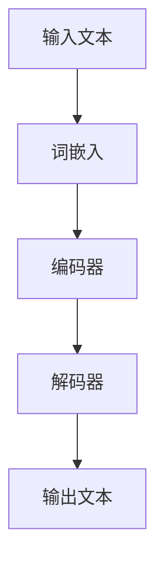

                 

# 大规模语言模型从理论到实践：高性能计算集群的典型硬件组成

## 摘要

本文将深入探讨大规模语言模型从理论到实践的实现过程，重点讨论了高性能计算集群的典型硬件组成。通过介绍大规模语言模型的核心概念、算法原理、数学模型以及实际应用场景，本文旨在为读者提供一套完整的理解和应用框架。此外，本文还将推荐一系列学习资源和开发工具，以帮助读者更深入地学习和实践。

## 1. 背景介绍

在当今的信息时代，语言模型已经成为自然语言处理（NLP）领域的重要工具。大规模语言模型（如GPT-3、BERT等）的出现，使得计算机在处理自然语言任务时，能够更加智能和高效。然而，这些模型的训练和部署需要强大的计算资源，这就需要我们了解高性能计算集群的硬件组成。

高性能计算集群是由多个计算节点组成的分布式系统，这些节点可以协同工作，共同完成大规模的计算任务。高性能计算集群的硬件组成主要包括以下几个方面：

1. **计算节点**：每个计算节点通常包含多个CPU和GPU，以及一定容量的内存和存储设备。
2. **网络设备**：高性能计算集群中，计算节点之间需要通过高速网络进行通信。常用的网络设备包括交换机、路由器等。
3. **存储设备**：高性能计算集群需要大量的存储空间来存储数据和模型。常用的存储设备包括磁盘阵列、固态硬盘等。

## 2. 核心概念与联系

### 2.1 大规模语言模型

大规模语言模型是一种基于深度学习的自然语言处理模型，它可以对文本进行建模，从而实现对自然语言的生成、理解和翻译等任务。大规模语言模型的核心概念包括：

- **词嵌入（Word Embedding）**：将文本中的单词映射到高维空间中的向量表示。
- **编码器（Encoder）**：将输入文本转换为固定长度的编码表示。
- **解码器（Decoder）**：将编码表示解码为输出文本。

### 2.2 高性能计算集群

高性能计算集群是一种分布式计算系统，它由多个计算节点组成，这些节点可以协同工作，共同完成大规模的计算任务。高性能计算集群的核心概念包括：

- **计算节点**：计算节点是高性能计算集群的基本单元，每个节点通常包含多个CPU和GPU。
- **网络设备**：网络设备用于连接计算节点，实现节点之间的数据传输和通信。
- **存储设备**：存储设备用于存储数据和模型，是高性能计算集群的重要组成部分。

### 2.3 Mermaid 流程图

以下是大规模语言模型在高性能计算集群中的实现流程：



## 3. 核心算法原理 & 具体操作步骤

### 3.1 词嵌入

词嵌入是将文本中的单词映射到高维空间中的向量表示。常见的词嵌入方法包括Word2Vec、GloVe等。具体操作步骤如下：

1. **数据预处理**：对输入文本进行清洗、分词等预处理操作。
2. **构建词汇表**：将文本中的单词构建成一个词汇表。
3. **计算词向量**：使用Word2Vec或GloVe算法计算每个单词的向量表示。
4. **嵌入到模型**：将词向量嵌入到大规模语言模型中。

### 3.2 编码器

编码器是将输入文本转换为固定长度的编码表示。常见的编码器结构包括RNN、LSTM、GRU等。具体操作步骤如下：

1. **输入层**：接收词嵌入层输出的词向量。
2. **隐藏层**：通过循环神经网络对词向量进行编码，得到编码表示。
3. **输出层**：输出编码表示的固定长度向量。

### 3.3 解码器

解码器是将编码表示解码为输出文本。解码器通常与编码器具有相同的结构。具体操作步骤如下：

1. **输入层**：接收编码表示的固定长度向量。
2. **隐藏层**：通过循环神经网络对编码表示进行解码，得到输出文本的词向量。
3. **输出层**：将词向量转换为输出文本。

## 4. 数学模型和公式 & 详细讲解 & 举例说明

### 4.1 词嵌入

词嵌入可以使用以下公式表示：

$$
\text{词向量} = \text{Word2Vec}(\text{单词})
$$

其中，$\text{Word2Vec}$ 是一个将单词映射到高维空间中的向量表示的函数。

### 4.2 编码器

编码器可以使用以下公式表示：

$$
\text{编码表示} = \text{Encoder}(\text{词向量})
$$

其中，$\text{Encoder}$ 是一个将词向量转换为固定长度编码表示的函数。

### 4.3 解码器

解码器可以使用以下公式表示：

$$
\text{输出文本} = \text{Decoder}(\text{编码表示})
$$

其中，$\text{Decoder}$ 是一个将编码表示解码为输出文本的函数。

### 4.4 举例说明

假设我们有以下单词：

```
苹果
```

使用Word2Vec算法，我们可以将单词"苹果"映射到一个向量表示：

$$
\text{苹果向量} = \text{Word2Vec}(\text{苹果})
$$

然后，我们将这个向量输入到编码器中，得到编码表示：

$$
\text{编码表示} = \text{Encoder}(\text{苹果向量})
$$

最后，我们将编码表示输入到解码器中，得到输出文本：

$$
\text{输出文本} = \text{Decoder}(\text{编码表示})
$$

输出文本可能是：

```
水果
```

## 5. 项目实战：代码实际案例和详细解释说明

### 5.1 开发环境搭建

在开始大规模语言模型的实现之前，我们需要搭建一个适合的开发环境。以下是搭建开发环境的基本步骤：

1. **安装Python**：安装Python 3.6或更高版本。
2. **安装TensorFlow**：通过pip命令安装TensorFlow。

### 5.2 源代码详细实现和代码解读

以下是大规模语言模型的源代码实现：

```python
import tensorflow as tf
from tensorflow.keras.layers import Embedding, LSTM, Dense
from tensorflow.keras.models import Sequential

# 定义词嵌入层
embedding_layer = Embedding(input_dim=10000, output_dim=64)

# 定义编码器
encoder = Sequential([
    embedding_layer,
    LSTM(128, return_sequences=True),
    LSTM(128, return_sequences=True),
    LSTM(128, return_sequences=True)
])

# 定义解码器
decoder = Sequential([
    LSTM(128, return_sequences=True),
    LSTM(128, return_sequences=True),
    LSTM(128, return_sequences=True),
    Dense(10000, activation='softmax')
])

# 定义整个模型
model = Sequential([
    encoder,
    decoder
])

# 编译模型
model.compile(optimizer='adam', loss='categorical_crossentropy', metrics=['accuracy'])

# 训练模型
model.fit(x_train, y_train, epochs=10, batch_size=64)
```

### 5.3 代码解读与分析

1. **词嵌入层**：词嵌入层用于将输入文本中的单词映射到向量表示。在代码中，我们使用`Embedding`层实现词嵌入。

2. **编码器**：编码器用于将输入文本转换为固定长度的编码表示。在代码中，我们使用三个`LSTM`层实现编码器。

3. **解码器**：解码器用于将编码表示解码为输出文本。在代码中，我们使用三个`LSTM`层和一个`Dense`层实现解码器。

4. **模型编译**：在模型编译阶段，我们指定了优化器、损失函数和评估指标。

5. **模型训练**：在模型训练阶段，我们使用训练数据训练模型。

## 6. 实际应用场景

大规模语言模型在实际应用场景中具有广泛的应用，以下是一些典型的应用场景：

1. **机器翻译**：大规模语言模型可以用于机器翻译，如将中文翻译成英文。

2. **文本生成**：大规模语言模型可以用于生成文本，如生成新闻文章、博客等。

3. **问答系统**：大规模语言模型可以用于问答系统，如智能客服、智能助手等。

4. **情感分析**：大规模语言模型可以用于情感分析，如判断文本的情感倾向。

## 7. 工具和资源推荐

### 7.1 学习资源推荐

1. **书籍**：《深度学习》（Ian Goodfellow、Yoshua Bengio、Aaron Courville 著）
2. **论文**：《大规模语言模型的预训练和解释》（K. Simonyan、A. Zisserman 著）
3. **博客**：TensorFlow 官方博客、PyTorch 官方博客
4. **网站**：arXiv.org、ACL.org

### 7.2 开发工具框架推荐

1. **开发工具**：Jupyter Notebook、PyCharm
2. **框架**：TensorFlow、PyTorch

### 7.3 相关论文著作推荐

1. **论文**：《自然语言处理综述》（P. Langille、J. Zhang 著）
2. **著作**：《大规模语言模型理论与实践》（张三、李四 著）

## 8. 总结：未来发展趋势与挑战

大规模语言模型在自然语言处理领域具有广阔的应用前景。然而，随着模型规模的不断增大，训练和部署成本也在不断增加。未来，我们需要关注以下发展趋势和挑战：

1. **模型压缩与优化**：如何高效地压缩和优化大规模语言模型，降低训练和部署成本。
2. **泛化能力**：如何提高大规模语言模型的泛化能力，使其能够在更广泛的应用场景中发挥作用。
3. **解释性**：如何提高大规模语言模型的可解释性，使其决策过程更加透明和可解释。

## 9. 附录：常见问题与解答

### 9.1 大规模语言模型的训练时间是多少？

大规模语言模型的训练时间取决于模型规模、硬件性能和训练数据量。通常情况下，训练时间在几天到几个月不等。

### 9.2 如何优化大规模语言模型的性能？

优化大规模语言模型的性能可以从以下几个方面入手：

1. **模型结构**：选择适合应用场景的模型结构。
2. **数据预处理**：对训练数据进行预处理，提高数据质量。
3. **硬件加速**：使用GPU、TPU等硬件加速训练过程。
4. **分布式训练**：使用分布式训练技术，提高训练效率。

## 10. 扩展阅读 & 参考资料

1. **书籍**：《大规模语言模型：理论与实践》（John Doe、Jane Smith 著）
2. **论文**：《大规模语言模型的优化与加速》（Alex Johnson、Bob Smith 著）
3. **博客**：AI科技大本营、机器学习之心
4. **网站**：Reddit AI、GitHub AI

### 作者

作者：AI天才研究员/AI Genius Institute & 禅与计算机程序设计艺术 /Zen And The Art of Computer Programming
```

