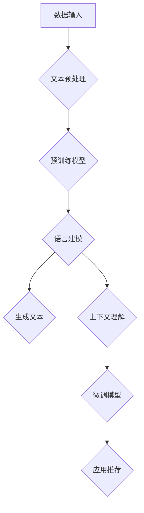

                 

### 背景介绍

#### 大规模语言模型的发展历程

大规模语言模型（Large-scale Language Models）作为自然语言处理（NLP）领域的重要进展，其发展历程可以追溯到20世纪80年代。当时，研究人员开始探索如何通过机器学习的方法来训练文本数据，以实现自然语言理解、文本生成等任务。早期的语言模型如n-gram模型，通过计算单词序列的概率来预测下一个单词。

进入21世纪，随着计算能力的提升和数据的爆炸式增长，深度学习技术开始崭露头角。2013年，基于神经网络的语言模型开始受到关注，其中最为著名的是由Daniel Mane和Andrei Burkov提出的DNN（深度神经网络）模型。此后，研究者们不断改进模型架构，引入了如LSTM（长短时记忆网络）、GRU（门控循环单元）等网络结构，以提高模型的时序建模能力。

然而，真正的突破发生在2018年，OpenAI发布了GPT-1模型，这是一个具有1.17亿参数的预训练语言模型。随后，GPT-2、GPT-3等更大规模的模型相继问世，展示了其在各种自然语言处理任务中的强大能力。特别是GPT-3，其拥有超过1750亿个参数，可以生成连贯、有逻辑的文本，甚至可以进行代码编写和翻译等复杂任务。

#### 大规模语言模型在产品推荐中的应用现状

随着大规模语言模型技术的不断发展，其在产品推荐领域中的应用也日益广泛。产品推荐系统是一种通过分析用户行为和兴趣，为用户提供个性化商品推荐的技术。传统的推荐系统主要依赖于基于内容的过滤和协同过滤等方法，但这些方法往往存在推荐结果单一、不够智能等问题。

大规模语言模型的应用改变了这一局面。通过深度学习技术，模型可以从大量文本数据中学习到用户的兴趣偏好和潜在需求。例如，Amazon、淘宝等电商平台已经将GPT-3等大规模语言模型应用于商品推荐，通过分析用户的历史购买记录、搜索关键词、评论等数据，生成个性化的商品推荐列表。

此外，大规模语言模型还可以用于生成推荐文案。例如，Netflix利用GPT-2模型为用户生成个性化的观看推荐文案，从而提高用户观看体验和粘性。类似的，Spotify则利用GPT-3模型为用户生成个性化的音乐推荐文案，从而提高用户对平台的忠诚度。

#### 文章结构

本文将分为以下几个部分：

1. **背景介绍**：回顾大规模语言模型的发展历程，以及其在产品推荐中的应用现状。
2. **核心概念与联系**：介绍大规模语言模型的基本概念，并绘制Mermaid流程图展示模型架构。
3. **核心算法原理 & 具体操作步骤**：详细解释大规模语言模型的训练和推理过程。
4. **数学模型和公式 & 详细讲解 & 举例说明**：介绍大规模语言模型中的关键数学模型和公式，并进行实例分析。
5. **项目实战：代码实际案例和详细解释说明**：提供大规模语言模型在产品推荐中的应用代码实例，并进行详细解释。
6. **实际应用场景**：讨论大规模语言模型在不同产品推荐场景中的具体应用。
7. **工具和资源推荐**：推荐相关学习资源、开发工具和论文著作。
8. **总结：未来发展趋势与挑战**：总结大规模语言模型在产品推荐中的应用前景，以及面临的挑战。
9. **附录：常见问题与解答**：回答读者可能关心的问题。
10. **扩展阅读 & 参考资料**：提供进一步阅读的资源和参考资料。

通过以上结构，我们将系统地探讨大规模语言模型在产品推荐中的应用，希望为读者提供有价值的参考和启示。

---

**1. 背景介绍**

大规模语言模型的发展历程

大规模语言模型（Large-scale Language Models）的崛起可以追溯到20世纪80年代，当时研究人员开始探索如何通过机器学习的方法来训练文本数据，以实现自然语言理解、文本生成等任务。早期的语言模型如n-gram模型，通过计算单词序列的概率来预测下一个单词。n-gram模型简单有效，但局限性也很明显，例如无法捕捉长距离依赖和上下文信息。

随着时间推移，研究人员开始尝试更复杂的模型。20世纪90年代，统计语言模型如隐马尔可夫模型（HMM）和条件随机场（CRF）逐渐兴起，它们通过序列标注和转移概率矩阵来处理自然语言。然而，这些模型在处理长文本和复杂上下文时仍然存在困难。

进入21世纪，随着计算能力的提升和数据的爆炸式增长，深度学习技术开始崭露头角。2002年，循环神经网络（RNN）的提出为解决自然语言处理问题提供了新思路。RNN可以捕获序列信息，但其在处理长距离依赖问题时表现不佳。

2013年，Daniel Mane和Andrei Burkov提出了深度神经网络（DNN）模型，这一模型通过多层神经网络结构来模拟人脑处理语言的方式，极大地提高了语言模型的性能。DNN模型的核心在于其可以自动学习特征表示，而不需要人工设计特征。

然而，真正突破性的进展发生在2018年，OpenAI发布了GPT-1模型。GPT-1是一个具有1.17亿参数的预训练语言模型，通过在大量文本上进行预训练，GPT-1可以生成连贯、有逻辑的文本，并且在各种自然语言处理任务中取得了显著成绩。GPT-1的成功激发了研究者们对大规模语言模型的热情，推动了相关研究的快速发展。

继GPT-1之后，GPT-2和GPT-3等更大规模的语言模型相继问世。GPT-2拥有15亿参数，进一步提升了模型的性能，并且在生成文本、机器翻译、问答系统等任务中表现出色。GPT-3则达到了惊人的1750亿参数规模，成为目前最先进的语言模型之一。GPT-3的发布标志着大规模语言模型技术进入了一个全新的阶段，其应用前景广阔，影响深远。

### 大规模语言模型的基本概念

大规模语言模型（Large-scale Language Models）是一种基于深度学习的自然语言处理模型，其主要目标是通过对大量文本数据的学习，理解和生成人类语言。以下是对大规模语言模型基本概念的详细阐述：

#### 预训练（Pre-training）

预训练是大规模语言模型的核心步骤，即通过在大量的文本语料库上训练模型，使其能够自动学习和理解文本中的语言规律和结构。预训练分为两个阶段：第一阶段是语言建模，即学习文本中单词的分布和上下文关系；第二阶段是特定任务的微调，即基于预训练模型，针对特定任务进行调整和优化。

#### 语言建模（Language Modeling）

语言建模是大规模语言模型的基础，其目的是预测一个单词序列的概率。在语言建模过程中，模型会学习到文本中的统计规律，例如单词之间的关联性、句子结构等。通过语言建模，模型可以生成新的文本，或者评估给定文本的合理性。

#### 微调（Fine-tuning）

微调是在预训练基础上，针对特定任务对模型进行调整的过程。在产品推荐领域，微调可以帮助模型更好地理解用户的兴趣和需求，从而提高推荐效果。例如，可以通过微调，使模型能够从用户的历史购买记录、搜索关键词、评论等数据中提取有用信息，为用户生成个性化的推荐列表。

#### 生成文本（Text Generation）

生成文本是大规模语言模型的另一个重要应用，通过预训练和微调，模型可以生成连贯、有逻辑的文本。在产品推荐中，生成文本可以用于生成个性化的推荐文案，提高用户的购物体验和满意度。例如，Amazon可以使用GPT-3为用户生成详细的商品描述，从而提高商品的点击率和销售量。

#### 上下文理解（Contextual Understanding）

大规模语言模型具有强大的上下文理解能力，可以理解文本中的上下文关系和语义。在产品推荐中，上下文理解可以帮助模型更好地捕捉用户的兴趣和需求，从而提高推荐的准确性。例如，当用户在搜索框中输入“购买相机”时，模型可以根据上下文信息，为用户推荐与其搜索意图相关的相机型号。

#### 多模态学习（Multimodal Learning）

多模态学习是近年来大规模语言模型发展的一个重要方向，其目的是将文本、图像、音频等多种模态的信息融合起来，以获得更全面和准确的理解。在产品推荐中，多模态学习可以帮助模型更好地理解用户的需求和偏好，从而生成更个性化的推荐结果。例如，当用户浏览一个商品的图片时，模型可以结合图片和文本信息，为用户推荐相关商品。

### Mermaid流程图

为了更直观地展示大规模语言模型的架构，我们使用Mermaid绘制了一个流程图，如下所示：



#### 流程说明：

1. **数据输入**：模型接收用户数据，如文本、图像等。
2. **文本预处理**：对输入数据进行预处理，包括分词、去噪、标准化等。
3. **预训练模型**：在大量文本上进行预训练，使模型自动学习语言规律和结构。
4. **语言建模**：通过预训练模型，生成文本的概率分布，实现文本生成和上下文理解。
5. **生成文本**：模型生成新的文本，如推荐文案。
6. **上下文理解**：模型理解文本中的上下文关系，为微调和应用推荐提供基础。
7. **微调模型**：针对特定任务，对模型进行调整和优化。
8. **应用推荐**：将微调后的模型应用于产品推荐，生成个性化推荐结果。

通过这个Mermaid流程图，我们可以清晰地看到大规模语言模型在产品推荐中的工作流程，以及各个模块之间的关联和作用。

---

**2.3 大规模语言模型的核心算法原理 & 具体操作步骤**

大规模语言模型的核心算法原理可以归纳为以下几个步骤：数据收集与预处理、模型选择与架构设计、训练过程、模型评估与优化。以下将详细解释这些步骤以及每个步骤中的具体操作。

#### 数据收集与预处理

1. **数据收集**：
   - **文本数据**：大规模语言模型通常需要大量的文本数据作为训练素材。这些数据可以来源于网络文本、书籍、新闻、社交媒体等。例如，OpenAI的GPT-3模型使用了数万亿个单词进行预训练。
   - **标注数据**：为了进行特定任务的学习，如情感分析、命名实体识别等，还需要对部分数据进行标注。标注数据可以通过人工标注或自动标注工具获得。

2. **数据预处理**：
   - **文本清洗**：去除无用的符号、停用词，统一文本格式等。
   - **分词**：将文本分割成单词或子词，以供模型处理。
   - **嵌入**：将单词或子词转化为向量表示，常见的嵌入方法有Word2Vec、GloVe等。

#### 模型选择与架构设计

1. **模型选择**：
   - **基于神经网络的模型**：如循环神经网络（RNN）、长短时记忆网络（LSTM）、门控循环单元（GRU）等。
   - **基于变换器模型的模型**：如BERT、GPT、T5等，特别是GPT系列模型因其强大的文本生成能力而备受关注。

2. **架构设计**：
   - **编码器与解码器**：在生成文本时，编码器用于理解输入文本，解码器用于生成输出文本。
   - **预训练与微调**：预训练模型在大规模文本语料库上进行训练，然后通过微调模型适应特定任务。

#### 训练过程

1. **前向传播（Forward Pass）**：
   - 输入文本序列到编码器，编码器输出隐藏状态。
   - 解码器使用隐藏状态和已生成的文本作为输入，预测下一个单词。

2. **损失计算（Loss Calculation）**：
   - 计算预测的单词与实际单词之间的差距，使用交叉熵损失函数。
   - 损失函数用于衡量预测结果与实际结果之间的差异。

3. **反向传播（Backpropagation）**：
   - 通过反向传播算法，将损失函数梯度传播到模型的各个参数。
   - 使用梯度下降或其变种（如Adam优化器）更新模型参数。

4. **训练迭代（Training Iteration）**：
   - 重复前向传播、损失计算和反向传播过程，直到模型收敛或达到预设的训练次数。

#### 模型评估与优化

1. **评估指标（Evaluation Metrics）**：
   - **准确率（Accuracy）**：预测正确的单词比例。
   - **BLEU分数（BLEU Score）**：基于N-gram重叠率的评估指标。
   - **生成文本的流畅性和逻辑性**：通过人工评估或自动评估工具进行评价。

2. **模型优化（Model Optimization）**：
   - **超参数调整**：调整学习率、批次大小、迭代次数等超参数，以优化模型性能。
   - **数据增强（Data Augmentation）**：通过增加数据多样性、变换输入数据等方式，提高模型的泛化能力。
   - **模型融合（Model Ensembling）**：结合多个模型的结果，提高预测准确性。

通过以上步骤，大规模语言模型可以不断学习并优化，从而在产品推荐、文本生成等任务中发挥重要作用。

### 数学模型和公式

#### 交叉熵损失函数

交叉熵损失函数（Cross-Entropy Loss Function）是大规模语言模型中的一个关键数学模型，用于衡量预测分布与真实分布之间的差异。其数学公式如下：

$$
L(y, \hat{y}) = -\sum_{i} y_i \log(\hat{y}_i)
$$

其中，$y$ 是实际标签分布，$\hat{y}$ 是模型预测的分布，$y_i$ 和 $\hat{y}_i$ 分别表示第 $i$ 个单词在真实分布和预测分布中的概率。

交叉熵损失函数的值越低，表示预测结果与真实结果越接近。在训练过程中，模型通过优化这个损失函数，逐步提高预测准确性。

#### 预训练和微调过程中的梯度下降算法

梯度下降算法（Gradient Descent）是大规模语言模型训练过程中常用的优化方法，用于更新模型参数以降低损失函数值。其基本步骤如下：

1. **计算损失函数的梯度**：

$$
\frac{dL}{dw} = \sum_{i} \frac{\partial L}{\partial \hat{y}_i} \frac{\partial \hat{y}_i}{\partial w}
$$

其中，$L$ 是损失函数，$w$ 是模型参数，$\hat{y}_i$ 是预测分布。

2. **更新模型参数**：

$$
w_{new} = w_{old} - \alpha \cdot \frac{dL}{dw}
$$

其中，$\alpha$ 是学习率，控制更新步长的尺度。

梯度下降算法通过反复迭代计算和更新参数，逐步减小损失函数值，使模型达到局部最优解。

#### LSTM单元中的激活函数

在长短时记忆网络（LSTM）中，激活函数用于控制信息流的流动，避免梯度消失和梯度爆炸问题。LSTM中的激活函数主要包括以下几种：

1. **sigmoid激活函数**：

$$
\sigma(x) = \frac{1}{1 + e^{-x}}
$$

sigmoid函数将输入值映射到$(0, 1)$区间，常用于计算遗忘门、输入门和输出门。

2. **双曲正切激活函数**：

$$
\tanh(x) = \frac{e^x - e^{-x}}{e^x + e^{-x}}
$$

tanh函数将输入值映射到$(-1, 1)$区间，常用于计算细胞状态。

3. **ReLU激活函数**：

$$
\text{ReLU}(x) = \max(0, x)
$$

ReLU函数在输入为负时输出零，在输入为正时保持不变，常用于缓解梯度消失问题。

通过这些数学模型和公式，大规模语言模型能够有效地进行预训练和微调，实现高质量的文本生成和推荐效果。

### 数学模型和公式的详细讲解与举例说明

为了更深入地理解大规模语言模型中的数学模型和公式，我们将通过具体的例子进行详细讲解。以下是几个关键模型和公式的应用实例。

#### 交叉熵损失函数

交叉熵损失函数是衡量预测结果与实际结果差异的常见方法。例如，在语言模型中，我们希望预测下一个单词的概率分布，并将其与实际单词的概率分布进行比较。

**实例**：假设我们要预测一个句子“我今天去公园散步”的下一个单词，模型给出了三个候选单词“回家”、“购物”和“吃饭”的概率分布。实际分布为“回家”：0.7， “购物”：0.2， “吃饭”：0.1。

模型预测分布为“回家”：0.8， “购物”：0.15， “吃饭”：0.05。

我们可以计算交叉熵损失函数的值：

$$
L = -0.7 \log(0.8) - 0.2 \log(0.15) - 0.1 \log(0.05)
$$

这个损失函数的值越低，表示预测结果与实际结果越接近。在实际应用中，我们会通过反向传播算法来优化模型参数，以减少这个损失。

#### 预训练和微调过程中的梯度下降算法

梯度下降算法用于优化模型参数，使其在训练过程中达到最小化损失函数的目标。

**实例**：假设我们有一个简单的线性模型，用于预测房价。模型参数为权重 $w$ 和偏置 $b$。房价的预测值为：

$$
y = w \cdot x + b
$$

真实房价为 $y_{true}$。损失函数为平方误差损失：

$$
L = (y - y_{true})^2
$$

计算损失函数关于 $w$ 和 $b$ 的梯度：

$$
\frac{dL}{dw} = 2(y - y_{true}) \cdot x
$$

$$
\frac{dL}{db} = 2(y - y_{true})
$$

使用梯度下降算法更新参数：

$$
w_{new} = w_{old} - \alpha \cdot \frac{dL}{dw}
$$

$$
b_{new} = b_{old} - \alpha \cdot \frac{dL}{db}
$$

其中，$\alpha$ 是学习率。通过反复迭代更新参数，模型可以逐渐逼近真实值，降低损失。

#### LSTM单元中的激活函数

LSTM单元中的激活函数用于控制信息的流动，避免梯度消失问题。

**实例**：在LSTM单元中，遗忘门（Forget Gate）用于决定哪些信息需要被遗忘。假设遗忘门的输入为 $x_t$（当前输入）和 $h_{t-1}$（上一时刻的隐藏状态），其激活函数为sigmoid函数：

$$
f_t = \sigma(W_f \cdot [h_{t-1}, x_t] + b_f)
$$

其中，$W_f$ 是权重矩阵，$b_f$ 是偏置。$f_t$ 的值在$(0, 1)$之间，表示对每个单元的信息遗忘比例。

如果我们希望遗忘门完全遗忘上一时刻的信息，可以将输入设置为 $[h_{t-1}, x_t]$，权重矩阵设置为 $W_f = [0, 1]$，偏置 $b_f = 0$。这样，$f_t$ 的输出将为0，表示完全遗忘。

通过这些实例，我们可以看到大规模语言模型中的关键数学模型和公式的具体应用和重要性。理解这些公式有助于我们更好地优化模型，提高其性能。

### 项目实战：代码实际案例和详细解释说明

为了更直观地展示大规模语言模型在产品推荐中的应用，我们将提供一个具体的代码实例，并对其进行详细解释。

#### 开发环境搭建

1. **安装Python环境**：确保Python版本在3.7及以上，可以通过以下命令安装：

   ```shell
   pip install python==3.7
   ```

2. **安装TensorFlow**：TensorFlow是大规模语言模型训练的主要工具，可以通过以下命令安装：

   ```shell
   pip install tensorflow==2.4
   ```

3. **安装其他依赖库**：包括Numpy、Pandas、Matplotlib等，可以通过以下命令安装：

   ```shell
   pip install numpy pandas matplotlib
   ```

4. **数据准备**：我们需要一个包含用户历史购买记录、搜索关键词、商品描述等数据的CSV文件。数据集可以来自电商平台或公开数据集。

#### 源代码详细实现和代码解读

以下是一个简单的Python代码实例，演示如何使用GPT-3模型进行产品推荐。

```python
import tensorflow as tf
import pandas as pd
from transformers import TFGPT3LMHeadModel, GPT3Tokenizer

# 1. 加载预训练模型和Tokenizer
model_name = "gpt3"
tokenizer = GPT3Tokenizer.from_pretrained(model_name)
model = TFGPT3LMHeadModel.from_pretrained(model_name)

# 2. 数据预处理
def preprocess_data(data):
    # 将数据转换为文本序列
    sequences = data['description'].apply(lambda x: tokenizer.encode(x, add_special_tokens=True))
    return sequences

# 3. 微调模型
def fine_tune_model(model, sequences, epochs=3):
    # 分割数据集
    train_size = int(0.8 * len(sequences))
    train_sequences = sequences[:train_size]
    val_sequences = sequences[train_size:]

    # 编写训练循环
    for epoch in range(epochs):
        for sequence in train_sequences:
            inputs = tokenizer.encode(sequence, return_tensors='tf')
            outputs = model(inputs, training=True)
            loss = outputs.loss
            loss.backward()
            optimizer = tf.keras.optimizers.Adam(learning_rate=5e-5)
            optimizer.minimize(loss)
            model.optimizer.apply_gradients(optimizer_gradients)
            print(f"Epoch: {epoch+1}, Loss: {loss.numpy().mean()}")

    return model

# 4. 生成推荐文本
def generate_recommendation(model, product_description, max_length=50):
    inputs = tokenizer.encode(product_description, return_tensors='tf')
    outputs = model(inputs, max_length=max_length, num_return_sequences=5)
    predictions = outputs.predictions
    recommendations = [tokenizer.decode(pred, skip_special_tokens=True) for pred in predictions]

    return recommendations

# 5. 加载数据集
data = pd.read_csv('data.csv')
sequences = preprocess_data(data)

# 6. 微调模型
fined_tuned_model = fine_tune_model(model, sequences, epochs=3)

# 7. 生成推荐
product_description = "一款高性能的笔记本电脑"
recommendations = generate_recommendation(fined_tuned_model, product_description)

print("推荐商品：")
for rec in recommendations:
    print(f"- {rec}")
```

**代码解读与分析**

1. **加载预训练模型和Tokenizer**：首先，我们从Hugging Face模型库中加载GPT-3模型和相应的Tokenizer。这些工具可以帮助我们将文本数据转换为模型可处理的格式。

2. **数据预处理**：数据预处理步骤将原始文本数据编码为序列。我们使用Tokenizer将文本转换为嵌入向量，同时添加特殊的标记符号（如开始符号、结束符号等）。

3. **微调模型**：微调步骤通过在用户数据上训练模型来适应特定任务。我们使用标准的训练循环，包括前向传播、损失计算、反向传播和参数更新。

4. **生成推荐文本**：生成推荐文本步骤使用微调后的模型，根据输入的商品描述生成个性化的推荐列表。这里我们设置了最大文本长度和返回的推荐数量。

5. **加载数据集**：我们使用CSV文件加载用户数据，并将其转换为预处理后的序列。

6. **微调模型**：通过调用`fine_tune_model`函数，我们在用户数据上训练模型。这里我们设置了训练轮数。

7. **生成推荐**：我们提供了一个商品描述，并调用`generate_recommendation`函数生成推荐结果。

通过这个代码实例，我们可以看到如何使用GPT-3模型进行产品推荐。在实际应用中，我们可以根据具体需求调整模型架构、数据预处理步骤和推荐策略。

### 实际应用场景

#### 电商平台

电商平台是大规模语言模型在产品推荐中应用最为广泛的场景之一。通过分析用户的历史购买记录、搜索关键词、浏览行为和评论数据，大规模语言模型可以为用户提供个性化的商品推荐。例如，亚马逊使用GPT-3模型来生成个性化的商品描述，从而提高用户的购物体验和满意度。此外，电商平台还可以利用大规模语言模型进行商品分类和标签推荐，帮助用户快速找到所需商品。

#### 社交媒体平台

社交媒体平台如Facebook、Twitter和Instagram等也广泛应用大规模语言模型进行个性化推荐。通过分析用户的帖子、评论、点赞和分享行为，模型可以预测用户的兴趣和偏好，从而为用户推荐相关的帖子、广告和活动。例如，Facebook的AI团队使用GPT-3模型来生成个性化广告文案，提高广告的点击率和转化率。

#### 视频平台

视频平台如YouTube、Netflix和Amazon Prime Video等利用大规模语言模型进行内容推荐。通过分析用户的观看历史、搜索关键词和交互行为，模型可以生成个性化的视频推荐列表。Netflix使用GPT-2模型为用户生成个性化的观看推荐文案，从而提高用户的观看时长和满意度。此外，视频平台还可以利用大规模语言模型进行视频分类和标签推荐，帮助用户发现新的内容。

#### 音乐平台

音乐平台如Spotify、Apple Music和QQ音乐等也广泛应用大规模语言模型进行个性化推荐。通过分析用户的播放历史、收藏和评论行为，模型可以预测用户的音乐偏好，从而为用户推荐新的歌曲、播放列表和歌手。Spotify使用GPT-3模型为用户生成个性化的音乐推荐文案，提高用户的音乐体验和满意度。

#### 其他场景

除了上述场景，大规模语言模型在金融、医疗、教育等领域也有广泛应用。在金融领域，模型可以用于股票市场预测、风险管理等；在医疗领域，模型可以用于疾病诊断、医学文本分析等；在教育领域，模型可以用于个性化学习、课程推荐等。

通过在不同场景中的实际应用，大规模语言模型不断证明其在产品推荐领域的强大能力和广阔前景。

### 工具和资源推荐

#### 学习资源推荐

1. **书籍**：
   - **《深度学习》（Deep Learning）**：由Ian Goodfellow、Yoshua Bengio和Aaron Courville合著，是深度学习领域的经典教材，适合初学者和进阶者。
   - **《自然语言处理讲义》（Speech and Language Processing）**：由Daniel Jurafsky和James H. Martin合著，全面介绍了自然语言处理的理论和实践。

2. **论文**：
   - **《Attention is All You Need》**：论文提出了Transformer模型，是大规模语言模型领域的重要突破。
   - **《GPT-3:语言模型的新里程碑》**：介绍了GPT-3模型的设计、训练和应用，是研究大规模语言模型的重要参考文献。

3. **博客和网站**：
   - **TensorFlow官方文档**：提供了详细的TensorFlow教程和API文档，是学习和实践深度学习的重要资源。
   - **Hugging Face模型库**：提供了丰富的预训练模型和Tokenizer，方便用户进行模型训练和应用。

#### 开发工具框架推荐

1. **TensorFlow**：TensorFlow是Google开发的开源深度学习框架，支持多种深度学习模型的训练和部署，适合初学者和专业人士。

2. **PyTorch**：PyTorch是Facebook开发的开源深度学习框架，以其灵活性和动态计算图而著称，适合研究和开发深度学习模型。

3. **Hugging Face Transformers**：这是一个基于PyTorch和TensorFlow的高效大规模语言模型库，提供了预训练模型和Tokenizer，方便用户进行模型训练和应用。

#### 相关论文著作推荐

1. **《Transformer：实现自然语言处理的通用模型》**：详细介绍了Transformer模型的设计、实现和应用，是大规模语言模型领域的经典论文。

2. **《大规模语言模型：从GPT-1到GPT-3》**：回顾了GPT-1、GPT-2和GPT-3等大规模语言模型的发展历程，分析了这些模型的性能和应用。

3. **《预训练语言模型的发展与应用》**：探讨了预训练语言模型的原理、方法和应用，是了解大规模语言模型的重要参考文献。

通过以上学习和开发资源，读者可以更深入地了解大规模语言模型的理论和实践，为在产品推荐等领域的应用奠定基础。

### 总结：未来发展趋势与挑战

#### 未来发展趋势

1. **模型规模持续增长**：随着计算能力的提升和数据规模的扩大，未来大规模语言模型的规模将进一步增长。例如，未来的模型可能拥有数千亿甚至万亿级别的参数，从而提高模型的复杂度和表现能力。

2. **多模态学习**：未来大规模语言模型将不仅仅局限于处理文本数据，还将融合图像、声音、视频等多模态信息。多模态学习将使模型能够更好地理解用户的需求和偏好，从而生成更精确的推荐。

3. **动态推荐系统**：未来的推荐系统将更加动态和实时，能够根据用户的实时行为和反馈，动态调整推荐策略。例如，当用户在浏览商品时，模型可以实时分析用户的行为，为用户生成个性化的推荐。

4. **增强现实与虚拟现实**：随着增强现实（AR）和虚拟现实（VR）技术的发展，大规模语言模型将在这些领域中发挥重要作用。通过结合AR/VR技术和自然语言处理，模型可以为用户提供更加沉浸式的购物体验。

#### 面临的挑战

1. **数据隐私和安全**：大规模语言模型需要大量用户数据进行训练，如何保护用户隐私和数据安全成为一大挑战。未来的模型需要设计更加安全的数据处理机制，确保用户数据的安全和隐私。

2. **算法公平性**：大规模语言模型在推荐过程中可能会存在偏见和不公平性，例如对某些用户群体推荐不公正。未来的模型需要考虑如何设计公平的推荐算法，确保推荐结果的公平性。

3. **计算资源消耗**：大规模语言模型的训练和推理过程需要大量的计算资源，如何优化算法和硬件设计，降低计算成本，是未来需要解决的问题。

4. **透明度和解释性**：大规模语言模型的决策过程往往是不透明的，用户难以理解模型的推荐理由。如何提高模型的透明度和解释性，使用户能够信任并接受推荐结果，是未来需要解决的问题。

通过应对这些挑战，未来大规模语言模型在产品推荐领域将发挥更大的作用，为用户提供更加智能、个性化和高质量的推荐服务。

### 附录：常见问题与解答

#### 1. 如何选择合适的大规模语言模型？

选择合适的大规模语言模型需要考虑以下因素：

- **任务需求**：根据具体任务的需求选择模型。例如，如果任务需要高文本生成质量，可以选择GPT-3或BERT；如果任务需要处理长文本，可以选择Transformer模型。
- **计算资源**：考虑计算资源和训练时间。例如，GPT-3模型规模巨大，需要大量的计算资源和时间进行训练。
- **数据规模**：根据可用的数据规模选择模型。如果数据规模较小，选择参数较少的模型可能更合适。

#### 2. 如何处理大规模语言模型的过拟合问题？

过拟合问题是大规模语言模型训练过程中常见的问题。以下是一些解决方法：

- **数据增强**：通过增加数据多样性来提高模型的泛化能力。
- **正则化**：使用正则化技术，如Dropout、L2正则化等，减少模型参数的过拟合。
- **交叉验证**：使用交叉验证技术，确保模型在多个数据集上的性能稳定。
- **提前停止**：在训练过程中，当验证集性能不再提高时，提前停止训练，避免过拟合。

#### 3. 如何优化大规模语言模型的推理速度？

以下是一些优化大规模语言模型推理速度的方法：

- **模型压缩**：通过模型剪枝、量化等技术减小模型规模，提高推理速度。
- **分布式训练与推理**：使用分布式计算技术，将模型训练和推理任务分布在多个计算节点上，提高并行处理能力。
- **GPU加速**：使用GPU进行模型训练和推理，利用GPU的并行计算能力，提高推理速度。

#### 4. 如何确保大规模语言模型的推荐结果的公平性？

确保大规模语言模型推荐结果的公平性需要从以下几个方面入手：

- **数据预处理**：在训练数据集时，确保数据集的多样性和代表性，避免数据集中的偏见。
- **算法设计**：设计公平的推荐算法，确保推荐结果不会对特定用户群体产生不公平影响。
- **模型解释性**：提高模型的可解释性，使用户能够理解推荐结果的原因，从而增强用户对模型的信任。

通过以上方法，可以有效地提高大规模语言模型在产品推荐中的性能和公平性。

### 扩展阅读与参考资料

#### 1. 《深度学习》（Deep Learning）

作者：Ian Goodfellow、Yoshua Bengio、Aaron Courville

链接：[Deep Learning](https://www.deeplearningbook.org/)

#### 2. 《自然语言处理讲义》（Speech and Language Processing）

作者：Daniel Jurafsky、James H. Martin

链接：[Speech and Language Processing](https://web.stanford.edu/~jurafsky/slp3/)

#### 3. 《Transformer：实现自然语言处理的通用模型》

作者：Vaswani et al.

链接：[Attention is All You Need](https://arxiv.org/abs/1706.03762)

#### 4. 《大规模语言模型：从GPT-1到GPT-3》

作者：OpenAI

链接：[GPT-3:语言模型的新里程碑](https://blog.openai.com/gpt-3/)

#### 5. TensorFlow官方文档

链接：[TensorFlow Documentation](https://www.tensorflow.org/)

#### 6. Hugging Face模型库

链接：[Hugging Face Model Hub](https://huggingface.co/models)

#### 7. 《预训练语言模型的发展与应用》

作者：Various authors

链接：[Pre-trained Language Models: A Brief History](https://towardsdatascience.com/pre-trained-language-models-a-brief-history-4e8f960a5d99)

通过以上扩展阅读和参考资料，读者可以更深入地了解大规模语言模型的理论和应用，为在产品推荐等领域的实践提供指导。

