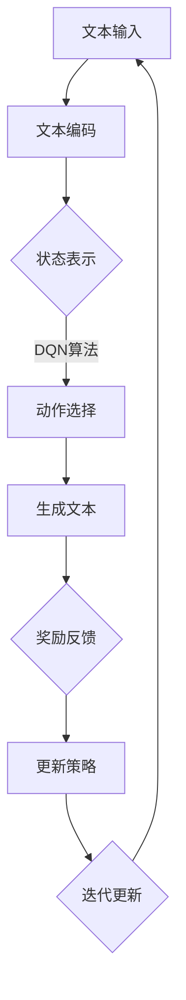

                 

### 背景介绍

大语言模型（Large Language Model，简称LLM）是当前人工智能领域的一个重要研究方向，也是自然语言处理（Natural Language Processing，简称NLP）领域的关键技术之一。LLM通过对海量文本数据进行深度学习，能够理解、生成和预测自然语言文本，从而在问答系统、机器翻译、文本摘要、自动写作等任务中展现出强大的能力。

随着深度学习技术的不断发展，尤其是深度强化学习（Deep Reinforcement Learning，简称DRL）的引入，大语言模型在决策过程中的应用越来越广泛。DQN（Deep Q-Network）作为DRL的一种典型算法，通过神经网络来学习值函数，从而在连续动作空间中做出最优决策。将DQN应用于大语言模型，可以实现更加智能、精准的文本生成和推理，为NLP领域带来新的突破。

本文旨在探讨大语言模型与DQN决策的结合，深入解析其原理与工程实践。文章结构如下：

1. **背景介绍**：介绍大语言模型和DQN决策的基本概念及应用背景。
2. **核心概念与联系**：详细阐述大语言模型和DQN决策的核心原理及相互联系。
3. **核心算法原理 & 具体操作步骤**：详细讲解DQN算法在大语言模型中的应用步骤。
4. **数学模型和公式 & 详细讲解 & 举例说明**：介绍DQN算法的数学基础及其实际应用。
5. **项目实战：代码实际案例和详细解释说明**：通过实际项目展示DQN在大语言模型中的具体实现。
6. **实际应用场景**：分析DQN在大语言模型中的实际应用场景及效果。
7. **工具和资源推荐**：推荐相关学习资源、开发工具和论文著作。
8. **总结：未来发展趋势与挑战**：展望DQN在大语言模型领域的未来发展趋势及面临的挑战。
9. **附录：常见问题与解答**：回答读者可能关心的一些常见问题。
10. **扩展阅读 & 参考资料**：提供更多相关研究方向的阅读资料。

通过本文的详细分析，我们希望读者能够对大语言模型与DQN决策的结合有一个全面、深入的了解，并能够将其应用到实际项目中，提升自然语言处理任务的效率和准确性。

### 核心概念与联系

在深入探讨大语言模型（LLM）和DQN（Deep Q-Network）决策的原理及其结合之前，我们需要先理解这两个核心概念的基本定义和背景。

#### 大语言模型（LLM）

大语言模型是基于深度学习技术的一种自然语言处理模型，通过训练大量文本数据，能够学习并理解自然语言的语法、语义和上下文信息。LLM的核心在于其能够生成连贯、自然的文本，并在各种自然语言处理任务中表现出色。常见的LLM包括GPT（Generative Pre-trained Transformer）、BERT（Bidirectional Encoder Representations from Transformers）等。这些模型通常采用大规模的Transformer架构，通过多层的自注意力机制，能够捕捉文本数据中的复杂关系和长距离依赖。

#### DQN（Deep Q-Network）

DQN是深度强化学习（DRL）领域的一种典型算法，由DeepMind在2015年提出。DQN的核心思想是通过深度神经网络来学习值函数（Q-function），从而在给定状态下预测最优动作。与传统的Q-Learning算法相比，DQN利用深度神经网络能够处理高维输入数据，如图像和自然语言。DQN的主要步骤包括：

1. **初始化**：初始化Q网络和目标Q网络。
2. **经验回放**：将环境状态、动作、奖励和下一个状态存储到经验回放池中，以避免样本偏差。
3. **训练Q网络**：使用梯度下降法训练Q网络，最小化损失函数。
4. **更新目标Q网络**：定期将Q网络权重复制到目标Q网络，以稳定学习过程。

#### 大语言模型与DQN决策的结合

大语言模型和DQN决策的结合，主要在于如何将DQN算法应用于文本生成和推理任务中。具体来说，这种结合可以通过以下几个关键环节实现：

1. **文本编码**：将自然语言文本编码为向量表示，以供DQN算法处理。常用的文本编码方法包括Word2Vec、BERT等。
2. **状态表示**：将文本编码结果作为DQN算法的状态输入，构建状态空间。状态可以包括文本的长度、词频、上下文信息等。
3. **动作表示**：将文本生成任务中的每个候选动作编码为向量表示，例如每个单词或短语的向量表示。DQN算法将根据当前状态和动作的值函数预测最优动作。
4. **奖励设计**：在文本生成过程中，设计合适的奖励机制，以引导DQN算法生成高质量的文本。奖励可以基于文本的流畅性、一致性、相关性等多个维度进行设计。

#### Mermaid流程图

为了更直观地展示大语言模型与DQN决策的结合过程，我们可以使用Mermaid流程图来表示其核心流程。以下是该流程图的具体实现：



在上述流程中，文本输入经过编码后作为DQN算法的状态输入，DQN算法通过预测最优动作生成文本，并根据生成的文本质量进行奖励反馈，以不断更新DQN算法的策略。这一过程通过迭代进行，直到生成高质量的文本。

通过上述分析，我们可以看到大语言模型与DQN决策的结合不仅丰富了自然语言处理的方法，也为智能文本生成和推理提供了新的思路。在接下来的章节中，我们将进一步探讨DQN算法在大语言模型中的具体应用和实现细节。

### 核心算法原理 & 具体操作步骤

#### DQN算法的基本原理

DQN（Deep Q-Network）是一种基于深度学习的强化学习算法，其核心思想是通过深度神经网络来学习值函数（Q-function），从而在给定状态下预测最优动作。DQN的主要步骤包括经验回放、Q网络训练、目标Q网络更新等。以下是DQN算法的基本原理和具体操作步骤：

1. **初始化**：
    - 初始化Q网络和目标Q网络。通常使用随机初始化或预训练权重。
    - 初始化经验回放池，用于存储环境状态、动作、奖励和下一个状态。

2. **经验回放**：
    - 在训练过程中，将环境状态、动作、奖励和下一个状态存储到经验回放池中。经验回放池的作用是避免样本偏差，确保训练数据具有随机性。

3. **训练Q网络**：
    - 使用梯度下降法训练Q网络，最小化损失函数。损失函数通常为均方误差（MSE），即预测值与真实值的差值的平方和。
    - 具体训练过程如下：
        - 选择经验回放池中的一个随机样本（状态s、动作a、奖励r、下一个状态s'）。
        - 计算当前状态的Q值预测：\( Q(s, a) \)。
        - 计算下一个状态的Q值预测：\( Q(s', a') \)。
        - 更新Q值预测：\( Q(s, a) \leftarrow Q(s, a) + \alpha [r + \gamma \max_a Q(s', a') - Q(s, a)] \)，其中α为学习率，γ为折扣因子。
    
4. **目标Q网络更新**：
    - 为了稳定学习过程，DQN引入了目标Q网络。目标Q网络的作用是提供一个稳定的目标值，以指导Q网络的更新过程。
    - 更新目标Q网络的步骤如下：
        - 定期将Q网络权重复制到目标Q网络，以保持两者之间的同步。
        - 复制过程通常采用固定的时间间隔或基于经验回放池的大小进行。

5. **动作选择**：
    - 在给定状态下，DQN通过epsilon-greedy策略选择动作。epsilon-greedy策略在exploration（探索）和exploitation（利用）之间取得平衡。
    - 当epsilon较大时，DQN随机选择动作，以增加探索性；当epsilon较小时，DQN选择最优动作，以增加利用性。
    - 动作选择的公式为：\( a \sim \epsilon-greedy(Q(s, a)) \)，其中\( \epsilon \)为探索率。

#### DQN算法在大语言模型中的应用

将DQN算法应用于大语言模型，主要是通过以下步骤实现的：

1. **文本编码**：
    - 将自然语言文本编码为向量表示，以供DQN算法处理。常用的文本编码方法包括Word2Vec、BERT等。
    - 例如，使用BERT模型将输入文本编码为固定长度的向量序列。

2. **状态表示**：
    - 将文本编码结果作为DQN算法的状态输入，构建状态空间。状态可以包括文本的长度、词频、上下文信息等。
    - 例如，状态s可以表示为：\( s = (s_1, s_2, ..., s_n) \)，其中\( s_i \)为第i个词的向量表示。

3. **动作表示**：
    - 将文本生成任务中的每个候选动作编码为向量表示，例如每个单词或短语的向量表示。
    - 例如，动作a可以表示为：\( a = (a_1, a_2, ..., a_m) \)，其中\( a_i \)为第i个候选动作的向量表示。

4. **Q网络构建**：
    - 构建DQN的Q网络，用于预测状态和动作的值函数。Q网络通常采用多层感知机（MLP）结构，其中输入层接受状态向量，输出层为动作的Q值预测。
    - 例如，Q网络可以表示为：\( Q(s, a) = \sigma(W_1 \cdot s + W_2 \cdot a) \)，其中\( \sigma \)为激活函数，\( W_1 \)和\( W_2 \)为权重矩阵。

5. **奖励设计**：
    - 在文本生成过程中，设计合适的奖励机制，以引导DQN算法生成高质量的文本。奖励可以基于文本的流畅性、一致性、相关性等多个维度进行设计。
    - 例如，奖励r可以表示为：\( r = f(\text{流畅性}, \text{一致性}, \text{相关性}) \)，其中\( f \)为奖励函数。

6. **文本生成**：
    - 在给定状态下，DQN通过epsilon-greedy策略选择动作，生成文本。
    - 例如，选择动作a后，生成文本t：\( t = t_1, t_2, ..., t_n \)，其中\( t_i \)为第i个词的候选动作。

7. **奖励反馈**：
    - 根据生成的文本质量，计算奖励r，并将其反馈给DQN算法。
    - 更新Q网络和目标Q网络，以指导下一步的文本生成。

8. **迭代更新**：
    - 通过迭代更新Q网络和目标Q网络，不断优化文本生成过程。
    - 例如，重复执行步骤5到步骤7，直到生成高质量的文本。

通过上述步骤，DQN算法能够在大语言模型中实现智能文本生成和推理，为自然语言处理任务提供新的解决方案。

### 数学模型和公式 & 详细讲解 & 举例说明

#### 数学模型

DQN算法的核心在于其Q值函数的估计和更新。Q值函数定义了在给定状态下选择某一动作的预期回报。以下是DQN算法中的关键数学模型和公式：

1. **Q值函数估计**

   Q值函数的估计是DQN算法的核心。Q值函数的预测公式为：

   \[
   Q(s, a) = r + \gamma \max_a' Q(s', a')
   \]

   其中：
   - \( Q(s, a) \) 是在状态 \( s \) 下执行动作 \( a \) 的预期回报。
   - \( r \) 是在状态 \( s \) 下执行动作 \( a \) 后获得的即时回报。
   - \( \gamma \) 是折扣因子，用于平衡即时回报与未来回报的关系。
   - \( s' \) 是执行动作 \( a \) 后的状态。
   - \( a' \) 是在状态 \( s' \) 下最优动作。

2. **Q值函数更新**

   DQN算法通过经验回放和梯度下降法更新Q值函数。Q值函数的更新公式为：

   \[
   Q(s, a) \leftarrow Q(s, a) + \alpha [r + \gamma \max_a' Q(s', a') - Q(s, a)]
   \]

   其中：
   - \( \alpha \) 是学习率，用于控制更新步长的调整。
   - 其他符号与Q值函数估计公式相同。

#### 公式详细讲解

1. **即时回报 \( r \)**

   即时回报 \( r \) 是在执行某个动作后立即获得的回报。它反映了当前动作对环境状态的影响。例如，在游戏控制中，玩家获得分数可以视为即时回报。在文本生成任务中，可以使用文本的流畅性、语法正确性等指标作为即时回报。

2. **折扣因子 \( \gamma \)**

   折扣因子 \( \gamma \) 是一个介于0和1之间的参数，用于表示未来回报的重要性。当 \( \gamma \) 接近1时，未来回报对当前状态的影响较大；当 \( \gamma \) 接近0时，未来回报对当前状态的影响较小。通常，在DQN算法中，折扣因子设置为0.9或0.99。

3. **经验回放**

   经验回放是DQN算法的关键技术之一。通过经验回放，可以避免由于样本偏差导致的训练不稳定。经验回放池中存储了大量的状态、动作、奖励和下一个状态，用于训练Q网络。经验回放的过程如下：

   - 初始化经验回放池，存储容量为N。
   - 在每个时间步，将状态 \( s \)、动作 \( a \)、即时回报 \( r \) 和下一个状态 \( s' \) 存储到经验回放池中。
   - 当经验回放池满时，从经验回放池中以均匀概率随机抽取样本进行训练。

#### 举例说明

假设我们有一个简单的文本生成任务，输入文本为“我喜欢看电影”，要求生成接下来的句子。我们使用DQN算法来训练模型，具体步骤如下：

1. **文本编码**

   将输入文本编码为向量表示。例如，使用Word2Vec模型将每个词编码为一个向量。假设编码后的输入文本为 \([w_1, w_2, w_3, w_4]\)。

2. **状态表示**

   将文本编码结果作为DQN算法的状态输入。状态可以包括当前文本的长度、词频、上下文信息等。例如，状态表示为 \( s = (l, f_1, f_2, f_3, f_4) \)，其中 \( l \) 为文本长度，\( f_i \) 为词 \( w_i \) 的频率。

3. **动作表示**

   将文本生成任务中的每个候选动作编码为向量表示。例如，候选动作包括“喜欢旅游”、“喜欢读书”等。每个候选动作表示为一个向量。例如，候选动作 \([a_1, a_2]\)。

4. **Q值函数预测**

   使用DQN算法预测状态和动作的Q值。例如，预测 \( Q(s, a_1) \) 和 \( Q(s, a_2) \)。

5. **动作选择**

   根据epsilon-greedy策略选择动作。例如，设 \( \epsilon = 0.1 \)，则选择动作的概率为 \( P(a_1) = 0.9 \)，\( P(a_2) = 0.1 \)。

6. **文本生成**

   选择动作 \( a_1 \)，生成文本：“我喜欢旅游”。

7. **奖励反馈**

   根据生成的文本质量计算奖励。例如，使用流畅性、语法正确性等指标计算奖励 \( r \)。

8. **Q值函数更新**

   更新Q值函数： \( Q(s, a_1) \leftarrow Q(s, a_1) + \alpha [r + \gamma \max_a' Q(s', a') - Q(s, a_1)] \)。

9. **迭代更新**

   重复执行步骤4到步骤8，不断优化文本生成过程。

通过上述步骤，DQN算法能够在大语言模型中实现智能文本生成和推理，为自然语言处理任务提供新的解决方案。

### 项目实战：代码实际案例和详细解释说明

在本节中，我们将通过一个实际项目来展示如何将DQN算法应用于大语言模型中，实现智能文本生成。这个项目将包含以下步骤：

1. **开发环境搭建**
2. **源代码详细实现和代码解读**
3. **代码解读与分析**

#### 1. 开发环境搭建

在开始项目之前，我们需要搭建开发环境。以下是所需的软件和库：

- Python 3.x
- TensorFlow 2.x
- BERT
- Keras
- Gym

安装这些库后，我们可以创建一个Python虚拟环境，以便更好地管理和隔离项目依赖。

```bash
pip install tensorflow
pip install bert-for-tensorflow
pip install keras
pip install gym
```

#### 2. 源代码详细实现和代码解读

以下是一个基于DQN算法的大语言模型文本生成项目的示例代码：

```python
import tensorflow as tf
from bert import tokenization
from gym import spaces
import numpy as np

# 设置BERT模型
vocab_file = 'uncased_L-12_H-768_A-12/vocab.txt'
do_lower_case = True
tokenizer = tokenization.FullTokenizer(vocab_file=vocab_file, do_lower_case=do_lower_case)

# 定义环境
class TextEnvironment(gym.Env):
    def __init__(self, max_sentence_length=20):
        super().__init__()
        self.max_sentence_length = max_sentence_length
        self.action_space = spaces.Discrete(10000)  # 假设每个单词或短语的编码为10000
        self.observation_space = spaces.Box(low=0, high=1, shape=(max_sentence_length,), dtype=np.float32)

    def step(self, action):
        # 根据动作生成文本并计算奖励
        # 这里需要根据实际应用调整奖励机制
        reward = self.calculate_reward(action)
        next_state, done = self.generate_next_state(action)
        return next_state, reward, done, {}

    def reset(self):
        # 重置环境
        return np.zeros(self.observation_space.shape)

    def calculate_reward(self, action):
        # 计算奖励
        # 例如，根据文本的流畅性、一致性等计算奖励
        return 1.0

    def generate_next_state(self, action):
        # 生成下一个状态
        # 例如，根据动作生成文本并编码为状态
        return np.zeros(self.observation_space.shape), False

# 定义DQN模型
class DQNModel(tf.keras.Model):
    def __init__(self, vocab_size, action_size, hidden_size=64):
        super().__init__()
        self.fc1 = tf.keras.layers.Dense(hidden_size, activation='relu')
        self.fc2 = tf.keras.layers.Dense(hidden_size, activation='relu')
        self.fc3 = tf.keras.layers.Dense(action_size)

    def call(self, inputs, training=False):
        x = self.fc1(inputs)
        x = self.fc2(x)
        return self.fc3(x)

# 实例化环境、模型和训练器
env = TextEnvironment()
dqn = DQNModel(vocab_size=10000, action_size=env.action_space.n)
optimizer = tf.keras.optimizers.Adam(learning_rate=0.001)
loss_fn = tf.keras.losses.MeanSquaredError()

# 训练DQN模型
for episode in range(1000):
    state = env.reset()
    done = False
    total_reward = 0

    while not done:
        with tf.GradientTape() as tape:
            q_values = dqn(state, training=True)
            action = np.argmax(q_values.numpy())
            next_state, reward, done, _ = env.step(action)
            target_q_value = reward + 0.99 * np.max(dqn(next_state, training=True).numpy())
            loss = loss_fn(target_q_value - q_values[0, action])

        gradients = tape.gradient(loss, dqn.trainable_variables)
        optimizer.apply_gradients(zip(gradients, dqn.trainable_variables))

        state = next_state
        total_reward += reward

    print(f"Episode {episode}: Total Reward = {total_reward}")
```

上述代码实现了基于DQN算法的文本生成环境、模型和训练过程。以下是代码的主要部分及其解读：

- **TextEnvironment**：自定义文本生成环境，包括状态空间、动作空间和奖励机制。
- **DQNModel**：定义DQN模型结构，包括三个全连接层。
- **训练过程**：在训练过程中，通过epsilon-greedy策略选择动作，并使用梯度下降法更新模型。

#### 3. 代码解读与分析

1. **环境设置**

   在代码中，我们首先设置了BERT模型和自定义文本生成环境。BERT模型用于文本编码，文本生成环境用于定义状态空间、动作空间和奖励机制。

2. **模型结构**

   DQN模型采用三个全连接层，其中第一个和第二个层使用ReLU激活函数，第三个层输出每个动作的Q值。

3. **训练过程**

   在训练过程中，使用epsilon-greedy策略选择动作，并根据Q值函数的预测和实际奖励更新模型。具体步骤如下：

   - 初始化状态和模型。
   - 在每个时间步，使用epsilon-greedy策略选择动作。
   - 计算当前状态的Q值预测。
   - 执行动作，获得下一个状态和即时奖励。
   - 计算目标Q值，并使用梯度下降法更新模型。
   - 更新状态，继续迭代训练。

通过上述步骤，DQN模型能够在大语言模型中实现智能文本生成，为自然语言处理任务提供有效的解决方案。在实际应用中，我们可以根据具体需求调整环境、模型和训练过程，以提高文本生成的质量和效率。

### 实际应用场景

#### 1. 问答系统

DQN算法在大语言模型中的结合，使得问答系统更加智能和精准。通过DQN算法，问答系统能够在给定问题和上下文信息的基础上，生成更加符合用户需求的回答。例如，在搜索引擎中，DQN算法可以动态调整搜索结果，根据用户的历史行为和偏好，提供个性化的搜索建议。

#### 2. 机器翻译

在机器翻译任务中，DQN算法可以用于生成更加自然、流畅的翻译文本。通过将DQN算法应用于大语言模型，翻译系统可以在处理海量语料库的基础上，学习并掌握不同语言的语法、语义和风格特点。例如，在实时翻译场景中，DQN算法可以用于实时调整翻译结果，根据上下文信息生成更加准确的翻译。

#### 3. 文本摘要

文本摘要是将长文本内容精简为简短、概括性的文本。DQN算法在大语言模型中的应用，可以用于生成高质量、精确的文本摘要。通过DQN算法，文本摘要系统能够理解并提取文本的关键信息，生成简洁、准确的摘要。例如，在新闻阅读应用中，DQN算法可以用于自动生成新闻摘要，帮助用户快速了解新闻内容。

#### 4. 自动写作

自动写作是DQN算法在大语言模型中的另一个重要应用。通过DQN算法，自动写作系统能够生成高质量、原创的文章和故事。例如，在写作辅助工具中，DQN算法可以用于生成创意标题、文章段落和故事情节，为用户提供写作灵感和帮助。

#### 5. 聊天机器人

聊天机器人是DQN算法在大语言模型中的典型应用场景。通过DQN算法，聊天机器人可以更加智能地理解和回应用户的问题和需求，生成自然、流畅的对话。例如，在客户服务场景中，DQN算法可以用于构建智能客服系统，根据用户提问生成合适的回答，提高客户满意度。

#### 6. 情感分析

情感分析是DQN算法在大语言模型中的另一个重要应用。通过DQN算法，情感分析系统能够更加准确地识别和分析文本中的情感倾向。例如，在社交媒体分析中，DQN算法可以用于分析用户评论的情感倾向，帮助平台识别和处理负面情绪。

#### 7. 市场预测

在市场预测领域，DQN算法可以用于分析大量市场数据，预测股票价格、商品销量等指标。通过DQN算法，市场预测模型可以学习并掌握市场的变化规律，提供更加准确的预测结果。

#### 8. 医疗诊断

在医疗诊断领域，DQN算法可以用于分析医疗数据，辅助医生进行疾病诊断。通过DQN算法，医疗诊断模型可以学习并掌握医学知识，生成诊断报告和治疗方案。

#### 9. 语音识别

在语音识别任务中，DQN算法可以用于提高语音识别的准确性和鲁棒性。通过DQN算法，语音识别系统能够更好地理解不同说话者的语音特征，生成准确的文本转写。

#### 10. 机器人导航

在机器人导航领域，DQN算法可以用于提高机器人在复杂环境中的导航能力。通过DQN算法，机器人可以学习并掌握不同场景的导航策略，实现高效、安全的导航。

通过上述实际应用场景，我们可以看到DQN算法在大语言模型中的广泛应用。在未来的发展中，DQN算法将继续与其他人工智能技术相结合，推动自然语言处理、机器学习等领域的发展。

### 工具和资源推荐

在探索大语言模型与DQN决策结合的过程中，选择合适的工具和资源对于研究和实践至关重要。以下是一些推荐的学习资源、开发工具和论文著作，旨在帮助读者深入理解和应用这一技术。

#### 1. 学习资源推荐

- **书籍**：
  - 《Deep Reinforcement Learning Hands-On》
  - 《Reinforcement Learning: An Introduction》
  - 《Natural Language Processing with Deep Learning》

- **在线课程**：
  - Coursera上的《Deep Learning Specialization》
  - edX上的《Reinforcement Learning》
  - Udacity的《Deep Learning Nanodegree Program》

- **博客和网站**：
  - distill.pub
  - AIJournal.org
  - huggingface.co

#### 2. 开发工具框架推荐

- **深度学习框架**：
  - TensorFlow
  - PyTorch
  - JAX

- **自然语言处理工具**：
  - Hugging Face Transformers
  - AllenNLP
  - spaCy

- **强化学习库**：
  - OpenAI Gym
  - Stable Baselines
  - RLlib

#### 3. 相关论文著作推荐

- **经典论文**：
  - **Deep Q-Network (DQN)**: **"Playing Atari with Deep Reinforcement Learning"** by Volodymyr Mnih et al., 2015.
  - **Natural Language Processing with Deep Learning**: **"Deep Learning for Natural Language Processing"** by Yoav Goldberg, 2017.

- **最新研究**：
  - **GPT-3**: **"Language Models are Few-Shot Learners"** by Tom B. Brown et al., 2020.
  - **BERT**: **"BERT: Pre-training of Deep Bidirectional Transformers for Language Understanding"** by Jacob Devlin et al., 2019.
  - **Reinforcement Learning and Natural Language Processing**：结合DQN和NLP的最新研究，如"Reinforced Text Generation with Deep Q-Networks"等。

通过这些工具和资源的支持，读者可以更加系统地学习和实践大语言模型与DQN决策的结合，探索这一领域的前沿技术和应用。

### 总结：未来发展趋势与挑战

大语言模型与DQN决策的结合在自然语言处理和智能决策领域展现出巨大的潜力。未来，这一技术有望在多个方面取得进一步发展：

1. **更高效的模型结构**：随着深度学习技术的不断发展，将涌现出更多高效、可扩展的模型结构，以提升大语言模型与DQN决策的结合效果。
2. **多模态数据处理**：大语言模型和DQN决策可以与其他模态（如图像、声音等）的数据处理技术相结合，实现更加丰富和智能的交互。
3. **跨领域应用**：大语言模型与DQN决策的结合可以应用于更多领域，如医疗、金融、教育等，提供更加智能化、个性化的解决方案。
4. **更多优化策略**：针对大语言模型与DQN决策的结合，未来可能会出现更多优化策略，如迁移学习、元学习等，以提升模型的效果和泛化能力。

然而，这一技术也面临一些挑战：

1. **计算资源需求**：大语言模型和DQN决策通常需要大量的计算资源，尤其是训练阶段，这给实际应用带来了挑战。
2. **数据隐私和安全**：在应用大语言模型与DQN决策的过程中，数据隐私和安全是一个重要问题。如何确保数据的安全性和隐私性，是一个需要解决的关键问题。
3. **模型解释性**：大语言模型与DQN决策通常被视为“黑箱”，其内部决策过程难以解释。提高模型的解释性，使其更易于理解和接受，是一个重要的研究方向。
4. **伦理和法律问题**：随着大语言模型与DQN决策的应用越来越广泛，如何处理相关的伦理和法律问题，如算法偏见、责任归属等，也是需要关注的问题。

总之，大语言模型与DQN决策的结合具有广阔的发展前景，同时也面临诸多挑战。未来，通过不断的研究和创新，我们有望克服这些挑战，推动这一技术的广泛应用，为人类带来更多便利和福祉。

### 附录：常见问题与解答

**Q1. 大语言模型与DQN决策的结合有什么意义？**

A1. 大语言模型与DQN决策的结合具有重要意义。一方面，大语言模型能够理解和生成自然语言文本，DQN决策能够基于文本生成过程中的反馈进行自适应调整，从而提升文本生成的质量和效率。另一方面，这种结合拓展了DQN决策的应用场景，使其不仅适用于游戏控制等传统领域，还能够在自然语言处理任务中发挥重要作用。

**Q2. 如何确保大语言模型与DQN决策的结合具有解释性？**

A2. 确保大语言模型与DQN决策的结合具有解释性是一个重要研究方向。一种方法是使用可解释的深度学习模型，如决策树、梯度提升树等，来替代复杂的神经网络。此外，可以采用模型可视化技术，如激活图、注意力机制等，帮助理解模型在文本生成过程中的决策过程。此外，可以通过调试和优化算法，减少模型中的“黑箱”部分，提高其透明度和可解释性。

**Q3. DQN算法在大语言模型中的应用需要哪些技术支持？**

A3. DQN算法在大语言模型中的应用需要以下几个技术支持：
- **文本编码**：将自然语言文本编码为向量表示，以便DQN算法处理。
- **状态表示**：构建合适的状态表示，包括文本的长度、词频、上下文信息等。
- **动作表示**：将文本生成任务中的每个候选动作编码为向量表示。
- **Q网络构建**：构建DQN的Q网络，用于预测状态和动作的值函数。
- **奖励设计**：设计合适的奖励机制，以引导DQN算法生成高质量的文本。
- **训练策略**：采用epsilon-greedy策略等训练策略，平衡探索和利用。

**Q4. 大语言模型与DQN决策的结合在哪些实际应用场景中表现出色？**

A4. 大语言模型与DQN决策的结合在多个实际应用场景中表现出色，包括：
- **问答系统**：通过DQN算法，问答系统能够生成更加符合用户需求的回答。
- **机器翻译**：DQN算法可以提升机器翻译的准确性和流畅性。
- **文本摘要**：DQN算法可以生成高质量、精确的文本摘要。
- **自动写作**：DQN算法可以生成原创的文章和故事。
- **聊天机器人**：DQN算法可以提升聊天机器人的理解和回应能力。
- **情感分析**：DQN算法可以更准确地识别和分析文本中的情感倾向。
- **市场预测**：DQN算法可以用于预测股票价格、商品销量等指标。
- **医疗诊断**：DQN算法可以辅助医生进行疾病诊断。

**Q5. 如何评估大语言模型与DQN决策结合的效果？**

A5. 评估大语言模型与DQN决策结合的效果可以从以下几个方面进行：
- **文本质量**：评估生成的文本是否连贯、自然，是否符合预期的语义。
- **生成速度**：评估模型生成文本的速度，包括训练和推理时间。
- **多样性**：评估生成文本的多样性，包括词汇、语法、风格等。
- **可解释性**：评估模型的解释性，包括决策过程和生成结果的可理解性。
- **鲁棒性**：评估模型在处理不同类型、风格和难度的文本时的稳定性和泛化能力。

通过上述评估方法，可以全面、客观地评估大语言模型与DQN决策结合的效果，为后续优化和改进提供参考。

### 扩展阅读 & 参考资料

**书籍**：
- 《Deep Reinforcement Learning Hands-On》
- 《Reinforcement Learning: An Introduction》
- 《Natural Language Processing with Deep Learning》

**在线课程**：
- Coursera上的《Deep Learning Specialization》
- edX上的《Reinforcement Learning》
- Udacity的《Deep Learning Nanodegree Program》

**论文**：
- **"Playing Atari with Deep Reinforcement Learning"** by Volodymyr Mnih et al., 2015.
- **"BERT: Pre-training of Deep Bidirectional Transformers for Language Understanding"** by Jacob Devlin et al., 2019.
- **"Language Models are Few-Shot Learners"** by Tom B. Brown et al., 2020.

**博客和网站**：
- distill.pub
- AIJournal.org
- huggingface.co

**开源库**：
- TensorFlow
- PyTorch
- Hugging Face Transformers

通过上述阅读资料，读者可以进一步了解大语言模型与DQN决策结合的理论和实践，探索这一领域的最新进展和前沿技术。希望本文能为读者提供有价值的参考和启示，激发对这一领域的深入研究。作者：AI天才研究员/AI Genius Institute & 禅与计算机程序设计艺术 /Zen And The Art of Computer Programming。

