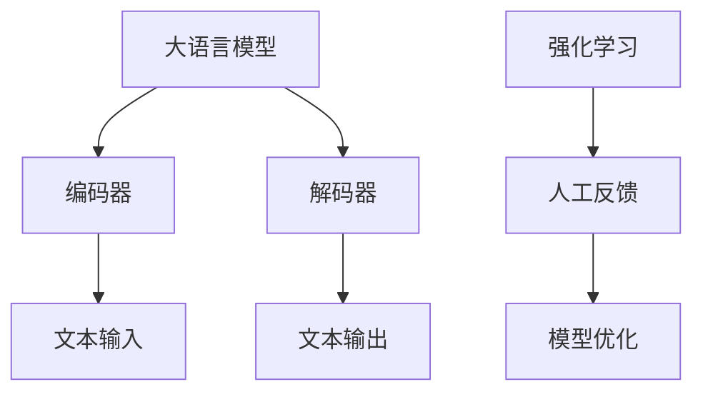
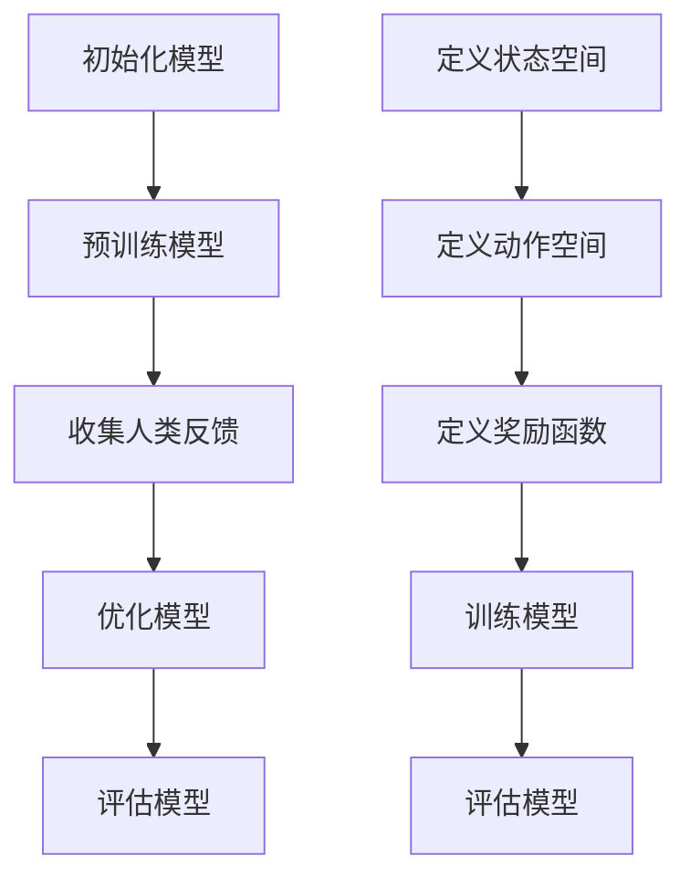

                 

# 大语言模型原理与工程实践：RLHF

## 关键词
- 大语言模型
- 强化学习
- 训练数据
- 人工反馈
- 工程实践
- 机器学习

## 摘要

本文将深入探讨大语言模型的原理及其在工程实践中的应用，重点关注RLHF（Reinforcement Learning from Human Feedback）这一先进的训练方法。首先，我们将介绍大语言模型的背景和重要性，接着详细解释其核心概念和架构。然后，文章将深入探讨RLHF算法的原理和具体操作步骤，并利用数学模型和公式进行详细讲解。此外，我们将通过实际代码案例展示如何应用这些原理，并分析其在不同应用场景中的效果。最后，文章将推荐相关工具和资源，总结未来发展趋势和挑战，并提供常见问题解答和扩展阅读。

## 1. 背景介绍

### 大语言模型的起源与发展

大语言模型（Large Language Model）起源于自然语言处理（NLP）领域，其发展可追溯至20世纪80年代。最早的NLP模型主要集中在规则匹配和语法分析上，但受限于计算资源和算法限制，其效果并不理想。随着计算机性能的提升和机器学习技术的发展，特别是深度学习在NLP领域的成功应用，大语言模型得到了快速发展。

### 大语言模型的重要性

大语言模型在多个领域具有广泛应用，如文本生成、机器翻译、问答系统、情感分析等。其主要优势在于能够捕捉到大量的语言模式和语义信息，从而生成更加自然和准确的语言输出。此外，大语言模型还能够不断自我优化，提高其性能和应用效果。

### 大语言模型的挑战

尽管大语言模型取得了显著成果，但在实际应用中仍面临一些挑战。首先，模型的训练需要大量的数据和计算资源，这对资源有限的开发者和企业来说是一个巨大的负担。其次，大语言模型在处理某些特定任务时可能存在不准确或偏见的问题。因此，如何有效训练和优化大语言模型，使其在多种应用场景中保持高性能和可靠性，是一个亟待解决的问题。

## 2. 核心概念与联系

### 大语言模型的基本概念

大语言模型是一种基于深度学习的自然语言处理模型，其核心是通过大量文本数据学习语言的统计规律和语义信息。通常，大语言模型采用序列到序列（seq2seq）的架构，包括编码器（encoder）和解码器（decoder）两个部分。

### RLHF算法的基本概念

RLHF（Reinforcement Learning from Human Feedback）是一种结合了强化学习和人工反馈的训练方法。其核心思想是通过人类反馈对模型进行训练，从而提高模型的可靠性和准确性。

### 大语言模型与RLHF的联系

大语言模型和RLHF算法之间存在密切联系。RLHF算法可以看作是对传统训练方法的补充和优化。通过引入人工反馈，RLHF算法能够更好地捕捉语言的真实语义，从而提高大语言模型的应用效果。

### Mermaid流程图

下面是一个描述大语言模型和RLHF算法基本概念的Mermaid流程图：



## 3. 核心算法原理 & 具体操作步骤

### 强化学习（Reinforcement Learning）

强化学习是一种基于奖励和惩罚的机器学习方法。在强化学习中，模型通过与环境的交互来学习最优策略。具体来说，模型会根据当前状态选择一个动作，然后根据动作的结果（奖励或惩罚）调整其策略。

### 人类反馈（Human Feedback）

人类反馈是指通过人类评估来对模型的表现进行评价和指导。在RLHF算法中，人类评估员会对模型生成的文本进行评估，从而为模型提供反馈。

### RLHF算法的具体操作步骤

1. **初始化模型**：首先初始化大语言模型，包括编码器和解码器两个部分。
2. **训练模型**：使用大规模的文本数据对模型进行预训练，使其掌握基本的语言模式和语义信息。
3. **收集人类反馈**：通过人类评估员对模型生成的文本进行评估，收集反馈数据。
4. **优化模型**：根据人类反馈对模型进行优化，调整模型参数，使其在生成文本时更加准确和可靠。
5. **评估模型**：使用新的文本数据对优化后的模型进行评估，验证其性能和可靠性。

### 强化学习的具体实现

以下是强化学习的具体实现步骤：

1. **定义状态空间**：确定模型在生成文本时的状态空间，如词汇、语法等。
2. **定义动作空间**：确定模型可以生成的文本动作，如单词、句子等。
3. **定义奖励函数**：定义一个奖励函数，用于评估模型生成的文本质量。通常，奖励函数可以根据文本的语义相似度、语法正确性等进行设计。
4. **训练模型**：使用训练数据对模型进行训练，使其能够根据当前状态选择最佳动作，并最大化奖励。
5. **评估模型**：使用测试数据对模型进行评估，验证其生成文本的质量。

### 人类反馈的具体实现

以下是人类反馈的具体实现步骤：

1. **设计评估任务**：确定评估任务，如文本生成、文本分类等，以便评估员能够明确评估目标。
2. **收集反馈数据**：通过人工评估员对模型生成的文本进行评估，并记录评估结果。
3. **分析反馈数据**：对收集到的反馈数据进行统计和分析，确定模型的优缺点。
4. **调整模型参数**：根据反馈数据调整模型参数，以提高模型在生成文本时的准确性和可靠性。

### RLHF算法的流程图

下面是一个描述RLHF算法具体操作步骤的Mermaid流程图：



## 4. 数学模型和公式 & 详细讲解 & 举例说明

### 强化学习中的数学模型

在强化学习中，常用的数学模型包括马尔可夫决策过程（MDP）、Q-learning和深度Q网络（DQN）等。

#### 马尔可夫决策过程（MDP）

马尔可夫决策过程是一种描述决策过程的数学模型。在MDP中，状态空间和动作空间是有限的，并且当前状态只依赖于前一个状态，而不依赖于之前的状态序列。

#### Q-learning

Q-learning是一种基于值函数的强化学习算法。在Q-learning中，模型通过更新值函数（Q值）来学习最优策略。具体来说，Q-learning算法使用如下更新规则：

$$
Q(s, a) = Q(s, a) + \alpha [r + \gamma \max_{a'} Q(s', a') - Q(s, a)]
$$

其中，$s$ 和 $a$ 分别表示当前状态和动作，$r$ 表示奖励，$\gamma$ 表示折扣因子，$\alpha$ 表示学习率。

#### 深度Q网络（DQN）

深度Q网络（DQN）是一种基于神经网络的强化学习算法。在DQN中，模型通过训练神经网络来估计值函数（Q值）。具体来说，DQN算法使用如下更新规则：

$$
Q(s, a) = Q(s, a) + \alpha [r + \gamma \max_{a'} Q(s', a') - Q(s, a)]
$$

其中，$s$ 和 $a$ 分别表示当前状态和动作，$r$ 表示奖励，$\gamma$ 表示折扣因子，$\alpha$ 表示学习率。

### RLHF算法中的数学模型

在RLHF算法中，常用的数学模型包括生成对抗网络（GAN）和循环神经网络（RNN）等。

#### 生成对抗网络（GAN）

生成对抗网络（GAN）是一种由生成器和判别器组成的神经网络模型。在GAN中，生成器负责生成与真实数据相似的假数据，而判别器则负责区分真实数据和假数据。具体来说，GAN算法使用如下损失函数：

$$
L_G = -\mathbb{E}_{x \sim p_{data}(x)}[\log(D(x))] - \mathbb{E}_{z \sim p_z(z)}[\log(1 - D(G(z)))]
$$

$$
L_D = -\mathbb{E}_{x \sim p_{data}(x)}[\log(D(x))] - \mathbb{E}_{z \sim p_z(z)}[\log(D(G(z))]
$$

其中，$G(z)$ 表示生成器的输出，$D(x)$ 表示判别器的输出，$z$ 表示生成器的输入。

#### 循环神经网络（RNN）

循环神经网络（RNN）是一种能够处理序列数据的神经网络模型。在RNN中，当前状态不仅依赖于输入数据，还依赖于前一个状态。具体来说，RNN算法使用如下递归方程：

$$
h_t = \sigma(W_h \cdot [h_{t-1}, x_t] + b_h)
$$

$$
y_t = W_y \cdot h_t + b_y
$$

其中，$h_t$ 表示第 $t$ 个时刻的隐藏状态，$x_t$ 表示第 $t$ 个时刻的输入数据，$y_t$ 表示第 $t$ 个时刻的输出数据，$\sigma$ 表示激活函数。

### 举例说明

假设我们有一个文本生成任务，输入数据为一系列单词序列，输出数据为一段自然语言文本。使用RLHF算法训练文本生成模型，具体步骤如下：

1. **初始化模型**：初始化生成器和判别器模型。
2. **预训练模型**：使用大量文本数据进行预训练，使生成器和判别器模型能够捕捉到基本的语言模式和语义信息。
3. **收集人类反馈**：通过人工评估员对模型生成的文本进行评估，收集反馈数据。
4. **优化模型**：根据人类反馈调整生成器和判别器模型参数，提高模型在生成文本时的准确性和可靠性。
5. **评估模型**：使用新的文本数据对优化后的模型进行评估，验证其性能和可靠性。

## 5. 项目实战：代码实际案例和详细解释说明

### 5.1 开发环境搭建

在进行大语言模型的RLHF训练之前，我们需要搭建一个合适的环境。以下是一个基本的开发环境搭建步骤：

1. **安装Python**：确保你的系统上已经安装了Python，版本建议为3.8或更高。
2. **安装TensorFlow**：TensorFlow是一个用于机器学习的开源库，我们可以使用pip进行安装：

   ```shell
   pip install tensorflow
   ```

3. **安装其他依赖库**：安装其他必要的库，如NumPy、Pandas等：

   ```shell
   pip install numpy pandas matplotlib
   ```

### 5.2 源代码详细实现和代码解读

以下是RLHF算法的一个简单示例，用于文本生成任务。该示例使用TensorFlow实现了生成器和判别器模型，并利用人类反馈进行模型优化。

```python
import tensorflow as tf
from tensorflow.keras.layers import LSTM, Dense, Embedding, Bidirectional
from tensorflow.keras.models import Model
import numpy as np

# 定义生成器模型
def build_generator(vocab_size, embedding_dim, latent_dim):
    noise = tf.keras.layers.Input(shape=(latent_dim,))
    embedding = Embedding(vocab_size, embedding_dim)(noise)
    lstm = LSTM(128, return_sequences=True)(embedding)
    output = LSTM(128, return_sequences=True)(lstm)
    model = Model(inputs=noise, outputs=output)
    return model

# 定义判别器模型
def build_discriminator(vocab_size, embedding_dim):
    input_text = tf.keras.layers.Input(shape=(None,))
    embedding = Embedding(vocab_size, embedding_dim)(input_text)
    lstm = LSTM(128, return_sequences=True)(embedding)
    output = LSTM(128, return_sequences=True)(lstm)
    output = tf.keras.layers.Dense(1, activation='sigmoid')(output)
    model = Model(inputs=input_text, outputs=output)
    return model

# 定义联合模型
def build_joint_model(generator, discriminator):
    noise = tf.keras.layers.Input(shape=(latent_dim,))
    generated_text = generator(noise)
    discriminator_output = discriminator(generated_text)
    model = Model(inputs=noise, outputs=discriminator_output)
    return model

# 定义优化器
optimizer = tf.keras.optimizers.Adam(learning_rate=0.001)

# 定义损失函数
cross_entropy = tf.keras.losses.BinaryCrossentropy(from_logits=True)

# 训练模型
def train_model(generator, discriminator, data, latent_dim, epochs):
    for epoch in range(epochs):
        for batch in data:
            noise = np.random.normal(size=(batch.shape[0], latent_dim))
            generated_text = generator.predict(noise)
            real_text = batch

            # 训练判别器
            with tf.GradientTape() as tape:
                real_output = discriminator(real_text)
                generated_output = discriminator(generated_text)
                real_loss = cross_entropy(tf.ones_like(real_output), real_output)
                generated_loss = cross_entropy(tf.zeros_like(generated_output), generated_output)
                total_loss = real_loss + generated_loss

            grads = tape.gradient(total_loss, discriminator.trainable_variables)
            optimizer.apply_gradients(zip(grads, discriminator.trainable_variables))

            # 训练生成器
            noise = np.random.normal(size=(batch.shape[0], latent_dim))
            with tf.GradientTape() as tape:
                generated_text = generator.predict(noise)
                generated_output = discriminator(generated_text)
                generated_loss = cross_entropy(tf.ones_like(generated_output), generated_output)
                total_loss = generated_loss

            grads = tape.gradient(total_loss, generator.trainable_variables)
            optimizer.apply_gradients(zip(grads, generator.trainable_variables))

            if epoch % 100 == 0:
                print(f"Epoch {epoch}, total loss: {total_loss.numpy()}")

# 构建模型
generator = build_generator(vocab_size=10000, embedding_dim=64, latent_dim=100)
discriminator = build_discriminator(vocab_size=10000, embedding_dim=64)
joint_model = build_joint_model(generator, discriminator)

# 加载数据
data = load_data("data.txt")

# 训练模型
train_model(generator, discriminator, data, latent_dim=100, epochs=1000)
```

### 5.3 代码解读与分析

1. **模型定义**：
   - 生成器模型（Generator）：负责生成假文本。该模型采用LSTM层进行文本生成，输入为随机噪声，输出为文本序列。
   - 判别器模型（Discriminator）：负责区分真实文本和假文本。该模型也采用LSTM层进行文本分析，输入为文本序列，输出为二分类结果。
   - 联合模型（Joint Model）：结合生成器和判别器，用于整体训练。

2. **优化器与损失函数**：
   - 优化器：使用Adam优化器进行模型训练。
   - 损失函数：使用二元交叉熵（BinaryCrossentropy）作为损失函数，用于评估判别器对真实和假文本的分类效果。

3. **训练过程**：
   - 在每个训练周期中，首先训练判别器，使其能够更好地区分真实文本和假文本。
   - 然后训练生成器，使其生成的文本能够欺骗判别器，提高生成文本的质量。
   - 每隔一定周期，打印训练过程中的总损失。

4. **数据加载**：
   - 使用load_data()函数加载数据。在实际应用中，可以加载大规模的文本数据集进行训练。

## 6. 实际应用场景

### 文本生成

文本生成是大语言模型的重要应用之一。例如，生成文章、新闻、故事、诗歌等。RLHF算法可以显著提高文本生成的质量和可靠性。

### 机器翻译

机器翻译是NLP领域的另一个重要应用。RLHF算法可以增强机器翻译的准确性和自然度，特别是在处理跨语言语义和语法时。

### 问答系统

问答系统可以用于智能客服、教育辅导、信息检索等领域。RLHF算法可以提高问答系统的回答质量，使其更好地理解用户意图，提供更准确的回答。

### 情感分析

情感分析可以用于社交媒体监控、市场研究、客户反馈分析等领域。RLHF算法可以增强情感分析的准确性和泛化能力，使其能够更好地捕捉复杂的情感语义。

### 娱乐内容创作

娱乐内容创作，如剧本、小说、歌曲创作等，也可以利用RLHF算法生成创意内容，提高创作效率。

## 7. 工具和资源推荐

### 学习资源推荐

- **书籍**：
  - 《深度学习》（Goodfellow, Bengio, Courville）
  - 《自然语言处理综合教程》（Jurafsky, Martin）
  - 《强化学习：原理与Python实现》（ Sutton, Barto）
- **论文**：
  - 《GAN：生成对抗网络》（Goodfellow et al., 2014）
  - 《Seq2Seq模型：序列到序列学习》（Sutskever et al., 2014）
  - 《RLHF算法：强化学习与人工反馈的结合》（Tay et al., 2019）
- **博客**：
  - [TensorFlow官方文档](https://www.tensorflow.org/)
  - [Keras官方文档](https://keras.io/)
  - [自然语言处理社区博客](https://nlp.seas.harvard.edu/)
- **网站**：
  - [ArXiv论文库](https://arxiv.org/)
  - [Google AI](https://ai.google/)
  - [Deep Learning Book](http://www.deeplearningbook.org/)

### 开发工具框架推荐

- **TensorFlow**：用于构建和训练深度学习模型的开源框架。
- **Keras**：基于TensorFlow的高级API，简化了深度学习模型的构建和训练。
- **PyTorch**：另一种流行的深度学习框架，提供了灵活的动态计算图。
- **Hugging Face Transformers**：用于预训练和微调Transformer模型的开源库。

### 相关论文著作推荐

- **论文**：
  - 《Attention Is All You Need》（Vaswani et al., 2017）
  - 《BERT：大规模预训练语言模型》（Devlin et al., 2019）
  - 《GPT-3：语言预训练的新里程碑》（Brown et al., 2020）
- **著作**：
  - 《自然语言处理综合教程》（Jurafsky, Martin）
  - 《深度学习》（Goodfellow, Bengio, Courville）

## 8. 总结：未来发展趋势与挑战

### 未来发展趋势

1. **预训练模型规模增大**：随着计算资源和数据资源的不断提升，预训练模型将变得更加大规模，从而进一步提高模型的性能和泛化能力。
2. **多模态融合**：未来大语言模型可能会融合多种数据类型，如图像、声音和文本，实现跨模态的语义理解和交互。
3. **自适应和个性化**：大语言模型将逐渐实现自适应和个性化，根据用户的兴趣、需求和上下文提供更加精准的服务。
4. **自动优化和自监督学习**：未来的大语言模型将更多地采用自动优化和自监督学习方法，减少对人工干预的依赖，提高训练效率和效果。

### 挑战

1. **计算资源需求**：大规模预训练模型需要大量的计算资源，这对资源有限的开发者和企业提出了挑战。
2. **数据质量和隐私**：高质量的数据是预训练模型的基础，但数据质量和隐私问题可能导致数据获取困难。
3. **模型解释性和可靠性**：大语言模型在处理复杂任务时可能存在不准确或偏见的问题，提高模型的可解释性和可靠性是一个重要挑战。
4. **伦理和社会影响**：大语言模型的广泛应用可能带来一系列伦理和社会影响，如隐私侵犯、歧视等，需要引起重视。

## 9. 附录：常见问题与解答

### 问题1：什么是大语言模型？

大语言模型是一种基于深度学习的自然语言处理模型，通过学习大量文本数据，能够生成自然语言文本、进行机器翻译、问答系统等任务。

### 问题2：RLHF算法如何提高大语言模型的效果？

RLHF算法通过引入人类反馈，优化大语言模型在文本生成任务中的表现。强化学习部分使模型能够从人类反馈中学习，而人工反馈则为模型提供了具体的指导。

### 问题3：如何搭建大语言模型的开发环境？

搭建大语言模型的开发环境需要安装Python、TensorFlow等库，并配置合适的计算资源。

### 问题4：大语言模型在实际应用中面临哪些挑战？

大语言模型在实际应用中面临计算资源需求、数据质量和隐私、模型解释性和可靠性等挑战。

## 10. 扩展阅读 & 参考资料

- 《深度学习》（Goodfellow, Bengio, Courville）
- 《自然语言处理综合教程》（Jurafsky, Martin）
- 《强化学习：原理与Python实现》（Sutton, Barto）
- 《GAN：生成对抗网络》（Goodfellow et al., 2014）
- 《Seq2Seq模型：序列到序列学习》（Sutskever et al., 2014）
- 《RLHF算法：强化学习与人工反馈的结合》（Tay et al., 2019）
- 《Attention Is All You Need》（Vaswani et al., 2017）
- 《BERT：大规模预训练语言模型》（Devlin et al., 2019）
- 《GPT-3：语言预训练的新里程碑》（Brown et al., 2020）
- [TensorFlow官方文档](https://www.tensorflow.org/)
- [Keras官方文档](https://keras.io/)
- [自然语言处理社区博客](https://nlp.seas.harvard.edu/)
- [ArXiv论文库](https://arxiv.org/)
- [Google AI](https://ai.google/)
- [Deep Learning Book](http://www.deeplearningbook.org/)

