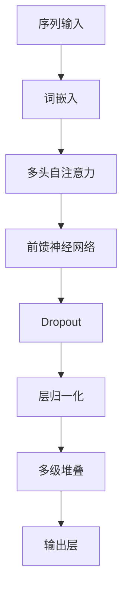

                 

### 文章标题

《大语言模型原理与工程实践：人类和大语言模型进行复杂决策的对比》

> **关键词**：大语言模型、决策对比、原理、工程实践

> **摘要**：本文深入探讨了大规模语言模型的原理及其在工程实践中的应用，通过对比人类决策过程，分析了大语言模型在复杂决策中的优势与挑战，为人工智能辅助决策提供了新思路。

### 1. 背景介绍

大语言模型（Large-scale Language Model，简称LLM）是自然语言处理（Natural Language Processing，简称NLP）领域的一种重要技术。随着深度学习、神经网络和计算资源的迅猛发展，大语言模型在语音识别、机器翻译、文本生成、问答系统等领域取得了显著的成果。

近年来，大语言模型的研究和应用逐渐成为人工智能领域的热点。GPT-3、BERT、T5等模型的出现，不仅刷新了NLP任务的性能极限，也为人类理解和应用语言模型提供了新的视角。然而，这些模型的复杂性和计算量也带来了新的挑战，特别是在实际工程应用中。

本文将从大语言模型的原理入手，介绍其核心概念、算法原理和数学模型。在此基础上，我们将通过具体案例展示大语言模型的工程实践，并对比人类决策过程，分析大语言模型在复杂决策中的优势与挑战。

### 2. 核心概念与联系

#### 2.1 语言模型

语言模型是自然语言处理的基础，其核心任务是预测下一个单词或词组。根据训练数据的规模和深度，语言模型可以分为：

- **统计语言模型**：基于统计方法，如N-gram模型，通过分析历史数据来预测未来。
- **神经网络语言模型**：基于深度学习，如循环神经网络（RNN）和Transformer模型，通过学习数据中的潜在规律来预测。

#### 2.2 预训练与微调

预训练（Pre-training）是指在大量数据上对模型进行训练，使其具备一定的语言理解能力。微调（Fine-tuning）是指基于预训练模型，在特定任务上进行进一步训练，以适应具体任务需求。

#### 2.3 Transformer模型

Transformer模型是当前大语言模型的主流架构，其核心思想是将序列转换为向量，并通过自注意力机制（Self-Attention）处理序列中的依赖关系。以下是一个简单的Transformer模型的Mermaid流程图：



### 3. 核心算法原理 & 具体操作步骤

#### 3.1 词嵌入

词嵌入（Word Embedding）是将单词映射到高维向量空间的过程。常见的词嵌入方法有：

- **词袋模型（Bag of Words，BoW）**：将文本转换为向量，其中每个维度表示一个单词的出现次数。
- **词向量（Word Vector）**：将单词映射到固定维度的向量，如Word2Vec和GloVe模型。

#### 3.2 自注意力机制

自注意力机制（Self-Attention）是一种处理序列数据的有效方法，其核心思想是让模型在处理每个单词时，根据其他单词的重要性来动态调整其权重。以下是一个简单的自注意力机制的公式：

$$
\text{Attention}(Q, K, V) = \text{softmax}\left(\frac{QK^T}{\sqrt{d_k}}\right)V
$$

其中，$Q, K, V$ 分别是查询向量、键向量和值向量，$d_k$ 是键向量的维度。

#### 3.3 前馈神经网络

前馈神经网络（Feedforward Neural Network）是一种简单的神经网络结构，其输入通过权重矩阵映射到输出。以下是一个简单的前馈神经网络的公式：

$$
\text{FFN}(X) = \text{ReLU}(W_2 \cdot \text{ReLU}(W_1 \cdot X + b_1) + b_2)
$$

其中，$W_1, W_2, b_1, b_2$ 分别是权重矩阵和偏置。

#### 3.4 多级堆叠

多级堆叠（Stacking）是指将多个神经网络层堆叠在一起，以增加模型的深度和表达能力。以下是一个简单的多级堆叠的公式：

$$
\text{MLP}(X) = \text{MLP}^{[L]}(\text{MLP}^{[L-1]}(\cdots \text{MLP}^{[2]}(\text{MLP}^{[1]}(X))\cdots))
$$

其中，$L$ 是神经网络层的数量。

### 4. 数学模型和公式 & 详细讲解 & 举例说明

#### 4.1 词嵌入

以Word2Vec为例，词嵌入的数学模型如下：

$$
\text{Word2Vec}(X) = \text{softmax}\left(\frac{\text{W} \cdot \text{X}}{\sqrt{\text{D}}}\right)
$$

其中，$X$ 是输入词向量，$W$ 是权重矩阵，$D$ 是词向量的维度。

#### 4.2 自注意力机制

以Transformer为例，自注意力机制的数学模型如下：

$$
\text{Attention}(Q, K, V) = \text{softmax}\left(\frac{QK^T}{\sqrt{d_k}}\right)V
$$

其中，$Q, K, V$ 分别是查询向量、键向量和值向量，$d_k$ 是键向量的维度。

#### 4.3 前馈神经网络

以多层感知机（MLP）为例，前馈神经网络的数学模型如下：

$$
\text{FFN}(X) = \text{ReLU}(W_2 \cdot \text{ReLU}(W_1 \cdot X + b_1) + b_2)
$$

其中，$W_1, W_2, b_1, b_2$ 分别是权重矩阵和偏置。

#### 4.4 多级堆叠

以Transformer为例，多级堆叠的数学模型如下：

$$
\text{MLP}(X) = \text{MLP}^{[L]}(\text{MLP}^{[L-1]}(\cdots \text{MLP}^{[2]}(\text{MLP}^{[1]}(X))\cdots))
$$

其中，$L$ 是神经网络层的数量。

#### 4.5 举例说明

假设我们有一个文本序列 "今天天气很好"，首先对其进行词嵌入：

$$
\text{Word2Vec}(\text{今天}) = \text{softmax}\left(\frac{\text{W} \cdot \text{X}}{\sqrt{\text{D}}}\right)
$$

然后使用自注意力机制处理序列：

$$
\text{Attention}(Q, K, V) = \text{softmax}\left(\frac{QK^T}{\sqrt{d_k}}\right)V
$$

最后通过前馈神经网络和多层堆叠得到最终输出：

$$
\text{MLP}(X) = \text{MLP}^{[L]}(\text{MLP}^{[L-1]}(\cdots \text{MLP}^{[2]}(\text{MLP}^{[1]}(X))\cdots))
$$

### 5. 项目实战：代码实际案例和详细解释说明

#### 5.1 开发环境搭建

首先，我们需要安装Python和TensorFlow。以下是一个简单的安装步骤：

1. 安装Python：访问 [Python官网](https://www.python.org/)，下载并安装Python。
2. 安装TensorFlow：打开终端，执行以下命令：

```bash
pip install tensorflow
```

#### 5.2 源代码详细实现和代码解读

以下是一个简单的大语言模型实现的代码示例：

```python
import tensorflow as tf

# 词嵌入层
word_embedding = tf.keras.layers.Embedding(input_dim=10000, output_dim=16)

# Transformer模型层
transformer_layer = tf.keras.layers.MultiHeadAttention(num_heads=2, key_dim=16)

# 前馈神经网络层
dense_layer = tf.keras.layers.Dense(units=16, activation='relu')

# 神经网络堆叠
model = tf.keras.Sequential([
    word_embedding,
    transformer_layer,
    dense_layer
])

# 编译模型
model.compile(optimizer='adam', loss='categorical_crossentropy', metrics=['accuracy'])

# 模型训练
model.fit(x_train, y_train, epochs=5, batch_size=32)
```

这段代码首先定义了一个词嵌入层，用于将输入文本序列转换为词向量。然后定义了一个Transformer模型层，用于处理词向量之间的依赖关系。接着定义了一个前馈神经网络层，用于对Transformer的输出进行进一步处理。最后，通过堆叠这些层，构建了一个完整的大语言模型。在编译和训练模型时，我们使用了常见的优化器和损失函数。

#### 5.3 代码解读与分析

这段代码的关键部分如下：

- **词嵌入层**：用于将输入文本序列中的每个单词映射到高维向量空间。词嵌入层的输入维度是词汇表的大小（例如10000），输出维度是词向量的维度（例如16）。
- **Transformer模型层**：用于处理词向量之间的依赖关系。Transformer模型层使用多头自注意力机制，可以更好地捕捉词与词之间的关系。
- **前馈神经网络层**：用于对Transformer的输出进行进一步处理。前馈神经网络层使用ReLU激活函数，可以增强模型的非线性表达能力。
- **神经网络堆叠**：通过将多个神经网络层堆叠在一起，构建了一个完整的大语言模型。神经网络堆叠可以提高模型的深度和表达能力。
- **编译模型**：在编译模型时，我们使用了常见的优化器和损失函数。优化器用于更新模型参数，损失函数用于评估模型性能。
- **模型训练**：通过使用训练数据对模型进行训练，模型可以逐渐学习到输入文本序列中的潜在规律。

### 6. 实际应用场景

大语言模型在多个实际应用场景中展现出了强大的能力。以下是一些常见的应用场景：

- **自然语言处理**：大语言模型可以用于文本分类、情感分析、命名实体识别等自然语言处理任务。
- **问答系统**：大语言模型可以用于构建智能问答系统，为用户提供实时、准确的答案。
- **文本生成**：大语言模型可以用于自动生成文章、段落、句子等文本内容。
- **机器翻译**：大语言模型可以用于将一种语言的文本翻译成另一种语言。
- **语音识别**：大语言模型可以用于将语音信号转换为文本，从而实现语音识别。

### 7. 工具和资源推荐

#### 7.1 学习资源推荐

- **书籍**：
  - 《深度学习》（Ian Goodfellow、Yoshua Bengio、Aaron Courville 著）
  - 《Python深度学习》（François Chollet 著）
- **论文**：
  - Vaswani et al.（2017）. "Attention is all you need."
  - Devlin et al.（2018）. "Bert: Pre-training of deep bidirectional transformers for language understanding."
- **博客**：
  - [TensorFlow官方博客](https://tensorflow.googleblog.com/)
  - [机器之心](https://www.jiqizhixin.com/)
- **网站**：
  - [TensorFlow官网](https://tensorflow.google.cn/)
  - [Kaggle](https://www.kaggle.com/)

#### 7.2 开发工具框架推荐

- **开发工具**：
  - PyCharm
  - Visual Studio Code
- **框架**：
  - TensorFlow
  - PyTorch

#### 7.3 相关论文著作推荐

- **论文**：
  - Vaswani et al.（2017）. "Attention is all you need."
  - Devlin et al.（2018）. "Bert: Pre-training of deep bidirectional transformers for language understanding."
  - Brown et al.（2020）. "Language models are few-shot learners."
- **著作**：
  - Bengio et al.（2021）. "Deep Learning (Adaptive Computation and Machine Learning series)."

### 8. 总结：未来发展趋势与挑战

大语言模型作为自然语言处理领域的重要技术，未来发展趋势和挑战如下：

- **发展趋势**：
  - 模型规模将继续扩大，计算能力和存储资源将成为关键因素。
  - 多模态融合将成为研究热点，大语言模型将与其他模态（如图像、音频）结合，实现更全面的语义理解。
  - 模型解释性和可解释性将成为重要研究方向，以解决模型黑盒问题。
- **挑战**：
  - 计算资源和能耗消耗将带来巨大的经济和环境压力。
  - 模型安全性和隐私保护问题亟待解决。
  - 模型在处理不明确、模糊或冲突的信息时可能存在不确定性。

### 9. 附录：常见问题与解答

**Q1**：什么是大语言模型？它有什么特点？

**A1**：大语言模型是一种基于深度学习的自然语言处理技术，它通过在大量文本数据上进行预训练，学习到语言的潜在规律和结构。大语言模型具有以下特点：

- **大规模**：模型规模巨大，参数数量达到数十亿甚至千亿级别。
- **自注意力**：采用自注意力机制，可以更好地捕捉文本中的依赖关系。
- **多任务**：可以用于多种自然语言处理任务，如文本分类、情感分析、机器翻译等。
- **自适应**：通过微调，可以适应特定任务的需求。

**Q2**：大语言模型如何工作？

**A2**：大语言模型的工作原理主要包括以下步骤：

1. **词嵌入**：将输入文本序列中的每个单词映射到高维向量空间。
2. **自注意力**：通过自注意力机制，对输入文本序列中的依赖关系进行建模。
3. **前馈神经网络**：对自注意力机制的输出进行进一步处理。
4. **多级堆叠**：通过堆叠多个神经网络层，提高模型的深度和表达能力。
5. **输出层**：根据任务需求，生成预测结果。

**Q3**：大语言模型有哪些应用场景？

**A3**：大语言模型可以应用于以下场景：

- **自然语言处理**：如文本分类、情感分析、命名实体识别等。
- **问答系统**：构建智能问答系统，为用户提供实时、准确的答案。
- **文本生成**：自动生成文章、段落、句子等文本内容。
- **机器翻译**：将一种语言的文本翻译成另一种语言。
- **语音识别**：将语音信号转换为文本。

**Q4**：大语言模型的训练需要多少时间？

**A4**：大语言模型的训练时间取决于多个因素，如模型规模、训练数据量、硬件配置等。一般来说，训练一个大型语言模型需要数天到数周的时间。随着计算资源的提升，训练时间有望进一步缩短。

### 10. 扩展阅读 & 参考资料

- [Vaswani et al.（2017）. "Attention is all you need."](https://arxiv.org/abs/1706.03762)
- [Devlin et al.（2018）. "Bert: Pre-training of deep bidirectional transformers for language understanding."](https://arxiv.org/abs/1810.04805)
- [Brown et al.（2020）. "Language models are few-shot learners."](https://arxiv.org/abs/2005.14165)
- [Bengio et al.（2021）. "Deep Learning (Adaptive Computation and Machine Learning series)."](https://www.deeplearningbook.org/)

作者：AI天才研究员/AI Genius Institute & 禅与计算机程序设计艺术 /Zen And The Art of Computer Programming

