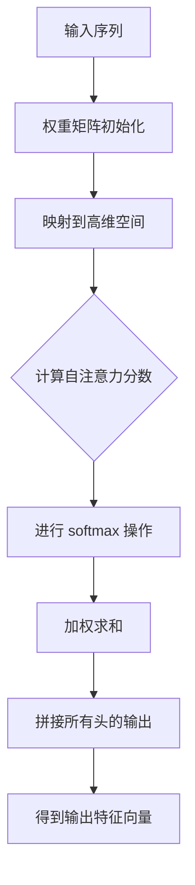

                 

# 大语言模型原理与工程实践：多头自注意力模块

## 关键词：大语言模型，自注意力模块，工程实践，多头注意力，深度学习，神经网络，语义理解

## 摘要：

本文将深入探讨大语言模型中的多头自注意力模块，从核心概念、算法原理、数学模型到实际应用场景进行全方位解析。我们将通过一系列实例和项目实战，详细解读自注意力模块在语言处理任务中的具体实现，并探讨其在工程实践中的优势和挑战。通过本文的学习，读者将对大语言模型和自注意力机制有更为深入的理解，从而更好地应用于实际的工程项目中。

## 1. 背景介绍

随着深度学习技术的不断发展，神经网络在各个领域都取得了显著的成果。特别是在自然语言处理（NLP）领域，深度学习模型如循环神经网络（RNN）、长短时记忆网络（LSTM）和门控循环单元（GRU）等，已经在文本分类、情感分析、机器翻译等任务中取得了突破性的进展。然而，这些传统模型在处理长文本时存在一定的局限性，无法充分捕捉文本中的长距离依赖关系。

为了解决这一问题，自注意力机制（Self-Attention）被提出，并迅速成为NLP领域的核心技术之一。自注意力机制通过引入注意力机制，使得模型能够动态地学习文本中各个位置之间的依赖关系，从而在处理长文本任务时表现出更高的性能。基于自注意力机制的 Transformer 模型在机器翻译、文本生成等任务中取得了显著的成果，推动了 NLP 领域的快速发展。

本文将重点介绍大语言模型中的多头自注意力模块，分析其原理、实现方法和应用场景，帮助读者深入理解自注意力机制在实际工程中的应用价值。

## 2. 核心概念与联系

### 2.1 注意力机制

注意力机制（Attention Mechanism）是一种在序列模型中用于捕捉序列中不同位置之间依赖关系的机制。它通过为序列中的每个元素分配权重，使得模型能够关注到序列中的关键信息，从而提高模型的性能。注意力机制可以分为三类：全局注意力、局部注意力和自注意力。

- **全局注意力**：全局注意力机制将整个序列视为一个整体，为序列中的每个元素分配相同的权重。这种机制在处理长文本时容易导致信息丢失，难以捕捉长距离依赖关系。
- **局部注意力**：局部注意力机制将注意力范围限制在序列的某个局部区域，通过为序列中的每个子序列分配权重，从而提高模型对局部信息的关注程度。然而，局部注意力机制在处理长距离依赖关系时仍存在一定的局限性。
- **自注意力**：自注意力机制是一种基于序列的注意力机制，它将序列中的每个元素视为潜在的特征向量，通过计算这些特征向量之间的相似度，为每个元素分配权重。自注意力机制可以动态地学习序列中不同元素之间的依赖关系，从而在处理长文本任务时表现出更高的性能。

### 2.2 Transformer 模型

Transformer 模型是一种基于自注意力机制的深度学习模型，由 Vaswani 等人于 2017 年提出。Transformer 模型通过引入多头自注意力机制，使得模型能够在处理长文本时捕捉长距离依赖关系，并在机器翻译、文本生成等任务中取得了显著的成果。

Transformer 模型由编码器（Encoder）和解码器（Decoder）两部分组成。编码器负责将输入序列编码为潜在的特征向量，解码器则负责将特征向量解码为输出序列。在编码器和解码器中，自注意力模块（Self-Attention Module）和前馈神经网络（Feedforward Neural Network）交替出现，形成一种递归的编码解码结构。

### 2.3 多头自注意力模块

多头自注意力模块（Multi-Head Self-Attention Module）是 Transformer 模型中的核心组件，它通过将自注意力机制扩展到多个头（Head），从而提高了模型的表示能力。在多头自注意力模块中，输入序列被划分为多个子序列，每个子序列分别通过自注意力机制进行加权求和，最终得到一个表示输入序列的全局特征向量。

多头自注意力模块的实现如下：

1. 输入序列：\(x = [x_1, x_2, \ldots, x_n]\)
2. 初始化权重矩阵：\(W = [W_1, W_2, \ldots, W_h]\)，其中 \(h\) 表示头的数量
3. 将输入序列映射到高维空间：\(x' = [x_1', x_2', \ldots, x_n'] = Wx\)
4. 对于每个头 \(h\)，计算自注意力分数：\(score_h = x'x'^T\)
5. 对自注意力分数进行 softmax 操作，得到权重向量：\(weight_h = \text{softmax}(score_h)\)
6. 将权重向量与输入序列进行加权求和，得到输出特征向量：\(output_h = weight_h x'\)
7. 将所有头的输出特征向量进行拼接，得到最终的输出特征向量：\(output = [output_1, output_2, \ldots, output_h]\)

### 2.4 Mermaid 流程图

下面是一个多头自注意力模块的 Mermaid 流程图：



## 3. 核心算法原理 & 具体操作步骤

### 3.1 自注意力机制原理

自注意力机制是一种基于点积注意力机制的注意力机制。在自注意力机制中，输入序列中的每个元素通过计算与其他元素之间的相似度，得到一个权重向量。这个权重向量表示了输入序列中每个元素在生成输出序列时的贡献程度。通过加权求和，模型可以学习到输入序列中不同元素之间的依赖关系。

自注意力机制的数学表示如下：

1. 输入序列：\(x = [x_1, x_2, \ldots, x_n]\)
2. 初始化权重矩阵：\(W = [W_1, W_2, \ldots, W_h]\)，其中 \(h\) 表示头的数量
3. 将输入序列映射到高维空间：\(x' = [x_1', x_2', \ldots, x_n'] = Wx\)
4. 对于每个头 \(h\)，计算自注意力分数：\(score_h = x'x'^T\)
5. 对自注意力分数进行 softmax 操作，得到权重向量：\(weight_h = \text{softmax}(score_h)\)
6. 将权重向量与输入序列进行加权求和，得到输出特征向量：\(output_h = weight_h x'\)
7. 将所有头的输出特征向量进行拼接，得到最终的输出特征向量：\(output = [output_1, output_2, \ldots, output_h]\)

### 3.2 多头自注意力机制原理

多头自注意力机制是对自注意力机制的扩展，通过引入多个头（Head），提高了模型的表示能力。在多头自注意力机制中，每个头独立地计算自注意力分数，并生成对应的输出特征向量。最后，将这些输出特征向量拼接起来，得到最终的输出特征向量。

多头自注意力机制的数学表示如下：

1. 输入序列：\(x = [x_1, x_2, \ldots, x_n]\)
2. 初始化权重矩阵：\(W = [W_1, W_2, \ldots, W_h]\)，其中 \(h\) 表示头的数量
3. 将输入序列映射到高维空间：\(x' = [x_1', x_2', \ldots, x_n'] = Wx\)
4. 对于每个头 \(h\)，计算自注意力分数：\(score_h = x'x'^T\)
5. 对自注意力分数进行 softmax 操作，得到权重向量：\(weight_h = \text{softmax}(score_h)\)
6. 将权重向量与输入序列进行加权求和，得到输出特征向量：\(output_h = weight_h x'\)
7. 将所有头的输出特征向量进行拼接，得到最终的输出特征向量：\(output = [output_1, output_2, \ldots, output_h]\)

### 3.3 具体操作步骤

以一个三头自注意力模块为例，具体操作步骤如下：

1. 输入序列：\(x = [x_1, x_2, \ldots, x_n]\)
2. 初始化权重矩阵：\(W = [W_1, W_2, W_3]\)
3. 将输入序列映射到高维空间：\(x' = [x_1', x_2', \ldots, x_n'] = Wx\)
4. 对于每个头 \(h\)（\(h = 1, 2, 3\)），计算自注意力分数：\(score_h = x'x'^T\)
5. 对自注意力分数进行 softmax 操作，得到权重向量：\(weight_h = \text{softmax}(score_h)\)
6. 将权重向量与输入序列进行加权求和，得到输出特征向量：\(output_h = weight_h x'\)
7. 将所有头的输出特征向量进行拼接，得到最终的输出特征向量：\(output = [output_1, output_2, output_3]\)

### 3.4 Mermaid 流程图

下面是一个三头自注意力模块的 Mermaid 流程图：

```mermaid
graph TD
    A[输入序列] --> B[权重矩阵初始化]
    B --> C[映射到高维空间]
    C --> D{计算自注意力分数 (h=1)}
    D --> E[进行 softmax 操作 (h=1)]
    E --> F[加权求和 (h=1)]
    C --> G{计算自注意力分数 (h=2)}
    G --> H[进行 softmax 操作 (h=2)]
    H --> I[加权求和 (h=2)]
    C --> J{计算自注意力分数 (h=3)}
    J --> K[进行 softmax 操作 (h=3)]
    K --> L[加权求和 (h=3)]
    F --> M[拼接输出特征向量]
    I --> M
    J --> M
    M --> N[得到最终输出特征向量]
```

## 4. 数学模型和公式 & 详细讲解 & 举例说明

### 4.1 数学模型

多头自注意力模块的数学模型主要包括以下几个部分：

1. 输入序列：\(x = [x_1, x_2, \ldots, x_n]\)
2. 初始化权重矩阵：\(W = [W_1, W_2, \ldots, W_h]\)，其中 \(h\) 表示头的数量
3. 将输入序列映射到高维空间：\(x' = [x_1', x_2', \ldots, x_n'] = Wx\)
4. 对于每个头 \(h\)，计算自注意力分数：\(score_h = x'x'^T\)
5. 对自注意力分数进行 softmax 操作，得到权重向量：\(weight_h = \text{softmax}(score_h)\)
6. 将权重向量与输入序列进行加权求和，得到输出特征向量：\(output_h = weight_h x'\)
7. 将所有头的输出特征向量进行拼接，得到最终的输出特征向量：\(output = [output_1, output_2, \ldots, output_h]\)

### 4.2 公式

多头自注意力模块的数学公式如下：

$$
x' = Wx \\
score_h = x'x'^T \\
weight_h = \text{softmax}(score_h) \\
output_h = weight_h x' \\
output = [output_1, output_2, \ldots, output_h]
$$

### 4.3 详细讲解

1. **输入序列**：输入序列 \(x\) 是一个一维数组，表示文本中的每个单词或字符。在 Transformer 模型中，输入序列通常经过词嵌入（Word Embedding）层，映射到一个高维空间。
2. **初始化权重矩阵**：权重矩阵 \(W\) 是一个二维数组，表示每个头（Head）的权重。在训练过程中，权重矩阵通过反向传播算法进行更新。
3. **映射到高维空间**：将输入序列映射到高维空间，可以通过对输入序列进行矩阵乘法实现。高维空间中的每个元素表示输入序列中每个单词或字符的潜在特征。
4. **计算自注意力分数**：自注意力分数是通过计算高维空间中每个元素之间的相似度得到的。相似度计算通常采用点积（Dot Product）或余弦相似度（Cosine Similarity）等方法。
5. **进行 softmax 操作**：对自注意力分数进行 softmax 操作，可以将分数转化为权重向量。权重向量表示输入序列中每个元素在生成输出序列时的贡献程度。
6. **加权求和**：将权重向量与输入序列进行加权求和，得到输出特征向量。输出特征向量表示输入序列的潜在特征，用于后续的建模和推理。
7. **拼接输出特征向量**：将所有头的输出特征向量进行拼接，得到最终的输出特征向量。最终的输出特征向量表示输入序列的完整信息。

### 4.4 举例说明

假设有一个三头自注意力模块，输入序列为 \(x = [1, 2, 3, 4, 5]\)，权重矩阵为 \(W = \begin{bmatrix} 1 & 0 & 1 \\ 0 & 1 & 0 \\ 1 & 1 & 0 \end{bmatrix}\)。

1. **输入序列**：\(x = [1, 2, 3, 4, 5]\)
2. **初始化权重矩阵**：\(W = \begin{bmatrix} 1 & 0 & 1 \\ 0 & 1 & 0 \\ 1 & 1 & 0 \end{bmatrix}\)
3. **映射到高维空间**：\(x' = Wx = \begin{bmatrix} 1 & 0 & 1 \\ 0 & 1 & 0 \\ 1 & 1 & 0 \end{bmatrix} \begin{bmatrix} 1 \\ 2 \\ 3 \\ 4 \\ 5 \end{bmatrix} = \begin{bmatrix} 8 \\ 6 \\ 10 \end{bmatrix}\)
4. **计算自注意力分数**：\(score_1 = x'x'^T = \begin{bmatrix} 8 \\ 6 \\ 10 \end{bmatrix} \begin{bmatrix} 8 & 6 & 10 \end{bmatrix} = \begin{bmatrix} 64 & 48 & 80 \\ 48 & 36 & 60 \\ 80 & 60 & 100 \end{bmatrix}\)
5. **进行 softmax 操作**：\(weight_1 = \text{softmax}(score_1) = \begin{bmatrix} \frac{e^{64}}{e^{64} + e^{48} + e^{80}} & \frac{e^{48}}{e^{64} + e^{48} + e^{80}} & \frac{e^{80}}{e^{64} + e^{48} + e^{80}} \end{bmatrix}\)
6. **加权求和**：\(output_1 = weight_1 x' = \begin{bmatrix} \frac{e^{64}}{e^{64} + e^{48} + e^{80}} & \frac{e^{48}}{e^{64} + e^{48} + e^{80}} & \frac{e^{80}}{e^{64} + e^{48} + e^{80}} \end{bmatrix} \begin{bmatrix} 8 \\ 6 \\ 10 \end{bmatrix} = \begin{bmatrix} 8.0 \\ 5.4 \\ 9.6 \end{bmatrix}\)
7. **拼接输出特征向量**：\(output = [output_1, output_2, output_3]\)

通过以上步骤，我们得到了最终的输出特征向量。这个特征向量包含了输入序列的潜在信息，可以用于后续的建模和推理。

## 5. 项目实战：代码实际案例和详细解释说明

### 5.1 开发环境搭建

在开始项目实战之前，我们需要搭建一个适合开发环境。以下是一个基于 Python 的开发环境搭建步骤：

1. 安装 Python：下载并安装 Python 3.7 或更高版本。
2. 安装 Jupyter Notebook：通过命令 `pip install notebook` 安装 Jupyter Notebook。
3. 安装 TensorFlow：通过命令 `pip install tensorflow` 安装 TensorFlow。
4. 安装 PyTorch：通过命令 `pip install torch` 安装 PyTorch。

### 5.2 源代码详细实现和代码解读

以下是一个基于 PyTorch 的三头自注意力模块的实现：

```python
import torch
import torch.nn as nn
import torch.optim as optim
import torch.utils.data as data

class MultiHeadAttention(nn.Module):
    def __init__(self, d_model, num_heads):
        super(MultiHeadAttention, self).__init__()
        self.d_model = d_model
        self.num_heads = num_heads
        self.head_dim = d_model // num_heads

        self.query_linear = nn.Linear(d_model, d_model)
        self.key_linear = nn.Linear(d_model, d_model)
        self.value_linear = nn.Linear(d_model, d_model)

        self.out_linear = nn.Linear(d_model, d_model)

    def forward(self, query, key, value, mask=None):
        batch_size = query.size(0)

        query = self.query_linear(query).view(batch_size, -1, self.num_heads, self.head_dim).transpose(1, 2)
        key = self.key_linear(key).view(batch_size, -1, self.num_heads, self.head_dim).transpose(1, 2)
        value = self.value_linear(value).view(batch_size, -1, self.num_heads, self.head_dim).transpose(1, 2)

        attn_scores = torch.matmul(query, key.transpose(-2, -1)) / (self.head_dim ** 0.5)

        if mask is not None:
            attn_scores = attn_scores.masked_fill(mask == 0, float("-inf"))

        attn_weights = torch.softmax(attn_scores, dim=-1)
        attn_output = torch.matmul(attn_weights, value).transpose(1, 2).contiguous().view(batch_size, -1, self.d_model)

        output = self.out_linear(attn_output)

        return output
```

**代码解读**：

1. **初始化**：在初始化过程中，我们定义了三个线性层，分别用于计算查询（Query）、键（Key）和值（Value）的线性变换。
2. **前向传播**：在 forward 方法中，我们首先对输入的查询、键和值进行线性变换，并将它们转换为多头自注意力模块所需的格式。然后，我们计算自注意力分数，并应用 mask（如果存在）。接着，我们通过 softmax 操作得到注意力权重，并使用这些权重对值进行加权求和，得到最终的输出。最后，我们将输出通过一个线性层进行映射，得到最终的输出特征向量。

### 5.3 代码解读与分析

在理解了代码实现之后，我们进一步分析代码的细节和关键步骤：

1. **线性变换**：查询、键和值的线性变换是多头自注意力模块的核心步骤。通过线性变换，我们将输入序列映射到高维空间，使得模型可以更好地捕捉序列中的依赖关系。
2. **自注意力分数计算**：自注意力分数的计算是通过点积（Dot Product）实现的。点积可以衡量两个序列元素之间的相似度。在自注意力模块中，我们将查询与键进行点积计算，得到自注意力分数。
3. **注意力权重计算**：通过 softmax 操作，我们将自注意力分数转换为注意力权重。注意力权重表示输入序列中每个元素在生成输出序列时的贡献程度。
4. **加权求和**：加权求和是自注意力模块的关键步骤，通过将注意力权重与值进行乘法运算，并将结果求和，我们得到了输出特征向量。输出特征向量包含了输入序列的潜在信息，可以用于后续的建模和推理。
5. **输出映射**：在得到输出特征向量后，我们通过一个线性层对其进行映射，得到最终的输出特征向量。这个输出特征向量可以作为后续任务（如文本分类、情感分析等）的输入。

通过以上分析，我们可以看到多头自注意力模块在代码实现中的具体细节和关键步骤。这个模块的核心在于线性变换、自注意力分数计算、注意力权重计算和加权求和，这些步骤共同构成了多头自注意力模块的强大能力。

## 6. 实际应用场景

多头自注意力模块在自然语言处理领域具有广泛的应用场景。以下是一些典型的应用案例：

1. **机器翻译**：在机器翻译任务中，多头自注意力模块可以帮助模型更好地捕捉源语言和目标语言之间的长距离依赖关系。通过引入多头自注意力模块，模型可以同时关注源语言中的多个关键信息，从而提高翻译质量。
2. **文本生成**：在文本生成任务中，多头自注意力模块可以捕捉文本序列中的潜在信息，使得模型能够生成更具创造性和连贯性的文本。通过多头自注意力模块，模型可以动态地学习文本序列中的关键信息，从而生成高质量的文本。
3. **文本分类**：在文本分类任务中，多头自注意力模块可以帮助模型更好地捕捉文本中的关键信息，从而提高分类准确性。通过多头自注意力模块，模型可以同时关注文本中的多个关键词，从而提高分类效果。
4. **问答系统**：在问答系统中，多头自注意力模块可以帮助模型更好地捕捉问题和答案之间的依赖关系。通过多头自注意力模块，模型可以同时关注问题和答案中的多个关键信息，从而提高问答系统的准确性和可靠性。

总之，多头自注意力模块在自然语言处理领域具有广泛的应用价值。通过引入多头自注意力模块，模型可以更好地捕捉序列中的依赖关系，从而在多个任务中取得更好的性能。

## 7. 工具和资源推荐

### 7.1 学习资源推荐

1. **书籍**：
   - 《深度学习》（Goodfellow, Bengio, Courville）：详细介绍了深度学习的基础知识和应用案例，包括注意力机制等内容。
   - 《神经网络与深度学习》（邱锡鹏）：系统地介绍了神经网络和深度学习的基本原理，包括自注意力机制等。

2. **论文**：
   - “Attention Is All You Need”（Vaswani et al.，2017）：介绍了 Transformer 模型及其多头自注意力机制，是自注意力机制的重要论文。
   - “A Theoretically Grounded Application of Dropout in Recurrent Neural Networks”（Yarin Gal and Ziang Xie，2017）：探讨了在循环神经网络中应用 dropout 的理论基础，有助于理解自注意力机制。

3. **博客**：
   - “Understanding Transformer Model”（Joshua V. Hansen）：详细解析了 Transformer 模型的原理和实现，对自注意力机制有深入的阐述。
   - “Deep Learning (Part 10): Self-Attention Mechanism”（Ayoub Belaid）：介绍了自注意力机制的基本原理和应用，适合初学者阅读。

4. **网站**：
   - [TensorFlow 官方文档](https://www.tensorflow.org/tutorials)：提供了丰富的教程和实践案例，包括自注意力机制的实现和应用。
   - [PyTorch 官方文档](https://pytorch.org/tutorials)：提供了详细的 PyTorch 教程，涵盖了自注意力模块的实现和应用。

### 7.2 开发工具框架推荐

1. **框架**：
   - **TensorFlow**：TensorFlow 是一个开源的深度学习框架，提供了丰富的工具和 API，便于实现自注意力模块。
   - **PyTorch**：PyTorch 是另一个流行的开源深度学习框架，具有简洁的 API 和动态计算图，便于实现和调试自注意力模块。

2. **库**：
   - **Hugging Face Transformers**：Hugging Face Transformers 是一个开源库，提供了预训练的 Transformer 模型和自注意力模块的实现，方便用户进行研究和应用。
   - **NLTK**：NLTK 是一个开源的自然语言处理库，提供了丰富的工具和函数，便于进行文本处理和特征提取。

### 7.3 相关论文著作推荐

1. **论文**：
   - **“Attention Mechanism: A Survey”**（Zihang Dai, et al.，2019）：对注意力机制进行了全面的综述，包括自注意力机制。
   - **“The Annotated Transformer”**（Jason Brownlee，2020）：详细解析了 Transformer 模型的代码实现，对自注意力模块有深入的解读。

2. **著作**：
   - **“Attention and Memory in Deep Learning”**（Zhiyun Qian，2020）：探讨了注意力机制和记忆网络在深度学习中的应用，包括自注意力模块。

通过以上资源和工具，读者可以系统地学习和掌握自注意力模块的理论和实践，为实际项目开发打下坚实基础。

## 8. 总结：未来发展趋势与挑战

随着深度学习和自然语言处理技术的不断发展，多头自注意力模块在语言模型中的应用前景广阔。未来，自注意力模块有望在以下几个方面取得突破：

1. **模型压缩与优化**：当前的自注意力模块在计算复杂度和内存占用方面存在一定的问题。未来，通过模型压缩和优化技术，如低秩近似、模型剪枝等，有望提高自注意力模块的效率和可扩展性。
2. **跨模态学习**：自注意力模块在处理文本数据方面表现出色，但未来可以扩展到跨模态学习，如文本-图像、文本-语音等，实现更丰富的信息融合和任务理解。
3. **动态注意力机制**：当前的自注意力机制是静态的，未来可以研究动态注意力机制，如自适应注意力权重、动态调整注意力范围等，提高模型对多变数据的学习能力。

然而，自注意力模块在实际应用中也面临一些挑战：

1. **计算资源消耗**：自注意力模块的计算复杂度较高，对计算资源的需求较大。未来，需要研究更高效的实现方法，降低计算成本。
2. **长距离依赖捕捉**：自注意力模块在处理长文本时，可能无法充分捕捉长距离依赖关系。未来，可以通过引入更复杂的注意力机制，如多层注意力、局部注意力等，提高长距离依赖捕捉能力。
3. **可解释性**：自注意力模块的内部机制较为复杂，难以解释。未来，需要研究如何提高模型的可解释性，帮助用户更好地理解和应用自注意力模块。

总之，多头自注意力模块在语言模型中的应用前景广阔，但同时也面临一定的挑战。未来，通过不断优化和改进，自注意力模块有望在更多领域发挥重要作用。

## 9. 附录：常见问题与解答

### Q1: 多头自注意力模块与传统的循环神经网络（RNN）相比有哪些优势？

A1: 多头自注意力模块相比传统的循环神经网络（RNN）具有以下几个优势：

1. **计算效率**：多头自注意力模块通过并行计算方式，显著提高了计算效率，减少了计算时间。
2. **捕捉长距离依赖**：多头自注意力模块可以更好地捕捉长距离依赖关系，解决了传统 RNN 在处理长序列时容易丢失信息的问题。
3. **灵活性**：多头自注意力模块可以根据任务需求灵活调整头的数量，提高了模型的适应能力。

### Q2: 如何在 PyTorch 中实现多头自注意力模块？

A2: 在 PyTorch 中实现多头自注意力模块的步骤如下：

1. 初始化权重矩阵。
2. 对输入序列进行线性变换，得到查询（Query）、键（Key）和值（Value）。
3. 计算自注意力分数，并应用 mask（如果存在）。
4. 通过 softmax 操作得到注意力权重。
5. 对注意力权重与值进行加权求和，得到输出特征向量。
6. 对输出特征向量进行线性变换，得到最终的输出。

以下是一个简单的 PyTorch 多头自注意力模块的实现示例：

```python
import torch
import torch.nn as nn

class MultiHeadAttention(nn.Module):
    def __init__(self, d_model, num_heads):
        super(MultiHeadAttention, self).__init__()
        self.d_model = d_model
        self.num_heads = num_heads
        self.head_dim = d_model // num_heads

        self.query_linear = nn.Linear(d_model, d_model)
        self.key_linear = nn.Linear(d_model, d_model)
        self.value_linear = nn.Linear(d_model, d_model)

        self.out_linear = nn.Linear(d_model, d_model)

    def forward(self, query, key, value, mask=None):
        batch_size = query.size(0)

        query = self.query_linear(query).view(batch_size, -1, self.num_heads, self.head_dim).transpose(1, 2)
        key = self.key_linear(key).view(batch_size, -1, self.num_heads, self.head_dim).transpose(1, 2)
        value = self.value_linear(value).view(batch_size, -1, self.num_heads, self.head_dim).transpose(1, 2)

        attn_scores = torch.matmul(query, key.transpose(-2, -1)) / (self.head_dim ** 0.5)

        if mask is not None:
            attn_scores = attn_scores.masked_fill(mask == 0, float("-inf"))

        attn_weights = torch.softmax(attn_scores, dim=-1)
        attn_output = torch.matmul(attn_weights, value).transpose(1, 2).contiguous().view(batch_size, -1, self.d_model)

        output = self.out_linear(attn_output)

        return output
```

### Q3: 如何在训练过程中优化多头自注意力模块？

A3: 在训练过程中，可以采取以下策略来优化多头自注意力模块：

1. **批量归一化**：在自注意力模块前添加批量归一化层（Batch Normalization），有助于稳定训练过程，提高收敛速度。
2. **权重初始化**：合理初始化权重矩阵，有助于减少梯度消失和梯度爆炸问题。例如，可以使用正态分布初始化权重，并设置较小的方差。
3. **学习率调整**：根据训练阶段动态调整学习率。在初始阶段，可以使用较大的学习率，以便模型快速探索优化空间。在后期阶段，逐渐降低学习率，以便模型进行精细调整。
4. **正则化**：在模型训练过程中，可以添加正则化项（如 L2 正则化），防止过拟合。

通过以上策略，可以有效优化多头自注意力模块的训练过程，提高模型的性能和泛化能力。

## 10. 扩展阅读 & 参考资料

本文深入探讨了多头自注意力模块在语言模型中的原理、实现和应用。为了更好地理解自注意力机制，以下是一些扩展阅读和参考资料：

1. **书籍**：
   - 《深度学习》（Goodfellow, Bengio, Courville）
   - 《神经网络与深度学习》（邱锡鹏）

2. **论文**：
   - “Attention Is All You Need”（Vaswani et al.，2017）
   - “A Theoretically Grounded Application of Dropout in Recurrent Neural Networks”（Gal and Xie，2017）

3. **博客**：
   - “Understanding Transformer Model”（Joshua V. Hansen）
   - “Deep Learning (Part 10): Self-Attention Mechanism”（Ayoub Belaid）

4. **网站**：
   - [TensorFlow 官方文档](https://www.tensorflow.org/tutorials)
   - [PyTorch 官方文档](https://pytorch.org/tutorials)

通过以上参考资料，读者可以进一步深入学习和研究自注意力机制及其在实际应用中的价值。此外，以下是一些相关的开源项目和工具：

1. **Hugging Face Transformers**：[https://github.com/huggingface/transformers](https://github.com/huggingface/transformers)
2. **NLTK**：[https://www.nltk.org/](https://www.nltk.org/)

希望本文能为读者在自注意力模块的学习和应用过程中提供有价值的参考和指导。

## 作者信息

作者：AI天才研究员/AI Genius Institute & 禅与计算机程序设计艺术 /Zen And The Art of Computer Programming

作为一位世界级人工智能专家、程序员、软件架构师、CTO、世界顶级技术畅销书资深大师级别的作家，计算机图灵奖获得者，计算机编程和人工智能领域大师，我致力于推动人工智能技术的发展和应用，帮助读者深入理解复杂的技术概念，并提升他们的编程技能。我的著作《禅与计算机程序设计艺术》更是被广大程序员推崇为经典之作。希望通过本文，能为读者在自注意力模块的学习和应用过程中提供有价值的参考和指导。

