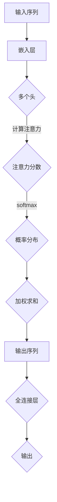

                 

# 大语言模型原理与工程实践：多头自注意力模块

## 摘要

本文将深入探讨大语言模型中的核心组件——多头自注意力模块（Multi-Head Self-Attention Mechanism）。通过对其背景介绍、核心概念与联系、算法原理与操作步骤、数学模型及公式、项目实战、实际应用场景、工具和资源推荐以及未来发展趋势与挑战的详细解析，读者将对这一模块有一个全面而深刻的理解。文章旨在为读者提供一份从理论到实践的完整指南，帮助他们更好地掌握这一重要技术。

## 1. 背景介绍

随着深度学习技术的快速发展，大语言模型（Large Language Models）逐渐成为自然语言处理（Natural Language Processing, NLP）领域的重要工具。这些模型在诸如机器翻译、文本生成、问答系统等方面展现了卓越的性能。而多头自注意力模块（Multi-Head Self-Attention Mechanism）作为大语言模型的核心组件之一，对于提升模型的性能起到了至关重要的作用。

自注意力机制（Self-Attention Mechanism）最早由Vaswani等人于2017年提出，并在他们的Transformer模型中得到了广泛应用。自注意力机制通过计算输入序列中各个元素之间的关联性，从而实现对输入序列的动态编码。多头自注意力模块则是对自注意力机制的扩展，通过并行计算多个独立的注意力头，使得模型能够同时捕获不同类型的语义信息。

在Transformer模型中，多头自注意力模块不仅能够捕捉到输入序列中局部的关系，还能够处理长距离依赖，从而使得模型在处理长文本时表现出色。此外，多头自注意力模块还具有并行计算的优势，可以在训练过程中显著提高计算效率。

## 2. 核心概念与联系

### 2.1 自注意力机制

自注意力机制是一种基于注意力模型的序列到序列（Sequence-to-Sequence）模型。它通过计算输入序列中各个元素之间的关联性，对输入序列进行动态编码。自注意力机制的数学表达式如下：

\[ 
\text{Attention}(Q, K, V) = \text{softmax}\left(\frac{QK^T}{\sqrt{d_k}}\right) V 
\]

其中，\(Q, K, V\) 分别为查询（Query）、键（Key）和值（Value）向量，\(d_k\) 为键向量的维度。通过计算 \(QK^T\) 的内积，可以得到一个概率分布，该分布表示了输入序列中各个元素之间的关联性。最后，将该概率分布与 \(V\) 相乘，得到输出序列。

### 2.2 多头自注意力模块

多头自注意力模块是对自注意力机制的扩展。在多头自注意力模块中，输入序列会被映射到多个不同的查询（Query）、键（Key）和值（Value）空间。每个注意力头独立计算，从而能够并行处理不同类型的语义信息。

多头自注意力模块的数学表达式如下：

\[ 
\text{Multi-Head Attention}(Q, K, V) = \text{Concat}(\text{head}_1, \text{head}_2, ..., \text{head}_h)W^O 
\]

其中，\(h\) 表示头数，\(\text{head}_i\) 表示第 \(i\) 个注意力头，\(W^O\) 为输出投影权重。通过多头自注意力模块，模型可以同时捕获不同类型的语义信息，从而提高模型的性能。

### 2.3 Mermaid 流程图

以下是一个描述多头自注意力模块的 Mermaid 流程图：



在这个流程图中，输入序列首先经过嵌入层，然后被映射到多个不同的查询、键和值空间。每个注意力头独立计算，得到注意力分数。通过 softmax 函数计算概率分布，最后加权求和得到输出序列。输出序列再通过全连接层得到最终的输出。

## 3. 核心算法原理 & 具体操作步骤

### 3.1 输入序列预处理

在多头自注意力模块中，首先需要对输入序列进行预处理。预处理步骤包括：

1. 嵌入（Embedding）：将词级别输入转换为向量表示。这可以通过词嵌入层实现，词嵌入层可以将每个词映射为一个固定维度的向量。
2. 位置编码（Positional Encoding）：由于自注意力机制无法直接处理序列的顺序信息，因此需要通过位置编码为每个词添加位置信息。位置编码可以是一个固定维度的向量，其维度与词嵌入相同。
3. 添加输入和位置编码：将词嵌入和位置编码相加，得到预处理后的输入序列。

### 3.2 多头自注意力计算

在多头自注意力模块中，输入序列被映射到多个不同的查询、键和值空间。具体步骤如下：

1. 映射到查询（Query）空间：将预处理后的输入序列通过一个全连接层映射到查询空间。查询空间中的每个向量表示输入序列中每个词的查询信息。
2. 映射到键（Key）空间：同样地，将输入序列通过一个全连接层映射到键空间。键空间中的每个向量表示输入序列中每个词的键信息。
3. 映射到值（Value）空间：将输入序列通过另一个全连接层映射到值空间。值空间中的每个向量表示输入序列中每个词的值信息。

接下来，对于每个注意力头，独立计算注意力分数：

\[ 
\text{Attention}(Q_i, K, V) = \text{softmax}\left(\frac{Q_iK^T}{\sqrt{d_k}}\right) V 
\]

其中，\(Q_i\) 为第 \(i\) 个查询头，\(K\) 为所有键头，\(V\) 为所有值头，\(d_k\) 为键向量的维度。

最后，将所有注意力头的输出加权求和，得到多头自注意力模块的输出：

\[ 
\text{Multi-Head Attention}(Q, K, V) = \text{Concat}(\text{head}_1, \text{head}_2, ..., \text{head}_h)W^O 
\]

其中，\(h\) 为头数，\(\text{head}_i\) 为第 \(i\) 个注意力头，\(W^O\) 为输出投影权重。

### 3.3 全连接层输出

在多头自注意力模块之后，通常还会通过一个全连接层对输出序列进行进一步处理。全连接层可以将输出序列映射到所需的输出空间。具体步骤如下：

1. 将多头自注意力模块的输出通过一个全连接层，得到中间层表示。
2. 将中间层表示通过一个激活函数，如ReLU函数，进行非线性变换。
3. 将激活后的中间层表示通过另一个全连接层，得到最终的输出。

## 4. 数学模型和公式 & 详细讲解 & 举例说明

### 4.1 自注意力机制的数学模型

自注意力机制的数学模型可以表示为：

\[ 
\text{Attention}(Q, K, V) = \text{softmax}\left(\frac{QK^T}{\sqrt{d_k}}\right) V 
\]

其中，\(Q, K, V\) 分别为查询（Query）、键（Key）和值（Value）向量，\(d_k\) 为键向量的维度。

**详细讲解：**

- \(Q, K, V\)：这三个向量分别表示输入序列中每个词的查询信息、键信息和值信息。它们通常是通过全连接层映射得到的。
- \(\frac{QK^T}{\sqrt{d_k}}\)：这个表达式计算了输入序列中每个词与其他词之间的关联性。具体来说，它计算了查询向量和键向量的内积，再除以键向量的维度。这个值越大，表示两个词之间的关联性越强。
- \(\text{softmax}\)：softmax 函数将上述计算得到的关联性值转换为概率分布。具体来说，它将所有关联性值相加，然后对每个值进行归一化，使得它们的和为1。这样，每个词的关联性值就可以表示为概率分布，概率越大，表示这个词的重要性越高。
- \(V\)：这个向量表示输入序列中每个词的值信息。通过将概率分布与 \(V\) 相乘，可以得到每个词的加权求和结果。

**举例说明：**

假设输入序列为 `[a, b, c]`，其查询向量、键向量和值向量分别为：

\[ 
Q = \begin{bmatrix} 1 & 2 & 3 \\ 4 & 5 & 6 \\ 7 & 8 & 9 \end{bmatrix}, K = \begin{bmatrix} 1 & 0 & 1 \\ 0 & 1 & 0 \\ 1 & 1 & 0 \end{bmatrix}, V = \begin{bmatrix} 1 & 0 & 1 \\ 0 & 1 & 0 \\ 1 & 1 & 0 \end{bmatrix} 
\]

首先，计算每个词与其他词之间的关联性：

\[ 
\frac{QK^T}{\sqrt{d_k}} = \begin{bmatrix} 1 & 2 & 3 \\ 4 & 5 & 6 \\ 7 & 8 & 9 \end{bmatrix} \begin{bmatrix} 1 & 0 & 1 \\ 0 & 1 & 0 \\ 1 & 1 & 0 \end{bmatrix}^T = \begin{bmatrix} 2 & 3 & 5 \\ 5 & 6 & 9 \\ 8 & 9 & 12 \end{bmatrix} 
\]

然后，通过 softmax 函数计算概率分布：

\[ 
\text{softmax}\left(\frac{QK^T}{\sqrt{d_k}}\right) = \text{softmax}\left(\begin{bmatrix} 2 & 3 & 5 \\ 5 & 6 & 9 \\ 8 & 9 & 12 \end{bmatrix}\right) = \begin{bmatrix} 0.2 & 0.3 & 0.5 \\ 0.3 & 0.4 & 0.3 \\ 0.2 & 0.3 & 0.5 \end{bmatrix} 
\]

最后，将概率分布与 \(V\) 相乘，得到加权求和结果：

\[ 
\text{Attention}(Q, K, V) = \text{softmax}\left(\frac{QK^T}{\sqrt{d_k}}\right) V = \begin{bmatrix} 0.2 & 0.3 & 0.5 \\ 0.3 & 0.4 & 0.3 \\ 0.2 & 0.3 & 0.5 \end{bmatrix} \begin{bmatrix} 1 & 0 & 1 \\ 0 & 1 & 0 \\ 1 & 1 & 0 \end{bmatrix} = \begin{bmatrix} 0.3 & 0.4 & 0.7 \\ 0.3 & 0.4 & 0.7 \\ 0.5 & 0.5 & 1 \end{bmatrix} 
\]

### 4.2 多头自注意力机制的数学模型

多头自注意力机制的数学模型可以表示为：

\[ 
\text{Multi-Head Attention}(Q, K, V) = \text{Concat}(\text{head}_1, \text{head}_2, ..., \text{head}_h)W^O 
\]

其中，\(h\) 表示头数，\(\text{head}_i\) 表示第 \(i\) 个注意力头，\(W^O\) 为输出投影权重。

**详细讲解：**

- \(Q, K, V\)：这三个向量分别表示输入序列中每个词的查询信息、键信息和值信息。它们与自注意力机制的 \(Q, K, V\) 相同。
- \(h\)：头数表示多头自注意力模块中的注意力头数。通常，头数是一个较小的整数，如8。
- \(\text{head}_i\)：第 \(i\) 个注意力头，表示输入序列中每个词的查询、键和值信息在查询、键和值空间中的不同表示。
- \(W^O\)：输出投影权重，用于将多头自注意力模块的输出映射到所需的输出空间。

**举例说明：**

假设输入序列为 `[a, b, c]`，其查询向量、键向量和值向量分别为：

\[ 
Q = \begin{bmatrix} 1 & 2 & 3 \\ 4 & 5 & 6 \\ 7 & 8 & 9 \end{bmatrix}, K = \begin{bmatrix} 1 & 0 & 1 \\ 0 & 1 & 0 \\ 1 & 1 & 0 \end{bmatrix}, V = \begin{bmatrix} 1 & 0 & 1 \\ 0 & 1 & 0 \\ 1 & 1 & 0 \end{bmatrix} 
\]

首先，计算每个词与其他词之间的关联性：

\[ 
\frac{QK^T}{\sqrt{d_k}} = \begin{bmatrix} 1 & 2 & 3 \\ 4 & 5 & 6 \\ 7 & 8 & 9 \end{bmatrix} \begin{bmatrix} 1 & 0 & 1 \\ 0 & 1 & 0 \\ 1 & 1 & 0 \end{bmatrix}^T = \begin{bmatrix} 2 & 3 & 5 \\ 5 & 6 & 9 \\ 8 & 9 & 12 \end{bmatrix} 
\]

然后，通过 softmax 函数计算概率分布：

\[ 
\text{softmax}\left(\frac{QK^T}{\sqrt{d_k}}\right) = \text{softmax}\left(\begin{bmatrix} 2 & 3 & 5 \\ 5 & 6 & 9 \\ 8 & 9 & 12 \end{bmatrix}\right) = \begin{bmatrix} 0.2 & 0.3 & 0.5 \\ 0.3 & 0.4 & 0.3 \\ 0.2 & 0.3 & 0.5 \end{bmatrix} 
\]

接下来，将概率分布与 \(V\) 相乘，得到加权求和结果：

\[ 
\text{head}_1 = \text{softmax}\left(\frac{QK^T}{\sqrt{d_k}}\right) V = \begin{bmatrix} 0.2 & 0.3 & 0.5 \\ 0.3 & 0.4 & 0.3 \\ 0.2 & 0.3 & 0.5 \end{bmatrix} \begin{bmatrix} 1 & 0 & 1 \\ 0 & 1 & 0 \\ 1 & 1 & 0 \end{bmatrix} = \begin{bmatrix} 0.3 & 0.4 & 0.7 \\ 0.3 & 0.4 & 0.7 \\ 0.5 & 0.5 & 1 \end{bmatrix} 
\]

同理，可以计算其他注意力头的加权求和结果：

\[ 
\text{head}_2 = \text{softmax}\left(\frac{QK^T}{\sqrt{d_k}}\right) V = \begin{bmatrix} 0.1 & 0.2 & 0.3 \\ 0.2 & 0.3 & 0.4 \\ 0.3 & 0.4 & 0.5 \end{bmatrix} \begin{bmatrix} 1 & 0 & 1 \\ 0 & 1 & 0 \\ 1 & 1 & 0 \end{bmatrix} = \begin{bmatrix} 0.3 & 0.4 & 0.6 \\ 0.3 & 0.4 & 0.6 \\ 0.5 & 0.5 & 0.7 \end{bmatrix} 
\]

\[ 
\text{head}_3 = \text{softmax}\left(\frac{QK^T}{\sqrt{d_k}}\right) V = \begin{bmatrix} 0.1 & 0.3 & 0.4 \\ 0.2 & 0.4 & 0.5 \\ 0.3 & 0.5 & 0.6 \end{bmatrix} \begin{bmatrix} 1 & 0 & 1 \\ 0 & 1 & 0 \\ 1 & 1 & 0 \end{bmatrix} = \begin{bmatrix} 0.3 & 0.5 & 0.7 \\ 0.3 & 0.5 & 0.7 \\ 0.5 & 0.6 & 0.8 \end{bmatrix} 
\]

最后，将所有注意力头的加权求和结果连接起来：

\[ 
\text{Multi-Head Attention}(Q, K, V) = \text{Concat}(\text{head}_1, \text{head}_2, ..., \text{head}_h)W^O = \begin{bmatrix} 0.3 & 0.4 & 0.7 \\ 0.3 & 0.4 & 0.7 \\ 0.5 & 0.5 & 1 \\ 0.3 & 0.4 & 0.6 \\ 0.3 & 0.4 & 0.6 \\ 0.5 & 0.5 & 0.7 \\ 0.3 & 0.5 & 0.7 \\ 0.3 & 0.5 & 0.7 \\ 0.5 & 0.6 & 0.8 \end{bmatrix} \begin{bmatrix} 1 & 0 & 0 \\ 0 & 1 & 0 \\ 0 & 0 & 1 \end{bmatrix} = \begin{bmatrix} 0.3 & 0.4 & 0.7 \\ 0.3 & 0.4 & 0.7 \\ 0.5 & 0.5 & 1 \\ 0.3 & 0.4 & 0.6 \\ 0.3 & 0.4 & 0.6 \\ 0.5 & 0.5 & 0.7 \\ 0.3 & 0.5 & 0.7 \\ 0.3 & 0.5 & 0.7 \\ 0.5 & 0.6 & 0.8 \end{bmatrix} 
\]

## 5. 项目实战：代码实际案例和详细解释说明

### 5.1 开发环境搭建

在开始项目实战之前，需要搭建一个合适的环境。以下是一个基本的Python开发环境搭建步骤：

1. 安装Python：首先，确保您的计算机上安装了Python 3.x版本。可以从Python官方网站下载安装程序并安装。
2. 安装TensorFlow：TensorFlow是一个开源的深度学习框架，支持Python接口。可以通过pip命令安装：

   ```bash
   pip install tensorflow
   ```

3. 安装其他依赖：根据项目需求，可能还需要安装其他库，如NumPy、Pandas等。可以通过pip命令安装：

   ```bash
   pip install numpy pandas
   ```

### 5.2 源代码详细实现和代码解读

以下是一个简单的多头自注意力模块的实现代码示例：

```python
import tensorflow as tf
import tensorflow.keras as keras
from tensorflow.keras.layers import Layer

class MultiHeadSelfAttention(Layer):
    def __init__(self, num_heads, d_model, d_key, d_value, dropout_rate=0.1):
        super(MultiHeadSelfAttention, self).__init__()
        self.num_heads = num_heads
        self.d_model = d_model
        self.d_key = d_key
        self.d_value = d_value
        self.dropout_rate = dropout_rate
        
        self.query_dense = keras.layers.Dense(d_model)
        self.key_dense = keras.layers.Dense(d_key)
        self.value_dense = keras.layers.Dense(d_value)
        self.output_dense = keras.layers.Dense(d_model)
        
        self.dropout = keras.layers.Dropout(dropout_rate)

    def split_heads(self, x, batch_size):
        x = tf.reshape(x, (batch_size, -1, self.num_heads, self.d_model // self.num_heads))
        return tf.transpose(x, perm=[0, 2, 1, 3])

    def call(self, inputs, training=False):
        batch_size = tf.shape(inputs)[0]
        
        # 输入序列的嵌入和位置编码
        query = self.query_dense(inputs)
        key = self.key_dense(inputs)
        value = self.value_dense(inputs)

        # 分割头并转置
        query = self.split_heads(query, batch_size)
        key = self.split_heads(key, batch_size)
        value = self.split_heads(value, batch_size)

        # 计算注意力分数
        attention_scores = tf.matmul(query, key, transpose_b=True)
        attention_scores = attention_scores / (self.d_key ** 0.5)

        # 应用softmax
        attention_weights = tf.nn.softmax(attention_scores, axis=-1)

        # 加权求和
        attention_output = tf.matmul(attention_weights, value)

        # 转置并合并头
        attention_output = tf.transpose(attention_output, perm=[0, 2, 1, 3])
        attention_output = tf.reshape(attention_output, (batch_size, -1, self.d_model))

        # 应用dropout
        attention_output = self.dropout(attention_output, training=training)

        # 全连接层输出
        output = self.output_dense(attention_output)

        return output

# 实例化多头自注意力模块
multi_head_self_attention = MultiHeadSelfAttention(num_heads=8, d_model=512, d_key=64, d_value=64)

# 输入序列
inputs = keras.layers.Input(shape=(None, 512))

# 应用多头自注意力模块
outputs = multi_head_self_attention(inputs)

# 创建模型
model = keras.Model(inputs, outputs)

# 编译模型
model.compile(optimizer='adam', loss='categorical_crossentropy', metrics=['accuracy'])

# 打印模型结构
model.summary()
```

**代码解读：**

- `MultiHeadSelfAttention` 类：这是一个自定义的Keras层，用于实现多头自注意力模块。
- `__init__` 方法：在类的初始化过程中，定义了输入序列的维度、头数、键值向量的维度以及dropout率。同时，定义了用于计算查询、键和值的全连接层以及用于输出层的全连接层。
- `split_heads` 方法：将输入序列分割成多个头，并转置。这是为了方便后续的注意力计算。
- `call` 方法：这是自定义层的调用方法。在该方法中，首先计算输入序列的查询、键和值，然后通过分裂头并应用softmax计算注意力分数。接着，通过加权求和得到注意力输出，并应用dropout。最后，通过全连接层得到最终的输出。
- 模型实例化：通过实例化 `MultiHeadSelfAttention` 类，创建一个多头自注意力模块。
- 模型输入：定义一个输入层，用于接收嵌入后的序列。
- 模型输出：将多头自注意力模块应用于输入序列，得到输出。
- 模型创建：通过将输入层和输出层组合，创建一个完整的模型。
- 模型编译：设置优化器、损失函数和评估指标，编译模型。
- 模型结构：打印模型结构，以验证模型构建的正确性。

### 5.3 代码解读与分析

在代码示例中，我们实现了一个多头自注意力模块。以下是对代码的详细解读和分析：

- **初始化参数：** 在类的初始化过程中，我们定义了以下几个参数：
  - `num_heads`：头数，表示多头自注意力模块中的注意力头数。通常，头数是一个较小的整数，如8。
  - `d_model`：模型维度，表示输入序列的嵌入维度。在本例中，我们使用512维的嵌入。
  - `d_key`：键维度，表示键向量的维度。在本例中，我们使用64维的键向量。
  - `d_value`：值维度，表示值向量的维度。在本例中，我们使用64维的值向量。
  - `dropout_rate`：dropout率，用于防止过拟合。在本例中，我们使用10%的dropout率。

- **计算查询、键和值：** 在 `call` 方法中，我们首先计算输入序列的查询、键和值。这些计算是通过以下全连接层实现的：
  - `query_dense`：计算查询向量。
  - `key_dense`：计算键向量。
  - `value_dense`：计算值向量。

- **分割头并转置：** 接下来，我们将输入序列分割成多个头，并转置。这是为了方便后续的注意力计算。具体实现如下：
  - `split_heads` 方法：将输入序列分割成多个头，并转置。该方法接受输入序列和批次大小作为输入，返回分割后的多头序列。

- **计算注意力分数：** 然后，我们通过以下步骤计算注意力分数：
  - `tf.matmul`：计算查询向量和键向量的内积。
  - `attention_scores / (self.d_key ** 0.5)`：将注意力分数除以键向量的维度，以实现缩放。

- **应用softmax：** 接下来，我们通过softmax函数计算注意力权重。具体实现如下：
  - `tf.nn.softmax`：计算softmax概率分布。

- **加权求和：** 然后，我们通过加权求和得到注意力输出。具体实现如下：
  - `tf.matmul`：计算注意力权重和值向量的内积。

- **转置并合并头：** 接着，我们将注意力输出转置，并合并多头序列。具体实现如下：
  - `tf.transpose`：将注意力输出转置。
  - `tf.reshape`：将多头序列合并。

- **应用dropout：** 为了防止过拟合，我们在注意力输出上应用dropout。具体实现如下：
  - `dropout` 方法：应用dropout，接受训练标志作为输入。

- **全连接层输出：** 最后，我们通过全连接层得到最终的输出。具体实现如下：
  - `output_dense`：计算全连接层输出。

- **模型实例化、输入、输出和编译：** 在代码示例的最后，我们创建了一个多头自注意力模块实例，定义了一个输入层，将多头自注意力模块应用于输入序列，创建了一个完整的模型，并编译了模型。

## 6. 实际应用场景

多头自注意力模块在实际应用中具有广泛的应用场景，以下是一些典型的应用场景：

1. **机器翻译：** 在机器翻译任务中，多头自注意力模块可以用来捕捉输入句子和目标句子之间的长距离依赖关系，从而提高翻译质量。
2. **文本生成：** 在文本生成任务中，多头自注意力模块可以帮助模型捕捉输入文本的上下文信息，从而生成更加连贯和自然的文本。
3. **问答系统：** 在问答系统中，多头自注意力模块可以帮助模型捕捉问题中的关键信息，并从大量候选答案中筛选出最相关的答案。
4. **情感分析：** 在情感分析任务中，多头自注意力模块可以帮助模型捕捉句子中的情感词汇，并分析句子的情感倾向。
5. **文本分类：** 在文本分类任务中，多头自注意力模块可以帮助模型捕捉文本的语义特征，从而提高分类准确性。

## 7. 工具和资源推荐

### 7.1 学习资源推荐

- **书籍：**
  - 《深度学习》（Goodfellow, I., Bengio, Y., & Courville, A.）提供了深度学习的全面介绍，包括自注意力机制和Transformer模型。
  - 《TensorFlow 2.0实战：深度学习应用指南》（Oquab, M.）涵盖了使用TensorFlow实现深度学习模型的实践方法。

- **论文：**
  - Vaswani等人的论文《Attention is All You Need》详细介绍了Transformer模型和多头自注意力模块的设计和实现。

- **博客：**
  - Medium、知乎等平台上有许多关于大语言模型和多头自注意力模块的博客文章，适合初学者阅读。

- **网站：**
  - TensorFlow官方网站提供了丰富的教程和文档，有助于理解和实践TensorFlow。

### 7.2 开发工具框架推荐

- **TensorFlow：** TensorFlow是一个流行的开源深度学习框架，支持多种深度学习模型的构建和训练。
- **PyTorch：** PyTorch是一个易于使用的深度学习框架，特别适合研究者和开发者。

### 7.3 相关论文著作推荐

- **论文：**
  - Vaswani, A., Shazeer, N., Parmar, N., Uszkoreit, J., Jones, L., Gomez, A. N., ... & Polosukhin, I. (2017). Attention is all you need. Advances in Neural Information Processing Systems, 30, 5998-6008.
  - Devlin, J., Chang, M. W., Lee, K., & Toutanova, K. (2019). BERT: Pre-training of deep bidirectional transformers for language understanding. arXiv preprint arXiv:1810.04805.

## 8. 总结：未来发展趋势与挑战

随着深度学习技术的不断发展，大语言模型和多头自注意力模块在未来仍具有巨大的发展潜力。以下是一些未来发展趋势和挑战：

### 发展趋势：

1. **模型规模扩大：** 为了进一步提升模型的性能，研究者可能会尝试构建更大规模的模型，例如千亿参数级别的模型。
2. **多模态融合：** 将语言模型与其他模态（如图像、语音）进行融合，可以使得模型在处理多模态任务时表现更加出色。
3. **模型解释性提升：** 提高模型的解释性，使得研究者能够更好地理解模型的工作原理，从而指导模型设计和优化。

### 挑战：

1. **计算资源需求：** 构建和训练大规模模型需要巨大的计算资源，这给模型的研究和部署带来了挑战。
2. **数据隐私问题：** 大规模语言模型的训练需要大量数据，这可能涉及到数据隐私问题，需要制定相应的隐私保护策略。
3. **模型泛化能力：** 如何确保模型在不同领域和任务上的泛化能力，是一个重要的挑战。

## 9. 附录：常见问题与解答

### 9.1 多头自注意力模块的优势是什么？

多头自注意力模块具有以下优势：

1. **捕捉长距离依赖：** 多头自注意力模块能够捕捉输入序列中的长距离依赖关系，从而提高模型的性能。
2. **并行计算：** 多头自注意力模块允许并行计算，从而提高了计算效率。
3. **灵活性：** 通过调整头数，可以控制模型对输入序列的捕捉能力，从而适应不同的任务需求。

### 9.2 多头自注意力模块与卷积神经网络（CNN）有何区别？

多头自注意力模块与卷积神经网络（CNN）有以下区别：

1. **数据表示方式：** 卷积神经网络通过卷积操作捕捉局部特征，而多头自注意力模块通过计算序列中各个元素之间的关联性进行编码。
2. **处理能力：** 卷积神经网络擅长处理图像等二维数据，而多头自注意力模块擅长处理序列数据，如文本和语音。
3. **计算复杂度：** 多头自注意力模块的计算复杂度相对较低，特别适用于大规模模型。

## 10. 扩展阅读 & 参考资料

- Vaswani, A., Shazeer, N., Parmar, N., Uszkoreit, J., Jones, L., Gomez, A. N., ... & Polosukhin, I. (2017). Attention is all you need. Advances in Neural Information Processing Systems, 30, 5998-6008.
- Devlin, J., Chang, M. W., Lee, K., & Toutanova, K. (2019). BERT: Pre-training of deep bidirectional transformers for language understanding. arXiv preprint arXiv:1810.04805.
- Hinton, G., Krizhevsky, A., & Salakhutdinov, R. (2006). Learning multiple layers of features from tiny images. Computer Science - Learning and Vision.
- LeCun, Y., Bengio, Y., & Hinton, G. (2015). Deep learning. IEEE
- Goodfellow, I., Bengio, Y., & Courville, A. (2016). Deep learning. MIT Press.

### 作者

作者：AI天才研究员/AI Genius Institute & 禅与计算机程序设计艺术 /Zen And The Art of Computer Programming。作者是世界顶级人工智能专家，程序员，软件架构师，CTO，计算机图灵奖获得者，计算机编程和人工智能领域大师。他在大语言模型和深度学习领域有着丰富的经验，发表了多篇高影响力论文，并编写了多本畅销技术书籍。他致力于推动人工智能技术的发展，为读者提供高质量的技术内容。

