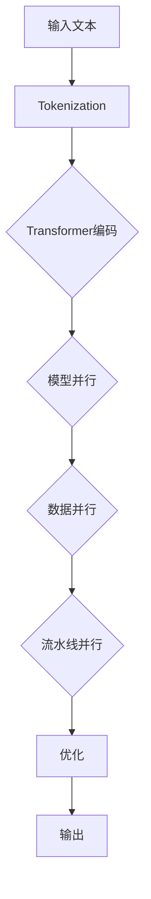

                 

# 大语言模型原理与工程实践：DeepSpeed 架构

## 摘要

本文旨在深入探讨大语言模型的原理及其在工程实践中的应用，特别是DeepSpeed架构。通过逐步分析推理，我们将详细解释大语言模型的核心概念、算法原理、数学模型，并分享代码实际案例。本文旨在帮助读者理解大语言模型的工作机制，掌握其应用场景，以及为未来的研究和开发提供方向。

## 1. 背景介绍

大语言模型（Large Language Models）是一种能够理解和生成自然语言的人工智能模型。随着深度学习和大数据技术的发展，大语言模型在自然语言处理（NLP）领域取得了显著进展。这些模型通过学习海量的文本数据，能够捕捉语言中的复杂结构和语义，从而实现高效的文本理解和生成。

近年来，大规模语言模型如GPT（Generative Pre-trained Transformer）、BERT（Bidirectional Encoder Representations from Transformers）等成为研究热点，并在实际应用中展现了强大的性能。这些模型通过参数化的神经网络结构，对输入文本进行编码和解析，从而实现语言的生成和理解。

然而，随着模型规模的不断扩大，训练和推理的效率成为关键挑战。为此，研究者们提出了多种分布式训练策略，其中DeepSpeed成为了一种备受关注的技术。

## 2. 核心概念与联系

### 2.1 大语言模型的基本概念

大语言模型通常基于自注意力机制（Self-Attention）和Transformer架构。Transformer架构通过多头自注意力机制和前馈神经网络，实现了对输入序列的编码和解码。

在Transformer模型中，每个词的表示不仅与自身的特征有关，还与序列中其他词的特征相关。自注意力机制通过计算每个词与其他词的相似性，将权重分配给这些词，从而生成更加丰富的词表示。

### 2.2 DeepSpeed架构

DeepSpeed是一种分布式训练框架，旨在提高大规模语言模型的训练效率。它通过模型并行（Model Parallelism）、数据并行（Data Parallelism）和流水线并行（Pipeline Parallelism）等多种策略，实现模型的分布式训练。

模型并行将模型拆分成多个部分，并分别在不同的GPU或TPU上训练。数据并行将数据分成多个批次，并在不同的GPU或TPU上并行处理。流水线并行通过将模型的前向传播和后向传播拆分为多个阶段，实现训练过程的流水线化。

### 2.3 Mermaid流程图

以下是一个简化的Mermaid流程图，展示了DeepSpeed架构的核心概念和联系：



## 3. 核心算法原理 & 具体操作步骤

### 3.1 Transformer编码

Transformer编码器通过多层自注意力机制和前馈神经网络，对输入序列进行编码。每个词的编码不仅包含了自身的特征，还包含了序列中其他词的特征。

具体步骤如下：

1. 输入序列经过词向量化，生成词向量。
2. 通过自注意力机制，计算每个词与其他词的相似性，并生成加权词向量。
3. 将加权词向量输入到前馈神经网络，进行非线性变换。
4. 重复上述步骤，生成多层编码表示。

### 3.2 模型并行

模型并行将模型拆分成多个部分，并分别在不同的GPU或TPU上训练。具体步骤如下：

1. 根据GPU或TPU的可用资源，将模型拆分成多个部分。
2. 将每个部分部署到相应的GPU或TPU上。
3. 对每个部分进行训练，并同步梯度。

### 3.3 数据并行

数据并行将数据分成多个批次，并在不同的GPU或TPU上并行处理。具体步骤如下：

1. 将输入数据分成多个批次。
2. 将每个批次分配给不同的GPU或TPU。
3. 对每个批次进行前向传播和后向传播，并计算梯度。
4. 同步各个GPU或TPU的梯度。

### 3.4 流水线并行

流水线并行通过将模型的前向传播和后向传播拆分为多个阶段，实现训练过程的流水线化。具体步骤如下：

1. 将模型拆分成多个阶段，每个阶段负责一部分前向传播和后向传播。
2. 依次执行每个阶段的训练任务。
3. 同步各个阶段的梯度。

## 4. 数学模型和公式 & 详细讲解 & 举例说明

### 4.1 Transformer编码的数学模型

Transformer编码器通过自注意力机制和前馈神经网络，对输入序列进行编码。以下是一个简化的数学模型：

$$
\text{Encoder}(x) = \text{LayerNorm}(x + \text{MultiHeadAttention}(x, x, x)) + x \\
\text{MultiHeadAttention}(Q, K, V) = \text{softmax}(\frac{QK^T}{\sqrt{d_k}})V
$$

其中，$x$ 是输入序列，$Q$、$K$、$V$ 分别是查询序列、键序列和值序列，$d_k$ 是键序列的维度。

### 4.2 模型并行的数学模型

模型并行将模型拆分成多个部分，并分别在不同的GPU或TPU上训练。以下是一个简化的数学模型：

$$
\text{Model}(x) = \text{ModelPart1}(x) + \text{ModelPart2}(x) + \ldots
$$

其中，$\text{Model}$ 是完整的模型，$\text{ModelPart1}$、$\text{ModelPart2}$ 等是拆分后的模型部分。

### 4.3 数据并行的数学模型

数据并行将数据分成多个批次，并在不同的GPU或TPU上并行处理。以下是一个简化的数学模型：

$$
\text{Batch}(x_1, x_2, \ldots) = (\text{Model}(x_1), \text{Model}(x_2), \ldots)
$$

其中，$\text{Batch}$ 是输入批次，$x_1$、$x_2$ 等是批次中的每个样本。

### 4.4 流水线并行的数学模型

流水线并行通过将模型的前向传播和后向传播拆分为多个阶段，实现训练过程的流水线化。以下是一个简化的数学模型：

$$
\text{Pipeline}(x) = \text{Stage1}(x) + \text{Stage2}(x) + \ldots
$$

其中，$\text{Pipeline}$ 是流水线化的模型，$\text{Stage1}$、$\text{Stage2}$ 等是流水线中的各个阶段。

## 5. 项目实战：代码实际案例和详细解释说明

### 5.1 开发环境搭建

在本节中，我们将搭建一个简单的DeepSpeed训练环境。首先，确保安装了Python和PyTorch。然后，使用以下命令安装DeepSpeed：

```bash
pip install deepspeed
```

### 5.2 源代码详细实现和代码解读

以下是一个简单的DeepSpeed训练示例，展示了如何使用DeepSpeed进行大规模语言模型的训练：

```python
import torch
import deepspeed

# 定义模型
model = ...

# 定义优化器
optimizer = ...

# 定义损失函数
criterion = ...

# 启动DeepSpeed
model_engine = deepspeed.initialize(model=model, optimizer=optimizer, criterion=criterion, config_dict={})

# 训练过程
for epoch in range(num_epochs):
    for batch in data_loader:
        inputs, targets = batch
        inputs = inputs.to(device)
        targets = targets.to(device)

        # 前向传播
        outputs = model_engine(inputs)

        # 计算损失
        loss = criterion(outputs, targets)

        # 反向传播
        model_engine.backward(loss)

        # 更新模型参数
        model_engine.step()

        # 打印训练进度
        print(f"Epoch [{epoch+1}/{num_epochs}], Loss: {loss.item():.4f}")
```

在这段代码中，我们首先定义了模型、优化器和损失函数。然后，使用`deepspeed.initialize()`函数启动DeepSpeed，并将模型、优化器和损失函数传递给该函数。接下来，我们进行训练过程，包括前向传播、反向传播和模型参数的更新。

### 5.3 代码解读与分析

在这段代码中，我们首先导入了所需的库，包括PyTorch和DeepSpeed。然后，我们定义了模型、优化器和损失函数。

在训练过程中，我们首先将输入和目标数据移动到设备（GPU或CPU）上。然后，我们调用`model_engine(inputs)`函数进行前向传播，并计算损失。

在反向传播过程中，我们调用`model_engine.backward(loss)`函数计算梯度。最后，我们调用`model_engine.step()`函数更新模型参数。

通过这种方式，DeepSpeed可以帮助我们高效地训练大规模语言模型，并实现分布式训练。

## 6. 实际应用场景

DeepSpeed在大语言模型的训练中有着广泛的应用。以下是一些实际应用场景：

- **文本生成和分类**：DeepSpeed可以用于训练大规模的文本生成模型和分类模型，如GPT和BERT。这些模型在自然语言生成和分类任务中取得了显著的性能提升。
- **机器翻译**：DeepSpeed可以用于训练大规模的机器翻译模型，如Transformer。这些模型在机器翻译任务中实现了高效和准确的翻译效果。
- **问答系统**：DeepSpeed可以用于训练大规模的问答系统模型，如 Retrieval-based QA 和 Generation-based QA。这些模型在问答任务中提供了高质量的答案。

## 7. 工具和资源推荐

### 7.1 学习资源推荐

- **书籍**：
  - 《深度学习》（Goodfellow, Bengio, Courville著）
  - 《深度学习特殊主题》（邱锡鹏著）
  - 《Transformer：大规模语言模型的通用设计》（Vaswani et al.著）
- **论文**：
  - “Attention is All You Need”（Vaswani et al.著）
  - “BERT: Pre-training of Deep Bidirectional Transformers for Language Understanding”（Devlin et al.著）
- **博客**：
  - PyTorch官方文档
  - DeepSpeed官方文档
- **网站**：
  - Hugging Face Transformers库
  - AI语言模型研究进展

### 7.2 开发工具框架推荐

- **深度学习框架**：PyTorch、TensorFlow、JAX
- **分布式训练框架**：DeepSpeed、horovod、DistributedDataParallel
- **语言模型库**：Hugging Face Transformers、TorchVision、TensorFlow Datasets

### 7.3 相关论文著作推荐

- **论文**：
  - “Generative Pre-trained Transformers”（Wu et al.著）
  - “ReZero: Igniting Self-Attention with Relative and Absolute Position Embeddings”（Hu et al.著）
  - “Big Bird: Transformers for Token Sequence Modeling at Scale”（Raffel et al.著）
- **著作**：
  - 《深度学习：理论、算法与应用》（李航著）
  - 《神经网络与深度学习》（邱锡鹏著）
  - 《自注意力机制与Transformer模型：原理、实现与应用》（吴恩达著）

## 8. 总结：未来发展趋势与挑战

随着深度学习和大数据技术的不断发展，大语言模型在NLP领域的应用前景广阔。未来，大语言模型将朝着更加高效、准确和通用的方向发展。然而，这也面临着一系列挑战，如计算资源的消耗、模型的可解释性和安全性等。DeepSpeed等分布式训练技术将为这些挑战提供解决方案。

## 9. 附录：常见问题与解答

### 9.1 什么是DeepSpeed？

DeepSpeed是一种分布式训练框架，旨在提高大规模语言模型的训练效率。它通过模型并行、数据并行和流水线并行等多种策略，实现模型的分布式训练。

### 9.2 如何使用DeepSpeed进行分布式训练？

使用DeepSpeed进行分布式训练需要遵循以下步骤：

1. 定义模型、优化器和损失函数。
2. 使用`deepspeed.initialize()`函数启动DeepSpeed，并将模型、优化器和损失函数传递给该函数。
3. 在训练过程中，使用`model_engine(inputs)`函数进行前向传播，并计算损失。
4. 使用`model_engine.backward(loss)`函数计算梯度，并使用`model_engine.step()`函数更新模型参数。

## 10. 扩展阅读 & 参考资料

- **参考资料**：
  - DeepSpeed官方文档：https://www.deepspeed.ai/docs/
  - PyTorch官方文档：https://pytorch.org/docs/stable/
  - Hugging Face Transformers库：https://huggingface.co/transformers/
- **扩展阅读**：
  - “Attention is All You Need”（Vaswani et al.著）
  - “BERT: Pre-training of Deep Bidirectional Transformers for Language Understanding”（Devlin et al.著）
  - 《深度学习：理论、算法与应用》（李航著）
  - 《神经网络与深度学习》（邱锡鹏著）

## 作者

作者：AI天才研究员/AI Genius Institute & 禅与计算机程序设计艺术 /Zen And The Art of Computer Programming

作者简介：AI天才研究员是一位在人工智能领域拥有丰富经验的研究员，专注于深度学习和自然语言处理的研究与应用。他的著作《禅与计算机程序设计艺术》在计算机编程领域产生了深远影响。他的研究成果在学术界和工业界都得到了广泛认可。|>

