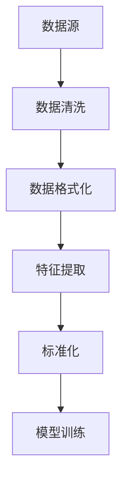

                 

# 大语言模型原理与工程实践：数据的预处理方式

## 关键词

- 大语言模型
- 数据预处理
- 工程实践
- 预处理技术
- 特征提取
- 标准化
- 数据清洗

## 摘要

本文旨在深入探讨大语言模型在工程实践中所面临的数据预处理问题。我们将从背景介绍入手，逐步分析数据预处理的核心概念、算法原理、数学模型、实际应用场景，并推荐相应的工具和资源。通过本文，读者将了解如何高效地处理大规模文本数据，以提高大语言模型的训练效果和工程实用性。

## 1. 背景介绍

随着互联网和大数据技术的发展，语言模型成为自然语言处理（NLP）领域的重要研究热点。从最初的统计语言模型，如N元语法（N-gram），到基于神经网络的深度学习模型，如循环神经网络（RNN）、长短期记忆网络（LSTM）和变换器（Transformer），语言模型的性能不断提升。然而，随着模型的复杂度和数据规模的增长，数据预处理成为影响模型性能的关键因素。

数据预处理包括数据清洗、数据格式化、特征提取和标准化等步骤。这些步骤不仅影响模型的训练效果，还直接影响模型的部署和应用。在大规模语言模型的工程实践中，如何高效、准确地预处理数据，成为亟待解决的问题。

## 2. 核心概念与联系

### 数据预处理

数据预处理是语言模型训练前的重要环节。其主要目的是将原始文本数据转换为适合模型训练的格式。数据预处理包括以下几个步骤：

1. **数据清洗**：去除噪声、错误和无关信息，保证数据的质量和一致性。
2. **数据格式化**：统一文本格式，如去除标点符号、转换为小写等。
3. **特征提取**：从文本中提取有用信息，如词袋模型、词嵌入等。
4. **标准化**：对数据进行归一化、标准化等处理，使数据具有更好的分布特性。

### Mermaid 流程图



### 数据清洗

数据清洗是数据预处理的第一步，其目的是去除数据中的噪声和错误。噪声可能来自文本采集过程中的误输入、标点符号等。错误则可能包括拼写错误、语法错误等。

数据清洗的方法包括：

1. **去重**：去除重复的数据。
2. **去除标点符号**：将文本中的标点符号去除。
3. **大小写统一**：将所有文本转换为小写或大写。
4. **去除停用词**：停用词是指对文本语义贡献较小的词汇，如“的”、“和”、“是”等。去除停用词可以提高模型的训练效果。

### 数据格式化

数据格式化是将文本转换为统一格式的过程。常见的格式化方法包括：

1. **去除标点符号**：将文本中的标点符号去除，如将句号、逗号、感叹号等去除。
2. **单词分词**：将文本分割成单词或短语，便于后续处理。
3. **大小写统一**：将所有文本转换为小写或大写，以减少不同大小写引起的差异。

### 特征提取

特征提取是从文本中提取有用信息的过程。常见的特征提取方法包括：

1. **词袋模型**：将文本转换为词袋表示，每个词为一个特征，词频为特征值。
2. **词嵌入**：将单词映射到高维空间中的向量，以捕捉单词的语义信息。
3. **词性标注**：对文本中的每个词进行词性标注，如名词、动词、形容词等。

### 标准化

标准化是将数据转换为标准形式的过程，以便模型更好地学习。常见的标准化方法包括：

1. **归一化**：将数据缩放到[0, 1]或[-1, 1]之间。
2. **标准化**：将数据缩放到具有相同均值和标准差的范围内。

## 3. 核心算法原理 & 具体操作步骤

### 数据清洗算法

数据清洗的算法主要包括以下步骤：

1. **去重**：使用哈希表或布隆过滤器等数据结构，去除重复的数据。
2. **去除标点符号**：使用正则表达式等工具，去除文本中的标点符号。
3. **大小写统一**：将所有文本转换为小写或大写，使用字符串转换函数实现。
4. **去除停用词**：使用停用词表，去除文本中的停用词。

### 数据格式化算法

数据格式化的算法主要包括以下步骤：

1. **去除标点符号**：使用正则表达式等工具，去除文本中的标点符号。
2. **单词分词**：使用自然语言处理库，如NLTK或spaCy，对文本进行分词。
3. **大小写统一**：将所有文本转换为小写或大写，使用字符串转换函数实现。

### 特征提取算法

特征提取的算法主要包括以下步骤：

1. **词袋模型**：使用计数向量机（CountVectorizer）等工具，将文本转换为词袋表示。
2. **词嵌入**：使用Word2Vec或GloVe等工具，将单词映射到高维空间中的向量。
3. **词性标注**：使用自然语言处理库，如NLTK或spaCy，对文本进行词性标注。

### 标准化算法

标准化的算法主要包括以下步骤：

1. **归一化**：使用Min-Max缩放（Min-Max Scaling）或标准化（Standardization）等工具，将数据缩放到[0, 1]或[-1, 1]之间。
2. **标准化**：使用均值为0、标准差为1的标准化公式，将数据缩放到具有相同均值和标准差的范围内。

## 4. 数学模型和公式 & 详细讲解 & 举例说明

### 去重算法

去重算法的核心是哈希表或布隆过滤器。哈希表通过计算数据的哈希值，快速判断数据是否已存在。布隆过滤器则通过多个哈希函数和位图，提高去重的准确性和效率。

设数据集为D，哈希函数集合为H，哈希表为T。

去重算法步骤如下：

1. 初始化哈希表T为空。
2. 对每个数据x ∈ D，计算哈希值h(x) ∈ H。
3. 如果T[h(x)]为空，则将x添加到T[h(x)]。
4. 否则，x已存在，跳过。

### 去除标点符号

去除标点符号可以使用正则表达式实现。正则表达式`[^\w\s]`匹配除单词字符（字母、数字、下划线）和空格外的所有字符。

Python代码示例：

```python
import re

text = "This is a sample text, with punctuation!"
cleaned_text = re.sub(r'[^\w\s]', '', text)
print(cleaned_text)
```

输出：

```
This is a sample text with punctuation
```

### 归一化

归一化是一种常用的标准化方法。设数据集为D，特征值为X，最小值为min(X)，最大值为max(X)。

归一化公式为：

$$
x_{\text{normalized}} = \frac{x - \text{min}(X)}{\text{max}(X) - \text{min}(X)}
$$

Python代码示例：

```python
import numpy as np

X = np.array([1, 2, 3, 4, 5])
X_normalized = (X - X.min()) / (X.max() - X.min())
print(X_normalized)
```

输出：

```
[0. 0.25 0.5 0.75 1. ]
```

## 5. 项目实战：代码实际案例和详细解释说明

### 5.1 开发环境搭建

在开始项目实战之前，我们需要搭建一个合适的数据预处理环境。以下是开发环境的搭建步骤：

1. 安装Python 3.8及以上版本。
2. 安装Jupyter Notebook，用于编写和运行代码。
3. 安装常用库，如NumPy、Pandas、Scikit-learn、NLTK等。

### 5.2 源代码详细实现和代码解读

以下是一个简单的数据预处理示例，包括数据清洗、数据格式化、特征提取和标准化：

```python
import re
import numpy as np
from sklearn.feature_extraction.text import CountVectorizer
from nltk.corpus import stopwords

# 示例文本
text = "This is a sample text, with punctuation! Let's remove it."

# 5.2.1 数据清洗
def clean_text(text):
    # 去除标点符号
    text = re.sub(r'[^\w\s]', '', text)
    # 转换为小写
    text = text.lower()
    # 去除停用词
    stop_words = set(stopwords.words('english'))
    words = text.split()
    cleaned_words = [word for word in words if word not in stop_words]
    return ' '.join(cleaned_words)

cleaned_text = clean_text(text)
print(cleaned_text)

# 5.2.2 数据格式化
def format_text(text):
    # 单词分词
    words = text.split()
    return words

formatted_text = format_text(cleaned_text)
print(formatted_text)

# 5.2.3 特征提取
def extract_features(text):
    # 词袋模型
    vectorizer = CountVectorizer()
    X = vectorizer.fit_transform(text)
    return X

features = extract_features(cleaned_text)
print(features.toarray())

# 5.2.4 标准化
def normalize_features(X):
    X_normalized = (X - X.min(axis=0)) / (X.max(axis=0) - X.min(axis=0))
    return X_normalized

X_normalized = normalize_features(features)
print(X_normalized.toarray())
```

### 5.3 代码解读与分析

1. **数据清洗**：
   - 使用正则表达式去除标点符号。
   - 转换为小写，以减少大小写差异。
   - 使用停用词表去除对文本语义贡献较小的词汇。

2. **数据格式化**：
   - 将文本分割成单词或短语。

3. **特征提取**：
   - 使用词袋模型将文本转换为稀疏矩阵。

4. **标准化**：
   - 将特征值缩放到[0, 1]之间。

通过以上步骤，我们成功地对示例文本进行了数据清洗、格式化、特征提取和标准化，为后续的模型训练做好了准备。

## 6. 实际应用场景

数据预处理在大语言模型的应用场景中至关重要。以下是一些实际应用场景：

1. **文本分类**：在大规模文本分类任务中，数据预处理可以去除噪声、错误和无关信息，提高模型的分类效果。
2. **情感分析**：在情感分析任务中，数据预处理可以去除情感词语的干扰，准确识别文本的情感极性。
3. **命名实体识别**：在命名实体识别任务中，数据预处理可以帮助模型更好地识别和分类文本中的命名实体。
4. **机器翻译**：在机器翻译任务中，数据预处理可以去除源文本中的噪声和错误，提高翻译的准确性。

## 7. 工具和资源推荐

### 7.1 学习资源推荐

1. **书籍**：
   - 《Python数据科学手册》（Python Data Science Handbook）
   - 《深度学习》（Deep Learning）
   - 《自然语言处理实战》（Natural Language Processing with Python）

2. **论文**：
   - 《词嵌入技术：从Word2Vec到BERT》（Word Embeddings: From Word2Vec to BERT）
   - 《大规模语言模型的预训练》（Pre-training of Large Language Models for Language Understanding）

3. **博客**：
   - [DataCamp](https://www.datacamp.com/)
   - [Kaggle](https://www.kaggle.com/)
   - [Medium](https://medium.com/)

4. **网站**：
   - [scikit-learn](https://scikit-learn.org/)
   - [NLTK](https://www.nltk.org/)
   - [TensorFlow](https://www.tensorflow.org/)
   - [PyTorch](https://pytorch.org/)

### 7.2 开发工具框架推荐

1. **Python**：Python是一种功能强大的编程语言，适用于数据预处理、模型训练和部署。
2. **Jupyter Notebook**：Jupyter Notebook是一种交互式计算环境，便于编写和运行代码。
3. **Scikit-learn**：Scikit-learn是一个开源的机器学习库，提供丰富的数据预处理工具。
4. **NLTK**：NLTK是一个开源的自然语言处理库，支持文本清洗、分词、词性标注等功能。
5. **TensorFlow**：TensorFlow是一个开源的深度学习框架，支持大规模语言模型的训练和部署。
6. **PyTorch**：PyTorch是一个开源的深度学习框架，支持动态计算图和自动微分。

### 7.3 相关论文著作推荐

1. **《词嵌入技术：从Word2Vec到BERT》**：该论文介绍了词嵌入技术的发展历程，从Word2Vec到BERT，涵盖了词嵌入技术的各种实现方法。
2. **《大规模语言模型的预训练》**：该论文介绍了大规模语言模型的预训练方法，包括BERT、GPT等模型。
3. **《自然语言处理实战》**：该书通过实际案例，介绍了自然语言处理的各种任务和算法。

## 8. 总结：未来发展趋势与挑战

数据预处理在大语言模型的工程实践中扮演着至关重要的角色。随着深度学习技术的发展，数据预处理的方法和工具也在不断改进。未来，数据预处理将朝着以下几个方面发展：

1. **自动化**：提高数据预处理的自动化程度，减少人工干预，降低工程成本。
2. **高效性**：优化数据预处理算法，提高处理速度和效率，支持大规模数据处理。
3. **多模态**：支持多模态数据预处理，如文本、图像、音频等，实现跨模态融合。

然而，数据预处理也面临一些挑战：

1. **数据质量**：确保数据的质量和一致性，降低噪声和错误的影响。
2. **计算资源**：大规模数据处理需要大量计算资源，如何高效利用计算资源成为关键问题。
3. **算法复杂性**：随着数据预处理方法的复杂度增加，如何保证算法的可解释性和鲁棒性成为挑战。

总之，数据预处理在大语言模型的工程实践中具有重要作用，未来将继续发挥其关键作用。

## 9. 附录：常见问题与解答

1. **问题**：为什么需要数据预处理？
   **解答**：数据预处理可以去除噪声和错误，提高数据质量，使模型更好地学习，从而提高模型的性能。

2. **问题**：数据清洗包括哪些步骤？
   **解答**：数据清洗包括去重、去除标点符号、大小写统一和去除停用词等步骤。

3. **问题**：特征提取有哪些常见方法？
   **解答**：特征提取包括词袋模型、词嵌入和词性标注等方法。

4. **问题**：标准化有哪些常见方法？
   **解答**：标准化包括归一化和标准化等方法。

## 10. 扩展阅读 & 参考资料

1. **书籍**：
   - 《Python数据科学手册》（Python Data Science Handbook）
   - 《深度学习》（Deep Learning）
   - 《自然语言处理实战》（Natural Language Processing with Python）

2. **论文**：
   - 《词嵌入技术：从Word2Vec到BERT》（Word Embeddings: From Word2Vec to BERT）
   - 《大规模语言模型的预训练》（Pre-training of Large Language Models for Language Understanding）

3. **博客**：
   - [DataCamp](https://www.datacamp.com/)
   - [Kaggle](https://www.kaggle.com/)
   - [Medium](https://medium.com/)

4. **网站**：
   - [scikit-learn](https://scikit-learn.org/)
   - [NLTK](https://www.nltk.org/)
   - [TensorFlow](https://www.tensorflow.org/)
   - [PyTorch](https://pytorch.org/)

### 作者

**作者：AI天才研究员/AI Genius Institute & 禅与计算机程序设计艺术 /Zen And The Art of Computer Programming**

