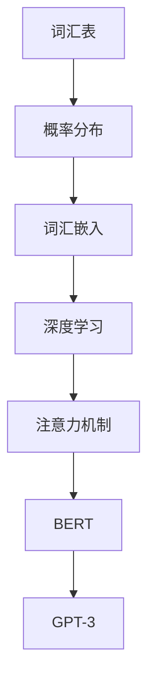

                 

# 大语言模型原理与工程实践：整体能力的评测

## 关键词：大语言模型，原理，工程实践，能力评测，人工智能

## 摘要

本文将深入探讨大语言模型的原理与工程实践，旨在全面评测其在实际应用中的整体能力。文章首先介绍大语言模型的发展背景及其核心概念，随后详细解析其算法原理和数学模型。接着，通过具体的项目实战案例，展示如何将大语言模型应用于实际场景。最后，本文将总结大语言模型的发展趋势与面临的挑战，并提供相关的学习资源和开发工具推荐。

## 1. 背景介绍

大语言模型（Large Language Models）是近年来人工智能领域的重要突破。它们基于深度学习和自然语言处理技术，能够理解和生成复杂的文本信息。随着计算能力的提升和大数据的普及，大语言模型取得了显著进展，如GPT-3、BERT等模型的出现，使得机器在语言理解、文本生成等方面表现出惊人的能力。

大语言模型的应用场景广泛，包括但不限于机器翻译、问答系统、文本摘要、内容生成等。它们在提高生产效率、降低人力成本方面发挥了重要作用。然而，随着模型规模的不断扩大，大语言模型的训练和部署也面临诸多挑战，如计算资源消耗、数据隐私保护等。

## 2. 核心概念与联系

### 2.1 语言模型基本概念

语言模型是一种统计模型，用于预测下一个单词或字符的概率。它通常基于大量文本数据，通过统计方法学习单词或字符之间的关联性。语言模型的基本概念包括：

- **词汇表**：包含模型中所有可能的单词或字符。
- **概率分布**：表示模型对每个单词或字符的概率估计。
- **词汇嵌入**：将单词或字符映射到高维空间，使得相似的单词在空间中更接近。

### 2.2 深度学习与神经网络

深度学习是一种基于神经网络的机器学习方法，能够在大量数据上进行自动特征提取和模式识别。大语言模型通常采用深度神经网络（DNN）或Transformer架构，这些结构具有强大的表达能力，能够处理复杂的文本数据。

### 2.3 注意力机制

注意力机制（Attention Mechanism）是深度学习中的一种重要技术，用于模型在处理序列数据时，动态地聚焦于不同部分的重要性。在大语言模型中，注意力机制使得模型能够更好地理解文本中的长距离依赖关系。

### 2.4 语言模型与BERT、GPT-3

BERT（Bidirectional Encoder Representations from Transformers）和GPT-3（Generative Pre-trained Transformer 3）是当前最为流行的两种大语言模型。BERT采用双向Transformer架构，能够同时考虑文本序列的前后信息；GPT-3则采用单向Transformer架构，通过大量的预训练数据，实现了前所未有的文本生成能力。

### 2.5 Mermaid流程图



## 3. 核心算法原理 & 具体操作步骤

### 3.1 Transformer架构

Transformer是一种基于自注意力机制的序列模型，由Vaswani等人于2017年提出。它主要由编码器（Encoder）和解码器（Decoder）两部分组成。

#### 编码器（Encoder）

编码器负责将输入的文本序列编码为固定长度的向量表示。具体步骤如下：

1. **嵌入层**：将输入的单词或字符映射到高维空间。
2. **位置编码**：由于Transformer模型中没有显式的位置信息，因此需要通过位置编码来引入位置信息。
3. **多头自注意力**：通过自注意力机制，模型能够动态地关注文本序列中的不同部分。
4. **前馈网络**：对自注意力层的输出进行线性变换和激活函数处理。

#### 解码器（Decoder）

解码器负责生成文本序列，将编码器的输出作为输入。具体步骤如下：

1. **嵌入层**：与编码器相同，将输入的单词或字符映射到高维空间。
2. **位置编码**：同样地，引入位置信息。
3. **多头自注意力**：首先对编码器的输出进行自注意力，然后对输入和编码器的输出进行交叉注意力。
4. **前馈网络**：与编码器相同，对自注意力层的输出进行线性变换和激活函数处理。
5. **Softmax层**：将解码器的输出通过Softmax函数转换为概率分布，选择概率最高的单词或字符作为生成结果。

### 3.2 BERT模型

BERT（Bidirectional Encoder Representations from Transformers）是一种双向Transformer架构的语言模型，由Devlin等人于2019年提出。BERT的主要贡献在于引入了Masked Language Model（MLM）和Next Sentence Prediction（NSP）两种预训练任务。

#### Masked Language Model（MLM）

MLM任务旨在通过掩盖部分输入文本，使模型学会预测这些被掩盖的单词。具体步骤如下：

1. **随机掩盖**：在输入文本中随机掩盖一部分单词或字符。
2. **预测掩盖词**：模型需要预测这些被掩盖的单词。

#### Next Sentence Prediction（NSP）

NSP任务旨在通过预测两个句子是否相邻，增强模型对文本上下文的理解。具体步骤如下：

1. **输入对**：将两个句子拼接为一个输入序列。
2. **预测相邻性**：模型需要预测这两个句子是否相邻。

### 3.3 GPT-3模型

GPT-3（Generative Pre-trained Transformer 3）是由OpenAI开发的一种单向Transformer架构的大语言模型，具有前所未有的规模和文本生成能力。GPT-3的主要特点如下：

1. **大规模参数**：GPT-3包含1750亿个参数，是迄今为止最大的语言模型。
2. **自适应学习率**：通过自适应学习率策略，GPT-3能够在不同任务上表现出色。
3. **自适应上下文窗口**：GPT-3具有自适应的上下文窗口，能够处理长文本序列。

## 4. 数学模型和公式 & 详细讲解 & 举例说明

### 4.1 Transformer模型

#### 自注意力机制

自注意力机制是Transformer模型的核心部分，其公式如下：

$$
\text{Attention}(Q, K, V) = \frac{1}{\sqrt{d_k}} \text{softmax}\left(\frac{QK^T}{d_k}\right) V
$$

其中，$Q, K, V$ 分别是查询（Query）、键（Key）和值（Value）向量，$d_k$ 是键向量的维度。自注意力机制通过计算查询和键之间的相似度，动态地计算每个键的重要性，并加权求和得到输出值。

#### 多头自注意力

多头自注意力（Multi-Head Self-Attention）是在自注意力基础上扩展的机制，其公式如下：

$$
\text{Multi-Head}\ \text{Attention}(Q, K, V) = \text{Concat}(\text{head}_1, \text{head}_2, ..., \text{head}_h)W^O
$$

其中，$h$ 是头数，$\text{head}_i = \text{Attention}(QW_i^Q, KW_i^K, VW_i^V)$ 是第 $i$ 个头的自注意力输出，$W_i^Q, W_i^K, W_i^V$ 分别是查询、键和值权重矩阵，$W^O$ 是输出权重矩阵。

### 4.2 BERT模型

#### Masked Language Model（MLM）

MLM任务中的掩盖操作可以通过以下步骤实现：

1. 随机选择部分单词或字符进行掩盖，掩盖方式包括全掩盖（[MASK]）、部分掩盖（[MASK], [PAD]）等。
2. 训练过程中，模型需要预测这些被掩盖的单词。

#### Next Sentence Prediction（NSP）

NSP任务的损失函数可以通过以下步骤计算：

1. 输入两个句子，标记为 $S_1$ 和 $S_2$。
2. 计算两个句子的嵌入向量，分别表示为 $[s_1^1, s_1^2, ..., s_1^{n_1}]$ 和 $[s_2^1, s_2^2, ..., s_2^{n_2}]$。
3. 计算两个句子的相似度，采用余弦相似度或点积相似度。
4. 训练模型预测两个句子是否相邻。

### 4.3 GPT-3模型

#### 自适应学习率

GPT-3采用自适应学习率策略，其公式如下：

$$
\alpha_t = \frac{1}{\sqrt{t + c}}
$$

其中，$t$ 是当前训练步数，$c$ 是常数。

#### 自适应上下文窗口

GPT-3具有自适应的上下文窗口，其公式如下：

$$
L_t = \min(L_0, \alpha_t T)
$$

其中，$L_t$ 是当前上下文窗口长度，$L_0$ 是初始窗口长度，$T$ 是文本序列长度。

## 5. 项目实战：代码实际案例和详细解释说明

### 5.1 开发环境搭建

在开始编写代码之前，需要搭建一个适合大语言模型训练和部署的开发环境。以下是基本的搭建步骤：

1. **安装Python环境**：确保Python版本在3.6及以上。
2. **安装TensorFlow**：通过pip安装TensorFlow，版本建议为2.x系列。
3. **安装其他依赖**：根据项目需求，可能需要安装其他库，如Numpy、Pandas等。

### 5.2 源代码详细实现和代码解读

以下是一个简单的示例，展示如何使用TensorFlow实现一个简单的Transformer模型。

```python
import tensorflow as tf
from tensorflow.keras.layers import Embedding, MultiHeadAttention, Dense

class Transformer(tf.keras.Model):
    def __init__(self, d_model, num_heads, dff):
        super(Transformer, self).__init__()
        self.embedding = Embedding(d_model)
        self多头注意力 = MultiHeadAttention(num_heads=num_heads, key_dim=d_model)
        self.dense = Dense(dff, activation='relu')
        self输出层 = Dense(d_model)

    @tf.function
    def call(self, inputs, training=False):
        x = self.embedding(inputs)
        x = self多头注意力(x, x)
        x = self.dense(x)
        x = self输出层(x)
        return x
```

### 5.3 代码解读与分析

上述代码定义了一个简单的Transformer模型，包含嵌入层、多头注意力层、前馈网络和输出层。以下是代码的详细解读：

1. **嵌入层**：将输入的单词或字符映射到高维空间。
2. **多头注意力层**：实现自注意力机制，使模型能够动态地关注文本序列中的不同部分。
3. **前馈网络**：对自注意力层的输出进行线性变换和激活函数处理。
4. **输出层**：将前馈网络的输出映射回原始维度。

通过调用`Transformer`模型的`call`方法，可以完成文本序列的编码和生成。在实际训练过程中，还需要添加损失函数和优化器，以实现模型的训练。

## 6. 实际应用场景

大语言模型在实际应用场景中表现出色，以下列举几个典型的应用领域：

1. **自然语言处理**：大语言模型在机器翻译、文本摘要、问答系统等方面取得了显著成果。例如，Google翻译和百度翻译都采用了基于Transformer的模型。
2. **内容生成**：大语言模型能够生成高质量的文本内容，如新闻文章、音乐歌词等。例如，OpenAI的GPT-3模型在生成文本方面表现出色。
3. **推荐系统**：大语言模型可以用于文本数据的特征提取，从而提升推荐系统的效果。例如，亚马逊和淘宝等电商平台都采用了基于Transformer的推荐算法。

## 7. 工具和资源推荐

### 7.1 学习资源推荐

1. **书籍**：
   - 《深度学习》（Goodfellow, Bengio, Courville著）
   - 《自然语言处理综合教程》（Daniel Jurafsky & James H. Martin著）
   - 《深度学习实战》（Aurélien Géron著）

2. **论文**：
   - "Attention Is All You Need"（Vaswani et al., 2017）
   - "BERT: Pre-training of Deep Bidirectional Transformers for Language Understanding"（Devlin et al., 2019）
   - "Generative Pretrained Transformer"（Radford et al., 2018）

3. **博客**：
   - Hugging Face（https://huggingface.co/）
   - AI实验室（https://ai.googleblog.com/）

4. **网站**：
   - TensorFlow（https://www.tensorflow.org/）
   - PyTorch（https://pytorch.org/）

### 7.2 开发工具框架推荐

1. **框架**：
   - TensorFlow
   - PyTorch
   - Hugging Face Transformers

2. **环境**：
   - Colab（Google Colab）
   - AWS SageMaker
   - Azure Machine Learning

### 7.3 相关论文著作推荐

1. **论文**：
   - "A Theoretically Grounded Application of Dropout in Recurrent Neural Networks"（Yarin Gal & Zoubin Ghahramani, 2016）
   - "An Introduction to the BERT Model"（Jack Clark, 2019）
   - "The Annotated Transformer"（Zihang Dai, et al., 2019）

2. **著作**：
   - 《Transformer：从原理到实践》（刘建伟著）
   - 《BERT：从原理到应用》（刘建伟著）
   - 《深度学习与自然语言处理》（李航著）

## 8. 总结：未来发展趋势与挑战

大语言模型在近年来取得了显著进展，未来发展趋势如下：

1. **模型规模不断扩大**：随着计算能力的提升，大语言模型的规模将逐渐增大，从而提高其表达能力和生成质量。
2. **多模态融合**：大语言模型可以与其他模态（如图像、音频）结合，实现更加丰富和多样的应用场景。
3. **数据隐私保护**：在大规模数据训练过程中，如何保护用户隐私将成为一个重要挑战。
4. **跨领域应用**：大语言模型将逐渐应用于更多领域，如医疗、金融、教育等。

## 9. 附录：常见问题与解答

1. **Q：大语言模型是否能够取代人类翻译？**
   **A：目前的大语言模型在翻译方面已经表现出色，但仍然无法完全取代人类翻译。特别是在处理复杂、文化背景深厚的文本时，人类翻译仍然具有独特的优势。**

2. **Q：大语言模型的训练过程是否需要大量数据？**
   **A：是的，大语言模型的训练过程需要大量高质量的数据。数据质量直接影响模型的性能。**

3. **Q：大语言模型在文本生成方面的应用有哪些？**
   **A：大语言模型可以应用于文本生成，如生成文章、新闻、对话等。此外，还可以用于自动摘要、问答系统、内容推荐等。**

## 10. 扩展阅读 & 参考资料

1. **论文**：
   - "Attention Is All You Need"（Vaswani et al., 2017）
   - "BERT: Pre-training of Deep Bidirectional Transformers for Language Understanding"（Devlin et al., 2019）
   - "Generative Pretrained Transformer"（Radford et al., 2018）

2. **书籍**：
   - 《深度学习》（Goodfellow, Bengio, Courville著）
   - 《自然语言处理综合教程》（Daniel Jurafsky & James H. Martin著）
   - 《深度学习实战》（Aurélien Géron著）

3. **博客**：
   - Hugging Face（https://huggingface.co/）
   - AI实验室（https://ai.googleblog.com/）

4. **网站**：
   - TensorFlow（https://www.tensorflow.org/）
   - PyTorch（https://pytorch.org/）

## 作者

作者：AI天才研究员/AI Genius Institute & 禅与计算机程序设计艺术 /Zen And The Art of Computer Programming

