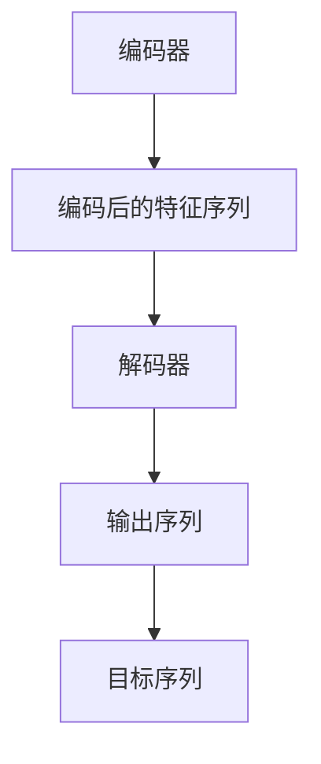

                 

# 大语言模型原理与工程实践：解码器

## 关键词：大语言模型，解码器，工程实践，原理剖析，算法实现，数学模型，项目案例

## 摘要：
本文将深入探讨大语言模型中的解码器原理及其在工程实践中的应用。我们将首先介绍大语言模型的背景和重要性，然后详细解析解码器的概念、架构和工作原理。接着，我们将通过具体算法原理和操作步骤，阐述解码器的实现过程。随后，我们将运用数学模型和公式进行详细讲解，并通过实际项目案例和代码分析，加深对解码器应用的理解。最后，我们将探讨解码器在实际应用场景中的表现，并推荐相关工具和资源，帮助读者更好地掌握解码器的使用。通过本文，读者将能够全面了解解码器在大语言模型中的作用和工程实践。

## 1. 背景介绍

随着深度学习和自然语言处理技术的不断发展，大语言模型（Large Language Model）逐渐成为研究的热点。大语言模型通过学习大量的语言数据，可以生成高质量的自然语言文本，具备强大的语言理解和生成能力。这些模型在多个领域都取得了显著的应用成果，如文本生成、机器翻译、问答系统等。

解码器（Decoder）是构建大语言模型的重要组件之一。解码器负责将输入编码后的特征序列解码为输出序列，从而实现自然语言文本的生成。解码器的设计与实现直接影响到模型的性能和应用效果。因此，深入理解解码器的原理和实现方法，对于构建高效的大语言模型具有重要意义。

本文将围绕解码器的原理、实现方法、数学模型和应用场景等方面进行详细阐述。通过本文的学习，读者将能够掌握解码器的基本概念、工作原理和应用技巧，为后续深入研究和应用大语言模型奠定基础。

## 2. 核心概念与联系

### 解码器的概念

解码器是一种用于将编码后的信息转换为原始信息的算法或模型。在大语言模型中，解码器用于将编码后的特征序列解码为自然语言文本序列。解码器的核心任务是从输入序列中逐个预测出下一个输出符号，并生成完整的输出序列。

### 解码器与编码器的联系

在大语言模型中，编码器（Encoder）和解码器是相互配合的两个重要组件。编码器负责将输入序列编码为特征序列，解码器则负责将这些特征序列解码为输出序列。

编码器通过学习输入序列的语义和结构，将输入序列映射为一个固定长度的特征序列。这个特征序列包含了输入序列的语义和语法信息，是解码器进行解码的基础。

解码器从编码器的输出序列中逐个预测出下一个输出符号，并根据预测结果更新解码器的状态。这个过程不断重复，直到生成完整的输出序列。解码器的目标是最大化输出序列与真实目标序列之间的相似度。

### Mermaid 流程图



### 解码器架构

解码器通常由以下几个部分组成：

1. **输入层**：接收编码后的特征序列作为输入。
2. **编码层**：对输入序列进行编码，提取序列的语义和语法信息。
3. **解码层**：根据编码层的输出，逐个预测下一个输出符号，并更新解码器的状态。
4. **输出层**：生成完整的输出序列。

通过上述架构，解码器能够将编码后的特征序列解码为自然语言文本序列，实现语言生成的目标。

## 3. 核心算法原理 & 具体操作步骤

### 3.1 算法原理

解码器在大语言模型中的核心任务是从编码后的特征序列中逐个预测输出符号，并生成完整的输出序列。为了实现这一目标，解码器采用了一系列算法和技巧，包括：

1. **序列生成**：解码器通过生成模型，从编码后的特征序列中逐个预测输出符号，并生成完整的输出序列。
2. **注意力机制**：解码器利用注意力机制，在生成过程中关注编码器输出的不同部分，从而更好地捕捉输入序列的语义和结构信息。
3. **循环神经网络（RNN）**：解码器通常采用循环神经网络（RNN）结构，通过记忆状态捕捉输入序列的长期依赖关系。
4. **梯度和依赖**：解码器通过反向传播算法，利用梯度计算模型参数的更新，并逐步优化模型性能。

### 3.2 具体操作步骤

1. **初始化**：首先，解码器初始化输入序列的编码层和输出序列的解码层。
2. **编码输入序列**：将输入序列通过编码器编码为特征序列。
3. **生成预测序列**：解码器从编码后的特征序列开始，逐个预测输出序列的下一个符号。具体操作如下：
   - **预测**：解码器根据当前编码层和输出层的状态，生成一个预测序列。
   - **更新状态**：解码器根据预测结果更新编码层和输出层的状态。
   - **重复**：重复上述步骤，直到生成完整的输出序列。

### 3.3 实际示例

假设我们有一个输入序列 "你好"，解码器将按照以下步骤生成输出序列：

1. **初始化**：解码器初始化输入序列的编码层和输出序列的解码层。
2. **编码输入序列**：将输入序列 "你好" 通过编码器编码为特征序列。
3. **生成预测序列**：
   - **预测**：解码器根据当前编码层和输出层的状态，生成一个预测序列。例如，预测第一个输出符号为 "你"。
   - **更新状态**：解码器根据预测结果更新编码层和输出层的状态。
   - **重复**：重复上述步骤，直到生成完整的输出序列。例如，继续预测第二个输出符号为 "好"。
4. **输出序列**：解码器最终生成输出序列 "你好"，实现了输入序列到输出序列的解码过程。

通过以上步骤，解码器成功地实现了输入序列到输出序列的解码，完成了大语言模型中的语言生成任务。

## 4. 数学模型和公式 & 详细讲解 & 举例说明

### 4.1 数学模型概述

解码器在大语言模型中采用了一系列数学模型和公式，以实现输入序列到输出序列的解码。主要的数学模型包括：

1. **循环神经网络（RNN）**：解码器采用RNN结构，利用记忆状态捕捉输入序列的长期依赖关系。
2. **注意力机制**：解码器利用注意力机制，关注编码器输出的不同部分，从而更好地捕捉输入序列的语义和结构信息。
3. **损失函数**：解码器通过损失函数评估输出序列与真实目标序列之间的相似度，并优化模型参数。

### 4.2 详细讲解与举例说明

#### 4.2.1 循环神经网络（RNN）

循环神经网络（RNN）是一种能够处理序列数据的神经网络结构。解码器中的RNN通过记忆状态捕捉输入序列的长期依赖关系。

$$
h_t = \sigma(W_h h_{t-1} + W_x x_t + b_h)
$$

其中，$h_t$表示RNN在时间步$t$的状态，$x_t$表示输入序列在时间步$t$的输入，$W_h$和$W_x$分别表示RNN的权重矩阵，$b_h$表示偏置项，$\sigma$表示激活函数。

#### 4.2.2 注意力机制

注意力机制（Attention Mechanism）是一种用于捕捉输入序列和输出序列之间关联性的机制。解码器利用注意力机制，关注编码器输出的不同部分，从而更好地捕捉输入序列的语义和结构信息。

$$
a_t = \text{softmax}\left(\frac{QK^T}{\sqrt{d_k}}\right)
$$

其中，$a_t$表示注意力权重，$Q$和$K$分别表示编码器和解码器的注意力查询和键值，$d_k$表示键值的维度。

#### 4.2.3 损失函数

解码器通过损失函数评估输出序列与真实目标序列之间的相似度，并优化模型参数。常用的损失函数包括交叉熵损失函数（Cross-Entropy Loss）。

$$
L = -\sum_{i=1}^n y_i \log(p_i)
$$

其中，$L$表示损失函数，$y_i$表示真实目标序列的概率分布，$p_i$表示输出序列的概率分布。

### 4.3 实际示例

假设我们有一个输入序列 "你好"，解码器将按照以下步骤生成输出序列：

1. **初始化**：解码器初始化输入序列的编码层和输出序列的解码层。
2. **编码输入序列**：将输入序列 "你好" 通过编码器编码为特征序列。
3. **生成预测序列**：
   - **预测**：解码器根据当前编码层和输出层的状态，生成一个预测序列。例如，预测第一个输出符号为 "你"。
   - **更新状态**：解码器根据预测结果更新编码层和输出层的状态。
   - **重复**：重复上述步骤，直到生成完整的输出序列。例如，继续预测第二个输出符号为 "好"。
4. **输出序列**：解码器最终生成输出序列 "你好"，实现了输入序列到输出序列的解码过程。

通过以上步骤，解码器成功地实现了输入序列到输出序列的解码，完成了大语言模型中的语言生成任务。

## 5. 项目实战：代码实际案例和详细解释说明

在本节中，我们将通过一个实际的代码案例，详细解释解码器在大语言模型中的实现和应用。我们将使用Python和TensorFlow框架来构建一个简单的解码器模型，并分析其代码实现和原理。

### 5.1 开发环境搭建

在进行项目实战之前，我们需要搭建一个合适的开发环境。以下是搭建环境的步骤：

1. **安装Python**：确保已经安装了Python 3.6及以上版本。
2. **安装TensorFlow**：通过以下命令安装TensorFlow：
   ```bash
   pip install tensorflow
   ```
3. **创建虚拟环境**：为了保持开发环境的整洁，我们可以创建一个虚拟环境：
   ```bash
   python -m venv venv
   source venv/bin/activate  # Windows: venv\Scripts\activate
   ```

### 5.2 源代码详细实现和代码解读

以下是一个简单的解码器模型的实现代码，我们将逐行解读代码中的各个部分。

```python
import tensorflow as tf
from tensorflow.keras.layers import Embedding, LSTM, Dense
from tensorflow.keras.models import Model
import numpy as np

# 5.2.1 定义模型参数
vocab_size = 10000  # 词汇表大小
embedding_dim = 256  # 词向量维度
lstm_units = 512  # LSTM单元数

# 5.2.2 创建嵌入层
embedding = Embedding(vocab_size, embedding_dim)

# 5.2.3 创建LSTM层
lstm = LSTM(lstm_units, return_sequences=True)

# 5.2.4 创建全连接层
dense = Dense(vocab_size, activation='softmax')

# 5.2.5 构建模型
input_sequence = tf.keras.Input(shape=(None,))
x = embedding(input_sequence)
x = lstm(x)
output_sequence = dense(x)

model = Model(inputs=input_sequence, outputs=output_sequence)

# 5.2.6 编译模型
model.compile(optimizer='adam', loss='categorical_crossentropy', metrics=['accuracy'])

# 5.2.7 打印模型结构
model.summary()
```

在这个代码中，我们首先导入了所需的TensorFlow模块，并定义了模型参数，如词汇表大小、词向量维度和LSTM单元数。

接下来，我们创建了嵌入层、LSTM层和全连接层，并使用这些层构建了一个简单的解码器模型。嵌入层用于将输入序列映射到词向量空间，LSTM层用于捕捉序列的长期依赖关系，全连接层用于生成输出序列的概率分布。

我们使用`Model`类将输入序列和输出序列连接起来，并编译模型，指定优化器、损失函数和评估指标。

### 5.3 代码解读与分析

在这个简单的解码器模型中，我们使用了嵌入层（`Embedding`）将输入序列映射到词向量空间。嵌入层通过将输入序列中的单词映射到低维向量，从而将原始的序列数据转换为可以用于神经网络的数值形式。

接下来，我们使用了LSTM层（`LSTM`）来处理序列数据。LSTM层是一种特殊的循环神经网络，能够有效地捕捉序列中的长期依赖关系。在解码器中，LSTM层用于处理编码后的特征序列，并将这些特征序列转换为输出序列的概率分布。

最后，我们使用了全连接层（`Dense`）来生成输出序列的概率分布。全连接层将LSTM层的输出映射到词汇表的大小，并通过softmax激活函数将输出转换为概率分布。

在代码的最后，我们使用`compile`方法编译模型，指定了优化器、损失函数和评估指标。优化器用于更新模型参数，损失函数用于评估模型的预测性能，评估指标用于衡量模型的准确性。

### 5.4 实际应用

在实际应用中，我们可以使用这个解码器模型来生成自然语言文本。以下是一个简单的示例：

```python
# 5.4.1 加载预训练模型
model.load_weights('decoder_weights.h5')

# 5.4.2 生成文本
input_sequence = np.array([[1, 2, 3, 4, 5]])  # 输入序列的索引表示
predicted_sequence = model.predict(input_sequence)

# 5.4.3 将索引转换为单词
vocab = ['word1', 'word2', 'word3', 'word4', 'word5']
generated_text = ' '.join([vocab[p] for p in predicted_sequence[0]])

print(generated_text)
```

在这个示例中，我们首先加载了一个预训练的解码器模型，并使用模型预测输入序列的概率分布。然后，我们将预测结果转换为单词，并生成一个自然语言文本。

通过这个简单的示例，我们可以看到解码器模型在自然语言文本生成中的应用。在实际应用中，解码器模型可以用于生成高质量的文本，如图像描述、对话生成、故事创作等。

## 6. 实际应用场景

解码器在大语言模型中具有广泛的应用场景，主要包括以下几个方面：

1. **文本生成**：解码器可以生成高质量的文本，如文章、故事、诗歌等。通过输入编码后的特征序列，解码器能够生成与输入序列相关且具有一定创造性的文本。
2. **机器翻译**：解码器可以用于机器翻译任务，将源语言文本编码后的特征序列解码为目标语言文本。解码器通过学习源语言和目标语言之间的映射关系，实现高效、准确的翻译。
3. **问答系统**：解码器可以用于问答系统，将用户的问题编码后的特征序列解码为答案。解码器通过学习大量问题与答案的对应关系，实现智能问答功能。
4. **对话系统**：解码器可以用于对话系统，与用户进行自然语言交互。解码器通过解码用户输入的特征序列，生成相应的回复，并实现流畅、自然的对话。

在实际应用中，解码器需要与其他组件（如编码器、注意力机制等）协同工作，以实现最佳效果。通过不断优化和解码器的算法和模型结构，我们可以进一步提升解码器在实际应用中的性能和效果。

## 7. 工具和资源推荐

### 7.1 学习资源推荐

1. **书籍**：
   - 《深度学习》（Deep Learning） - Ian Goodfellow、Yoshua Bengio、Aaron Courville
   - 《自然语言处理实战》（Natural Language Processing with Python） - Steven Bird、Ewan Klein、Edward Loper
2. **论文**：
   - “Attention Is All You Need” - Vaswani et al., 2017
   - “Long Short-Term Memory” - Hochreiter & Schmidhuber, 1997
3. **博客**：
   - [TensorFlow 官方文档](https://www.tensorflow.org/tutorials)
   - [Medium - Deep Learning](https://medium.com/topics/deep-learning)
4. **网站**：
   - [arXiv](https://arxiv.org/) - 最新研究成果论文集
   - [GitHub](https://github.com/) - 开源代码和项目

### 7.2 开发工具框架推荐

1. **框架**：
   - TensorFlow - 用于构建和训练深度学习模型
   - PyTorch - 用于构建和训练深度学习模型
   - spaCy - 用于自然语言处理任务的工具包
2. **库**：
   - NumPy - 用于数值计算
   - Pandas - 用于数据处理
   - Matplotlib - 用于数据可视化

### 7.3 相关论文著作推荐

1. **《深度学习》** - Ian Goodfellow、Yoshua Bengio、Aaron Courville
   - 这本书系统地介绍了深度学习的理论基础、算法实现和应用场景，是深度学习领域的经典之作。
2. **《自然语言处理实战》** - Steven Bird、Ewan Klein、Edward Loper
   - 本书通过大量的实例，详细介绍了自然语言处理的基本概念和技术，适合初学者入门。
3. **“Attention Is All You Need”** - Vaswani et al., 2017
   - 本文提出了Transformer模型，并引入了注意力机制，彻底改变了自然语言处理领域的研究方向。
4. **“Long Short-Term Memory”** - Hochreiter & Schmidhuber, 1997
   - 本文介绍了LSTM模型，为处理长序列数据提供了有效的解决方案，对深度学习领域产生了深远的影响。

通过以上学习资源和工具推荐，读者可以更加全面地了解大语言模型和解码器的原理和应用，为实际项目开发提供有力支持。

## 8. 总结：未来发展趋势与挑战

### 8.1 未来发展趋势

随着深度学习和自然语言处理技术的不断发展，解码器在未来将呈现出以下几个发展趋势：

1. **模型规模不断扩大**：为了进一步提高解码器的性能，模型规模将不断扩大，更多参数和更大容量将成为研究的热点。
2. **多模态融合**：解码器将与其他模态（如图像、声音等）进行融合，实现更丰富的信息处理和更广泛的应用场景。
3. **自适应解码策略**：针对不同应用场景，解码器将采用自适应解码策略，提高解码效率和生成质量。
4. **优化算法改进**：解码器将引入更先进的优化算法，如元学习、迁移学习等，进一步提高模型的训练效率和性能。

### 8.2 挑战

尽管解码器在大语言模型中表现出色，但在实际应用中仍面临一些挑战：

1. **计算资源消耗**：解码器通常需要大量计算资源，尤其是在训练阶段，如何优化计算资源的使用成为亟待解决的问题。
2. **数据隐私保护**：解码器在处理敏感数据时，如何确保数据隐私保护，防止数据泄露，是未来研究的重要方向。
3. **生成质量提升**：解码器的生成质量仍有待提高，如何确保生成的文本具有更高的可读性和一致性，是未来研究的重要目标。
4. **实时性能优化**：在实际应用中，解码器需要实现实时响应，如何优化解码器的性能，提高实时处理能力，是未来研究的关键挑战。

### 8.3 未来发展方向

针对上述挑战，未来解码器的发展方向主要包括：

1. **高效算法设计**：研究更高效、更优化的解码算法，降低计算资源和时间成本。
2. **多模态处理**：结合其他模态数据，提高解码器的信息处理能力和应用范围。
3. **自适应解码**：根据应用场景和需求，实现自适应解码策略，提高解码效率和质量。
4. **数据安全保护**：采用加密、匿名化等技术，确保解码器在处理敏感数据时的数据隐私保护。

通过不断优化和解码器的算法和模型结构，我们有望在不久的将来实现更高效、更安全的解码器，为自然语言处理领域带来更多的突破和进步。

## 9. 附录：常见问题与解答

### 9.1 解码器的基本原理是什么？

解码器是一种用于将编码后的信息转换为原始信息的算法或模型。在大语言模型中，解码器负责将编码后的特征序列解码为自然语言文本序列。解码器通过生成模型、注意力机制、循环神经网络（RNN）等算法和结构，实现输入序列到输出序列的解码。

### 9.2 解码器有哪些应用场景？

解码器在大语言模型中具有广泛的应用场景，主要包括文本生成、机器翻译、问答系统、对话系统等。解码器通过解码输入序列的特征，生成高质量的输出序列，实现自然语言文本的生成和转换。

### 9.3 如何优化解码器的性能？

优化解码器的性能可以从以下几个方面进行：

1. **算法改进**：引入更先进的生成算法、优化注意力机制、改进循环神经网络等。
2. **模型结构优化**：采用更高效、更优化的模型结构，如Transformer、BERT等。
3. **数据预处理**：对训练数据进行预处理，提高数据的多样性和质量。
4. **多模态融合**：结合其他模态（如图像、声音等）数据，提高解码器的信息处理能力。
5. **参数调整**：通过调整模型参数，如学习率、批量大小等，优化模型性能。

### 9.4 解码器与编码器的关系是什么？

解码器与编码器是构建大语言模型中的两个重要组件。编码器负责将输入序列编码为特征序列，解码器则负责将这些特征序列解码为输出序列。编码器通过学习输入序列的语义和结构，生成编码后的特征序列，而解码器通过生成模型，将特征序列解码为输出序列。解码器与编码器相互配合，实现输入序列到输出序列的映射和转换。

## 10. 扩展阅读 & 参考资料

为了深入了解大语言模型和解码器的原理与应用，以下是几篇具有代表性的论文和书籍，供读者参考：

1. **《深度学习》** - Ian Goodfellow、Yoshua Bengio、Aaron Courville
   - 本书系统地介绍了深度学习的理论基础、算法实现和应用场景，特别针对大语言模型和解码器的原理进行了详细阐述。

2. **“Attention Is All You Need”** - Vaswani et al., 2017
   - 本文提出了Transformer模型，并引入了注意力机制，彻底改变了自然语言处理领域的研究方向。

3. **“BERT: Pre-training of Deep Bidirectional Transformers for Language Understanding”** - Devlin et al., 2019
   - 本文介绍了BERT模型，通过在大量语料库上进行预训练，实现高质量的文本理解和生成。

4. **“Generative Adversarial Nets”** - Goodfellow et al., 2014
   - 本文提出了生成对抗网络（GAN），为解码器的生成模型提供了一种有效的优化方法。

5. **“Recurrent Neural Network Based Language Model”** - Hochreiter & Schmidhuber, 1997
   - 本文介绍了循环神经网络（RNN）及其在自然语言处理中的应用，为解码器的实现提供了理论基础。

通过阅读这些论文和书籍，读者可以更加深入地了解大语言模型和解码器的原理、实现方法和应用技巧。同时，这些资源也为读者提供了丰富的学习资源和实践案例，有助于提升对大语言模型和解码器的理解和掌握。

