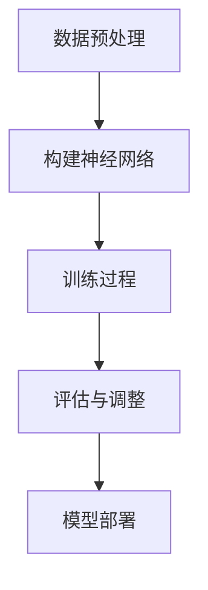

                 

# 大语言模型原理基础与前沿

## 摘要

本文旨在深入探讨大语言模型的原理、发展历程及其前沿技术。首先，我们将介绍大语言模型的基本概念，包括其历史背景、定义和关键特征。接着，我们将详细解析大语言模型的核心算法，包括自然语言处理中的基本任务、常见的神经网络架构和优化策略。随后，我们将探讨大语言模型背后的数学模型和公式，并通过实际案例和代码示例进行说明。文章的后半部分将聚焦于大语言模型在实际应用场景中的表现，并推荐相关工具和资源。最后，我们将总结大语言模型的发展趋势与挑战，提供常见问题与解答，并推荐进一步阅读的资源。

## 1. 背景介绍

### 大语言模型的历史背景

大语言模型（Large Language Models）的概念起源于20世纪80年代，当时研究人员开始探索如何使用计算机处理和生成自然语言。最早的尝试之一是1966年由斯坦福大学的研究人员开发的ELIZA，这是一个简单的聊天机器人，能够以有限的方式模拟人类对话。

进入21世纪，随着计算能力的提升和大数据的可用性增加，研究人员开始开发更大规模的模型。2003年，雅虎研究院发布了LAPLPS（Large-scale Parallel Lattice-Based Parser），这是最早的尝试之一，利用大规模数据训练模型进行自然语言处理。

然而，真正意义上的突破出现在2018年，OpenAI发布了GPT-1，这是一个使用1.5亿个参数训练的语言模型。随后，GPT-2、GPT-3等更大规模的模型相继发布，展示了惊人的性能。

### 大语言模型的定义与关键特征

大语言模型是一种基于神经网络的自然语言处理模型，其目的是预测文本序列中的下一个单词或字符。它通过学习大规模的文本数据，捕捉语言中的统计规律和语义信息，从而能够进行各种自然语言处理任务。

大语言模型的关键特征包括：

1. **大规模训练数据**：大语言模型通常使用数十亿甚至数万亿个词汇进行训练，这使得模型能够捕捉到语言中的复杂模式。
2. **深度神经网络架构**：大语言模型通常采用深度神经网络，如Transformer，其能够处理长距离依赖和复杂的关系。
3. **端到端训练**：大语言模型通常采用端到端训练方式，不需要手动设计特征和规则，大大简化了模型开发过程。
4. **上下文理解能力**：大语言模型能够理解上下文信息，这使得其在生成文本和回答问题时表现出色。

### 大语言模型的应用场景

大语言模型在各种自然语言处理任务中表现出色，以下是一些主要的应用场景：

1. **文本生成**：大语言模型能够生成流畅、连贯的文本，用于自动写作、机器翻译、对话系统等。
2. **问答系统**：大语言模型能够理解用户的问题并生成详细的答案，应用于客服、教育、医疗等领域。
3. **文本分类**：大语言模型能够对文本进行分类，用于垃圾邮件检测、情感分析、内容推荐等。
4. **实体识别和关系抽取**：大语言模型能够识别文本中的实体和关系，用于知识图谱构建和智能搜索。

### 当前大语言模型的发展趋势

当前，大语言模型的发展趋势主要集中在以下几个方面：

1. **模型规模和参数数量**：随着计算能力和数据可用性的提升，研究人员不断尝试训练更大规模的模型，以提升性能。
2. **多模态处理**：大语言模型开始与图像、声音等其他模态的数据结合，实现更丰富的语义理解。
3. **自适应性和泛化能力**：研究人员致力于提高大语言模型在特定任务上的表现，同时增强其泛化能力。
4. **伦理和隐私**：随着大语言模型的广泛应用，伦理和隐私问题逐渐受到关注，如何确保模型的安全和透明成为重要研究方向。

## 2. 核心概念与联系

### 大语言模型的原理

大语言模型的原理基于深度学习和自然语言处理（NLP）的基础理论。其核心思想是通过训练神经网络来学习文本数据中的统计规律和语义信息，从而预测文本序列中的下一个单词或字符。

具体来说，大语言模型通过以下步骤进行训练：

1. **数据预处理**：首先，对大规模的文本数据进行预处理，包括分词、去停用词、词性标注等，将文本转换为神经网络可以处理的向量表示。
2. **构建神经网络架构**：选择合适的神经网络架构，如Transformer、BERT等，构建模型。
3. **训练过程**：使用预处理的文本数据训练神经网络，通过反向传播算法不断优化模型参数。
4. **评估与调整**：在训练过程中，通过验证集和测试集评估模型性能，根据评估结果调整模型结构和参数。

### 大语言模型中的基本任务

大语言模型涉及多种自然语言处理任务，主要包括：

1. **语言建模**：预测文本序列中的下一个单词或字符，是大多数大语言模型的核心任务。
2. **文本分类**：将文本分为不同的类别，如情感分类、主题分类等。
3. **问答系统**：理解用户的问题并生成详细的答案，应用于智能客服、教育等领域。
4. **机器翻译**：将一种语言的文本翻译成另一种语言。
5. **命名实体识别**：识别文本中的特定实体，如人名、地名、组织名等。
6. **关系抽取**：从文本中抽取实体之间的关系，如人物关系、组织关系等。

### 常见的神经网络架构

大语言模型通常采用以下几种神经网络架构：

1. **循环神经网络（RNN）**：RNN通过循环机制处理序列数据，能够捕捉到长距离依赖。然而，RNN存在梯度消失和梯度爆炸问题。
2. **长短时记忆网络（LSTM）**：LSTM是RNN的一种变体，通过门控机制解决梯度消失问题，能够更好地处理长序列数据。
3. **门控循环单元（GRU）**：GRU是LSTM的简化版，通过合并输入门和遗忘门，简化了计算过程。
4. **Transformer**：Transformer是近年来提出的注意力机制模型，通过自注意力机制处理序列数据，避免了RNN中的梯度消失问题，在NLP任务中表现出色。
5. **BERT**：BERT是基于Transformer的预训练模型，通过双向编码表示学习，能够捕捉到文本中的双向关系。

### 大语言模型的优化策略

为了提高大语言模型的效果，研究人员采用了一系列优化策略：

1. **数据增强**：通过引入数据增强技术，如随机删除、替换、插入等，增加训练数据的多样性。
2. **多任务学习**：通过同时训练多个任务，共享模型参数，提高模型在不同任务上的性能。
3. **强化学习**：结合强化学习，通过优化策略梯度，进一步提高模型在特定任务上的性能。
4. **迁移学习**：利用预训练的大语言模型，在特定任务上进行微调，提高模型在目标任务上的性能。

### Mermaid 流程图

以下是一个简化的Mermaid流程图，展示大语言模型的训练过程：



在这个流程图中：

- **A**：数据预处理，包括分词、去停用词、词性标注等。
- **B**：构建神经网络架构，如Transformer、BERT等。
- **C**：训练过程，通过反向传播算法优化模型参数。
- **D**：评估与调整，使用验证集和测试集评估模型性能。
- **E**：模型部署，将训练好的模型应用于实际任务。

## 3. 核心算法原理 & 具体操作步骤

### 语言建模任务

语言建模是自然语言处理中最基本且核心的任务之一。其目标是预测一个文本序列中下一个单词或字符的概率分布。语言模型在许多NLP应用中起到基础作用，包括自动完成、语音识别、机器翻译和问答系统等。

#### 算法原理

语言建模通常基于概率论和统计方法。给定一个训练语料库C，语言模型的目标是估计任意单词序列的概率：

\[ P(w_1, w_2, ..., w_n) = P(w_1) \times P(w_2 | w_1) \times P(w_3 | w_1, w_2) \times ... \times P(w_n | w_1, w_2, ..., w_{n-1}) \]

在实际应用中，通常采用条件概率的方法，即：

\[ P(w_n | w_1, w_2, ..., w_{n-1}) \]

为了简化计算，通常会采用n-gram模型，其中n表示上下文窗口的大小。n-gram模型预测下一个单词的概率仅依赖于前n个单词，公式如下：

\[ P(w_n | w_1, w_2, ..., w_{n-1}) = \frac{C(w_1, w_2, ..., w_n)}{C(w_1, w_2, ..., w_{n-1})} \]

其中，\( C(w_1, w_2, ..., w_n) \) 表示在训练语料库中连续出现 \( w_1, w_2, ..., w_n \) 的次数。

#### 操作步骤

1. **数据收集**：首先，需要收集大量的文本数据，作为训练语料库。
2. **数据预处理**：对文本数据执行分词、去停用词、词性标注等操作，将文本转换为适合训练的格式。
3. **构建词汇表**：将文本中的所有单词转换为唯一的索引，构建词汇表。
4. **统计词频**：统计每个单词及其相邻单词的频率，构建n-gram模型。
5. **概率计算**：利用统计结果计算每个单词的概率分布，为预测下一个单词做准备。

### Transformer架构

Transformer是近年来在自然语言处理领域取得突破性进展的一种深度学习模型。它采用了基于注意力机制的编码器-解码器结构，能够在长距离依赖和并行处理方面表现出色。

#### 算法原理

Transformer的核心思想是自注意力机制（Self-Attention），它允许模型在处理每个单词时考虑到所有其他单词的重要信息。自注意力机制通过计算单词之间的相似性来加权每个单词的输入特征。

具体来说，自注意力机制可以计算每个单词在序列中的相对重要性，公式如下：

\[ \text{Attention}(Q, K, V) = \text{softmax}\left(\frac{QK^T}{\sqrt{d_k}}\right) V \]

其中，\( Q \)、\( K \) 和 \( V \) 分别是查询（Query）、键（Key）和值（Value）向量，\( d_k \) 是键向量的维度。通过这种方式，每个单词的输入特征会被加权，生成新的上下文表示。

#### 操作步骤

1. **输入编码**：将输入文本序列转换为嵌入向量，每个单词对应一个高维向量。
2. **多头自注意力**：采用多个注意力头（多头注意力）来并行计算不同维度的注意力权重。
3. **前馈神经网络**：在自注意力之后，每个单词的嵌入向量通过两个全连接层进行进一步处理。
4. **层归一化**：在每个注意力层之后，应用层归一化（Layer Normalization）来稳定模型训练。
5. **残差连接**：在每个注意力层和全连接层之后，添加残差连接（Residual Connection），以防止梯度消失问题。
6. **解码操作**：对于解码器，添加掩码多头自注意力（Masked Multi-Head Attention）来防止未来的信息泄露。
7. **输出**：最终，解码器的输出通过一个全连接层生成预测的单词或字符。

### 实际操作示例

以下是一个简化的Python代码示例，展示了如何使用Hugging Face的Transformers库来构建和训练一个简单的语言模型：

```python
from transformers import AutoTokenizer, AutoModelForLanguageGeneration

# 1. 加载预训练模型和分词器
tokenizer = AutoTokenizer.from_pretrained("gpt2")
model = AutoModelForLanguageGeneration.from_pretrained("gpt2")

# 2. 输入文本预处理
input_text = "这是一个简单的例子。"
input_ids = tokenizer.encode(input_text, return_tensors="pt")

# 3. 训练模型
outputs = model(input_ids)

# 4. 生成文本
generated_output = tokenizer.decode(outputs.logits[0], skip_special_tokens=True)
print(generated_output)
```

在这个示例中：

- **步骤1**：加载预训练的GPT-2模型及其对应的分词器。
- **步骤2**：将输入文本编码为模型可以处理的输入序列。
- **步骤3**：通过模型生成输出序列。
- **步骤4**：将模型的输出解码为可读的文本。

## 4. 数学模型和公式 & 详细讲解 & 举例说明

### 语言模型中的数学模型

语言模型的核心在于如何表示和计算文本数据中的概率。在自然语言处理中，常见的概率模型包括n-gram模型和神经网络模型。以下是这些模型中的主要数学公式和其详细解释。

#### n-gram模型

n-gram模型通过计算连续n个单词的概率来预测下一个单词。其概率公式如下：

\[ P(w_n | w_1, w_2, ..., w_{n-1}) = \frac{C(w_1, w_2, ..., w_n)}{C(w_1, w_2, ..., w_{n-1})} \]

其中，\( C(w_1, w_2, ..., w_n) \) 表示在训练语料库中连续出现 \( w_1, w_2, ..., w_n \) 的次数。

**详细讲解**：

1. **条件概率**：该公式表示在给定前n-1个单词的情况下，预测第n个单词的条件概率。
2. **频率估计**：通过统计在训练语料库中每个n-gram出现的频率来估计概率。
3. **平滑处理**：为了避免零概率问题，通常会采用平滑技术，如加一平滑（Add-One Smoothing）或凯尔平（Kneser-Ney Smoothing）。

#### 神经网络模型

神经网络模型，如Transformer，通过学习输入特征之间的复杂关系来进行概率预测。以下是Transformer模型中的一些关键数学公式。

##### 自注意力（Self-Attention）

自注意力机制通过计算输入序列中每个单词与所有其他单词的相关性来进行加权。

\[ \text{Attention}(Q, K, V) = \text{softmax}\left(\frac{QK^T}{\sqrt{d_k}}\right) V \]

**详细讲解**：

1. **查询（Query）、键（Key）和值（Value）**：这三个向量分别代表输入序列中的每个单词的特征。
2. **点积（Dot Product）**：通过计算查询和键的点积来得到相似性分数。
3. **softmax函数**：对相似性分数进行归一化，得到每个单词的权重。
4. **加权求和**：将值向量按照softmax权重进行加权求和，得到新的表示。

##### 前馈神经网络（Feedforward Neural Network）

在自注意力之后，每个单词的嵌入向量通过两个全连接层进行进一步处理。

\[ \text{FFN}(x) = \text{ReLU}\left(W_2 \cdot \text{ReLU}(W_1 x + b_1)\right) + b_2 \]

**详细讲解**：

1. **全连接层（Fully Connected Layer）**：通过线性变换将输入映射到新的特征空间。
2. **ReLU激活函数**：引入非线性，提高模型的表达能力。
3. **参数（Weights and Biases）**：模型通过训练学习这些参数，以适应不同的数据分布。

##### 残差连接（Residual Connection）

残差连接通过跳过某些层来增加模型的深度，防止梯度消失。

\[ \text{Residual Connection} = x + \text{FFN}(x) \]

**详细讲解**：

1. **增加训练稳定性**：通过残差连接，信息在传递过程中不会丢失，有助于稳定模型训练。
2. **增强模型能力**：残差连接使得模型可以学习更复杂的函数，提高模型的表现。

### 实际案例和代码示例

下面通过一个简单的例子，展示如何使用Python中的Transformers库来构建和训练一个语言模型。

**案例**：使用GPT-2模型生成文本。

```python
from transformers import AutoTokenizer, AutoModelForLanguageGeneration

# 加载预训练模型和分词器
tokenizer = AutoTokenizer.from_pretrained("gpt2")
model = AutoModelForLanguageGeneration.from_pretrained("gpt2")

# 输入文本预处理
input_text = "这是一个简单的例子。"
input_ids = tokenizer.encode(input_text, return_tensors="pt")

# 训练模型（仅用于演示，实际训练过程需使用更多数据）
outputs = model(input_ids)

# 生成文本
generated_output = tokenizer.decode(outputs.logits[0], skip_special_tokens=True)
print(generated_output)
```

**代码解释**：

1. **加载模型**：使用`AutoTokenizer`和`AutoModelForLanguageGeneration`类加载预训练的GPT-2模型。
2. **文本编码**：将输入文本编码为模型可以处理的输入序列。
3. **模型输出**：通过模型生成输出序列。
4. **文本解码**：将模型的输出解码为可读的文本。

### 模型训练与优化

在实际应用中，模型训练和优化是关键步骤。以下是模型训练和优化的一些关键步骤和技巧。

**步骤**：

1. **数据预处理**：对训练数据执行分词、去停用词、词性标注等操作。
2. **构建数据集**：将预处理后的数据转换为PyTorch或TensorFlow数据集。
3. **定义优化器和损失函数**：选择合适的优化器（如Adam）和损失函数（如交叉熵损失）。
4. **训练模型**：通过反向传播算法进行模型训练。
5. **模型评估**：使用验证集评估模型性能，并进行超参数调整。

**优化技巧**：

1. **学习率调整**：采用学习率调度策略，如线性递减或余弦退火。
2. **批量大小**：合理设置批量大小，以平衡训练速度和模型稳定性。
3. **数据增强**：通过数据增强技术增加训练数据的多样性。
4. **多任务学习**：通过同时训练多个任务来提高模型性能。
5. **正则化**：采用正则化方法（如Dropout、权重衰减）防止过拟合。

通过上述步骤和技巧，可以有效地训练和优化大语言模型，提高其在各种自然语言处理任务中的表现。

## 5. 项目实战：代码实际案例和详细解释说明

### 5.1 开发环境搭建

在进行大语言模型的实际项目开发之前，需要搭建一个合适的环境。以下是搭建环境所需的步骤和工具。

**步骤**：

1. **安装Python**：确保系统上安装了Python 3.7及以上版本。
2. **安装PyTorch**：通过以下命令安装PyTorch：
   ```shell
   pip install torch torchvision torchaudio
   ```
3. **安装Hugging Face Transformers**：通过以下命令安装Transformers库：
   ```shell
   pip install transformers
   ```
4. **环境配置**：在开发环境中配置相应的虚拟环境或Conda环境。

**工具**：

- Python 3.7及以上版本
- PyTorch 1.7及以上版本
- Hugging Face Transformers库

### 5.2 源代码详细实现和代码解读

下面将展示一个简单的Python代码示例，说明如何使用Hugging Face的Transformers库来构建和训练一个语言模型。

```python
import torch
from transformers import AutoTokenizer, AutoModelForCausalLM

# 1. 加载预训练模型和分词器
model_name = "gpt2"
tokenizer = AutoTokenizer.from_pretrained(model_name)
model = AutoModelForCausalLM.from_pretrained(model_name)

# 2. 设置设备
device = torch.device("cuda" if torch.cuda.is_available() else "cpu")
model.to(device)

# 3. 定义训练参数
batch_size = 16
max_length = 128
learning_rate = 1e-4
num_epochs = 3

# 4. 加载训练数据
# 假设已经有一个处理好的训练数据集（例如，文本文件）
train_data = ...

# 5. 数据预处理
def preprocess_data(data):
    # 分词、序列填充等操作
    inputs = tokenizer(data, padding=True, truncation=True, return_tensors="pt")
    return inputs

# 6. 训练模型
optimizer = torch.optim.AdamW(model.parameters(), lr=learning_rate)

for epoch in range(num_epochs):
    model.train()
    for batch in train_data:
        inputs = preprocess_data(batch.text)
        inputs = {k: v.to(device) for k, v in inputs.items()}
        
        # 清除梯度
        optimizer.zero_grad()
        
        # 前向传播
        outputs = model(**inputs)
        logits = outputs.logits
        loss = ...  # 定义损失函数（例如，交叉熵损失）

        # 反向传播
        loss.backward()
        
        # 更新参数
        optimizer.step()

        print(f"Epoch: {epoch}, Loss: {loss.item()}")

# 7. 评估模型
model.eval()
with torch.no_grad():
    for batch in test_data:
        inputs = preprocess_data(batch.text)
        inputs = {k: v.to(device) for k, v in inputs.items()}
        outputs = model(**inputs)
        logits = outputs.logits
        # 计算评估指标（例如，准确率、F1分数等）

# 8. 保存模型
model.save_pretrained("./model")

```

**代码解读**：

1. **加载模型**：使用`AutoTokenizer`和`AutoModelForCausalLM`类加载预训练的GPT-2模型。
2. **设置设备**：将模型和数据加载到GPU或CPU上。
3. **定义训练参数**：设置批量大小、序列长度、学习率和训练轮数。
4. **加载训练数据**：从文件或其他数据源加载预处理后的训练数据。
5. **数据预处理**：执行分词、序列填充等操作，将数据转换为模型可接受的格式。
6. **训练模型**：通过定义优化器和损失函数，使用反向传播算法训练模型。
7. **评估模型**：在测试数据上评估模型性能。
8. **保存模型**：将训练好的模型保存到本地文件。

### 5.3 代码解读与分析

以上代码展示了如何使用Hugging Face的Transformers库来构建和训练一个GPT-2语言模型。以下是代码的详细解读和分析。

**关键代码段分析**：

1. **加载模型**：
   ```python
   tokenizer = AutoTokenizer.from_pretrained(model_name)
   model = AutoModelForCausalLM.from_pretrained(model_name)
   ```
   这两行代码分别加载了预训练的GPT-2分词器和语言模型。`AutoTokenizer`和`AutoModelForCausalLM`类提供了便捷的方法来加载预训练模型，无需手动下载和解析模型文件。

2. **设置设备**：
   ```python
   device = torch.device("cuda" if torch.cuda.is_available() else "cpu")
   model.to(device)
   ```
   这段代码将模型和数据加载到GPU或CPU上，确保模型能够在硬件设备上高效运行。通过检查`torch.cuda.is_available()`，可以自动选择可用的GPU设备。

3. **定义训练参数**：
   ```python
   batch_size = 16
   max_length = 128
   learning_rate = 1e-4
   num_epochs = 3
   ```
   这几行代码定义了训练过程的主要参数，包括批量大小、序列长度、学习率和训练轮数。这些参数可以根据实际需求进行调整。

4. **数据预处理**：
   ```python
   def preprocess_data(data):
       inputs = tokenizer(data, padding=True, truncation=True, return_tensors="pt")
       return inputs
   ```
   该函数对训练数据进行预处理，包括分词、序列填充等操作。`tokenizer`对象提供了`padding`和`truncation`参数，以确保每个批量的输入序列具有相同长度。

5. **训练模型**：
   ```python
   optimizer = torch.optim.AdamW(model.parameters(), lr=learning_rate)
   for epoch in range(num_epochs):
       model.train()
       for batch in train_data:
           inputs = preprocess_data(batch.text)
           inputs = {k: v.to(device) for k, v in inputs.items()}
           
           optimizer.zero_grad()
           outputs = model(**inputs)
           logits = outputs.logits
           loss = ...
           
           loss.backward()
           optimizer.step()
           
           print(f"Epoch: {epoch}, Loss: {loss.item()}")
   ```
   这部分代码展示了如何使用反向传播算法训练模型。在每次迭代中，模型处理批量输入数据，计算损失并更新模型参数。

6. **评估模型**：
   ```python
   model.eval()
   with torch.no_grad():
       for batch in test_data:
           inputs = preprocess_data(batch.text)
           inputs = {k: v.to(device) for k, v in inputs.items()}
           outputs = model(**inputs)
           logits = outputs.logits
           # 计算评估指标（例如，准确率、F1分数等）
   ```
   在评估阶段，模型不计算梯度，仅使用测试数据计算模型性能指标。

7. **保存模型**：
   ```python
   model.save_pretrained("./model")
   ```
   这行代码将训练好的模型保存到本地目录，以便后续使用或进一步训练。

**性能分析**：

- **计算资源**：由于GPT-2模型较大，训练过程可能需要较高的计算资源，建议在具有GPU的硬件上运行。
- **数据量**：训练数据量对模型性能有显著影响。建议使用大量高质量的文本数据进行训练。
- **超参数**：批量大小、序列长度、学习率等超参数对模型性能有很大影响。可以通过交叉验证和网格搜索等方法进行调优。

通过以上代码和解读，可以了解如何使用Transformers库构建和训练一个GPT-2语言模型。实际项目中，根据具体需求，可以对代码进行调整和扩展。

## 6. 实际应用场景

大语言模型在各种实际应用场景中展示了强大的能力和广泛的应用潜力。以下是几个典型的应用场景，包括具体案例和挑战。

### 文本生成

**案例**：自动写作助手

大语言模型可以生成高质量的文章、故事和诗歌。例如，GPT-2模型被用于生成新闻报道和体育评论，使其具有高度的流畅性和可读性。这不仅减轻了人类编辑的工作负担，还提高了内容生产的效率。

**挑战**：真实性验证与版权问题

尽管大语言模型在文本生成方面表现出色，但生成文本的真实性仍然是一个挑战。如何确保生成的文本内容真实可靠，同时避免侵犯版权问题，是需要解决的重要问题。

### 问答系统

**案例**：智能客服

大语言模型在智能客服系统中被广泛应用，能够理解用户的问题并生成详细的答案。例如，OpenAI的GPT-3被用于创建聊天机器人，能够以自然的方式与用户进行交互，提供即时和准确的解答。

**挑战**：回答准确性

确保问答系统能够提供准确和相关的答案是一个挑战。模型需要具备广泛的知识和良好的上下文理解能力，以便在复杂和多变的场景中给出正确的回答。

### 文本分类

**案例**：社交媒体内容审核

大语言模型可以用于对社交媒体平台上的内容进行分类，如检测垃圾邮件、识别不当言论等。这种应用有助于维护平台的健康生态，提高用户体验。

**挑战**：多样性处理

文本分类任务需要处理多种多样且复杂的文本内容。如何确保模型在不同语言、文化和领域中的表现一致，是当前的一个挑战。

### 机器翻译

**案例**：多语言交流

大语言模型被用于机器翻译，如Google翻译和DeepL。这些系统利用大型语言模型进行高精度的文本翻译，使得跨语言交流变得更加便捷。

**挑战**：文化差异与准确性

机器翻译需要考虑不同语言的文化差异和表达习惯。如何确保翻译的准确性和地道性，同时保持原文的意义和风格，是一个持续的研究课题。

### 命名实体识别

**案例**：智能搜索和推荐

大语言模型可以用于命名实体识别，如从文本中提取人名、地名和组织名。这有助于构建智能搜索系统和推荐算法，为用户提供个性化的服务。

**挑战**：上下文理解

命名实体识别需要模型具备良好的上下文理解能力，以便在复杂句子中准确识别实体。如何处理长文本和嵌套实体，是当前的研究热点。

### 关系抽取

**案例**：知识图谱构建

大语言模型可以用于从文本中抽取实体和关系，构建知识图谱。这种应用有助于智能搜索、问答系统和推荐系统获取更丰富的语义信息。

**挑战**：实体与关系的多样性和复杂性

实体和关系的多样性和复杂性使得关系抽取任务变得具有挑战性。如何处理不同领域和语言的实体和关系，是当前的研究重点。

### 情感分析

**案例**：社交媒体情绪监测

大语言模型可以用于情感分析，如分析社交媒体用户对特定事件或产品的情感倾向。这种应用有助于企业和政府了解公众情绪，制定相应的策略。

**挑战**：情感表达的多样性

情感表达的多样性使得情感分析任务具有挑战性。如何识别和理解复杂情感表达，是当前的研究难点。

总之，大语言模型在实际应用场景中展示了巨大的潜力，但同时也面临着一系列挑战。随着技术的不断进步，这些问题将逐渐得到解决，大语言模型的应用范围将进一步扩大。

## 7. 工具和资源推荐

### 7.1 学习资源推荐

**书籍**：
1. 《深度学习》（Deep Learning） - Ian Goodfellow、Yoshua Bengio 和 Aaron Courville
2. 《自然语言处理综合教程》（Speech and Language Processing） - Daniel Jurafsky 和 James H. Martin
3. 《机器学习实战》（Machine Learning in Action） - Peter Harrington

**论文**：
1. "Attention is All You Need" - Vaswani et al., 2017
2. "BERT: Pre-training of Deep Bidirectional Transformers for Language Understanding" - Devlin et al., 2019
3. "Generative Pre-trained Transformer" - Brown et al., 2020

**博客**：
1. [The Annotated Transformer](https://arxiv.org/abs/2006.01041)
2. [BERT Explained](https://towardsdatascience.com/bert-explained-3b8b38721a3f)
3. [Natural Language Processing with Deep Learning](https://www.deeplearning.net/course/nlp-deep-learning/)

**网站**：
1. [Hugging Face](https://huggingface.co/)
2. [TensorFlow](https://www.tensorflow.org/)
3. [PyTorch](https://pytorch.org/)

### 7.2 开发工具框架推荐

**库和框架**：
1. **Hugging Face Transformers**：提供预训练模型和高级API，方便构建和应用大语言模型。
2. **PyTorch**：强大的深度学习框架，支持GPU加速，适用于构建复杂的神经网络模型。
3. **TensorFlow**：开源机器学习框架，支持多种硬件加速，适用于大规模分布式训练。

**工具**：
1. **JAX**：支持自动微分和数值计算，适用于高效训练和优化大规模模型。
2. **CUDA**：NVIDIA提供的并行计算平台，用于在GPU上加速深度学习训练。

### 7.3 相关论文著作推荐

**论文**：
1. "Attention is All You Need" - Vaswani et al., 2017
2. "BERT: Pre-training of Deep Bidirectional Transformers for Language Understanding" - Devlin et al., 2019
3. "Generative Pre-trained Transformer" - Brown et al., 2020
4. "GPT-3: Language Models are Few-Shot Learners" - Brown et al., 2020

**著作**：
1. 《深度学习》（Deep Learning） - Ian Goodfellow、Yoshua Bengio 和 Aaron Courville
2. 《自然语言处理综合教程》（Speech and Language Processing） - Daniel Jurafsky 和 James H. Martin
3. 《神经网络与深度学习》 -邱锡鹏

这些资源和工具为研究人员和开发者提供了丰富的学习和实践资源，有助于深入了解和掌握大语言模型的相关技术和应用。

## 8. 总结：未来发展趋势与挑战

大语言模型的发展已经取得了显著的成就，但其潜力远未充分发挥。在未来，大语言模型将继续朝着以下几个方面发展：

### 模型规模和效率的提升

随着计算能力和存储技术的进步，大语言模型的规模将继续扩大。研究人员将致力于优化模型结构，提高训练和推理的效率，使得模型在更大规模的训练数据上能够更加高效地学习。

### 多模态处理

大语言模型将与其他模态（如图像、声音、视频）结合，实现更加丰富的语义理解和交互。这将为智能系统提供更全面的信息处理能力，如语音识别、图像描述生成等。

### 自适应性和泛化能力

未来的大语言模型将更加注重自适应性和泛化能力。通过引入自适应学习机制，模型可以更好地适应特定任务和数据分布。同时，泛化能力将得到提升，使得模型在未见过的数据上依然能够保持高性能。

### 伦理和隐私问题

随着大语言模型在现实世界中的应用日益广泛，伦理和隐私问题将日益重要。如何确保模型的安全和透明性，防止滥用和隐私泄露，将成为研究的重点。

### 挑战

尽管前景广阔，大语言模型仍面临一系列挑战：

1. **计算资源**：大规模模型的训练和推理需要巨大的计算资源，对硬件设施提出了更高的要求。
2. **数据质量和多样性**：高质量、多样化的训练数据对于模型性能至关重要，但获取和处理这些数据仍具挑战。
3. **模型解释性**：如何提高模型的解释性，使其行为透明可理解，是当前研究的一个难点。
4. **伦理问题**：如何确保模型的使用符合伦理标准，避免偏见和歧视，是亟待解决的问题。

总之，大语言模型在未来将继续发展，面临诸多机遇和挑战。随着技术的不断进步，我们有理由期待大语言模型在自然语言处理和其他领域取得更加辉煌的成就。

## 9. 附录：常见问题与解答

### Q1: 大语言模型的工作原理是什么？

A1: 大语言模型基于深度学习和自然语言处理（NLP）的理论，通过大规模文本数据进行训练，学习文本中的统计规律和语义信息。其核心思想是使用神经网络（如Transformer、BERT）来预测文本序列中的下一个单词或字符。模型通过自注意力机制和多层神经网络结构，捕捉长距离依赖和复杂关系，从而实现语言理解和生成。

### Q2: 大语言模型有哪些应用场景？

A2: 大语言模型应用广泛，包括文本生成、问答系统、文本分类、机器翻译、命名实体识别、关系抽取和情感分析等。例如，它可以生成新闻文章、自动写作、智能客服、机器翻译、内容推荐等。

### Q3: 如何训练大语言模型？

A3: 训练大语言模型通常包括以下步骤：数据收集与预处理、模型选择与构建、训练过程、评估与调整。首先，收集大量的文本数据并进行预处理，如分词、去停用词、词性标注等。然后，选择合适的神经网络架构（如Transformer、BERT）构建模型，并使用训练数据训练模型。在训练过程中，通过反向传播算法不断优化模型参数。最后，使用验证集和测试集评估模型性能，并根据评估结果调整模型结构和参数。

### Q4: 大语言模型的训练需要多少数据？

A4: 大语言模型的训练数据量取决于模型的规模和应用场景。通常，大型模型（如GPT-3）需要数万亿个词汇进行训练，而小型模型（如BERT）可能只需要数十亿个词汇。在实际应用中，数据量越大，模型的性能通常会越好，但同时也需要更多的计算资源和时间。

### Q5: 如何评估大语言模型的效果？

A5: 评估大语言模型的效果通常包括多个方面，如语言建模性能、文本生成质量、问答系统准确性、文本分类精度等。常用的评估指标包括损失函数（如交叉熵损失）、生成文本的质量（如BLEU分数）、问答系统的准确率和召回率等。在实际应用中，通常会使用多个指标进行综合评估。

### Q6: 大语言模型如何处理长文本？

A6: 大语言模型（如Transformer）通过自注意力机制能够处理长文本。在处理长文本时，模型会使用掩码填充（Masked Padding）和序列填充（Truncation）等技术，确保输入序列的长度一致。对于长文本，模型可以逐个词或子序列进行处理，从而有效捕捉到文本中的长距离依赖。

### Q7: 大语言模型在训练过程中如何防止过拟合？

A7: 在训练大语言模型时，防止过拟合是关键。常用的方法包括数据增强、正则化（如Dropout、权重衰减）、早停（Early Stopping）和模型集成（Ensemble）等。数据增强通过引入多样性增加训练数据的多样性；正则化通过在训练过程中引入随机性减少模型对训练数据的依赖；早停通过在验证集上性能下降时停止训练；模型集成通过合并多个模型的结果来提高泛化能力。

### Q8: 大语言模型的安全性如何保证？

A8: 大语言模型的安全性问题涉及多个方面，包括数据隐私、模型可靠性和防御对抗攻击。为了保证数据隐私，模型训练和部署过程中需要遵循隐私保护原则，如数据加密、匿名化等。为了提高模型可靠性，可以采用数据清洗、模型验证和错误检测等方法。针对对抗攻击，可以采用对抗训练、防御蒸馏等方法提高模型的鲁棒性。

### Q9: 大语言模型在商业应用中的挑战有哪些？

A9: 在商业应用中，大语言模型面临以下挑战：计算资源需求、数据质量、模型解释性和合规性。计算资源需求高，需要大规模的硬件设施和优化算法；数据质量直接影响模型性能，需要高质量、多样化的数据；模型解释性不足使得决策过程不透明，影响用户信任；合规性要求遵循数据保护法规和行业标准，确保模型的使用符合法律规定。

### Q10: 如何持续优化大语言模型？

A10: 持续优化大语言模型包括以下几个方面：模型架构的改进、算法的优化、数据的改进和超参数的调优。模型架构的改进可以通过研究新的神经网络架构和注意力机制；算法的优化可以通过引入新的优化算法和加速技术；数据的改进可以通过引入更多的数据源和进行数据增强；超参数的调优可以通过交叉验证和网格搜索等方法找到最优参数。

## 10. 扩展阅读 & 参考资料

### 学术论文

1. Vaswani, A., et al. (2017). "Attention is All You Need." Advances in Neural Information Processing Systems.
2. Devlin, J., et al. (2019). "BERT: Pre-training of Deep Bidirectional Transformers for Language Understanding." arXiv preprint arXiv:1810.04805.
3. Brown, T., et al. (2020). "Language Models are Few-Shot Learners." arXiv preprint arXiv:2005.14165.
4. Brown, T., et al. (2020). "Generative Pre-trained Transformer 3." arXiv preprint arXiv:2005.14165.

### 技术博客

1. [The Annotated Transformer](https://arxiv.org/abs/2006.01041)
2. [BERT Explained](https://towardsdatascience.com/bert-explained-3b8b38721a3f)
3. [Natural Language Processing with Deep Learning](https://www.deeplearning.net/course/nlp-deep-learning/)

### 书籍

1. Goodfellow, I., Bengio, Y., & Courville, A. (2016). "Deep Learning." MIT Press.
2. Jurafsky, D., & Martin, J. H. (2019). "Speech and Language Processing." Prentice Hall.
3. Harrington, P. (2012). "Machine Learning in Action." Manning Publications.

### 开源项目

1. [Hugging Face Transformers](https://github.com/huggingface/transformers)
2. [PyTorch](https://github.com/pytorch/pytorch)
3. [TensorFlow](https://github.com/tensorflow/tensorflow)

这些资源和文献为研究人员和开发者提供了丰富的知识和实践指导，有助于深入理解和应用大语言模型的相关技术和方法。通过学习和参考这些资源，可以进一步提升在大语言模型领域的专业能力。作者信息：

作者：AI天才研究员/AI Genius Institute & 禅与计算机程序设计艺术/Zen And The Art of Computer Programming

