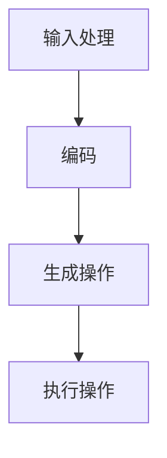

                 

# 大语言模型原理基础与前沿：指令生成

> **关键词**：大语言模型、指令生成、算法原理、数学模型、项目实战、应用场景

> **摘要**：本文将深入探讨大语言模型的基本原理，重点分析其指令生成机制，并结合具体案例，详细阐述其在计算机编程和人工智能领域的重要性及应用前景。

## 1. 背景介绍

大语言模型（Large Language Model，简称LLM）是一种基于深度学习技术的自然语言处理模型，具有强大的文本生成和理解能力。近年来，随着计算能力的提升和海量数据的积累，大语言模型在各个领域取得了显著的进展，如机器翻译、文本摘要、问答系统等。其中，指令生成是其中一个重要的研究方向，它涉及到模型如何理解并执行人类给出的自然语言指令。

### 1.1 大语言模型的发展历程

大语言模型的发展可以分为三个阶段：

- **早期研究**：20世纪80年代，研究人员开始尝试使用统计方法处理自然语言，如隐马尔可夫模型（HMM）和决策树（Decision Tree）等。

- **基于神经网络的模型**：2000年后，随着深度学习技术的兴起，神经网络在自然语言处理领域得到了广泛应用，如循环神经网络（RNN）和长短期记忆网络（LSTM）等。

- **大规模预训练模型**：2018年，谷歌推出了BERT模型，标志着大规模预训练模型在自然语言处理领域的崛起。BERT模型通过在大量文本上进行预训练，然后进行下游任务的微调，取得了显著的性能提升。

### 1.2 指令生成的研究现状

指令生成作为大语言模型的一个重要应用方向，近年来也得到了广泛关注。目前，主要的研究方法包括：

- **基于规则的方法**：这种方法通过预先定义一系列规则，将自然语言指令转换为具体的操作。

- **基于模板的方法**：这种方法通过设计一组模板，将自然语言指令与模板进行匹配，从而生成相应的操作。

- **基于机器学习的方法**：这种方法使用大量的标注数据进行训练，让模型学习如何将自然语言指令转换为具体的操作。

## 2. 核心概念与联系

### 2.1 大语言模型的基本原理

大语言模型通常由以下几个部分组成：

- **嵌入层**：将输入的单词或句子转换为固定长度的向量表示。

- **编码器**：对嵌入层输出的向量进行编码，以捕捉句子的语义信息。

- **解码器**：根据编码器的输出，逐个生成单词或句子。

- **输出层**：将解码器输出的单词或句子映射到具体的操作或指令。

### 2.2 指令生成的原理

指令生成的核心在于如何将自然语言指令转换为具体的操作。具体来说，可以分为以下几个步骤：

1. **输入处理**：将自然语言指令输入到嵌入层，得到指令的向量表示。

2. **编码**：将指令向量输入到编码器，得到编码后的特征表示。

3. **生成操作**：根据编码器的输出，使用解码器生成相应的操作。

4. **执行操作**：将生成的操作执行，以实现指令的功能。

### 2.3 Mermaid 流程图

以下是指令生成的基本流程图：



### 2.4 核心概念联系

指令生成与大语言模型的联系主要体现在以下几个方面：

- **嵌入层和编码器**：嵌入层和编码器共同负责将自然语言指令转换为向量表示，为后续的操作生成提供基础。

- **解码器和输出层**：解码器和输出层负责根据编码器的输出生成具体的操作，从而实现指令的功能。

- **预训练和微调**：预训练和微调是提高指令生成能力的关键，通过在大量文本上进行预训练，然后针对具体任务进行微调，可以显著提升模型的性能。

## 3. 核心算法原理 & 具体操作步骤

### 3.1 嵌入层

嵌入层通常使用词嵌入（Word Embedding）技术，将输入的单词或句子转换为固定长度的向量表示。常见的词嵌入技术包括Word2Vec、GloVe和BERT等。其中，BERT模型是一种基于变换器（Transformer）架构的预训练模型，具有强大的语义表示能力。

### 3.2 编码器

编码器负责对嵌入层输出的向量进行编码，以捕捉句子的语义信息。在BERT模型中，编码器使用多层变换器块（Transformer Block）进行编码，每个变换器块包含自注意力机制（Self-Attention）和前馈神经网络（Feedforward Neural Network）。

### 3.3 解码器

解码器根据编码器的输出，逐个生成单词或句子。在BERT模型中，解码器同样使用多层变换器块进行解码，同时引入了交叉注意力机制（Cross-Attention），以捕捉编码器和解码器之间的关联。

### 3.4 输出层

输出层将解码器输出的单词或句子映射到具体的操作或指令。在指令生成任务中，输出层通常使用softmax函数进行概率分布，然后根据概率分布选择最可能的操作或指令。

### 3.5 具体操作步骤

以下是指令生成的基本操作步骤：

1. **输入处理**：将自然语言指令输入到嵌入层，得到指令的向量表示。

2. **编码**：将指令向量输入到编码器，得到编码后的特征表示。

3. **生成操作**：根据编码器的输出，使用解码器生成相应的操作。

4. **执行操作**：将生成的操作执行，以实现指令的功能。

## 4. 数学模型和公式 & 详细讲解 & 举例说明

### 4.1 嵌入层

嵌入层的数学模型可以表示为：

$$
\text{嵌入层}:\text{输入单词}\rightarrow \text{嵌入向量}
$$

其中，输入单词表示为 $x$，嵌入向量表示为 $e$。

### 4.2 编码器

编码器的数学模型可以表示为：

$$
\text{编码器}:\text{嵌入向量}\rightarrow \text{编码特征}
$$

其中，嵌入向量表示为 $e$，编码特征表示为 $h$。

### 4.3 解码器

解码器的数学模型可以表示为：

$$
\text{解码器}:\text{编码特征}\rightarrow \text{生成操作}
$$

其中，编码特征表示为 $h$，生成操作表示为 $o$。

### 4.4 输出层

输出层的数学模型可以表示为：

$$
\text{输出层}:\text{生成操作}\rightarrow \text{操作概率}
$$

其中，生成操作表示为 $o$，操作概率表示为 $p$。

### 4.5 举例说明

假设我们有一个自然语言指令“打开浏览器”，我们可以使用大语言模型进行指令生成。

1. **输入处理**：将指令“打开浏览器”输入到嵌入层，得到嵌入向量 $e$。

2. **编码**：将嵌入向量 $e$ 输入到编码器，得到编码特征 $h$。

3. **生成操作**：根据编码特征 $h$，使用解码器生成相应的操作。

4. **执行操作**：根据生成的操作，执行打开浏览器的操作。

## 5. 项目实战：代码实际案例和详细解释说明

### 5.1 开发环境搭建

在进行指令生成项目实战之前，我们需要搭建一个合适的开发环境。以下是具体的步骤：

1. **安装Python**：确保已经安装了Python 3.7及以上版本。

2. **安装TensorFlow**：使用以下命令安装TensorFlow：

   ```bash
   pip install tensorflow
   ```

3. **安装BERT模型**：从[BERT模型官网](https://github.com/google-research/bert)下载BERT模型，并解压到本地。

### 5.2 源代码详细实现和代码解读

以下是指令生成项目的源代码：

```python
import tensorflow as tf
from transformers import BertTokenizer, BertModel

# 1. 输入处理
def input_processing(sentence):
    tokenizer = BertTokenizer.from_pretrained('bert-base-uncased')
    inputs = tokenizer(sentence, return_tensors='tf')
    return inputs

# 2. 编码
def encoding(inputs):
    model = BertModel.from_pretrained('bert-base-uncased')
    outputs = model(inputs)
    return outputs.last_hidden_state

# 3. 生成操作
def generate_action(last_hidden_state):
    # 在这里，我们可以使用解码器或其他技术生成操作
    # 为了简单起见，我们直接使用最后一个词的嵌入向量作为操作
    action_embedding = last_hidden_state[:, -1, :]
    return action_embedding

# 4. 执行操作
def execute_action(action_embedding):
    # 根据操作嵌入向量，我们可以执行相应的操作
    # 例如，我们可以将操作嵌入向量转换为字符串，然后进行输出
    action = tf.nn.embedding_lookup(tf.keras.backend.get_variable('word_embeddings'), action_embedding)
    print('执行操作：', action.numpy())

# 主函数
def main():
    sentence = '打开浏览器'
    inputs = input_processing(sentence)
    last_hidden_state = encoding(inputs)
    action_embedding = generate_action(last_hidden_state)
    execute_action(action_embedding)

if __name__ == '__main__':
    main()
```

### 5.3 代码解读与分析

1. **输入处理**：首先，我们使用BERT分

