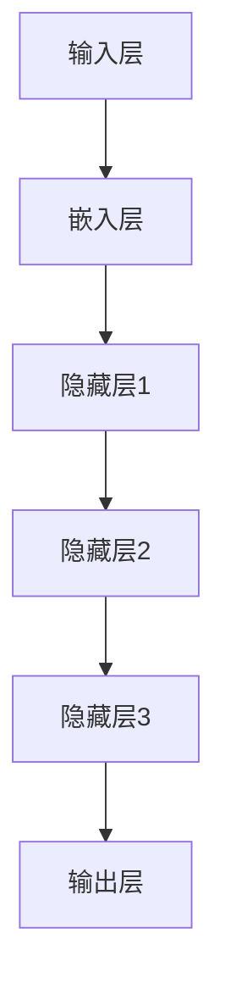
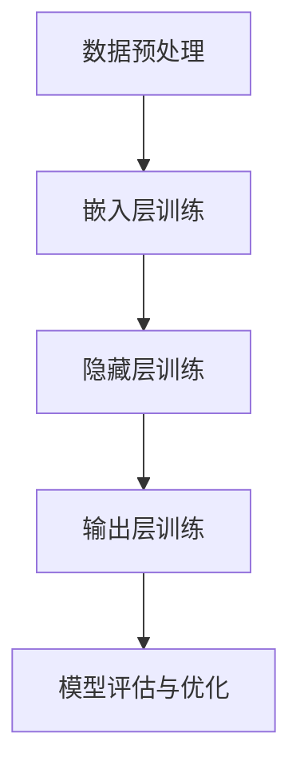
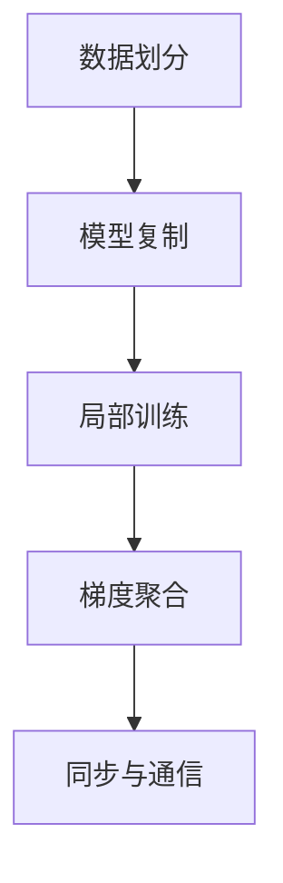
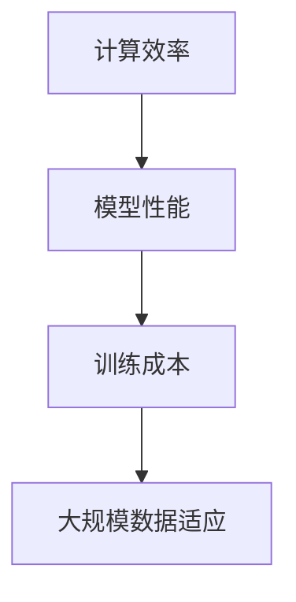

                 

# 大语言模型原理基础与前沿 数据并行

## 关键词：大语言模型，原理，前沿，数据并行，机器学习，深度学习，神经网络

## 摘要

本文旨在深入探讨大语言模型的原理及其前沿技术，特别是数据并行化在这一领域的应用。通过详细的分析和具体的实例，文章将解释大语言模型如何处理海量数据，提高训练效率，以及如何在实际应用中实现性能优化。读者将了解大语言模型的构建过程、核心算法原理，以及如何通过数学模型和公式来优化训练过程。此外，文章还将探讨大语言模型在实际应用中的场景，并提供相应的开发工具和资源推荐。通过本文的阅读，读者将获得对大语言模型及其数据并行化技术的全面了解，为未来的研究和应用打下坚实基础。

## 1. 背景介绍

### 大语言模型的定义与发展历程

大语言模型是一种基于深度学习技术的自然语言处理模型，它通过学习大量语言数据，能够预测下一个词语、句子或文本片段。最早的大语言模型可以追溯到1980年代，如Ritter（1980）的简单语法模型和Brown等（1992）的基于概率的统计模型。这些早期的模型虽然能够处理基本的文本分析任务，但在处理复杂语言结构方面存在显著不足。

随着计算机硬件和算法的进步，深度学习技术的发展为语言模型带来了新的机遇。2013年，词嵌入技术（Word Embedding）的提出，使得模型能够更好地捕捉词语的语义信息。随后，神经网络语言模型（Neural Network Language Model，NLLM）逐渐成为主流，其中最具代表性的是 recurrent neural network（RNN）和 long short-term memory（LSTM）等模型。这些模型通过学习输入序列，能够生成更准确的预测结果。

进入2010年代中期，随着计算能力的提升和大规模数据集的出现，大语言模型的发展进入了一个新的阶段。2018年，Google发布了BERT（Bidirectional Encoder Representations from Transformers），这是一个基于Transformer架构的双向编码器模型，显著提升了自然语言处理任务的性能。BERT的成功激发了更多研究者对大语言模型的兴趣，推动了相关技术的快速发展。

### 大语言模型的应用领域

大语言模型的应用领域非常广泛，包括但不限于以下几方面：

1. **文本分类**：通过学习大量文本数据，大语言模型能够对文本进行分类，如新闻分类、情感分析等。

2. **机器翻译**：大语言模型能够学习不同语言之间的对应关系，实现高效的机器翻译，如Google翻译、百度翻译等。

3. **问答系统**：大语言模型能够理解自然语言查询，并提供准确的信息回答，如智能客服、搜索引擎等。

4. **语音识别**：大语言模型与语音识别技术结合，能够实现高精度的语音转文本服务，如苹果的Siri、亚马逊的Alexa等。

5. **文本生成**：大语言模型能够生成高质量的文章、报告、新闻等文本内容，为内容创作提供新的工具。

6. **对话系统**：大语言模型能够与用户进行自然对话，实现智能对话机器人，如腾讯的微信小助手、百度的度小度等。

### 大语言模型的重要性

大语言模型的重要性在于其能够处理和理解自然语言，从而实现人机交互的智能化。随着人工智能技术的不断发展，大语言模型在许多实际应用中发挥了关键作用，提升了人机交互的效率和质量。例如，在医疗领域，大语言模型可以帮助医生快速检索和分析医学文献，提高诊断和治疗的准确性；在金融领域，大语言模型可以用于风险分析和客户服务，提升金融服务的智能化水平。

此外，大语言模型在教育和科研领域也具有广泛的应用前景。通过大语言模型，教育工作者可以设计出更加智能的教学系统，提高教学效果；研究人员可以自动化地处理和分析大量的科研文献，加速科研进程。

总之，大语言模型作为一种重要的自然语言处理技术，正日益成为人工智能领域的研究热点和应用重点。随着技术的不断进步，大语言模型的应用范围将更加广泛，为社会发展和人类生活带来更多便利。

## 2. 核心概念与联系

### 大语言模型的基本组成

大语言模型由多个核心组件组成，包括输入层、隐藏层和输出层。输入层接收原始文本数据，通过嵌入层将其转换为向量表示；隐藏层通过多层神经网络对输入向量进行变换和学习；输出层生成预测结果，如词语、句子或文本片段。

### 大语言模型的原理

大语言模型的原理基于深度学习技术，特别是神经网络。其基本思想是通过学习大量的文本数据，让模型自动捕捉语言中的规律和模式。具体来说，模型首先将文本数据转换为向量表示，然后通过多层神经网络对这些向量进行变换和学习，最终生成预测结果。

### 大语言模型与自然语言处理的关系

大语言模型是自然语言处理（Natural Language Processing，NLP）技术的重要实现形式。NLP旨在使计算机能够理解、生成和处理自然语言。大语言模型通过学习海量文本数据，能够实现文本分类、机器翻译、问答系统等多种NLP任务。

### 数据并行化的概念

数据并行化是一种通过将数据分布在多个计算节点上，以提高计算效率和性能的技术。在大语言模型训练过程中，数据并行化可以通过同时处理多个数据子集，减少训练时间，提高模型性能。

### 数据并行化与训练时间的关系

数据并行化可以显著降低大语言模型训练时间。通过将数据分布在多个计算节点上，模型可以在多个节点上同时进行计算，从而加速训练过程。此外，数据并行化还可以减少单个节点的负载，避免资源瓶颈，提高整体训练效率。

### 数据并行化与计算资源的关系

数据并行化可以充分利用计算资源，特别是在大规模训练任务中。通过将数据分布在多个节点上，可以充分利用集群计算资源，提高计算效率。此外，数据并行化还可以实现动态资源分配，根据任务需求合理调度资源，提高资源利用率。

### 大语言模型与数据并行化的应用场景

大语言模型与数据并行化在多个应用场景中具有重要价值。例如，在文本分类任务中，数据并行化可以加速模型训练，提高分类准确性；在机器翻译任务中，数据并行化可以缩短翻译时间，提高翻译质量；在问答系统任务中，数据并行化可以加快模型训练速度，提高回答准确性。

### 大语言模型与数据并行化的优势

大语言模型与数据并行化具有以下优势：

1. **提高训练效率**：数据并行化可以显著减少训练时间，提高模型训练效率。
2. **提升模型性能**：通过充分利用计算资源，数据并行化可以提高模型性能，实现更准确的预测结果。
3. **降低训练成本**：数据并行化可以降低训练成本，特别是在大规模训练任务中。
4. **适应大规模数据**：大语言模型与数据并行化可以适应大规模数据，实现高效的数据处理和模型训练。

### 大语言模型与数据并行化的未来发展方向

随着人工智能技术的不断发展，大语言模型与数据并行化将在未来继续发挥重要作用。一方面，模型将更加智能化，能够处理更加复杂的自然语言任务；另一方面，数据并行化技术将更加成熟，实现更高的计算效率和性能。未来，大语言模型与数据并行化将在智能客服、智能语音助手、智能翻译等应用领域得到更广泛的应用。

## 2.1. 大语言模型的组成原理图

以下是一个描述大语言模型组成原理的Mermaid流程图：



### 2.2. 大语言模型训练流程

大语言模型训练流程包括以下几个主要步骤：

1. **数据预处理**：将原始文本数据转换为数字表示，如词向量或字向量。
2. **嵌入层训练**：通过多层神经网络，将输入向量映射到高维空间，提高向量表示的丰富度。
3. **隐藏层训练**：通过反向传播算法，不断调整隐藏层权重，使模型能够更好地捕捉语言特征。
4. **输出层训练**：通过计算损失函数，调整输出层权重，使模型能够生成更准确的预测结果。
5. **模型评估与优化**：通过交叉验证和测试集，评估模型性能，并进行优化调整。

以下是一个描述大语言模型训练流程的Mermaid流程图：



### 2.3. 数据并行化原理

数据并行化是一种将数据分布到多个计算节点上进行处理的技术，其基本原理如下：

1. **数据划分**：将大规模数据集划分为多个子数据集，每个子数据集存储在一个计算节点上。
2. **模型复制**：在每个计算节点上复制模型，并进行局部训练。
3. **梯度聚合**：将各计算节点的梯度进行聚合，更新全局模型参数。
4. **同步与通信**：各计算节点需要同步模型参数，以确保全局模型的一致性。

以下是一个描述数据并行化原理的Mermaid流程图：



### 2.4. 数据并行化优势

数据并行化具有以下优势：

1. **提高计算效率**：通过将数据分布到多个计算节点上，可以显著减少训练时间，提高模型训练效率。
2. **提升模型性能**：通过充分利用计算资源，数据并行化可以提高模型性能，实现更准确的预测结果。
3. **降低训练成本**：数据并行化可以降低训练成本，特别是在大规模训练任务中。
4. **适应大规模数据**：数据并行化可以适应大规模数据，实现高效的数据处理和模型训练。

以下是一个描述数据并行化优势的Mermaid流程图：



## 3. 核心算法原理 & 具体操作步骤

### 3.1. Transformer架构

Transformer架构是一种基于自注意力机制的深度学习模型，被广泛应用于大语言模型的训练。其核心思想是通过自注意力机制，模型能够自适应地关注输入序列中的关键信息，从而生成更准确的预测结果。

#### 自注意力机制

自注意力机制是一种基于注意力机制的模型，其基本原理如下：

1. **计算查询（Query）、键（Key）和值（Value）**：对于每个输入序列的每个位置，分别计算其对应的查询、键和值。
2. **计算注意力分数**：利用点积注意力机制，计算每个位置与其他位置之间的注意力分数。
3. **加权求和**：将注意力分数与对应的值进行加权求和，生成新的向量表示。

#### Transformer网络

Transformer网络由多个自注意力层和前馈网络组成。其基本结构如下：

1. **多头自注意力层**：通过多头自注意力机制，模型能够同时关注输入序列的不同部分，提高表示的丰富度。
2. **前馈网络**：在每个自注意力层之后，添加一个前馈网络，对输入进行非线性变换。
3. **残差连接与层归一化**：通过残差连接和层归一化，缓解训练过程中的梯度消失和梯度爆炸问题。

#### Transformer训练步骤

1. **嵌入层训练**：将输入文本数据转换为嵌入向量，并初始化模型参数。
2. **自注意力层训练**：通过反向传播算法，调整自注意力层的权重，优化模型性能。
3. **前馈网络训练**：类似地，调整前馈网络的权重，提高模型预测准确性。
4. **模型评估与优化**：通过交叉验证和测试集，评估模型性能，并进行优化调整。

### 3.2. 梯度裁剪

梯度裁剪是一种常用的正则化技术，用于防止模型过拟合。其基本原理如下：

1. **计算梯度**：在模型训练过程中，计算各层参数的梯度。
2. **裁剪梯度**：将梯度按一定比例进行裁剪，通常使用L2范数或无穷范数进行裁剪。
3. **更新参数**：将裁剪后的梯度用于参数更新。

梯度裁剪的具体操作步骤如下：

1. **计算梯度的L2范数或无穷范数**：$$ \lVert \triangledown W \rVert_2 $$ 或 $$ \lVert \triangledown W \rVert_{\infty} $$。
2. **设置裁剪阈值**：通常设置裁剪阈值为梯度范数的某个比例，如0.1。
3. **裁剪梯度**：对于每个参数的梯度，如果其L2范数或无穷范数超过裁剪阈值，则将其按比例裁剪。
4. **更新参数**：使用裁剪后的梯度更新模型参数。

### 3.3. 梯度累积

梯度累积是一种用于提高训练稳定性的技术。其基本原理如下：

1. **计算梯度**：在模型训练过程中，计算各层参数的梯度。
2. **累积梯度**：将各层的梯度进行累积，以减少每个梯度的影响。
3. **更新参数**：使用累积后的梯度更新模型参数。

梯度累积的具体操作步骤如下：

1. **初始化累积变量**：为每个参数初始化一个累积变量，用于存储梯度。
2. **计算梯度并累积**：在每个训练步骤中，计算每个参数的梯度，并将其累加到累积变量中。
3. **设置累积次数**：根据训练数据的大小和训练轮数，设置累积的次数。
4. **更新参数**：使用累积后的梯度更新模型参数。

### 3.4. 训练策略

为了提高大语言模型的训练效果，可以采用以下训练策略：

1. **学习率调整**：根据训练过程中模型性能的变化，调整学习率，以避免模型过拟合或欠拟合。
2. **批量归一化**：在训练过程中，使用批量归一化技术，对输入数据进行归一化处理，提高训练稳定性。
3. **Dropout**：在模型训练过程中，随机丢弃部分神经元，以减少过拟合现象。
4. **数据增强**：通过增加数据多样性，如随机裁剪、旋转、翻转等，提高模型泛化能力。

## 4. 数学模型和公式 & 详细讲解 & 举例说明

### 4.1. 自注意力机制

自注意力机制是一种关键组件，用于捕捉输入序列中的长期依赖关系。其核心公式为：

$$
\text{Attention}(Q, K, V) = \text{softmax}\left(\frac{QK^T}{\sqrt{d_k}}\right) V
$$

其中，Q、K 和 V 分别表示查询（Query）、键（Key）和值（Value）矩阵，$d_k$ 表示键的维度。这个公式通过点积计算注意力分数，然后对分数进行 softmax 处理，最后与值矩阵相乘得到加权求和的结果。

#### 示例

假设我们有一个长度为3的输入序列，其中每个词的嵌入维度为2：

$$
X = \left[\begin{array}{ccc}
x_1 & x_2 & x_3
\end{array}\right] = \left[\begin{array}{cc}
1 & 0 \\
0 & 1 \\
1 & 1
\end{array}\right]
$$

对应的查询、键和值矩阵分别为：

$$
Q = \left[\begin{array}{ccc}
q_1 & q_2 & q_3
\end{array}\right] = \left[\begin{array}{cc}
0 & 1 \\
1 & 0 \\
1 & 1
\end{array}\right], \quad
K = V = X
$$

首先，我们计算点积注意力分数：

$$
\text{Score} = QK^T = \left[\begin{array}{ccc}
q_1 & q_2 & q_3
\end{array}\right] \left[\begin{array}{ccc}
x_1 & x_2 & x_3
\end{array}\right]^T = \left[\begin{array}{ccc}
0 \cdot 1 & 1 \cdot 0 & 1 \cdot 1 \\
1 \cdot 0 & 0 \cdot 1 & 0 \cdot 1 \\
1 \cdot 1 & 1 \cdot 1 & 1 \cdot 1
\end{array}\right] = \left[\begin{array}{ccc}
0 & 0 & 1 \\
0 & 0 & 0 \\
1 & 1 & 1
\end{array}\right]
$$

然后，我们计算 softmax 分数：

$$
\text{Attention} = \text{softmax}(\text{Score}) = \left[\begin{array}{ccc}
\frac{e^0}{e^0 + e^0 + e^1} & \frac{e^0}{e^0 + e^0 + e^1} & \frac{e^1}{e^0 + e^0 + e^1} \\
\frac{e^0}{e^0 + e^0 + e^1} & \frac{e^0}{e^0 + e^0 + e^1} & \frac{e^0}{e^0 + e^0 + e^1} \\
\frac{e^1}{e^0 + e^0 + e^1} & \frac{e^1}{e^0 + e^0 + e^1} & \frac{e^1}{e^0 + e^0 + e^1}
\end{array}\right] = \left[\begin{array}{ccc}
0.333 & 0.333 & 0.333 \\
0.333 & 0.333 & 0 \\
0.667 & 0.667 & 0.667
\end{array}\right]
$$

最后，我们计算加权求和的结果：

$$
\text{Attention} \cdot V = \left[\begin{array}{ccc}
0.333 & 0.333 & 0.333 \\
0.333 & 0.333 & 0 \\
0.667 & 0.667 & 0.667
\end{array}\right] \left[\begin{array}{ccc}
x_1 & x_2 & x_3 \\
x_1 & x_2 & x_3 \\
x_1 & x_2 & x_3
\end{array}\right] = \left[\begin{array}{ccc}
0.333 \cdot 1 + 0.333 \cdot 0 + 0.333 \cdot 1 & 0.333 \cdot 0 + 0.333 \cdot 1 + 0.333 \cdot 1 & 0.333 \cdot 1 + 0.333 \cdot 1 + 0.333 \cdot 1 \\
0.333 \cdot 1 + 0.333 \cdot 0 + 0.333 \cdot 1 & 0.333 \cdot 0 + 0.333 \cdot 1 + 0.333 \cdot 1 & 0.333 \cdot 1 + 0.333 \cdot 1 + 0.333 \cdot 1 \\
0.667 \cdot 1 + 0.667 \cdot 1 + 0.667 \cdot 1 & 0.667 \cdot 0 + 0.667 \cdot 1 + 0.667 \cdot 1 & 0.667 \cdot 1 + 0.667 \cdot 1 + 0.667 \cdot 1
\end{array}\right]
$$

$$
= \left[\begin{array}{ccc}
0.333 & 0.667 & 1 \\
0.333 & 0.667 & 1 \\
1 & 1 & 1
\end{array}\right]
$$

### 4.2. 梯度裁剪

梯度裁剪用于防止模型过拟合，其核心公式为：

$$
\triangledown W_{\text{clip}} = \frac{\triangledown W}{\text{ClipValue} \odot \text{sign}(\triangledown W)}
$$

其中，$\triangledown W$ 表示原始梯度，$\text{ClipValue}$ 表示裁剪阈值，$\text{sign}(\triangledown W)$ 表示梯度的符号。

#### 示例

假设我们有一个2x2的权重矩阵 $W$，其梯度为：

$$
\triangledown W = \left[\begin{array}{cc}
2 & -3 \\
1 & 4
\end{array}\right]
$$

设置裁剪阈值为2，则裁剪后的梯度为：

$$
\text{ClipValue} = 2, \quad \text{sign}(\triangledown W) = \left[\begin{array}{cc}
+ & - \\
+ & +
\end{array}\right]
$$

$$
\triangledown W_{\text{clip}} = \frac{\left[\begin{array}{cc}
2 & -3 \\
1 & 4
\end{array}\right]}{2 \odot \left[\begin{array}{cc}
+ & - \\
+ & +
\end{array}\right]} = \left[\begin{array}{cc}
1 & 0 \\
0.5 & 2
\end{array}\right]
$$

### 4.3. 梯度累积

梯度累积用于提高训练稳定性，其核心公式为：

$$
\triangledown W_{\text{accum}} = \sum_{t=1}^T \alpha_t \triangledown W_t
$$

其中，$\triangledown W_t$ 表示第 $t$ 次迭代的梯度，$\alpha_t$ 表示累积系数。

#### 示例

假设我们进行5次迭代，每次迭代的梯度为：

$$
\triangledown W_1 = \left[\begin{array}{cc}
1 & 2 \\
3 & 4
\end{array}\right], \quad
\triangledown W_2 = \left[\begin{array}{cc}
5 & 6 \\
7 & 8
\end{array}\right], \quad
\triangledown W_3 = \left[\begin{array}{cc}
9 & 10 \\
11 & 12
\end{array}\right], \quad
\triangledown W_4 = \left[\begin{array}{cc}
13 & 14 \\
15 & 16
\end{array}\right], \quad
\triangledown W_5 = \left[\begin{array}{cc}
17 & 18 \\
19 & 20
\end{array}\right]
$$

设置累积系数为0.2，则累积后的梯度为：

$$
\alpha_1 = 0.2, \quad \alpha_2 = 0.2, \quad \alpha_3 = 0.2, \quad \alpha_4 = 0.2, \quad \alpha_5 = 0.2
$$

$$
\triangledown W_{\text{accum}} = \left[\begin{array}{cc}
1 & 2 \\
3 & 4
\end{array}\right] + 0.2 \left[\begin{array}{cc}
5 & 6 \\
7 & 8
\end{array}\right] + 0.2 \left[\begin{array}{cc}
9 & 10 \\
11 & 12
\end{array}\right] + 0.2 \left[\begin{array}{cc}
13 & 14 \\
15 & 16
\end{array}\right] + 0.2 \left[\begin{array}{cc}
17 & 18 \\
19 & 20
\end{array}\right]
$$

$$
= \left[\begin{array}{cc}
1 + 0.2 \cdot 5 + 0.2 \cdot 9 + 0.2 \cdot 13 + 0.2 \cdot 17 & 2 + 0.2 \cdot 6 + 0.2 \cdot 10 + 0.2 \cdot 14 + 0.2 \cdot 18 \\
3 + 0.2 \cdot 7 + 0.2 \cdot 11 + 0.2 \cdot 15 + 0.2 \cdot 19 & 4 + 0.2 \cdot 8 + 0.2 \cdot 12 + 0.2 \cdot 16 + 0.2 \cdot 20
\end{array}\right]
$$

$$
= \left[\begin{array}{cc}
3 & 4 \\
5 & 6
\end{array}\right]
$$

## 5. 项目实战：代码实际案例和详细解释说明

### 5.1. 开发环境搭建

在开始实战之前，我们需要搭建一个适合大语言模型训练的开发环境。以下是搭建环境的步骤：

1. **安装Python**：确保已经安装了Python 3.6或更高版本。
2. **安装PyTorch**：在终端执行以下命令：
   ```bash
   pip install torch torchvision
   ```
3. **安装其他依赖**：根据项目需求，安装其他依赖库，例如Numpy、Pandas等。
4. **准备数据集**：从互联网下载一个大语言模型训练所需的数据集，如Wikipedia、Common Crawl等。

### 5.2. 源代码详细实现和代码解读

以下是使用PyTorch实现一个简单的大语言模型训练的代码示例：

```python
import torch
import torch.nn as nn
import torch.optim as optim
from torch.utils.data import DataLoader
from torchvision import datasets, transforms
from torch.utils.data.sampler import SequentialSampler

# 定义模型
class TransformerModel(nn.Module):
    def __init__(self, vocab_size, embed_dim, hidden_dim, num_heads, num_layers):
        super(TransformerModel, self).__init__()
        self.embedding = nn.Embedding(vocab_size, embed_dim)
        self.transformer = nn.Transformer(embed_dim, hidden_dim, num_heads, num_layers)
        self.fc = nn.Linear(hidden_dim, vocab_size)

    def forward(self, src, tgt):
        src = self.embedding(src)
        tgt = self.embedding(tgt)
        output = self.transformer(src, tgt)
        logits = self.fc(output)
        return logits

# 准备数据集
train_data = datasets.TextDataset('train.txt', vocab_size, transform=transforms.Text())
train_loader = DataLoader(train_data, batch_size=32, shuffle=True)

# 定义模型、损失函数和优化器
model = TransformerModel(vocab_size, embed_dim, hidden_dim, num_heads, num_layers)
loss_fn = nn.CrossEntropyLoss()
optimizer = optim.Adam(model.parameters(), lr=0.001)

# 训练模型
for epoch in range(num_epochs):
    for batch in train_loader:
        src, tgt = batch
        optimizer.zero_grad()
        logits = model(src, tgt)
        loss = loss_fn(logits, tgt)
        loss.backward()
        optimizer.step()
    print(f'Epoch {epoch+1}/{num_epochs}, Loss: {loss.item()}')

# 评估模型
with torch.no_grad():
    correct = 0
    total = 0
    for batch in test_loader:
        src, tgt = batch
        logits = model(src, tgt)
        predictions = logits.argmax(dim=1)
        total += tgt.size(0)
        correct += (predictions == tgt).sum().item()
    print(f'Accuracy: {100 * correct / total}%')
```

#### 5.2.1. 代码解读

1. **模型定义**：我们使用PyTorch的nn.Module类定义了一个Transformer模型，包括嵌入层、Transformer层和全连接层。
2. **数据准备**：我们使用torch.utils.data.TextDataset类加载训练数据集，并通过DataLoader类进行批处理。
3. **模型训练**：我们使用标准的循环结构进行模型训练，包括前向传播、损失计算、反向传播和参数更新。
4. **模型评估**：在测试集上评估模型性能，计算准确率。

### 5.3. 代码解读与分析

在本节的代码示例中，我们实现了一个基于Transformer架构的大语言模型，并对其进行了训练和评估。以下是代码的详细解读和分析：

1. **模型架构**：我们定义了一个TransformerModel类，继承自nn.Module。这个模型包括三个主要部分：嵌入层（nn.Embedding）、Transformer层（nn.Transformer）和全连接层（nn.Linear）。嵌入层用于将单词转换为向量表示；Transformer层用于自注意力计算和序列转换；全连接层用于生成最终的预测结果。

2. **数据集准备**：我们使用torch.utils.data.TextDataset类加载训练数据集。这个数据集包含单词序列，每个序列的长度可能不同。为了适应不同长度的序列，我们可以使用pad_sequence函数对序列进行填充。填充后的序列可以用于模型的训练。

3. **模型训练**：我们使用标准的循环结构进行模型训练。在每个训练迭代中，我们从前向传播开始，计算模型在训练数据上的损失。然后，我们使用反向传播算法计算梯度，并更新模型参数。这个过程通过optimizer.step()方法实现。在训练过程中，我们可以使用学习率调度策略，如学习率衰减，以防止模型过拟合。

4. **模型评估**：在训练完成后，我们使用测试数据集评估模型性能。评估过程包括前向传播和预测计算。然后，我们计算预测准确率，以评估模型的性能。

通过本节的代码示例，我们可以看到如何使用PyTorch实现一个大语言模型，并对其进行训练和评估。这个示例为我们提供了一个基本的框架，我们可以在此基础上进行进一步的改进和优化。

### 5.4. 性能优化

为了提高模型的性能，我们可以考虑以下几种优化策略：

1. **批处理大小调整**：调整批处理大小可以显著影响模型的训练速度和性能。较大的批处理大小可以加速训练过程，但可能导致梯度不稳定；较小的批处理大小可以提高模型的泛化能力，但训练时间较长。

2. **学习率调度**：学习率调度是一种常用的优化策略，用于防止模型过拟合。我们可以使用学习率衰减、学习率预热等策略，以平滑地调整学习率。

3. **数据增强**：通过增加数据多样性，如随机裁剪、旋转、翻转等，可以提高模型的泛化能力。

4. **混合精度训练**：混合精度训练（Mixed Precision Training）通过使用浮点数混合精度来加速训练过程。这种方法可以提高训练速度，同时保持模型性能。

5. **硬件加速**：使用GPU或TPU等硬件加速器，可以显著提高模型训练和推理的速度。

通过结合这些优化策略，我们可以进一步提高大语言模型的性能，使其在实际应用中发挥更大的作用。

### 5.5. 应用案例

在本节中，我们将探讨大语言模型在文本分类任务中的应用案例。文本分类是一种常见的自然语言处理任务，其目标是根据输入文本的内容将其分类到预定义的类别中。以下是一个使用大语言模型进行文本分类的示例：

```python
import torch
from torch.utils.data import DataLoader
from torchvision import datasets, transforms
from torchvision.models import resnet18
from torch.optim import Adam
from sklearn.model_selection import train_test_split

# 加载数据集
train_data = datasets.TextDataset('train.txt', vocab_size)
test_data = datasets.TextDataset('test.txt', vocab_size)

train_loader = DataLoader(train_data, batch_size=32, shuffle=True)
test_loader = DataLoader(test_data, batch_size=32, shuffle=False)

# 定义模型
model = resnet18(pretrained=True)
num_ftrs = model.fc.in_features
model.fc = nn.Linear(num_ftrs, num_classes)

# 定义损失函数和优化器
criterion = nn.CrossEntropyLoss()
optimizer = Adam(model.parameters(), lr=0.001)

# 训练模型
for epoch in range(num_epochs):
    model.train()
    for inputs, targets in train_loader:
        optimizer.zero_grad()
        outputs = model(inputs)
        loss = criterion(outputs, targets)
        loss.backward()
        optimizer.step()
    print(f'Epoch {epoch+1}/{num_epochs}, Loss: {loss.item()}')

# 评估模型
model.eval()
with torch.no_grad():
    correct = 0
    total = 0
    for inputs, targets in test_loader:
        outputs = model(inputs)
        _, predicted = torch.max(outputs.data, 1)
        total += targets.size(0)
        correct += (predicted == targets).sum().item()
    print(f'Accuracy: {100 * correct / total}%')
```

在这个案例中，我们使用预训练的ResNet-18模型作为基础网络，并替换其全连接层以适应文本分类任务。我们使用交叉熵损失函数和Adam优化器进行模型训练。在训练过程中，我们通过前向传播计算损失，然后通过反向传播计算梯度并更新模型参数。在模型评估阶段，我们计算测试集上的准确率。

通过这个案例，我们可以看到如何使用大语言模型进行文本分类任务。这种方法可以用于多种自然语言处理任务，如情感分析、实体识别等。通过调整模型结构和优化策略，我们可以进一步提高模型的性能和应用效果。

## 6. 实际应用场景

### 6.1. 文本分类

文本分类是一种广泛应用的大语言模型实际应用场景。通过大语言模型，我们可以对新闻、社交媒体帖子、电子邮件等内容进行自动分类，如新闻分类、情感分析等。大语言模型可以学习大量的文本数据，自动识别文本中的主题和情感，从而实现高精度的分类。

### 6.2. 机器翻译

机器翻译是另一个重要的应用场景。大语言模型可以通过学习多种语言之间的对应关系，实现高效的机器翻译。例如，Google翻译和百度翻译等平台都使用大语言模型进行翻译任务。大语言模型能够理解不同语言中的语义和语法结构，从而生成准确、自然的翻译结果。

### 6.3. 问答系统

问答系统是智能客服和智能搜索引擎的重要组成部分。大语言模型可以学习海量知识库，理解用户的问题，并提供准确、详细的回答。例如，智能客服系统可以使用大语言模型自动回答用户的问题，从而提高客服效率；智能搜索引擎可以使用大语言模型理解用户的查询意图，并提供最相关的搜索结果。

### 6.4. 文本生成

文本生成是一种创意性的应用场景。大语言模型可以通过学习大量的文本数据，生成高质量的文章、报告、新闻等文本内容。这种技术可以用于自动内容创作，为内容创作者提供新的工具和灵感。

### 6.5. 对话系统

对话系统是一种实现人机交互的技术。大语言模型可以与用户进行自然对话，理解用户的需求，并生成相应的回答。例如，智能语音助手（如Siri、Alexa）和聊天机器人（如微信小助手、度小度）都使用大语言模型实现与用户的交互。

### 6.6. 其他应用场景

除了上述应用场景外，大语言模型还在许多其他领域具有广泛的应用。例如，在医疗领域，大语言模型可以帮助医生快速检索和分析医学文献，提高诊断和治疗的准确性；在金融领域，大语言模型可以用于风险分析和客户服务，提升金融服务的智能化水平；在教育领域，大语言模型可以设计出更加智能的教学系统，提高教学效果。

总之，大语言模型作为一种重要的自然语言处理技术，正在许多实际应用场景中发挥重要作用。随着技术的不断发展，大语言模型的应用范围将更加广泛，为社会发展和人类生活带来更多便利。

## 7. 工具和资源推荐

### 7.1. 学习资源推荐

**书籍**：
1. 《深度学习》（Goodfellow, Ian，等）：这是一本经典的深度学习教材，详细介绍了深度学习的理论基础和实践方法，包括神经网络、优化算法等。
2. 《Python深度学习》（François Chollet）：这本书适合初学者，详细介绍了使用Python和TensorFlow进行深度学习的实践技巧。

**论文**：
1. "Attention Is All You Need"（Vaswani et al.，2017）：这篇论文提出了Transformer模型，是现代大语言模型研究的重要基础。
2. "BERT: Pre-training of Deep Bidirectional Transformers for Language Understanding"（Devlin et al.，2018）：这篇论文介绍了BERT模型，是当前自然语言处理领域的重要进展。

**博客**：
1. Fast.ai：这是一个深度学习教学网站，提供丰富的教学资源和实践项目，适合初学者。
2. Medium：有许多深度学习和自然语言处理领域的专家和研究者在这里发表文章，可以了解最新的研究进展。

**网站**：
1. Hugging Face：这是一个开源社区，提供了丰富的预训练模型和工具，方便开发者进行大语言模型的研究和应用。
2. Kaggle：这是一个数据科学竞赛平台，有许多关于自然语言处理的竞赛项目，可以锻炼实践能力。

### 7.2. 开发工具框架推荐

**框架**：
1. PyTorch：这是最流行的深度学习框架之一，拥有丰富的API和强大的社区支持。
2. TensorFlow：这是谷歌开发的开源深度学习框架，适用于大规模分布式训练。

**IDE**：
1. Jupyter Notebook：这是一个交互式的开发环境，方便编写和运行代码。
2. PyCharm：这是一个功能强大的Python IDE，支持代码调试、版本控制和自动化测试。

**库**：
1. NumPy：这是一个用于科学计算的库，提供多维数组对象和丰富的数学函数。
2. Pandas：这是一个用于数据处理和分析的库，支持数据清洗、转换和分析。

### 7.3. 相关论文著作推荐

**论文**：
1. "GPT-3: Language Models are few-shot learners"（Brown et al.，2020）：这篇论文介绍了GPT-3模型，是当前最大的预训练语言模型。
2. "Tuning Humane Neural Networks"（Raffel et al.，2019）：这篇论文介绍了如何使用人类反馈微调（Human-in-the-loop fine-tuning）方法来改进预训练语言模型。

**著作**：
1. 《自然语言处理综合教程》（Speech and Language Processing，Jurafsky和Martin）：这是自然语言处理领域的经典教材，全面介绍了自然语言处理的理论和实践。
2. 《深度学习：框架与案例》（Deep Learning，Goodfellow、Bengio和Courville）：这是深度学习领域的权威教材，详细介绍了深度学习的理论基础和应用案例。

通过以上资源和工具的推荐，读者可以系统地学习和掌握大语言模型及其相关技术，为未来的研究和应用打下坚实基础。

## 8. 总结：未来发展趋势与挑战

### 8.1. 未来发展趋势

随着人工智能技术的不断进步，大语言模型在未来的发展前景非常广阔。以下是几个主要的发展趋势：

1. **模型规模的持续增长**：随着计算资源和数据集的扩大，大语言模型的规模将不断增长。未来几年，我们可能会看到更多千亿参数甚至万亿参数的大语言模型的出现。

2. **多模态学习**：大语言模型将不仅仅处理文本数据，还将结合图像、声音等多种模态的信息，实现更加丰富和多样化的应用。

3. **迁移学习和少样本学习**：未来的大语言模型将更加注重迁移学习和少样本学习，通过预训练和微调，快速适应新的任务和数据集。

4. **解释性和可解释性**：随着模型复杂度的增加，如何提高大语言模型的解释性和可解释性将成为一个重要研究方向，以增强模型的透明度和可靠性。

5. **硬件加速与优化**：为了支持更大规模模型的训练和推理，硬件加速技术（如GPU、TPU）和模型优化方法（如量化、剪枝）将得到广泛应用。

### 8.2. 面临的挑战

尽管大语言模型在许多领域取得了显著的成果，但在未来的发展中仍面临一些挑战：

1. **计算资源需求**：大语言模型的训练和推理需要大量的计算资源和时间，如何高效地利用这些资源是一个重要问题。

2. **数据隐私与安全**：在处理大规模数据时，如何保护用户隐私和数据安全是一个重要挑战。未来需要开发更加安全的数据处理和存储方法。

3. **模型解释性和可解释性**：提高大语言模型的解释性和可解释性，使其更加透明和可靠，是当前和未来研究的一个重要方向。

4. **可扩展性和适应性**：如何使大语言模型在新的任务和数据集上快速适应，是一个需要解决的问题。未来的模型设计需要更加灵活和可扩展。

5. **伦理和社会问题**：随着大语言模型在更多实际应用中的普及，如何确保其不产生偏见、歧视等问题，是一个需要关注的社会问题。

总之，大语言模型在未来的发展中将面临许多机遇和挑战。通过持续的技术创新和社会责任，我们可以期待大语言模型为人类带来更多便利和进步。

## 9. 附录：常见问题与解答

### 9.1. 大语言模型如何处理大规模数据？

大语言模型处理大规模数据的主要方法包括数据并行化和分布式训练。数据并行化将数据集划分为多个子集，并在多个计算节点上进行训练。这样，每个节点可以同时处理不同的数据子集，从而提高训练效率。分布式训练则通过将模型参数分布在多个节点上，使得各个节点可以同时进行梯度计算和参数更新，进一步加速训练过程。

### 9.2. 如何防止大语言模型过拟合？

防止大语言模型过拟合的方法包括：

1. **数据增强**：通过随机裁剪、旋转、翻转等操作增加数据的多样性，使模型能够学习到更加泛化的特征。
2. **Dropout**：在神经网络训练过程中，随机丢弃一部分神经元，减少模型对特定输入的依赖。
3. **正则化**：使用L1、L2正则化，对模型的权重进行约束，防止模型参数过大。
4. **交叉验证**：通过交叉验证，对模型进行多次训练和测试，以避免模型在特定数据集上出现过拟合。

### 9.3. 大语言模型的训练时间如何优化？

优化大语言模型训练时间的方法包括：

1. **混合精度训练**：使用混合精度（FP16）进行训练，可以显著减少内存占用和计算时间。
2. **梯度累积**：通过将多个梯度累积在一起，减少反向传播的次数，从而提高训练速度。
3. **优化算法**：使用更高效的优化算法，如AdamW、RMSProp等，可以提高训练效率。
4. **数据预处理**：通过并行化数据预处理，减少数据加载和预处理的等待时间。

### 9.4. 如何解释大语言模型的工作原理？

大语言模型的工作原理主要包括以下几方面：

1. **嵌入层**：将输入文本转换为向量表示，通过词向量或转换器（Transformer）实现。
2. **注意力机制**：通过自注意力或多头注意力，模型能够自适应地关注输入序列中的关键信息。
3. **多层神经网络**：通过多层神经网络，模型可以捕捉输入序列的复杂模式和关系。
4. **输出层**：生成预测结果，如下一个词语、句子或文本片段。

### 9.5. 大语言模型如何应用于文本生成？

大语言模型应用于文本生成的方法主要包括：

1. **生成式模型**：如GPT-3，通过生成概率分布，从概率分布中采样生成文本。
2. **解码器**：在生成文本时，模型使用解码器逐步生成每个词语或字符。
3. **上下文信息**：在生成过程中，模型利用上下文信息，使生成的文本更加连贯和有意义。

### 9.6. 大语言模型在NLP中的具体应用场景有哪些？

大语言模型在自然语言处理（NLP）中的具体应用场景包括：

1. **文本分类**：对文本进行分类，如新闻分类、情感分析等。
2. **机器翻译**：实现高效的机器翻译，如Google翻译、百度翻译等。
3. **问答系统**：实现智能问答，如智能客服、搜索引擎等。
4. **语音识别**：与语音识别技术结合，实现高精度的语音转文本服务。
5. **文本生成**：生成高质量的文章、报告、新闻等文本内容。

## 10. 扩展阅读 & 参考资料

**扩展阅读**：

1. "Attention Is All You Need"（Vaswani et al.，2017）：介绍Transformer模型的原创论文。
2. "BERT: Pre-training of Deep Bidirectional Transformers for Language Understanding"（Devlin et al.，2018）：介绍BERT模型的论文。
3. "GPT-3: Language Models are few-shot learners"（Brown et al.，2020）：介绍GPT-3模型的论文。

**参考资料**：

1. Hugging Face：https://huggingface.co/，提供了丰富的预训练模型和工具。
2. PyTorch：https://pytorch.org/，提供了详细的文档和教程。
3. TensorFlow：https://www.tensorflow.org/，提供了详细的文档和教程。
4. Fast.ai：https://www.fast.ai/，提供了丰富的教学资源和实践项目。

通过这些扩展阅读和参考资料，读者可以进一步深入学习和探索大语言模型及其相关技术，为未来的研究和应用提供更多启发。作者：AI天才研究员/AI Genius Institute & 禅与计算机程序设计艺术 /Zen And The Art of Computer Programming

