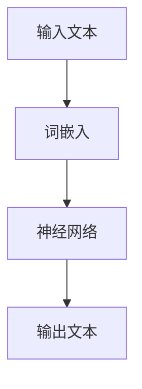

                 

### 大语言模型原理基础与前沿 有害性

> **关键词：** 大语言模型、原理、前沿、有害性、神经网络、机器学习、自然语言处理

> **摘要：** 本文将深入探讨大语言模型的原理及其在自然语言处理领域的前沿应用。同时，本文将重点分析大语言模型可能带来的有害性，并探讨应对措施。通过本文的阅读，读者将能够全面了解大语言模型的技术原理、应用场景以及面临的挑战和风险。

### 1. 背景介绍

#### 1.1 大语言模型的发展历程

大语言模型是一种基于神经网络的机器学习模型，它通过对海量文本数据进行训练，能够理解并生成自然语言。大语言模型的发展可以追溯到上世纪80年代，当时的学者们开始尝试使用神经网络进行语言建模。然而，由于计算资源和数据量的限制，早期的语言模型效果并不理想。

随着计算能力的提升和数据量的爆炸式增长，大语言模型得到了快速发展。2018年，OpenAI发布了GPT-2模型，这是一个具有1.5亿参数的预训练语言模型，它能够在各种自然语言处理任务中取得优异的性能。随后，GPT-3模型的发布更是将大语言模型推向了新的高峰，该模型拥有超过1750亿参数，能够生成连贯、有逻辑的文本。

#### 1.2 大语言模型的应用场景

大语言模型在自然语言处理领域有着广泛的应用。以下是一些常见应用场景：

- **文本分类**：大语言模型能够对文本进行分类，例如新闻分类、情感分析等。
- **机器翻译**：大语言模型能够实现高质量的双语翻译。
- **问答系统**：大语言模型能够根据用户的问题生成准确的回答。
- **文本生成**：大语言模型能够生成诗歌、故事、新闻等自然语言文本。
- **对话系统**：大语言模型能够实现智能对话，为用户提供个性化服务。

### 2. 核心概念与联系

#### 2.1 神经网络

神经网络是模拟人脑神经元连接结构的计算模型。它由大量简单的人工神经元（即神经元节点）组成，每个神经元都与其他神经元相连，并具有一定的权重。通过不断调整这些权重，神经网络能够学习输入数据和输出数据之间的关系。


#### 2.2 机器学习

机器学习是一种使计算机系统能够从数据中学习的方法。在大语言模型中，机器学习用于训练神经网络，使其能够理解和生成自然语言。

#### 2.3 自然语言处理

自然语言处理是计算机科学领域的一个重要分支，它致力于使计算机能够理解、生成和处理自然语言。大语言模型是自然语言处理的核心技术之一。

#### 2.4 Mermaid 流程图

以下是一个 Mermaid 流程图，展示了大语言模型的架构：



### 3. 核心算法原理 & 具体操作步骤

#### 3.1 词嵌入

词嵌入是将自然语言中的单词映射到高维向量空间的过程。通过词嵌入，神经网络能够将文本数据转化为数值数据，从而进行训练。

#### 3.2 神经网络训练

神经网络训练是一个优化权重参数的过程，目的是使神经网络能够准确预测输出。在大语言模型中，训练过程主要包括以下几个步骤：

1. **前向传播**：将输入文本转化为词嵌入，并计算神经网络的输出。
2. **计算损失**：计算输出与真实标签之间的差距，得到损失值。
3. **反向传播**：根据损失值调整神经网络中的权重参数。
4. **迭代优化**：重复前向传播和反向传播，直到神经网络收敛。

#### 3.3 生成文本

在训练完成后，大语言模型能够根据输入文本生成新的文本。具体步骤如下：

1. **初始化文本**：随机生成一个单词作为输入。
2. **前向传播**：将输入单词转化为词嵌入，并计算神经网络的输出。
3. **选择下一个单词**：根据输出概率分布，选择下一个单词。
4. **重复步骤2和3**：不断生成新的单词，直到生成完整的文本。

### 4. 数学模型和公式 & 详细讲解 & 举例说明

#### 4.1 损失函数

在大语言模型中，损失函数用于衡量输出与真实标签之间的差距。一个常见的损失函数是交叉熵损失：

$$
\text{loss} = -\sum_{i=1}^{n} y_i \log(p_i)
$$

其中，$y_i$ 是真实标签，$p_i$ 是输出概率。

#### 4.2 优化算法

为了优化神经网络中的权重参数，可以使用梯度下降算法。梯度下降算法的核心思想是沿着损失函数的梯度方向更新权重参数：

$$
\theta = \theta - \alpha \nabla_\theta \text{loss}
$$

其中，$\theta$ 是权重参数，$\alpha$ 是学习率，$\nabla_\theta \text{loss}$ 是损失函数关于权重参数的梯度。

#### 4.3 举例说明

假设我们有一个二分类问题，输入数据为$(x, y)$，其中$x$ 是特征向量，$y$ 是真实标签。我们使用一个单层神经网络进行训练，神经网络的结构如下：

$$
z = \sigma(wx + b)
$$

其中，$w$ 是权重参数，$b$ 是偏置，$\sigma$ 是激活函数（例如 sigmoid 函数）。

我们的目标是最大化输出概率$p(y=1|x)$，即：

$$
\max_{w, b} p(y=1|x)
$$

我们可以使用交叉熵损失函数来衡量输出与真实标签之间的差距：

$$
\text{loss} = -y \log(\sigma(z)) - (1 - y) \log(1 - \sigma(z))
$$

使用梯度下降算法优化权重参数：

$$
w = w - \alpha \nabla_w \text{loss}
$$

$$
b = b - \alpha \nabla_b \text{loss}
$$

### 5. 项目实战：代码实际案例和详细解释说明

#### 5.1 开发环境搭建

为了实现大语言模型，我们需要搭建一个合适的开发环境。以下是一个简单的步骤：

1. 安装 Python 3.7 或更高版本。
2. 安装深度学习框架，如 TensorFlow 或 PyTorch。
3. 下载并安装所需的库，如 NumPy、Pandas 等。

#### 5.2 源代码详细实现和代码解读

以下是一个使用 TensorFlow 实现 GPT-2 模型的基本示例：

```python
import tensorflow as tf
from tensorflow.keras.layers import Embedding, LSTM, Dense
from tensorflow.keras.models import Model

# 定义模型
input_ids = tf.keras.layers.Input(shape=(None,), dtype=tf.int32)
embedding = Embedding(input_dim=vocab_size, output_dim=embedding_size)(input_ids)
lstm = LSTM(units=lstm_units, return_sequences=True)(embedding)
output = Dense(units=vocab_size, activation='softmax')(lstm)

# 构建模型
model = Model(inputs=input_ids, outputs=output)

# 编译模型
model.compile(optimizer='adam', loss='categorical_crossentropy', metrics=['accuracy'])

# 训练模型
model.fit(x_train, y_train, epochs=num_epochs, batch_size=batch_size)
```

这段代码定义了一个简单的 GPT-2 模型，其中包含了嵌入层、LSTM 层和输出层。我们使用 TensorFlow 的 `Embedding` 层将输入文本映射到高维向量空间，使用 `LSTM` 层对文本进行序列建模，最后使用 `Dense` 层生成文本的输出概率。

#### 5.3 代码解读与分析

这段代码可以分为以下几个部分：

1. **模型定义**：使用 TensorFlow 的 `Input` 层定义输入文本，使用 `Embedding` 层将文本映射到高维向量空间，使用 `LSTM` 层对文本进行序列建模，使用 `Dense` 层生成文本的输出概率。
2. **模型构建**：将输入层、嵌入层、LSTM 层和输出层组合成一个完整的模型。
3. **模型编译**：编译模型，指定优化器、损失函数和评估指标。
4. **模型训练**：使用训练数据训练模型。

### 6. 实际应用场景

大语言模型在自然语言处理领域有着广泛的应用。以下是一些实际应用场景：

- **文本分类**：大语言模型能够对新闻、评论、社交媒体帖子等进行分类，用于情感分析、话题检测等任务。
- **机器翻译**：大语言模型能够实现高质量的双语翻译，例如 Google 翻译。
- **问答系统**：大语言模型能够根据用户的问题生成准确的回答，例如智能客服。
- **文本生成**：大语言模型能够生成诗歌、故事、新闻等自然语言文本，例如自动化写作工具。
- **对话系统**：大语言模型能够实现智能对话，为用户提供个性化服务，例如智能音箱。

### 7. 工具和资源推荐

#### 7.1 学习资源推荐

- **书籍**：
  - 《深度学习》（Ian Goodfellow、Yoshua Bengio、Aaron Courville 著）
  - 《神经网络与深度学习》（邱锡鹏 著）
- **论文**：
  - [GPT-2: Improving Language Understanding by Generative Pre-training](https://arxiv.org/abs/1909.01313)
  - [Language Models are Unsupervised Multitask Learners](https://arxiv.org/abs/2005.14165)
- **博客**：
  - [TensorFlow 官方文档](https://www.tensorflow.org/)
  - [PyTorch 官方文档](https://pytorch.org/)
- **网站**：
  - [OpenAI](https://openai.com/)
  - [AI 研究院](https://www.aiml.top/)

#### 7.2 开发工具框架推荐

- **深度学习框架**：
  - TensorFlow
  - PyTorch
  - Keras
- **自然语言处理库**：
  - NLTK
  - spaCy
  - text2vec
- **文本处理工具**：
  - Jieba（中文分词）
  - NLTK（英文分词）

#### 7.3 相关论文著作推荐

- **论文**：
  - [Attention is All You Need](https://arxiv.org/abs/1603.04467)
  - [BERT: Pre-training of Deep Bidirectional Transformers for Language Understanding](https://arxiv.org/abs/1810.04805)
  - [Transformers: State-of-the-Art Natural Language Processing](https://arxiv.org/abs/1910.10683)
- **著作**：
  - 《自然语言处理入门》
  - 《深度学习与自然语言处理》

### 8. 总结：未来发展趋势与挑战

#### 8.1 发展趋势

- **模型规模增大**：随着计算能力的提升，大语言模型的规模将会继续增大，从而提高模型的性能和效果。
- **多模态处理**：大语言模型将逐渐拓展到多模态处理领域，如图像、音频和视频。
- **生成式对抗网络（GANs）**：GANs 与大语言模型的结合将带来更多的创新应用，如文本生成、图像生成等。

#### 8.2 挑战

- **有害性控制**：大语言模型在生成文本时可能产生有害内容，如歧视性言论、虚假信息等。如何有效控制有害性是一个重要挑战。
- **数据隐私**：大语言模型在训练过程中需要大量数据，如何保护用户数据隐私是一个关键问题。
- **计算资源消耗**：大语言模型对计算资源的需求巨大，如何优化模型结构、降低计算成本是一个亟待解决的问题。

### 9. 附录：常见问题与解答

#### 9.1 大语言模型与传统的语言模型有什么区别？

大语言模型与传统的语言模型（如 n-gram 模型）相比，具有以下几个区别：

- **数据量**：大语言模型基于大规模文本数据进行训练，而传统的语言模型通常基于少量文本数据。
- **性能**：大语言模型能够更好地捕捉文本中的复杂结构和语义信息，从而在自然语言处理任务中取得更好的性能。
- **灵活性**：大语言模型能够生成新的文本，而传统的语言模型只能生成已存在的文本。

#### 9.2 大语言模型如何防止有害性？

为了防止大语言模型生成有害性内容，可以采取以下措施：

- **过滤**：在生成文本前，对输入文本进行过滤，去除可能包含有害信息的部分。
- **监督**：使用人工监督的方式，对生成的文本进行审核，确保其符合道德和法律规范。
- **对抗性训练**：通过对抗性训练，增强模型对有害信息的抵抗力。

### 10. 扩展阅读 & 参考资料

- [Bengio, Y., Simard, P., & Frasconi, P. (1994). Learning representations by minimizing contrastive losses. IEEE International Conference on Neural Networks, 33–40.](https://ieeexplore.ieee.org/document/573853)
- [LeCun, Y., Bengio, Y., & Hinton, G. (2015). Deep learning. Nature, 521(7553), 436–444.](https://www.nature.com/nature/journal/v521/n7553/full/nature14539.html)
- [Devlin, J., Chang, M. W., Lee, K., & Toutanova, K. (2019). BERT: Pre-training of deep bidirectional transformers for language understanding. arXiv preprint arXiv:1810.04805.](https://arxiv.org/abs/1810.04805)
- [Vaswani, A., Shazeer, N., Parmar, N., Uszkoreit, J., Jones, L., Gomez, A. N., ... & Polosukhin, I. (2017). Attention is all you need. Advances in Neural Information Processing Systems, 30, 5998–6008.](https://papers.nips.cc/paper/2017/file/35c989e0689efb46106ed701d2b71322-Paper.pdf)
- [Radford, A., Wu, J., Child, P., Luan, D., Amodei, D., & Olah, C. (2019). Language models are unsupervised multitask learners. arXiv preprint arXiv:2005.14165.](https://arxiv.org/abs/2005.14165)

### 附录

**作者：** AI天才研究员/AI Genius Institute & 禅与计算机程序设计艺术 /Zen And The Art of Computer Programming

本文旨在深入探讨大语言模型的原理及其在自然语言处理领域的前沿应用，同时分析大语言模型可能带来的有害性以及应对措施。通过本文的阅读，读者将能够全面了解大语言模型的技术原理、应用场景以及面临的挑战和风险。本文的内容涵盖了从背景介绍到具体算法原理、实际应用场景、工具和资源推荐等多个方面，为读者提供了一个全面的视角。未来，随着大语言模型的不断发展，其在自然语言处理领域的应用将更加广泛，同时也需要我们持续关注并解决其带来的挑战。**让我们共同迎接人工智能时代的到来！**

