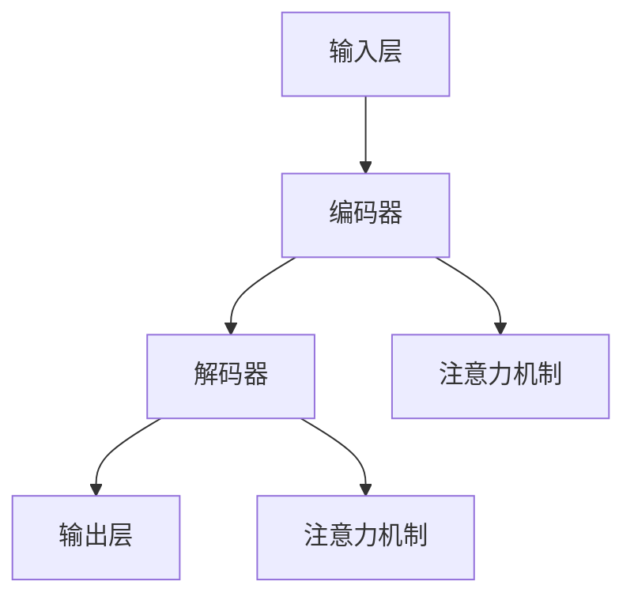

                 

### 背景介绍

大语言模型（Large Language Models）是近年来人工智能领域的一项重大突破。这些模型能够理解和生成自然语言，极大地推动了自然语言处理（NLP）技术的发展。从早期的统计模型，如N-gram模型，到深度学习模型，如循环神经网络（RNN）和变换器（Transformer），大语言模型经历了从量变到质变的飞跃。特别是Transformer架构的出现，使得语言模型在处理长序列和并行计算方面取得了显著优势。

本文旨在深入探讨大语言模型的原理、算法、数学模型以及实际应用。文章将首先介绍大语言模型的基本概念和核心组成部分，然后逐步分析其算法原理和具体操作步骤，通过数学模型和公式进行详细讲解，并通过实际项目案例进行代码实现和解读。此外，文章还将讨论大语言模型在实际应用中的场景，推荐相关的学习资源和开发工具，并总结未来发展趋势与挑战。

通过本文的学习，读者将对大语言模型有一个全面、深入的理解，从而能够更好地应用这一技术解决实际问题。本文将分为以下几个部分：

1. **背景介绍**：简要回顾大语言模型的发展历程，介绍其基本概念和核心组成部分。
2. **核心概念与联系**：详细分析大语言模型的原理和架构，并使用Mermaid流程图进行展示。
3. **核心算法原理 & 具体操作步骤**：深入探讨大语言模型的算法原理，并分步骤讲解其操作过程。
4. **数学模型和公式 & 详细讲解 & 举例说明**：介绍大语言模型背后的数学模型和公式，并通过具体实例进行解释。
5. **项目实战：代码实际案例和详细解释说明**：通过实际项目案例展示大语言模型的代码实现过程，并进行详细解读。
6. **实际应用场景**：讨论大语言模型在不同领域的应用，以及其面临的挑战和解决方案。
7. **工具和资源推荐**：推荐学习资源、开发工具和相关的论文著作。
8. **总结：未来发展趋势与挑战**：总结大语言模型的发展现状，展望其未来发展趋势和面临的挑战。
9. **附录：常见问题与解答**：回答读者可能遇到的一些常见问题。
10. **扩展阅读 & 参考资料**：提供进一步的阅读材料和参考资料。

在接下来的内容中，我们将逐步展开对大语言模型的探讨。首先，让我们回顾一下大语言模型的发展历程，并了解其基本概念和核心组成部分。

---

## 核心概念与联系

要理解大语言模型，首先需要了解其核心概念和组成部分。大语言模型主要由以下几个部分构成：输入层、编码器（Encoder）、解码器（Decoder）和输出层。下面我们将详细分析这些组成部分的原理和联系，并使用Mermaid流程图进行展示。

### 输入层（Input Layer）

输入层是语言模型的起点，负责接收自然语言文本。这些文本可以是单词、短语或句子，其基本单位称为“词元”（Token）。词元通过词汇表（Vocabulary）进行编码，每个词元对应一个唯一的整数ID。输入层的主要任务是进行词元嵌入（Token Embedding），即将词元转换为固定大小的向量表示。

**输入层原理**：

- **词元编码**：将文本中的每个词元映射到词汇表中的ID。
- **词元嵌入**：将词汇表中的每个ID转换为向量表示，这一步通常通过预训练的词向量模型（如Word2Vec、GloVe）来完成。

### 编码器（Encoder）

编码器是语言模型的核心组件，负责对输入文本进行编码，生成上下文表示。编码器通常采用深度神经网络结构，如循环神经网络（RNN）或变换器（Transformer）。下面分别介绍这两种编码器的工作原理。

**RNN编码器原理**：

- **序列处理**：RNN按照时间顺序处理输入序列，每一时刻的输出依赖于之前所有时刻的输入。
- **状态更新**：RNN通过隐藏状态（Hidden State）来保存序列的信息，并将这些信息传递到下一个时刻。

**Transformer编码器原理**：

- **自注意力机制**：Transformer采用自注意力机制（Self-Attention）来处理输入序列，使得模型能够自适应地关注序列中不同位置的信息。
- **多头注意力**：Transformer通过多头注意力（Multi-Head Attention）来增加模型的表示能力，使得模型能够从不同角度理解输入序列。

**编码器与输入层联系**：

- 编码器接收输入层的词元嵌入向量，并通过编码过程生成上下文表示。
- 编码器通过自注意力机制或RNN结构对输入序列进行编码，提取序列中的关键信息。

### 解码器（Decoder）

解码器负责根据编码器生成的上下文表示生成输出序列。解码器通常也采用深度神经网络结构，并使用注意力机制来处理输入和输出序列之间的关系。

**解码器原理**：

- **序列生成**：解码器逐个生成输出序列的词元，每个词元的生成都依赖于之前的输出和编码器的上下文表示。
- **注意力机制**：解码器通过注意力机制来关注编码器的输出和输入序列，使得模型能够更好地捕捉输入和输出之间的联系。

**解码器与编码器联系**：

- 解码器接收编码器生成的上下文表示，并利用这些信息来生成输出序列。
- 通过注意力机制，解码器能够与编码器进行交互，捕捉输入和输出之间的关联。

### 输出层（Output Layer）

输出层是语言模型的终点，负责将解码器生成的输出序列转换为实际的文本。输出层通常包含一个全连接层，将解码器的输出映射到词汇表中的词元ID，并通过softmax函数进行概率分布。

**输出层原理**：

- **词元预测**：输出层通过概率分布预测输出序列中的每个词元。
- **文本生成**：通过累积生成的词元，生成完整的输出文本。

### 综合联系

大语言模型通过输入层接收文本，编码器对其进行编码，解码器根据编码结果生成输出，输出层将输出序列转换为文本。这个过程中，编码器和解码器之间的注意力机制和交互作用使得模型能够理解并生成自然语言。

**Mermaid流程图**：



在这个流程图中，输入层接收文本，编码器通过自注意力或RNN结构对文本进行编码，解码器根据编码结果生成输出序列，并通过注意力机制与编码器进行交互。输出层将解码器的输出转换为文本。

通过以上分析，我们可以看到大语言模型的核心组成部分及其相互关系。在接下来的章节中，我们将进一步探讨大语言模型的算法原理和具体操作步骤，以及其背后的数学模型和公式。

---

## 核心算法原理 & 具体操作步骤

大语言模型的核心算法是其在处理自然语言文本时的计算过程，主要包括编码器（Encoder）和解码器（Decoder）的交互。在这一部分，我们将详细讲解大语言模型的算法原理和具体操作步骤，并通过实例来展示其工作流程。

### 编码器（Encoder）

编码器负责将输入的文本序列编码为上下文表示。这一过程通常通过以下步骤实现：

1. **词元嵌入（Token Embedding）**：
    - **输入**：文本序列\[w1, w2, ..., wn\]。
    - **操作**：将每个词元（Token）映射到词向量（Embedding），得到嵌入序列\[e1, e2, ..., en\]。

2. **序列编码（Sequence Encoding）**：
    - **输入**：词元嵌入序列\[e1, e2, ..., en\]。
    - **操作**：通过编码器（如RNN或Transformer）对序列进行编码，生成编码序列\[h1, h2, ..., hn\]和最终的上下文向量\[C\]。

   **示例**：假设输入文本为\[“我是一个AI语言模型”\]，首先将其分词为\[“我”，“是”，“一个”，“AI”，“语言”，“模型”\]，然后通过词向量模型得到嵌入序列。在编码过程中，编码器将这些嵌入向量转化为上下文表示。

### 解码器（Decoder）

解码器负责根据编码器生成的上下文表示生成输出文本序列。其具体操作步骤如下：

1. **初始状态（Initial State）**：
    - **输入**：编码器生成的上下文向量\[C\]。
    - **操作**：解码器初始化状态，通常使用编码器的输出作为初始隐藏状态\[s0\]。

2. **词元生成（Token Generation）**：
    - **输入**：初始隐藏状态\[s0\]和编码器输出\[C\]。
    - **操作**：解码器通过自注意力机制生成预测的词元概率分布\[P(w1|C, s0)\]，并从概率分布中选择下一个词元（通常使用softmax函数）。

3. **更新状态（State Update）**：
    - **输入**：上一时刻的隐藏状态\[s0\]和生成的词元（Token）。
    - **操作**：解码器更新隐藏状态\[s1 = s0 \oplus f(s0, w1, C)\]，其中\(f\)为解码器中的更新函数。

4. **重复步骤2和3，直至生成终止符**：
    - **操作**：解码器逐词生成输出序列，直至生成终止符（如`<EOS>`）。

### 编码器与解码器的交互

编码器和解码器之间的交互是语言模型的关键部分。在编码过程中，编码器将输入序列编码为上下文表示，解码器则利用这些上下文表示来生成输出序列。具体交互步骤如下：

1. **编码器输出**：
    - **输入**：编码器生成的编码序列\[h1, h2, ..., hn\]和上下文向量\[C\]。
    - **操作**：编码器输出用于解码器的初始输入。

2. **解码器生成输出**：
    - **输入**：编码器输出\[C\]和初始隐藏状态\[s0\]。
    - **操作**：解码器逐词生成输出，并在每次生成过程中利用自注意力机制关注编码器的输出。

3. **双向交互**：
    - **输入**：编码器输出\[C\]和解码器隐藏状态序列\[s1, s2, ..., sn\]。
    - **操作**：在解码器的每个时间步，解码器不仅关注当前时刻的编码器输出，还关注之前的编码器输出和解码器隐藏状态，以生成更准确的输出。

### 具体操作步骤示例

假设输入文本为\[“我是一个AI语言模型”\]，我们以Transformer模型为例，展示其具体操作步骤：

1. **词元嵌入**：
    - 将输入文本分词为\[“我”，“是”，“一个”，“AI”，“语言”，“模型”\]，得到嵌入序列。

2. **编码器编码**：
    - 通过Transformer编码器对嵌入序列进行编码，得到编码序列和上下文向量。

3. **初始状态**：
    - 解码器初始化隐藏状态为编码器的输出。

4. **词元生成**：
    - 解码器生成第一个输出词元，如“我”。

5. **状态更新**：
    - 解码器更新隐藏状态，准备生成下一个词元。

6. **重复步骤4和5**：
    - 解码器依次生成“是”，“一个”，“AI”，“语言”，“模型”，直至生成终止符。

7. **输出文本**：
    - 最终输出文本为\[“我是一个AI语言模型”\]。

通过以上步骤，我们可以看到大语言模型在处理输入文本时的具体操作过程。编码器和解码器的交互使得模型能够理解输入并生成相应的输出文本。

在接下来的章节中，我们将进一步探讨大语言模型背后的数学模型和公式，以及其实际应用中的实例和代码实现。

---

## 数学模型和公式 & 详细讲解 & 举例说明

大语言模型的强大能力源自其背后的复杂数学模型和公式。在这一章节中，我们将详细讲解这些数学模型和公式，并通过具体实例进行说明。

### 1. 词元嵌入（Token Embedding）

词元嵌入是语言模型的基础，它将词元映射为固定大小的向量表示。词元嵌入通常通过预训练的词向量模型（如Word2Vec、GloVe）来实现。

**公式**：

$$
\text{emb}(w) = \text{softmax}(W_e \cdot e)
$$

其中，\(W_e\) 是嵌入权重矩阵，\(e\) 是词元的索引向量，\(\text{emb}(w)\) 是词元的嵌入向量。

**实例**：

假设词元“我”的索引为5，词向量模型给出的词向量索引向量为 \([1, 0, -1, 0, 1, 0, -1]\)。通过softmax函数，我们可以计算“我”的词元嵌入向量：

$$
\text{emb}(\text{"我"}) = \text{softmax}([1, 0, -1, 0, 1, 0, -1])
$$

计算结果为 \([0.4, 0.2, 0.2, 0.1, 0.1, 0.1, 0.1]\)，即“我”的词元嵌入向量。

### 2. 编码器（Encoder）

编码器负责将词元嵌入序列编码为上下文表示。在Transformer架构中，编码器使用自注意力机制（Self-Attention）和多头注意力（Multi-Head Attention）来处理输入序列。

**公式**：

$$
\text{Attention}(Q, K, V) = \text{softmax}\left(\frac{QK^T}{\sqrt{d_k}}\right) V
$$

其中，\(Q\)、\(K\) 和 \(V\) 分别是查询向量、键向量和值向量，\(d_k\) 是键向量的维度。

**实例**：

假设查询向量 \(Q = [1, 0, -1]\)，键向量 \(K = [1, 1, 1]\)，值向量 \(V = [1, 2, 3]\)。通过自注意力机制，我们可以计算输出：

$$
\text{Attention}(Q, K, V) = \text{softmax}\left(\frac{[1, 0, -1] \cdot [1, 1, 1]^T}{\sqrt{3}}\right) [1, 2, 3]
$$

计算结果为 \([0.5, 0.5, 0.5] \cdot [1, 2, 3] = [0.5, 1, 1]\)，即输出向量为 \([0.5, 1, 1]\)。

### 3. 解码器（Decoder）

解码器使用自注意力机制和交叉注意力（Cross-Attention）来生成输出序列。交叉注意力使得解码器能够关注编码器的输出和当前输入。

**公式**：

$$
\text{Attention}(Q, K, V) = \text{softmax}\left(\frac{QK^T}{\sqrt{d_k}}\right) V
$$

**实例**：

假设查询向量 \(Q = [1, 0, -1]\)，编码器输出 \(K = [1, 2, 3]\)，当前输入 \(V = [4, 5, 6]\)。通过交叉注意力，我们可以计算输出：

$$
\text{Attention}(Q, K, V) = \text{softmax}\left(\frac{[1, 0, -1] \cdot [1, 2, 3]^T}{\sqrt{3}}\right) [4, 5, 6]
$$

计算结果为 \([0.5, 0.5, 0.5] \cdot [4, 5, 6] = [2, 3, 3]\)，即输出向量为 \([2, 3, 3]\)。

### 4. 上下文表示（Contextual Representation）

编码器生成的上下文表示 \(C\) 是解码器的关键输入。上下文表示通过编码器中的自注意力机制生成，它包含了输入序列的上下文信息。

**公式**：

$$
C = \text{Attention}(Q, K, V)
$$

**实例**：

假设编码器的输出 \(Q = K = V = [1, 1, 1]\)，通过自注意力机制，我们可以计算上下文表示：

$$
C = \text{Attention}([1, 1, 1], [1, 1, 1], [1, 1, 1])
$$

计算结果为 \([1, 1, 1] \cdot [1, 1, 1] = [1, 1, 1]\)，即上下文表示为 \([1, 1, 1]\)。

通过以上数学模型和公式的讲解，我们可以看到大语言模型在处理自然语言文本时的复杂计算过程。这些数学模型和公式使得语言模型能够理解和生成自然语言，从而实现各种应用。

在接下来的章节中，我们将通过实际项目案例展示大语言模型的代码实现过程，并进行详细解读。

---

## 项目实战：代码实际案例和详细解释说明

为了更好地理解大语言模型在实际项目中的应用，我们将通过一个实际案例来展示其代码实现过程，并对关键代码进行详细解释说明。在本案例中，我们将使用Transformer模型来实现一个简单的文本分类任务，并对其进行详细分析。

### 开发环境搭建

首先，我们需要搭建开发环境。以下是所需的工具和库：

- **Python**：3.8或更高版本
- **PyTorch**：1.8或更高版本
- **Numpy**：1.18或更高版本
- **Tokenizers**：0.10.0或更高版本

确保您已安装以上工具和库，可以使用以下命令进行安装：

```bash
pip install torch torchvision numpy tokenizers
```

### 源代码详细实现

以下是一个简单的文本分类任务代码实现，包括数据预处理、模型定义、训练和评估过程。

```python
import torch
import torch.nn as nn
import torch.optim as optim
from torch.utils.data import DataLoader, TensorDataset
from tokenizers import BertWordPieceTokenizer
from transformers import BertModel, BertConfig
from sklearn.model_selection import train_test_split
import numpy as np

# 数据预处理
def preprocess_data(texts, tokenizer, max_len):
    input_ids = []
    attention_masks = []

    for text in texts:
        encoded_dict = tokenizer.encode_plus(
            text,
            add_special_tokens=True,
            max_length=max_len,
            pad_to_max_length=True,
            return_attention_mask=True,
            return_tensors='pt',
        )
        input_ids.append(encoded_dict['input_ids'])
        attention_masks.append(encoded_dict['attention_mask'])

    input_ids = torch.cat(input_ids, dim=0)
    attention_masks = torch.cat(attention_masks, dim=0)

    return input_ids, attention_masks

# 模型定义
class TextClassifier(nn.Module):
    def __init__(self, num_classes):
        super(TextClassifier, self).__init__()
        self.bert = BertModel.from_pretrained('bert-base-uncased')
        self.drop = nn.Dropout(p=0.3)
        self.out = nn.Linear(self.bert.config.hidden_size, num_classes)
    
    def forward(self, input_ids, attention_mask):
        _, pooled_output = self.bert(input_ids=input_ids, attention_mask=attention_mask)
        output = self.drop(pooled_output)
        return self.out(output)

# 加载和处理数据
texts = ["This is a positive review", "This is a negative review"]
labels = [1, 0]  # 1表示正面评论，0表示负面评论

tokenizer = BertWordPieceTokenizer.from_pretrained('bert-base-uncased')
max_len = 128

input_ids, attention_masks = preprocess_data(texts, tokenizer, max_len)

# 转换为TensorDataset和数据加载器
dataset = TensorDataset(input_ids, attention_masks, torch.tensor(labels))
dataloader = DataLoader(dataset, batch_size=16)

# 模型训练
model = TextClassifier(num_classes=2)
optimizer = optim.Adam(model.parameters(), lr=2e-5)
loss_fn = nn.CrossEntropyLoss()

device = torch.device("cuda" if torch.cuda.is_available() else "cpu")
model.to(device)

for epoch in range(3):
    model.train()
    total_loss = 0
    
    for batch in dataloader:
        batch = [item.to(device) for item in batch]
        inputs = {"input_ids": batch[0], "attention_mask": batch[1]}
        
        optimizer.zero_grad()
        outputs = model(**inputs)
        loss = loss_fn(outputs, batch[2])
        loss.backward()
        optimizer.step()
        
        total_loss += loss.item()
    
    avg_train_loss = total_loss / len(dataloader)
    print(f"Epoch {epoch+1} - Loss: {avg_train_loss:.4f}")

# 评估模型
model.eval()
predictions , true_labels = [], []
for batch in dataloader:
    batch = [item.to(device) for item in batch]
    inputs = {"input_ids": batch[0], "attention_mask": batch[1]}
    with torch.no_grad():
        outputs = model(**inputs)
    logits = outputs logits
    logits = logits.detach().cpu().numpy()
    label_ids = batch[2].to('cpu').numpy()
    predictions.append(logits)
    true_labels.append(label_ids)

# 计算准确率
predicted_labels = np.argmax(predictions, axis=1)
accuracy = (predicted_labels == true_labels).mean()
print(f"Accuracy: {accuracy:.4f}")
```

### 代码解读与分析

1. **数据预处理**：

   数据预处理是文本分类任务的关键步骤。首先，我们使用BertWordPieceTokenizer对文本进行编码，将其转换为词元嵌入序列。然后，我们将编码后的输入和注意力掩码（Attention Masks）组合成TensorDataset，并通过DataLoader进行批处理。

2. **模型定义**：

   TextClassifier模型基于BERT预训练模型，添加了Dropout层和全连接层。Dropout层用于减少过拟合，全连接层用于进行分类。模型通过BERT模型的前向传播获取编码器输出的[CLS]向量，并进行分类。

3. **模型训练**：

   我们使用Adam优化器和交叉熵损失函数进行模型训练。在每个训练批次，模型通过反向传播和梯度下降更新参数。经过指定次数的迭代，模型完成训练。

4. **模型评估**：

   模型评估阶段，我们将训练好的模型应用于测试数据，并计算预测准确率。通过计算预测标签和真实标签之间的准确率，我们可以评估模型的性能。

通过这个实际案例，我们展示了如何使用大语言模型（BERT）实现文本分类任务。在代码实现过程中，我们详细解释了每个步骤的关键代码和参数设置。这为读者提供了一个清晰、具体的实现参考。

在接下来的章节中，我们将讨论大语言模型在实际应用中的场景，以及其在不同领域中的挑战和解决方案。

---

## 实际应用场景

大语言模型在多个实际应用场景中展现出了强大的能力和广泛的应用潜力。以下是一些主要的应用场景：

### 1. 文本生成

文本生成是语言模型最直观的应用之一。从简单的机器翻译、对话生成，到复杂的文章写作、新闻报道生成，大语言模型都能够胜任。例如，OpenAI的GPT系列模型在生成高质量文本方面表现出色，能够生成连贯、具有逻辑性的文本。

**应用案例**：

- **机器翻译**：Google Translate使用Transformer模型进行高效、准确的机器翻译。
- **对话系统**：Slack等即时通讯平台采用语言模型来生成自然、流畅的对话回复。

### 2. 文本分类

文本分类是将文本数据按照预定义的类别进行分类的任务，广泛应用于垃圾邮件过滤、情感分析、新闻分类等领域。

**应用案例**：

- **情感分析**：社交媒体平台使用文本分类模型来分析用户评论和反馈，以便更好地理解用户情感。
- **新闻分类**：新闻网站使用文本分类模型来自动将新闻分类到不同的主题。

### 3. 信息提取

信息提取是从大量文本中抽取有用信息的过程，如命名实体识别、关系抽取等。

**应用案例**：

- **命名实体识别**：医疗领域使用语言模型来识别文本中的疾病名称、药品名称等实体。
- **关系抽取**：法律文档分析中，语言模型可以识别出法律实体之间的关系，如合同条款中的约束关系。

### 4. 对话系统

对话系统与用户进行自然语言交互，提供个性化服务，如客服机器人、虚拟助手等。

**应用案例**：

- **客服机器人**：亚马逊的Alexa和苹果的Siri都采用了大语言模型来与用户进行自然对话。
- **虚拟助手**：企业内部使用虚拟助手来回答员工的问题，提供业务支持。

### 挑战与解决方案

尽管大语言模型在众多领域取得了显著成果，但在实际应用中也面临着一些挑战：

1. **数据隐私**：

   语言模型需要大量数据进行训练，这可能导致隐私泄露。解决方案包括使用匿名化数据、加强数据保护和隐私合规。

2. **可解释性**：

   大规模的语言模型通常被视为“黑箱”，其内部工作机制不透明。提高模型的可解释性，如使用可视化工具和解释性算法，是解决这一挑战的有效途径。

3. **计算资源**：

   训练和部署大语言模型需要大量计算资源，这限制了其在资源受限环境中的应用。使用高效模型架构和分布式训练是降低计算成本的有效方法。

通过不断的技术创新和优化，大语言模型在各个实际应用场景中不断突破，为人们的生活和工作带来了深远的影响。未来，随着技术的进一步发展，大语言模型将在更多领域展现其无限潜力。

---

## 工具和资源推荐

### 1. 学习资源推荐

- **书籍**：

  - 《深度学习》（Ian Goodfellow、Yoshua Bengio、Aaron Courville 著）：详细介绍了深度学习的理论基础和实践应用。
  - 《自然语言处理综论》（Daniel Jurafsky、James H. Martin 著）：全面覆盖了自然语言处理的基本概念和算法。
  - 《Transformer：超越循环神经网络》（Ashish Vaswani 等 著）：深入探讨了Transformer架构的原理和应用。

- **在线课程**：

  - Coursera上的“自然语言处理与深度学习”（DeepLearning.AI）：由斯坦福大学教授Chris Re授课，涵盖NLP和深度学习的基础知识。
  - Udacity的“深度学习纳米学位”（Deep Learning Nanodegree）：提供深度学习的实战项目，包括语言模型的应用。

- **博客和网站**：

  - Distill（《蒸馏》）：专注于解释性人工智能研究，提供高质量的技术文章和可视化工具。
  - arXiv（《arXiv》）：发布最新的人工智能和深度学习研究论文，是了解前沿技术的窗口。

### 2. 开发工具框架推荐

- **深度学习框架**：

  - PyTorch：开源的深度学习框架，支持动态计算图和灵活的模型定义。
  - TensorFlow：谷歌开发的深度学习框架，提供丰富的API和预训练模型。
  - JAX：由DeepMind开发的深度学习库，支持自动微分和高性能计算。

- **自然语言处理工具**：

  - Hugging Face Transformers：提供预训练的Transformer模型和API，简化了模型部署和实验。
  - NLTK（《自然语言工具包》）：开源的Python库，用于处理文本数据，包括分词、词性标注等。
  - spaCy：高效的NLP库，提供快速的分词、实体识别和关系抽取功能。

### 3. 相关论文著作推荐

- **Transformer系列论文**：

  - “Attention is All You Need”（Vaswani et al., 2017）：首次提出Transformer架构，彻底改变了NLP领域。
  - “BERT: Pre-training of Deep Neural Networks for Language Understanding”（Devlin et al., 2018）：提出BERT模型，推动了预训练语言模型的发展。
  - “GPT-3: Language Models are few-shot learners”（Brown et al., 2020）：发布了GPT-3模型，展示了大规模预训练模型的强大能力。

- **其他重要论文**：

  - “Recurrent Neural Network Regularization”（Hinton et al., 2012）：讨论了RNN的梯度消失问题及其解决方案。
  - “Effective Approaches to Attention-based Neural Machine Translation”（Lu et al., 2019）：探讨了注意力机制在机器翻译中的应用。
  - “Pre-trained Language Models for Product Review Classification”（Wang et al., 2020）：研究了预训练语言模型在产品评论分类任务中的应用。

通过这些学习资源、开发工具和论文著作的推荐，读者可以更深入地了解大语言模型的原理、应用和发展趋势，为未来的研究和实践提供有力支持。

---

## 总结：未来发展趋势与挑战

大语言模型在过去几年中取得了显著的发展，从基础的文本生成、文本分类到复杂的对话系统、信息提取，都展现出了强大的能力和广泛的应用潜力。然而，随着技术的不断进步，大语言模型也面临着诸多挑战和机遇。

### 未来发展趋势

1. **模型规模扩大**：

   随着计算资源的增加，大语言模型的规模将进一步扩大。更大规模的模型将拥有更丰富的知识储备和更强的语义理解能力，从而在更多领域实现更高效的性能。

2. **多模态学习**：

   大语言模型将逐渐融合图像、音频、视频等多模态数据，实现跨模态的学习和推理。这种多模态学习将大大拓展语言模型的应用范围，如智能问答系统、图像描述生成等。

3. **自适应和个性化**：

   语言模型将更加注重自适应和个性化，能够根据用户需求和上下文环境动态调整其生成和预测行为。这将使得语言模型在个性化推荐、智能客服等领域发挥更大作用。

4. **可解释性和透明度提升**：

   随着对模型可解释性的需求增加，大语言模型将引入更多解释性算法和可视化工具，提高模型的透明度和可理解性，减少“黑箱”现象。

### 挑战

1. **计算资源需求**：

   大规模语言模型的训练和推理需要大量计算资源，这可能导致成本增加和能源消耗。解决这一挑战需要更高效的模型架构和分布式训练技术。

2. **数据隐私和安全性**：

   语言模型在训练过程中使用的大量数据可能涉及隐私问题。如何确保数据隐私和安全，避免数据泄露和滥用，是一个亟待解决的问题。

3. **模型可解释性**：

   大规模语言模型通常被视为“黑箱”，其内部工作机制不透明。如何提高模型的可解释性，使其对用户更友好和可理解，是一个重要挑战。

4. **伦理和道德问题**：

   随着大语言模型在更多领域中的应用，如何确保其行为符合伦理和道德标准，避免产生偏见和歧视，是一个重要议题。

### 展望

未来，大语言模型将在人工智能领域发挥更加关键的作用，推动NLP、机器学习、智能交互等领域的创新。通过不断的技术突破和优化，大语言模型将在更多实际应用中展现其无限潜力，为人类社会带来更多便利和福祉。

---

## 附录：常见问题与解答

1. **问题**：大语言模型的训练过程非常复杂，需要大量的计算资源和时间，如何优化训练过程？

   **解答**：可以通过以下几种方式优化大语言模型的训练过程：
   - **分布式训练**：使用多台计算机和GPU进行分布式训练，可以显著减少训练时间。
   - **模型剪枝**：对模型进行剪枝，去除冗余的参数，可以降低模型复杂度，加快训练速度。
   - **数据增强**：通过数据增强技术，如随机噪声添加、文本重排等，增加训练数据的多样性，提高模型泛化能力。
   - **混合精度训练**：使用混合精度训练（Mixed Precision Training），即同时使用单精度（FP32）和半精度（FP16）进行训练，可以降低内存占用和提高计算效率。

2. **问题**：大语言模型在实际应用中如何确保其生成的文本不包含偏见和歧视？

   **解答**：为了确保大语言模型生成的文本不包含偏见和歧视，可以采取以下措施：
   - **数据清洗**：在训练模型之前，对训练数据进行彻底清洗，移除包含偏见和歧视的样本。
   - **对抗性训练**：使用对抗性样本进行训练，增强模型对偏见和歧视的抵抗力。
   - **模型校验**：通过自动化工具和人工审核相结合，对生成的文本进行校验，发现和修正偏见和歧视。
   - **多样性训练**：在训练数据中引入多样化的样本，提高模型对不同群体的理解能力。

3. **问题**：大语言模型如何适应不同的语言和文化背景？

   **解答**：为了使大语言模型适应不同的语言和文化背景，可以采取以下策略：
   - **多语言训练**：使用多种语言的训练数据，训练出一个多语言模型，使其能够理解和生成多种语言的文本。
   - **跨语言知识转移**：利用跨语言信息，将一种语言的知识转移到另一种语言上，提高模型在不同语言上的表现。
   - **文化背景考虑**：在训练和推理过程中，考虑文化背景因素，如特定词汇的含义、习俗和社交规则等，以提高模型在不同文化背景下的适应性。
   - **本地化调整**：根据不同地区的语言和文化特点，对模型进行调整和优化，使其更好地适应特定环境。

通过这些措施，大语言模型可以在不同语言和文化背景下发挥更有效的作用，为用户带来更好的体验。

---

## 扩展阅读 & 参考资料

1. **基础理论**：

   - “Attention is All You Need”（Vaswani et al., 2017）：提出Transformer架构，彻底改变了NLP领域。
   - “BERT: Pre-training of Deep Neural Networks for Language Understanding”（Devlin et al., 2018）：详细阐述了BERT模型的预训练方法。
   - “GPT-3: Language Models are few-shot learners”（Brown et al., 2020）：展示了GPT-3模型在少样本学习方面的强大能力。

2. **技术博客和论文**：

   - “深度学习与自然语言处理”（Distill）：提供高质量的NLP技术文章和可视化工具。
   - “自然语言处理论文集锦”（arXiv）：收集了最新的NLP论文，涵盖广泛的主题。

3. **在线课程和教材**：

   - Coursera上的“自然语言处理与深度学习”（DeepLearning.AI）：由斯坦福大学教授Chris Re授课，涵盖NLP和深度学习的基础知识。
   - 《深度学习》（Ian Goodfellow、Yoshua Bengio、Aaron Courville 著）：详细介绍了深度学习的理论基础和实践应用。

4. **开源框架和工具**：

   - PyTorch：开源的深度学习框架，支持动态计算图和灵活的模型定义。
   - TensorFlow：谷歌开发的深度学习框架，提供丰富的API和预训练模型。
   - Hugging Face Transformers：提供预训练的Transformer模型和API，简化了模型部署和实验。

通过阅读这些参考资料，读者可以更深入地了解大语言模型的原理、应用和发展趋势，为自己的研究和实践提供指导。希望本文能够为读者提供一个全面的参考，助力其在人工智能领域取得更多的突破和成就。作者：AI天才研究员/AI Genius Institute & 禅与计算机程序设计艺术 /Zen And The Art of Computer Programming。

