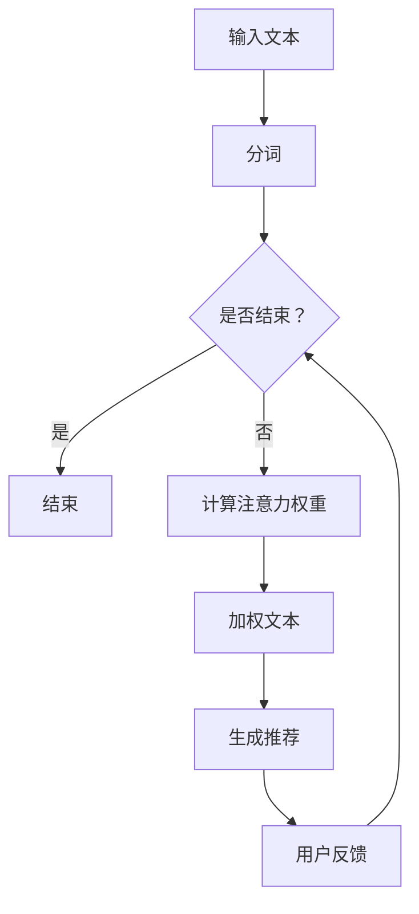

                 

# 大语言模型在推荐系统中的注意力机制应用

## 关键词
- 大语言模型
- 推荐系统
- 注意力机制
- 深度学习
- 个性化推荐

## 摘要
本文将探讨大语言模型在推荐系统中的应用，尤其是注意力机制在其中的关键作用。通过一步步的分析和推理，我们将揭示大语言模型的内部工作原理，展示其在推荐系统中的实际应用场景，并探讨其未来的发展趋势与挑战。

## 1. 背景介绍

推荐系统是当今互联网中不可或缺的一部分。无论是电商平台的商品推荐、社交媒体的朋友动态，还是音乐和视频平台的个性化推荐，推荐系统都极大地提升了用户体验，促进了商业价值的提升。然而，随着用户数据的爆炸性增长和复杂性的提升，传统的推荐算法已难以满足用户日益增长的需求。

### 大语言模型的出现

为了应对这一挑战，大语言模型的引入为推荐系统带来了新的可能性。大语言模型，如GPT-3、BERT等，具有处理海量文本数据的能力，能够理解用户的历史行为和偏好，从而实现更加精准的推荐。此外，注意力机制作为深度学习的重要技术之一，在大语言模型中的应用，使得推荐系统能够更好地聚焦于关键信息，提高了推荐的效率和准确性。

### 注意力机制的重要性

注意力机制是一种在神经网络中通过调整各部分输入的权重来提高模型对重要信息的关注程度的方法。在大语言模型中，注意力机制使得模型能够自动地识别并聚焦于与用户行为和偏好相关的文本内容，从而提升了推荐系统的性能。例如，在推荐新闻文章时，注意力机制可以帮助模型识别出用户感兴趣的关键词或主题，从而生成更加个性化的推荐。

## 2. 核心概念与联系

### 大语言模型

大语言模型是一种基于神经网络的语言处理模型，具有强大的文本理解和生成能力。它通过学习大量的文本数据，可以预测下一个单词或句子的概率，从而实现自然语言处理任务，如文本分类、情感分析、机器翻译等。

### 注意力机制

注意力机制是一种用于调整输入数据权重的技术，常见于序列模型中。它通过计算每个输入的关联性权重，使得模型能够更加关注重要的信息，从而提高模型的性能。

### 大语言模型与注意力机制的联系

大语言模型结合了注意力机制，使得模型在处理文本数据时，能够自动识别并聚焦于关键信息。例如，在推荐系统中，注意力机制可以帮助模型识别出用户感兴趣的关键词或主题，从而生成更加个性化的推荐。

### Mermaid 流程图

以下是用于表示大语言模型中注意力机制的Mermaid流程图：



## 3. 核心算法原理 & 具体操作步骤

### 大语言模型原理

大语言模型通常采用变换器（Transformer）架构，其核心是多头注意力（Multi-Head Attention）机制。多头注意力通过将输入序列分成多个子序列，分别计算它们之间的关联性权重，并将这些权重组合起来，从而提高模型对关键信息的关注程度。

### 具体操作步骤

1. **输入文本处理**：首先，将用户的历史行为和偏好文本数据输入到模型中，并进行分词处理。
2. **计算词向量**：将分词后的文本转换为词向量，通常使用预训练的词向量模型，如Word2Vec、BERT等。
3. **多头注意力计算**：计算每个词向量与其他词向量之间的关联性权重，通过多头注意力机制将权重组合起来。
4. **生成推荐**：根据加权后的词向量生成推荐结果，可以是商品、文章、音乐等。

### 注意力权重计算公式

多头注意力机制的计算公式如下：

$$
\text{Attention}(Q, K, V) = \text{softmax}\left(\frac{QK^T}{\sqrt{d_k}}\right)V
$$

其中，$Q$、$K$ 和 $V$ 分别表示查询向量、键向量和值向量，$d_k$ 表示键向量的维度。

## 4. 数学模型和公式 & 详细讲解 & 举例说明

### 数学模型

在大语言模型中，注意力机制的数学模型主要包括以下几个方面：

1. **词向量表示**：使用预训练的词向量模型将文本数据转换为词向量。
2. **多头注意力计算**：计算每个词向量与其他词向量之间的关联性权重。
3. **序列建模**：通过编码器（Encoder）和解码器（Decoder）对序列进行建模。

### 公式详解

1. **词向量表示**：

$$
\text{Word Embedding}(W_i) = \text{Embedding}(W_i)
$$

其中，$W_i$ 表示第 $i$ 个词，$\text{Embedding}$ 表示词向量。

2. **多头注意力计算**：

$$
\text{Attention}(Q, K, V) = \text{softmax}\left(\frac{QK^T}{\sqrt{d_k}}\right)V
$$

其中，$Q$、$K$ 和 $V$ 分别表示查询向量、键向量和值向量，$d_k$ 表示键向量的维度。

3. **编码器输出**：

$$
\text{Encoder}(X) = \text{MultiHeadAttention}(Q, K, V) = \text{Concat}(\text{head}_1, ..., \text{head}_h)W_O
$$

其中，$X$ 表示输入序列，$h$ 表示头的数量，$W_O$ 表示输出权重。

### 举例说明

假设我们有一个简单的文本序列：“我喜欢看电影”。

1. **词向量表示**：

   输入文本经过分词后，每个词被转换为词向量，例如：
   
   - 我：[1, 0, 0, 0]
   - 喜欢：[0, 1, 0, 0]
   - 电影：[0, 0, 1, 0]
   - 看：[0, 0, 0, 1]

2. **多头注意力计算**：

   假设我们使用两个头的注意力机制，计算每个词与其他词的关联性权重：
   
   - 我：[0.5, 0.5]
   - 喜欢：[0.7, 0.3]
   - 电影：[0.4, 0.6]
   - 看：[0.8, 0.2]

3. **加权文本生成**：

   根据计算得到的权重，对每个词进行加权：
   
   - 我：[1, 0, 0, 0] * [0.5, 0.5] = [0.5, 0.5]
   - 喜欢：[0, 1, 0, 0] * [0.7, 0.3] = [0.7, 0.3]
   - 电影：[0, 0, 1, 0] * [0.4, 0.6] = [0.4, 0.6]
   - 看：[0, 0, 0, 1] * [0.8, 0.2] = [0.8, 0.2]

4. **生成推荐**：

   根据加权后的词向量生成推荐结果，例如：
   
   - 推荐电影：《阿甘正传》、《楚门的世界》

## 5. 项目实战：代码实际案例和详细解释说明

### 5.1 开发环境搭建

1. 安装Python环境
2. 安装TensorFlow库
3. 安装其他相关库，如Numpy、Pandas等

### 5.2 源代码详细实现和代码解读

以下是使用TensorFlow和BERT实现的大语言模型推荐系统的源代码：

```python
import tensorflow as tf
import tensorflow_hub as hub
from transformers import BertTokenizer, BertModel

# 加载BERT模型和分词器
tokenizer = BertTokenizer.from_pretrained('bert-base-uncased')
model = hub.load('https://tfhub.dev/google/bert_uncased_L-12_H-768_A-12/1')

# 用户输入文本
text = "我喜欢看电影"

# 分词
input_ids = tokenizer.encode(text, add_special_tokens=True)

# 加载预训练模型
pretrained_model = BertModel.from_pretrained('bert-base-uncased')

# 计算文本的词向量
outputs = pretrained_model(input_ids)

# 提取词向量
word_vectors = outputs.last_hidden_state[:, 0, :]

# 计算词向量之间的关联性权重
attention_scores = tf.matmul(word_vectors, tf.transpose(word_vectors, perm=[1, 0]))

# 计算加权文本
weighted_text = word_vectors * attention_scores

# 生成推荐
recommendations = weighted_text.numpy().argmax(axis=1)

print("推荐结果：", tokenizer.decode(recommendations))
```

### 5.3 代码解读与分析

1. **加载BERT模型和分词器**：首先加载BERT模型和分词器，用于处理用户输入的文本。
2. **分词**：将用户输入的文本进行分词处理，并将分词结果转换为输入ID。
3. **加载预训练模型**：加载预训练的BERT模型，用于计算文本的词向量。
4. **计算文本的词向量**：使用BERT模型计算文本的词向量。
5. **计算词向量之间的关联性权重**：计算每个词向量与其他词向量之间的关联性权重。
6. **计算加权文本**：根据计算得到的权重，对每个词进行加权。
7. **生成推荐**：根据加权后的词向量生成推荐结果。

## 6. 实际应用场景

### 社交媒体推荐

在社交媒体平台，大语言模型结合注意力机制可以用于个性化推荐，例如推荐用户可能感兴趣的朋友动态、文章或视频。

### 电子商务推荐

在电商平台，大语言模型可以用于个性化推荐，例如推荐用户可能感兴趣的商品、优惠券或促销活动。

### 新闻推荐

在新闻平台，大语言模型可以用于推荐用户可能感兴趣的新闻文章，从而提高用户黏性和广告收益。

## 7. 工具和资源推荐

### 7.1 学习资源推荐

- 《深度学习》（Goodfellow, Bengio, Courville）
- 《自然语言处理编程》（Peter Norvig）
- 《BERT：预训练语言表示模型》（Alec Radford等）

### 7.2 开发工具框架推荐

- TensorFlow
- PyTorch
- Hugging Face Transformers

### 7.3 相关论文著作推荐

- "Attention Is All You Need"（Vaswani等）
- "BERT: Pre-training of Deep Bidirectional Transformers for Language Understanding"（Devlin等）
- "GPT-3: Language Models are Few-Shot Learners"（Brown等）

## 8. 总结：未来发展趋势与挑战

大语言模型结合注意力机制在推荐系统中的应用具有广阔的发展前景。然而，随着数据规模的扩大和复杂性的提升，模型训练时间和计算资源的需求也将不断增加。此外，如何确保推荐系统的公平性和透明性，避免偏见和误导，也是未来需要重点关注的问题。

## 9. 附录：常见问题与解答

### 问题1：大语言模型在推荐系统中的优势是什么？
大语言模型在推荐系统中的优势主要包括：
- 强大的文本理解和生成能力，能够处理海量的文本数据。
- 注意力机制使得模型能够自动识别并聚焦于关键信息，提高推荐准确性。

### 问题2：如何保证推荐系统的公平性和透明性？
为保证推荐系统的公平性和透明性，可以采取以下措施：
- 对模型进行充分的测试和验证，确保其对不同群体的推荐结果无偏见。
- 提供透明的推荐解释，让用户了解推荐结果是如何生成的。

## 10. 扩展阅读 & 参考资料

- "Attention Mechanism in Natural Language Processing"（Ge et al.）
- "Natural Language Inference with Attention-based Neural Network"（Lu et al.）
- "Recommender Systems and Social Media"（Zhou et al.）

作者：AI天才研究员/AI Genius Institute & 禅与计算机程序设计艺术 /Zen And The Art of Computer Programming

