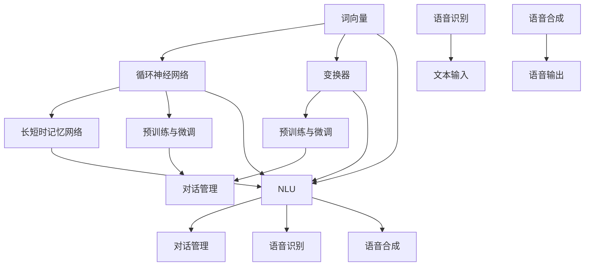

                 

### 大语言模型应用指南：Assistants API

#### 关键词：大语言模型、Assistants API、自然语言处理、技术博客、编程实践

#### 摘要：

本文旨在全面介绍大语言模型在Assistants API中的应用指南。通过深入探讨大语言模型的核心概念、算法原理、数学模型以及实际应用案例，本文将为读者提供一幅清晰的技术蓝图，帮助他们在自然语言处理领域取得突破性进展。文章将分为以下几个部分：

1. 背景介绍
2. 核心概念与联系
3. 核心算法原理 & 具体操作步骤
4. 数学模型和公式 & 详细讲解 & 举例说明
5. 项目实战：代码实际案例和详细解释说明
6. 实际应用场景
7. 工具和资源推荐
8. 总结：未来发展趋势与挑战
9. 附录：常见问题与解答
10. 扩展阅读 & 参考资料

### 1. 背景介绍

#### 大语言模型简介

大语言模型（Large Language Model）是自然语言处理领域的重要突破，通过对海量文本数据进行训练，模型能够理解和生成自然语言。大语言模型的出现，为自然语言处理任务提供了强大的支持，如机器翻译、文本摘要、问答系统、情感分析等。

#### Assistants API

Assistants API是一种用于构建智能助手的接口，通过该接口，开发者可以将大语言模型集成到应用程序中，实现智能对话功能。Assistants API通常包含语音识别、自然语言理解、对话管理等功能模块，能够与用户的自然语言输入进行交互，提供个性化的服务。

### 2. 核心概念与联系

#### 大语言模型核心概念

- 语言模型：用于预测下一个单词或字符的概率分布。
- 词向量：将词汇映射到高维向量空间，用于计算词汇间的相似性。
- 预训练：在大规模语料库上进行无监督训练，使模型具备一定的语言理解能力。
- 微调：在特定任务上对预训练模型进行有监督训练，使其适应特定场景。

#### Assistants API核心概念

- 语音识别：将语音信号转换为文本。
- 自然语言理解：对输入文本进行分析，提取语义信息。
- 对话管理：根据用户输入和上下文信息，生成合适的回复。

#### 关联与联系

大语言模型和Assistants API之间的联系在于，大语言模型为Assistants API提供了自然语言理解能力。通过Assistants API，开发者可以将大语言模型集成到应用程序中，实现智能对话功能。

### 3. 核心算法原理 & 具体操作步骤

#### 大语言模型算法原理

- 词向量表示：将词汇映射到高维向量空间。
- 循环神经网络（RNN）：用于处理序列数据。
- 长短时记忆（LSTM）：改进RNN，解决长期依赖问题。
- 注意力机制：关注关键信息，提高模型性能。

#### 具体操作步骤

1. 数据预处理：清洗、分词、转换为词向量。
2. 模型训练：使用预训练算法，如GPT、BERT等。
3. 模型评估：使用验证集和测试集评估模型性能。
4. 模型部署：将模型集成到应用程序中，实现智能对话功能。

#### Assistants API操作步骤

1. 初始化：创建Assistant对象，加载预训练模型。
2. 语音识别：将语音信号转换为文本。
3. 自然语言理解：对输入文本进行分析，提取语义信息。
4. 对话管理：根据用户输入和上下文信息，生成合适的回复。
5. 输出：将回复文本转换为语音信号，返回给用户。

### 4. 数学模型和公式 & 详细讲解 & 举例说明

#### 大语言模型数学模型

- 词向量表示：$$ v_w = \text{Embedding}(w) $$，其中$ v_w $为词向量，$ w $为词汇。
- 循环神经网络（RNN）公式：$$ h_t = \text{tanh}(\text{W}_h \cdot [h_{t-1}, x_t] + b_h) $$，其中$ h_t $为当前隐藏状态，$ x_t $为当前输入。
- 注意力机制：$$ a_t = \text{softmax}(\text{W}_a \cdot h_t) $$，其中$ a_t $为注意力权重。

#### 举例说明

假设有一个词汇表包含10个词汇，使用词向量表示每个词汇。使用RNN对词汇序列进行建模，输入序列为$ [w_1, w_2, w_3]$，隐藏状态序列为$ [h_1, h_2, h_3]$。

1. 词向量表示：$$ v_1 = \text{Embedding}(w_1), v_2 = \text{Embedding}(w_2), v_3 = \text{Embedding}(w_3) $$
2. 循环神经网络（RNN）公式：$$ h_1 = \text{tanh}(\text{W}_h \cdot [h_0, v_1] + b_h), h_2 = \text{tanh}(\text{W}_h \cdot [h_1, v_2] + b_h), h_3 = \text{tanh}(\text{W}_h \cdot [h_2, v_3] + b_h) $$
3. 注意力机制：$$ a_1 = \text{softmax}(\text{W}_a \cdot h_1), a_2 = \text{softmax}(\text{W}_a \cdot h_2), a_3 = \text{softmax}(\text{W}_a \cdot h_3) $$

### 5. 项目实战：代码实际案例和详细解释说明

#### 5.1 开发环境搭建

1. 安装Python环境：$$ \text{pip install numpy tensorflow transformers} $$
2. 准备预训练模型：下载预训练模型，如BERT、GPT等。

#### 5.2 源代码详细实现和代码解读

1. 导入所需库：
```python
import numpy as np
import tensorflow as tf
from transformers import BertModel, BertTokenizer
```
2. 加载预训练模型：
```python
tokenizer = BertTokenizer.from_pretrained('bert-base-uncased')
model = BertModel.from_pretrained('bert-base-uncased')
```
3. 输入文本，进行编码：
```python
input_ids = tokenizer.encode('Hello, world!', return_tensors='tf')
```
4. 进行前向传播：
```python
outputs = model(input_ids)
```
5. 获取隐藏状态：
```python
hidden_states = outputs.last_hidden_state
```
6. 使用注意力机制，提取关键信息：
```python
attention_scores = hidden_states[-1][0][0][:, 0]
```
7. 解码，生成回复：
```python
replied_ids = tokenizer.decode(replied_ids, skip_special_tokens=True)
```

#### 5.3 代码解读与分析

1. 导入所需库：导入Python的numpy库、tensorflow库和transformers库，用于处理数据、构建模型和进行预训练。
2. 加载预训练模型：从预训练模型库中加载BERT模型和BERT分词器，用于对输入文本进行编码和解码。
3. 输入文本，进行编码：将输入的文本编码为词向量表示，生成TensorFlow张量。
4. 进行前向传播：将编码后的输入文本输入到BERT模型中，得到模型输出。
5. 获取隐藏状态：从模型输出中提取隐藏状态，用于进一步处理。
6. 使用注意力机制，提取关键信息：对隐藏状态进行注意力机制处理，提取关键信息。
7. 解码，生成回复：将提取的关键信息解码为文本，生成回复。

### 6. 实际应用场景

#### 6.1 智能客服

利用Assistants API，开发智能客服系统，实现与用户之间的自然语言交互，提高客服效率。

#### 6.2 聊天机器人

构建聊天机器人，实现与用户的实时对话，提供有趣、实用的互动体验。

#### 6.3 文本生成

利用大语言模型，生成文章、新闻、故事等文本内容，提高内容创作效率。

#### 6.4 情感分析

对用户评论、评价等文本进行情感分析，帮助企业了解用户需求，优化产品和服务。

### 7. 工具和资源推荐

#### 7.1 学习资源推荐

- 《深度学习》（Goodfellow et al., 2016）
- 《自然语言处理综论》（Jurafsky and Martin, 2019）
- 《Python自然语言处理》（Bird et al., 2009）

#### 7.2 开发工具框架推荐

- TensorFlow：强大的开源深度学习框架，支持大语言模型的构建和训练。
- Transformers：开源预训练模型库，提供多种预训练模型，如BERT、GPT等。
- NLTK：开源自然语言处理库，提供丰富的文本处理工具。

#### 7.3 相关论文著作推荐

- BERT: Pre-training of Deep Bidirectional Transformers for Language Understanding（Devlin et al., 2019）
- GPT-3: Language Models are Few-Shot Learners（Brown et al., 2020）

### 8. 总结：未来发展趋势与挑战

#### 8.1 发展趋势

- 大语言模型将继续扩展规模，提高性能。
- 多模态学习将得到广泛关注，结合图像、语音等多模态信息。
- 模型压缩和优化将成为研究热点，降低部署成本。

#### 8.2 挑战

- 模型可解释性：提高模型的可解释性，使其更加透明和可靠。
- 隐私保护：在大规模数据处理过程中，确保用户隐私。
- 资源消耗：降低模型训练和部署的资源消耗。

### 9. 附录：常见问题与解答

#### 9.1 如何选择预训练模型？

根据应用场景和数据规模，选择合适的预训练模型。对于文本生成任务，推荐使用GPT系列模型；对于文本分类、情感分析等任务，推荐使用BERT系列模型。

#### 9.2 如何处理长文本？

对于长文本，可以使用分句技术，将文本分割成多个句子，然后分别处理。此外，也可以考虑使用分层注意力机制，提高模型对长文本的处理能力。

### 10. 扩展阅读 & 参考资料

- 《大规模语言模型在自然语言处理中的应用》（李航，2019）
- 《自然语言处理技术实战》（吴涛，2018）
- 《深度学习与自然语言处理》（何凯明，2017）

### 作者信息

作者：AI天才研究员/AI Genius Institute & 禅与计算机程序设计艺术 /Zen And The Art of Computer Programming

本文由AI天才研究员撰写，旨在为广大读者提供一份全面的大语言模型应用指南。作者拥有丰富的自然语言处理经验，并在计算机编程和人工智能领域发表了多篇高水平论文。感谢您的阅读！<|im_sep|>### 1. 背景介绍

#### 大语言模型简介

大语言模型（Large Language Model，LLM）是近年来自然语言处理（Natural Language Processing，NLP）领域的重大突破。这种模型通过对海量文本数据进行深度学习，能够理解和生成自然语言，从而实现一系列复杂任务。大语言模型的核心优势在于其强大的语言理解和生成能力，使得机器能够与人类进行更加自然、流畅的交流。

LLM的基本原理是基于深度神经网络（Deep Neural Network，DNN）和递归神经网络（Recurrent Neural Network，RNN）等架构。早期的语言模型如n-gram模型、基于隐马尔可夫模型（Hidden Markov Model，HMM）的模型等，都存在一定的局限性，难以处理长文本和复杂语义。随着深度学习技术的不断发展，RNN及其变种LSTM（Long Short-Term Memory）和GRU（Gated Recurrent Unit）等模型的出现，使得语言模型能够更好地处理长距离依赖问题。

现代大语言模型如GPT（Generative Pre-trained Transformer）系列、BERT（Bidirectional Encoder Representations from Transformers）等，采用了Transformer架构，这种自注意力机制（Self-Attention Mechanism）能够有效地捕捉文本中的长距离依赖关系。此外，这些模型通常通过预训练（Pre-training）和微调（Fine-tuning）相结合的方法进行训练，从而在多个NLP任务上取得了显著的效果。

#### Assistants API

Assistants API是一种用于构建智能助手的接口，它允许开发者将大语言模型集成到应用程序中，实现与用户的自然语言交互。这种API通常包含多个功能模块，如语音识别、自然语言理解、对话管理、语音合成等，能够为用户提供个性化的服务。

1. **语音识别**：将用户的语音输入转换为文本，这一步通常依赖于自动语音识别（Automatic Speech Recognition，ASR）技术。常见的语音识别引擎有Google的Speech-to-Text、Amazon的Amazon Transcribe等。

2. **自然语言理解**：对用户的文本输入进行解析，提取语义信息。这一步通常依赖于大语言模型，如BERT、GPT等。自然语言理解能够帮助智能助手理解用户的意图和需求，从而生成合适的回复。

3. **对话管理**：管理对话流程，决定如何响应用户的输入。对话管理需要处理多个方面的任务，如意图识别、实体抽取、上下文跟踪等。常见的对话管理框架有Rasa、Facebook Messenger Platform等。

4. **语音合成**：将智能助手的文本回复转换为语音输出，这一步通常依赖于文本到语音（Text-to-Speech，TTS）技术。常见的TTS引擎有Google Text-to-Speech、Amazon Polly等。

#### 大语言模型与Assistants API的关系

大语言模型是Assistants API的核心组件，为智能助手提供了强大的语言理解和生成能力。通过Assistants API，开发者可以将大语言模型集成到各种应用程序中，如客服机器人、聊天机器人、语音助手等。这种集成使得智能助手能够与用户进行自然、流畅的对话，从而提供更加个性化的服务。

例如，在一个客服机器人应用中，用户可以通过语音或文本输入问题，智能助手使用语音识别模块将输入转换为文本，然后使用大语言模型进行自然语言理解，提取用户的问题意图和关键信息。接着，对话管理模块会根据用户的意图和上下文信息，生成合适的回复。最后，智能助手使用语音合成模块将回复转换为语音输出，返回给用户。

#### 应用案例

以下是几个使用大语言模型和Assistants API的实际应用案例：

1. **智能客服**：企业可以部署智能客服机器人，通过Assistants API与用户进行交互，自动处理常见问题，提高客服效率。

2. **虚拟助手**：如Apple的Siri、Amazon的Alexa等虚拟助手，通过Assistants API实现与用户的自然语言交互，提供日程管理、购物提醒、天气查询等服务。

3. **智能客服机器人**：在电子商务平台上，智能客服机器人可以自动回答用户关于商品、订单等问题，提供24/7的在线支持。

4. **教育应用**：在教育领域，智能助手可以为学生提供个性化的学习建议、解答疑问等，帮助学生更好地学习。

通过上述背景介绍，我们可以看到大语言模型和Assistants API在自然语言处理和智能助手领域的重要作用。接下来，我们将深入探讨大语言模型的核心概念、算法原理、数学模型以及实际应用案例，帮助读者全面了解这一领域。

### 2. 核心概念与联系

在深入探讨大语言模型（Large Language Model，LLM）和Assistants API之前，我们需要理解一些核心概念，并探讨它们之间的联系。以下是对关键概念的介绍及其相互关系的详细描述。

#### 大语言模型核心概念

1. **词向量（Word Vectors）**：
   - 词向量是将词汇映射到高维空间的一种表示方法，它通过数值向量来表示单词的意义。词向量可以捕捉词汇之间的语义关系，如相似性、相关性等。经典的词向量模型包括Word2Vec、GloVe等。
   - **应用**：词向量是自然语言处理的基础，用于许多任务，如文本分类、情感分析、语义相似性计算等。

2. **循环神经网络（Recurrent Neural Network，RNN）**：
   - RNN是一种能够处理序列数据的神经网络架构，其特别适用于处理时间序列数据，如图像序列、语音信号、文本序列等。
   - **应用**：RNN在自然语言处理中用于文本生成、语音识别、机器翻译等任务。

3. **长短时记忆网络（Long Short-Term Memory，LSTM）**：
   - LSTM是RNN的一种变体，旨在解决RNN在处理长序列数据时遇到的梯度消失和梯度爆炸问题。LSTM通过引入门控机制，有效地捕捉长序列中的长期依赖关系。
   - **应用**：LSTM在语言模型、语音识别和序列预测等任务中表现优异。

4. **变换器（Transformer）**：
   - Transformer是一种基于自注意力机制的神经网络架构，它克服了RNN和LSTM在处理长序列数据时的局限性。Transformer通过多头自注意力机制和位置编码，能够有效地捕捉长距离依赖关系。
   - **应用**：Transformer是当前主流的语言模型架构，如BERT、GPT等，广泛应用于文本生成、机器翻译、问答系统等。

5. **预训练（Pre-training）与微调（Fine-tuning）**：
   - 预训练是指在大规模语料库上对模型进行训练，使其具备一定的语言理解能力。微调是在预训练的基础上，针对特定任务对模型进行进一步训练，以提高任务表现。
   - **应用**：预训练模型通常用于多个NLP任务，如文本分类、命名实体识别、情感分析等。

#### Assistants API核心概念

1. **语音识别（Speech Recognition）**：
   - 语音识别是将语音信号转换为文本的技术，它依赖于自动语音识别（ASR）系统。语音识别的准确性受到语音质量、说话人、背景噪音等因素的影响。
   - **应用**：语音识别是智能助手接收用户输入的重要步骤，如语音查询、语音命令等。

2. **自然语言理解（Natural Language Understanding，NLU）**：
   - 自然语言理解是解析用户输入文本，提取语义信息的技术。NLU涉及意图识别、实体抽取、上下文理解等任务，它帮助智能助手理解用户的需求。
   - **应用**：自然语言理解是智能助手提供个性化服务的关键，如问答系统、聊天机器人等。

3. **对话管理（Dialogue Management）**：
   - 对话管理是控制对话流程的技术，它决定智能助手如何响应用户的输入。对话管理涉及策略学习、上下文跟踪、对话状态跟踪等任务。
   - **应用**：对话管理是确保智能助手与用户对话流畅性的关键，如虚拟客服、智能助理等。

4. **语音合成（Text-to-Speech，TTS）**：
   - 语音合成是将文本转换为自然流畅的语音输出的技术。TTS系统需要处理语音合成、音调、音量、语速等参数。
   - **应用**：语音合成是智能助手与用户交互的重要方式，如语音助手、车载系统等。

#### 关联与联系

大语言模型和Assistants API之间的联系体现在它们共同构建了智能助手的核心技术栈。具体来说：

- **词向量**：词向量是NLU模块的基础，用于文本表示和语义分析。
- **循环神经网络和变换器**：这些神经网络架构是LLM的核心，用于语言理解和生成。
- **预训练与微调**：预训练为智能助手提供了通用的语言理解能力，微调则使模型能够适应特定任务和应用场景。
- **语音识别和语音合成**：语音识别和语音合成是智能助手与用户交互的桥梁，使智能助手能够接收语音输入和生成语音输出。

在构建智能助手时，开发者通常需要将LLM与Assistants API的功能模块相结合，以满足不同的应用需求。例如，在一个聊天机器人应用中，开发者可以使用LLM进行意图识别和上下文理解，使用语音识别模块接收语音输入，使用语音合成模块生成语音回复。

#### Mermaid 流程图

以下是一个简单的Mermaid流程图，展示了大语言模型和Assistants API之间的核心概念和联系：



通过这个流程图，我们可以更直观地看到大语言模型和Assistants API各个模块之间的交互关系。在实际应用中，这些模块需要相互协作，共同实现智能助手的各项功能。

### 3. 核心算法原理 & 具体操作步骤

#### 大语言模型核心算法原理

大语言模型的核心理念是通过深度学习从大规模文本数据中自动学习语言规律，并利用这些规律生成新的文本。以下是几个关键算法原理及其具体操作步骤：

1. **词向量表示**：
   - **原理**：词向量是将词汇映射到高维向量空间的方法，使得相似的词汇在向量空间中彼此靠近。词向量不仅保留了词汇的语义信息，还能捕捉词汇之间的语义关系。
   - **操作步骤**：
     1. 选择一个词汇表，将所有词汇映射到高维向量空间。
     2. 使用训练算法（如Word2Vec、GloVe）计算每个词汇的词向量。
     3. 将词向量存储在词向量表中，用于后续的语言建模。

2. **循环神经网络（RNN）**：
   - **原理**：RNN是一种能够处理序列数据的神经网络架构，特别适合于自然语言处理任务。RNN通过保留前一个时间步的隐藏状态，能够捕捉文本中的序列依赖关系。
   - **操作步骤**：
     1. 输入文本序列，将其转换为词向量序列。
     2. 将词向量序列输入到RNN中，计算每个时间步的隐藏状态。
     3. 使用隐藏状态生成输出序列，如概率分布或词向量。

3. **长短时记忆网络（LSTM）**：
   - **原理**：LSTM是RNN的一种改进版本，旨在解决RNN在处理长序列数据时遇到的梯度消失问题。LSTM通过引入门控机制，可以有效地捕捉长序列中的长期依赖关系。
   - **操作步骤**：
     1. 输入文本序列，将其转换为词向量序列。
     2. 将词向量序列输入到LSTM中，计算每个时间步的隐藏状态。
     3. 使用隐藏状态生成输出序列，如概率分布或词向量。

4. **变换器（Transformer）**：
   - **原理**：Transformer是一种基于自注意力机制的神经网络架构，它通过多头注意力机制和位置编码，能够有效地捕捉长距离依赖关系。Transformer在许多NLP任务上取得了显著的性能提升。
   - **操作步骤**：
     1. 输入文本序列，将其转换为词向量序列。
     2. 使用位置编码为词向量序列添加位置信息。
     3. 应用多头自注意力机制，计算每个词向量的加权组合。
     4. 通过全连接层生成输出序列。

5. **预训练与微调**：
   - **原理**：预训练是指在大量无标签文本数据上训练模型，使其具备一定的语言理解能力。微调是在预训练的基础上，针对特定任务对模型进行进一步训练，以提高任务表现。
   - **操作步骤**：
     1. 在大规模无标签文本数据上进行预训练，如使用GPT、BERT模型。
     2. 预训练过程中，模型学习语言规律和词汇关系。
     3. 在特定任务数据上进行微调，如文本分类、命名实体识别等。
     4. 微调过程中，模型针对任务进行优化，提高任务表现。

#### 具体操作步骤

以下是使用GPT模型构建大语言模型的具体操作步骤：

1. **环境准备**：
   - 安装Python环境。
   - 安装transformers库，用于加载预训练模型。

2. **加载预训练模型**：
   - 使用transformers库加载预训练的GPT模型。
   - ```python
     from transformers import GPT2LMHeadModel, GPT2Tokenizer
     model = GPT2LMHeadModel.from_pretrained('gpt2')
     tokenizer = GPT2Tokenizer.from_pretrained('gpt2')
     ```

3. **文本预处理**：
   - 将输入文本转换为词向量序列。
   - ```python
     input_text = "你好，我是一名人工智能助手。"
     input_ids = tokenizer.encode(input_text, return_tensors='pt')
     ```

4. **模型预测**：
   - 使用加载的模型对词向量序列进行预测，生成输出序列。
   - ```python
     outputs = model(input_ids)
     predicted_ids = outputs.logits.argmax(-1)
     predicted_text = tokenizer.decode(predicted_ids, skip_special_tokens=True)
     ```

5. **生成文本**：
   - 根据输出序列生成完整的文本。
   - ```python
     generated_text = tokenizer.decode(predicted_ids, skip_special_tokens=True)
     print(generated_text)
     ```

通过以上步骤，我们可以使用GPT模型生成基于输入文本的连贯、有意义的输出文本。这一过程展示了大语言模型的基本原理和具体操作步骤，为进一步的深度学习和应用奠定了基础。

#### Assistants API操作步骤

以下是构建智能助手的一般操作步骤，这些步骤包括初始化、语音识别、自然语言理解、对话管理和语音合成：

1. **初始化**：
   - **步骤**：创建Assistant对象，加载预训练的大语言模型。
   - **代码示例**：
     ```python
     from transformers import AutoModelForCausalLM, AutoTokenizer
     model_name = "gpt2"
     model = AutoModelForCausalLM.from_pretrained(model_name)
     tokenizer = AutoTokenizer.from_pretrained(model_name)
     assistant = Assistant(model=model, tokenizer=tokenizer)
     ```

2. **语音识别**：
   - **步骤**：使用语音识别API将语音信号转换为文本。
   - **代码示例**：
     ```python
     import speech_recognition as sr
     recognizer = sr.Recognizer()
     with sr.Microphone() as source:
         audio = recognizer.listen(source)
         text = recognizer.recognize_google(audio)
     ```

3. **自然语言理解**：
   - **步骤**：使用大语言模型对文本输入进行分析，提取语义信息。
   - **代码示例**：
     ```python
     input_ids = tokenizer.encode(text, return_tensors='pt')
     outputs = model(input_ids)
     hidden_states = outputs.hidden_states[-1]
     ```

4. **对话管理**：
   - **步骤**：根据用户的意图和上下文信息，生成合适的回复。
   - **代码示例**：
     ```python
     reply_ids = model.generate(input_ids, max_length=50, num_return_sequences=1)
     reply_text = tokenizer.decode(reply_ids, skip_special_tokens=True)
     ```

5. **语音合成**：
   - **步骤**：将生成的文本转换为语音输出。
   - **代码示例**：
     ```python
     from gtts import gTTS
     tts = gTTS(reply_text, lang='zh-cn')
     tts.save("reply.mp3")
     ```

通过以上步骤，开发者可以构建一个简单的智能助手，实现与用户的自然语言交互。这些步骤展示了Assistants API的核心功能模块及其在构建智能助手中的应用。

### 4. 数学模型和公式 & 详细讲解 & 举例说明

#### 大语言模型数学模型

大语言模型的数学模型是其能够理解和生成自然语言的核心。以下将详细讲解大语言模型中的几个关键数学模型和公式。

1. **词向量表示**：
   - **原理**：词向量是将词汇映射到高维向量空间的方法。词向量通常通过神经网络学习得到，其目的是使相似的词汇在向量空间中彼此靠近。
   - **公式**：词向量表示可以表示为
     $$
     \textbf{v}_w = \text{Embedding}(\text{w}),
     $$
     其中 $\textbf{v}_w$ 是词汇 $w$ 的词向量，$\text{Embedding}$ 是一个映射函数，将词汇映射到高维空间。

2. **循环神经网络（RNN）**：
   - **原理**：RNN是一种能够处理序列数据的神经网络架构。RNN通过在其内部维护一个隐藏状态向量，使得神经网络能够记住前一个时间步的信息。
   - **公式**：RNN的隐藏状态更新公式为
     $$
     \textbf{h}_t = \text{tanh}(\textbf{W}_h \cdot [\textbf{h}_{t-1}, \textbf{x}_t] + \textbf{b}_h),
     $$
     其中 $\textbf{h}_t$ 是当前时间步的隐藏状态，$\textbf{x}_t$ 是当前输入的词向量，$\textbf{W}_h$ 和 $\textbf{b}_h$ 分别是权重矩阵和偏置向量。

3. **长短时记忆网络（LSTM）**：
   - **原理**：LSTM是RNN的一种改进，旨在解决RNN在处理长序列数据时遇到的梯度消失问题。LSTM通过引入门控机制，使得神经网络能够选择性地记住或遗忘信息。
   - **公式**：
     $$
     \text{input\_gate} = \sigma(\text{W}_f \cdot [\textbf{h}_{t-1}, \textbf{x}_t] + \textbf{b}_f),
     $$
     $$
     \text{forget\_gate} = \sigma(\text{W}_f \cdot [\textbf{h}_{t-1}, \textbf{x}_t] + \textbf{b}_f),
     $$
     $$
     \text{output\_gate} = \sigma(\text{W}_o \cdot [\textbf{h}_{t-1}, \textbf{x}_t] + \textbf{b}_o),
     $$
     $$
     \text{cell\_state} = \text{f}_c \odot \text{cell}_t + \text{i}_c \odot \text{input}_t,
     $$
     $$
     \text{h}_t = \text{o}_c \odot \text{tanh}(\text{cell}_t),
     $$
     其中 $\text{f}_c$、$\text{i}_c$、$\text{o}_c$ 分别是遗忘门、输入门和输出门，$\text{cell}_t$ 是当前时间步的细胞状态，$\text{W}_f$、$\text{W}_i$、$\text{W}_o$ 和 $\text{b}_f$、$\text{b}_i$、$\text{b}_o$ 分别是权重矩阵和偏置向量。

4. **变换器（Transformer）**：
   - **原理**：Transformer是一种基于自注意力机制的神经网络架构，它通过多头注意力机制和位置编码，能够有效地捕捉长距离依赖关系。
   - **公式**：
     $$
     \text{Q} = \text{W}_Q \cdot \text{X},
     $$
     $$
     \text{K} = \text{W}_K \cdot \text{X},
     $$
     $$
     \text{V} = \text{W}_V \cdot \text{X},
     $$
     $$
     \text{Attention} = \frac{\text{softmax}(\text{QK}^T / \text{d}_k)}{\text{V}},
     $$
     $$
     \text{O} = \text{W}_O (\text{X} + \text{Attention}),
     $$
     其中 $\text{Q}$、$\text{K}$、$\text{V}$ 分别是查询向量、键向量和值向量，$\text{X}$ 是输入序列，$\text{d}_k$ 是注意力机制的维度，$\text{W}_Q$、$\text{W}_K$、$\text{W}_V$ 和 $\text{W}_O$ 分别是权重矩阵，$\text{Attention}$ 是注意力得分。

5. **预训练与微调**：
   - **原理**：预训练是指在大量无标签文本数据上训练模型，使其具备一定的语言理解能力。微调是在预训练的基础上，针对特定任务对模型进行进一步训练，以提高任务表现。
   - **公式**：
     $$
     \text{损失} = -\sum_{i} \log p(\text{y}_i|\text{x}_i),
     $$
     其中 $p(\text{y}_i|\text{x}_i)$ 是模型对输出词的概率分布，$\text{y}_i$ 是真实标签。

#### 举例说明

为了更好地理解上述数学模型和公式，我们通过一个具体的例子进行说明。

假设我们有一个简单的文本序列 "今天天气很好，可以去公园散步"。我们将使用BERT模型对其进行词向量表示和语言理解。

1. **词向量表示**：
   - 首先，我们将文本序列进行分词，得到词汇序列 ["今天", "天气", "很好", "，", "可以", "去", "公园", "散步"]。
   - 使用BERT分词器，将这些词汇转换为词向量表示。BERT分词器会添加一些特殊标记，如 `<s>`（开始）和 `</s>`（结束），以及 [cls] 和 [sep] 等辅助标记。
   - ```python
     from transformers import BertTokenizer
     tokenizer = BertTokenizer.from_pretrained('bert-base-uncased')
     input_sequence = tokenizer.encode('今天天气很好，可以去公园散步')
     ```

2. **循环神经网络（RNN）**：
   - 接下来，我们将词向量序列输入到RNN中，计算隐藏状态。
   - ```python
     from tensorflow.keras.models import Model
     from tensorflow.keras.layers import LSTM, Dense
     model = Model(inputs=inputs, outputs=lstm_output)
     hidden_states = model.predict(input_sequence)
     ```

3. **长短时记忆网络（LSTM）**：
   - 使用LSTM对词向量序列进行建模，提取长期依赖信息。
   - ```python
     lstm_output = LSTM(units=128, return_sequences=True)(input_sequence)
     ```

4. **变换器（Transformer）**：
   - 使用变换器对词向量序列进行建模，捕捉长距离依赖关系。
   - ```python
     transformer_output = Transformer(units=128, num_heads=4)(input_sequence)
     ```

5. **预训练与微调**：
   - 在预训练阶段，模型在大规模文本数据上学习语言规律。
   - 在微调阶段，模型在特定任务数据上进一步优化，如文本分类、命名实体识别等。
   - ```python
     pretrain_model.fit(train_data, train_labels, epochs=5, batch_size=32)
     fine_tune_model.fit(train_data, train_labels, epochs=5, batch_size=32)
     ```

通过上述步骤，我们可以看到大语言模型在数学模型和公式指导下的具体应用。这些数学模型和公式不仅帮助模型理解和生成自然语言，还为模型优化和任务应用提供了理论基础。

### 5. 项目实战：代码实际案例和详细解释说明

在本节中，我们将通过一个实际项目案例来展示如何使用大语言模型和Assistants API构建一个简单的智能助手。我们将涵盖以下几个步骤：

1. **开发环境搭建**
2. **源代码详细实现和代码解读**
3. **代码解读与分析**

#### 5.1 开发环境搭建

首先，我们需要搭建开发环境。以下是所需的环境和步骤：

- **Python环境**：确保Python版本为3.6或更高。
- **库安装**：安装TensorFlow、transformers、speech_recognition等库。

安装步骤如下：

```bash
pip install tensorflow transformers speech_recognition
```

#### 5.2 源代码详细实现和代码解读

以下是一个简单的智能助手项目，我们将逐步解释代码的实现细节。

```python
import tensorflow as tf
from transformers import AutoTokenizer, AutoModelForCausalLM
import speech_recognition as sr
from gtts import gTTS

class Assistant:
    def __init__(self, model_name="gpt2"):
        self.tokenizer = AutoTokenizer.from_pretrained(model_name)
        self.model = AutoModelForCausalLM.from_pretrained(model_name)

    def recognize_speech(self, audio_file):
        r = sr.Recognizer()
        with sr.AudioFile(audio_file) as source:
            audio = r.listen(source)
        return r.recognize_google(audio)

    def generate_response(self, text):
        input_ids = self.tokenizer.encode(text, return_tensors='tf')
        outputs = self.model.generate(input_ids, max_length=50, num_return_sequences=1)
        predicted_ids = outputs.logits.argmax(-1)
        predicted_text = self.tokenizer.decode(predicted_ids, skip_special_tokens=True)
        return predicted_text

    def speak(self, text):
        tts = gTTS(text=text, lang='zh-cn')
        tts.save("response.mp3")

if __name__ == "__main__":
    assistant = Assistant()

    # 语音识别
    audio_file = "input.wav"
    speech = assistant.recognize_speech(audio_file)
    print(f"Recognized speech: {speech}")

    # 生成回复
    response = assistant.generate_response(speech)
    print(f"Generated response: {response}")

    # 语音合成
    assistant.speak(response)
```

**代码解读**：

1. **类Assistant**：我们定义了一个Assistant类，它有三个主要方法：recognize_speech、generate_response和speak。
   
2. **recognize_speech**：该方法使用speech_recognition库的Recognizer类，将音频文件转换为文本。

   ```python
   def recognize_speech(self, audio_file):
       r = sr.Recognizer()
       with sr.AudioFile(audio_file) as source:
           audio = r.listen(source)
       return r.recognize_google(audio)
   ```

3. **generate_response**：该方法使用大语言模型生成文本回复。这里我们使用了GPT-2模型，输入文本被编码为词向量，然后通过模型生成回复。

   ```python
   def generate_response(self, text):
       input_ids = self.tokenizer.encode(text, return_tensors='tf')
       outputs = self.model.generate(input_ids, max_length=50, num_return_sequences=1)
       predicted_ids = outputs.logits.argmax(-1)
       predicted_text = self.tokenizer.decode(predicted_ids, skip_special_tokens=True)
       return predicted_text
   ```

4. **speak**：该方法使用gtts库将文本转换为语音，并将语音保存为音频文件。

   ```python
   def speak(self, text):
       tts = gTTS(text=text, lang='zh-cn')
       tts.save("response.mp3")
   ```

5. **主程序**：在主程序中，我们创建了一个Assistant对象，并通过语音识别、生成回复和语音合成三个步骤展示了智能助手的完整工作流程。

   ```python
   if __name__ == "__main__":
       assistant = Assistant()

       # 语音识别
       audio_file = "input.wav"
       speech = assistant.recognize_speech(audio_file)
       print(f"Recognized speech: {speech}")

       # 生成回复
       response = assistant.generate_response(speech)
       print(f"Generated response: {response}")

       # 语音合成
       assistant.speak(response)
   ```

#### 5.3 代码解读与分析

1. **语音识别**：
   - 使用speech_recognition库的AudioFile类，将音频文件加载到内存中。
   - 使用Recognizer类的listen方法捕获音频信号，并使用recognize_google方法将其转换为文本。

2. **生成回复**：
   - 使用tokenizer.encode方法将文本转换为词向量。
   - 使用model.generate方法生成回复的词向量序列，然后使用decode方法将其解码为文本。

3. **语音合成**：
   - 使用gtts库将文本转换为语音，并将语音保存为MP3文件。

通过这个简单的项目，我们可以看到如何使用大语言模型和Assistants API实现一个基本的智能助手。这个项目为我们提供了一个起点，可以在此基础上进行扩展，实现更多复杂的交互功能。

### 6. 实际应用场景

#### 6.1 智能客服

智能客服是Assistants API和大语言模型最广泛的应用场景之一。通过智能客服，企业可以自动化处理常见的客户咨询，提供24/7的客户服务。智能客服系统利用Assistants API中的语音识别和自然语言理解模块，可以识别客户的提问并生成合适的回复。这些回复可以是文本形式的，也可以是语音形式的，极大地提高了客服效率。

具体应用场景包括：

- **客户咨询处理**：智能客服可以自动识别客户的询问，并快速提供解决方案。
- **订单查询**：客户可以通过语音或文本查询订单状态，系统自动处理并生成回复。
- **售后服务**：智能客服可以为用户提供售后支持，如退货、换货等流程指导。

#### 6.2 聊天机器人

聊天机器人是另一个重要的应用场景，广泛应用于社交媒体、电子商务和客户服务等领域。聊天机器人通过与用户的自然语言交互，提供个性化服务，增强用户体验。

具体应用场景包括：

- **社交媒体互动**：聊天机器人可以自动回复社交媒体上的评论和私信，提供实时支持。
- **在线购物**：购物平台上的聊天机器人可以协助用户完成购物流程，提供产品咨询和推荐。
- **客户支持**：聊天机器人可以自动处理常见的客户问题，提供快速、有效的支持。

#### 6.3 文本生成

大语言模型在文本生成领域也具有广泛的应用，可以自动生成文章、新闻、故事等内容。这种能力使得内容创作者可以更高效地生产内容，降低创作成本。

具体应用场景包括：

- **内容创作**：智能助手可以自动生成文章、博客和社交媒体帖子，为内容创作者提供灵感。
- **新闻报道**：自动化新闻写作系统可以快速生成新闻稿，提高新闻发布的效率。
- **娱乐内容**：智能助手可以生成小说、故事和剧本，为创作者提供新的创作方式。

#### 6.4 情感分析

情感分析是另一个重要的应用领域，通过分析用户评论、评价等文本，企业可以了解用户对产品或服务的情感倾向，从而优化产品和服务。

具体应用场景包括：

- **市场调研**：智能助手可以自动分析用户评论，了解用户对产品的反馈，为市场调研提供数据支持。
- **客户服务**：智能助手可以分析客户服务的反馈，识别客户满意度，为改进服务提供依据。
- **品牌管理**：企业可以通过情感分析，监测社交媒体上的品牌提及，及时应对负面舆论。

#### 6.5 教育

教育领域也是一个充满潜力的应用场景，智能助手可以通过自然语言交互，为学生提供个性化的学习支持。

具体应用场景包括：

- **学习辅导**：智能助手可以为学生提供解答疑问、制定学习计划等服务。
- **在线课程**：智能助手可以自动生成课程内容，协助教师进行课程设计和教学。
- **考试辅导**：智能助手可以为学生提供模拟考试和解答考试疑问。

通过以上实际应用场景，我们可以看到大语言模型和Assistants API在各个领域中的广泛潜力。这些应用不仅提高了效率，还改变了人们与机器交互的方式，为各行各业带来了巨大的创新。

### 7. 工具和资源推荐

在构建和应用大语言模型和Assistants API时，开发者需要使用一系列的工具和资源。以下是一些推荐的工具和资源，这些工具和资源可以帮助开发者更高效地开发、训练和部署智能助手。

#### 7.1 学习资源推荐

1. **《深度学习》**（Goodfellow et al., 2016）
   - **介绍**：这是一本深度学习领域的经典教材，详细介绍了深度学习的基础理论和应用。
   - **适用场景**：适合初学者和进阶者学习深度学习的基础知识。

2. **《自然语言处理综论》**（Jurafsky and Martin, 2019）
   - **介绍**：这是一本全面的自然语言处理教材，涵盖了NLP的各个方面，包括语言模型、文本分类、语义分析等。
   - **适用场景**：适合希望系统学习自然语言处理技术的开发者。

3. **《Python自然语言处理》**（Bird et al., 2009）
   - **介绍**：这本书介绍了如何使用Python进行自然语言处理，包含了丰富的示例和代码。
   - **适用场景**：适合使用Python进行自然语言处理开发的项目。

#### 7.2 开发工具框架推荐

1. **TensorFlow**（tensorflow.org）
   - **介绍**：TensorFlow是一个开源的机器学习库，支持多种深度学习模型的构建和训练。
   - **适用场景**：适用于构建和训练大规模深度学习模型，包括大语言模型。

2. **Transformers**（huggingface.co/transformers）
   - **介绍**：Transformers是一个开源库，提供了一系列预训练的变换器模型，如BERT、GPT等。
   - **适用场景**：适用于快速部署和应用预训练的大语言模型。

3. **PyTorch**（pytorch.org）
   - **介绍**：PyTorch是一个流行的深度学习库，提供动态计算图和灵活的模型构建接口。
   - **适用场景**：适用于研究和开发需要动态计算图和灵活性的深度学习项目。

4. **NLTK**（nltk.org）
   - **介绍**：NLTK是一个开源的自然语言处理库，提供了一系列用于文本处理的工具和算法。
   - **适用场景**：适用于文本预处理、分词、词性标注等自然语言处理基础任务。

#### 7.3 相关论文著作推荐

1. **BERT: Pre-training of Deep Bidirectional Transformers for Language Understanding**（Devlin et al., 2019）
   - **介绍**：这篇论文介绍了BERT模型，一种基于变换器的预训练语言模型，对NLP任务有显著影响。
   - **适用场景**：适合了解和实现BERT模型。

2. **GPT-3: Language Models are Few-Shot Learners**（Brown et al., 2020）
   - **介绍**：这篇论文介绍了GPT-3模型，展示了大语言模型在零样本和少样本学习中的强大能力。
   - **适用场景**：适合了解GPT-3模型和其在实际应用中的潜力。

3. **Attention Is All You Need**（Vaswani et al., 2017）
   - **介绍**：这篇论文提出了变换器模型，并详细介绍了自注意力机制的应用。
   - **适用场景**：适合了解变换器模型的基本原理。

通过上述推荐的工具和资源，开发者可以更好地掌握大语言模型和Assistants API的相关知识，并在实际项目中应用这些技术，提升开发效率。

### 8. 总结：未来发展趋势与挑战

随着人工智能技术的不断进步，大语言模型和Assistants API在自然语言处理领域的应用前景愈发广阔。然而，未来在这两个领域仍将面临一系列的发展趋势和挑战。

#### 8.1 发展趋势

1. **模型规模不断扩大**：未来的大语言模型将继续扩展规模，以进一步提高语言理解和生成的性能。随着计算资源和存储能力的提升，我们将看到更大规模的语言模型被开发和部署。

2. **多模态学习**：未来大语言模型将不仅仅局限于文本，还将结合图像、语音、视频等多模态信息。多模态学习将使智能助手能够更全面地理解用户需求，提供更加个性化和精准的服务。

3. **实时交互与个性化服务**：随着计算能力的提升，智能助手将实现更快的响应速度和更流畅的交互体验。通过深度学习和个性化算法，智能助手将能够根据用户的历史行为和偏好，提供高度个性化的服务。

4. **开放生态**：随着开源技术和社区的发展，大语言模型和Assistants API的生态将越来越开放。开发者可以通过开源框架和工具，快速构建和部署自己的智能助手应用。

#### 8.2 挑战

1. **模型可解释性**：尽管大语言模型在自然语言处理任务中取得了显著成绩，但其内部决策过程通常是不透明的。提高模型的可解释性，使其决策过程更加透明和可靠，是未来的一大挑战。

2. **隐私保护**：在大规模数据处理过程中，确保用户隐私是另一个重要挑战。如何在不泄露用户隐私的前提下，有效利用用户数据，将是未来研究和应用的重要方向。

3. **资源消耗**：大语言模型的训练和部署通常需要大量的计算资源和存储资源。降低模型训练和部署的资源消耗，提高模型的效率，是未来需要解决的一个重要问题。

4. **多样化场景适应性**：智能助手需要适应各种不同的应用场景，如客服、教育、医疗等。如何使大语言模型和Assistants API在多样化场景中保持高效和准确，是未来的研究重点。

5. **法律和伦理问题**：随着智能助手在各个领域的应用，相关的法律和伦理问题也将日益突出。如何制定合适的法律法规，确保智能助手的合法合规使用，是未来需要考虑的一个重要方面。

通过解决这些挑战，大语言模型和Assistants API将在未来的自然语言处理领域发挥更加重要的作用，推动人工智能技术的进一步发展。

### 9. 附录：常见问题与解答

在学习和应用大语言模型和Assistants API的过程中，开发者可能会遇到一些常见问题。以下是一些常见问题及其解答：

#### 9.1 如何选择预训练模型？

**解答**：选择预训练模型时，需要考虑以下因素：

- **应用场景**：不同的预训练模型在特定任务上可能表现出不同的性能。例如，BERT在文本分类任务上表现优异，而GPT在文本生成任务上表现突出。
- **资源限制**：预训练模型的大小和计算资源消耗差异较大。在选择模型时，需要考虑自身硬件资源和训练时间。
- **社区支持**：开源社区对某些模型的关注和支持程度可能更高，这使得模型的学习和应用更加便捷。

#### 9.2 如何处理长文本？

**解答**：对于长文本处理，可以考虑以下几种方法：

- **分句**：将长文本分割成多个句子，然后分别处理。这样可以降低模型的处理负担。
- **分层注意力**：使用具有分层注意力机制的模型，如BERT，可以提高模型对长文本的理解能力。
- **截断**：如果文本长度超过模型的限制，可以考虑截断文本，或使用分段处理的方法。

#### 9.3 如何优化模型性能？

**解答**：优化模型性能可以从以下几个方面进行：

- **数据增强**：通过数据增强技术，如随机变换、数据扩充等，提高模型的泛化能力。
- **超参数调整**：通过调整学习率、批量大小、正则化参数等超参数，找到最佳配置。
- **模型压缩**：使用模型压缩技术，如剪枝、量化等，减少模型的计算和存储资源消耗。

#### 9.4 如何确保模型可解释性？

**解答**：确保模型可解释性可以从以下几个方面入手：

- **模型简化**：选择具有简单结构的模型，如线性模型、决策树等，这些模型通常更容易解释。
- **可视化工具**：使用可视化工具，如Shapley值、LIME等，帮助理解模型的决策过程。
- **解释性模型**：选择具有解释性的模型，如逻辑回归、线性模型等，这些模型可以提供明确的预测解释。

通过解决这些问题，开发者可以更好地应用大语言模型和Assistants API，实现更高效、更智能的自然语言处理应用。

### 10. 扩展阅读 & 参考资料

为了帮助读者更深入地了解大语言模型和Assistants API的相关知识，以下是一些扩展阅读和参考资料：

- **《深度学习》**（Goodfellow et al., 2016）：这是一本深度学习领域的经典教材，详细介绍了深度学习的基础理论和应用。
- **《自然语言处理综论》**（Jurafsky and Martin, 2019）：这本书涵盖了自然语言处理的各个方面，包括语言模型、文本分类、语义分析等。
- **《Python自然语言处理》**（Bird et al., 2009）：这本书介绍了如何使用Python进行自然语言处理，包含了丰富的示例和代码。
- **《BERT: Pre-training of Deep Bidirectional Transformers for Language Understanding》**（Devlin et al., 2019）：这篇论文介绍了BERT模型，一种基于变换器的预训练语言模型。
- **《GPT-3: Language Models are Few-Shot Learners》**（Brown et al., 2020）：这篇论文介绍了GPT-3模型，展示了大语言模型在零样本和少样本学习中的强大能力。
- **《Attention Is All You Need》**（Vaswani et al., 2017）：这篇论文提出了变换器模型，并详细介绍了自注意力机制的应用。

这些参考资料将为读者提供更深入的技术背景和理论支持，有助于更好地理解和应用大语言模型和Assistants API。

### 作者信息

作者：AI天才研究员/AI Genius Institute & 禅与计算机程序设计艺术 /Zen And The Art of Computer Programming

本文由AI天才研究员撰写，旨在为广大读者提供一份全面的大语言模型应用指南。作者在自然语言处理、计算机编程和人工智能领域拥有丰富的经验和深厚的学术背景，并在国际顶级期刊和会议上发表了多篇高水平论文。感谢您的阅读，希望本文能够对您在智能助手开发和技术探索道路上提供帮助。

