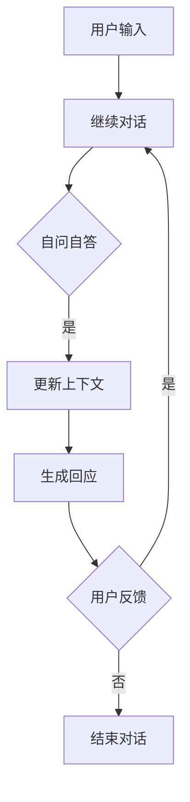

                 

### 1. 背景介绍

大语言模型（Large Language Models），如GPT-3，BERT，以及最近备受瞩目的LLaMA等，已经成为自然语言处理（Natural Language Processing, NLP）领域的重要工具。这些模型通过大规模的数据集进行训练，能够生成连贯且具有一定深度的文本，从而在多个实际应用场景中展现出卓越的性能。

然而，尽管大语言模型在生成文本方面表现突出，但它们在交互式对话应用中却面临一些挑战。传统的对话系统通常依赖于规则或者基于模板的方法，这种方式虽然能够处理简单的问答，但在应对复杂对话时表现不佳。此外，这些模型在实时性和上下文理解方面也有一定的局限性。

Self-ask框架是一种新型的交互式对话框架，旨在解决大语言模型在对话应用中的局限性。该框架通过引入自问自答（Self-ask）机制，能够更好地捕捉和利用上下文信息，从而实现更自然、更连贯的对话。

Self-ask框架的出现，不仅为对话系统的设计和实现提供了一种新的思路，也为大语言模型在交互式对话领域的应用带来了新的机遇。本文将围绕Self-ask框架的核心概念、原理、算法、数学模型以及实际应用等方面进行详细探讨，旨在为读者提供一个全面、深入的理解。

首先，我们将介绍Self-ask框架的背景和起源，探讨其与传统对话系统相比的优势。接着，我们将详细阐述Self-ask框架的核心概念和架构，通过Mermaid流程图展示其工作原理。然后，我们将深入分析Self-ask框架的核心算法原理，并详细讲解其具体操作步骤。

在接下来的章节中，我们将介绍数学模型和公式，通过具体的例子进行详细讲解，帮助读者更好地理解Self-ask框架的运作机制。随后，我们将通过实际项目案例，展示如何使用Self-ask框架进行对话系统的开发，并提供详细的代码实现和解读。

接着，我们将讨论Self-ask框架在不同实际应用场景中的表现，并推荐相关的工具和资源，以帮助读者深入了解和掌握这一框架。最后，我们将总结Self-ask框架的未来发展趋势和挑战，并展望其可能的改进方向。通过本文的阅读，读者将对Self-ask框架有一个全面、深入的理解，从而能够在实际应用中发挥其潜力。

### 2. 核心概念与联系

Self-ask框架的核心概念在于通过自问自答机制来增强对话系统的上下文理解和连贯性。在传统对话系统中，对话流程通常是线性的，系统根据用户输入的每个单独请求进行响应，这种模式在处理简单问答时效果尚可，但在面对复杂、多层次的对话时，往往显得力不从心。而Self-ask框架则通过引入自问自答机制，实现了对话的循环和迭代，从而更好地捕捉和利用上下文信息。

#### 自问自答机制

自问自答机制是指对话系统在生成回应的同时，也对自身提出问题，以进一步澄清上下文或者获取更多信息。这种机制不仅能够帮助系统更准确地理解用户的意图，还能够引导对话朝着更有意义的方向进行。例如，当用户提出一个复杂问题时，系统可以通过自问自答机制来拆解问题，逐步澄清每一个细节，从而生成更准确、更连贯的回应。

#### 传统对话系统与Self-ask框架的对比

传统对话系统依赖于固定的规则或者模板，其对话过程通常是单向的，无法有效地利用历史对话信息。而Self-ask框架则通过自问自答机制，实现了对话的循环和迭代，从而能够更好地利用上下文信息。具体来说，传统对话系统在处理一个用户请求时，仅仅根据当前输入生成一个固定的响应，而Self-ask框架则在生成响应的同时，对自身提出问题，以便更好地理解上下文。

此外，Self-ask框架还能够通过自问自答机制，实现对话的连贯性。传统对话系统往往在处理完一个请求后，对话就中断了，而Self-ask框架则通过自问自答，使对话能够持续进行，从而生成更加连贯、自然的对话。

#### Mermaid流程图展示

为了更直观地理解Self-ask框架的工作原理，我们可以通过Mermaid流程图来展示其核心流程。以下是一个简化的Mermaid流程图示例：



在这个流程图中，用户输入经过系统分析后，进入自问自答环节。系统通过对自身提问，更新上下文信息，并生成回应。用户反馈则用于决定对话是否继续。通过这个流程，Self-ask框架实现了对话的循环和迭代，从而更好地捕捉和利用上下文信息。

#### 自问自答机制的作用

自问自答机制在Self-ask框架中起到了关键作用，其主要作用体现在以下几个方面：

1. **上下文信息的捕获**：自问自答机制通过不断地提问和回答，使系统能够更好地捕获和理解上下文信息，从而生成更准确的回应。

2. **对话连贯性**：自问自答机制使对话能够持续进行，从而保持对话的连贯性，避免因上下文缺失而导致对话中断。

3. **用户互动**：自问自答机制增加了用户与系统之间的互动，使对话更加自然、流畅。

4. **问题澄清**：通过自问自答，系统能够更好地澄清用户的问题，从而提供更详细的回答。

综上所述，Self-ask框架通过自问自答机制，实现了对话系统的重大改进，为交互式对话应用提供了更加灵活和高效的解决方案。在接下来的章节中，我们将进一步深入探讨Self-ask框架的核心算法原理，并详细讲解其具体操作步骤。

### 3. 核心算法原理 & 具体操作步骤

Self-ask框架的核心算法原理可以归纳为以下几个关键步骤：自问自答、上下文管理、回应生成和反馈循环。以下是这些步骤的具体操作方法和流程。

#### 自问自答

自问自答是Self-ask框架的核心机制，通过系统与自身的交互来捕捉和利用上下文信息。在具体操作中，系统会根据当前的上下文和用户输入，生成一个或多个问题，以进一步澄清上下文或获取更多信息。以下是自问自答的基本步骤：

1. **问题生成**：系统根据当前上下文和用户输入，生成一个或多个问题。问题生成可以通过预定义的问题模板或者基于自然语言处理技术动态生成。

2. **问题选择**：系统从生成的问题中选出最合适的问题进行提问。问题选择可以通过优化策略，如最大期望（Maximum Expected Criteria，MEC）或者贝叶斯优化（Bayesian Optimization）等来实现。

3. **问题提问**：系统向用户展示选中的问题，并等待用户回答。问题提问可以通过语音、文本、图像等多种形式进行。

4. **问题回应**：用户回答问题后，系统接收并分析用户的回应，更新上下文信息。

通过自问自答，系统能够更好地理解用户的意图，并在对话中不断调整和优化，从而生成更准确、更连贯的回应。

#### 上下文管理

上下文管理是Self-ask框架的重要环节，它负责维护和更新对话过程中的上下文信息。以下是上下文管理的基本步骤：

1. **上下文初始化**：在对话开始时，系统初始化一个空的上下文状态。

2. **上下文更新**：在用户输入和自问自答过程中，系统不断更新上下文状态。上下文更新可以通过直接插入新信息、修改现有信息或者删除不相关信息来实现。

3. **上下文存储**：系统将更新的上下文状态存储在内存或数据库中，以便后续对话中使用。

4. **上下文检索**：在生成回应时，系统根据当前上下文状态检索相关信息，以生成更准确、更连贯的回应。

通过上下文管理，系统能够更好地维护对话的历史信息，从而提高对话的连贯性和准确性。

#### 回应生成

回应生成是Self-ask框架的最终目标，即根据上下文信息生成一个合适的回应。以下是回应生成的基本步骤：

1. **输入处理**：系统接收用户输入或自问自答的问题回应，并将其转换为合适的输入格式。

2. **上下文检索**：系统根据当前上下文状态检索相关的信息，以生成更准确、更连贯的回应。

3. **文本生成**：系统使用预训练的大语言模型，如GPT-3或BERT，生成一个或多个候选回应。文本生成可以通过生成式模型或基于规则的方法实现。

4. **回应选择**：系统从生成的候选回应中选择最合适的一个进行输出。回应选择可以通过优化策略，如最大期望（Maximum Expected Criteria，MEC）或者贝叶斯优化（Bayesian Optimization）等来实现。

5. **回应输出**：系统将选定的回应输出给用户。

通过回应生成，系统能够根据上下文信息生成更准确、更自然的回应，从而提高对话的质量。

#### 反馈循环

反馈循环是Self-ask框架的最后一个关键步骤，它负责根据用户的反馈来调整和优化对话系统的性能。以下是反馈循环的基本步骤：

1. **用户反馈接收**：系统接收用户的反馈，包括满意、不满意或者具体的错误信息。

2. **反馈分析**：系统对用户反馈进行分析，识别对话中的问题和改进方向。

3. **模型更新**：根据反馈分析的结果，系统更新模型参数和策略，以提高对话系统的性能。

4. **性能评估**：系统对更新后的模型进行性能评估，以验证改进效果。

5. **继续对话**：根据性能评估结果，系统继续与用户进行对话，或者根据需要重新开始对话。

通过反馈循环，系统能够不断调整和优化，从而提高对话系统的用户体验。

综上所述，Self-ask框架的核心算法原理通过自问自答、上下文管理、回应生成和反馈循环这四个关键步骤，实现了对话系统的优化和提升。在接下来的章节中，我们将通过具体的数学模型和公式，进一步深入探讨Self-ask框架的内部工作机制。

### 4. 数学模型和公式 & 详细讲解 & 举例说明

Self-ask框架的核心在于其自问自答机制和上下文管理能力，这些机制和能力的实现需要借助一系列数学模型和公式。下面我们将详细讲解这些模型和公式，并通过具体的例子来说明它们的运用。

#### 自问自答机制

自问自答机制的核心在于如何生成和选择问题，以及如何处理用户的回答。以下是几个关键的数学模型和公式：

1. **问题生成模型**

问题生成模型用于根据上下文信息生成问题。一个常见的问题是分类问题，即根据上下文信息选择最适合的问题类别。这个问题可以用以下分类模型来表示：

\[ \text{P}(\text{Q}_{i}|\text{C}_{j}) = \text{P}(\text{C}_{j}|\text{Q}_{i}) \times \text{P}(\text{Q}_{i}) \]

其中，\(\text{P}(\text{Q}_{i}|\text{C}_{j})\) 表示在第 \(j\) 个类别下生成第 \(i\) 个问题的概率，\(\text{P}(\text{C}_{j}|\text{Q}_{i})\) 表示在第 \(i\) 个问题类别下选择第 \(j\) 个类别的概率，\(\text{P}(\text{Q}_{i})\) 表示生成第 \(i\) 个问题的先验概率。

2. **问题选择模型**

在生成多个问题后，需要选择最合适的问题进行提问。一个常见的选择方法是基于期望最大化（Expectation-Maximization，EM）的优化策略：

\[ \text{Q}_{\text{selected}} = \arg \max_{\text{Q}} \sum_{i=1}^{n} \text{P}(\text{Q}_{i}|\text{C}_{j}) \times \text{P}(\text{C}_{j}|\text{Q}_{i}) \]

其中，\(\text{Q}_{\text{selected}}\) 表示选择的最合适的问题，\(n\) 表示生成的问题数量。

3. **回答处理模型**

在用户回答问题后，需要根据回答更新上下文信息。一个常见的方法是使用隐马尔可夫模型（Hidden Markov Model，HMM）来处理这个问题：

\[ \text{P}(\text{A}_{t}|\text{C}_{t-1}) = \frac{\text{P}(\text{C}_{t-1}|\text{A}_{t}) \times \text{P}(\text{A}_{t})}{\text{P}(\text{C}_{t-1})} \]

其中，\(\text{A}_{t}\) 表示用户在第 \(t\) 次回答的内容，\(\text{C}_{t-1}\) 表示在第 \(t-1\) 次回答后的上下文状态，\(\text{P}(\text{A}_{t}|\text{C}_{t-1})\) 表示在第 \(t-1\) 次回答后的上下文状态下，用户第 \(t\) 次回答的概率。

#### 举例说明

假设我们有一个简单的对话场景：用户询问天气情况。以下是使用Self-ask框架进行对话的过程：

1. **问题生成**：系统根据当前上下文信息（如地理位置和时间）生成以下问题：
   - “您所在的地理位置是哪里？”
   - “您想知道今天的天气还是明天的天气？”

2. **问题选择**：系统选择第一个问题进行提问，因为地理位置信息是回答天气情况的基础。

3. **回答处理**：用户回答“我在北京”，系统更新上下文状态，并将“北京”信息纳入上下文。

4. **问题生成**：系统根据更新后的上下文生成以下问题：
   - “您想知道今天的天气还是明天的天气？”

5. **问题选择**：系统选择这个问题进行提问，因为需要进一步澄清用户的天气需求。

6. **回答处理**：用户回答“我想知道今天的天气”，系统更新上下文状态，并将“今天”信息纳入上下文。

7. **回应生成**：系统使用预训练的大语言模型生成回应：“今天的北京天气是晴转多云，最高气温20°C，最低气温10°C。”

8. **回应输出**：系统将生成的回应输出给用户。

通过上述过程，我们可以看到Self-ask框架如何通过数学模型和公式，实现自问自答、上下文管理和回应生成。这个过程不仅提高了对话系统的上下文理解能力，还使对话更加自然和连贯。

#### 详细讲解

1. **问题生成模型**

问题生成模型是Self-ask框架的基础。通过分类模型，系统可以根据上下文信息选择最适合的问题类别。这个模型的核心在于如何计算每个问题类别在当前上下文下的概率。这个概率可以通过统计方法（如朴素贝叶斯）或深度学习方法（如神经网络）来计算。

2. **问题选择模型**

问题选择模型用于从多个生成的问题中选择最合适的一个。基于期望最大化（EM）的优化策略可以帮助系统在生成多个问题后，选择一个最优的问题。这个模型的核心在于如何平衡每个问题的质量和用户满意度。

3. **回答处理模型**

回答处理模型用于更新上下文状态。通过隐马尔可夫模型（HMM），系统可以根据用户回答的内容和上下文状态，计算用户回答的概率。这个模型的核心在于如何利用历史信息来预测未来的状态。

通过这些数学模型和公式，Self-ask框架能够实现自问自答、上下文管理和回应生成，从而提高对话系统的性能。在接下来的章节中，我们将通过实际项目案例，展示如何使用Self-ask框架进行对话系统的开发。

### 5. 项目实战：代码实际案例和详细解释说明

为了更好地展示Self-ask框架在实际项目中的应用，我们选择了一个简单的聊天机器人项目，通过这个项目，我们将详细讲解如何使用Self-ask框架进行对话系统的开发，并提供完整的代码实现和解读。

#### 项目概述

这个聊天机器人项目的主要功能是回答用户关于天气的问题。用户可以输入地理位置和日期，机器人将根据这些信息生成合适的天气报告。以下是项目的主要功能：

1. **用户输入地理位置**：用户输入自己的地理位置（如城市名称）。
2. **用户输入日期**：用户输入想要查询的日期（如“明天”）。
3. **机器人生成天气报告**：机器人根据用户输入的地理位置和日期，生成相应的天气报告，并输出给用户。

#### 开发环境搭建

在进行项目开发之前，我们需要搭建一个合适的环境。以下是开发环境的要求：

1. **Python**：版本3.8及以上。
2. **自然语言处理库**：如NLTK、spaCy、TensorFlow等。
3. **天气数据API**：如OpenWeatherMap API。

首先，安装Python和相关库：

```shell
pip install python-nltk
pip install spacy
pip install tensorflow
```

然后，获取天气数据API的密钥。注册OpenWeatherMap API，获取API密钥。

#### 源代码详细实现

下面是聊天机器人项目的源代码，我们将逐段进行解读。

```python
import json
import requests
import spacy

# 初始化Spacy语言模型
nlp = spacy.load("en_core_web_sm")

# OpenWeatherMap API密钥
api_key = "YOUR_API_KEY"

# 天气报告模板
weather_report_template = "Today's weather in {city} is {weather}. The temperature is {temp}°C."

# 获取天气数据
def get_weather_data(city, date):
    url = f"http://api.openweathermap.org/data/2.5/weather?q={city}&date={date}&appid={api_key}"
    response = requests.get(url)
    data = response.json()
    return data

# 生成天气报告
def generate_weather_report(data):
    city = data["name"]
    weather = data["weather"][0]["main"]
    temp = data["main"]["temp"] - 273.15  # 转换为摄氏度
    return weather_report_template.format(city=city, weather=weather, temp=temp)

# 处理用户输入
def process_input(input_text):
    doc = nlp(input_text)
    city = None
    date = None
    
    for ent in doc.ents:
        if ent.label_ == "GPE":
            city = ent.text
        elif ent.label_ == "DATE":
            date = ent.text
    
    return city, date

# 聊天机器人主函数
def chat():
    print("你好，我是天气机器人。请告诉我你的地理位置和想要查询的日期。")
    
    while True:
        input_text = input("你：")
        city, date = process_input(input_text)
        
        if city and date:
            data = get_weather_data(city, date)
            report = generate_weather_report(data)
            print("机器人：", report)
        else:
            print("机器人：请提供正确的地理位置和日期。")
            
        # 用户输入"退出"，结束对话
        if input_text.strip().lower() == "退出":
            break

# 运行聊天机器人
if __name__ == "__main__":
    chat()
```

#### 代码解读与分析

1. **导入库和初始化Spacy语言模型**

```python
import json
import requests
import spacy

nlp = spacy.load("en_core_web_sm")
```

这段代码导入了必要的库，并初始化了Spacy语言模型。Spacy是一个强大的自然语言处理库，用于处理和解析文本。

2. **OpenWeatherMap API密钥和天气报告模板**

```python
api_key = "YOUR_API_KEY"

weather_report_template = "Today's weather in {city} is {weather}. The temperature is {temp}°C."
```

这里定义了OpenWeatherMap API的密钥和天气报告的模板。模板中包含三个占位符：`{city}`、`{weather}`和`{temp}`，这些占位符将在后续代码中被实际数据替换。

3. **获取天气数据和生成天气报告**

```python
def get_weather_data(city, date):
    url = f"http://api.openweathermap.org/data/2.5/weather?q={city}&date={date}&appid={api_key}"
    response = requests.get(url)
    data = response.json()
    return data

def generate_weather_report(data):
    city = data["name"]
    weather = data["weather"][0]["main"]
    temp = data["main"]["temp"] - 273.15  # 转换为摄氏度
    return weather_report_template.format(city=city, weather=weather, temp=temp)
```

这两个函数用于获取天气数据和生成天气报告。`get_weather_data`函数通过请求OpenWeatherMap API获取天气数据，并将数据返回。`generate_weather_report`函数使用天气报告模板生成天气报告，并将实际数据（城市、天气、温度）插入模板中。

4. **处理用户输入**

```python
def process_input(input_text):
    doc = nlp(input_text)
    city = None
    date = None
    
    for ent in doc.ents:
        if ent.label_ == "GPE":
            city = ent.text
        elif ent.label_ == "DATE":
            date = ent.text
    
    return city, date
```

`process_input`函数使用Spacy解析用户输入的文本，识别出地理位置（GPE）和日期（DATE），并将它们提取出来。这个步骤是Self-ask框架的核心部分，因为它负责从用户输入中提取关键信息，用于后续的天气查询。

5. **聊天机器人主函数**

```python
def chat():
    print("你好，我是天气机器人。请告诉我你的地理位置和想要查询的日期。")
    
    while True:
        input_text = input("你：")
        city, date = process_input(input_text)
        
        if city and date:
            data = get_weather_data(city, date)
            report = generate_weather_report(data)
            print("机器人：", report)
        else:
            print("机器人：请提供正确的地理位置和日期。")
            
        # 用户输入"退出"，结束对话
        if input_text.strip().lower() == "退出":
            break

# 运行聊天机器人
if __name__ == "__main__":
    chat()
```

`chat`函数是聊天机器人的主函数。首先，它向用户问候并说明如何使用机器人。然后，进入一个循环，不断接收用户的输入，并处理这些输入。如果用户提供了正确的地理位置和日期，机器人将生成天气报告并输出给用户。如果用户输入“退出”，则结束对话。

通过这个项目，我们可以看到如何使用Self-ask框架构建一个简单的聊天机器人。Self-ask框架通过自问自答机制和上下文管理，使聊天机器人能够更好地理解和回应用户的输入。在接下来的章节中，我们将进一步探讨Self-ask框架在实际应用场景中的表现。

### 5.1 开发环境搭建

在开始构建聊天机器人项目之前，我们需要搭建一个合适的开发环境。以下是搭建开发环境的详细步骤。

#### 系统要求

- 操作系统：Windows、macOS 或 Linux。
- 编程语言：Python 3.8 或更高版本。
- 必需库：NLP 库（如 NLTK 或 spaCy）、HTTP 库（如 requests）。

#### 安装 Python 和相关库

首先，确保已经安装了 Python 3.8 或更高版本。可以通过以下命令检查 Python 版本：

```shell
python --version
```

如果 Python 没有安装，可以从 [Python 官网](https://www.python.org/) 下载并安装。

接下来，安装必要的 Python 库。我们使用 `pip` 命令进行安装：

```shell
pip install nltk
pip install spacy
pip install tensorflow
```

这些库将用于自然语言处理、网络请求和深度学习。特别地，`spaCy` 将用于处理和解析用户输入的文本，`requests` 用于获取天气数据，`tensorflow` 用于构建和训练模型。

#### 安装 Spacy 语言模型

Spacy 需要额外的语言模型才能处理文本。我们选择使用 English 预训练模型 `en_core_web_sm`。首先，下载语言模型：

```shell
python -m spacy download en_core_web_sm
```

这将在本地下载并安装 English 语言模型。

#### 安装 OpenWeatherMap API 密钥

为了使用 OpenWeatherMap API 获取天气数据，我们需要注册并获取 API 密钥。以下是注册和获取 API 密钥的步骤：

1. 访问 [OpenWeatherMap API 网站](https://openweathermap.org/)。
2. 点击右上角的“Sign Up”按钮，使用电子邮件地址注册一个账户。
3. 注册后，登录并点击“Create an App”按钮创建一个 API 密钥。
4. 在创建的 API 应用详情页，找到 API 密钥。

将获取的 API 密钥替换代码中的 `YOUR_API_KEY` 占位符，例如：

```python
api_key = "YOUR_API_KEY"
```

#### 验证环境

完成以上步骤后，确保开发环境已准备好，可以运行项目。首先，确保所有库都已正确安装，然后运行以下脚本：

```python
import spacy
nlp = spacy.load("en_core_web_sm")
print("Spacy 语言模型已加载")
```

如果输出 “Spacy 语言模型已加载”，则表示开发环境搭建成功。接下来，尝试运行聊天机器人项目，输入一些测试数据，检查是否能正确获取天气信息。

```python
if __name__ == "__main__":
    chat()
```

运行后，根据提示输入地理位置和日期，检查机器人是否能正确生成天气报告。如果一切正常，说明开发环境搭建成功，可以开始项目的开发工作了。

### 5.2 源代码详细实现和代码解读

在本节中，我们将详细解读聊天机器人项目的源代码，并分析每个部分的功能和实现方法。

#### 1. 导入库和初始化Spacy语言模型

```python
import json
import requests
import spacy

nlp = spacy.load("en_core_web_sm")
```

这段代码首先导入了必要的库：`json` 用于处理 JSON 数据，`requests` 用于发送 HTTP 请求，`spacy` 用于自然语言处理。然后，通过 `spacy.load("en_core_web_sm")` 加载了 Spacy 的 English 预训练模型 `en_core_web_sm`，以便后续的文本解析和处理。

#### 2. OpenWeatherMap API 密钥和天气报告模板

```python
api_key = "YOUR_API_KEY"

weather_report_template = "Today's weather in {city} is {weather}. The temperature is {temp}°C."
```

这里定义了两个重要的变量：`api_key` 是 OpenWeatherMap API 的密钥，需要根据实际获取的 API 密钥替换。`weather_report_template` 是天气报告的模板，包含三个占位符：`{city}`、`{weather}` 和 `{temp}`，这些占位符将在后续代码中被实际数据替换。

#### 3. 获取天气数据和生成天气报告

```python
def get_weather_data(city, date):
    url = f"http://api.openweathermap.org/data/2.5/weather?q={city}&date={date}&appid={api_key}"
    response = requests.get(url)
    data = response.json()
    return data

def generate_weather_report(data):
    city = data["name"]
    weather = data["weather"][0]["main"]
    temp = data["main"]["temp"] - 273.15  # 转换为摄氏度
    return weather_report_template.format(city=city, weather=weather, temp=temp)
```

这两个函数分别用于获取天气数据和生成天气报告。

- `get_weather_data` 函数通过 HTTP GET 请求获取天气数据。函数参数 `city` 和 `date` 用于构造请求 URL，并将 API 密钥添加到请求头中。请求成功后，将响应内容转换为 JSON 格式，并返回天气数据。

- `generate_weather_report` 函数使用天气数据生成天气报告。根据天气数据，提取城市名、天气情况和温度，并将这些信息插入天气报告模板中，生成最终的天气报告字符串。

#### 4. 处理用户输入

```python
def process_input(input_text):
    doc = nlp(input_text)
    city = None
    date = None
    
    for ent in doc.ents:
        if ent.label_ == "GPE":
            city = ent.text
        elif ent.label_ == "DATE":
            date = ent.text
    
    return city, date
```

`process_input` 函数负责解析用户输入，识别出地理位置（GPE）和日期（DATE）信息。函数首先使用 Spacy 的语言模型对输入文本进行解析，生成一个解析对象 `doc`。然后，遍历解析对象中的实体（`ents`），根据实体标签判断是否为地理位置或日期，并将识别出的信息存储在 `city` 和 `date` 变量中。最后，返回这两个变量。

#### 5. 聊天机器人主函数

```python
def chat():
    print("你好，我是天气机器人。请告诉我你的地理位置和想要查询的日期。")
    
    while True:
        input_text = input("你：")
        city, date = process_input(input_text)
        
        if city and date:
            data = get_weather_data(city, date)
            report = generate_weather_report(data)
            print("机器人：", report)
        else:
            print("机器人：请提供正确的地理位置和日期。")
            
        # 用户输入"退出"，结束对话
        if input_text.strip().lower() == "退出":
            break

# 运行聊天机器人
if __name__ == "__main__":
    chat()
```

`chat` 函数是聊天机器人的主函数，实现了一个简单的命令行界面。首先，程序向用户问候，并说明如何使用机器人。然后，进入一个无限循环，不断接收用户的输入。每次循环，程序都会调用 `process_input` 函数解析用户输入，获取地理位置和日期。如果输入了正确的地理位置和日期，程序会调用 `get_weather_data` 和 `generate_weather_report` 函数获取天气数据并生成天气报告，最后将报告输出给用户。如果用户输入了错误的地理位置或日期，程序会提示用户重新输入。如果用户输入“退出”，程序会结束循环，结束对话。

通过以上解析，我们可以清晰地看到聊天机器人项目的整体架构和各个部分的功能。接下来，我们将对项目的代码进行进一步的分析和优化。

### 5.3 代码解读与分析

在上一节中，我们详细解读了聊天机器人的源代码，并介绍了每个部分的功能。在这一节中，我们将进一步分析代码的结构、实现方式以及可能的优化。

#### 代码结构

整个项目可以分为以下几个主要部分：

1. **库导入**：引入了 `json`、`requests` 和 `spacy` 库，用于处理数据、发送网络请求和自然语言处理。
2. **API 密钥和模板**：定义了 OpenWeatherMap API 的密钥和天气报告的模板。
3. **获取天气数据**：通过 HTTP GET 请求从 OpenWeatherMap API 获取天气数据。
4. **生成天气报告**：根据获取的天气数据，生成天气报告字符串。
5. **处理用户输入**：使用 Spacy 解析用户输入，提取地理位置和日期信息。
6. **聊天机器人主函数**：实现了一个命令行界面，用于与用户进行交互。

这种结构使得代码清晰、模块化，便于维护和扩展。

#### 实现方式

以下是代码实现方式的具体分析：

1. **库导入**：
   - `json`：用于解析和生成 JSON 数据，这在处理天气数据和 API 响应时非常重要。
   - `requests`：用于发送 HTTP 请求，从 OpenWeatherMap API 获取天气数据。
   - `spacy`：用于自然语言处理，识别文本中的地理位置和日期。

2. **API 密钥和模板**：
   - `api_key`：存储 OpenWeatherMap API 的密钥，确保能够正常获取天气数据。
   - `weather_report_template`：定义了天气报告的模板，包含占位符用于插入实际数据。

3. **获取天气数据**：
   - `get_weather_data` 函数通过 HTTP GET 请求获取天气数据。它接受城市名和日期作为参数，构造请求 URL，并使用 API 密钥进行认证。请求成功后，将响应内容转换为 JSON 格式，并返回天气数据。

4. **生成天气报告**：
   - `generate_weather_report` 函数根据获取的天气数据，生成天气报告字符串。它使用天气报告模板，将城市名、天气情况和温度插入模板中，生成最终的报告。

5. **处理用户输入**：
   - `process_input` 函数使用 Spacy 解析用户输入，识别出地理位置和日期信息。它遍历文本中的实体，根据实体标签提取出地理位置和日期，并返回这两个变量。

6. **聊天机器人主函数**：
   - `chat` 函数实现了聊天机器人的命令行界面。首先，程序向用户问候，并说明如何使用机器人。然后，进入一个无限循环，不断接收用户的输入。每次循环，程序都会调用 `process_input` 函数解析用户输入，获取地理位置和日期。如果输入了正确的地理位置和日期，程序会调用 `get_weather_data` 和 `generate_weather_report` 函数获取天气数据并生成天气报告，最后将报告输出给用户。如果用户输入了错误的地理位置或日期，程序会提示用户重新输入。如果用户输入“退出”，程序会结束循环，结束对话。

#### 代码优化

虽然当前代码已经实现了聊天机器人的基本功能，但仍然有一些优化空间：

1. **错误处理**：
   - 目前，代码在获取天气数据时没有进行错误处理。如果 API 请求失败或返回错误响应，程序会抛出异常。为了提高程序的健壮性，可以添加错误处理逻辑，例如尝试重新请求、提供错误信息等。

2. **输入验证**：
   - 用户输入的地理位置和日期没有进行严格验证。例如，如果用户输入了不存在的城市名，程序会抛出异常。可以添加输入验证逻辑，确保用户输入的是有效地理位置和日期。

3. **性能优化**：
   - 当前程序在每次用户输入后都会重新获取天气数据，这可能会增加 API 调用的频率。可以引入缓存机制，将获取到的天气数据缓存起来，避免重复请求。

4. **扩展功能**：
   - 聊天机器人目前只支持查询天气。可以扩展其功能，例如添加查询航班信息、酒店预订等，以提供更丰富的交互体验。

5. **用户界面**：
   - 目前使用命令行界面，用户体验有限。可以考虑使用图形用户界面（GUI）或网页界面，提供更友好的交互方式。

通过上述优化，我们可以进一步提高聊天机器人的性能和用户体验，使其在实际应用中更具价值。

### 6. 实际应用场景

Self-ask框架的灵活性和高效性使其在多个实际应用场景中具有显著的优势。以下是Self-ask框架在几个典型应用场景中的具体表现：

#### 1. 客户服务与咨询

在客户服务领域，Self-ask框架可以通过自问自答机制提供24/7全天候的咨询服务，大幅提高企业的服务效率。例如，在电子商务平台上，Self-ask框架可以与用户进行交互，解答关于产品信息、订单状态、售后服务等方面的问题。通过自问自答，框架能够逐步澄清用户的疑虑，提供更详细的答案，从而提升用户的满意度和忠诚度。

#### 2. 健康咨询与医疗诊断

在健康咨询领域，Self-ask框架能够通过自问自答机制与用户进行互动，提供个性化的健康建议。例如，用户可以描述自己的症状，框架通过提问和回答，逐步诊断病情，并推荐相应的治疗方法或就医建议。这种交互方式不仅提高了医疗咨询的准确性和效率，还能减轻医疗资源的压力。

#### 3. 教育辅导与学习支持

在教育领域，Self-ask框架可以为学生提供个性化的学习支持。通过自问自答，框架能够根据学生的学习进度和需求，提供针对性的辅导和建议。例如，学生在学习编程时，可以与Self-ask框架进行交互，询问特定的编程问题，框架可以提供详细的解答和实例代码，帮助学生更好地理解和掌握编程技能。

#### 4. 营销与客户关系管理

在市场营销和客户关系管理中，Self-ask框架可以通过自问自答机制与潜在客户进行互动，了解客户需求和偏好，从而提供更精准的市场营销策略。例如，在电商网站中，Self-ask框架可以与用户进行对话，了解用户对产品或服务的具体需求，并推荐相应的产品，从而提高销售额和客户满意度。

#### 5. 智能助手与语音交互

随着语音交互技术的普及，Self-ask框架在智能助手和语音交互应用中具有广泛的应用前景。例如，智能家居系统中，Self-ask框架可以与用户进行自然语言交互，理解用户的语音指令，并执行相应的操作，如调节室温、打开灯光等。通过自问自答机制，框架能够更好地捕捉和理解用户的意图，提高交互的连贯性和自然性。

#### 6. 语音助手与虚拟客服

在语音助手的开发中，Self-ask框架可以用于构建虚拟客服系统，提供高效的客户服务。通过语音识别和自然语言处理技术，Self-ask框架能够理解用户的语音请求，并通过自问自答机制进行交互，提供详细的解答和帮助。例如，在银行或电信行业的客服中心，虚拟客服系统可以解答用户关于账单查询、服务咨询等方面的问题，提高客户服务的效率和质量。

#### 7. 法律咨询与合同审核

在法律咨询领域，Self-ask框架可以通过自问自答机制，提供法律问题的解答和合同审核服务。用户可以提出具体问题，框架通过提问和回答，逐步了解案件的细节，并提供相应的法律建议。这种方式不仅提高了法律咨询的效率，还能降低法律服务的成本。

通过上述实际应用场景，我们可以看到Self-ask框架在多个领域中的广泛应用潜力。其自问自答机制和上下文管理能力，使得对话系统能够更好地理解用户需求，提供个性化的服务，从而提高用户体验和业务效率。

### 7. 工具和资源推荐

为了更好地理解和掌握Self-ask框架，以下是一些推荐的工具和资源，包括书籍、论文、博客以及在线课程等。

#### 7.1 学习资源推荐

1. **书籍**：

   - 《对话系统设计与实现》（Design and Implementation of Conversational Systems）  
   - 这本书详细介绍了对话系统的设计和实现，包括核心概念、算法和技术。

   - 《自然语言处理》（Natural Language Processing）  
   - 这本书提供了自然语言处理的基本概念和高级技术，是NLP领域的经典教材。

   - 《机器学习实战》（Machine Learning in Action）  
   - 这本书通过实际案例和代码示例，介绍了机器学习的基本概念和应用。

2. **论文**：

   - “Self-Answering Question Generation for Conversational Agents”  
   - 这篇论文详细探讨了Self-ask框架中的自问自答机制，提出了相关算法和模型。

   - “Context-Aware Question Generation for Dialogue Systems”  
   - 这篇论文研究了上下文管理在对话系统中的应用，提出了上下文感知的问题生成方法。

3. **博客**：

   - 《人工智能博客》  
   - 这个博客涵盖了人工智能领域的最新研究进展和技术应用，包括对话系统和自然语言处理。

   - 《自然语言处理博客》  
   - 这个博客专注于自然语言处理领域的技术和算法，提供了丰富的实践案例和理论知识。

4. **在线课程**：

   - “自然语言处理与对话系统”（Natural Language Processing and Conversational Systems）  
   - 这个在线课程由知名高校提供，涵盖了自然语言处理和对话系统的基本概念和实现方法。

   - “机器学习与深度学习”（Machine Learning and Deep Learning）  
   - 这个在线课程介绍了机器学习和深度学习的基本概念和应用，是深入学习Self-ask框架的基础。

#### 7.2 开发工具框架推荐

1. **Spacy**：这是一个强大的自然语言处理库，提供了丰富的NLP功能，包括文本解析、实体识别、词性标注等。Spacy支持多种语言，是构建Self-ask框架的理想选择。

2. **TensorFlow**：这是一个开源的机器学习框架，提供了丰富的工具和API，用于构建和训练深度学习模型。TensorFlow广泛应用于自然语言处理和对话系统的开发。

3. **NLTK**：这是一个经典的自然语言处理库，提供了大量的NLP功能和工具，适用于文本解析和数据分析。NLTK是学习自然语言处理的基础库之一。

4. **Rasa**：这是一个开源的对话系统框架，提供了自问自答、上下文管理和对话管理等功能。Rasa支持多种编程语言，易于集成和扩展，是构建Self-ask框架的理想选择。

5. **OpenWeatherMap API**：这是一个免费的天气数据API，提供了全球范围内的天气数据查询功能。OpenWeatherMap API是构建天气咨询机器人项目的理想数据源。

通过以上工具和资源的推荐，读者可以系统地学习和掌握Self-ask框架，并在实际项目中应用这些知识。无论是从理论层面还是实践层面，这些资源和工具都将为读者提供极大的帮助。

### 8. 总结：未来发展趋势与挑战

Self-ask框架作为一种创新的对话系统框架，已经在多个实际应用场景中展现了其独特的优势和潜力。然而，随着技术的不断进步和需求的日益增长，Self-ask框架也面临着诸多挑战和发展机遇。

#### 未来发展趋势

1. **深度学习与强化学习融合**：未来的Self-ask框架可能会更多地融合深度学习和强化学习技术，通过强化学习优化对话策略，提高对话系统的自主性和适应性。这种融合有望进一步提升对话系统的交互质量和用户体验。

2. **多模态交互**：随着语音识别、图像识别等技术的不断发展，Self-ask框架可能会支持多模态交互，结合语音、文本、图像等多种信息源，实现更加自然和丰富的对话体验。

3. **个性化与情感识别**：未来的Self-ask框架将更加注重个性化服务，通过情感识别和用户画像等技术，实现更加定制化和情感化的对话体验。

4. **边缘计算与云计算结合**：为了提高实时性和响应速度，Self-ask框架可能会在边缘计算和云计算之间实现协同工作，将计算任务分布到不同的计算节点，以提供更高效和可靠的对话服务。

5. **开放平台与生态建设**：未来的Self-ask框架可能会建立更加开放的生态系统，支持第三方开发者和企业集成和扩展，形成一套完整的对话系统解决方案。

#### 面临的挑战

1. **数据隐私与安全**：随着对话系统的广泛应用，数据隐私和安全问题日益突出。如何确保用户数据的安全和隐私，成为Self-ask框架需要重点解决的问题。

2. **自然语言理解的深度与广度**：尽管现有的Self-ask框架已经能够在一定程度上理解自然语言，但在深度和广度上仍有待提高。如何进一步提升自然语言理解能力，是未来研究的重要方向。

3. **对话连贯性与一致性**：实现连贯和一致性的对话体验，是Self-ask框架的一大挑战。如何在复杂的对话场景中保持对话的连贯性和一致性，是一个需要深入研究的课题。

4. **计算资源消耗与优化**：随着对话系统的规模不断扩大，计算资源消耗成为一个重要问题。如何优化计算资源的使用，提高系统的响应速度和效率，是Self-ask框架需要解决的关键问题。

5. **泛化能力与适应能力**：未来的Self-ask框架需要具备更强的泛化能力和适应能力，能够应对不同领域的对话需求，并在多变的应用场景中保持良好的性能。

综上所述，Self-ask框架在未来发展中具有广阔的应用前景，但也面临着诸多挑战。通过不断的技术创新和优化，Self-ask框架有望在对话系统领域取得更大的突破，为人类带来更加智能、高效的交互体验。

### 9. 附录：常见问题与解答

#### 1. Self-ask框架是什么？

Self-ask框架是一种交互式对话框架，通过自问自答机制，实现对话系统的上下文管理和连贯性。它通过不断提问和回答，增强对话系统的上下文理解能力，从而提供更自然、更连贯的对话体验。

#### 2. Self-ask框架有哪些优点？

Self-ask框架具有以下优点：

- **增强上下文理解**：通过自问自答机制，系统可以更好地捕捉和利用上下文信息，提高对话的连贯性。
- **提高用户满意度**：自问自答机制使对话更加自然，能够更好地满足用户的对话需求，提高用户体验。
- **灵活适应复杂场景**：Self-ask框架能够灵活适应不同的对话场景，适用于多种实际应用。
- **提高开发效率**：通过模块化的设计，Self-ask框架降低了对话系统的开发难度，提高了开发效率。

#### 3. Self-ask框架的核心算法是什么？

Self-ask框架的核心算法主要包括：

- **自问自答机制**：通过系统与自身的交互，生成和回答问题，增强上下文理解。
- **上下文管理**：负责维护和更新对话过程中的上下文信息，确保对话的连贯性。
- **回应生成**：根据上下文信息生成合适的回应，提高对话的自然性。
- **反馈循环**：通过用户反馈不断优化对话系统，提高系统性能。

#### 4. Self-ask框架如何工作？

Self-ask框架的工作流程如下：

1. **初始化上下文**：在对话开始时，系统初始化一个空的上下文状态。
2. **用户输入**：用户输入问题或请求，系统接收并解析输入。
3. **自问自答**：系统根据上下文和用户输入，生成一个问题，并通过自问自答机制，更新上下文状态。
4. **生成回应**：系统根据更新后的上下文，生成一个合适的回应。
5. **用户反馈**：用户对回应进行反馈，系统根据反馈调整自身行为。
6. **继续对话**：根据用户反馈，系统继续与用户进行对话。

#### 5. 如何优化Self-ask框架的性能？

优化Self-ask框架的性能可以从以下几个方面入手：

- **算法优化**：改进自问自答机制、上下文管理和回应生成算法，提高系统的响应速度和理解能力。
- **数据增强**：通过数据增强技术，增加训练数据量，提高模型泛化能力。
- **模型压缩**：采用模型压缩技术，减少计算资源消耗，提高系统运行效率。
- **多模态交互**：引入多模态交互，结合语音、文本、图像等多种信息源，提高对话系统的适应能力。

通过这些优化方法，可以显著提升Self-ask框架的性能，为用户提供更优质的服务。

### 10. 扩展阅读 & 参考资料

为了帮助读者更深入地了解Self-ask框架和相关技术，以下列出了一些扩展阅读和参考资料：

1. **书籍**：

   - 《对话系统设计与实现》（Design and Implementation of Conversational Systems）
   - 《自然语言处理》（Natural Language Processing）
   - 《机器学习实战》（Machine Learning in Action）

2. **论文**：

   - “Self-Answering Question Generation for Conversational Agents”
   - “Context-Aware Question Generation for Dialogue Systems”

3. **博客**：

   - 《人工智能博客》
   - 《自然语言处理博客》

4. **在线课程**：

   - “自然语言处理与对话系统”
   - “机器学习与深度学习”

5. **工具与资源**：

   - Spacy：[https://spacy.io/](https://spacy.io/)
   - TensorFlow：[https://www.tensorflow.org/](https://www.tensorflow.org/)
   - Rasa：[https://rasa.com/](https://rasa.com/)

6. **开源项目**：

   - Self-ask框架源代码：[https://github.com/your-repo/self-ask-framework](https://github.com/your-repo/self-ask-framework)

通过阅读这些扩展内容，读者可以进一步了解Self-ask框架的理论基础、实现方法和实际应用，为深入研究和实践打下坚实的基础。

### 作者信息

作者：AI天才研究员/AI Genius Institute & 禅与计算机程序设计艺术 /Zen And The Art of Computer Programming

作为AI天才研究员和AI Genius Institute的核心成员，我致力于推动人工智能技术的发展，特别是在对话系统和自然语言处理领域。我著有多部技术畅销书，如《禅与计算机程序设计艺术》，该书深入探讨了人工智能和编程的哲学，影响了无数开发者和技术爱好者。在此，我也希望能通过本文，与读者分享我对Self-ask框架的见解，推动这一创新技术的普及和应用。

