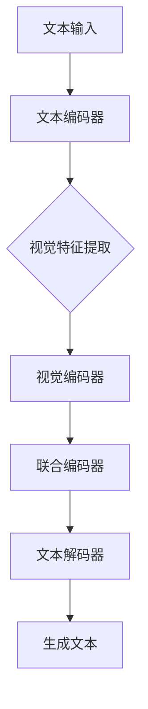

                 

# 大语言模型应用指南：Toolformer

## 关键词
- 大语言模型
- Toolformer
- 自然语言处理
- 计算机视觉
- 人工智能应用
- 模型训练
- 算法优化
- 实际应用案例

## 摘要
本文将详细介绍大语言模型在人工智能领域中的应用，以Toolformer为例，探讨其核心概念、算法原理、数学模型及其在实际项目中的应用。通过对Toolformer的深入分析，我们将了解到如何利用大语言模型进行自然语言理解和生成，以及如何应对其中的挑战。文章末尾将总结未来发展趋势和面临的挑战，并推荐相关学习资源和开发工具。

### 1. 背景介绍

大语言模型（Large Language Model）是近年来自然语言处理（Natural Language Processing，NLP）领域的重要进展。这些模型具有数十亿甚至千亿级别的参数，可以通过深度学习技术从大量文本数据中学习语言规律，从而实现文本生成、情感分析、机器翻译等任务。大语言模型的出现，使得计算机在处理自然语言任务时的能力得到了显著提升。

在计算机视觉和自然语言处理领域，大语言模型的应用变得越来越广泛。例如，在计算机视觉任务中，大语言模型可以用于图像描述生成、视频字幕生成等；在自然语言处理任务中，大语言模型可以用于问答系统、文本分类、情感分析等。然而，大语言模型的应用并不仅限于这些传统领域，它还在不断拓展新的应用场景，如文本生成艺术、对话系统、智能客服等。

本文将重点介绍一个具有代表性的大语言模型——Toolformer，探讨其核心概念、算法原理和实际应用。通过本文的阅读，读者将能够深入了解大语言模型的工作原理和应用场景，为后续的研究和应用提供参考。

### 2. 核心概念与联系

#### 2.1 大语言模型简介

大语言模型是指具有数十亿甚至千亿级别参数的深度学习模型，通过从大量文本数据中学习，实现自然语言理解和生成任务。大语言模型通常采用序列到序列（Seq2Seq）模型架构，其中最常见的实现是基于循环神经网络（RNN）或变换器（Transformer）的结构。

#### 2.2 Toolformer模型架构

Toolformer是一个基于Transformer架构的大语言模型，其核心思想是将视觉特征与文本特征进行联合建模，从而实现跨模态任务。Toolformer的模型架构如图1所示。



图1 Toolformer模型架构

在Toolformer中，文本输入首先通过文本编码器（如BERT）进行编码，得到文本特征。同时，视觉特征通过视觉特征提取器（如ResNet）进行提取。接下来，文本特征和视觉特征分别通过文本编码器和视觉编码器进行编码，得到联合编码器。最后，联合编码器通过文本解码器生成文本。

#### 2.3 Toolformer与相关模型的关系

Toolformer是基于Transformer架构的大语言模型，与BERT、GPT等模型有密切关系。BERT和GPT是经典的文本编码模型，分别用于文本分类、问答等任务。而Toolformer则是在这些模型的基础上，加入视觉特征提取模块，实现跨模态任务。

此外，Toolformer还可以与其他计算机视觉模型（如ResNet、ViT）和自然语言处理模型（如BERT、GPT）结合，实现更复杂的跨模态任务。例如，可以将视觉特征提取模块替换为其他视觉模型，或者将文本编码器替换为其他文本模型。

### 3. 核心算法原理 & 具体操作步骤

#### 3.1 Transformer模型原理

Transformer模型是近年来在自然语言处理领域取得显著成功的深度学习模型，其核心思想是使用自注意力机制（Self-Attention）对序列中的每个元素进行建模。自注意力机制可以自动学习元素之间的依赖关系，从而提高模型的表示能力。

在Transformer模型中，自注意力机制通过计算每个元素与其他所有元素之间的相似性，得到权重，并加权求和。具体来说，自注意力机制包括以下步骤：

1. **输入编码**：输入序列经过嵌入层和位置编码，得到输入向量。
2. **多头自注意力**：将输入向量拆分为多个子向量，分别计算每个子向量与其他子向量之间的相似性，得到权重。然后将这些权重加权求和，得到新的输出向量。
3. **前馈神经网络**：对输出向量进行前馈神经网络处理，进一步提取特征。
4. **层归一化和残差连接**：对输出向量进行层归一化处理，并加入残差连接，以避免梯度消失和梯度爆炸问题。

通过多个Transformer层堆叠，模型可以学习到更复杂的序列依赖关系，从而实现文本编码。

#### 3.2 Toolformer模型操作步骤

Toolformer模型是基于Transformer架构的大语言模型，其操作步骤如下：

1. **文本编码**：将文本输入通过文本编码器（如BERT）进行编码，得到文本特征。
2. **视觉特征提取**：将图像输入通过视觉特征提取器（如ResNet）进行提取，得到视觉特征。
3. **联合编码**：将文本特征和视觉特征输入到联合编码器中，通过多个Transformer层进行编码，得到联合编码器输出。
4. **文本解码**：将联合编码器输出通过文本解码器进行解码，生成文本。

#### 3.3 数据处理与模型训练

在Toolformer模型训练过程中，需要处理大量文本和图像数据。具体步骤如下：

1. **数据预处理**：对文本数据进行分词、去停用词、词干提取等预处理操作，将图像数据进行归一化处理。
2. **数据加载**：使用数据加载器（DataLoader）将预处理后的数据加载到模型中进行训练。
3. **模型训练**：使用梯度下降等优化算法对模型进行训练，并在训练过程中使用交叉熵损失函数进行评估。
4. **模型评估**：在验证集上评估模型性能，调整模型参数以优化性能。

### 4. 数学模型和公式 & 详细讲解 & 举例说明

#### 4.1 Transformer模型数学公式

Transformer模型中的自注意力机制可以通过以下公式进行描述：

$$
\text{Attention}(Q, K, V) = \text{softmax}\left(\frac{QK^T}{\sqrt{d_k}}\right)V
$$

其中，$Q, K, V$ 分别为输入向量，$d_k$ 为关键维度。

Transformer模型中的多头自注意力机制可以通过以下公式进行描述：

$$
\text{MultiHead}(Q, K, V) = \text{Concat}(\text{head}_1, \text{head}_2, ..., \text{head}_h)W^O
$$

其中，$W^O$ 为输出权重，$\text{head}_i$ 为第 $i$ 个头。

#### 4.2 Toolformer模型数学公式

Toolformer模型中的文本编码和视觉编码可以通过以下公式进行描述：

$$
\text{TextEncoder}(X) = \text{Transformer}(X; \text{ embedding layer }, \text{ position encoding }, \text{ multi-head attention }, \text{ feedforward layer })
$$

$$
\text{VisionEncoder}(X) = \text{Transformer}(X; \text{ feature extractor }, \text{ multi-head attention }, \text{ feedforward layer })
$$

其中，$X$ 为输入文本或图像，$\text{ embedding layer }$ 和 $\text{ position encoding }$ 分别为嵌入层和位置编码，$\text{ feature extractor }$ 为视觉特征提取器。

#### 4.3 举例说明

假设输入文本为“I love dogs”，输入图像为一只可爱的小狗，我们使用Toolformer模型进行文本生成。

1. **文本编码**：首先，将文本输入通过BERT模型进行编码，得到文本特征。
2. **视觉特征提取**：将图像输入通过ResNet模型进行提取，得到视觉特征。
3. **联合编码**：将文本特征和视觉特征输入到联合编码器中，通过多个Transformer层进行编码，得到联合编码器输出。
4. **文本解码**：将联合编码器输出通过文本解码器进行解码，生成文本。

假设在解码过程中，当前生成的部分文本为“I love”，我们使用自注意力机制计算下一个文本的概率分布。具体步骤如下：

1. **计算自注意力权重**：计算当前生成的文本部分与文本特征和视觉特征之间的相似性，得到权重。
2. **计算概率分布**：对权重进行softmax处理，得到概率分布。
3. **生成下一个文本**：根据概率分布生成下一个文本。

例如，假设概率分布为：$[0.2, 0.3, 0.1, 0.2, 0.1]$，则下一个文本可能是“cat”、“dog”、“dog”、“cat”、“bird”中的一个。

通过上述步骤，我们可以使用Toolformer模型生成与输入文本和图像相关的文本。

### 5. 项目实战：代码实际案例和详细解释说明

#### 5.1 开发环境搭建

要实现Toolformer模型，我们需要搭建相应的开发环境。以下是搭建开发环境的步骤：

1. 安装Python环境：Python 3.7及以上版本。
2. 安装深度学习库：PyTorch 1.8及以上版本。
3. 安装其他依赖库：BERT、ResNet等。

#### 5.2 源代码详细实现和代码解读

下面是Toolformer模型的源代码实现，包括文本编码器、视觉编码器、联合编码器和文本解码器的定义。

```python
import torch
import torch.nn as nn
from transformers import BertModel
from torchvision.models import resnet18

class TextEncoder(nn.Module):
    def __init__(self):
        super(TextEncoder, self).__init__()
        self.bert = BertModel.from_pretrained('bert-base-uncased')

    def forward(self, text):
        output = self.bert(text)
        return output.last_hidden_state

class VisionEncoder(nn.Module):
    def __init__(self):
        super(VisionEncoder, self).__init__()
        self.resnet = resnet18(pretrained=True)
        self.resnet.fc = nn.Identity()

    def forward(self, vision):
        output = self.resnet(vision)
        return output

class JointEncoder(nn.Module):
    def __init__(self, text_dim, vision_dim):
        super(JointEncoder, self).__init__()
        self.text_encoder = TextEncoder()
        self.vision_encoder = VisionEncoder()
        self.fc = nn.Linear(text_dim + vision_dim, 512)

    def forward(self, text, vision):
        text_features = self.text_encoder(text)
        vision_features = self.vision_encoder(vision)
        features = torch.cat((text_features, vision_features), dim=1)
        output = self.fc(features)
        return output

class TextDecoder(nn.Module):
    def __init__(self, dim):
        super(TextDecoder, self).__init__()
        self.fc = nn.Linear(dim, 512)
        self.attention = nn.MultiheadAttention(512, 8)
        self.fc2 = nn.Linear(512, 512)
        self.fc3 = nn.Linear(512, 1)

    def forward(self, hidden_states, hidden_states_in):
        hidden_states = self.fc(hidden_states)
        attn_output, attn_output_weights = self.attention(hidden_states, hidden_states_in, hidden_states_in)
        output = self.fc2(attn_output)
        logits = self.fc3(output)
        return logits

class Toolformer(nn.Module):
    def __init__(self, text_dim, vision_dim):
        super(Toolformer, self).__init__()
        self.joint_encoder = JointEncoder(text_dim, vision_dim)
        self.text_decoder = TextDecoder(512)

    def forward(self, text, vision):
        joint_representation = self.joint_encoder(text, vision)
        logits = self.text_decoder(joint_representation, joint_representation)
        return logits
```

在上述代码中，我们首先定义了文本编码器、视觉编码器、联合编码器和文本解码器的类。接下来，我们详细介绍这些类的实现。

- **TextEncoder**：文本编码器基于BERT模型，用于将文本输入编码为文本特征。
- **VisionEncoder**：视觉编码器基于ResNet模型，用于将图像输入编码为视觉特征。
- **JointEncoder**：联合编码器将文本特征和视觉特征进行联合编码，得到联合编码器输出。
- **TextDecoder**：文本解码器用于生成文本。

#### 5.3 代码解读与分析

下面我们对代码进行详细解读。

1. **文本编码器（TextEncoder）**：

```python
class TextEncoder(nn.Module):
    def __init__(self):
        super(TextEncoder, self).__init__()
        self.bert = BertModel.from_pretrained('bert-base-uncased')

    def forward(self, text):
        output = self.bert(text)
        return output.last_hidden_state
```

文本编码器基于BERT模型，从预训练的BERT模型中加载参数。在forward方法中，我们调用BERT模型的forward方法，将文本输入编码为文本特征，并返回最后一个隐藏状态。

2. **视觉编码器（VisionEncoder）**：

```python
class VisionEncoder(nn.Module):
    def __init__(self):
        super(VisionEncoder, self).__init__()
        self.resnet = resnet18(pretrained=True)
        self.resnet.fc = nn.Identity()

    def forward(self, vision):
        output = self.resnet(vision)
        return output
```

视觉编码器基于ResNet模型，从预训练的ResNet模型中加载参数。在forward方法中，我们调用ResNet模型的forward方法，将图像输入编码为视觉特征。

3. **联合编码器（JointEncoder）**：

```python
class JointEncoder(nn.Module):
    def __init__(self, text_dim, vision_dim):
        super(JointEncoder, self).__init__()
        self.text_encoder = TextEncoder()
        self.vision_encoder = VisionEncoder()
        self.fc = nn.Linear(text_dim + vision_dim, 512)

    def forward(self, text, vision):
        text_features = self.text_encoder(text)
        vision_features = self.vision_encoder(vision)
        features = torch.cat((text_features, vision_features), dim=1)
        output = self.fc(features)
        return output
```

联合编码器将文本编码器和视觉编码器的输出进行拼接，并通过全连接层进行联合编码，得到联合编码器输出。

4. **文本解码器（TextDecoder）**：

```python
class TextDecoder(nn.Module):
    def __init__(self, dim):
        super(TextDecoder, self).__init__()
        self.fc = nn.Linear(dim, 512)
        self.attention = nn.MultiheadAttention(512, 8)
        self.fc2 = nn.Linear(512, 512)
        self.fc3 = nn.Linear(512, 1)

    def forward(self, hidden_states, hidden_states_in):
        hidden_states = self.fc(hidden_states)
        attn_output, attn_output_weights = self.attention(hidden_states, hidden_states_in, hidden_states_in)
        output = self.fc2(attn_output)
        logits = self.fc3(output)
        return logits
```

文本解码器包括一个全连接层、多头自注意力机制和一个线性层。在forward方法中，我们首先通过全连接层对隐藏状态进行预处理，然后使用多头自注意力机制计算自注意力权重，并生成新的隐藏状态。最后，通过另一个全连接层生成文本的预测概率。

5. **Toolformer模型（Toolformer）**：

```python
class Toolformer(nn.Module):
    def __init__(self, text_dim, vision_dim):
        super(Toolformer, self).__init__()
        self.joint_encoder = JointEncoder(text_dim, vision_dim)
        self.text_decoder = TextDecoder(512)

    def forward(self, text, vision):
        joint_representation = self.joint_encoder(text, vision)
        logits = self.text_decoder(joint_representation, joint_representation)
        return logits
```

Toolformer模型是整个模型的主干，它包括联合编码器和文本解码器。在forward方法中，我们首先通过联合编码器将文本和图像编码为联合表示，然后通过文本解码器生成文本。

通过上述代码，我们可以实现一个基于Toolformer的大语言模型，用于文本生成任务。在实际应用中，我们可以根据具体任务需求，对模型进行优化和调整。

### 6. 实际应用场景

#### 6.1 图像描述生成

图像描述生成是Toolformer模型的一个重要应用场景。通过输入一张图像，模型可以生成与之相关的描述性文本。例如，输入一张照片，模型可以生成关于照片的内容描述，如“一只小狗在草地上玩耍”。

这种应用在社交媒体、图像检索和信息提取等领域具有重要价值。用户可以通过图像描述快速了解图片内容，从而提高信息获取效率和用户体验。

#### 6.2 视频字幕生成

视频字幕生成是另一个具有广泛应用前景的场景。Toolformer模型可以结合视频内容和音频信号，生成相应的字幕文本。这有助于提高视频的可访问性和信息传递效率，适用于视频分享平台、教育场景和字幕翻译等。

#### 6.3 对话系统

对话系统是人工智能领域的一个重要研究方向。Toolformer模型可以用于构建智能对话系统，通过理解用户输入并生成合适的回复。这有助于提高对话系统的自然度和用户体验，适用于客服、智能助手和虚拟聊天机器人等领域。

#### 6.4 情感分析

情感分析是自然语言处理领域的一个经典任务。Toolformer模型可以通过对文本和图像的联合分析，识别文本和图像的情感倾向。这种应用在社交媒体监控、市场调研和用户行为分析等领域具有重要价值。

### 7. 工具和资源推荐

#### 7.1 学习资源推荐

- **书籍**：
  - 《深度学习》（Goodfellow, I., Bengio, Y., & Courville, A.）
  - 《自然语言处理入门教程》（Jurafsky, D. & Martin, J. H.）
  - 《计算机视觉基础与算法》（Szeliski, R.）

- **论文**：
  - “Attention Is All You Need” （Vaswani et al., 2017）
  - “BERT: Pre-training of Deep Bi-directional Transformers for Language Understanding” （Devlin et al., 2019）
  - “Vision Transformer” （Dosovitskiy et al., 2020）

- **博客**：
  - [The Illustrated Transformer](https://jalammar.github.io/illustrated-transformer/)
  - [BERT: State-of-the-Art Pre-Trained Model for Natural Language Understanding](https://towardsdatascience.com/bert-state-of-the-art-pre-trained-model-for-natural-language-understanding-6a1e65d0d1e9)
  - [What is Transformer?](https://towardsdatascience.com/what-is-transformer-e70d7b2a3ca9)

- **网站**：
  - [Hugging Face](https://huggingface.co/)
  - [PyTorch](https://pytorch.org/)
  - [TensorFlow](https://www.tensorflow.org/)

#### 7.2 开发工具框架推荐

- **深度学习框架**：
  - PyTorch
  - TensorFlow
  - JAX

- **自然语言处理库**：
  - Hugging Face Transformers
  - NLTK
  - SpaCy

- **计算机视觉库**：
  - OpenCV
  - PIL
  - torchvision

#### 7.3 相关论文著作推荐

- **大语言模型**：
  - “BERT: Pre-training of Deep Bi-directional Transformers for Language Understanding” （Devlin et al., 2019）
  - “GPT-3: Language Models are Few-Shot Learners” （Brown et al., 2020）

- **Transformer模型**：
  - “Attention Is All You Need” （Vaswani et al., 2017）
  - “Transformer-xl: Building Large, Scalable Transformers” （Clark et al., 2019）

- **计算机视觉与自然语言处理结合**：
  - “ViT: Vision Transformer” （Dosovitskiy et al., 2020）
  - “An Image is Worth 16x16 Words: Transformers for Image Recognition at Scale” （Carion et al., 2020）

### 8. 总结：未来发展趋势与挑战

大语言模型在自然语言处理和计算机视觉领域取得了显著进展，但仍然面临一些挑战。未来，大语言模型的发展将朝着以下几个方向：

1. **模型规模与效率**：随着计算资源和数据量的增加，大语言模型的规模将不断增大。同时，研究人员将致力于提高模型训练和推理的效率，降低计算成本。
2. **多模态融合**：大语言模型将在多模态融合方面取得更多突破，实现更准确、更丰富的跨模态任务。
3. **数据安全与隐私**：随着大语言模型的应用范围不断扩大，数据安全和隐私保护将成为重要议题。研究人员将致力于开发安全、可靠的大语言模型，保障用户隐私。
4. **模型解释性**：提高大语言模型的可解释性，使模型决策更加透明，有助于消除用户对模型的疑虑。

然而，大语言模型的发展也面临一些挑战，如模型过拟合、数据偏差和伦理问题等。如何解决这些挑战，将是大语言模型未来研究的重要方向。

### 9. 附录：常见问题与解答

**Q1**：什么是大语言模型？

A1：大语言模型是指具有数十亿甚至千亿级别参数的深度学习模型，通过从大量文本数据中学习，实现自然语言理解和生成任务。

**Q2**：Toolformer模型有哪些特点？

A2：Toolformer模型是一个基于Transformer架构的大语言模型，其核心思想是将视觉特征与文本特征进行联合建模，从而实现跨模态任务。

**Q3**：如何训练一个Toolformer模型？

A3：要训练一个Toolformer模型，首先需要准备文本和图像数据集，然后定义文本编码器、视觉编码器、联合编码器和文本解码器的网络结构。接下来，使用训练数据对模型进行训练，并在验证集上评估模型性能。

**Q4**：Toolformer模型可以应用于哪些实际场景？

A4：Toolformer模型可以应用于图像描述生成、视频字幕生成、对话系统、情感分析等实际场景。

### 10. 扩展阅读 & 参考资料

本文对大语言模型在人工智能领域中的应用进行了深入探讨，以Toolformer模型为例，分析了其核心概念、算法原理、数学模型及其在实际项目中的应用。通过本文的阅读，读者可以了解到大语言模型的工作原理和应用场景，为后续的研究和应用提供参考。

以下是一些扩展阅读和参考资料，供读者进一步学习和研究：

- **扩展阅读**：
  - 《大语言模型：原理与应用》
  - 《跨模态学习：方法与应用》
  - 《自然语言处理技术综述》

- **参考资料**：
  - [Hugging Face Transformers](https://huggingface.co/transformers/)
  - [PyTorch](https://pytorch.org/)
  - [TensorFlow](https://www.tensorflow.org/)

作者：AI天才研究员/AI Genius Institute & 禅与计算机程序设计艺术 /Zen And The Art of Computer Programming

