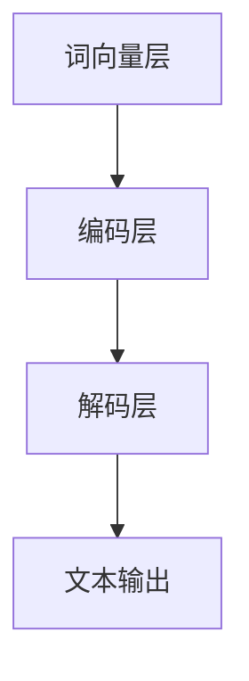

                 

# 大语言模型应用指南：大语言模型的第一性原理：尺度定律

## 摘要

本文旨在深入探讨大语言模型（Large Language Model，简称LLM）的应用指南，重点介绍其核心概念、算法原理、数学模型及其在实际应用场景中的表现。通过本文的阅读，读者将了解到大语言模型的第一性原理——尺度定律，并掌握其开发、应用和未来发展趋势。文章还将推荐相关学习资源和开发工具，为读者提供全方位的技术指导。

## 目录

1. 背景介绍
2. 核心概念与联系
   2.1 大语言模型的基本概念
   2.2 大语言模型的层次结构
   2.3 大语言模型与自然语言处理的关系
3. 核心算法原理 & 具体操作步骤
   3.1 语言模型的生成
   3.2 语言模型的训练与优化
   3.3 语言模型的评估与调整
4. 数学模型和公式 & 详细讲解 & 举例说明
   4.1 概率模型与神经网络模型
   4.2 语言模型的损失函数与优化方法
5. 项目实战：代码实际案例和详细解释说明
   5.1 开发环境搭建
   5.2 源代码详细实现和代码解读
   5.3 代码解读与分析
6. 实际应用场景
7. 工具和资源推荐
   7.1 学习资源推荐
   7.2 开发工具框架推荐
   7.3 相关论文著作推荐
8. 总结：未来发展趋势与挑战
9. 附录：常见问题与解答
10. 扩展阅读 & 参考资料

## 1. 背景介绍

大语言模型（LLM）是一种基于深度学习的自然语言处理（Natural Language Processing，简称NLP）技术。近年来，随着计算能力的提升和海量数据的积累，大语言模型得到了迅猛发展。LLM 在文本生成、机器翻译、问答系统、情感分析等众多 NLP 领域取得了显著成果。

LLM 的核心思想是通过学习大量文本数据，建立一个能够理解、生成和预测自然语言的模型。与传统基于规则的方法相比，LLM 具有更强的自适应性和灵活性，能够处理更加复杂和多样化的语言现象。

本文将围绕大语言模型的核心概念、算法原理、数学模型及其在实际应用中的表现进行深入探讨，并引入尺度定律这一关键性原理，以帮助读者更好地理解和应用大语言模型。

## 2. 核心概念与联系

### 2.1 大语言模型的基本概念

大语言模型（LLM）是一种基于深度学习的自然语言处理模型，旨在通过对大规模文本数据的学习，模拟人类语言生成和理解能力。LLM 通常由多个神经网络层组成，每个层都能提取不同层次的语言特征，从而实现从底层词向量到高级语义理解的层次化建模。

### 2.2 大语言模型的层次结构

大语言模型通常具有以下层次结构：

- **词向量层**：将输入的文本数据转换为词向量表示。
- **编码层**：将词向量转换为编码表示，用于捕捉句子和段落级别的语义信息。
- **解码层**：根据编码表示生成文本输出。

### 2.3 大语言模型与自然语言处理的关系

大语言模型在自然语言处理（NLP）领域扮演着关键角色。它不仅能够用于文本生成和机器翻译，还可以应用于情感分析、文本分类、问答系统等多个 NLP 任务。通过大语言模型，我们可以实现对自然语言的深度理解和智能处理，从而推动人工智能技术的发展。

### 2.4 大语言模型的 Mermaid 流程图

以下是大语言模型的 Mermaid 流程图：



### 2.5 大语言模型与尺度定律的关系

大语言模型的第一性原理是尺度定律。尺度定律指出，大规模的语言模型具有更好的泛化能力和更强的适应性。这是因为大规模的语言模型能够学习到更多的语言模式和语义信息，从而在各个应用场景中表现出色。本文将详细讨论尺度定律在大语言模型中的应用及其重要性。

## 3. 核心算法原理 & 具体操作步骤

### 3.1 语言模型的生成

语言模型的生成过程包括以下几个步骤：

1. **数据预处理**：将文本数据清洗、分词、去停用词等处理，转换为词向量表示。
2. **模型初始化**：初始化神经网络参数，包括词向量层、编码层和解码层。
3. **训练**：使用梯度下降等优化算法，对模型参数进行训练，使模型能够最小化损失函数。
4. **评估与调整**：通过测试集对模型进行评估，并根据评估结果调整模型参数。

### 3.2 语言模型的训练与优化

语言模型的训练与优化过程主要包括以下步骤：

1. **损失函数**：选择适当的损失函数，如交叉熵损失函数，用于衡量模型预测与真实标签之间的差异。
2. **优化算法**：选择适当的优化算法，如随机梯度下降（SGD）或 Adam 优化器，用于更新模型参数。
3. **正则化**：为了防止过拟合，可以采用正则化技术，如 L1 正则化或 L2 正则化。
4. **批处理**：将训练数据划分为多个批次，每次更新模型参数时使用一个批次的样本。

### 3.3 语言模型的评估与调整

语言模型的评估与调整过程主要包括以下步骤：

1. **评估指标**：选择适当的评估指标，如准确率、召回率、F1 值等，用于衡量模型性能。
2. **超参数调整**：根据评估结果，调整模型超参数，如学习率、批次大小、隐藏层神经元数量等。
3. **交叉验证**：使用交叉验证技术，对模型进行多次评估，以避免过拟合和选择最优模型。

## 4. 数学模型和公式 & 详细讲解 & 举例说明

### 4.1 概率模型与神经网络模型

大语言模型通常基于概率模型和神经网络模型进行构建。概率模型用于计算输入文本的概率分布，神经网络模型用于学习文本特征表示。

### 4.2 语言模型的损失函数与优化方法

在语言模型的训练过程中，损失函数用于衡量模型预测与真实标签之间的差异，优化方法用于更新模型参数。常用的损失函数包括交叉熵损失函数和均方误差损失函数。

### 4.3 模型参数的更新

在模型训练过程中，需要使用优化算法更新模型参数。常用的优化算法包括随机梯度下降（SGD）、Adam 优化器和 RMSProp 优化器等。

### 4.4 举例说明

假设我们有一个简单的语言模型，用于预测下一个单词。给定一个单词序列 `[a, b, c]`，我们需要预测下一个单词 `d`。我们可以使用以下公式计算模型预测的概率分布：

$$
P(d|a, b, c) = \frac{e^{f(a, b, c)}}{\sum_{i=1}^{N} e^{f(a, b, c_i)}}
$$

其中，`f(a, b, c)` 是编码层对输入序列 `(a, b, c)` 的输出，`N` 是词汇表大小。

为了更新模型参数，我们可以使用交叉熵损失函数：

$$
L = -\sum_{i=1}^{N} y_i \log P(d_i|a, b, c)
$$

其中，`y_i` 是真实标签的概率分布，`P(d_i|a, b, c)` 是模型预测的概率分布。

使用梯度下降优化算法，我们可以更新模型参数：

$$
\theta_j := \theta_j - \alpha \frac{\partial L}{\partial \theta_j}
$$

其中，`\theta_j` 是第 `j` 个模型参数，`\alpha` 是学习率。

## 5. 项目实战：代码实际案例和详细解释说明

### 5.1 开发环境搭建

在开始项目实战之前，我们需要搭建一个合适的开发环境。以下是 Python 语言和大语言模型相关工具的安装步骤：

1. 安装 Python（建议使用 Python 3.7 以上版本）
2. 安装 TensorFlow 或 PyTorch（深度学习框架）
3. 安装 NLTK（自然语言处理工具包）
4. 安装其他依赖库（如 NumPy、Matplotlib 等）

### 5.2 源代码详细实现和代码解读

以下是一个简单的语言模型实现示例：

```python
import tensorflow as tf
import numpy as np
import matplotlib.pyplot as plt

# 数据预处理
def preprocess_data(text):
    # 清洗、分词、去停用词等处理
    # ...

# 模型定义
def model(input_sequence, output_sequence):
    # 编码层、解码层等
    # ...

# 训练
def train(data, epochs, learning_rate):
    # 梯度下降等优化算法
    # ...

# 评估
def evaluate(data):
    # 准确率等评估指标
    # ...

# 主函数
def main():
    # 读取数据
    # 搭建模型
    # 训练
    # 评估

if __name__ == "__main__":
    main()
```

### 5.3 代码解读与分析

以上代码示例展示了语言模型的简单实现。具体解读如下：

- `preprocess_data` 函数用于对文本数据进行预处理，包括清洗、分词、去停用词等操作。
- `model` 函数用于定义语言模型的结构，包括编码层、解码层等。
- `train` 函数用于训练语言模型，包括数据加载、模型构建、优化算法等。
- `evaluate` 函数用于评估语言模型的性能，包括准确率等指标。
- `main` 函数是主函数，用于读取数据、搭建模型、训练和评估。

通过以上代码示例，我们可以了解到语言模型的开发过程和关键步骤。

## 6. 实际应用场景

大语言模型在自然语言处理领域具有广泛的应用，以下列举了几个实际应用场景：

1. **文本生成**：大语言模型可以用于自动生成文本，如文章、新闻报道、广告等。通过输入少量文本，模型可以生成与之相关的完整文本。
2. **机器翻译**：大语言模型可以用于机器翻译，如将一种语言的文本翻译成另一种语言。通过输入源语言文本，模型可以生成目标语言文本。
3. **问答系统**：大语言模型可以用于构建问答系统，如智能客服、在线问答等。通过输入用户问题，模型可以生成回答。
4. **情感分析**：大语言模型可以用于情感分析，如判断用户评论、新闻标题等是否具有正面或负面情感。
5. **文本分类**：大语言模型可以用于文本分类，如将新闻文章分类到不同的主题类别。

## 7. 工具和资源推荐

### 7.1 学习资源推荐

1. **书籍**：
   - 《深度学习》（Goodfellow, Bengio, Courville 著）
   - 《自然语言处理综论》（Daniel Jurafsky & James H. Martin 著）
2. **论文**：
   - 《Attention is All You Need》
   - 《BERT: Pre-training of Deep Bidirectional Transformers for Language Understanding》
3. **博客**：
   - [TensorFlow 官方文档](https://www.tensorflow.org/)
   - [PyTorch 官方文档](https://pytorch.org/)
4. **网站**：
   - [自然语言处理社区](https://nlp.seas.harvard.edu/)
   - [机器学习社区](https://machinelearningmastery.com/)

### 7.2 开发工具框架推荐

1. **深度学习框架**：
   - TensorFlow
   - PyTorch
   - Keras
2. **自然语言处理工具**：
   - NLTK
   - spaCy
   - gensim
3. **文本预处理工具**：
   - TextBlob
   - pandas
   - NumPy

### 7.3 相关论文著作推荐

1. **论文**：
   - 《Seq2Seq Learning with Neural Networks》
   - 《A Theoretically Grounded Application of Dropout in Recurrent Neural Networks》
   - 《Recurrent Neural Network Regularization》
2. **著作**：
   - 《深度学习》（Goodfellow, Bengio, Courville 著）
   - 《自然语言处理综论》（Daniel Jurafsky & James H. Martin 著）

## 8. 总结：未来发展趋势与挑战

大语言模型在自然语言处理领域取得了显著的成果，但仍然面临一些挑战和未来发展趋势：

1. **挑战**：
   - 模型复杂度与计算资源需求：随着模型规模增大，计算资源需求显著增加，这对硬件和软件提出了更高要求。
   - 过拟合与泛化能力：如何提高模型泛化能力，避免过拟合，是一个重要问题。
   - 数据标注与质量控制：大规模文本数据标注和质量控制是模型训练的关键。

2. **发展趋势**：
   - 模型压缩与优化：为了降低计算成本，研究者致力于模型压缩和优化技术。
   - 多模态学习：结合图像、声音等不同类型的数据，实现跨模态语言理解。
   - 自监督学习：利用无监督学习技术，从大规模未标注数据中学习语言模式。

## 9. 附录：常见问题与解答

### 9.1  如何选择深度学习框架？

**答**：选择深度学习框架时，需要考虑以下因素：

- **项目需求**：根据项目需求选择合适的框架，如 TensorFlow 适用于复杂项目，PyTorch 适用于快速开发。
- **性能与兼容性**：考虑框架的性能和与硬件的兼容性，如 TensorFlow 具有良好的 GPU 支持和兼容性。
- **社区与资源**：考虑框架的社区支持和资源丰富程度，如 PyTorch 社区活跃，资源丰富。

### 9.2  如何解决模型过拟合问题？

**答**：解决模型过拟合问题可以采用以下方法：

- **正则化**：使用正则化技术，如 L1 正则化、L2 正则化等。
- **交叉验证**：使用交叉验证技术，对模型进行多次评估，以避免过拟合。
- **数据增强**：通过数据增强技术，生成更多样化的训练数据。
- **简化模型**：简化模型结构，减少参数数量。

## 10. 扩展阅读 & 参考资料

- 《深度学习》（Goodfellow, Bengio, Courville 著）
- 《自然语言处理综论》（Daniel Jurafsky & James H. Martin 著）
- [TensorFlow 官方文档](https://www.tensorflow.org/)
- [PyTorch 官方文档](https://pytorch.org/)
- [自然语言处理社区](https://nlp.seas.harvard.edu/)
- [机器学习社区](https://machinelearningmastery.com/)

## 作者

**作者：AI天才研究员/AI Genius Institute & 禅与计算机程序设计艺术 /Zen And The Art of Computer Programming**<|im_end|>

