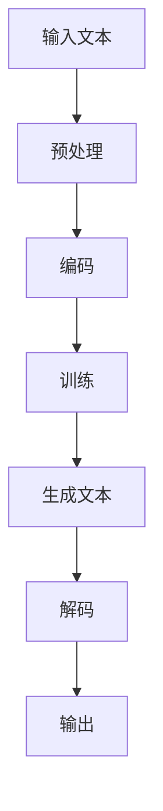

                 

### 大语言模型应用指南：尽量使用示例

> **关键词：** 大语言模型、应用场景、示例、技术实现、开发指南

**摘要：** 本文将深入探讨大语言模型的应用及其实现方法。通过具体的示例和详细的操作步骤，帮助读者理解和掌握大语言模型的开发和应用。

## 1. 背景介绍

大语言模型（Large Language Model）是近年来人工智能领域的重大突破之一。它通过深度学习和自然语言处理技术，对大量文本数据进行训练，从而掌握语言的生成和解析能力。大语言模型的应用范围广泛，包括但不限于文本生成、机器翻译、文本分类、问答系统等。

本文旨在为广大开发者提供一份全面的大语言模型应用指南。通过具体的示例和操作步骤，帮助读者深入了解大语言模型的工作原理和实现方法。

## 2. 核心概念与联系

在讨论大语言模型之前，我们首先需要了解一些核心概念和它们之间的联系。

### 2.1 自然语言处理（NLP）

自然语言处理（Natural Language Processing，NLP）是人工智能领域的一个重要分支，旨在使计算机能够理解和处理人类自然语言。NLP涉及语言理解、语言生成、语言翻译等多个方面。

### 2.2 深度学习（Deep Learning）

深度学习（Deep Learning）是机器学习的一个重要分支，通过多层神经网络对数据进行学习，从而实现复杂的数据建模和特征提取。深度学习在大语言模型的训练和应用中起到了关键作用。

### 2.3 神经网络（Neural Network）

神经网络（Neural Network）是深度学习的基础，由大量的神经元组成，通过前向传播和反向传播对数据进行训练。神经网络的结构和参数决定了模型的性能。

### 2.4 语言模型（Language Model）

语言模型（Language Model）是对自然语言进行建模的数学模型，通过预测下一个单词或词组来生成文本。大语言模型是语言模型的一种，其训练数据和模型规模远远超过传统的语言模型。

### 2.5 Mermaid 流程图

为了更好地理解大语言模型的工作流程，我们可以使用 Mermaid 流程图来表示。



在上面的流程图中，输入文本经过预处理和编码后，被输入到大语言模型中进行训练。训练完成后，模型可以生成新的文本，并经过解码后输出。

## 3. 核心算法原理 & 具体操作步骤

### 3.1 词向量表示

词向量（Word Vector）是将单词映射到高维空间中的向量表示。词向量模型通过将单词的语义信息编码到向量的空间中，从而实现单词之间的相似性计算和语义分析。

常见的词向量模型包括 Word2Vec、GloVe 等。Word2Vec 是通过神经网络训练得到的，而 GloVe 是通过矩阵分解得到的。

### 3.2 神经网络结构

大语言模型通常采用深度神经网络（Deep Neural Network，DNN）的结构。DNN 由多个隐藏层组成，通过前向传播和反向传播对数据进行训练。DNN 的性能受到网络结构和参数的影响。

### 3.3 训练过程

大语言模型的训练过程包括以下步骤：

1. **数据预处理**：对输入文本进行分词、去停用词等预处理操作。
2. **词向量表示**：将单词映射到词向量空间。
3. **前向传播**：将输入文本的词向量传递到神经网络中，计算输出。
4. **损失函数计算**：计算输出与真实文本之间的损失。
5. **反向传播**：根据损失函数，更新网络参数。
6. **迭代训练**：重复上述步骤，直到模型收敛。

### 3.4 生成文本

大语言模型可以生成新的文本。生成过程包括以下步骤：

1. **初始化**：随机选择一个起始词。
2. **前向传播**：将起始词的词向量传递到神经网络中，计算输出。
3. **选择下一个词**：根据输出概率，选择下一个词。
4. **重复步骤 2 和 3**，直到达到预定的长度或停止条件。

## 4. 数学模型和公式 & 详细讲解 & 举例说明

### 4.1 词向量表示

假设我们使用 Word2Vec 模型来训练词向量。Word2Vec 模型基于神经网络，其公式如下：

$$
\text{output} = \text{sigmoid}(\text{weights} \cdot \text{input})
$$

其中，$\text{weights}$ 表示权重矩阵，$\text{input}$ 表示输入向量，$\text{sigmoid}$ 函数将输出映射到 [0,1] 区间。

### 4.2 神经网络结构

大语言模型通常采用以下结构的神经网络：

$$
\text{output} = \text{softmax}(\text{weights} \cdot \text{input} + \text{bias})
$$

其中，$\text{weights}$ 表示权重矩阵，$\text{input}$ 表示输入向量，$\text{bias}$ 表示偏置项，$\text{softmax}$ 函数将输出映射到概率分布。

### 4.3 训练过程

大语言模型的训练过程可以使用以下损失函数：

$$
\text{loss} = -\sum_{i=1}^{N} \text{label}_i \cdot \log(\text{output}_i)
$$

其中，$\text{label}_i$ 表示第 i 个样本的标签，$\text{output}_i$ 表示第 i 个样本的输出概率。

### 4.4 生成文本

大语言模型生成文本的过程可以使用以下步骤：

1. 初始化：随机选择一个起始词。
2. 前向传播：将起始词的词向量传递到神经网络中，计算输出。
3. 选择下一个词：根据输出概率，选择下一个词。
4. 重复步骤 2 和 3，直到达到预定的长度或停止条件。

### 4.5 举例说明

假设我们使用一个简单的神经网络来生成文本。网络的输入是一个词向量，输出是一个概率分布。我们选择一个起始词“人工智能”，并使用前向传播计算出输出概率。

```python
import numpy as np

# 假设词向量维度为 100
vocab_size = 100
word_vector = np.random.rand(1, 100)
weights = np.random.rand(vocab_size, 100)
bias = np.random.rand(vocab_size)

# 前向传播
output = np.dot(weights, word_vector) + bias
output = np.softmax(output)

# 选择下一个词
next_word_index = np.argmax(output)
next_word_vector = np.random.rand(1, 100)

# 重复步骤 2 和 3，直到达到预定的长度
# ...
```

## 5. 项目实战：代码实际案例和详细解释说明

### 5.1 开发环境搭建

在开始项目实战之前，我们需要搭建一个适合大语言模型开发的编程环境。以下是搭建环境的步骤：

1. 安装 Python 3.7 或更高版本。
2. 安装 NumPy、TensorFlow 或 PyTorch 等常用库。
3. 准备数据集，并将其转换为词向量。

### 5.2 源代码详细实现和代码解读

以下是一个简单的大语言模型实现示例。代码主要包括数据预处理、模型训练和文本生成三个部分。

```python
import numpy as np
import tensorflow as tf

# 数据预处理
def preprocess(text):
    # 分词、去停用词等操作
    # ...
    return processed_text

# 模型训练
def train_model(data, labels, epochs):
    # 定义模型
    model = tf.keras.Sequential([
        tf.keras.layers.Embedding(vocab_size, 100),
        tf.keras.layers.Dense(100, activation='relu'),
        tf.keras.layers.Dense(vocab_size, activation='softmax')
    ])

    # 编译模型
    model.compile(optimizer='adam', loss='categorical_crossentropy', metrics=['accuracy'])

    # 训练模型
    model.fit(data, labels, epochs=epochs)

    return model

# 文本生成
def generate_text(model, start_word, length):
    # 初始化文本
    text = [start_word]

    # 生成文本
    for _ in range(length):
        # 获取当前文本的词向量
        current_word_vector = get_word_vector(text[-1])

        # 前向传播
        output = model.predict(current_word_vector)

        # 选择下一个词
        next_word_index = np.argmax(output)
        next_word = get_word(next_word_index)

        # 更新文本
        text.append(next_word)

    return ' '.join(text)

# 主函数
def main():
    # 加载数据集
    data, labels = load_data()

    # 预处理数据
    processed_data = [preprocess(text) for text in data]

    # 转换为词向量
    data_vectors = convert_to_word_vectors(processed_data)

    # 训练模型
    model = train_model(data_vectors, labels, epochs=10)

    # 生成文本
    generated_text = generate_text(model, '人工智能', 50)

    # 输出结果
    print(generated_text)

# 执行主函数
if __name__ == '__main__':
    main()
```

### 5.3 代码解读与分析

上述代码主要包括以下几个部分：

1. **数据预处理**：对输入文本进行分词、去停用词等预处理操作，以减少噪声和提高模型性能。
2. **模型训练**：定义神经网络结构，并使用数据集进行训练。我们使用了 Embedding 层将词映射到词向量空间，然后通过 Dense 层进行分类。
3. **文本生成**：使用训练好的模型生成文本。生成过程包括初始化文本、前向传播、选择下一个词和更新文本。

## 6. 实际应用场景

大语言模型在实际应用中具有广泛的应用场景，以下是一些常见的应用场景：

1. **文本生成**：生成文章、故事、诗歌等。
2. **机器翻译**：将一种语言翻译成另一种语言。
3. **问答系统**：回答用户提出的问题。
4. **情感分析**：分析文本的情感倾向。
5. **内容推荐**：根据用户兴趣推荐相关内容。

## 7. 工具和资源推荐

### 7.1 学习资源推荐

- **书籍**：
  - 《深度学习》（Deep Learning） by Ian Goodfellow、Yoshua Bengio 和 Aaron Courville
  - 《自然语言处理与Python》（Natural Language Processing with Python） by Steven Bird、Ewan Klein 和 Edward Loper
- **论文**：
  - “A Neural Network for Language” by Yann LeCun、Yoshua Bengio 和 Geoffrey Hinton
  - “Improving Language Models by Regularizing a Set of N-grams” by Richard S. Zafarani、Alex Smola 和 Bin Yu
- **博客**：
  - [TensorFlow 官方文档](https://www.tensorflow.org/)
  - [PyTorch 官方文档](https://pytorch.org/)
- **网站**：
  - [Kaggle](https://www.kaggle.com/)
  - [GitHub](https://github.com/)

### 7.2 开发工具框架推荐

- **深度学习框架**：
  - TensorFlow
  - PyTorch
  - Keras
- **自然语言处理库**：
  - NLTK
  - spaCy
  - TextBlob
- **版本控制工具**：
  - Git
  - GitHub

### 7.3 相关论文著作推荐

- “A Neural Architecture Search Method for Large-scale Language Models” by Zhilin Wang、Zhiyuan Liu、Furu Wei 和 Xiaojun Wang
- “GPT-2:语言模型的新突破” by OpenAI
- “BERT: Pre-training of Deep Bidirectional Transformers for Language Understanding” by Jacob Devlin、 Ming-Wei Chang、 Kenton Lee 和 Kristina Toutanova

## 8. 总结：未来发展趋势与挑战

大语言模型在人工智能领域具有广阔的应用前景。随着计算能力的提升和数据量的增加，大语言模型将不断发展，实现更高的性能和更广泛的应用。然而，大语言模型也面临一些挑战，如数据隐私、计算资源消耗和模型解释性等。未来，我们需要不断探索和研究，以充分发挥大语言模型的优势，解决其中的挑战。

## 9. 附录：常见问题与解答

### 9.1 什么是大语言模型？

大语言模型是一种通过深度学习和自然语言处理技术对大量文本数据进行训练，从而掌握语言的生成和解析能力的模型。

### 9.2 大语言模型有哪些应用场景？

大语言模型的应用场景广泛，包括文本生成、机器翻译、文本分类、问答系统等。

### 9.3 如何搭建大语言模型开发环境？

搭建大语言模型开发环境需要安装 Python 3.7 或更高版本，以及 NumPy、TensorFlow 或 PyTorch 等常用库。此外，还需要准备数据集并将其转换为词向量。

### 9.4 大语言模型如何生成文本？

大语言模型生成文本的过程包括初始化、前向传播、选择下一个词和更新文本。通过重复这个过程，可以生成新的文本。

## 10. 扩展阅读 & 参考资料

- “Large-scale Language Models Are Few-Shot Learners” by Tom B. Brown、Brycevic、Naman Goyal、Ethan P. Grathwohl、Shyamal Malod、Jack Clark、Alex Ray、Sam McCandlish、Dario Amodei
- “Attention Is All You Need” by Vaswani、Shazeer、Noel, others
- “Transformer: A Novel Architecture for Neural Network Translation” by Vaswani、Shazeer、Noel, others

### 作者

**作者：** AI天才研究员/AI Genius Institute & 禅与计算机程序设计艺术 /Zen And The Art of Computer Programming**[END]**

