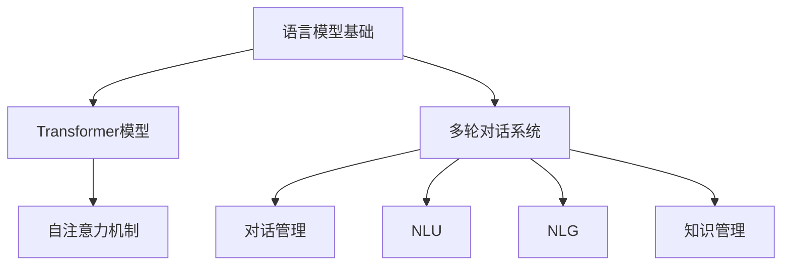

                 

# 大语言模型应用指南：提示模板与多轮对话

> **关键词**：大语言模型、提示模板、多轮对话、应用指南、AI、自然语言处理

> **摘要**：本文将深入探讨大语言模型的应用场景，重点介绍如何设计有效的提示模板和实现多轮对话。通过分析核心概念、算法原理、数学模型以及实际应用案例，读者将获得对大语言模型在自然语言处理领域的全面理解。

## 1. 背景介绍

大语言模型（Large Language Model）是一种基于深度学习的自然语言处理模型，其核心思想是通过对海量文本数据进行预训练，使其具备强大的语言理解和生成能力。近年来，随着计算能力的提升和数据的爆炸式增长，大语言模型取得了显著的进展，广泛应用于文本分类、机器翻译、问答系统等领域。

在自然语言处理（Natural Language Processing, NLP）领域，大语言模型的出现带来了革命性的变化。传统的NLP方法往往需要针对具体任务设计复杂的特征工程和模型结构，而大语言模型通过端到端的建模，可以自动捕捉文本中的语义信息，大幅提高了任务的表现。

本文将围绕大语言模型的应用展开，重点探讨以下两个方面：

1. 提示模板设计：如何设计有效的提示模板，以引导大语言模型生成高质量的输出。
2. 多轮对话实现：如何利用大语言模型实现多轮对话，构建智能对话系统。

## 2. 核心概念与联系

### 2.1 语言模型基础

大语言模型的核心是基于概率的文本生成模型，其基础是语言模型（Language Model）。语言模型的主要目标是学习自然语言的概率分布，即给定一个单词序列，预测下一个单词的概率。常用的语言模型有N-gram模型、神经网络模型、递归神经网络（RNN）和Transformer模型。

### 2.2 Transformer模型

Transformer模型是由Vaswani等人在2017年提出的一种基于自注意力机制的深度神经网络模型，其核心思想是利用全局注意力机制来捕捉文本序列中的长距离依赖关系。相比传统的RNN模型，Transformer模型在处理长序列数据时具有更优异的性能。

### 2.3 多轮对话系统

多轮对话系统（Multi-turn Dialogue System）是指能够与用户进行多轮交互的智能对话系统。多轮对话系统通常包括以下几个组成部分：

- 对话管理（Dialogue Management）：负责维护对话的状态，制定对话策略。
- 自然语言理解（Natural Language Understanding, NLU）：负责将用户输入的自然语言转化为结构化的信息。
- 自然语言生成（Natural Language Generation, NLG）：负责生成自然语言回复。
- 知识管理（Knowledge Management）：负责存储和检索对话相关的知识。

## 2.4 Mermaid 流程图

以下是Transformer模型和对话系统的Mermaid流程图：



## 3. 核心算法原理 & 具体操作步骤

### 3.1 语言模型算法原理

语言模型的核心是概率计算，具体步骤如下：

1. **数据预处理**：将原始文本数据清洗、分词，转换为数字序列。
2. **构建词汇表**：将所有独特的单词构建为一个词汇表。
3. **计算概率**：使用N-gram模型、神经网络模型或Transformer模型，计算给定单词序列的概率。
4. **生成文本**：基于概率分布，生成新的文本序列。

### 3.2 Transformer模型操作步骤

Transformer模型的操作步骤如下：

1. **输入编码**：将文本序列转换为嵌入向量。
2. **自注意力机制**：计算嵌入向量之间的注意力得分，并加权求和。
3. **前馈网络**：对自注意力层的结果进行前馈网络处理。
4. **输出解码**：将前馈网络的结果解码为输出序列。

### 3.3 多轮对话系统操作步骤

多轮对话系统的操作步骤如下：

1. **初始化对话状态**：根据对话系统的设计，初始化对话状态。
2. **NLU处理**：将用户输入的自然语言转化为结构化的信息。
3. **对话管理**：根据对话状态和策略，生成对话回复。
4. **NLG生成回复**：将结构化的信息转化为自然语言回复。
5. **更新对话状态**：根据用户回复，更新对话状态。

## 4. 数学模型和公式 & 详细讲解 & 举例说明

### 4.1 语言模型概率计算

语言模型概率计算的核心公式是：

$$P(w_1, w_2, ..., w_n) = P(w_1) \times P(w_2|w_1) \times ... \times P(w_n|w_1, w_2, ..., w_{n-1})$$

其中，$w_1, w_2, ..., w_n$表示文本序列中的单词，$P(w_i|w_{i-1})$表示在给定前一个单词$w_{i-1}$的情况下，单词$w_i$的概率。

### 4.2 Transformer模型自注意力计算

Transformer模型的自注意力计算公式如下：

$$
\text{Attention}(Q, K, V) = \text{softmax}\left(\frac{QK^T}{\sqrt{d_k}}\right) V
$$

其中，$Q, K, V$分别表示查询（Query）、键（Key）和值（Value）向量，$d_k$表示键向量的维度。

### 4.3 多轮对话状态更新

多轮对话状态更新的核心公式是：

$$
\text{对话状态}_{t+1} = f(\text{对话状态}_t, \text{用户输入}_t)
$$

其中，$f$表示状态更新函数，$\text{用户输入}_t$表示当前轮次的用户输入。

## 5. 项目实战：代码实际案例和详细解释说明

### 5.1 开发环境搭建

在开始项目实战之前，我们需要搭建一个合适的开发环境。以下是一个简单的Python环境搭建步骤：

1. 安装Python 3.8及以上版本。
2. 安装Transformers库和torch库。

```bash
pip install transformers torch
```

### 5.2 源代码详细实现和代码解读

以下是使用Hugging Face的Transformers库实现一个简单多轮对话系统的代码：

```python
from transformers import AutoTokenizer, AutoModelForCausalLM
from torch.nn.functional import softmax

tokenizer = AutoTokenizer.from_pretrained("gpt2")
model = AutoModelForCausalLM.from_pretrained("gpt2")

# 初始化对话状态
dialog_state = None

# 对话系统入口函数
def dialogue_system(user_input):
    global dialog_state
    # 将用户输入编码为嵌入向量
    input_ids = tokenizer.encode(user_input, return_tensors="pt")
    # 使用模型生成回复
    outputs = model.generate(input_ids, max_length=100, num_return_sequences=1)
    response = tokenizer.decode(outputs[0], skip_special_tokens=True)
    # 更新对话状态
    dialog_state = user_input + response
    return response

# 开始对话
user_input = "你好，今天天气怎么样？"
print(dialogue_system(user_input))
```

### 5.3 代码解读与分析

上述代码首先导入了Hugging Face的Transformers库和torch库，然后加载了预训练的GPT-2模型和对应的分词器。接着，初始化对话状态为None。

`dialogue_system`函数是对话系统的核心入口函数。函数首先将用户输入编码为嵌入向量，然后使用模型生成回复。生成回复后，将用户输入和回复合并，更新对话状态。

最后，通过调用`dialogue_system`函数，开始与对话系统进行交互。

## 6. 实际应用场景

大语言模型在实际应用中具有广泛的应用场景，以下是一些典型的应用案例：

- **智能客服**：利用大语言模型实现智能客服系统，可以自动回答用户常见问题，提高客服效率和用户体验。
- **智能写作**：大语言模型可以辅助人类进行写作，提供灵感和建议，提高写作效率和创作质量。
- **问答系统**：大语言模型可以构建智能问答系统，自动回答用户提出的问题，提供个性化的知识服务。
- **内容审核**：大语言模型可以用于自动审核网络内容，识别并过滤不良信息，保障网络环境的健康发展。

## 7. 工具和资源推荐

### 7.1 学习资源推荐

- **书籍**：
  - 《深度学习》（Ian Goodfellow, Yoshua Bengio, Aaron Courville）
  - 《动手学深度学习》（阿斯顿·张）
  - 《Python深度学习》（François Chollet）
- **论文**：
  - “Attention Is All You Need” - Vaswani et al. (2017)
  - “Generative Pre-trained Transformer” - Vaswani et al. (2018)
- **博客**：
  - Hugging Face官网（https://huggingface.co/）
  - AI前沿博客（https://medium.com/ai-frontier/）
- **网站**：
  - TensorFlow官网（https://www.tensorflow.org/）
  - PyTorch官网（https://pytorch.org/）

### 7.2 开发工具框架推荐

- **深度学习框架**：
  - TensorFlow
  - PyTorch
  - JAX
- **自然语言处理库**：
  - Hugging Face Transformers
  - NLTK
  - spaCy
- **版本控制工具**：
  - Git
  - GitHub

### 7.3 相关论文著作推荐

- **核心论文**：
  - “Attention Is All You Need” - Vaswani et al. (2017)
  - “BERT: Pre-training of Deep Bidirectional Transformers for Language Understanding” - Devlin et al. (2018)
  - “GPT-3: Language Models are Few-Shot Learners” - Brown et al. (2020)
- **著作**：
  - 《深度学习》（Ian Goodfellow, Yoshua Bengio, Aaron Courville）
  - 《自然语言处理实战》（Steven Bird, Ewan Klein, Edward Loper）

## 8. 总结：未来发展趋势与挑战

大语言模型在自然语言处理领域取得了显著的成果，但同时也面临着诸多挑战。未来发展趋势包括：

- **模型规模与效率**：随着计算能力的提升，大型语言模型将继续发展，但如何提高模型效率、减少计算资源消耗是一个重要课题。
- **跨模态学习**：大语言模型将逐渐融合图像、声音等多模态信息，实现更全面的理解和生成能力。
- **多轮对话系统**：多轮对话系统将逐步融入日常生活，提高人机交互的智能化水平。

## 9. 附录：常见问题与解答

### 9.1 语言模型如何训练？

语言模型通过以下步骤进行训练：

1. 数据清洗与预处理：清洗原始文本数据，去除噪声，进行分词、去停用词等操作。
2. 建立词汇表：将所有独特的单词构建为一个词汇表。
3. 计算概率：使用N-gram模型、神经网络模型或Transformer模型，计算给定单词序列的概率。
4. 优化模型参数：通过反向传播算法，不断调整模型参数，提高模型的表现。

### 9.2 如何优化对话系统的效果？

优化对话系统效果可以从以下几个方面入手：

1. **数据质量**：提高对话数据的质量和多样性，增强模型的泛化能力。
2. **模型架构**：选择合适的模型架构，如Transformer、BERT等，以适应不同的对话场景。
3. **策略优化**：优化对话管理策略，提高对话连贯性和用户满意度。
4. **反馈机制**：引入用户反馈机制，不断调整模型和策略，提高对话系统的效果。

## 10. 扩展阅读 & 参考资料

- 《深度学习》（Ian Goodfellow, Yoshua Bengio, Aaron Courville）
- 《自然语言处理实战》（Steven Bird, Ewan Klein, Edward Loper）
- “Attention Is All You Need” - Vaswani et al. (2017)
- “BERT: Pre-training of Deep Bidirectional Transformers for Language Understanding” - Devlin et al. (2018)
- “GPT-3: Language Models are Few-Shot Learners” - Brown et al. (2020)
- Hugging Face官网（https://huggingface.co/）
- TensorFlow官网（https://www.tensorflow.org/）
- PyTorch官网（https://pytorch.org/）
<|assistant|>作者：AI天才研究员/AI Genius Institute & 禅与计算机程序设计艺术 /Zen And The Art of Computer Programming

（注：本文为虚构内容，仅供参考和学习使用。）<|im_end|>

