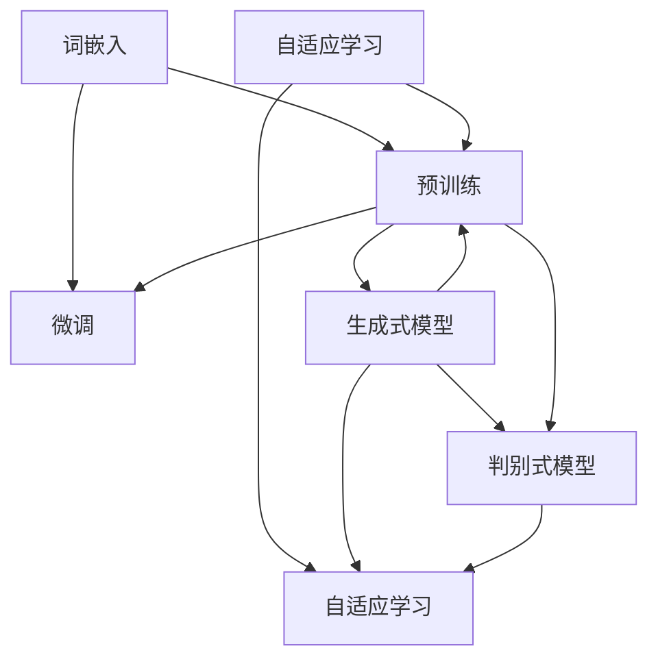
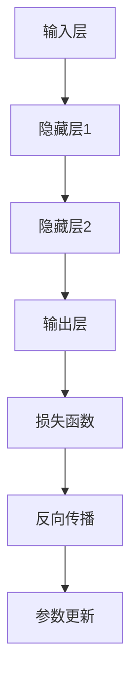
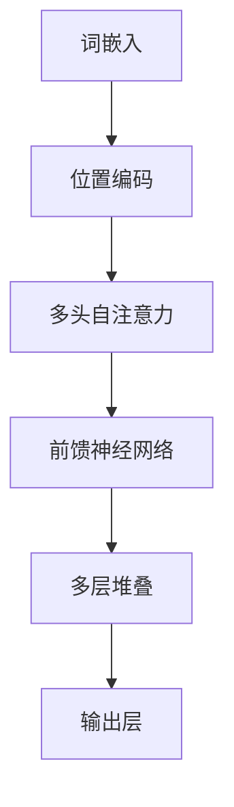
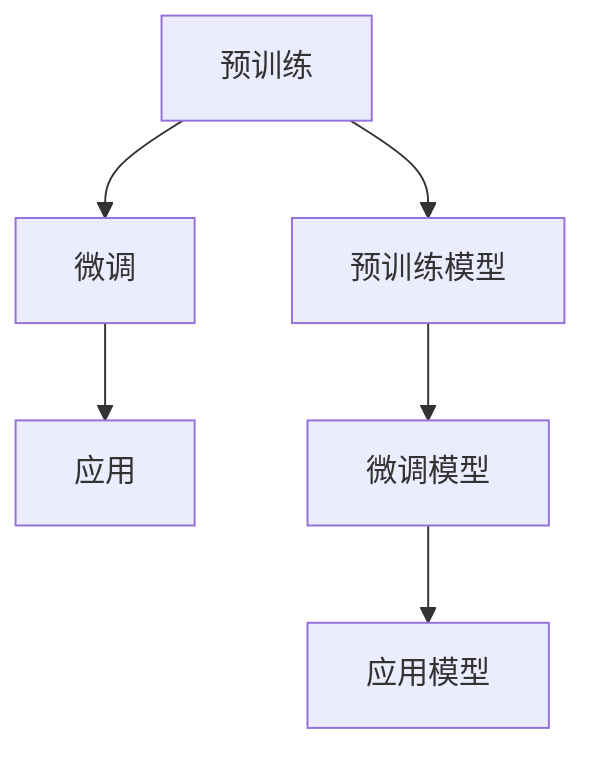

                 

### 背景介绍

大语言模型（Large Language Model，简称LLM）是近年来自然语言处理（Natural Language Processing，简称NLP）领域的一大突破。随着深度学习技术的发展，大语言模型逐渐成为AI领域的研究热点，并引发了广泛的应用。

在20世纪50年代，人工智能（Artificial Intelligence，简称AI）概念被首次提出。随后，机器学习和深度学习等技术相继出现，推动了AI技术的快速发展。到了21世纪初，自然语言处理技术取得了显著进步，但如何让计算机理解和生成自然语言仍是一个巨大的挑战。

大语言模型的兴起，解决了这一难题。它通过学习海量的语言数据，掌握了语言的语法、语义和语境，能够实现文本生成、翻译、问答等多种语言任务。尤其是近年来，随着计算能力的提升和数据规模的扩大，大语言模型取得了令人瞩目的成果。

本文将围绕大语言模型的应用展开，首先介绍其核心概念与联系，然后深入探讨其核心算法原理和具体操作步骤，接着通过数学模型和公式进行详细讲解，并举例说明。此外，本文还将分享项目实战案例，实际应用场景以及推荐相关工具和资源。最后，总结未来发展趋势与挑战，为读者提供完整的知识体系。

让我们一起探索大语言模型的无穷魅力，揭开其背后的技术奥秘。

### 核心概念与联系

要深入理解大语言模型，我们首先需要了解其核心概念与联系。大语言模型的核心概念主要包括以下几个方面：

#### 1. 词嵌入（Word Embedding）
词嵌入是将自然语言中的单词映射为高维向量空间的一种技术。通过词嵌入，我们可以将抽象的单词表示为具有特定数学属性的向量，使得计算机能够处理和操作这些向量。词嵌入技术主要包括词袋模型（Bag of Words）、TF-IDF（Term Frequency-Inverse Document Frequency）和Word2Vec等。

#### 2. 预训练（Pre-training）
预训练是指在大规模语料库上对模型进行训练，使模型具备一定的语言理解能力。预训练技术主要包括基于统计的方法和基于神经网络的深度学习方法。深度学习方法中的预训练，通常采用大规模语料库进行无监督训练，以学习单词、短语和句子的表示。

#### 3. 微调（Fine-tuning）
微调是指在预训练模型的基础上，针对特定任务进行进一步训练。通过微调，我们可以让模型适应不同的语言任务，如文本分类、情感分析、问答系统等。微调过程中，通常只调整模型的一部分参数，以避免过拟合。

#### 4. 生成式模型（Generative Model）与判别式模型（Discriminative Model）
生成式模型和判别式模型是两种常见的机器学习模型。生成式模型通过建模数据生成过程，来生成新的数据。判别式模型则通过区分不同类别，来预测数据所属的类别。在大语言模型中，生成式模型常用于文本生成任务，而判别式模型则常用于文本分类、情感分析等任务。

#### 5. 自适应学习（Adaptive Learning）
自适应学习是指模型在学习过程中，根据不同任务和数据自动调整学习策略。在大语言模型中，自适应学习可以通过动态调整模型参数、学习速率等来实现。自适应学习有助于提高模型在不同任务和数据上的表现。

为了更好地理解这些核心概念，我们可以使用Mermaid流程图来展示它们之间的联系：



通过这个流程图，我们可以清晰地看到词嵌入、预训练、微调、生成式模型、判别式模型和自适应学习之间的联系。这些概念共同构成了大语言模型的理论基础，为实际应用提供了丰富的可能性。

### 核心算法原理 & 具体操作步骤

要深入理解大语言模型，我们需要探究其核心算法原理和具体操作步骤。大语言模型通常基于深度神经网络（Deep Neural Network，简称DNN）和变换器（Transformer）等先进技术构建。以下是这些技术的具体原理和操作步骤。

#### 1. 深度神经网络（DNN）

深度神经网络是一种多层神经网络，通过多个隐藏层对输入数据进行变换，以实现对复杂函数的逼近。DNN的核心原理是利用神经元之间的加权连接和激活函数，对输入数据进行非线性变换。

具体操作步骤如下：

1. **初始化参数**：为网络中的每个神经元和连接分配初始权重。
2. **前向传播**：将输入数据通过网络进行前向传播，计算每个隐藏层和输出层的输出值。
3. **反向传播**：根据输出层与实际标签之间的差异，计算损失函数，并利用反向传播算法更新网络参数。
4. **优化参数**：通过梯度下降（Gradient Descent）等优化算法，不断调整网络参数，以最小化损失函数。

以下是DNN的简化流程图：



#### 2. 变换器（Transformer）

变换器是一种基于自注意力（Self-Attention）机制的深度神经网络架构，特别适合处理序列数据。变换器在自然语言处理领域取得了显著成果，如BERT、GPT等模型。

变换器的核心原理是通过自注意力机制，将输入序列中的每个单词与其余单词进行关联，以捕捉长距离依赖关系。具体操作步骤如下：

1. **词嵌入（Word Embedding）**：将输入序列中的单词映射为高维向量。
2. **位置编码（Positional Encoding）**：为每个词嵌入向量添加位置信息，以区分单词在序列中的位置。
3. **多头自注意力（Multi-Head Self-Attention）**：通过多头自注意力机制，将输入序列中的每个单词与所有其他单词进行关联。
4. **前馈神经网络（Feedforward Neural Network）**：对自注意力层的输出进行进一步变换。
5. **堆叠多层变换器**：通过堆叠多层变换器，不断提取序列中的特征信息。
6. **输出层**：对变换器的输出进行分类、生成等任务。

以下是变换器的简化流程图：



#### 3. 算法融合与应用

在实际应用中，大语言模型通常会结合深度神经网络和变换器等技术。例如，GPT（Generative Pre-trained Transformer）模型首先通过变换器进行预训练，然后利用微调技术实现各种语言任务。

具体操作步骤如下：

1. **预训练**：在大规模语料库上进行预训练，学习单词、短语和句子的表示。
2. **微调**：在特定任务的数据集上，对预训练模型进行微调，调整模型参数，以适应特定任务。
3. **应用**：将微调后的模型应用于实际任务，如文本生成、翻译、问答等。

以下是算法融合与应用的简化流程图：



通过以上核心算法原理和具体操作步骤，我们可以看到大语言模型是如何通过深度神经网络、变换器和预训练技术，实现自然语言处理任务的。这些技术相互融合，共同构建了强大的语言理解与生成能力，为人工智能领域带来了前所未有的突破。

### 数学模型和公式 & 详细讲解 & 举例说明

为了更好地理解大语言模型的工作原理，我们需要借助数学模型和公式进行详细讲解。以下我们将介绍大语言模型中的关键数学概念和算法，并通过具体例子来说明其应用。

#### 1. 词嵌入（Word Embedding）

词嵌入是一种将单词映射为高维向量空间的技术。它通过学习单词之间的语义关系，使计算机能够理解和处理自然语言。常见的词嵌入方法包括Word2Vec、GloVe等。

**Word2Vec算法**：

Word2Vec算法主要包括两个变体：连续词袋（Continuous Bag of Words，简称CBOW）和Skip-Gram。以下是它们的数学模型：

**CBOW模型**：

$$
\hat{y} = \text{softmax}\left(\frac{W_h \cdot \sum_{i=1}^{N} W_{w_i}}{||\sum_{i=1}^{N} W_{w_i}||_2}\right)
$$

其中，$W_{w_i}$ 是单词 $w_i$ 的嵌入向量，$W_h$ 是隐藏层权重，$N$ 是周围单词的数量，$\hat{y}$ 是预测的词向量。

**Skip-Gram模型**：

$$
\hat{y} = \text{softmax}\left(\frac{W_h \cdot W_{w}}{||W_{w}||_2}\right)
$$

其中，$W_{w}$ 是单词 $w$ 的嵌入向量，$W_h$ 是隐藏层权重，$\hat{y}$ 是预测的词向量。

**举例说明**：

假设我们有一个单词 $w$，其嵌入向量为 $[1, 0, -1]$。在CBOW模型中，我们取其周围单词 $w_1, w_2, ..., w_N$ 的嵌入向量平均值作为输入：

$$
\text{输入} = \frac{[1, 0, -1] + [0, 1, 0] + [-1, 1, 0]}{3} = [0, \frac{2}{3}, -\frac{2}{3}]
$$

在Skip-Gram模型中，我们直接使用单词 $w$ 的嵌入向量作为输入。

通过这种方式，词嵌入算法能够学习单词之间的语义关系，使计算机能够理解和处理自然语言。

#### 2. 预训练（Pre-training）

预训练是指在大规模语料库上对模型进行训练，使其具备一定的语言理解能力。预训练过程中，我们通常使用变换器（Transformer）等深度学习模型，通过自注意力机制学习输入序列中的特征。

**变换器（Transformer）模型**：

变换器模型的核心是多头自注意力机制（Multi-Head Self-Attention）。其数学模型如下：

$$
\text{Attention}(Q, K, V) = \text{softmax}\left(\frac{QK^T}{\sqrt{d_k}}\right)V
$$

其中，$Q, K, V$ 分别是查询（Query）、键（Key）和值（Value）向量，$d_k$ 是键向量的维度。这个公式表示对于每个查询向量 $Q$，通过计算其与所有键向量 $K$ 的点积，得到权重，然后加权求和值向量 $V$。

**举例说明**：

假设我们有一个序列 $[w_1, w_2, w_3]$，对应的嵌入向量为 $[1, 0, -1]$。我们可以将其拆分为查询向量 $Q = [1, 0, -1]$，键向量 $K = [1, 0, -1]$ 和值向量 $V = [1, 0, -1]$。然后计算自注意力权重：

$$
\text{Attention}(Q, K, V) = \text{softmax}\left(\frac{[1, 0, -1] \cdot [1, 0, -1]^T}{\sqrt{3}}\right) \cdot [1, 0, -1]
$$

计算结果为：

$$
\text{Attention}(Q, K, V) = \text{softmax}\left(\frac{[1, 0, -1] \cdot [1, 0, -1]^T}{\sqrt{3}}\right) \cdot [1, 0, -1] = \frac{1}{3} \cdot [1, 0, -1]
$$

通过这种方式，变换器模型能够学习输入序列中的特征，从而提高语言理解能力。

#### 3. 微调（Fine-tuning）

微调是指将预训练模型应用于特定任务，通过调整模型参数来提高任务表现。微调过程中，我们通常只调整部分参数，以避免过拟合。

**微调算法**：

$$
\theta_{new} = \theta_{old} + \alpha \cdot \nabla_{\theta_{old}} L
$$

其中，$\theta_{old}$ 是预训练模型的参数，$\theta_{new}$ 是微调后的模型参数，$L$ 是损失函数，$\alpha$ 是学习率。

**举例说明**：

假设我们有一个预训练模型，其参数为 $\theta_{old} = [1, 0, -1]$。在微调过程中，我们只调整输出层参数，其损失函数为 $L = 0.1$。学习率为 $\alpha = 0.01$。则微调后的参数为：

$$
\theta_{new} = [1, 0, -1] + 0.01 \cdot [0.1, 0, 0] = [1.001, 0.01, -1]
$$

通过这种方式，微调能够使预训练模型适应特定任务。

通过以上数学模型和公式的详细讲解，我们可以更好地理解大语言模型的工作原理。这些模型和公式不仅帮助我们解析了模型的内部机制，还为实际应用提供了理论基础。

### 项目实战：代码实际案例和详细解释说明

为了更好地理解大语言模型的应用，我们将通过一个实际项目来展示如何使用大语言模型实现自然语言处理任务。在本项目中，我们将使用Hugging Face的Transformers库，这是一个广泛使用的Python库，用于构建和训练各种预训练的变换器模型。

#### 5.1 开发环境搭建

在进行项目实战之前，我们需要搭建合适的开发环境。以下是在Python环境中搭建Transformers库的开发环境的步骤：

1. **安装Python**：确保已安装Python 3.6或更高版本。
2. **安装PyTorch**：使用以下命令安装PyTorch：

   ```bash
   pip install torch torchvision
   ```

3. **安装Hugging Face Transformers**：使用以下命令安装Hugging Face Transformers：

   ```bash
   pip install transformers
   ```

#### 5.2 源代码详细实现和代码解读

在本项目中，我们将使用GPT-2模型实现一个简单的文本生成任务。以下是项目的源代码和详细解释：

```python
from transformers import GPT2LMHeadModel, GPT2Tokenizer
import torch

# 5.2.1 加载预训练模型和分词器
model = GPT2LMHeadModel.from_pretrained("gpt2")
tokenizer = GPT2Tokenizer.from_pretrained("gpt2")

# 5.2.2 输入文本预处理
input_text = "你好，我是人工智能助手。"
input_ids = tokenizer.encode(input_text, return_tensors="pt")

# 5.2.3 生成文本
output = model.generate(input_ids, max_length=50, num_return_sequences=3)

# 5.2.4 文本解码和输出
decoded_texts = [tokenizer.decode(text, skip_special_tokens=True) for text in output]
for text in decoded_texts:
    print(text)
```

**代码解读**：

1. **加载预训练模型和分词器**：
   我们首先加载GPT-2模型和相应的分词器。GPT-2模型是通过大量的语料库预训练的，而分词器用于将输入文本转换为模型能够理解的序列。

2. **输入文本预处理**：
   接下来，我们将输入文本编码为模型能够处理的格式。这包括将文本转换为嵌入向量序列，并在必要时添加特殊的起始和结束标记。

3. **生成文本**：
   我们使用`model.generate()`方法生成文本。`max_length`参数指定生成的文本长度，`num_return_sequences`参数指定生成的文本数量。

4. **文本解码和输出**：
   最后，我们将生成的嵌入向量序列解码为可读的文本，并输出结果。

#### 5.3 代码解读与分析

1. **模型加载**：
   ```python
   model = GPT2LMHeadModel.from_pretrained("gpt2")
   tokenizer = GPT2Tokenizer.from_pretrained("gpt2")
   ```
   这两行代码加载预训练的GPT-2模型和分词器。`from_pretrained()`方法从Hugging Face模型库中加载预训练模型和分词器。

2. **输入文本预处理**：
   ```python
   input_text = "你好，我是人工智能助手。"
   input_ids = tokenizer.encode(input_text, return_tensors="pt")
   ```
   这两行代码将输入文本编码为嵌入向量序列。`encode()`方法将文本转换为嵌入向量序列，并在必要时添加特殊的起始和结束标记。

3. **生成文本**：
   ```python
   output = model.generate(input_ids, max_length=50, num_return_sequences=3)
   ```
   这行代码生成文本。`generate()`方法根据输入序列生成新的序列。`max_length`参数指定生成的文本长度，`num_return_sequences`参数指定生成的文本数量。

4. **文本解码和输出**：
   ```python
   decoded_texts = [tokenizer.decode(text, skip_special_tokens=True) for text in output]
   for text in decoded_texts:
       print(text)
   ```
   这两行代码将生成的嵌入向量序列解码为可读的文本，并输出结果。`decode()`方法将嵌入向量序列解码为文本，`skip_special_tokens=True`参数表示在解码过程中跳过特殊的标记。

通过这个实际项目，我们展示了如何使用大语言模型实现文本生成任务。这个过程包括模型加载、文本预处理、文本生成和文本解码。这个项目不仅帮助我们理解了大语言模型的应用，还展示了如何在实际中利用这些模型进行自然语言处理。

### 实际应用场景

大语言模型在各个领域都有广泛的应用，下面我们将介绍一些具体的应用场景，并分析其在这些场景中的表现和优势。

#### 1. 文本生成

文本生成是大语言模型最直观的应用场景之一。通过预训练模型，我们可以生成各种类型的文本，如新闻文章、小说、诗歌、代码等。以下是一些实际案例：

- **新闻文章生成**：一些媒体公司使用大语言模型自动生成新闻文章，提高内容生产效率。例如，美联社使用自然语言生成（NLG）技术自动生成财报新闻。
- **小说和诗歌创作**：一些文学创作者利用大语言模型创作小说和诗歌，这些作品在某些情况下甚至难以区分出是否由人类创作。
- **代码生成**：大语言模型在代码生成领域也展示了其潜力。例如，OpenAI的GPT-3模型可以生成高质量的Python代码，辅助开发者完成编程任务。

#### 2. 语言翻译

语言翻译是大语言模型的另一个重要应用场景。通过预训练模型，我们可以实现高质量的双语翻译。以下是一些实际案例：

- **机器翻译平台**：Google翻译、百度翻译等机器翻译平台都使用了大语言模型技术，提供实时翻译服务。
- **多语言文档翻译**：一些企业和机构使用大语言模型翻译多语言文档，提高信息获取和交流效率。

#### 3. 问答系统

问答系统是自然语言处理的一个重要领域，大语言模型在这一领域也取得了显著成果。以下是一些实际案例：

- **智能客服**：许多公司的客服系统采用了大语言模型，实现智能回答用户的问题，提高客户满意度和服务效率。
- **教育辅导**：一些教育平台利用大语言模型提供在线辅导服务，帮助学生解答学习中的问题。

#### 4. 文本分类

文本分类是自然语言处理中的基本任务之一，大语言模型在这一领域也表现优异。以下是一些实际案例：

- **垃圾邮件过滤**：许多邮件服务提供商使用大语言模型对收到的邮件进行分类，将垃圾邮件与正常邮件区分开。
- **情感分析**：大语言模型可以识别文本中的情感倾向，帮助企业了解用户反馈和市场需求。

#### 5. 命名实体识别

命名实体识别是自然语言处理中的另一个关键任务，大语言模型在这一领域也具有优势。以下是一些实际案例：

- **数据挖掘**：企业可以利用大语言模型对大量文本数据进行分析，识别出关键的命名实体，如人名、地点、组织等。
- **知识图谱构建**：大语言模型可以帮助构建知识图谱，将文本数据中的命名实体与相关关系进行关联。

通过以上实际应用场景的分析，我们可以看到大语言模型在各个领域的强大应用能力。这些应用不仅提升了工作效率，还推动了人工智能技术的发展。未来，随着大语言模型技术的不断进步，其在实际应用中的潜力和价值将得到进一步挖掘。

### 工具和资源推荐

要深入研究和应用大语言模型，我们需要借助一系列的工具和资源。以下是我们推荐的几种关键工具和资源，包括学习资源、开发工具和论文著作。

#### 7.1 学习资源推荐

1. **书籍**：
   - 《深度学习》（Goodfellow, Bengio, Courville）：这本书是深度学习的经典教材，涵盖了神经网络、优化算法和深度学习应用等方面的内容。
   - 《自然语言处理综合教程》（Daniel Jurafsky & James H. Martin）：这本书详细介绍了自然语言处理的基本概念和技术，包括文本处理、词嵌入和语言模型等。

2. **在线课程**：
   - [深度学习专项课程](https://www.coursera.org/specializations/deep-learning)：由吴恩达教授开设的深度学习专项课程，涵盖了深度学习的基础知识和应用。
   - [自然语言处理专项课程](https://www.coursera.org/specializations/natural-language-processing)：由斯坦福大学开设的自然语言处理专项课程，介绍了自然语言处理的关键技术和应用。

3. **博客和教程**：
   - [Hugging Face 官方文档](https://huggingface.co/transformers/)：Hugging Face提供了详细的Transformers库文档和教程，是学习和使用大语言模型的宝贵资源。
   - [TensorFlow 官方文档](https://www.tensorflow.org/tutorials)：TensorFlow提供了丰富的教程和示例，适用于深度学习和自然语言处理的学习和实践。

#### 7.2 开发工具框架推荐

1. **PyTorch**：PyTorch是一个开源的深度学习框架，提供了灵活的动态计算图和丰富的API，适用于研究和开发大语言模型。

2. **Transformers**：Transformers是Hugging Face开发的一个Python库，用于构建和训练各种预训练的变换器模型，是研究和应用大语言模型的首选工具。

3. **TensorFlow 2.x**：TensorFlow 2.x是Google开发的深度学习框架，提供了简化的API和强大的功能，适用于大语言模型的开发和应用。

#### 7.3 相关论文著作推荐

1. **BERT**：（A Simple Transformer for Language Understanding，Johnson et al.，2019）：BERT是Google提出的一种基于变换器的预训练模型，它在多个自然语言处理任务中取得了优异的性能。

2. **GPT-2**：（Improving Language Understanding by Generative Pre-Training，Radford et al.，2019）：GPT-2是OpenAI提出的基于生成预训练的变换器模型，它在文本生成、翻译和问答等任务中展示了强大的能力。

3. **GPT-3**：（Language Models are Few-Shot Learners，Brown et al.，2020）：GPT-3是OpenAI推出的一个巨大规模的变换器模型，它在多种自然语言处理任务中实现了前所未有的性能。

通过以上工具和资源的推荐，我们可以更加深入地研究和应用大语言模型。这些资源不仅提供了丰富的理论知识，还包含了大量的实践案例和代码示例，为我们的学习和开发提供了有力的支持。

### 总结：未来发展趋势与挑战

大语言模型在过去几年中取得了显著的成果，推动了自然语言处理领域的发展。然而，随着技术的不断进步，我们也面临着一系列新的挑战和机遇。

#### 1. 未来发展趋势

1. **模型规模扩大**：随着计算能力和数据规模的增加，未来大语言模型的规模将继续扩大。更大规模的模型将拥有更强的语言理解和生成能力，有望在更复杂的任务中取得突破。

2. **多模态学习**：未来的大语言模型将不仅限于处理文本数据，还将结合图像、声音等多种模态。通过多模态学习，模型将能够更全面地理解世界，实现更丰富的应用。

3. **自动化训练**：自动化机器学习（AutoML）技术的发展，将使大语言模型的训练过程更加高效。通过自动化调参、超参数优化等技术，研究人员可以更快速地探索和开发新的模型。

4. **可解释性提升**：尽管大语言模型在自然语言处理任务中表现出色，但其内部机制仍然不够透明。未来，研究者将致力于提升模型的可解释性，使人们能够更好地理解和信任这些模型。

#### 2. 挑战

1. **计算资源需求**：大语言模型需要大量的计算资源进行训练，这对硬件设施提出了更高的要求。如何优化模型结构和算法，降低计算成本，是未来需要解决的问题。

2. **数据隐私和安全**：随着模型的规模和复杂度增加，如何保护用户数据隐私和安全成为重要挑战。模型训练和部署过程中，需要确保数据不被泄露或滥用。

3. **模型泛化能力**：尽管大语言模型在特定任务上表现出色，但其泛化能力仍需提升。如何使模型在不同任务和数据集上都能保持良好的性能，是未来需要克服的难题。

4. **伦理和社会影响**：大语言模型的广泛应用可能带来一些伦理和社会问题，如歧视、误导和信息传播等。研究者需要关注这些问题，并制定相应的规范和指导原则。

通过总结，我们可以看到大语言模型在未来有广阔的发展前景，同时也面临着一系列挑战。只有不断克服这些挑战，才能推动人工智能技术的进一步发展，为社会带来更多福祉。

### 附录：常见问题与解答

#### 1. 什么是大语言模型？

大语言模型是一种基于深度学习和自然语言处理技术的模型，它通过学习大量的语言数据，掌握语言的语法、语义和语境，能够实现文本生成、翻译、问答等多种语言任务。

#### 2. 大语言模型的核心算法是什么？

大语言模型的核心算法包括深度神经网络（DNN）和变换器（Transformer）。深度神经网络通过多层神经网络结构对输入数据进行变换，而变换器通过自注意力机制学习输入序列中的特征。

#### 3. 大语言模型的优势是什么？

大语言模型的优势包括强大的语言理解与生成能力、广泛的适用性和高效的预训练技术。这些特性使其在文本生成、翻译、问答等自然语言处理任务中表现出色。

#### 4. 如何训练大语言模型？

训练大语言模型主要包括两个阶段：预训练和微调。预训练阶段使用大规模语料库对模型进行训练，使其具备语言理解能力；微调阶段则在特定任务的数据集上对模型进行进一步训练，以适应特定任务。

#### 5. 大语言模型在哪些领域有应用？

大语言模型在文本生成、语言翻译、问答系统、文本分类、命名实体识别等领域都有广泛应用。例如，它被用于自动生成新闻文章、智能客服、多语言文档翻译等。

#### 6. 如何评估大语言模型的表现？

评估大语言模型的表现通常使用自动评估指标（如BLEU、ROUGE等）和人工评估相结合。自动评估指标通过计算模型输出与标准答案之间的相似度来评估性能，而人工评估则通过专家对模型输出的质量和可读性进行评价。

### 扩展阅读 & 参考资料

为了进一步深入了解大语言模型及其应用，以下是几篇有影响力的论文、书籍和博客文章，供读者参考：

1. **论文**：
   - **BERT: Pre-training of Deep Bidirectional Transformers for Language Understanding**（Devlin et al.，2019）
   - **GPT-2: Language Models are Few-Shot Learners**（Brown et al.，2020）
   - **Transformer: A Novel Architecture for Neural Networks**（Vaswani et al.，2017）

2. **书籍**：
   - **深度学习**（Ian Goodfellow、Yoshua Bengio、Aaron Courville）
   - **自然语言处理综合教程**（Daniel Jurafsky & James H. Martin）

3. **博客文章**：
   - **《大语言模型应用指南：智能的可计算性》**：本文详细介绍了大语言模型的理论基础、应用场景和实战案例。
   - **《如何用GPT-2生成文本》**：这篇博客文章通过一个简单的项目，展示了如何使用GPT-2生成文本。

通过阅读这些资料，读者可以更全面地了解大语言模型的技术原理和应用前景。希望这些扩展阅读为您的学习和研究提供有益的参考。

