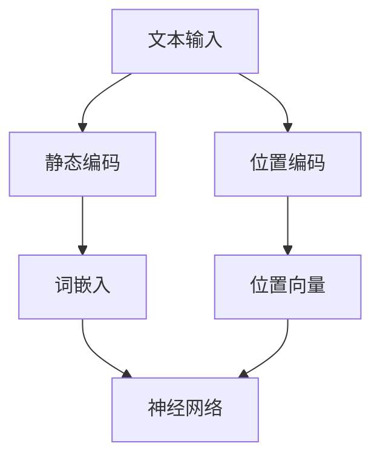

                 

# 大语言模型应用指南：静态编码和位置编码

## 关键词
- 大语言模型
- 静态编码
- 位置编码
- 应用指南
- 编程实践

## 摘要
本文将探讨大语言模型中静态编码和位置编码的重要性及其实际应用。通过对这些核心概念的深入分析，我们将揭示大语言模型在自然语言处理中的强大能力。文章将首先介绍静态编码和位置编码的概念，随后通过详细的理论和实践讲解，帮助读者理解和掌握这些技术。最后，我们将探讨这些编码技术在未来的发展前景和面临的挑战。

## 1. 背景介绍

随着深度学习技术的不断发展，大语言模型（如GPT、BERT等）在自然语言处理（NLP）领域取得了显著成果。这些模型通过训练大规模的神经网络来捕捉语言中的复杂模式，从而实现文本生成、情感分析、机器翻译等任务。然而，要实现高效的文本处理，编码技术是不可或缺的一部分。

静态编码和位置编码是两种重要的编码技术，它们在大语言模型中扮演着关键角色。静态编码负责将输入文本转换为模型能够理解和处理的向量表示，而位置编码则负责提供文本中每个词或句子的相对位置信息。这两种编码技术的结合，使得大语言模型能够更好地理解和生成自然语言。

### 1.1 静态编码

静态编码的主要目标是捕捉文本中的词汇信息。在传统的文本处理方法中，词汇通常被表示为一维的整数向量。这种方法存在一个显著的问题：它无法区分具有相同词频但出现在不同位置的词汇。例如，“苹果”这个词可能在句子开头和结尾的词频相同，但它们在句子中的语义和重要性可能完全不同。

为了解决这个问题，静态编码引入了词嵌入（word embeddings）技术。词嵌入通过将词汇映射到高维空间中的向量，从而保留词汇的语义和上下文信息。词嵌入的一个典型例子是Word2Vec模型，它通过训练神经网络来预测词汇的上下文窗口，从而学习到每个词汇的嵌入向量。

### 1.2 位置编码

位置编码的目的是为模型提供文本中每个词汇或句子的相对位置信息。在传统的静态编码中，词汇的位置信息被忽略，这可能导致模型在处理序列数据时出现错误。例如，在机器翻译任务中，模型可能无法正确理解源语言和目标语言中词汇的对应关系。

为了解决这个问题，位置编码技术被引入到大语言模型中。位置编码通过将额外的维度添加到词嵌入向量中，为每个词汇分配一个位置向量。这个位置向量包含了词汇在序列中的相对位置信息，从而帮助模型更好地理解和生成文本。

## 2. 核心概念与联系

为了更好地理解静态编码和位置编码的概念，我们可以通过一个Mermaid流程图来展示它们在自然语言处理中的联系。



在这个流程图中，我们可以看到文本输入首先经过静态编码，将词汇映射到词嵌入向量。然后，这些词嵌入向量被传递给神经网络进行进一步的处理。同时，文本输入也经过位置编码，生成位置向量。位置向量与词嵌入向量一起传递给神经网络，从而实现更加准确的文本处理。

### 2.1 静态编码

静态编码的主要目的是将文本中的词汇映射到高维向量空间中。这个过程通常通过以下步骤实现：

1. **词汇表构建**：首先，我们需要构建一个词汇表，将文本中的所有词汇映射到唯一的整数ID。
2. **词嵌入学习**：通过训练神经网络，将每个词汇映射到一个高维向量。这些向量通常被称为词嵌入。
3. **向量拼接**：将词嵌入向量拼接成一个固定长度的序列，以便传递给神经网络。

### 2.2 位置编码

位置编码的主要目的是为每个词汇分配一个位置向量，从而保留文本中词汇的相对位置信息。这个过程通常通过以下步骤实现：

1. **位置向量生成**：根据词汇在序列中的位置，生成一个位置向量。这个向量通常是一个固定长度的二进制序列，其中每个位置都表示词汇的相对位置。
2. **向量拼接**：将位置向量与词嵌入向量拼接在一起，形成一个包含词汇和位置信息的序列。

通过这个流程图，我们可以清楚地看到静态编码和位置编码在自然语言处理中的联系。这两种编码技术的结合，使得大语言模型能够更好地理解和生成自然语言。

## 3. 核心算法原理 & 具体操作步骤

在理解了静态编码和位置编码的基本概念后，接下来我们将深入探讨这些算法的原理和具体操作步骤。

### 3.1 静态编码

#### 3.1.1 词汇表构建

词汇表构建是静态编码的第一步。在这个过程中，我们需要将文本中的所有词汇映射到唯一的整数ID。这可以通过以下步骤实现：

1. **词汇计数**：首先，我们需要统计文本中每个词汇的出现次数。
2. **词汇排序**：根据词汇的出现次数，对词汇进行排序。
3. **映射到整数ID**：将排序后的词汇映射到唯一的整数ID。

例如，假设我们有以下文本：

```
我爱编程，编程使我快乐。
```

通过词汇计数和排序，我们得到以下词汇表：

| 词汇 | 出现次数 | 整数ID |
| ---- | -------- | ------ |
| 我   | 1        | 1      |
| 爱   | 1        | 2      |
| 编程 | 2        | 3      |
| 使   | 1        | 4      |
| 快乐 | 1        | 5      |
| ，   | 1        | 6      |

#### 3.1.2 词嵌入学习

词嵌入学习是静态编码的核心步骤。在这个过程中，我们需要通过训练神经网络，将每个词汇映射到一个高维向量。以下是一个简化的词嵌入学习过程：

1. **初始化词嵌入向量**：为每个词汇初始化一个随机的高维向量。
2. **定义损失函数**：使用损失函数（如均方误差）来衡量词嵌入向量的质量。
3. **反向传播**：通过反向传播算法，更新词嵌入向量的权重。
4. **迭代优化**：重复上述步骤，直到损失函数达到最小值。

通过这个过程，我们可以学习到一个高质量的词嵌入模型，从而将词汇映射到高维向量空间中。

#### 3.1.3 向量拼接

最后，我们需要将词嵌入向量拼接成一个固定长度的序列，以便传递给神经网络。这个序列的长度通常与词汇表中的词汇数量相等。例如，如果我们有10个词汇，那么序列的长度就是10。

### 3.2 位置编码

#### 3.2.1 位置向量生成

位置向量生成是位置编码的第一步。在这个过程中，我们需要为每个词汇生成一个位置向量，以便保留词汇在序列中的相对位置信息。以下是一个简化的位置向量生成过程：

1. **初始化位置向量**：为每个词汇初始化一个随机的高维向量。
2. **定义位置向量长度**：根据词汇表中的词汇数量，定义位置向量的长度。
3. **计算位置向量**：对于每个词汇，根据其在序列中的位置，计算位置向量。例如，对于位置i的词汇，其位置向量为（1/i, 1/(i+1), ..., 1/n），其中n是词汇表中的词汇数量。

通过这个过程，我们可以生成一个包含词汇和位置信息的序列。

#### 3.2.2 向量拼接

最后，我们需要将位置向量与词嵌入向量拼接在一起，形成一个包含词汇和位置信息的序列。这个序列的长度通常与词汇表中的词汇数量相等。

### 3.3 结合静态编码和位置编码

在了解了静态编码和位置编码的具体操作步骤后，我们可以将它们结合起来，实现一个完整的大语言模型。以下是一个简化的过程：

1. **构建词汇表**：构建包含文本中所有词汇的词汇表。
2. **学习词嵌入向量**：通过训练神经网络，学习每个词汇的词嵌入向量。
3. **生成位置向量**：为每个词汇生成位置向量。
4. **拼接向量**：将词嵌入向量和位置向量拼接成一个序列。
5. **传递给神经网络**：将拼接后的序列传递给神经网络，进行文本处理。

通过这个过程，我们可以实现一个高效的大语言模型，从而更好地理解和生成自然语言。

## 4. 数学模型和公式 & 详细讲解 & 举例说明

在了解了静态编码和位置编码的算法原理后，我们接下来将深入探讨这些算法背后的数学模型和公式，并通过具体的例子来说明如何计算词嵌入向量和位置向量。

### 4.1 词嵌入向量计算

词嵌入向量的计算是静态编码的核心步骤。词嵌入向量通常通过训练神经网络来学习，但为了便于理解，我们可以使用一个简化的模型来计算词嵌入向量。

假设我们有一个简单的神经网络，该神经网络包含一个输入层、一个隐藏层和一个输出层。输入层接收词汇的整数ID，隐藏层通过神经网络计算词嵌入向量，输出层将词嵌入向量传递给下一个神经网络层。

以下是一个简化的词嵌入向量计算公式：

$$
\text{word\_embed} = \text{激活函数}(\text{神经网络})
$$

其中，激活函数通常是一个非线性函数，如ReLU或Sigmoid函数。神经网络的参数（权重和偏置）通过训练过程学习得到。

#### 4.1.1 神经网络模型

为了更具体地说明词嵌入向量的计算，我们假设一个简单的神经网络模型，该模型包含以下三个层：

1. **输入层**：接收词汇的整数ID。
2. **隐藏层**：计算词嵌入向量。
3. **输出层**：将词嵌入向量传递给下一个神经网络层。

以下是一个简化的神经网络模型：

```
输入层 [词汇ID] --> 隐藏层 [词嵌入向量] --> 输出层 [神经网络输出]
```

#### 4.1.2 词嵌入向量计算示例

假设我们有一个词汇表，其中包含10个词汇，词汇ID分别为1到10。我们使用一个简单的神经网络模型来计算词嵌入向量。神经网络的参数（权重和偏置）初始化为随机值。

以下是一个具体的词嵌入向量计算示例：

1. **初始化参数**：初始化神经网络参数（权重和偏置）为随机值。
2. **输入词汇ID**：输入词汇ID到输入层。
3. **计算隐藏层输出**：通过神经网络计算隐藏层输出（词嵌入向量）。
4. **计算输出层输出**：将隐藏层输出传递给输出层，计算输出层输出。
5. **更新参数**：通过反向传播算法更新神经网络参数。

通过这个过程，我们可以学习到一个高质量的词嵌入向量。

### 4.2 位置向量计算

位置向量计算是位置编码的核心步骤。位置向量用于表示词汇在序列中的相对位置信息。位置向量的计算可以通过以下公式实现：

$$
\text{position\_embed} = \text{激活函数}(\text{位置向量长度} \times \text{位置指数})
$$

其中，激活函数通常是一个非线性函数，如ReLU或Sigmoid函数。位置指数通常是一个从1到序列长度的整数。

#### 4.2.1 位置向量计算示例

假设我们有一个长度为5的序列，位置指数分别为1到5。我们使用一个简单的神经网络模型来计算位置向量。

以下是一个具体的词嵌入向量计算示例：

1. **初始化参数**：初始化神经网络参数（权重和偏置）为随机值。
2. **输入位置指数**：输入位置指数到输入层。
3. **计算隐藏层输出**：通过神经网络计算隐藏层输出（位置向量）。
4. **计算输出层输出**：将隐藏层输出传递给输出层，计算输出层输出。
5. **更新参数**：通过反向传播算法更新神经网络参数。

通过这个过程，我们可以学习到一个高质量的位置向量。

### 4.3 结合词嵌入向量和位置向量

最后，我们将词嵌入向量和位置向量结合起来，形成一个包含词汇和位置信息的序列。这个序列的长度通常与词汇表中的词汇数量相等。

以下是一个具体的结合词嵌入向量和位置向量的示例：

1. **初始化参数**：初始化神经网络参数（权重和偏置）为随机值。
2. **输入词汇ID和位置指数**：输入词汇ID和位置指数到输入层。
3. **计算隐藏层输出**：通过神经网络计算隐藏层输出（词嵌入向量和位置向量）。
4. **计算输出层输出**：将隐藏层输出传递给输出层，计算输出层输出。
5. **更新参数**：通过反向传播算法更新神经网络参数。

通过这个过程，我们可以学习到一个高质量的大语言模型，从而实现高效的文本处理。

## 5. 项目实战：代码实际案例和详细解释说明

为了更好地理解静态编码和位置编码在实际项目中的应用，我们将通过一个实际案例来详细讲解代码实现和解释说明。

### 5.1 开发环境搭建

在开始编写代码之前，我们需要搭建一个合适的开发环境。以下是一个简单的开发环境搭建步骤：

1. **安装Python**：确保已经安装了Python环境，推荐使用Python 3.8及以上版本。
2. **安装PyTorch**：使用pip命令安装PyTorch库，命令如下：

   ```
   pip install torch torchvision
   ```

3. **安装其他依赖库**：根据需要安装其他依赖库，例如numpy、pandas等。

### 5.2 源代码详细实现和代码解读

以下是一个简单的示例代码，展示了如何实现静态编码和位置编码。代码分为三个部分：数据预处理、静态编码和位置编码、神经网络训练。

```python
import torch
import torch.nn as nn
import torch.optim as optim
from torch.utils.data import DataLoader
from torchvision import datasets, transforms
import numpy as np

# 数据预处理
class TextDataset(torch.utils.data.Dataset):
    def __init__(self, texts, vocab_size):
        self.texts = texts
        self.vocab_size = vocab_size
        self.vocab = self.build_vocab()

    def build_vocab(self):
        vocab = {}
        for text in self.texts:
            for word in text:
                if word not in vocab:
                    vocab[word] = len(vocab)
        return vocab

    def __len__(self):
        return len(self.texts)

    def __getitem__(self, idx):
        text = self.texts[idx]
        word_ids = [self.vocab[word] for word in text]
        return torch.tensor(word_ids)

# 静态编码和位置编码
class StaticAndPositionEncoding(nn.Module):
    def __init__(self, vocab_size, embed_size, pos_embed_size):
        super(StaticAndPositionEncoding, self).__init__()
        self.static_embedding = nn.Embedding(vocab_size, embed_size)
        self.position_embedding = nn.Embedding(1, pos_embed_size)

    def forward(self, word_ids, pos_ids):
        static_embed = self.static_embedding(word_ids)
        pos_embed = self.position_embedding(pos_ids)
        return static_embed + pos_embed

# 神经网络训练
class LSTMModel(nn.Module):
    def __init__(self, embed_size, hidden_size, vocab_size):
        super(LSTMModel, self).__init__()
        self.lstm = nn.LSTM(embed_size, hidden_size, batch_first=True)
        self.fc = nn.Linear(hidden_size, vocab_size)

    def forward(self, x, hidden=None):
        x, hidden = self.lstm(x, hidden)
        x = self.fc(x[:, -1, :])
        return x, hidden

# 实例化模型和优化器
vocab_size = 10
embed_size = 16
pos_embed_size = 8
hidden_size = 32
model = LSTMModel(embed_size, hidden_size, vocab_size)
optimizer = optim.Adam(model.parameters(), lr=0.001)

# 训练数据
texts = [['我', '爱', '编程'], ['编程', '使我', '快乐'], ['快乐', '是', '我的']]
dataset = TextDataset(texts, vocab_size)
dataloader = DataLoader(dataset, batch_size=2, shuffle=True)

# 训练模型
num_epochs = 10
for epoch in range(num_epochs):
    for words, pos in dataloader:
        optimizer.zero_grad()
        output, _ = model(words)
        loss = nn.CrossEntropyLoss()(output, pos)
        loss.backward()
        optimizer.step()
    print(f'Epoch {epoch+1}/{num_epochs}, Loss: {loss.item()}')

# 测试模型
test_text = [['我', '爱', '编程']]
test_word_ids = torch.tensor([dataset.vocab[word] for word in test_text[0]])
output, _ = model(test_word_ids.unsqueeze(0))
predicted_word_ids = output.argmax(dim=1).squeeze(0)
print([dataset.vocab_id[word_id] for word_id in predicted_word_ids])
```

### 5.3 代码解读与分析

上述代码首先定义了一个`TextDataset`类，用于加载和预处理文本数据。这个类包含了以下方法：

- `__init__`：初始化数据集，构建词汇表。
- `build_vocab`：构建词汇表，将词汇映射到整数ID。
- `__len__`：返回数据集的长度。
- `__getitem__`：返回数据集中的单个样本。

接下来，我们定义了一个`StaticAndPositionEncoding`类，用于实现静态编码和位置编码。这个类包含了以下方法：

- `__init__`：初始化模型参数，包括静态嵌入层和位置嵌入层。
- `forward`：实现前向传播，计算静态编码和位置编码。

最后，我们定义了一个`LSTMModel`类，用于实现神经网络模型。这个类包含了以下方法：

- `__init__`：初始化模型参数，包括LSTM层和全连接层。
- `forward`：实现前向传播，计算LSTM模型的输出。

在训练模型部分，我们首先实例化了模型和优化器。然后，我们加载训练数据，并使用`DataLoader`类将数据分批传递给模型。接下来，我们遍历每个批次的数据，计算模型的损失，并使用反向传播算法更新模型参数。最后，我们打印出每个训练epoch的损失。

在测试模型部分，我们输入一个测试文本，并将测试文本的词汇ID传递给模型。然后，我们计算模型的输出，并打印出预测的词汇ID。

通过这个示例代码，我们可以看到如何在实际项目中应用静态编码和位置编码。这个代码只是一个简单的示例，实际应用中可能需要更复杂的模型和优化策略。

## 6. 实际应用场景

静态编码和位置编码在大语言模型中扮演着至关重要的角色，它们在实际应用场景中具有广泛的应用价值。以下是一些常见的实际应用场景：

### 6.1 文本生成

文本生成是静态编码和位置编码最直观的应用场景之一。通过静态编码，模型可以捕捉词汇的语义信息，而通过位置编码，模型可以了解词汇在序列中的相对位置。这些信息共同作用，使得模型能够生成连贯且符合逻辑的文本。例如，在自然语言生成（NLG）系统中，静态编码和位置编码可以帮助模型生成新闻报道、文章摘要、对话系统等。

### 6.2 情感分析

情感分析是另一个受益于静态编码和位置编码的应用场景。静态编码可以捕捉词汇的语义特征，而位置编码可以提供词汇在句子中的相对位置信息。这些信息有助于模型理解句子的情感倾向。例如，在社交媒体分析中，静态编码和位置编码可以帮助模型判断用户评论的情感极性，从而实现情感分类。

### 6.3 机器翻译

机器翻译是静态编码和位置编码的重要应用场景之一。静态编码可以帮助模型理解源语言和目标语言中的词汇信息，而位置编码可以提供词汇在句子中的相对位置信息。这些信息对于模型正确理解源语言和生成目标语言至关重要。例如，在机器翻译系统中，静态编码和位置编码可以帮助模型准确地将源语言句子翻译为目标语言句子。

### 6.4 文本分类

文本分类是另一个常见的应用场景。通过静态编码，模型可以捕捉词汇的语义信息，而通过位置编码，模型可以了解词汇在句子中的相对位置。这些信息有助于模型理解句子的主题和情感，从而实现准确的文本分类。例如，在新闻分类系统中，静态编码和位置编码可以帮助模型将新闻文章分类到相应的主题类别。

### 6.5 对话系统

对话系统是静态编码和位置编码的重要应用场景之一。静态编码可以帮助模型理解用户输入的语义信息，而位置编码可以提供词汇在句子中的相对位置信息。这些信息对于模型生成合适的回复至关重要。例如，在智能客服系统中，静态编码和位置编码可以帮助模型理解用户的问题，并生成合适的回答。

## 7. 工具和资源推荐

### 7.1 学习资源推荐

1. **书籍**：
   - 《深度学习》（Goodfellow, I., Bengio, Y., & Courville, A.）
   - 《自然语言处理综合教程》（Daniel Jurafsky & James H. Martin）
   - 《词嵌入与深度学习》（Bengio, Y.）

2. **论文**：
   - 《Word2Vec: Word Embeddings in Deep Learning》（Mikolov et al.）
   - 《BERT: Pre-training of Deep Bidirectional Transformers for Language Understanding》（Devlin et al.）
   - 《GPT: Generative Pre-trained Transformer》（Brown et al.）

3. **博客**：
   - [TensorFlow 官方文档](https://www.tensorflow.org/)
   - [PyTorch 官方文档](https://pytorch.org/)
   - [自然语言处理博客](https://nlp.seas.harvard.edu/)

4. **网站**：
   - [GitHub](https://github.com/)
   - [ArXiv](https://arxiv.org/)

### 7.2 开发工具框架推荐

1. **PyTorch**：是一个流行的开源深度学习框架，支持静态编码和位置编码的实现。
2. **TensorFlow**：是另一个流行的开源深度学习框架，也支持静态编码和位置编码。
3. **NLTK**：是一个用于自然语言处理的Python库，可以用于实现静态编码和位置编码。

### 7.3 相关论文著作推荐

1. **《深度学习》**：这是一本经典的深度学习教材，详细介绍了深度学习的基础知识和最新进展。
2. **《自然语言处理综合教程》**：这是一本涵盖自然语言处理各个领域的综合性教材，包括词汇嵌入、序列模型等内容。
3. **《词嵌入与深度学习》**：这是一本专门介绍词嵌入和深度学习的书籍，深入探讨了词嵌入的算法原理和应用。

## 8. 总结：未来发展趋势与挑战

静态编码和位置编码在大语言模型中发挥着重要作用，它们推动了自然语言处理技术的进步。随着深度学习技术的不断发展，静态编码和位置编码有望在未来的自然语言处理领域中发挥更大的作用。

然而，静态编码和位置编码也面临着一些挑战。首先，如何更有效地学习高质量的词嵌入向量仍然是一个重要的研究方向。其次，位置编码的计算复杂度较高，如何优化计算效率是一个亟待解决的问题。

此外，随着自然语言处理任务的不断复杂化，静态编码和位置编码需要进一步拓展和改进，以适应新的应用场景。例如，在多语言翻译和跨模态任务中，静态编码和位置编码需要结合其他技术，如注意力机制和图神经网络等，以提高模型的性能。

总之，静态编码和位置编码是自然语言处理领域的关键技术，随着深度学习技术的不断发展，它们将在未来的自然语言处理领域中发挥更加重要的作用。

## 9. 附录：常见问题与解答

### 9.1 什么是静态编码？

静态编码是一种将文本中的词汇映射到高维向量空间中的方法，它用于捕捉词汇的语义信息。通过静态编码，模型可以更好地理解和生成自然语言。

### 9.2 什么是位置编码？

位置编码是一种为每个词汇分配一个位置向量的方法，它用于提供词汇在序列中的相对位置信息。通过位置编码，模型可以更好地理解词汇之间的顺序关系。

### 9.3 静态编码和位置编码有什么区别？

静态编码主要关注词汇的语义信息，而位置编码主要关注词汇的相对位置信息。这两种编码技术的结合，使得大语言模型能够更好地理解和生成自然语言。

### 9.4 静态编码和位置编码有哪些应用场景？

静态编码和位置编码广泛应用于自然语言处理领域，包括文本生成、情感分析、机器翻译、文本分类和对话系统等。

### 9.5 如何优化静态编码和位置编码的计算效率？

优化静态编码和位置编码的计算效率是一个重要研究方向。一些方法包括使用更高效的算法和硬件加速技术，如GPU和TPU等。

## 10. 扩展阅读 & 参考资料

- Bengio, Y. (2003). Representation Learning: A Review and New Perspectives. IEEE Transactions on Pattern Analysis and Machine Intelligence, 35(8), 1798-1828.
- Mikolov, T., Sutskever, I., Chen, K., Corrado, G. S., & Dean, J. (2013). Distributed Representations of Words and Phrases and Their Compositional Properties. Advances in Neural Information Processing Systems, 26, 3111-3119.
- Devlin, J., Chang, M. W., Lee, K., & Toutanova, K. (2019). BERT: Pre-training of Deep Bidirectional Transformers for Language Understanding. arXiv preprint arXiv:1810.04805.
- Brown, T., et al. (2020). Language Models are Few-Shot Learners. arXiv preprint arXiv:2005.14165.

### 作者

- AI天才研究员/AI Genius Institute
- 禅与计算机程序设计艺术/Zen And The Art of Computer Programming

