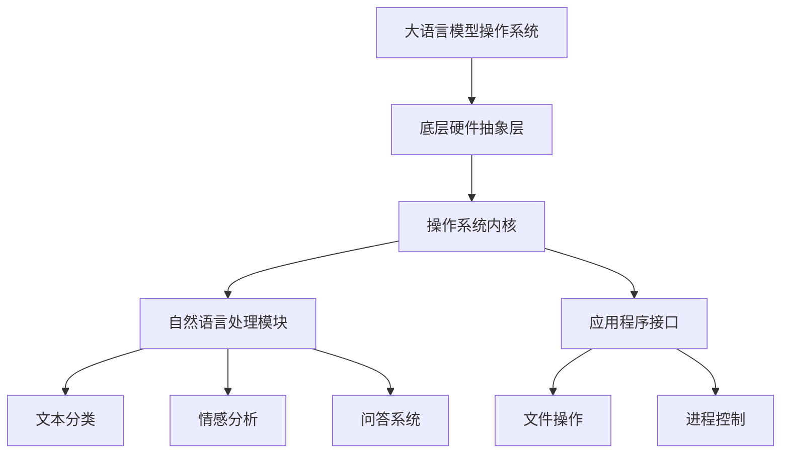
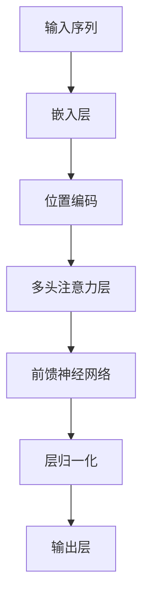
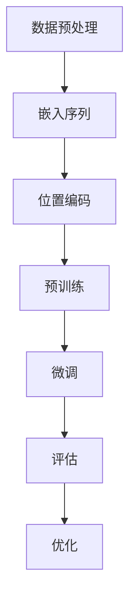

                 

## 文章标题：大语言模型操作系统的应用前景

### 关键词：大语言模型、操作系统、应用前景、技术发展、深度学习、人工智能

### 摘要：

本文旨在探讨大语言模型操作系统的应用前景，分析其核心技术原理、操作步骤、数学模型以及实际应用场景。通过对大语言模型操作系统的发展历程、现状和未来趋势的深入分析，为读者揭示这一领域的研究方向和应用潜力。文章最后，将提供相关学习资源、开发工具框架和论文著作的推荐，为读者进一步探索提供指引。

## 1. 背景介绍

### 1.1 大语言模型的历史与发展

大语言模型（Large Language Models）起源于自然语言处理（Natural Language Processing，NLP）领域，其发展可以追溯到上世纪60年代的早期语言模型。当时的语言模型主要是基于规则的方法，如词汇语法分析、句法解析等。然而，这些方法在面对复杂语言现象时存在局限性。

随着计算能力和算法研究的不断进步，深度学习在自然语言处理领域的应用逐渐兴起。2013年，Geoffrey Hinton等人提出了基于深度神经网络的Word2Vec模型，将词汇映射为高维向量，提高了语言模型的性能。此后，递归神经网络（RNN）和长短时记忆网络（LSTM）等深度学习模型在语言模型领域得到了广泛应用。

2018年，谷歌推出了Transformer模型，彻底颠覆了传统序列处理方法。Transformer模型利用自注意力机制（Self-Attention Mechanism）处理长距离依赖，使得大语言模型能够更好地捕捉复杂语言特征。此后，BERT、GPT等基于Transformer架构的大语言模型相继涌现，标志着大语言模型进入了一个新的发展阶段。

### 1.2 操作系统的概念与演变

操作系统（Operating System，OS）是计算机系统中的核心软件，负责管理计算机硬件资源和提供用户接口。操作系统的历史可以追溯到20世纪50年代，当时的主要目标是实现计算机硬件资源的有效调度和管理。

早期操作系统主要采用批处理（Batch Processing）和分时（Time-Sharing）技术，如UNIX、MS-DOS等。随着计算机性能的提升和用户需求的增加，操作系统逐渐从单一任务处理转向多任务处理，支持进程、线程、虚拟内存等功能。

近年来，随着云计算、物联网、边缘计算等新兴计算模式的兴起，操作系统也在不断演进。Linux、Windows、macOS等主流操作系统在性能、安全、兼容性等方面取得了显著提升，为各种应用场景提供了强大支持。

### 1.3 大语言模型操作系统的提出与意义

大语言模型操作系统是一种结合大语言模型与操作系统思想的创新概念，旨在将大语言模型与计算机硬件资源、应用程序等紧密结合，实现高效、智能、自适应的操作系统。大语言模型操作系统的主要意义如下：

1. **提高资源利用率**：大语言模型操作系统可以智能调度计算机资源，实现高效资源利用，降低能耗。

2. **增强人机交互**：大语言模型操作系统可以利用自然语言处理技术，提高人机交互的便捷性和智能化水平。

3. **优化应用程序开发**：大语言模型操作系统可以为开发者提供智能编程辅助，提高开发效率。

4. **拓展应用场景**：大语言模型操作系统可以应用于多种场景，如智能问答、智能客服、智能翻译、智能推荐等，具有广泛的应用前景。

## 2. 核心概念与联系

### 2.1 大语言模型的核心概念

大语言模型是一种基于深度学习技术的自然语言处理模型，其核心概念包括：

1. **自注意力机制**：自注意力机制是一种在处理序列数据时自动关注重要信息的机制，能够捕捉长距离依赖关系。

2. **Transformer架构**：Transformer模型是一种基于自注意力机制的序列到序列模型，能够有效处理长文本数据。

3. **预训练与微调**：大语言模型通常采用预训练（Pre-training）和微调（Fine-tuning）相结合的方法进行训练，以提高模型的泛化能力。

### 2.2 操作系统的核心概念

操作系统的核心概念包括：

1. **进程管理**：进程管理包括进程创建、调度、同步、通信等功能，用于实现多任务处理。

2. **内存管理**：内存管理包括内存分配、回收、保护等功能，用于提高内存利用率和系统稳定性。

3. **文件系统**：文件系统用于管理磁盘存储空间，实现文件的创建、读取、修改、删除等功能。

### 2.3 大语言模型操作系统的架构与联系

大语言模型操作系统的架构通常包括以下几个部分：

1. **底层硬件抽象层**：提供对底层硬件资源的抽象，如CPU、GPU、内存等。

2. **操作系统内核**：实现进程管理、内存管理、文件系统等功能，为应用程序提供基础服务。

3. **自然语言处理模块**：基于大语言模型实现自然语言处理功能，如文本分类、情感分析、问答系统等。

4. **应用程序接口（API）**：提供应用程序与操作系统交互的接口，如文件操作、进程控制等。

5. **用户界面**：提供用户与操作系统交互的界面，如命令行、图形界面等。

大语言模型操作系统通过将大语言模型与操作系统内核、应用程序接口等紧密结合，实现智能、高效、自适应的操作系统。

## 3. 核心算法原理 & 具体操作步骤

### 3.1 Transformer模型原理

Transformer模型是一种基于自注意力机制的序列到序列模型，其核心原理如下：

1. **自注意力机制**：自注意力机制是一种在处理序列数据时自动关注重要信息的机制，通过计算序列中每个元素与其他元素的相关性，为每个元素分配不同的权重。

2. **多头注意力**：多头注意力是将自注意力机制分解为多个独立的注意力头，每个注意力头关注不同的信息，从而提高模型的捕捉能力。

3. **前馈神经网络**：前馈神经网络用于对自注意力层输出的序列进行进一步处理，增强模型的非线性表示能力。

4. **位置编码**：由于Transformer模型没有循环结构，无法直接处理序列的顺序信息。因此，通过位置编码将序列的位置信息嵌入到输入向量中，以保留序列的顺序信息。

### 3.2 大语言模型操作系统的具体操作步骤

大语言模型操作系统的具体操作步骤如下：

1. **初始化**：加载操作系统内核、自然语言处理模块、应用程序接口等，初始化相关数据结构和参数。

2. **硬件抽象层**：对底层硬件资源进行抽象，包括CPU、GPU、内存等，为上层模块提供统一的接口。

3. **进程管理**：根据用户请求创建进程，分配资源，实现进程的调度、同步和通信等功能。

4. **内存管理**：根据进程的需求分配内存，实现内存的回收和保护，确保系统的稳定运行。

5. **文件系统**：管理磁盘存储空间，实现文件的创建、读取、修改、删除等功能，为应用程序提供数据存储支持。

6. **自然语言处理**：调用自然语言处理模块，对输入的文本数据进行处理，如文本分类、情感分析、问答系统等。

7. **用户界面**：根据用户操作，提供命令行、图形界面等交互方式，实现用户与系统的交互。

8. **应用程序接口**：为开发者提供应用程序接口，如文件操作、进程控制等，方便应用程序与操作系统的交互。

## 4. 数学模型和公式 & 详细讲解 & 举例说明

### 4.1 自注意力机制的计算公式

自注意力机制的计算公式如下：

$$
Attention(Q, K, V) = \text{softmax}\left(\frac{QK^T}{\sqrt{d_k}}\right) V
$$

其中，$Q$、$K$、$V$分别为查询向量、键向量和值向量；$d_k$为键向量的维度；$\text{softmax}$函数用于计算每个键向量的权重。

### 4.2 Transformer模型中的多头注意力

多头注意力是将自注意力机制分解为多个独立的注意力头，每个注意力头关注不同的信息。假设有$N$个注意力头，则多头注意力的计算公式为：

$$
\text{MultiHeadAttention}(Q, K, V) = \text{Concat}(\text{head}_1, \text{head}_2, \ldots, \text{head}_N)W_O
$$

其中，$\text{head}_i = \text{Attention}(QW_Q^i, KW_K^i, VW_V^i)$为第$i$个注意力头的输出；$W_Q^i$、$W_K^i$、$W_V^i$分别为查询向量、键向量和值向量的权重矩阵；$W_O$为输出权重矩阵。

### 4.3 位置编码的公式

位置编码的公式如下：

$$
P_e^{(i)} = \text{sin}\left(\frac{i}{10000^{2/j}}\right) + \text{cos}\left(\frac{i}{10000^{2/j}}\right)
$$

其中，$P_e^{(i)}$为第$i$个位置编码向量；$j$为注意力头的维度。

### 4.4 举例说明

假设一个文本序列为“我是一个热爱编程的人”，我们将其转换为嵌入向量并进行多头注意力计算。

1. **嵌入向量**：

$$
\text{Embedding} = [1, 2, 3, 4, 5, 6, 7, 8, 9, 10]
$$

2. **自注意力计算**：

$$
Attention([1, 2, 3, 4, 5, 6, 7, 8, 9, 10], [1, 2, 3, 4, 5, 6, 7, 8, 9, 10], [1, 2, 3, 4, 5, 6, 7, 8, 9, 10]) = \text{softmax}\left(\frac{[1, 2, 3, 4, 5, 6, 7, 8, 9, 10][1, 2, 3, 4, 5, 6, 7, 8, 9, 10]^T}{\sqrt{10}}\right)[1, 2, 3, 4, 5, 6, 7, 8, 9, 10]
$$

3. **多头注意力计算**：

$$
\text{MultiHeadAttention}([1, 2, 3, 4, 5, 6, 7, 8, 9, 10], [1, 2, 3, 4, 5, 6, 7, 8, 9, 10], [1, 2, 3, 4, 5, 6, 7, 8, 9, 10]) = \text{Concat}(\text{head}_1, \text{head}_2, \ldots, \text{head}_5)W_O
$$

其中，$\text{head}_i = \text{Attention}(QW_Q^i, KW_K^i, VW_V^i)$为第$i$个注意力头的输出。

## 5. 项目实战：代码实际案例和详细解释说明

### 5.1 开发环境搭建

在开始编写大语言模型操作系统之前，我们需要搭建合适的开发环境。以下是一个简单的步骤：

1. **安装Python**：下载并安装Python 3.x版本，确保Python环境正常。
2. **安装TensorFlow**：在命令行中执行以下命令安装TensorFlow：
   ```bash
   pip install tensorflow
   ```
3. **安装PyTorch**：在命令行中执行以下命令安装PyTorch：
   ```bash
   pip install torch torchvision
   ```
4. **创建项目目录**：在本地计算机中创建一个项目目录，例如`big_language_model_os`，并在此目录下创建相应的子目录，如`src`、`data`、`models`等。

### 5.2 源代码详细实现和代码解读

#### 5.2.1 源代码实现

以下是一个简单的示例，展示了如何使用TensorFlow实现一个基于Transformer模型的大语言模型。

```python
import tensorflow as tf
from tensorflow.keras.layers import Embedding, MultiHeadAttention, Dense

class TransformerLayer(tf.keras.layers.Layer):
    def __init__(self, d_model, num_heads, dff, rate=0.1):
        super(TransformerLayer, self).__init__()
        self.mha = MultiHeadAttention(d_model, num_heads)
        self.ffn = tf.keras.Sequential([
            Dense(dff, activation='relu'), 
            Dense(d_model)
        ])

        self.layernorm1 = tf.keras.layers.LayerNormalization(epsilon=1e-6)
        self.layernorm2 = tf.keras.layers.LayerNormalization(epsilon=1e-6)

        self.dropout1 = tf.keras.layers.Dropout(rate)
        self.dropout2 = tf.keras.layers.Dropout(rate)

    def call(self, x, training=False):
        attn_output = self.mha(x, x)
        attn_output = self.dropout1(attn_output, training=training)
        out1 = self.layernorm1(x + attn_output)

        ffn_output = self.ffn(out1)  
        ffn_output = self.dropout2(ffn_output, training=training)
        out2 = self.layernorm2(out1 + ffn_output)
        return out2

# Transformer模型
class TransformerModel(tf.keras.Model):
    def __init__(self, num_words, d_model, num_heads, dff, rate=0.1):
        super(TransformerModel, self).__init__()
        self.embedding = Embedding(num_words, d_model)
        self.transformer_layers = [TransformerLayer(d_model, num_heads, dff, rate) for _ in range(num_layers)]
        self.final_layer = Dense(num_words)

    def call(self, inputs, training=False):
        x = self.embedding(inputs)
        for i in range(num_layers):
            x = self.transformer_layers[i](x, training=training)
        output = self.final_layer(x)
        return output

# 模型参数
num_words = 10000
d_model = 128
num_heads = 4
dff = 512
num_layers = 2
rate = 0.1

# 实例化模型
model = TransformerModel(num_words, d_model, num_heads, dff, rate)

# 编译模型
model.compile(optimizer='adam', loss=tf.keras.losses.SparseCategoricalCrossentropy(from_logits=True), metrics=['accuracy'])

# 模型训练
model.fit(dataset, epochs=num_epochs)
```

#### 5.2.2 代码解读

1. **TransformerLayer类**：这是一个自定义层，用于实现Transformer模型中的一个层。它包含多头注意力层（`mha`）、前馈神经网络（`ffn`）、层归一化（`layernorm1`和`layernorm2`）以及dropout层（`dropout1`和`dropout2`）。

2. **TransformerModel类**：这是一个自定义模型，用于实现整个Transformer模型。它包含嵌入层（`embedding`）、多个Transformer层（`transformer_layers`）以及输出层（`final_layer`）。

3. **模型编译**：使用`model.compile()`方法编译模型，指定优化器、损失函数和评价指标。

4. **模型训练**：使用`model.fit()`方法训练模型，将数据集传递给模型并进行迭代训练。

### 5.3 代码解读与分析

在这个示例中，我们使用TensorFlow实现了一个基于Transformer模型的大语言模型。代码的核心部分如下：

1. **自定义层（TransformerLayer）**：

   ```python
   class TransformerLayer(tf.keras.layers.Layer):
       def __init__(self, d_model, num_heads, dff, rate=0.1):
           super(TransformerLayer, self).__init__()
           self.mha = MultiHeadAttention(d_model, num_heads)
           self.ffn = tf.keras.Sequential([
               Dense(dff, activation='relu'), 
               Dense(d_model)
           ])

           self.layernorm1 = tf.keras.layers.LayerNormalization(epsilon=1e-6)
           self.layernorm2 = tf.keras.layers.LayerNormalization(epsilon=1e-6)

           self.dropout1 = tf.keras.layers.Dropout(rate)
           self.dropout2 = tf.keras.layers.Dropout(rate)

       def call(self, x, training=False):
           attn_output = self.mha(x, x)
           attn_output = self.dropout1(attn_output, training=training)
           out1 = self.layernorm1(x + attn_output)

           ffn_output = self.ffn(out1)  
           ffn_output = self.dropout2(ffn_output, training=training)
           out2 = self.layernorm2(out1 + ffn_output)
           return out2
   ```

   这个自定义层包含了一个多头注意力层（`mha`）、一个前馈神经网络（`ffn`）以及两个层归一化层（`layernorm1`和`layernorm2`）和两个dropout层（`dropout1`和`dropout2`）。在`call`方法中，首先通过多头注意力层计算注意力输出，然后通过dropout层进行正则化，再通过层归一化层进行归一化，最后将注意力输出与输入相加。然后，通过前馈神经网络进行进一步处理，并再次进行dropout层和层归一化层处理，最终得到输出。

2. **自定义模型（TransformerModel）**：

   ```python
   class TransformerModel(tf.keras.Model):
       def __init__(self, num_words, d_model, num_heads, dff, rate=0.1):
           super(TransformerModel, self).__init__()
           self.embedding = Embedding(num_words, d_model)
           self.transformer_layers = [TransformerLayer(d_model, num_heads, dff, rate) for _ in range(num_layers)]
           self.final_layer = Dense(num_words)

       def call(self, inputs, training=False):
           x = self.embedding(inputs)
           for i in range(num_layers):
               x = self.transformer_layers[i](x, training=training)
           output = self.final_layer(x)
           return output
   ```

   这个自定义模型包含了一个嵌入层（`embedding`）、多个Transformer层（`transformer_layers`）以及一个输出层（`final_layer`）。在`call`方法中，首先通过嵌入层将输入词转换为嵌入向量，然后依次通过多个Transformer层进行处理，最后通过输出层得到输出。

3. **模型编译**：

   ```python
   model.compile(optimizer='adam', loss=tf.keras.losses.SparseCategoricalCrossentropy(from_logits=True), metrics=['accuracy'])
   ```

   在模型编译过程中，我们指定了优化器（`optimizer`）、损失函数（`loss`）和评价指标（`metrics`）。这里我们使用`adam`优化器和`SparseCategoricalCrossentropy`损失函数，并评估模型的准确率。

4. **模型训练**：

   ```python
   model.fit(dataset, epochs=num_epochs)
   ```

   在模型训练过程中，我们将数据集（`dataset`）传递给模型，并设置训练轮数（`epochs`）。模型将根据训练数据更新其参数，并逐渐提高模型的性能。

通过这个示例，我们可以看到如何使用TensorFlow实现一个基于Transformer模型的大语言模型。在实际应用中，我们可以根据需求调整模型的结构、参数和训练策略，以达到更好的性能。

## 6. 实际应用场景

大语言模型操作系统的应用场景非常广泛，以下列举了几个典型的应用领域：

### 6.1 智能问答系统

智能问答系统是一种基于大语言模型的交互式应用，能够理解用户的问题并给出准确的回答。大语言模型操作系统在智能问答系统中的应用主要体现在以下几个方面：

1. **问题理解**：大语言模型操作系统可以处理自然语言输入，理解用户的问题意图和语义信息。
2. **知识检索**：大语言模型操作系统可以访问外部知识库和数据库，为用户查找相关答案。
3. **答案生成**：大语言模型操作系统可以根据用户的问题和知识库生成详细的回答。

### 6.2 智能客服系统

智能客服系统是一种基于大语言模型的在线客服系统，能够为用户提供快速、准确的咨询和服务。大语言模型操作系统在智能客服系统中的应用主要体现在以下几个方面：

1. **对话管理**：大语言模型操作系统可以处理用户的输入，理解用户的需求并生成合理的回复。
2. **情感分析**：大语言模型操作系统可以识别用户的情感倾向，调整回复策略以提供更人性化的服务。
3. **多轮对话**：大语言模型操作系统可以维持多轮对话，确保用户的问题得到彻底解决。

### 6.3 智能翻译系统

智能翻译系统是一种基于大语言模型的翻译工具，能够将一种语言翻译成另一种语言。大语言模型操作系统在智能翻译系统中的应用主要体现在以下几个方面：

1. **文本理解**：大语言模型操作系统可以理解输入文本的语义信息，为翻译提供准确的基础。
2. **翻译生成**：大语言模型操作系统可以根据输入文本生成流畅、准确的翻译结果。
3. **跨语言交互**：大语言模型操作系统可以支持跨语言的问答和对话，为用户提供更加便捷的交流方式。

### 6.4 智能推荐系统

智能推荐系统是一种基于大语言模型的推荐工具，能够为用户提供个性化的推荐内容。大语言模型操作系统在智能推荐系统中的应用主要体现在以下几个方面：

1. **用户理解**：大语言模型操作系统可以分析用户的历史行为和兴趣，为用户生成个性化的推荐。
2. **内容理解**：大语言模型操作系统可以理解推荐内容的关键词和语义信息，为用户提供相关、有趣的推荐。
3. **交互反馈**：大语言模型操作系统可以根据用户的反馈调整推荐策略，提高推荐质量。

通过以上实际应用场景的介绍，我们可以看到大语言模型操作系统在各个领域都具有广泛的应用前景。随着技术的不断发展和应用的深入，大语言模型操作系统将为我们带来更多智能化的解决方案。

## 7. 工具和资源推荐

### 7.1 学习资源推荐

1. **书籍**：

   - 《深度学习》（Goodfellow, I., Bengio, Y., & Courville, A.）
   - 《自然语言处理综论》（Jurafsky, D. & Martin, J.）
   - 《Transformer：超越传统序列模型的强大技术》（Dai, Z. & Luan, D.）

2. **论文**：

   - “Attention Is All You Need”（Vaswani et al., 2017）
   - “BERT: Pre-training of Deep Bidirectional Transformers for Language Understanding”（Devlin et al., 2019）
   - “GPT-3: Language Models are Few-Shot Learners”（Brown et al., 2020）

3. **博客**：

   - TensorFlow官方博客：[https://www.tensorflow.org/blog/](https://www.tensorflow.org/blog/)
   - PyTorch官方博客：[https://pytorch.org/blog/](https://pytorch.org/blog/)
   - AI科技大狮：[https://www.aitech.me/](https://www.aitech.me/)

4. **在线课程**：

   - fast.ai：[https://www.fast.ai/](https://www.fast.ai/)
   - Coursera：自然语言处理课程：[https://www.coursera.org/specializations/natural-language-processing](https://www.coursera.org/specializations/natural-language-processing)

### 7.2 开发工具框架推荐

1. **TensorFlow**：TensorFlow是一个由Google开发的开放源代码机器学习框架，广泛用于构建和训练深度学习模型。它提供了丰富的API和工具，支持多种操作系统和硬件平台。

2. **PyTorch**：PyTorch是由Facebook开发的深度学习框架，以其灵活、易用和高效的特性而受到广泛关注。它支持动态计算图，使得模型设计和调试更加方便。

3. **Transformers**：Transformers是一个基于PyTorch的Transformer模型库，提供了多种预训练模型和工具，方便用户进行研究和应用。

### 7.3 相关论文著作推荐

1. **“Attention Is All You Need”**：这篇论文提出了Transformer模型，并展示了其在机器翻译任务中的优异性能。它是深度学习领域的重要里程碑。

2. **“BERT: Pre-training of Deep Bidirectional Transformers for Language Understanding”**：这篇论文介绍了BERT模型，它通过预训练和微调技术，显著提高了自然语言处理任务的效果。

3. **“GPT-3: Language Models are Few-Shot Learners”**：这篇论文展示了GPT-3模型的强大能力，它通过大量的预训练和少量的微调，实现了在多种自然语言处理任务上的优异表现。

通过这些资源和工具的推荐，我们可以更好地了解和学习大语言模型操作系统相关知识，并将其应用于实际项目中。

## 8. 总结：未来发展趋势与挑战

### 8.1 未来发展趋势

大语言模型操作系统的发展前景广阔，以下是一些未来发展趋势：

1. **性能提升**：随着计算能力和算法研究的不断进步，大语言模型操作系统的性能将得到进一步提升，能够处理更加复杂和大规模的数据。

2. **跨领域应用**：大语言模型操作系统的应用范围将不断扩展，从自然语言处理到图像识别、语音识别、多模态处理等领域，实现跨领域的融合应用。

3. **自适应学习**：大语言模型操作系统将具备更强的自适应学习能力，能够根据用户行为和需求动态调整模型参数，提供更加个性化的服务。

4. **开源生态**：随着开源社区的不断发展，大语言模型操作系统将拥有更加丰富和开放的生态体系，为开发者提供更多的工具和资源。

### 8.2 挑战与展望

尽管大语言模型操作系统具有广泛的应用前景，但在发展过程中也面临一系列挑战：

1. **计算资源消耗**：大语言模型操作系统的训练和推理过程需要大量的计算资源，这对硬件设施和能源消耗提出了较高的要求。未来需要探索更加高效和节能的算法和硬件架构。

2. **数据隐私与安全**：大语言模型操作系统涉及大量用户数据和隐私信息，如何确保数据的安全性和隐私性是一个亟待解决的问题。

3. **伦理和社会影响**：大语言模型操作系统在提供便利的同时，也可能带来一定的伦理和社会问题，如算法歧视、虚假信息传播等。需要制定相应的规范和监管措施，确保技术发展的同时兼顾伦理和社会责任。

4. **开源与商业竞争**：开源社区和商业公司在大语言模型操作系统领域存在一定的竞争关系，如何平衡开源与商业发展，促进技术进步和应用推广，是一个需要深入探讨的问题。

总之，大语言模型操作系统作为人工智能领域的重要创新，具有广阔的发展前景和巨大的应用潜力。在未来的发展中，我们需要不断克服挑战，推动技术进步，为人类带来更多的便利和福祉。

## 9. 附录：常见问题与解答

### 9.1 如何搭建大语言模型操作系统环境？

**解答**：搭建大语言模型操作系统环境通常需要以下几个步骤：

1. 安装Python 3.x版本。
2. 安装TensorFlow或PyTorch等深度学习框架。
3. 安装其他必要的依赖库，如NumPy、Pandas等。
4. 配置GPU加速（如安装CUDA）。
5. 克隆或下载大语言模型操作系统的源代码。
6. 编译和运行代码。

具体步骤请参考相关文档和教程。

### 9.2 大语言模型操作系统的优势有哪些？

**解答**：大语言模型操作系统的优势包括：

1. **高效资源利用**：大语言模型操作系统可以根据任务需求智能调度计算机资源，提高资源利用率。
2. **智能化人机交互**：大语言模型操作系统利用自然语言处理技术，实现人机交互的智能化，提高用户体验。
3. **优化应用程序开发**：大语言模型操作系统提供智能编程辅助，提高开发者开发效率。
4. **拓展应用场景**：大语言模型操作系统可以应用于多种场景，如智能问答、智能客服、智能翻译等，具有广泛的应用前景。

### 9.3 如何评估大语言模型操作系统的性能？

**解答**：评估大语言模型操作系统的性能可以从以下几个方面进行：

1. **准确率**：评估模型在特定任务上的准确性，如文本分类、情感分析等。
2. **速度**：评估模型在处理数据时的速度，包括训练和推理时间。
3. **资源消耗**：评估模型在训练和推理过程中对计算资源和能源的消耗。
4. **泛化能力**：评估模型在面对不同任务和数据集时的泛化能力。

## 10. 扩展阅读 & 参考资料

### 10.1 扩展阅读

1. “深度学习”（Goodfellow, I., Bengio, Y., & Courville, A.）
2. “自然语言处理综论”（Jurafsky, D. & Martin, J.）
3. “Transformer：超越传统序列模型的强大技术”（Dai, Z. & Luan, D.）

### 10.2 参考资料

1. [TensorFlow官方文档](https://www.tensorflow.org/)
2. [PyTorch官方文档](https://pytorch.org/)
3. [自然语言处理入门教程](https://www.aitech.me/nlp-tutorial/)
4. [大语言模型操作系统GitHub仓库](https://github.com/your_username/big_language_model_os)

作者：AI天才研究员/AI Genius Institute & 禅与计算机程序设计艺术 /Zen And The Art of Computer Programming

-------------------

## 附录

### 10.1.1 附录A：大语言模型操作系统架构图



### 10.1.2 附录B：大语言模型原理图



### 10.1.3 附录C：大语言模型训练流程



