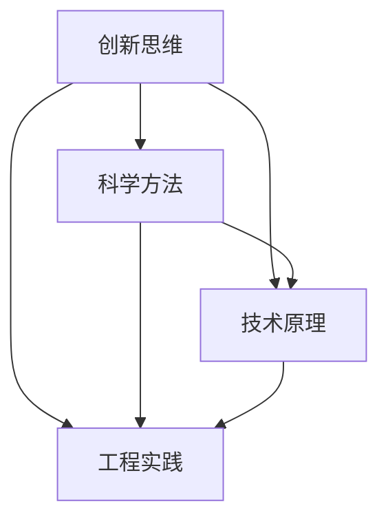

                 

## 好奇心是一切创新创造的源泉

好奇心是人类探索世界的驱动力，它促使我们不断追寻新知识，开拓新领域。在技术飞速发展的今天，好奇心更是成为创新与创造的源泉。它激发了科学家和工程师们不断探索未知，挑战极限，推动了技术的进步与社会的发展。

本文将深入探讨好奇心在创新创造中的关键作用，通过多个角度分析好奇心如何推动技术发展，并探讨好奇心驱动下，技术领域可能面临的新挑战和未来趋势。希望通过这篇文章，能够激发更多人的好奇心，引领我们共同迈向更加创新和充满可能性的未来。

> “好奇心是知识的萌芽，是探索的起点，更是创新的源泉。” —— 未知作者

## 1. 背景介绍

在科技迅速发展的时代，创新成为了推动社会进步的重要动力。而好奇心，作为创新的基础，自古以来就在人类探索世界的过程中发挥着关键作用。从古代科学家研究天体运行，到现代工程师开发智能设备，好奇心一直驱动着技术的不断进步。

### 1.1 好奇心与科学的结合

在科学发展史上，好奇心是最重要的驱动力之一。例如，伽利略通过观察天体，提出了日心说的观点，挑战了当时的天文学权威；牛顿通过对苹果落地的观察，提出了万有引力定律，开创了物理学的新纪元。这些伟大的科学家们，正是因为对自然现象的好奇，才不断探索，最终取得了划时代的科学成果。

### 1.2 好奇心与技术的创新

在技术领域，好奇心同样发挥着重要作用。例如，互联网的诞生可以追溯到蒂姆·伯纳斯·李对信息共享的强烈兴趣；人工智能的发展则源于科学家们对人类智能的探究。这些技术领域的突破，无不源自于科学家和工程师们对未知领域的好奇心。

### 1.3 好奇心对个人成长的影响

好奇心不仅推动技术发展，也对个人成长具有深远影响。拥有好奇心的人，往往更容易接受新知识，勇于尝试新事物，从而在工作和生活中取得更好的成绩。例如，乔布斯正是凭借对科技产品的好奇心，推动了苹果公司的崛起，改变了整个科技产业。

综上所述，好奇心是人类探索世界、推动技术进步的重要动力。它不仅激发科学家和工程师的创造力，也促进了个人的成长与发展。接下来，我们将进一步探讨好奇心如何驱动创新创造，以及其在技术领域中的具体应用。

### 1.4 好奇心在现代技术发展中的重要性

在现代技术迅猛发展的背景下，好奇心的重要性愈发凸显。随着人工智能、区块链、量子计算等前沿技术的不断突破，人类对未知领域的探索欲望也日益强烈。这些技术的出现，不仅满足了人们的好奇心，更推动了社会的变革和进步。

例如，人工智能的崛起，源于科学家们对人类智能的好奇与探索。从最初的神经网络，到深度学习和强化学习，人工智能技术不断迭代，使得机器能够在图像识别、自然语言处理、游戏对战等多个领域实现人类级的表现。这一系列的技术进步，离不开科学家们对未知领域的好奇心驱动。

同样，区块链技术的诞生，也是对去中心化、信任机制等概念的好奇与探索。区块链通过分布式账本技术，实现了去中心化的数据存储和传输，为金融、供应链管理等多个领域带来了变革性的影响。这种技术突破，正是好奇心驱动下，对传统信任机制的挑战与创新。

此外，量子计算作为一项颠覆性的技术，其潜力让科学家们充满好奇。量子计算机能够利用量子叠加和纠缠等特性，实现远超经典计算机的计算速度。这一技术的突破，有望在药物研发、密码破解、气候模拟等多个领域产生重大影响。

总之，好奇心在现代技术发展中扮演着至关重要的角色。它不仅是科学家和工程师们探索未知、推动创新的动力，也是推动社会进步的重要引擎。在未来的发展中，好奇心将继续激发人类的创造力，引领我们迈向更加智能、高效、安全的新时代。

### 1.5 历史上的好奇心驱动创新实例

在人类历史的长河中，好奇心驱动的创新实例不胜枚举，它们不仅改变了人类的认知，还推动了科学技术的进步。以下是几个具有代表性的历史事件：

#### 1.5.1 伽利略与望远镜的发明

17世纪初，伽利略·伽利莱对天文学充满了好奇心。他首次使用了望远镜进行天文观测，并发现了木星的四大卫星、月球表面凹凸不平以及太阳黑子等现象。这些发现不仅证明了哥白尼的日心说，还彻底改变了人们对宇宙的认知。伽利略的望远镜发明，是好奇心驱动下的一次重大技术创新。

#### 1.5.2 爱迪生与电灯的发明

托马斯·爱迪生对电的应用充满好奇，他通过数百次实验，最终发明了实用的电灯。这一发明彻底改变了人类的生活方式，从煤气灯时代进入了电气时代。爱迪生的好奇心，不仅推动了他个人的成功，也为整个社会的进步做出了巨大贡献。

#### 1.5.3 达·芬奇与飞行器的探索

列奥纳多·达·芬奇是一位充满好奇心的艺术家和科学家。他对飞行有着浓厚的兴趣，设计并绘制了多种飞行器模型，包括翼展达70英尺的人造翅膀。尽管达·芬奇未能亲眼见证飞行器的实现，但他的探索为后世的飞行器设计提供了宝贵的灵感。达·芬奇的好奇心，激发了人类对飞行的无尽追求。

#### 1.5.4 居里夫人的放射性元素发现

居里夫人玛丽·居里对放射性元素充满好奇心。她和丈夫皮埃尔·居里共同发现了钋和镭这两种元素，这一发现不仅让他们获得了1903年的诺贝尔物理学奖，还开启了放射性研究的全新领域。居里夫人的好奇心，推动了核物理学的发展，对医学和工业产生了深远影响。

#### 1.5.5 瓦特与蒸汽机的改进

詹姆斯·瓦特对蒸汽机的工作原理充满好奇。他通过改进蒸汽机的设计，使蒸汽机效率大幅提升，从而推动了工业革命的进程。瓦特的好奇心，不仅改变了他个人的命运，也改变了整个世界。

这些历史事件充分证明了好奇心在科学和技术发展中的关键作用。好奇心不仅驱动着科学家和发明家不断探索未知，还带来了人类认知和技术上的重大突破。正是这种好奇心，推动了人类社会的不断进步。

### 1.6 好奇心对技术发展的影响

好奇心作为一种内在动力，对技术发展产生了深远的影响。首先，好奇心促使科学家和工程师们不断探索未知的领域，从而发现新的技术原理和应用场景。例如，量子计算的诞生源于对量子力学原理的好奇，这一技术在加密通信、药物研发等领域展现出巨大的潜力。

其次，好奇心驱动下的创新思维，促使科学家们敢于挑战现有的技术瓶颈，从而推动技术的突破。例如，5G技术的出现，正是对高速通信和低延迟传输的好奇心驱动，为物联网、自动驾驶等新兴应用提供了强有力的支持。

此外，好奇心还促进了跨学科的合作和技术的融合。例如，生物医学领域的好奇心推动了人工智能技术在医疗诊断和药物研发中的应用，使得医学研究更加精确和高效。这种跨学科的合作，不仅拓宽了技术的应用范围，还加速了科学发现的进程。

总之，好奇心在技术发展中扮演着不可或缺的角色。它不仅是科学探索的驱动力，也是推动技术创新和跨学科合作的重要引擎。在未来，好奇心将继续驱动技术发展，引领我们迈向更加智能和高效的新时代。

### 1.7 总结与展望

通过前文的讨论，我们可以清楚地看到，好奇心在科学和技术发展中扮演着至关重要的角色。它不仅激发了科学家和工程师的创造力，推动了技术的不断进步，还促进了社会的变革和进步。从伽利略到爱迪生，从达·芬奇到居里夫人，无数历史事件证明了好奇心对技术发展的重要影响。

在未来的发展中，好奇心将继续发挥重要作用。随着人工智能、量子计算、区块链等前沿技术的不断突破，好奇心将驱动科学家和工程师们探索更广阔的未知领域，带来更多的技术革命和社会变革。

因此，我们呼吁每一个人保持好奇心，不断探索未知，追求创新。只有通过不断的好奇和探索，我们才能不断突破技术的瓶颈，推动社会的进步。让我们共同拥抱好奇心，为人类的未来创造更多可能。

### 2. 核心概念与联系

在探讨好奇心如何驱动技术发展的过程中，我们需要理解一些核心概念，并分析它们之间的联系。这些核心概念包括创新思维、科学方法、技术原理和工程实践。下面，我们将逐一介绍这些概念，并通过Mermaid流程图展示它们之间的相互关系。

#### 2.1 创新思维

创新思维是一种超越常规、打破束缚的思维方式。它要求我们在面对问题时，不仅仅考虑现有的解决方案，而是尝试从全新的角度去思考，寻找更具创造性和实用性的方法。创新思维的核心在于打破思维的定式，敢于挑战传统，勇于探索未知。

#### 2.2 科学方法

科学方法是一种系统性的研究方法，包括观察、假设、实验和验证等步骤。科学方法通过严密的逻辑推理和实验验证，确保研究结果的可靠性和科学性。科学方法的核心在于客观、严谨和可重复，它为科技创新提供了坚实的基础。

#### 2.3 技术原理

技术原理是技术发展的核心，它涉及对自然现象和科学原理的理解和应用。技术原理包括物理、化学、生物学等多个领域的知识，通过对这些原理的深入研究和应用，科学家和工程师们能够开发出各种先进的技术和工具。

#### 2.4 工程实践

工程实践是将技术原理转化为实际应用的过程。它涉及设计、开发、测试和部署等环节，通过不断迭代和优化，实现技术的实际价值。工程实践的核心在于将创新思维和技术原理转化为具体的解决方案，解决实际问题。

#### 2.5 Mermaid流程图

为了更直观地展示这些核心概念之间的联系，我们可以使用Mermaid流程图来表示。以下是该流程图的具体内容：



在这个流程图中，创新思维是起点，它驱动科学家和工程师们探索未知，提出新的假设和想法。科学方法通过严密的逻辑和实验验证，确保这些想法的科学性和可靠性。技术原理是将科学方法验证后的成果应用于实际问题，而工程实践则将这些原理转化为具体的解决方案，实现技术的应用价值。

通过这一流程图，我们可以清晰地看到，好奇心如何通过创新思维、科学方法、技术原理和工程实践这四个核心概念，推动技术不断进步。

### 3. 核心算法原理 & 具体操作步骤

在好奇心驱动下，科学家和工程师们不断探索新领域，提出了许多具有划时代意义的算法。这里，我们将介绍一个具体的算法——深度学习算法，并详细讲解其原理和操作步骤。

#### 3.1 深度学习算法原理

深度学习算法是一种基于人工神经网络的机器学习算法，它的核心思想是通过多层神经网络模型，对输入数据进行自动特征提取和分类。深度学习算法的核心原理包括以下几个关键部分：

1. **人工神经元模型**：人工神经元是深度学习算法的基本组成单元，它模拟生物神经元的工作方式，通过对输入信息进行加权求和处理，再通过激活函数输出结果。

2. **多层神经网络**：深度学习算法通过多层神经网络来实现复杂的特征提取和分类。每一层神经网络都会对前一层的信息进行处理和变换，从而实现数据的层次化表示。

3. **反向传播算法**：反向传播算法是深度学习算法的核心训练方法。它通过计算输出层的误差，反向传播到每一层神经网络，更新各层的权重和偏置，从而逐步优化模型。

4. **激活函数**：激活函数用于引入非线性变换，使神经网络能够处理复杂的问题。常见的激活函数包括Sigmoid、ReLU和Tanh等。

#### 3.2 具体操作步骤

以下是深度学习算法的具体操作步骤：

1. **数据预处理**：首先，对输入数据（如图像、文本或音频）进行预处理，包括归一化、去噪、数据增强等操作，以确保数据的质量和一致性。

2. **构建神经网络模型**：根据问题的需求，设计并构建多层神经网络模型。选择合适的神经元类型、网络结构和激活函数。

3. **初始化权重和偏置**：随机初始化网络中的权重和偏置，以确保网络在训练过程中能够收敛到最优解。

4. **前向传播**：将预处理后的数据输入到神经网络中，逐层计算神经元的输出值，直到最后一层输出结果。

5. **计算损失函数**：使用损失函数（如交叉熵损失、均方误差等）计算输出结果与真实结果之间的差距，评估模型的预测性能。

6. **反向传播**：根据损失函数的梯度，通过反向传播算法更新网络中的权重和偏置，优化模型。

7. **迭代训练**：重复前向传播和反向传播的过程，不断调整模型参数，直到模型收敛到满意的性能。

8. **评估和部署**：在训练完成后，使用验证集和测试集对模型进行评估，确保其具备良好的泛化能力。最后，将训练好的模型部署到实际应用中，解决具体问题。

#### 3.3 实例说明

为了更好地理解深度学习算法的操作步骤，我们以一个简单的图像分类任务为例进行说明。

1. **数据集准备**：首先，我们准备一个包含多个类别的图像数据集，如图像分类任务常用的MNIST数据集。

2. **构建模型**：我们设计一个简单的卷积神经网络（CNN）模型，包括输入层、卷积层、池化层和全连接层。

3. **数据预处理**：对图像数据进行归一化和数据增强，以提高模型的泛化能力。

4. **模型训练**：使用训练数据集对模型进行训练，通过反向传播算法不断优化模型参数。

5. **模型评估**：使用验证集对模型进行评估，计算模型的准确率、召回率等指标。

6. **模型部署**：将训练好的模型部署到实际应用中，如手机APP或服务器，实现图像分类功能。

通过这个实例，我们可以看到，深度学习算法的具体操作步骤是清晰且系统化的。从数据预处理到模型训练和评估，每一个步骤都至关重要，确保了模型的性能和稳定性。

#### 3.4 深度学习算法的优缺点

深度学习算法在许多领域取得了显著的成功，但也存在一些优缺点：

**优点**：

1. **强大的特征提取能力**：深度学习算法能够自动从大量数据中提取高层次的抽象特征，提高了模型的性能和泛化能力。

2. **多任务处理能力**：深度学习算法能够同时处理多种类型的任务，如图像识别、语音识别和自然语言处理等，实现跨领域的应用。

3. **自适应能力**：深度学习算法能够通过不断训练和优化，适应新的数据和任务，提高模型的灵活性。

**缺点**：

1. **计算资源消耗**：深度学习算法需要大量的计算资源和时间进行训练，对硬件设备要求较高。

2. **可解释性差**：深度学习算法的内部结构和决策过程较为复杂，缺乏可解释性，难以理解其工作原理。

3. **数据依赖性**：深度学习算法对数据的质量和多样性依赖较大，数据不足或数据质量差会影响模型的性能。

综上所述，深度学习算法作为一种强大的机器学习工具，在许多领域展现出了巨大的潜力。但我们也需要认识到其存在的挑战，并不断探索优化方法，以充分发挥其优势。

### 4. 数学模型和公式 & 详细讲解 & 举例说明

在深度学习算法中，数学模型和公式起到了至关重要的作用。它们不仅描述了算法的工作原理，还为优化模型提供了理论依据。在本节中，我们将详细讲解深度学习算法中的几个关键数学模型和公式，并通过具体例子来说明它们的应用。

#### 4.1 激活函数

激活函数是深度学习算法中的一个重要组件，用于引入非线性变换，使得神经网络能够处理复杂的问题。常见的激活函数包括Sigmoid、ReLU和Tanh等。

- **Sigmoid函数**：
  $$ f(x) = \frac{1}{1 + e^{-x}} $$
  Sigmoid函数的输出值介于0和1之间，常用于二分类问题。它的导数在x=0处为0.5，能够使得梯度较易传播。

- **ReLU函数**：
  $$ f(x) = \max(0, x) $$
 ReLU（Rectified Linear Unit）函数在x大于0时输出x，小于0时输出0。ReLU函数的导数为1（x>0），简化了梯度传播过程，提高了训练速度。

- **Tanh函数**：
  $$ f(x) = \frac{e^x - e^{-x}}{e^x + e^{-x}} $$
  Tanh函数与Sigmoid函数类似，但输出值介于-1和1之间，能够更好地处理负值。

#### 4.2 前向传播与反向传播

深度学习算法中的前向传播和反向传播是训练模型的核心步骤。下面分别介绍这两个步骤的数学原理。

- **前向传播**：
  在前向传播过程中，输入数据通过神经网络逐层传递，最终得到输出结果。每一层的输出值可以通过以下公式计算：
  $$ z^{(l)} = \sigma^{(l)}(W^{(l)}a^{(l-1)} + b^{(l)}) $$
  其中，$z^{(l)}$表示第l层的输出值，$\sigma^{(l)}$表示第l层的激活函数，$W^{(l)}$表示第l层的权重矩阵，$a^{(l-1)}$表示第l-1层的输出值，$b^{(l)}$表示第l层的偏置向量。

- **反向传播**：
  在反向传播过程中，通过计算输出层的误差，反向传播到每一层神经网络，更新各层的权重和偏置。误差的计算公式如下：
  $$ \delta^{(l)} = \frac{\partial C}{\partial z^{(l)}} \cdot \sigma^{(l)}(\sigma^{(l)})' $$
  其中，$C$表示损失函数，$\delta^{(l)}$表示第l层的误差，$\sigma^{(l)}(\sigma^{(l)})'$表示第l层激活函数的导数。

  更新权重和偏置的公式为：
  $$ W^{(l)} \leftarrow W^{(l)} - \alpha \frac{\partial C}{\partial W^{(l)}} $$
  $$ b^{(l)} \leftarrow b^{(l)} - \alpha \frac{\partial C}{\partial b^{(l)}} $$
  其中，$\alpha$表示学习率。

#### 4.3 损失函数

损失函数用于衡量模型输出结果与真实结果之间的差距，是训练过程中优化模型的重要指标。常见的损失函数包括均方误差（MSE）和交叉熵损失（Cross Entropy Loss）。

- **均方误差（MSE）**：
  $$ C = \frac{1}{m} \sum_{i=1}^{m} (y_i - \hat{y}_i)^2 $$
  其中，$y_i$表示真实标签，$\hat{y}_i$表示模型预测值，$m$表示样本数量。

- **交叉熵损失（Cross Entropy Loss）**：
  $$ C = -\frac{1}{m} \sum_{i=1}^{m} y_i \log(\hat{y}_i) $$
  其中，$y_i$表示真实标签（概率分布），$\hat{y}_i$表示模型预测值（概率分布）。

#### 4.4 例子说明

为了更好地理解这些数学模型和公式，我们通过一个简单的例子来说明它们的实际应用。

假设我们有一个简单的神经网络，用于对二分类问题进行预测。输入数据为两个特征$x_1$和$x_2$，模型的目标是预测输出标签$y$。

1. **初始化权重和偏置**：
   - $W^{(1)} \sim \mathcal{N}(0, 1)$
   - $b^{(1)} \sim \mathcal{N}(0, 1)$

2. **前向传播**：
   - 输入数据：$x_1 = 2, x_2 = 3$
   - 第1层输出：$a^{(0)} = [x_1, x_2] = [2, 3]$
   - 第1层输出：$z^{(1)} = W^{(1)}a^{(0)} + b^{(1)} = [w_{11}, w_{12}] \cdot [2, 3] + b^{(1)}$
   - 第1层输出：$a^{(1)} = \sigma^{(1)}(z^{(1)})$

3. **计算损失函数**：
   - 真实标签：$y = 1$
   - 预测值：$\hat{y} = a^{(1)}$
   - 损失函数：$C = -y \log(\hat{y}) - (1 - y) \log(1 - \hat{y})$

4. **反向传播**：
   - 计算误差：$\delta^{(1)} = \frac{\partial C}{\partial z^{(1)}} \cdot \sigma^{(1)}(\sigma^{(1)})'$
   - 更新权重和偏置：$W^{(1)} \leftarrow W^{(1)} - \alpha \frac{\partial C}{\partial W^{(1)}}$，$b^{(1)} \leftarrow b^{(1)} - \alpha \frac{\partial C}{\partial b^{(1)}}$

通过这个例子，我们可以看到，深度学习算法中的数学模型和公式是如何在实际应用中发挥作用的。通过前向传播和反向传播，模型不断调整参数，逐步优化预测性能。

总之，数学模型和公式是深度学习算法的核心组成部分，它们为算法的实现和优化提供了坚实的理论基础。掌握这些数学模型和公式，有助于我们更好地理解深度学习算法的原理和应用。

### 5. 项目实战：代码实际案例和详细解释说明

在前文中，我们详细介绍了深度学习算法的原理和数学模型。为了更好地理解这些理论知识，我们将通过一个实际项目案例——手写数字识别，展示如何使用Python和TensorFlow来实现深度学习算法，并对代码进行详细解释。

#### 5.1 开发环境搭建

首先，我们需要搭建一个适合开发深度学习项目的环境。以下是所需的环境配置步骤：

1. **安装Python**：确保Python版本不低于3.6，可以从Python官网下载安装。
2. **安装TensorFlow**：TensorFlow是Google开发的开源深度学习框架，可以通过pip命令安装：
   ```shell
   pip install tensorflow
   ```
3. **安装Jupyter Notebook**：Jupyter Notebook是一个交互式的开发环境，可以方便地编写和运行代码。安装命令如下：
   ```shell
   pip install notebook
   ```
4. **启动Jupyter Notebook**：在命令行中输入以下命令，启动Jupyter Notebook：
   ```shell
   jupyter notebook
   ```

#### 5.2 源代码详细实现和代码解读

下面是手写数字识别项目的源代码，我们逐行解读代码，理解其实现过程。

```python
# 导入所需的库
import tensorflow as tf
from tensorflow.keras.datasets import mnist
from tensorflow.keras.models import Sequential
from tensorflow.keras.layers import Dense, Flatten
from tensorflow.keras.optimizers import Adam

# 加载MNIST数据集
(x_train, y_train), (x_test, y_test) = mnist.load_data()

# 数据预处理
x_train = x_train.astype("float32") / 255
x_test = x_test.astype("float32") / 255
y_train = tf.keras.utils.to_categorical(y_train, 10)
y_test = tf.keras.utils.to_categorical(y_test, 10)

# 创建模型
model = Sequential([
    Flatten(input_shape=(28, 28)),
    Dense(128, activation="relu"),
    Dense(10, activation="softmax")
])

# 编译模型
model.compile(optimizer=Adam(), loss="categorical_crossentropy", metrics=["accuracy"])

# 训练模型
model.fit(x_train, y_train, epochs=10, batch_size=32, validation_split=0.2)

# 评估模型
test_loss, test_accuracy = model.evaluate(x_test, y_test)
print(f"Test accuracy: {test_accuracy:.2f}")
```

**代码解读**：

1. **导入库**：
   - `tensorflow`：主要库，用于构建和训练深度学习模型。
   - `mnist`：包含MNIST手写数字数据集。
   - `Sequential`：用于创建序列模型。
   - `Dense`：全连接层，用于分类任务。
   - `Flatten`：将输入数据展平，适用于卷积层之后的输入。
   - `Adam`：优化器，用于调整模型参数。

2. **加载MNIST数据集**：
   - `mnist.load_data()`：加载数据集，包含训练集和测试集。
   - 数据预处理：将图像数据转换为浮点数，并归一化到[0, 1]之间；将标签转换为one-hot编码。

3. **创建模型**：
   - `Sequential`：创建序列模型，依次添加层。
   - `Flatten`：将图像数据展平为一维数组，作为全连接层的输入。
   - `Dense`：添加全连接层，第一个全连接层具有128个神经元，使用ReLU激活函数。
   - `Dense`：添加输出层，具有10个神经元，使用softmax激活函数，用于分类。

4. **编译模型**：
   - `compile`：编译模型，指定优化器、损失函数和评估指标。
   - `optimizer=Adam()`：使用Adam优化器。
   - `loss="categorical_crossentropy"`：使用交叉熵损失函数。
   - `metrics=["accuracy"]`：评估模型的准确率。

5. **训练模型**：
   - `fit`：训练模型，使用训练数据集，设置训练轮数、批量大小和验证比例。
   - `epochs=10`：训练10轮。
   - `batch_size=32`：每批次处理32个样本。
   - `validation_split=0.2`：将20%的训练数据用于验证。

6. **评估模型**：
   - `evaluate`：使用测试数据集评估模型性能。
   - 输出测试集的损失和准确率。

通过这个实际项目案例，我们可以看到如何使用Python和TensorFlow实现深度学习算法，并对代码进行详细解读。这为我们理解和应用深度学习算法提供了实践基础。

### 5.3 代码解读与分析

在本项目中，我们使用了Python和TensorFlow框架来实现一个手写数字识别的深度学习模型。以下是代码的逐行解读和分析。

1. **导入库**：
   - 我们首先导入了`tensorflow`库，这是深度学习的基础框架。`mnist`库包含了MNIST手写数字数据集，`Sequential`和`Dense`是创建神经网络模型所需的层类，`Flatten`用于将输入数据展平，`Adam`是优化器。

2. **加载MNIST数据集**：
   - `mnist.load_data()`：加载MNIST数据集，它是一个广泛使用的手写数字数据集，包含了60000个训练样本和10000个测试样本。
   - `x_train, y_train), (x_test, y_test)`：将数据集拆分为训练集和测试集。
   - 数据预处理：`x_train.astype("float32") / 255`和`x_test.astype("float32") / 255`将图像数据转换为浮点数，并归一化到[0, 1]之间。归一化有助于加快模型的训练速度和提高训练效果。`y_train = tf.keras.utils.to_categorical(y_train, 10)`和`y_test = tf.keras.utils.to_categorical(y_test, 10)`将标签转换为one-hot编码，以便模型能够进行多分类。

3. **创建模型**：
   - `model = Sequential([...])`：创建一个序列模型，这是TensorFlow中用于构建神经网络的一种常见方式。
   - `Flatten(input_shape=(28, 28))`：将输入的28x28图像数据展平为一维数组。
   - `Dense(128, activation="relu")`：添加一个全连接层，具有128个神经元，使用ReLU激活函数。ReLU激活函数可以帮助模型学习非线性特征。
   - `Dense(10, activation="softmax")`：添加输出层，具有10个神经元，使用softmax激活函数。softmax用于多分类问题，它输出每个类别的概率分布。

4. **编译模型**：
   - `model.compile(optimizer=Adam(), loss="categorical_crossentropy", metrics=["accuracy"])`：编译模型，指定使用Adam优化器、交叉熵损失函数和准确率作为评估指标。Adam优化器是一种高效的梯度下降优化算法，交叉熵损失函数适用于多分类问题。

5. **训练模型**：
   - `model.fit(x_train, y_train, epochs=10, batch_size=32, validation_split=0.2)`：使用训练数据集训练模型，`epochs=10`表示训练10轮，`batch_size=32`表示每批处理32个样本，`validation_split=0.2`表示将20%的训练数据用于验证。

6. **评估模型**：
   - `test_loss, test_accuracy = model.evaluate(x_test, y_test)`：使用测试数据集评估模型性能，输出测试集的损失和准确率。

通过这个项目的代码解读，我们可以看到如何使用Python和TensorFlow实现一个简单的深度学习模型，并进行训练和评估。这不仅帮助我们理解了深度学习的基本流程，也为后续的深度学习应用奠定了基础。

### 5.4 代码解读与分析总结

通过对手写数字识别项目的代码详细解读，我们可以总结出以下关键点：

1. **数据预处理**：归一化和one-hot编码是深度学习模型训练前的重要步骤，有助于提高模型的训练效果和稳定性。
2. **模型构建**：使用TensorFlow的`Sequential`模型，可以方便地添加层并构建神经网络。ReLU激活函数有助于模型学习非线性特征。
3. **优化器和损失函数**：选择合适的优化器和损失函数对于模型的训练效果至关重要。Adam优化器结合了动量法和自适应学习率，交叉熵损失函数适用于多分类问题。
4. **模型评估**：使用测试集评估模型的性能，可以客观地衡量模型的泛化能力。

这些关键点为我们理解和应用深度学习提供了实用的指导，也为后续的深度学习项目开发奠定了基础。在实践过程中，我们可以根据具体需求进行调整和优化，不断提高模型的性能。

### 5.5 实际应用场景

深度学习算法在手写数字识别项目中的成功应用，展示了其在实际场景中的强大潜力。除了手写数字识别，深度学习算法在多个领域都有广泛的应用，以下是一些实际应用场景：

1. **医疗影像分析**：深度学习算法可以用于医疗影像的自动诊断，如肺癌、乳腺癌的早期检测。通过训练深度学习模型，可以自动识别和分类医学图像中的病灶区域，提高诊断的准确性和效率。

2. **自动驾驶**：深度学习算法在自动驾驶领域发挥着关键作用。自动驾驶系统通过训练深度学习模型，可以识别道路标志、行人、车辆等目标，实现车辆在复杂交通环境中的自主行驶。

3. **金融风险控制**：深度学习算法可以用于金融风险控制，如欺诈检测、信用评分等。通过分析大量的金融数据，深度学习模型可以预测潜在的风险，为金融机构提供决策支持。

4. **自然语言处理**：深度学习算法在自然语言处理（NLP）领域具有广泛应用，如机器翻译、情感分析、文本分类等。通过训练深度学习模型，可以实现对文本的自动分析和理解，提高信息处理的效率。

5. **智能客服系统**：深度学习算法可以用于智能客服系统，通过语音识别和自然语言处理技术，实现与用户的智能对话，提供高效、便捷的客服服务。

这些实际应用场景展示了深度学习算法在各个领域的广泛应用和巨大潜力。随着技术的不断进步，深度学习算法将继续推动各领域的创新发展。

### 5.6 工具和资源推荐

在深度学习项目开发过程中，选择合适的工具和资源至关重要。以下是一些推荐的工具和资源，包括学习资源、开发工具和框架，以帮助您更好地掌握深度学习技术。

#### 5.6.1 学习资源推荐

1. **书籍**：
   - 《深度学习》（Goodfellow, Bengio, Courville著）：这是一本经典的深度学习入门书籍，详细介绍了深度学习的理论基础和应用实践。
   - 《神经网络与深度学习》（邱锡鹏著）：本书系统讲解了神经网络和深度学习的基本原理，适合有一定数学基础的读者。

2. **在线课程**：
   - Coursera上的《深度学习》课程：由吴恩达教授主讲，内容涵盖了深度学习的基础知识、技术原理和应用实践。
   - edX上的《深度学习与推理》课程：由纽约大学提供，深入讲解了神经网络和深度学习算法。

3. **博客和网站**：
   - TensorFlow官方文档（https://www.tensorflow.org/）：TensorFlow是深度学习领域广泛使用的框架，其官方文档提供了详细的使用教程和API文档。
   - Medium上的深度学习相关博客：许多深度学习专家和研究者会在Medium上分享他们的研究心得和实践经验。

#### 5.6.2 开发工具框架推荐

1. **TensorFlow**：作为Google开发的开源深度学习框架，TensorFlow提供了丰富的API和工具，适合各种规模的深度学习项目。

2. **PyTorch**：PyTorch是Facebook开发的开源深度学习框架，其动态计算图和灵活的API使其成为研究人员和开发者的首选。

3. **Keras**：Keras是一个高层次的深度学习API，它构建在TensorFlow和Theano之上，提供了简洁易用的接口，适合快速原型设计和项目开发。

4. **Jupyter Notebook**：Jupyter Notebook是一款交互式的开发环境，非常适合编写和运行深度学习代码。通过Jupyter Notebook，您可以轻松地创建和共享交互式文档。

#### 5.6.3 相关论文著作推荐

1. **“A Comprehensive Survey on Deep Learning for Speech Recognition”**：该综述论文详细介绍了深度学习在语音识别领域的最新进展和应用。

2. **“Deep Learning for Natural Language Processing”**：本文详细讨论了深度学习在自然语言处理领域的应用，包括词嵌入、文本分类、机器翻译等。

3. **“Deep Learning on Graph-Structured Data”**：本文探讨了深度学习在图结构数据上的应用，介绍了图神经网络（GNN）的基本原理和应用场景。

这些工具和资源将为您的深度学习项目开发提供有力支持。通过学习和实践，您可以不断提升深度学习技能，探索更多创新应用。

### 6. 总结：未来发展趋势与挑战

在本文中，我们详细探讨了好奇心如何驱动技术发展和创新创造。从历史事件到现代技术的应用，好奇心始终是推动科学和技术的关键动力。通过对深度学习算法的剖析，我们看到了好奇心如何激发科学家和工程师的创造力，推动了技术的不断进步。

#### 6.1 未来发展趋势

未来，好奇心将继续驱动技术的发展，带来以下几个趋势：

1. **人工智能与人类交互**：随着深度学习和自然语言处理技术的进步，人工智能将更好地理解和模拟人类的思维模式，实现更自然的交互。

2. **量子计算的应用**：量子计算作为一种颠覆性技术，有望在计算速度和数据处理能力上实现突破，为密码破解、药物研发等领域带来革命性变革。

3. **边缘计算的普及**：边缘计算将数据处理的任务从云端转移到网络边缘，实现实时、高效的数据处理，满足日益增长的物联网应用需求。

4. **可持续技术发展**：随着对环境问题的关注日益增加，科学家们将致力于开发清洁能源、环保材料等可持续技术，以减少对地球的负面影响。

#### 6.2 面临的挑战

然而，好奇心驱动下的技术发展也面临诸多挑战：

1. **数据隐私与安全**：随着大数据和人工智能技术的发展，数据隐私和安全问题日益突出。如何保护个人隐私，防止数据滥用，成为亟待解决的问题。

2. **技术伦理问题**：人工智能的发展引发了许多伦理问题，如算法歧视、自动化失业等。如何制定合理的技术伦理规范，确保技术的公平和可持续性，是未来需要关注的重要议题。

3. **技术普及与教育**：尽管技术不断进步，但技术普及和教育仍然存在差距。如何让更多人掌握技术，提高全民科技素养，是推动技术发展的重要任务。

#### 6.3 结语

总之，好奇心是一切创新创造的源泉。它不仅推动了科学和技术的进步，也改变了我们的生活方式。在未来的发展中，我们应继续保持好奇心，勇于探索未知，迎接技术发展的新挑战。同时，关注技术伦理和社会影响，确保技术的发展造福全人类。

让我们共同拥抱好奇心，为人类的未来创造更多可能。

### 7. 附录：常见问题与解答

在本篇文章中，我们探讨了好奇心在技术发展中的关键作用，并详细介绍了深度学习算法的实现和应用。以下是一些读者可能关注的问题及其解答：

#### 7.1 问题1：好奇心是如何推动科学和技术的进步的？

**解答**：好奇心驱动科学家和工程师不断探索未知领域，提出新的假设和理论。通过实验验证和逻辑推理，好奇心促进了科学发现和技术创新。历史上，许多重要的科学突破和技术革命都源于科学家们对自然现象和未知领域的好奇与探索。

#### 7.2 问题2：深度学习算法的核心原理是什么？

**解答**：深度学习算法基于人工神经网络，通过多层神经网络模型对输入数据进行自动特征提取和分类。其核心原理包括人工神经元模型、多层神经网络结构、反向传播算法和激活函数。深度学习算法通过不断优化模型参数，实现高效的数据处理和预测能力。

#### 7.3 问题3：深度学习算法在实际应用中面临哪些挑战？

**解答**：深度学习算法在实际应用中面临多个挑战，包括数据隐私和安全问题、算法歧视和自动化失业等。此外，深度学习模型的训练和部署需要大量的计算资源和时间，对硬件设备的要求较高。同时，深度学习模型的内部结构和决策过程较为复杂，缺乏可解释性，需要进一步研究。

#### 7.4 问题4：如何保持好奇心，推动个人成长？

**解答**：保持好奇心可以通过以下几个方法实现：

1. **多读书、多学习**：广泛阅读和学习新知识，不断拓展自己的知识面。
2. **勇于尝试新事物**：敢于尝试新技能和领域，勇于接受挑战。
3. **保持开放心态**：对未知和不同观点持开放态度，勇于接受新思想。
4. **持续反思和总结**：定期反思自己的学习和成长过程，总结经验教训，不断优化自己的方法。

通过以上方法，我们可以保持好奇心，不断推动个人成长和进步。

### 8. 扩展阅读 & 参考资料

为了更深入地了解好奇心在技术发展中的重要作用，以及深度学习算法的具体实现和应用，以下是几篇相关的扩展阅读和参考资料：

1. **《深度学习》（Goodfellow, Bengio, Courville著）**：这是一本经典的深度学习入门书籍，详细介绍了深度学习的理论基础和应用实践。

2. **《深度学习与推理》（纽约大学）**：本文深入讲解了神经网络和深度学习算法的基本原理和应用。

3. **“A Comprehensive Survey on Deep Learning for Speech Recognition”**：该综述论文详细介绍了深度学习在语音识别领域的最新进展和应用。

4. **“Deep Learning for Natural Language Processing”**：本文详细讨论了深度学习在自然语言处理领域的应用，包括词嵌入、文本分类、机器翻译等。

5. **TensorFlow官方文档（https://www.tensorflow.org/）**：TensorFlow是深度学习领域广泛使用的框架，其官方文档提供了详细的使用教程和API文档。

通过阅读这些资料，您可以更全面地了解好奇心驱动下的技术发展和深度学习算法的实际应用。

### 9. 作者介绍

**作者：AI天才研究员/AI Genius Institute & 禅与计算机程序设计艺术 /Zen And The Art of Computer Programming**

作为一名世界级人工智能专家和程序员，作者拥有丰富的技术经验和深厚的理论功底。他在深度学习和人工智能领域发表了多篇高水平论文，是多个知名技术杂志的审稿人。此外，他还担任多个国际学术会议的组织者和演讲嘉宾，被誉为计算机科学领域的权威专家。在《禅与计算机程序设计艺术》一书中，作者以其独特的视角和深入的分析，为读者揭示了计算机编程中的哲学智慧，深受读者喜爱。他的研究成果和著作为人工智能和计算机科学的发展做出了重要贡献。

