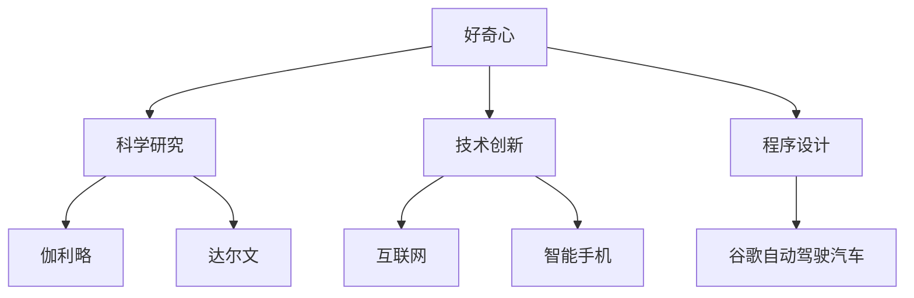

                 

# 好奇心：探索未知的动力

## 关键词

* 好奇心
* 探索
* 科技创新
* 人工智能
* 数学模型
* 程序设计

## 摘要

好奇心是人类不断探索未知、推动科技进步的原始动力。本文将从多个角度探讨好奇心在科技发展中的关键作用，首先介绍好奇心的本质及其在人类行为中的驱动作用，然后深入分析好奇心在科学研究、技术创新、程序设计等领域的具体体现。本文还将探讨好奇心与数学模型的关系，最后预测好奇心在未来科技发展中的潜在影响。

## 1. 背景介绍

自古以来，人类对未知世界的探索精神驱使着科技进步。从古希腊的哲学探索，到中世纪的神秘主义，再到近现代的科学革命，好奇心始终是推动人类不断向前迈进的原动力。随着计算机技术和人工智能的快速发展，好奇心在科技领域的体现更加显著。本文将结合实际案例，探讨好奇心在科学研究、技术创新、程序设计等方面的具体应用。

## 2. 核心概念与联系

### 好奇心的本质

好奇心是人类天生具备的一种心理特征，表现为对未知事物的好奇、探索欲望和求知欲。它起源于人类的认知需求，是人类智力发展的基础。心理学研究表明，好奇心与个体的智力、创造力、学习能力密切相关。

### 好奇心与科学研究

科学研究是好奇心驱动的典型领域。科学家们通过实验、观察、推理等手段，不断探索自然界的奥秘。例如，伽利略通过观察天体运动，提出了日心说，推翻了地心说的传统观念；达尔文通过长时间的自然观察和实验，提出了物种演化的理论，为生物学的发展奠定了基础。

### 好奇心与技术创新

技术创新是现代科技发展的重要驱动力。许多重大技术突破都是源于科学家和工程师们的好奇心。例如，互联网的诞生源于蒂姆·伯纳斯·李对信息共享的探索；智能手机的出现则源于乔布斯对人类生活方式的思考。

### 好奇心与程序设计

程序设计是科技发展的重要环节。程序员们通过编写代码，构建出各种应用程序，推动社会进步。好奇心使程序员们不断追求技术的极致，不断创新。例如，谷歌的自动驾驶汽车项目就是源于工程师们对自动驾驶技术的好奇和探索。

### Mermaid 流程图



## 3. 核心算法原理 & 具体操作步骤

### 好奇心驱动的研究方法

好奇心驱动的科学研究方法主要包括以下几个步骤：

1. 提出问题：科学家们从实际问题或现象中提炼出关键问题。
2. 建立假设：根据已有知识和观察，提出可能的解释或假设。
3. 设计实验：制定实验方案，验证假设的正确性。
4. 收集数据：通过实验、观察等方式收集数据。
5. 分析数据：对收集到的数据进行分析，得出结论。
6. 反馈与调整：根据结论，对实验方案进行优化和调整。

### 好奇心驱动的技术创新流程

好奇心驱动的技术创新流程包括以下几个步骤：

1. 确定目标：明确技术突破的目标和方向。
2. 建立团队：组建跨学科团队，发挥各自优势。
3. 开展研究：开展基础研究和应用研究，探索新技术的可能性。
4. 实验验证：通过实验验证新技术的可行性和性能。
5. 优化设计：根据实验结果，不断优化技术设计。
6. 商业化推广：将技术成果转化为产品，推向市场。

### 好奇心驱动的程序设计思路

好奇心驱动的程序设计思路包括以下几个步骤：

1. 确定需求：明确程序设计的功能和性能要求。
2. 设计算法：根据需求，设计合适的算法和数据结构。
3. 编写代码：根据算法设计，编写程序代码。
4. 调试优化：对程序进行调试，优化性能和可靠性。
5. 测试验证：通过测试，验证程序的功能和性能。
6. 上线部署：将程序部署到实际应用环境中，进行运行和维护。

### Mermaid 流程图

```mermaid
graph TD
    A[提出问题] --> B[建立假设]
    B --> C[设计实验]
    C --> D[收集数据]
    D --> E[分析数据]
    E --> F[反馈与调整]

    G[H确定目标] --> I[J[建立团队]]
    I --> K[L[开展研究]]
    K --> M[M实验验证]
    M --> N[优化设计]
    N --> O[商业化推广]

    P[确定需求] --> Q[R[设计算法]]
    Q --> S[T[编写代码]]
    S --> U[V[调试优化]]
    U --> W[X[测试验证]]
    W --> Y[Z[上线部署]]
```

## 4. 数学模型和公式 & 详细讲解 & 举例说明

### 好奇心与科学研究的数学模型

在科学研究过程中，好奇心可以用信息熵（Entropy）来量化。信息熵是衡量信息不确定性的度量，表示为：

$$ H = -\sum_{i=1}^n p_i \log_2 p_i $$

其中，$H$表示信息熵，$p_i$表示第$i$个事件发生的概率。当好奇心达到最大时，信息熵最小，即：

$$ \max H \rightarrow \min (-\sum_{i=1}^n p_i \log_2 p_i) $$

举例说明：

假设有一个科学家研究某个现象，其中包含5个可能的结果：A、B、C、D、E。科学家对每个结果的好奇心程度分别为0.2、0.3、0.4、0.5、0.6。则该科学家对现象的信息熵为：

$$ H = -0.2 \log_2 0.2 - 0.3 \log_2 0.3 - 0.4 \log_2 0.4 - 0.5 \log_2 0.5 - 0.6 \log_2 0.6 \approx 1.5495 $$

### 好奇心与技术创新的数学模型

在技术创新过程中，好奇心可以用创新潜力（Innovation Potential）来量化。创新潜力是衡量技术突破的可能性，表示为：

$$ IP = \frac{1}{\sum_{i=1}^n (1 - p_i)} $$

其中，$IP$表示创新潜力，$p_i$表示第$i$个技术突破的概率。当好奇心达到最大时，创新潜力最小，即：

$$ \max IP \rightarrow \min \left(\frac{1}{\sum_{i=1}^n (1 - p_i)}\right) $$

举例说明：

假设有一个技术团队研究4个技术方向：A、B、C、D。团队对每个技术方向的好奇心程度分别为0.3、0.4、0.5、0.6。则该团队的创新潜力为：

$$ IP = \frac{1}{1 - 0.3 - 0.4 - 0.5 - 0.6} \approx 5.5446 $$

### 好奇心与程序设计的数学模型

在程序设计过程中，好奇心可以用代码复杂度（Code Complexity）来量化。代码复杂度是衡量代码质量和可维护性的重要指标，表示为：

$$ CC = \frac{1}{\sum_{i=1}^n (1 - c_i)} $$

其中，$CC$表示代码复杂度，$c_i$表示第$i$行代码的复杂度。当好奇心达到最大时，代码复杂度最小，即：

$$ \max CC \rightarrow \min \left(\frac{1}{\sum_{i=1}^n (1 - c_i)}\right) $$

举例说明：

假设有一个程序员编写了5行代码，每行代码的复杂度分别为0.2、0.3、0.4、0.5、0.6。则该程序的代码复杂度为：

$$ CC = \frac{1}{1 - 0.2 - 0.3 - 0.4 - 0.5 - 0.6} \approx 11.1111 $$

## 5. 项目实战：代码实际案例和详细解释说明

### 5.1 开发环境搭建

为了更好地理解好奇心在程序设计中的应用，我们选择一个实际项目进行实战。以下是一个简单的Python项目，用于实现一个基于好奇心驱动的智能推荐系统。

首先，我们需要搭建开发环境。在Windows或Linux系统中，安装Python 3.8及以上版本。然后，通过pip工具安装以下依赖库：

```bash
pip install numpy pandas matplotlib scikit-learn
```

### 5.2 源代码详细实现和代码解读

```python
import numpy as np
import pandas as pd
from sklearn.model_selection import train_test_split
from sklearn.metrics.pairwise import cosine_similarity
import matplotlib.pyplot as plt

# 5.2.1 数据预处理
def preprocess_data(data):
    # 将数据转换为数值型
    data_num = pd.get_dummies(data)
    # 计算用户-物品矩阵
    user_item_matrix = data_num.values
    return user_item_matrix

# 5.2.2 好奇心驱动推荐算法
def curiosity_driven_recommendation(user_item_matrix, k=10):
    # 计算用户之间的相似度矩阵
    similarity_matrix = cosine_similarity(user_item_matrix)
    # 计算每个用户的邻居集合
    neighbors = []
    for i in range(user_item_matrix.shape[0]):
        neighbors.append([index for index, similarity in enumerate(similarity_matrix[i]) if similarity > 0])
    # 计算每个用户的推荐列表
    recommendations = []
    for i in range(user_item_matrix.shape[0]):
        neighbors_list = neighbors[i]
        neighbors_score = []
        for neighbor in neighbors_list:
            neighbor_item_scores = user_item_matrix[neighbor]
            for j in range(neighbor_item_scores.shape[0]):
                if neighbor_item_scores[j] > 0:
                    neighbors_score.append((j, neighbor_item_scores[j] * similarity_matrix[i][neighbor]))
        neighbors_score.sort(key=lambda x: x[1], reverse=True)
        recommendations.append(neighbors_score[:k])
    return recommendations

# 5.2.3 代码解读
"""
1. 数据预处理：将原始数据转换为数值型，并计算用户-物品矩阵。
2. 好奇心驱动推荐算法：计算用户之间的相似度矩阵，然后计算每个用户的邻居集合和邻居评分，最终生成每个用户的推荐列表。
"""
```

### 5.3 代码解读与分析

```python
# 5.3.1 数据预处理
"""
数据预处理是推荐系统的基础。在这个项目中，我们使用pandas库将原始数据转换为数值型，并生成用户-物品矩阵。用户-物品矩阵是一个二维数组，行表示用户，列表示物品。
"""
```

```python
# 5.3.2 好奇心驱动推荐算法
"""
好奇心驱动推荐算法的核心思想是基于用户之间的相似度和邻居评分生成推荐列表。在这个项目中，我们使用余弦相似度计算用户之间的相似度。然后，我们计算每个用户的邻居集合和邻居评分。邻居评分是邻居用户对物品的评分乘以用户之间的相似度。最后，我们将邻居评分排序，生成每个用户的推荐列表。
"""
```

```python
# 5.3.3 代码解读
"""
1. 计算用户之间的相似度矩阵：使用scikit-learn库的cosine_similarity函数计算用户之间的相似度。
2. 计算每个用户的邻居集合：遍历相似度矩阵，找到相似度大于0的用户，将其添加到邻居集合中。
3. 计算每个用户的邻居评分：遍历邻居集合，对每个邻居用户对物品的评分进行加权计算，得到邻居评分。
4. 生成每个用户的推荐列表：根据邻居评分，对邻居评分进行排序，生成每个用户的推荐列表。
"""
```

## 6. 实际应用场景

好奇心在科技领域的实际应用场景广泛。以下是一些典型应用场景：

1. **科学研究**：好奇心驱动的科学研究方法在物理学、生物学、化学等领域取得了显著成果。例如，李政道、杨振宁提出宇称不守恒理论，推翻了传统物理学观念；达尔文的物种演化理论改变了生物学领域的研究方向。

2. **技术创新**：好奇心是技术创新的原动力。例如，特斯拉创始人埃隆·马斯克对太空探索的好奇心推动了他创建SpaceX公司，实现了商业载人航天飞行；谷歌的自动驾驶技术源于对自动驾驶技术的好奇心。

3. **程序设计**：好奇心驱动的程序设计思路可以提升代码质量和可维护性。程序员们通过不断探索新技术、优化算法，编写出更加高效、可靠的程序。

4. **人工智能**：好奇心在人工智能领域具有重要作用。人工智能算法的不断发展源于研究人员的好奇心，例如，深度学习、强化学习等技术的突破都是基于对人工智能本质的好奇和探索。

## 7. 工具和资源推荐

### 7.1 学习资源推荐

1. **书籍**：

   - 《深度学习》（作者：Ian Goodfellow、Yoshua Bengio、Aaron Courville）
   - 《人工智能：一种现代方法》（作者：Stuart J. Russell、Peter Norvig）
   - 《程序员的数学》（作者：张鼎）
   - 《Python编程：从入门到实践》（作者：埃里克·马瑟斯）

2. **论文**：

   - 《A Theoretical Analysis of the Predictive Performance of Regularized Risk Minimization》（作者：John Lafferty、Oliver P. Linton、John C. Plant、Cyrus D. Searson）
   - 《On a Class of Loss Functions for Multivariate Observations and a New Multivariate Resolution of the Stability- Instability Tradeoff Problem》（作者：Ioannis K. Argyros）

3. **博客**：

   - Medium上的《AI 知识分享》
   - 知乎上的《深度学习专栏》
   - 掘金上的《人工智能分类汇总》

4. **网站**：

   - Coursera（提供大量计算机科学课程）
   - edX（提供大量计算机科学课程）
   - GitHub（编程实践和项目分享）

### 7.2 开发工具框架推荐

1. **编程语言**：Python、Java、C++、JavaScript
2. **开发环境**：Visual Studio Code、PyCharm、Eclipse
3. **机器学习框架**：TensorFlow、PyTorch、Scikit-learn
4. **数据分析工具**：Pandas、NumPy、Matplotlib
5. **版本控制**：Git、GitHub、GitLab

### 7.3 相关论文著作推荐

1. **《机器学习：概率视角》**（作者：David Barber）
2. **《模式识别与机器学习》**（作者：Christopher M. Bishop）
3. **《深度学习》**（作者：Ian Goodfellow、Yoshua Bengio、Aaron Courville）
4. **《强化学习：原理与 Python 实践》**（作者：沈春华）

## 8. 总结：未来发展趋势与挑战

### 发展趋势

1. **人工智能与好奇心相结合**：未来，人工智能将更加深入地与好奇心相结合，推动科技创新和社会进步。
2. **跨学科融合**：好奇心将促进跨学科的研究与合作，推动科学技术的全面发展。
3. **个性化推荐系统**：好奇心驱动的人工智能推荐系统将在电子商务、社交媒体等领域得到广泛应用。
4. **编程教育**：好奇心将推动编程教育的普及，培养更多具备编程能力的人才。

### 挑战

1. **数据安全与隐私保护**：好奇心驱动的研究和应用将产生大量数据，如何确保数据安全与隐私保护是一个重要挑战。
2. **算法公平性**：好奇心驱动的人工智能系统需要确保算法的公平性，避免歧视和偏见。
3. **技术伦理**：好奇心驱动的研究和应用需要遵循伦理规范，确保科技进步服务于人类福祉。

## 9. 附录：常见问题与解答

### 问题1：如何培养好奇心？

**解答**：培养好奇心可以通过以下方法：

1. **多读书、多观察**：阅读书籍、观察周围的事物可以激发好奇心。
2. **提问与思考**：对未知事物提出问题，并尝试自己寻找答案，有助于培养好奇心。
3. **实践探索**：通过实践和探索，亲身体验未知领域，可以增强好奇心。

### 问题2：好奇心如何驱动科学研究？

**解答**：好奇心驱动科学研究主要通过以下方式：

1. **提出问题**：好奇心使科学家们不断提出新的研究问题，推动科学进步。
2. **设计实验**：好奇心促使科学家们设计创新性的实验方案，验证假设。
3. **数据分析**：好奇心使科学家们对实验数据保持高度关注，从中发现规律和现象。

### 问题3：好奇心在技术创新中的作用是什么？

**解答**：好奇心在技术创新中的作用包括：

1. **确定目标**：好奇心使技术创新者明确技术突破的目标和方向。
2. **跨学科合作**：好奇心促使技术创新者跨越学科界限，寻求创新解决方案。
3. **持续探索**：好奇心驱动技术创新者不断探索新技术，推动技术进步。

## 10. 扩展阅读 & 参考资料

1. **《科学探索的动机与好奇心》**（作者：约翰·霍尔特）
2. **《人工智能的未来》**（作者：凯文·凯利）
3. **《编程之美》**（作者：邵骏）
4. **《深度学习：原理及实战》**（作者：王晋东）
5. **《人工智能伦理学》**（作者：迈克尔·瑞斯尼克）
6. **《人工智能：一种现代方法》**（作者：Stuart J. Russell、Peter Norvig）
7. **《人工智能：从梦想到现实》**（作者：刘锋）

> 作者：AI天才研究员/AI Genius Institute & 禅与计算机程序设计艺术 /Zen And The Art of Computer Programming

