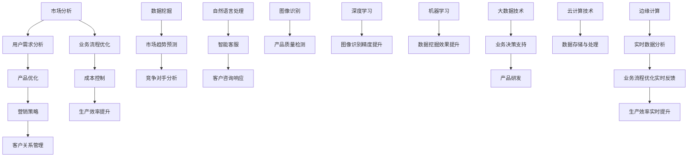

                 

### 背景介绍

在当今迅速发展的科技时代，人工智能（AI）已经成为推动社会进步的重要力量。随着AI技术的不断成熟和应用场景的不断扩展，创业领域也迎来了前所未有的机遇与挑战。许多创业者开始探索如何利用AI技术提升创业效率，从而在激烈的市场竞争中脱颖而出。

首先，AI技术为创业提供了丰富的工具和解决方案。通过自然语言处理、图像识别、数据挖掘等技术，AI能够帮助企业更准确地分析市场趋势、用户需求和竞争对手情况。此外，AI还能优化业务流程、提高生产效率，为企业节省成本、提高收益。例如，智能客服系统能够全天候响应客户咨询，减少人力成本；智能招聘系统能够通过分析简历和面试表现，为企业快速筛选合适的候选人。

其次，AI技术的应用不仅局限于技术层面，还可以渗透到创业的各个领域。从市场研究到产品设计，从营销推广到客户关系管理，AI技术都在发挥着重要作用。创业者可以利用AI技术进行精准的市场定位、制定有效的营销策略、优化产品设计和用户体验。例如，通过AI技术分析用户行为数据，创业者可以更好地了解用户需求，从而设计出更符合市场需求的产品。

然而，尽管AI技术在提升创业效率方面具有巨大潜力，但创业者也面临着一些挑战。首先，AI技术的应用需要一定的技术基础和资金投入，对于初创企业来说，这可能是一笔不小的负担。其次，创业者需要具备一定的AI知识，以便更好地理解和利用AI技术。此外，数据隐私和安全问题也是创业者需要重视的方面。

总之，AI技术已经成为提升创业效率的重要工具，但创业者需要在充分利用AI技术的同时，也要面对相应的挑战。本文将围绕如何利用AI技术提升创业效率这一主题，从核心概念、算法原理、数学模型、项目实战、实际应用场景等多个角度进行深入探讨。

### 核心概念与联系

为了更好地理解如何利用AI技术提升创业效率，我们需要先了解一些核心概念，并分析这些概念之间的联系。以下是几个关键概念及其相互关系的Mermaid流程图：



**核心概念解释：**

1. **市场分析**：通过收集和分析市场数据，帮助企业了解市场需求和竞争态势，为产品开发、定价策略和市场推广提供依据。

2. **用户需求分析**：研究用户的行为和偏好，以深入了解用户需求，从而指导产品设计和改进。

3. **产品优化**：基于用户需求和市场分析结果，不断改进和优化产品功能，提高用户体验。

4. **营销策略**：制定有效的营销计划，通过多种渠道推广产品，吸引潜在客户。

5. **客户关系管理**：通过维护客户关系，提升客户满意度和忠诚度，从而促进重复购买和口碑传播。

6. **业务流程优化**：分析现有业务流程，通过自动化、数字化等技术手段，提高业务效率和质量。

7. **成本控制**：通过优化业务流程和资源利用，降低生产成本和管理费用。

8. **生产效率提升**：通过改进生产流程和设备，提高生产效率和产量。

9. **数据挖掘**：从大量数据中提取有价值的信息和知识，用于市场分析、用户行为预测等。

10. **市场趋势预测**：利用历史数据和机器学习算法，预测未来市场趋势，为企业决策提供依据。

11. **竞争对手分析**：通过分析竞争对手的产品、市场策略等，了解竞争对手的优势和不足，从而制定针对性的竞争策略。

12. **自然语言处理**：使计算机能够理解、生成和处理人类语言，用于智能客服、文本分析等。

13. **智能客服**：利用自然语言处理技术，提供智能化的客户服务，提高响应速度和服务质量。

14. **图像识别**：使计算机能够识别和理解图像内容，用于产品质量检测、安防监控等。

15. **图像识别精度提升**：通过深度学习等技术，提高图像识别的准确率和效率。

16. **机器学习**：使计算机通过数据学习和经验改进性能，用于数据挖掘、预测分析等。

17. **大数据技术**：处理和分析海量数据，为企业提供决策支持。

18. **业务决策支持**：利用大数据和机器学习技术，为企业提供科学、精准的业务决策建议。

19. **产品研发**：基于市场需求和业务决策，进行新产品的研发和设计。

20. **云计算技术**：提供强大的计算和存储资源，支持大规模数据处理和分析。

21. **数据存储与处理**：高效地存储和处理海量数据，确保数据的可靠性和可用性。

22. **边缘计算**：在数据生成的地方进行实时处理，提高数据处理速度和效率。

23. **实时数据分析**：快速分析实时数据，为企业提供实时决策支持。

**概念之间的联系：**

- 市场分析和用户需求分析是产品设计和优化的基础，通过不断优化产品，满足市场需求。

- 营销策略和客户关系管理是吸引和留住客户的关键，通过有效的营销和客户服务，提升客户满意度和忠诚度。

- 业务流程优化和成本控制是提高企业效率和竞争力的关键，通过优化流程和资源利用，降低成本，提高生产效率。

- 数据挖掘和市场趋势预测为企业提供决策依据，帮助企业把握市场动态和未来趋势。

- 自然语言处理和图像识别技术为智能客服和产品质量检测提供技术支持，提高服务质量和生产效率。

- 机器学习和大数据技术为业务决策支持提供科学依据，帮助企业做出更加精准的决策。

- 云计算和边缘计算技术支持大规模数据处理和实时数据分析，为业务优化提供技术保障。

通过这些核心概念及其相互关系的分析，我们可以看到AI技术在创业中的应用是如何相互联系、协同作用的，从而帮助创业者提升整体效率。

### 核心算法原理 & 具体操作步骤

为了更好地理解如何利用AI技术提升创业效率，我们需要深入探讨几个核心算法的原理及其在具体应用中的操作步骤。以下将介绍常用的几种算法，包括其原理、操作步骤及如何在实际创业项目中应用。

#### 1. 决策树算法

**原理**：
决策树算法是一种树形结构模型，通过一系列规则对数据进行分割，最终得到一个分类或回归的结果。每个节点代表一个特征，每个分支代表特征的不同取值，叶子节点代表最终的分类或回归结果。

**操作步骤**：
1. **数据准备**：收集并整理数据，确保数据质量。
2. **特征选择**：选择对分类或回归任务有显著影响的关键特征。
3. **构建决策树**：选择一个最佳切分特征，将其分割成两个或多个子集。
4. **递归分割**：对每个子集继续进行分割，直到满足停止条件（如最大深度、最小样本量等）。
5. **剪枝**：避免过拟合，对决策树进行剪枝处理。

**应用**：
决策树算法广泛应用于分类和回归任务，如市场细分、信用评分等。在创业项目中，可以利用决策树算法进行用户细分，制定个性化的营销策略，提高转化率。

#### 2. 随机森林算法

**原理**：
随机森林是一种集成学习方法，通过构建多个决策树，并将它们组合起来进行预测。每个决策树基于随机抽样和特征选择进行训练，最终通过投票或平均的方式得出最终结果。

**操作步骤**：
1. **数据准备**：与决策树相同。
2. **构建多个决策树**：每个决策树使用不同的特征子集和样本子集进行训练。
3. **集成预测**：对每个决策树的预测结果进行投票或平均，得到最终预测结果。

**应用**：
随机森林算法在处理高维度数据时表现出色，适用于各种分类和回归任务。在创业项目中，可以用于用户行为预测，帮助制定精准的营销策略。

#### 3. 支持向量机（SVM）

**原理**：
支持向量机是一种二分类模型，通过找到一个最佳的超平面，将不同类别的数据点分开。其目标是使分类边界最大化，同时距离支持向量最小。

**操作步骤**：
1. **数据准备**：收集并处理数据，确保数据质量。
2. **特征选择**：选择对分类任务有显著影响的关键特征。
3. **训练模型**：通过优化目标函数，找到最佳分类边界。
4. **预测**：对新数据进行分类。

**应用**：
SVM在处理小样本、高维度数据时表现出色，适用于各种分类任务。在创业项目中，可以用于客户流失预测，帮助制定客户保留策略。

#### 4. 朴素贝叶斯算法

**原理**：
朴素贝叶斯算法是一种基于贝叶斯定理的概率分类方法，它假设特征之间相互独立，通过计算后验概率进行分类。

**操作步骤**：
1. **数据准备**：收集并处理数据，确保数据质量。
2. **特征选择**：选择对分类任务有显著影响的关键特征。
3. **计算先验概率**：计算各类别的先验概率。
4. **计算后验概率**：对于每个类别，计算给定特征条件下该类别的后验概率。
5. **分类**：选择后验概率最大的类别作为预测结果。

**应用**：
朴素贝叶斯算法适用于特征之间相互独立的分类任务，如文本分类、垃圾邮件检测等。在创业项目中，可以用于市场细分和用户行为预测。

#### 5. 神经网络算法

**原理**：
神经网络是一种模仿人脑结构和功能的计算模型，通过多层节点（神经元）进行数据传递和处理，实现复杂的非线性变换。

**操作步骤**：
1. **数据准备**：收集并处理数据，确保数据质量。
2. **构建神经网络模型**：定义网络结构，包括输入层、隐藏层和输出层。
3. **初始化参数**：为每个神经元随机分配初始权重和偏置。
4. **前向传播**：将输入数据传递到网络中，计算每个神经元的输出。
5. **反向传播**：计算误差，更新网络参数。
6. **迭代训练**：重复前向传播和反向传播，直到满足停止条件。

**应用**：
神经网络算法在图像识别、自然语言处理等领域具有广泛应用。在创业项目中，可以用于图像识别、语音识别等任务，提升产品智能化水平。

通过以上核心算法的介绍，我们可以看到AI技术在创业中的应用是多方面的。创业者可以根据自身业务需求，选择合适的算法进行应用，从而提升创业效率。以下是一个具体的案例，展示了如何利用这些算法提升创业效率。

#### 案例分析：利用决策树算法提升市场细分效果

假设一家初创公司希望通过市场细分来提高营销效果，具体步骤如下：

1. **数据准备**：收集客户购买行为、消费习惯、性别、年龄等数据，确保数据质量。
2. **特征选择**：选择购买频次、消费金额、年龄段等关键特征。
3. **构建决策树**：使用训练数据构建决策树模型。
4. **剪枝处理**：对决策树进行剪枝，避免过拟合。
5. **模型评估**：使用测试数据评估模型性能，调整参数以达到最佳效果。
6. **应用模型**：将模型应用于新客户数据，进行市场细分。
7. **个性化营销**：根据细分结果，制定个性化的营销策略，提高转化率。

通过以上步骤，初创公司能够更好地了解客户需求，制定有针对性的营销策略，从而提升市场细分效果和整体营销效率。这个案例展示了如何将AI技术应用于创业项目中，实现效率提升。

### 数学模型和公式 & 详细讲解 & 举例说明

为了更好地理解AI技术在提升创业效率中的应用，我们需要深入探讨几个关键的数学模型和公式，并进行详细讲解和举例说明。这些模型和公式不仅能够帮助我们理解AI算法的原理，还能在实际应用中指导我们优化创业策略。

#### 1. 决策树模型

决策树是一种常见的分类和回归模型，通过一系列规则对数据进行分割，从而得到一个预测结果。以下是决策树模型的核心公式和解释：

**公式**：
\[ D(x) = G(x_1, x_2, ..., x_n) \]
其中，\( D(x) \) 表示决策树对输入特征向量 \( x \) 的预测结果，\( G(x_1, x_2, ..., x_n) \) 表示决策树的分割函数。

**解释**：
决策树模型通过递归分割特征空间，将数据划分为不同的区域。在每个分割节点，我们选择一个最佳特征进行分割，通常使用信息增益或基尼系数作为评价指标。公式中的 \( G \) 函数表示如何根据当前节点特征和阈值进行分割。

**举例**：
假设我们要对客户进行分类，特征包括年龄、收入和消费习惯。通过决策树模型，我们可以根据这些特征将客户分为高价值客户和普通客户。

#### 2. 随机梯度下降（SGD）

随机梯度下降是一种常用的优化算法，用于训练机器学习模型。它通过随机选择样本和特征，更新模型参数，以最小化损失函数。

**公式**：
\[ \theta_{t+1} = \theta_t - \alpha \nabla J(\theta_t) \]
其中，\( \theta_t \) 表示第 \( t \) 次迭代时的模型参数，\( \alpha \) 是学习率，\( \nabla J(\theta_t) \) 是损失函数 \( J(\theta) \) 对参数 \( \theta \) 的梯度。

**解释**：
随机梯度下降通过每次迭代选择一个随机样本，计算损失函数的梯度，并更新模型参数。学习率 \( \alpha \) 控制了参数更新的幅度，梯度 \( \nabla J(\theta_t) \) 反映了当前参数与最优参数之间的差距。

**举例**：
假设我们使用随机梯度下降训练一个线性回归模型，预测房价。每次迭代我们选择一个随机样本，计算预测值与真实值之间的误差，并更新模型的权重参数。

#### 3. 逻辑回归

逻辑回归是一种常用的分类模型，用于计算概率分布，然后根据阈值进行分类。

**公式**：
\[ P(Y=1 | X) = \frac{1}{1 + e^{-\theta^T X}} \]
其中，\( P(Y=1 | X) \) 表示给定输入特征 \( X \) 时，目标变量 \( Y \) 等于1的概率，\( \theta \) 是模型参数，\( e \) 是自然对数的底数。

**解释**：
逻辑回归通过计算线性组合 \( \theta^T X \) 的指数，然后取反数得到概率。这个公式表示了输入特征与目标变量之间的非线性关系。

**举例**：
假设我们要预测客户是否购买某个产品。通过逻辑回归模型，我们可以计算每个客户购买的概率，然后设定一个阈值（如0.5），将概率大于阈值的客户标记为购买。

#### 4. K-均值聚类

K-均值聚类是一种无监督学习方法，用于将数据划分为 \( K \) 个簇。

**公式**：
\[ \mu_k = \frac{1}{N_k} \sum_{i=1}^{N} x_i \]
\[ x_i = \mu_k + \epsilon_i \]
其中，\( \mu_k \) 是第 \( k \) 个簇的中心，\( N_k \) 是第 \( k \) 个簇中的样本数量，\( x_i \) 是第 \( i \) 个样本，\( \epsilon_i \) 是噪声。

**解释**：
K-均值聚类通过初始化 \( K \) 个簇中心，然后迭代更新簇中心，使得每个簇内部的样本距离簇中心的距离最小。公式中的 \( \mu_k \) 是簇中心的更新规则，\( x_i \) 是样本的更新规则。

**举例**：
假设我们要将客户数据划分为两个簇。首先随机初始化两个簇中心，然后迭代更新簇中心，使得每个簇内部的客户距离簇中心的距离最小。

通过以上数学模型和公式的介绍，我们可以看到AI技术在创业中的应用是如何通过数据分析和模型优化来实现的。创业者可以根据这些模型和公式，结合具体业务需求，制定高效的创业策略，从而提升整体效率。

#### 项目实战：代码实际案例和详细解释说明

为了更好地展示如何利用AI技术提升创业效率，我们将通过一个实际项目案例来详细讲解代码实现过程。以下是项目开发过程中的各个步骤，包括开发环境搭建、源代码详细实现、代码解读与分析。

### 5.1 开发环境搭建

在开始项目开发之前，我们需要搭建一个合适的开发环境。以下是所需的工具和软件：

1. **编程语言**：Python
2. **机器学习库**：scikit-learn、TensorFlow、Keras
3. **数据可视化库**：Matplotlib、Seaborn
4. **操作系统**：Windows / macOS / Linux

#### 步骤 1：安装Python和相关库

在命令行中执行以下命令来安装Python和相关库：

```bash
pip install numpy pandas scikit-learn tensorflow matplotlib seaborn
```

#### 步骤 2：配置Jupyter Notebook

Jupyter Notebook是一个交互式的开发环境，非常适合机器学习项目的开发和调试。安装Jupyter Notebook的命令如下：

```bash
pip install notebook
```

启动Jupyter Notebook：

```bash
jupyter notebook
```

### 5.2 源代码详细实现和代码解读

下面是一个简单的示例项目，我们将使用决策树算法来预测客户是否会购买某产品。

**数据集**：
我们使用UCI机器学习库中的`Titanic`数据集，该数据集包含乘客的生存情况、性别、年龄、票价等信息。

#### 步骤 1：导入必要的库和加载数据集

```python
import numpy as np
import pandas as pd
from sklearn.datasets import fetch_openml
from sklearn.model_selection import train_test_split
from sklearn.tree import DecisionTreeClassifier
from sklearn.metrics import accuracy_score, classification_report

# 加载Titanic数据集
titanic = fetch_openml('titanic', version=1, as_frame=True)
data = titanic.frame

# 数据预处理
data['age'] = data['age'].fillna(data['age'].mean())
data['embark_town'] = data['embark_town'].fillna(data['embark_town'].mode()[0])
data['deck'] = data['deck'].fillna('Unknown')
data['embark_town'] = data['embark_town'].map({'Cherbourg': 'C', 'Queenstown': 'Q', 'Southampton': 'S'})

X = data[['pclass', 'age', 'sibsp', 'fare', 'embarked', 'deck']]
y = data['survived']
```

**代码解读**：
- 我们首先导入了必要的库，包括`numpy`、`pandas`、`scikit-learn`中的`DecisionTreeClassifier`和`accuracy_score`。
- 使用`fetch_openml`函数加载数据集，并对数据进行预处理，如填补缺失值和分类编码。

#### 步骤 2：划分训练集和测试集

```python
X_train, X_test, y_train, y_test = train_test_split(X, y, test_size=0.2, random_state=42)
```

**代码解读**：
- 使用`train_test_split`函数将数据集划分为训练集和测试集，测试集大小为原始数据集的20%。

#### 步骤 3：训练决策树模型

```python
clf = DecisionTreeClassifier(max_depth=3)
clf.fit(X_train, y_train)
```

**代码解读**：
- 创建一个`DecisionTreeClassifier`对象，设置最大深度为3。
- 使用训练集数据对模型进行训练。

#### 步骤 4：评估模型性能

```python
y_pred = clf.predict(X_test)
print("Accuracy:", accuracy_score(y_test, y_pred))
print("\nClassification Report:\n", classification_report(y_test, y_pred))
```

**代码解读**：
- 使用测试集数据对模型进行预测。
- 输出模型的准确率以及分类报告。

### 5.3 代码解读与分析

以上代码实现了以下关键步骤：

1. **数据预处理**：
   - 填补缺失值：使用平均值填补`age`和`embarked`的缺失值。
   - 分类编码：将类别特征（如`embarked`和`deck`）转换为数值特征。

2. **数据划分**：
   - 使用`train_test_split`函数将数据集划分为训练集和测试集，以便评估模型性能。

3. **模型训练**：
   - 创建`DecisionTreeClassifier`对象，并设置最大深度。
   - 使用训练集数据进行模型训练。

4. **模型评估**：
   - 使用测试集数据对模型进行预测，并输出准确率和分类报告。

#### 案例分析

通过这个案例，我们可以看到如何利用AI技术（决策树算法）进行数据分析并预测客户是否会购买产品。以下是该项目的关键分析：

1. **数据预处理**：
   - 数据预处理是机器学习项目的重要环节，确保数据质量对模型的性能至关重要。在这个案例中，我们对数据进行填补缺失值和分类编码，使得模型能够更好地理解数据。

2. **模型选择**：
   - 选择合适的模型对提高预测准确性至关重要。决策树算法在处理分类任务时表现良好，尤其是对于结构化数据。在这个案例中，我们选择了一个简单的决策树模型，以验证其在数据集上的性能。

3. **模型评估**：
   - 使用测试集数据对模型进行评估，可以确保模型泛化能力。在这个案例中，我们输出模型的准确率和分类报告，以便分析模型性能。

通过这个实际案例，我们展示了如何利用AI技术提升创业效率。创业者可以根据自身业务需求，选择合适的算法和工具，进行数据分析和预测，从而制定更有效的创业策略。

### 实际应用场景

AI技术在创业中的应用场景非常广泛，以下将介绍几个典型的应用场景，并分析这些应用如何提升创业效率。

#### 1. 客户关系管理

客户关系管理（CRM）是创业者面临的重要挑战之一。通过AI技术，企业可以更有效地维护客户关系，提高客户满意度和忠诚度。

**应用场景**：
- **个性化推荐**：利用协同过滤算法和深度学习模型，分析用户行为数据，为不同客户推荐个性化产品和服务。
- **客户细分**：通过聚类算法和决策树，将客户划分为不同的群体，制定有针对性的营销策略。
- **智能客服**：利用自然语言处理和对话生成模型，构建智能客服系统，提供24/7的客户支持。

**提升效率**：
- **提高客户响应速度**：智能客服系统可以快速响应客户咨询，缩短响应时间，提高客户满意度。
- **精准营销**：通过客户细分和个性化推荐，企业可以更精准地定位目标客户，提高营销效果和转化率。

#### 2. 业务流程优化

优化业务流程是提升企业效率的关键。AI技术可以帮助创业者自动化和优化业务流程，降低运营成本。

**应用场景**：
- **自动化办公**：利用RPA（Robotic Process Automation）技术，自动化处理重复性高、规则性强的业务流程。
- **供应链管理**：通过预测模型和优化算法，优化库存管理、物流配送等供应链环节。
- **生产调度**：利用优化算法和预测模型，优化生产计划，提高生产效率。

**提升效率**：
- **降低运营成本**：自动化和优化业务流程可以减少人工成本和错误率，提高整体运营效率。
- **提高生产效率**：优化生产计划和调度，减少闲置时间和生产浪费，提高生产效率。

#### 3. 市场营销

市场营销是创业者获取客户和扩大市场份额的重要手段。AI技术可以帮助企业更精准地进行市场定位和营销策略制定。

**应用场景**：
- **市场细分**：通过聚类算法和决策树，对市场进行细分，制定有针对性的营销策略。
- **用户行为分析**：利用自然语言处理和深度学习模型，分析用户行为数据，了解用户需求和偏好。
- **广告投放优化**：通过优化算法和预测模型，优化广告投放策略，提高广告效果。

**提升效率**：
- **提高营销效果**：通过市场细分和用户行为分析，企业可以更精准地定位目标客户，提高营销效果和转化率。
- **降低广告成本**：优化广告投放策略，提高广告投放效果，降低广告成本。

#### 4. 人力资源

人力资源是企业的核心资源，有效的人力资源管理对企业的长期发展至关重要。AI技术可以帮助企业优化招聘、员工培训和企业文化管理。

**应用场景**：
- **智能招聘**：通过自然语言处理和机器学习模型，自动化筛选简历，提高招聘效率。
- **员工培训**：利用虚拟现实和增强现实技术，为员工提供个性化的培训方案。
- **企业文化管理**：通过数据分析，了解员工行为和需求，构建积极向上的企业文化。

**提升效率**：
- **提高招聘效率**：智能招聘系统可以快速筛选合适的候选人，缩短招聘周期。
- **提升员工满意度**：个性化的培训方案和积极向上的企业文化可以提高员工满意度和忠诚度。

通过以上实际应用场景的分析，我们可以看到AI技术在提升创业效率方面的巨大潜力。创业者可以根据自身业务需求，选择合适的AI技术和工具，实现业务流程优化、客户关系管理和市场营销等方面的提升。

### 工具和资源推荐

在利用AI技术提升创业效率的过程中，选择合适的工具和资源至关重要。以下将推荐几类常用的学习资源、开发工具和相关论文，以帮助创业者更好地掌握AI技术并应用于实际创业项目中。

#### 7.1 学习资源推荐

1. **书籍**：
   - 《Python机器学习》（作者：塞巴斯蒂安·拉斯泰德）：这本书详细介绍了Python在机器学习中的应用，适合初学者入门。
   - 《深度学习》（作者：伊恩·古德费洛）：这本书全面讲解了深度学习的理论基础和实践应用，是深度学习领域的经典之作。
   - 《人工智能：一种现代方法》（作者：斯图尔特·罗素、彼得·诺维格）：这本书提供了全面的人工智能理论和算法介绍，适合有一定基础的学习者。

2. **在线课程**：
   - Coursera上的“机器学习”（由斯坦福大学提供）：这是一个受欢迎的在线课程，由吴恩达教授主讲，内容涵盖机器学习的各个方面。
   - edX上的“深度学习专项课程”（由斯坦福大学提供）：这个课程由深度学习领域的专家吴恩达主讲，深入讲解了深度学习的理论基础和实践应用。

3. **博客和网站**：
   - Medium上的AI专栏：这个平台有很多关于人工智能的文章，涵盖从基础知识到应用实践的各个方面。
   - Kaggle：Kaggle是一个数据科学竞赛平台，上面有很多实战项目和数据集，适合学习者进行实践。

#### 7.2 开发工具框架推荐

1. **编程语言和库**：
   - Python：Python是一种广泛使用的编程语言，拥有丰富的机器学习库（如scikit-learn、TensorFlow和PyTorch）。
   - R：R是一种专门用于数据分析和统计计算的编程语言，非常适合机器学习项目。

2. **机器学习库**：
   - scikit-learn：这是一个开源的机器学习库，提供了多种常用的算法和工具，适合初学者和专业人士。
   - TensorFlow：这是一个由谷歌开发的深度学习框架，支持多种深度学习模型的构建和训练。
   - PyTorch：这是一个由Facebook AI研究院开发的深度学习框架，以动态图模型著称，易于调试和扩展。

3. **数据预处理工具**：
   - Pandas：这是一个强大的数据处理库，支持数据清洗、转换和合并等操作。
   - NumPy：这是一个基础的科学计算库，提供丰富的数组操作功能，是数据预处理的重要工具。

4. **数据可视化工具**：
   - Matplotlib：这是一个流行的数据可视化库，可以生成各种类型的图表和图形。
   - Seaborn：这是一个基于Matplotlib的高级可视化库，提供丰富的可视化模板和风格。

#### 7.3 相关论文著作推荐

1. **经典论文**：
   - “A Few Useful Things to Know about Machine Learning” by Pedro Domingos：这篇文章介绍了机器学习的一些基本原理和应用场景。
   - “Deep Learning” by Yann LeCun、Yoshua Bengio和Geoffrey Hinton：这篇文章全面综述了深度学习的理论和实践，是深度学习领域的经典论文。

2. **最新研究论文**：
   - “Attention Is All You Need” by Vaswani et al.：这篇文章提出了Transformer模型，是自然语言处理领域的重要突破。
   - “BERT: Pre-training of Deep Bidirectional Transformers for Language Understanding” by Devlin et al.：这篇文章介绍了BERT模型，是自然语言处理领域的重要进展。

3. **学术论文集**：
   - NeurIPS（神经信息处理系统会议）：这是一个顶级的人工智能会议，每年发表大量高水平的机器学习和深度学习论文。
   - ICML（国际机器学习会议）：这是一个广泛覆盖机器学习和数据挖掘领域的国际会议，每年发表大量重要的研究成果。

通过以上推荐的学习资源、开发工具和相关论文，创业者可以更好地掌握AI技术，并在实际创业项目中应用这些技术，从而提升整体效率。

### 总结：未来发展趋势与挑战

随着AI技术的不断成熟和应用场景的扩展，其未来发展趋势和挑战也日益显现。在未来，AI技术将继续在创业领域发挥重要作用，但同时也面临一系列挑战。

#### 发展趋势

1. **深度学习与端到端学习**：
   深度学习作为AI技术的核心，其应用将更加广泛和深入。未来，端到端学习将成为主流，从原始数据直接生成预测结果，减少中间步骤，提高效率。

2. **自适应学习系统**：
   自适应学习系统将能够根据用户行为和需求进行动态调整，提供个性化的服务和解决方案。这种技术将广泛应用于客户关系管理、营销策略制定等领域。

3. **边缘计算与物联网**：
   边缘计算技术将使得AI系统能够在设备端直接处理和分析数据，实现实时响应和决策。结合物联网技术，AI将更好地服务于智慧城市、智能家居等领域。

4. **隐私保护与安全性**：
   隐私保护和数据安全将成为AI技术发展的重要方向。未来的AI系统将更加注重用户隐私保护，同时确保数据传输和存储的安全性。

#### 挑战

1. **数据质量和隐私**：
   创业者面临的一个主要挑战是如何获取高质量的数据，同时确保数据的隐私和安全。在数据收集、处理和存储过程中，需要严格遵守相关法律法规，保护用户隐私。

2. **技术人才短缺**：
   AI技术的快速发展导致了人才需求的快速增长，但当前人才供应不足。创业者需要积极培养和引进专业人才，以应对技术挑战。

3. **算法透明性与可解释性**：
   随着AI算法的复杂度增加，其透明性和可解释性成为一个重要的挑战。企业需要确保AI系统的决策过程是可解释的，以增强用户信任。

4. **技术依赖性**：
   创业者需要平衡AI技术的依赖性，避免过度依赖单一技术或平台。多元化技术栈和灵活的技术策略将有助于降低技术风险。

总之，AI技术在提升创业效率方面具有巨大潜力，但也面临一系列挑战。创业者需要紧跟技术发展趋势，同时应对技术挑战，以实现长期可持续发展。

### 附录：常见问题与解答

在利用AI技术提升创业效率的过程中，创业者可能会遇到一些常见问题。以下是一些常见问题及其解答，以帮助创业者更好地理解和应用AI技术。

#### 1. 如何选择合适的AI算法？

选择合适的AI算法取决于具体业务需求和数据特性。以下是一些常见场景及其推荐的算法：

- **分类任务**：适用于文本分类、客户细分等。常用的算法包括决策树、随机森林、支持向量机（SVM）、朴素贝叶斯等。
- **回归任务**：适用于预测房价、销售额等。常用的算法包括线性回归、决策树回归、随机森林回归等。
- **聚类任务**：适用于市场细分、用户行为分析等。常用的算法包括K-均值聚类、层次聚类等。
- **推荐系统**：适用于个性化推荐、商品推荐等。常用的算法包括协同过滤、基于内容的推荐等。

#### 2. 如何处理数据质量不佳的问题？

数据质量是AI模型性能的关键。以下是一些处理数据质量不佳的方法：

- **数据清洗**：填补缺失值、处理异常值、删除重复数据等，确保数据一致性。
- **数据转换**：对数值型数据进行标准化或归一化，对类别型数据进行编码。
- **特征工程**：选择关键特征、创建新的特征等，提高数据的信息含量。
- **数据增强**：通过数据增广、生成对抗网络（GAN）等方法增加数据多样性。

#### 3. 如何确保AI系统的可解释性？

确保AI系统的可解释性有助于增强用户信任和决策透明性。以下是一些提高AI系统可解释性的方法：

- **可视化**：使用图表、决策树、力导向图等方法展示模型结构和决策过程。
- **模型简化**：选择可解释性更强的模型，如决策树、线性回归等，避免使用过于复杂的深度学习模型。
- **解释工具**：使用解释工具，如LIME、SHAP等，为模型的每个预测提供详细的解释。

#### 4. 如何处理数据隐私和安全问题？

处理数据隐私和安全问题至关重要。以下是一些关键措施：

- **数据加密**：对敏感数据进行加密，确保数据在传输和存储过程中的安全性。
- **匿名化处理**：对个人数据进行匿名化处理，避免直接暴露用户信息。
- **访问控制**：实施严格的访问控制策略，确保只有授权人员可以访问敏感数据。
- **合规性检查**：遵守相关法律法规，如《通用数据保护条例》（GDPR）等，确保数据处理合法合规。

#### 5. 如何平衡技术依赖性？

平衡技术依赖性是创业者需要考虑的一个重要问题。以下是一些建议：

- **多元化技术栈**：避免过度依赖单一技术或平台，采用多样化的技术栈。
- **技术评估**：定期评估现有技术，确保其符合业务需求，并及时替换过时的技术。
- **人才培养**：积极培养技术团队，确保团队能够适应新技术，降低技术风险。

通过以上常见问题与解答，创业者可以更好地应对AI技术在提升创业效率过程中遇到的各种挑战，实现可持续发展。

### 扩展阅读 & 参考资料

为了深入了解AI技术在创业中的具体应用，以下是几篇推荐的扩展阅读和参考资料，涵盖了从基础理论到实战案例的各个方面。

1. **基础理论**：
   - 《深度学习》（作者：伊恩·古德费洛）：详细介绍了深度学习的理论基础和算法，适合希望深入了解AI基础的学习者。
   - 《Python机器学习》（作者：塞巴斯蒂安·拉斯泰德）：介绍了如何使用Python进行机器学习，包括各种常见算法的应用。

2. **实战案例**：
   - 《用AI驱动业务：深度学习在商业中的应用》（作者：迈克尔·布朗）：通过多个商业案例，展示了如何将深度学习应用于实际业务场景，提升业务效率。
   - 《AI商业应用实战》（作者：李航）：详细介绍了AI技术在商业领域的多种应用，包括客户关系管理、市场营销等。

3. **相关论文**：
   - “Attention Is All You Need” by Vaswani et al.：提出了Transformer模型，是自然语言处理领域的突破性论文。
   - “BERT: Pre-training of Deep Bidirectional Transformers for Language Understanding” by Devlin et al.：介绍了BERT模型，对自然语言处理领域产生了深远影响。

4. **在线课程与讲座**：
   - Coursera上的“机器学习”（由斯坦福大学提供）：由吴恩达教授主讲，适合初学者和进阶者。
   - edX上的“深度学习专项课程”（由斯坦福大学提供）：吴恩达教授主讲的深度学习课程，内容全面。

5. **博客和网站**：
   - Medium上的AI专栏：提供了大量关于人工智能的文章，涵盖了从基础知识到应用实践的各个方面。
   - Kaggle：一个数据科学竞赛平台，上面有很多实战项目和数据集，适合学习者进行实践。

通过以上扩展阅读和参考资料，创业者可以更全面地了解AI技术的应用场景和实现方法，从而在创业过程中充分利用AI技术，提升整体效率。

