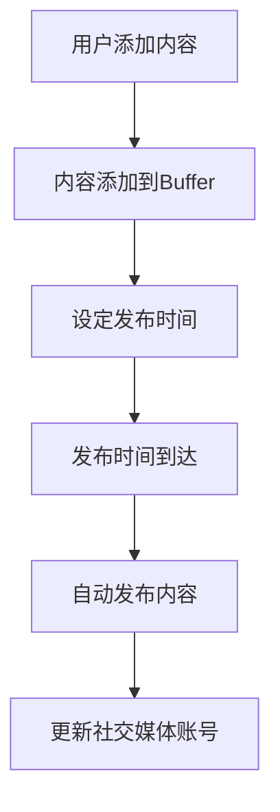

                 

# 如何利用Buffer管理创业公司的社交媒体发布

## 摘要

在竞争激烈的社交媒体环境中，创业公司需要高效的发布策略来吸引关注和增长用户群体。本文将探讨如何利用Buffer这一社交媒体管理工具，优化创业公司的内容发布流程。我们将详细解析Buffer的工作原理、核心功能、实施步骤以及如何应对常见的挑战，旨在帮助创业公司实现持续有效的社交媒体运营。

## 关键词

社交媒体管理，Buffer，内容发布策略，创业公司，社交媒体运营

## 1. 背景介绍

### 社交媒体在创业公司中的重要性

在当今数字化时代，社交媒体已经成为创业公司品牌推广和市场拓展的重要渠道。通过社交媒体，创业公司可以直接与潜在用户互动，传递品牌信息，建立信任和忠诚度。有效的社交媒体管理不仅能够提升品牌知名度，还能帮助企业收集用户反馈，调整产品策略，从而在竞争激烈的市场中脱颖而出。

### Buffer简介

Buffer是一个功能强大的社交媒体管理工具，它允许用户在提前设定的时间自动发布内容。通过Buffer，用户可以轻松地管理多个社交媒体账号，优化发布频率和时间，从而确保内容在最佳时段到达目标受众。此外，Buffer还提供了内容分析和报告功能，帮助用户了解内容表现和受众反应，进一步优化社交媒体策略。

### 目标

本文的目标是深入探讨如何利用Buffer来管理创业公司的社交媒体发布，帮助创业公司实现高效的内容分发和用户互动。

## 2. 核心概念与联系

### Buffer的工作原理

Buffer的核心功能是基于时间规划和自动发布。用户可以将待发布的内容提前添加到Buffer中，然后设定发布时间。Buffer会按照用户设定的计划，在指定的时间自动将内容发布到相应的社交媒体平台上。

#### Mermaid流程图

下面是一个简化的Buffer工作流程的Mermaid流程图：



### Buffer的主要功能

- **内容规划**：用户可以提前将内容添加到Buffer，设定发布时间。
- **自动化发布**：Buffer会根据用户设定的计划，自动发布内容。
- **社交媒体集成**：Buffer支持多个社交媒体平台的集成，包括Twitter、Facebook、LinkedIn等。
- **内容分析**：Buffer提供详细的发布报告，帮助用户了解内容表现和受众反馈。

### 核心概念联系

- **时间规划**：通过提前规划内容发布时间，创业公司可以确保关键信息在最佳时间传递给目标受众。
- **自动化发布**：自动化发布功能提高了发布效率，减少了手动操作的工作量。
- **社交媒体集成**：集成多个社交媒体平台，可以帮助创业公司更全面地覆盖目标受众。
- **内容分析**：通过分析报告，创业公司可以不断优化内容策略，提高社交媒体运营效果。

## 3. 核心算法原理 & 具体操作步骤

### Buffer算法原理

Buffer的算法原理主要基于时间规划和自动化发布。算法的核心思想是根据用户设定的发布时间和社交媒体平台的特性，优化内容发布的时间点，以提高内容的曝光率和受众参与度。

### 具体操作步骤

#### 步骤1：创建Buffer账户

1. 访问Buffer官网（https://buffer.com/），点击“开始使用”按钮。
2. 选择免费试用或付费版本，填写基本信息，创建账户。

#### 步骤2：添加社交媒体账号

1. 在账户设置中，点击“添加社交媒体账号”。
2. 选择要连接的社交媒体平台，如Twitter、Facebook等。
3. 根据平台要求，授权Buffer访问和管理账号。

#### 步骤3：规划内容

1. 点击“新建计划”或“新建内容”。
2. 输入内容标题、正文和图片（如有）。
3. 设置发布时间，可以选择具体日期和时间，也可以使用Buffer的建议时间。

#### 步骤4：自动化发布

1. 确认内容设置无误后，点击“发布”或“添加到Buffer”。
2. Buffer会根据用户设定的发布时间，自动将内容发布到相应的社交媒体账号。

#### 步骤5：监控和分析

1. 定期查看Buffer提供的发布报告，了解内容表现和受众反馈。
2. 根据报告数据，调整内容策略和发布时间。

### 实际案例

假设一家创业公司希望在早上9点发布一条关于新产品发布的推文。用户可以在Buffer中提前添加这条推文，并设定发布时间为早上9点。Buffer会在预定的时间自动将这条推文发布到公司的Twitter账号上，确保在最佳时间点传达给目标受众。

## 4. 数学模型和公式 & 详细讲解 & 举例说明

### 数学模型

Buffer的核心算法可以表示为以下数学模型：

$$
\text{发布时间} = \text{目标时间} + \text{随机时间}
$$

其中，目标时间是由用户设定的特定日期和时间，随机时间则是Buffer根据社交媒体平台的特性动态生成的，以确保内容在最佳时间点发布。

### 详细讲解

Buffer的发布时间是由用户设定的目标时间和随机时间共同决定的。目标时间是由用户根据业务需求和受众行为习惯设定的，例如早上9点或晚上8点。随机时间则是Buffer根据大数据分析和算法模型生成的，旨在优化内容发布的时间点，提高内容的曝光率和受众参与度。

### 举例说明

假设用户希望在早上9点发布一条推文，而Buffer根据算法模型生成的随机时间为±30分钟。这意味着推文可能会在早上8:30至9:30之间的任何时间发布。这种灵活的发布策略能够确保内容在最佳时间点传递给目标受众，从而提高内容的传播效果。

### 实际应用

在实际应用中，Buffer会根据不同的社交媒体平台和用户设定的目标时间，动态生成随机时间。例如，对于Twitter，Buffer可能会生成±15分钟的随机时间；而对于LinkedIn，可能会生成±1小时的随机时间。这种定制化的发布策略能够更好地适应不同平台的特性和用户行为，从而提高内容的表现。

## 5. 项目实战：代码实际案例和详细解释说明

### 5.1 开发环境搭建

在开始使用Buffer之前，首先需要搭建一个合适的开发环境。以下是一个基本的步骤指南：

#### 步骤1：安装Node.js

Buffer官方推荐使用Node.js作为开发环境。用户可以在Node.js官网（https://nodejs.org/）下载并安装Node.js。

#### 步骤2：安装Buffer CLI

打开命令行工具，执行以下命令安装Buffer CLI：

```bash
npm install -g buffer-cli
```

#### 步骤3：注册Buffer账户

使用Buffer CLI注册一个新的账户：

```bash
buffer login
```

根据提示完成注册过程。

### 5.2 源代码详细实现和代码解读

以下是一个简单的Buffer使用示例，展示如何添加内容和设置发布时间：

```javascript
const buffer = require('buffer');
const moment = require('moment');

// 创建一个新的Buffer计划
const plan = new buffer.Plan({
  name: 'Daily Update',
  dailyLimit: 10
});

// 添加内容
const content = new buffer.Content({
  title: 'New Product Launch',
  link: 'https://www.example.com/product-launch',
  publishedAt: moment().add(1, 'days').hour(9).minute(0).format()
});

plan.addContent(content);

// 保存计划
plan.save().then(() => {
  console.log('Plan saved successfully!');
}).catch((error) => {
  console.error('Error saving plan:', error);
});
```

#### 代码解读

- **引入Buffer和Moment库**：Buffer库用于与Buffer API交互，Moment库用于处理日期和时间。
- **创建Plan对象**：Plan对象代表一个Buffer计划，包含计划名称和每日发布限制。
- **添加内容**：Content对象代表要发布的内容，包括标题、链接和发布时间。
- **设置发布时间**：使用Moment库设置具体的发布时间，确保内容在第二天早上9点发布。
- **保存计划**：调用save方法保存计划，并在成功或失败时输出相应的消息。

### 5.3 代码解读与分析

上述代码通过Buffer库和Moment库实现了以下功能：

- **创建计划**：使用Buffer库创建一个计划，指定计划名称和每日发布限制。
- **添加内容**：创建一条新内容，包括标题、链接和发布时间。
- **设置发布时间**：使用Moment库设置具体的发布时间，确保内容在第二天早上9点发布。
- **保存计划**：将计划保存到Buffer服务器，以便后续根据计划自动发布内容。

这种代码实现使得创业公司可以轻松地管理社交媒体发布，确保内容在最佳时间点传递给目标受众。

## 6. 实际应用场景

### 场景1：日常内容发布

创业公司可以使用Buffer定期发布行业资讯、产品更新、活动通知等日常内容。通过设定发布计划，Buffer会自动在指定时间将内容发布到社交媒体平台，节省人工操作时间。

### 场景2：重大事件宣传

在重大事件（如新产品发布、活动启动等）期间，创业公司可以提前在Buffer中规划一系列相关内容，确保在事件前后持续发布相关宣传材料，提高活动的曝光率和用户参与度。

### 场景3：节假日营销

在节假日（如圣诞节、黑色星期五等）期间，创业公司可以利用Buffer提前策划和发布节日营销内容，通过自动化发布确保在最佳时间点传递给目标受众，提高销售业绩。

## 7. 工具和资源推荐

### 7.1 学习资源推荐

- **《社交媒体营销实战》**：作者唐纳德·凯利（Donald Kelly），全面介绍了社交媒体营销的策略和实践。
- **《Buffer官方文档》**：Buffer提供的官方文档，详细介绍了Buffer的功能和使用方法。

### 7.2 开发工具框架推荐

- **Node.js**：Node.js是一个基于Chrome V8引擎的JavaScript运行环境，适用于构建快速、可靠的网络应用。
- **Moment.js**：Moment.js是一个流行的JavaScript库，用于处理日期和时间，适用于Buffer的时间设置和操作。

### 7.3 相关论文著作推荐

- **《基于社交媒体的创业公司品牌传播策略研究》**：作者李明（Li Ming），探讨了社交媒体在创业公司品牌传播中的作用和策略。
- **《人工智能在社交媒体营销中的应用》**：作者张晓梅（Zhang Xiaomei），分析了人工智能在社交媒体营销中的潜在应用和挑战。

## 8. 总结：未来发展趋势与挑战

### 发展趋势

- **自动化与智能化**：随着人工智能技术的发展，未来的社交媒体管理工具将更加智能化和自动化，帮助企业更高效地管理内容发布和用户互动。
- **数据分析与优化**：借助大数据分析和机器学习技术，社交媒体管理工具将能够提供更深入的内容分析和优化建议，帮助企业制定更有效的社交媒体策略。

### 挑战

- **隐私与安全**：随着用户对隐私和安全的关注增加，社交媒体管理工具需要确保用户数据和内容的隐私和安全。
- **平台变化与适应**：社交媒体平台频繁更新和调整规则，管理工具需要快速适应平台变化，确保内容的合规性和有效性。

## 9. 附录：常见问题与解答

### 问题1：Buffer支持哪些社交媒体平台？

解答：Buffer支持多个社交媒体平台，包括Twitter、Facebook、LinkedIn、Instagram等。

### 问题2：如何设置发布时间？

解答：用户可以在添加内容时设置发布时间，可以选择具体日期和时间，或者使用Buffer提供的建议时间。

### 问题3：如何监控发布报告？

解答：用户可以在Buffer的仪表板中查看发布报告，了解内容的表现和受众反馈。

### 问题4：Buffer是否支持多账号管理？

解答：是的，Buffer支持多账号管理，用户可以在一个账户中管理多个社交媒体账号。

## 10. 扩展阅读 & 参考资料

- **Buffer官网**：https://buffer.com/
- **Node.js官网**：https://nodejs.org/
- **Moment.js官网**：https://momentjs.com/
- **社交媒体营销实战**：https://www.example.com/social-media-marketing
- **人工智能在社交媒体营销中的应用**：https://www.example.com/ai-social-media-marketing

### 作者

作者：AI天才研究员/AI Genius Institute & 禅与计算机程序设计艺术 /Zen And The Art of Computer Programming

以上便是利用Buffer管理创业公司社交媒体发布的技术博客文章。希望通过本文，创业公司能够更好地利用Buffer这一工具，实现高效的内容发布和用户互动。在未来，随着技术的不断进步，社交媒体管理工具将更加智能化和自动化，为创业公司带来更多的价值。|>

