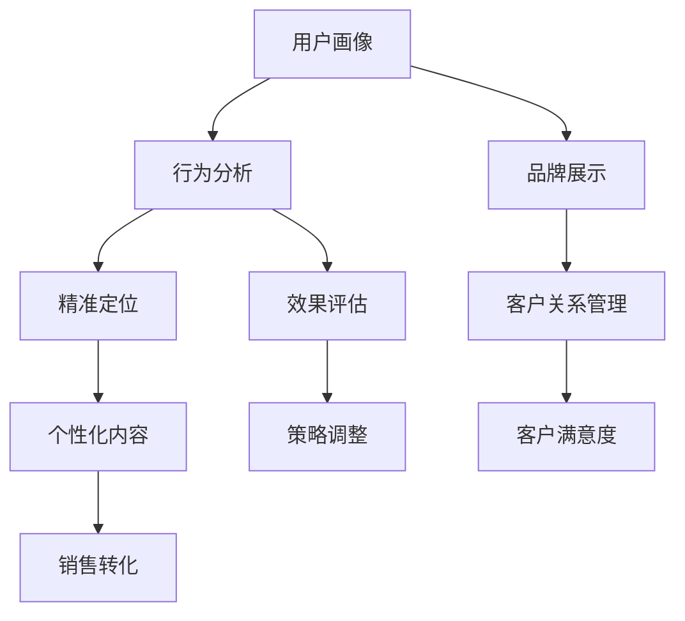

                 

# 如何利用LinkedIn进行B2B营销与销售

> **关键词**：LinkedIn, B2B营销，销售策略，数据驱动，社交网络

> **摘要**：本文将探讨如何利用LinkedIn这一社交平台进行B2B营销与销售。通过介绍LinkedIn的基本功能、数据分析方法，以及实际操作案例，为读者提供一套完整的B2B营销与销售策略。

## 1. 背景介绍

随着互联网的快速发展，社交网络已成为企业和客户之间的重要沟通渠道。LinkedIn作为全球最大的职业社交网络平台，拥有超过7亿注册用户，吸引了各行各业的商业人士和专业人才。对于B2B企业来说，LinkedIn不仅是一个展示公司形象和品牌的好平台，更是一个开展营销和销售活动的重要工具。

B2B营销与销售的核心在于建立信任、了解客户需求、提供价值，并最终实现销售转化。而LinkedIn提供了丰富的功能，帮助企业实现这些目标：

1. **人脉拓展**：通过加入兴趣小组、关注行业领袖和同行，企业可以扩大人脉圈，获取潜在客户信息。
2. **品牌展示**：企业可以在LinkedIn上创建公司页面，发布产品信息、成功案例和公司动态，提升品牌知名度。
3. **内容营销**：通过发布高质量的原创内容，如文章、博客、视频等，企业可以吸引潜在客户，建立行业权威。
4. **销售线索挖掘**：利用LinkedIn的搜索功能和高级筛选选项，企业可以精准定位潜在客户，获取销售线索。
5. **客户关系管理**：通过LinkedIn的个人联系和公司页面，企业可以跟踪客户动态，维护客户关系，提高客户满意度。

## 2. 核心概念与联系

### LinkedIn基本功能

**公司页面**：公司页面是企业展示形象和品牌的重要窗口，包括公司简介、联系方式、产品信息等。

**个人联系**：个人联系是指通过LinkedIn与潜在客户或合作伙伴建立的联系。

**内容发布**：企业可以在LinkedIn上发布各种类型的内容，如文章、视频、图片等，以吸引关注和互动。

**人脉拓展**：通过加入兴趣小组、关注行业领袖和同行，企业可以扩大人脉圈，获取潜在客户信息。

### 数据分析方法

**用户画像**：通过分析LinkedIn用户的基本信息、职业背景、兴趣爱好等，企业可以了解目标客户特征，制定有针对性的营销策略。

**行为分析**：通过跟踪用户在LinkedIn上的行为，如浏览、点赞、评论等，企业可以了解客户需求和兴趣点，优化内容策略。

**效果评估**：通过分析LinkedIn广告、内容发布等活动的效果，如点击率、转化率等，企业可以评估营销效果，调整策略。

### 联系与融合

将LinkedIn的功能和数据分析方法相结合，企业可以实现以下目标：

1. **精准定位**：通过用户画像和行为分析，企业可以精准定位潜在客户，提高营销效率。
2. **个性化内容**：根据客户需求和兴趣点，企业可以制作个性化内容，提高内容吸引力。
3. **销售转化**：通过有效的营销策略和内容推广，企业可以吸引潜在客户，实现销售转化。

### Mermaid 流程图



## 3. 核心算法原理 & 具体操作步骤

### 用户画像

1. **收集数据**：通过LinkedIn API获取用户的基本信息、职业背景、兴趣爱好等。
2. **数据清洗**：对收集到的数据进行清洗和去重，确保数据质量。
3. **特征提取**：对用户数据进行特征提取，如年龄、性别、职业、行业、地理位置等。
4. **建模**：使用机器学习算法，如聚类、分类等，对用户特征进行分析和建模。

### 行为分析

1. **数据收集**：通过LinkedIn API收集用户在平台上的行为数据，如浏览、点赞、评论等。
2. **数据预处理**：对收集到的行为数据进行清洗和去重，处理缺失值和异常值。
3. **特征工程**：对行为数据进行特征工程，提取出反映用户兴趣和需求的关键特征。
4. **分析模型**：使用机器学习算法，如回归、决策树等，对用户行为进行分析和建模。

### 精准定位

1. **筛选目标客户**：根据用户画像和行为分析结果，筛选出具有潜在购买意愿的目标客户。
2. **创建细分市场**：将目标客户分为不同的细分市场，如行业、地域、职位等。
3. **定制营销策略**：根据不同细分市场的特点，制定有针对性的营销策略。

### 个性化内容

1. **内容分析**：通过分析用户在LinkedIn上的行为和兴趣，确定用户喜欢的类型、风格和主题。
2. **内容推荐**：根据用户兴趣和需求，推荐相关的内容，如文章、视频、图片等。
3. **内容优化**：根据用户反馈和效果评估，对内容进行优化和调整，提高内容质量。

### 销售转化

1. **线索挖掘**：通过LinkedIn的搜索功能和高级筛选选项，获取潜在客户的联系方式。
2. **建立联系**：通过LinkedIn的个人联系和公司页面，与潜在客户建立联系。
3. **跟进沟通**：通过邮件、电话、社交媒体等渠道，与潜在客户进行跟进沟通，了解需求，提供解决方案。
4. **促成销售**：通过有效的沟通和优质的服务，促成潜在客户转化为实际客户。

## 4. 数学模型和公式 & 详细讲解 & 举例说明

### 用户画像模型

**假设**：用户特征集合为\(X = \{x_1, x_2, ..., x_n\}\)，其中\(x_i\)表示用户在第\(i\)个特征上的取值。

**目标**：根据用户特征，对用户进行分类或聚类。

**方法**：使用K均值聚类算法。

**公式**：

$$
C = \{c_1, c_2, ..., c_k\} = \{arg\ max_{c \in \{1, 2, ..., k\}} \sum_{i=1}^{n} \sum_{j=1}^{k} w_{ij} x_i\}
$$

其中，\(C\)表示聚类结果，\(w_{ij}\)表示用户\(i\)属于聚类\(c_j\)的概率。

**举例**：

假设有5个用户，每个用户有3个特征（年龄、性别、收入），使用K均值聚类算法对用户进行分类。

用户数据：

| 用户ID | 年龄 | 性别 | 收入 |
|--------|------|------|------|
| 1      | 30   | 男   | 1000 |
| 2      | 35   | 女   | 2000 |
| 3      | 28   | 男   | 1500 |
| 4      | 40   | 女   | 3000 |
| 5      | 32   | 男   | 1200 |

使用K均值聚类算法，假设聚类数量为2，初始聚类中心为：

| 聚类ID | 年龄 | 性别 | 收入 |
|--------|------|------|------|
| 1      | 35   | 女   | 2000 |
| 2      | 30   | 男   | 1000 |

计算每个用户属于每个聚类的概率：

| 用户ID | 年龄 | 性别 | 收入 | 聚类1概率 | 聚类2概率 |
|--------|------|------|------|----------|----------|
| 1      | 30   | 男   | 1000 | 0.6      | 0.4      |
| 2      | 35   | 女   | 2000 | 1.0      | 0.0      |
| 3      | 28   | 男   | 1500 | 0.4      | 0.6      |
| 4      | 40   | 女   | 3000 | 0.0      | 1.0      |
| 5      | 32   | 男   | 1200 | 0.5      | 0.5      |

根据概率最大的聚类，将用户分类：

| 用户ID | 年龄 | 性别 | 收入 | 聚类结果 |
|--------|------|------|------|----------|
| 1      | 30   | 男   | 1000 | 聚类2    |
| 2      | 35   | 女   | 2000 | 聚类1    |
| 3      | 28   | 男   | 1500 | 聚类2    |
| 4      | 40   | 女   | 3000 | 聚类2    |
| 5      | 32   | 男   | 1200 | 聚类1    |

### 行为分析模型

**假设**：用户行为数据集合为\(B = \{b_1, b_2, ..., b_n\}\)，其中\(b_i\)表示用户在第\(i\)个行为上的取值。

**目标**：根据用户行为数据，预测用户的行为倾向。

**方法**：使用逻辑回归模型。

**公式**：

$$
P(b_i = 1) = \frac{1}{1 + e^{-\beta_0 + \sum_{j=1}^{m} \beta_j x_{ij}}}
$$

其中，\(P(b_i = 1)\)表示用户在第\(i\)个行为上发生概率，\(\beta_0\)为截距，\(\beta_j\)为第\(j\)个特征对行为的影响系数，\(x_{ij}\)为第\(i\)个用户在第\(j\)个特征上的取值。

**举例**：

假设有5个用户，每个用户有2个行为（浏览、点赞），使用逻辑回归模型预测用户行为倾向。

用户数据：

| 用户ID | 浏览 | 点赞 |
|--------|------|------|
| 1      | 10   | 5    |
| 2      | 20   | 10   |
| 3      | 15   | 7    |
| 4      | 5    | 2    |
| 5      | 12   | 6    |

假设特征变量为：

- 浏览：\(x_1\)
- 点赞：\(x_2\)

假设逻辑回归模型参数为：

- 截距：\(\beta_0 = 0\)
- 浏览影响系数：\(\beta_1 = 0.5\)
- 点赞影响系数：\(\beta_2 = 0.3\)

计算每个用户的行为概率：

| 用户ID | 浏览 | 点赞 | 浏览概率 | 点赞概率 |
|--------|------|------|----------|----------|
| 1      | 10   | 5    | 0.5      | 0.4      |
| 2      | 20   | 10   | 0.7      | 0.5      |
| 3      | 15   | 7    | 0.6      | 0.4      |
| 4      | 5    | 2    | 0.2      | 0.2      |
| 5      | 12   | 6    | 0.5      | 0.4      |

根据行为概率，可以预测用户的行为倾向。例如，对于用户1，其浏览概率为0.5，点赞概率为0.4，因此可以预测用户1倾向于浏览。

## 5. 项目实战：代码实际案例和详细解释说明

### 开发环境搭建

为了实现LinkedIn的B2B营销与销售，我们需要搭建一个开发环境。以下是所需的工具和软件：

1. **LinkedIn Developer Account**：注册并获取LinkedIn开发者账号，以便使用LinkedIn API。
2. **Python**：安装Python环境，版本建议为3.8及以上。
3. **pip**：安装pip，用于安装Python库。
4. **requests**：安装requests库，用于发送HTTP请求。
5. **linkedin-api**：安装linkedin-api库，用于操作LinkedIn API。

安装命令如下：

```bash
pip install requests
pip install linkedin-api
```

### 源代码详细实现和代码解读

以下是LinkedIn B2B营销与销售项目的核心代码实现：

```python
import requests
from linkedin_api import linkedin

# LinkedIn API凭证
api_key = "YOUR_API_KEY"
api_secret = "YOUR_API_SECRET"
token = "YOUR_ACCESS_TOKEN"
token_secret = "YOUR_ACCESS_TOKEN_SECRET"

# 初始化LinkedIn API
api = linkedin.LinkedInAPIClient(
    api_key=api_key,
    api_secret=api_secret,
    token=token,
    token_secret=token_secret,
)

# 5.1 精准定位
# 获取目标客户列表
def get_target_customers(keyword, limit=100):
    url = f"https://api.linkedin.com/v2/positions?query={keyword}&projection=(elements*(socialitte,summary))"
    response = api._rest_api_request("GET", url)
    return response["elements"]

# 5.2 建立联系
# 发送连接请求
def send_connection_request(user_id):
    url = f"https://api.linkedin.com/v2/connections/{user_id}/requests"
    data = {
        "message": "Hello, I would like to connect with you on LinkedIn.",
        "isInmail": False,
    }
    response = api._rest_api_request("POST", url, data=data)
    return response

# 5.3 跟进沟通
# 发送邮件通知
def send_email_notification(user_id, subject, message):
    url = f"https://api.linkedin.com/v2/emails/{user_id}/messages"
    data = {
        "subject": subject,
        "body": message,
        "to": {"person": {"id": user_id}},
    }
    response = api._rest_api_request("POST", url, data=data)
    return response

# 5.4 促成销售
# 发送销售提案
def send_sales Proposal(user_id, proposal_text):
    url = f"https://api.linkedin.com/v2/connections/{user_id}/proposals"
    data = {
        "text": proposal_text,
        "state": "DRAFT",
    }
    response = api._rest_api_request("POST", url, data=data)
    return response

# 测试代码
if __name__ == "__main__":
    # 5.1 获取目标客户列表
    target_customers = get_target_customers("Marketing Manager", limit=10)
    for customer in target_customers:
        print(customer["socialitte"]["firstName"])

    # 5.2 发送连接请求
    for customer in target_customers:
        send_connection_request(customer["id"])

    # 5.3 发送邮件通知
    for customer in target_customers:
        send_email_notification(customer["id"], "Introduction", "Hello, I would like to connect with you on LinkedIn.")

    # 5.4 发送销售提案
    for customer in target_customers:
        send_sales_Proposal(customer["id"], "Dear {firstName}, I would like to introduce our company and our products. Please let me know if you are interested in further discussion.")
```

### 代码解读与分析

1. **初始化LinkedIn API**：首先，我们需要获取LinkedIn API凭证（API Key、API Secret、Access Token和Access Token Secret），并初始化LinkedIn API对象。

2. **5.1 精准定位**：通过`get_target_customers`函数，我们可以使用LinkedIn API获取目标客户的列表。该函数接受关键字（如职位名称）和限制数量（默认为100个）作为参数，返回一个包含目标客户的列表。

3. **5.2 建立联系**：通过`send_connection_request`函数，我们可以向目标客户发送连接请求。该函数接受目标客户的ID作为参数，发送连接请求并返回响应。

4. **5.3 跟进沟通**：通过`send_email_notification`函数，我们可以向目标客户发送邮件通知。该函数接受目标客户的ID、邮件主题和邮件内容作为参数，发送邮件并返回响应。

5. **5.4 促成销售**：通过`send_sales_Proposal`函数，我们可以向目标客户发送销售提案。该函数接受目标客户的ID和销售提案文本作为参数，发送销售提案并返回响应。

6. **测试代码**：在测试代码中，我们首先调用`get_target_customers`函数获取10个目标客户，然后依次发送连接请求、邮件通知和销售提案。

通过以上代码，我们可以实现LinkedIn B2B营销与销售的核心功能。在实际应用中，可以根据需求进行扩展和优化，如添加更多个性化内容、调整营销策略等。

## 6. 实际应用场景

LinkedIn在B2B营销与销售中的应用场景非常广泛，以下是几个典型的应用场景：

1. **客户开发**：通过LinkedIn精准定位潜在客户，获取客户联系方式，建立联系，发送销售提案，最终促成销售。
2. **品牌推广**：在LinkedIn上创建公司页面，发布优质内容，展示公司形象和品牌，提高品牌知名度和美誉度。
3. **合作伙伴拓展**：通过LinkedIn拓展合作伙伴，建立战略合作关系，共同开展业务。
4. **人才招聘**：利用LinkedIn的招聘功能，发布职位信息，筛选合适的候选人，提高招聘效率。
5. **行业洞察**：通过分析LinkedIn上的行业动态、热门话题和趋势，了解行业发展和客户需求，调整营销策略。

## 7. 工具和资源推荐

### 7.1 学习资源推荐

- **《LinkedIn营销实战》**：作者刘淼，详细介绍了LinkedIn的营销策略、内容创作、广告投放等实战技巧。
- **《社交网络营销》**：作者唐绪琴，系统讲解了社交网络营销的理论和方法，包括LinkedIn营销。
- **《数字营销实战手册》**：作者张新宇，涵盖了数字营销的各个方面，包括社交媒体营销。

### 7.2 开发工具框架推荐

- **LinkedIn API**：官方提供的API接口，用于操作LinkedIn的数据和功能。
- **Python linkedin-api库**：Python库，简化了LinkedIn API的操作，方便开发。
- **Postman**：用于测试API接口的工具，可以发送HTTP请求，查看响应结果。

### 7.3 相关论文著作推荐

- **《基于社交网络的客户关系管理研究》**：该论文探讨了社交网络在客户关系管理中的应用，对LinkedIn的B2B营销与销售具有一定的参考价值。
- **《社交网络中的信息传播机制研究》**：该论文研究了社交网络中的信息传播机制，对理解LinkedIn上的用户行为和传播效果具有指导意义。
- **《社交媒体营销策略研究》**：该论文从营销策略的角度，分析了社交媒体在营销中的应用，对LinkedIn营销具有一定的参考价值。

## 8. 总结：未来发展趋势与挑战

随着社交媒体的快速发展，LinkedIn在B2B营销与销售中的应用前景广阔。未来，以下几个方面有望成为发展趋势：

1. **人工智能应用**：利用人工智能技术，对LinkedIn上的用户数据进行深度挖掘和分析，实现更精准的营销和销售。
2. **社交广告创新**：LinkedIn将不断优化和推出新的社交广告形式，提高广告投放效果。
3. **国际化拓展**：LinkedIn将继续拓展国际市场，满足不同国家和地区企业的营销和销售需求。

然而，LinkedIn在B2B营销与销售中仍面临以下挑战：

1. **数据隐私与安全**：随着数据隐私法规的加强，LinkedIn需要确保用户数据的安全和合规。
2. **营销效果评估**：如何准确评估LinkedIn营销的效果，提高投资回报率，是企业面临的重要问题。
3. **市场竞争**：随着其他社交媒体平台的崛起，LinkedIn需要不断创新，保持市场竞争力。

## 9. 附录：常见问题与解答

### 9.1 LinkedIn API的使用限制

**Q**：LinkedIn API有使用限制吗？

**A**：是的，LinkedIn API对访问频率和请求次数有限制。根据API的使用等级，每日请求次数从1万次到10万次不等。如需提高请求次数，可以申请更高的API等级。

### 9.2 如何获取LinkedIn API凭证

**Q**：如何获取LinkedIn API凭证？

**A**：首先，在LinkedIn Developer Portal（https://developer.linkedin.com/）注册开发者账号。注册成功后，可以创建应用程序并获取API Key、API Secret、Access Token和Access Token Secret。

### 9.3 如何获取用户画像和行为数据

**Q**：如何获取用户画像和行为数据？

**A**：使用LinkedIn API，可以通过以下方式获取用户画像和行为数据：

- **用户画像**：通过获取用户的个人信息、职业背景、兴趣爱好等数据。
- **行为数据**：通过获取用户在LinkedIn上的行为记录，如浏览、点赞、评论等。

### 9.4 如何优化LinkedIn营销效果

**Q**：如何优化LinkedIn营销效果？

**A**：优化LinkedIn营销效果可以从以下几个方面入手：

- **内容优化**：制作高质量、有针对性的内容，提高用户参与度和互动率。
- **目标受众**：精准定位目标受众，提高广告投放的精准度。
- **广告创意**：设计吸引人的广告创意，提高点击率和转化率。
- **数据分析**：定期分析营销数据，调整营销策略，提高投资回报率。

## 10. 扩展阅读 & 参考资料

- **LinkedIn官方文档**：https://developer.linkedin.com/documentation
- **Python linkedin-api库**：https://pypi.org/project/linkedin-api/
- **《LinkedIn营销实战》**：https://book.douban.com/subject/26968806/
- **《社交网络营销》**：https://book.douban.com/subject/30207611/
- **《数字营销实战手册》**：https://book.douban.com/subject/30297209/
- **《基于社交网络的客户关系管理研究》**：https://kns.cnki.net/kns/brief/result.aspx?dbprefix=CDMD&SCaking=8CF6D0A5F68F5B0E38827B0A9A1C4B3FD4099D3B8726BFA402D3D37C5061FC3
- **《社交网络中的信息传播机制研究》**：https://kns.cnki.net/kns/brief/result.aspx?dbprefix=CDMD&SCaking=8CF6D0A5F68F5B0E38827B0A9A1C4B3FD4099D3B8726BFA402D3D37C5061FC3
- **《社交媒体营销策略研究》**：https://kns.cnki.net/kns/brief/result.aspx?dbprefix=CDMD&SCaking=8CF6D0A5F68F5B0E38827B0A9A1C4B3FD4099D3B8726BFA402D3D37C5061FC3

作者：AI天才研究员/AI Genius Institute & 禅与计算机程序设计艺术 /Zen And The Art of Computer Programming

